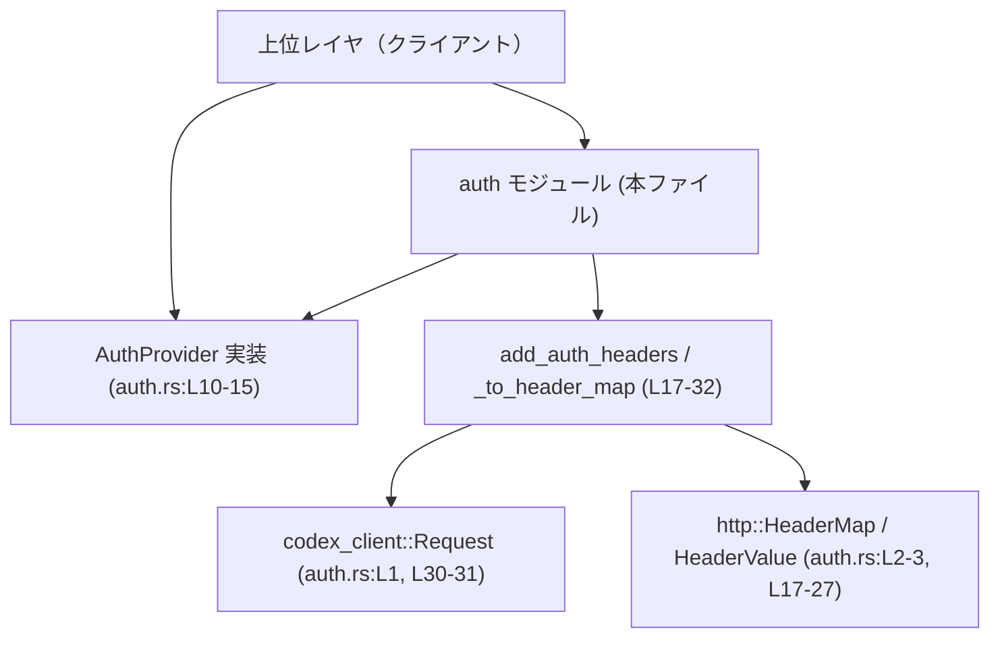
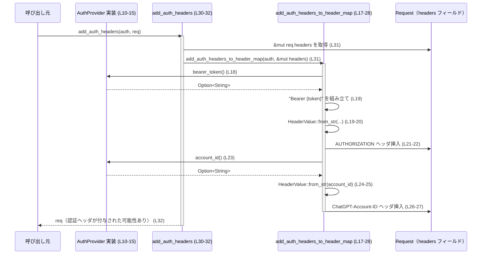

# codex-api/src/auth.rs コード解説

---

## 0. ざっくり一言

HTTP リクエストに対して、Bearer トークンとアカウント ID をヘッダとして付与するための認証インターフェイス（`AuthProvider`）と、そのヘッダを `HeaderMap` / `Request` に差し込むユーティリティ関数を定義するモジュールです（auth.rs:L5-15, L17-32）。

---

## 1. このモジュールの役割

### 1.1 概要

- このモジュールは **API リクエストに必要な認証情報（Bearer トークンとアカウント ID）を提供し、HTTP ヘッダに追加する** ために存在します（auth.rs:L5-9, L17-27）。
- 認証情報の取得は `AuthProvider` トレイトで抽象化され、トークンの取得方法や管理方法は実装側に委ねられます（auth.rs:L10-15）。
- 取得した認証情報は `add_auth_headers_to_header_map` / `add_auth_headers` 関数を通じて `http::HeaderMap` および `codex_client::Request` に適用されます（auth.rs:L17-32）。

### 1.2 アーキテクチャ内での位置づけ

上位レイヤ（クライアントコード）が用意した `AuthProvider` 実装と `Request` を受け取り、このモジュールが HTTP ヘッダの形に変換して差し込みます。



- `AuthProvider` は上位レイヤが実装し、トークンやアカウント ID のソースになります（auth.rs:L10-15）。
- このモジュールの関数は `AuthProvider` から値を取り出し、`HeaderValue` に変換して `HeaderMap` に挿入します（auth.rs:L17-27）。
- `add_auth_headers` は `Request` の `headers` フィールドを `HeaderMap` として扱い、同じロジックを適用します（auth.rs:L30-31）。

### 1.3 設計上のポイント

- **トレイトによる依存性の抽象化**  
  認証情報の取得は `AuthProvider` トレイトで定義されており、具体的な実装（固定トークン、リフレッシュ付きトークンなど）はこのモジュール外に委ねられています（auth.rs:L10-15）。

- **スレッドセーフな実装前提**  
  `AuthProvider: Send + Sync` により、このトレイトを実装した型はスレッド間で安全に共有できることが求められます（auth.rs:L10）。  
  → 並行処理環境で同一の認証プロバイダを共有できる前提です。

- **同期・軽量なインターフェイス**  
  ドキュメンテーションコメントで「実装は cheap（軽量）かつ non-blocking（ブロックしない）べき」「非同期 I/O は上位レイヤで処理すべき」と明示されています（auth.rs:L5-9）。  
  → `bearer_token` / `account_id` 内でネットワークアクセスやディスク I/O を行わない前提の設計です。

- **オプション値としての認証情報**  
  `bearer_token` と `account_id` は両方とも `Option<String>` を返し、値が存在しないケースを表現できます（auth.rs:L11-13）。  
  `account_id` には `None` を返すデフォルト実装があり、必須ではないことが分かります（auth.rs:L12-13）。

- **ヘッダ挿入の失敗は無視**  
  `HeaderMap::insert` の戻り値は `_` に束縛されており、成功・失敗のいずれの場合も呼び出し元には通知されません（auth.rs:L21-22, L26-27）。

- **ヘッダ値のバリデーションは http クレートに委譲**  
  `HeaderValue::from_str` の成否でヘッダ値の妥当性を判定し、`Err` の場合はヘッダを挿入しません（auth.rs:L19-20, L24-25）。

---

## 2. 主要な機能一覧

- `AuthProvider` トレイト: Bearer トークンとアカウント ID を提供するインターフェイス（auth.rs:L10-15）。
- `add_auth_headers_to_header_map`: `AuthProvider` から認証情報を取得し、`HeaderMap` に `Authorization` / `ChatGPT-Account-ID` ヘッダを挿入する関数（auth.rs:L17-28）。
- `add_auth_headers`: 上記関数を使って `codex_client::Request` に認証ヘッダを付与し、同じ `Request` を返す関数（auth.rs:L30-32）。

### 2.1 コンポーネント一覧（インベントリー）

| 名称 | 種別 | 可視性 | 位置 | 役割 / 用途 |
|------|------|--------|------|-------------|
| `AuthProvider` | トレイト | `pub` | auth.rs:L10-15 | 認証情報（Bearer トークン、アカウント ID）を提供するインターフェイス。`Send + Sync` 制約付き。 |
| `AuthProvider::bearer_token` | メソッド | トレイトの一部 | auth.rs:L11 | Bearer トークンを `Option<String>` で返す。`None` の場合はトークンなし。 |
| `AuthProvider::account_id` | メソッド（デフォルト実装あり） | トレイトの一部 | auth.rs:L12-13 | アカウント ID を `Option<String>` で返す。デフォルトでは常に `None`。 |
| `add_auth_headers_to_header_map` | 関数 | `pub(crate)` | auth.rs:L17-28 | 与えられた `HeaderMap` に認証ヘッダを（存在する場合のみ）挿入する。 |
| `add_auth_headers` | 関数 | `pub(crate)` | auth.rs:L30-32 | `Request` の `headers` に対して `add_auth_headers_to_header_map` を適用し、同じ `Request` を返す。 |

---

## 3. 公開 API と詳細解説

### 3.1 型一覧

| 名前 | 種別 | 役割 / 用途 |
|------|------|-------------|
| `AuthProvider` | トレイト | API リクエストで使用する Bearer トークンとアカウント ID を提供する抽象インターフェイス（auth.rs:L10-15）。 |

このチャンクには構造体や列挙体の定義は現れず、`AuthProvider` の具体実装は他ファイル／他モジュールに存在すると考えられますが、このチャンクからは詳細不明です。

### 3.2 関数・メソッド詳細

#### `AuthProvider::bearer_token(&self) -> Option<String>`

**定義位置:** auth.rs:L11（トレイト本体は L10-15）

**概要**

- 認証に使用する Bearer トークンを返すメソッドです。
- トークンが利用できない場合は `None` を返すことができます（auth.rs:L11）。

**引数**

| 引数名 | 型 | 説明 |
|--------|----|------|
| `&self` | `&Self` | 認証プロバイダ自身への共有参照。`AuthProvider` は `Send + Sync` なので、複数スレッドから同時に呼び出される可能性があります（auth.rs:L10）。 |

**戻り値**

- 型: `Option<String>`（auth.rs:L11）
  - `Some(String)`: `"Bearer "` を付加して `Authorization` ヘッダに埋め込まれるトークン文字列。
  - `None`: トークンが存在しない／付与しないことを表します。この場合、`Authorization` ヘッダは追加されません（auth.rs:L17-22）。

**内部処理の流れ**

- トレイトメソッドであり、本ファイル内には具体的な実装はありません（auth.rs:L10-15）。
- 実際の処理内容は、`AuthProvider` を実装する各型に依存します。

**Examples（使用例）**

以下は、固定文字列のトークンを返す単純な実装例です。

```rust
use codex_api::auth::AuthProvider; // 実際のパスはこのチャンクには現れません
// ↑ このファイルのトレイトをインポートする想定です。

// 固定トークンを返す実装
struct StaticAuth {
    token: String,  // Bearer トークン文字列を保持
}

impl AuthProvider for StaticAuth {
    fn bearer_token(&self) -> Option<String> {
        // 所有権を維持するためにクローンして返す
        Some(self.token.clone())
    }
}
```

※ `AuthProvider` の実際のモジュールパスはこのチャンクからは分からないため、インポート行は例示的なものです。

**Errors / Panics**

- このメソッド自体のエラー条件やパニック条件はトレイトからは定義されていません。
- 実装によっては内部で `Result` を扱い、エラー時に `None` を返す、あるいは `panic!` するなどが考えられますが、このチャンクからは挙動は不明です。

**Edge cases（エッジケース）**

- `None` を返した場合  
  → `add_auth_headers_to_header_map` 内で `if let Some(token) = ...` によってスキップされ、`Authorization` ヘッダは付与されません（auth.rs:L17-22）。
- 空文字列 `Some(String::new())` を返した場合  
  → `"Bearer "` のみのヘッダ値が生成されます。`HeaderValue::from_str` は空白を含む値の扱いに制約があるため、成功するかどうかは http クレートの仕様に依存し、このチャンクからは断定できません（auth.rs:L19）。

**使用上の注意点**

- ドキュメントコメントにある通り、**I/O を伴うような重い処理やブロッキング処理を内部で行わない** 前提です（auth.rs:L5-9）。
- トークンを生成するために内部状態を書き換える場合は、`Send + Sync` 制約および `&self` での呼び出しを前提に、`Mutex` 等を利用したスレッドセーフな実装が必要になります（auth.rs:L10）。
- セキュリティ上、トークン文字列をログ出力したり、不要に `clone` してメモリ上に多数保持する設計は避ける必要があります（これは一般的なセキュリティ上の注意であり、このチャンクに直接の記述はありません）。

---

#### `AuthProvider::account_id(&self) -> Option<String>`

**定義位置:** auth.rs:L12-13

**概要**

- 認証に関連するアカウント ID を返すメソッドです。
- デフォルト実装では `None` を返し、アカウント ID を使わない実装も許容しています（auth.rs:L12-13）。

**引数**

| 引数名 | 型 | 説明 |
|--------|----|------|
| `&self` | `&Self` | 認証プロバイダへの共有参照。`Send + Sync` なため、並行呼び出しが想定されます（auth.rs:L10）。 |

**戻り値**

- 型: `Option<String>`（auth.rs:L12-13）
  - `Some(String)`: `ChatGPT-Account-ID` ヘッダに設定されるアカウント ID。
  - `None`: アカウント ID を付与しないことを意味し、この場合ヘッダは追加されません（auth.rs:L23-27）。

**内部処理の流れ**

- デフォルト実装は単に `None` を返します（auth.rs:L12-13）。
- アカウント ID を利用したい場合は、トレイト実装側でこのメソッドを上書きする必要があります。

**Examples（使用例）**

```rust
impl AuthProvider for StaticAuth {
    fn bearer_token(&self) -> Option<String> {
        Some(self.token.clone())
    }

    fn account_id(&self) -> Option<String> {
        // アカウント ID を固定値として返す例
        Some("account-123".to_string())
    }
}
```

**Errors / Panics**

- デフォルト実装は `None` を返すだけであり、パニックやエラーは発生しません（auth.rs:L12-13）。
- 上書きした実装での挙動はこのチャンクからは不明です。

**Edge cases（エッジケース）**

- `None` の場合  
  → `ChatGPT-Account-ID` ヘッダは挿入されません（auth.rs:L23-27）。
- `Some` に渡した文字列が `HeaderValue::from_str` にとって不正な場合  
  → `add_auth_headers_to_header_map` 内の `let Ok(header) = HeaderValue::from_str(&account_id)` が失敗し、その場合もヘッダは追加されません（auth.rs:L23-25）。

**使用上の注意点**

- `account_id` は任意の情報であり、デフォルトでは使用されません。必要なときのみ実装すればよい設計です（auth.rs:L12-13）。
- アカウント ID の形式や値の制約はこのチャンクには現れませんが、HTTP ヘッダ値として有効な文字列にする必要があります（auth.rs:L24-25）。

---

#### `add_auth_headers_to_header_map<A: AuthProvider>(auth: &A, headers: &mut HeaderMap)`

**定義位置:** auth.rs:L17-28

**概要**

- `AuthProvider` から Bearer トークンとアカウント ID を取得し、対応する HTTP ヘッダを `HeaderMap` に挿入します。
- 挿入されるヘッダ:
  - `Authorization: Bearer {token}`（auth.rs:L18-21）
  - `ChatGPT-Account-ID: {account_id}`（auth.rs:L23-27）

**引数**

| 引数名 | 型 | 説明 |
|--------|----|------|
| `auth` | `&A`（`A: AuthProvider`） | 認証情報を提供する `AuthProvider` 実装への共有参照（auth.rs:L17）。 |
| `headers` | `&mut HeaderMap` | 認証ヘッダを追加する対象のヘッダマップ（auth.rs:L17）。 |

**戻り値**

- 返り値は `()`（暗黙）であり、この関数自体は値を返しません（auth.rs:L17-28）。
- ヘッダの挿入結果（成功／既存値の上書き／失敗）は `HeaderMap::insert` の戻り値として内部で取得されますが、それを `_` に代入して破棄しているため呼び出し元からは観測できません（auth.rs:L21-22, L26-27）。

**内部処理の流れ（アルゴリズム）**

1. `auth.bearer_token()` を呼び出し、`Option<String>` を取得します（auth.rs:L18）。
2. 同じ `if let` 内で `HeaderValue::from_str(&format!("Bearer {token}"))` を試し、両方が成功した場合のみ `Authorization` ヘッダを挿入します（auth.rs:L18-21）。
   - 文字列は `"Bearer {token}"` の形式で組み立てられます（auth.rs:L19）。
   - 挿入先のヘッダ名は `http::header::AUTHORIZATION` です（auth.rs:L21）。
3. 次に `auth.account_id()` を呼び出して `Option<String>` を取得します（auth.rs:L23）。
4. 同様に `HeaderValue::from_str(&account_id)` を試し、両方が成功した場合のみ `"ChatGPT-Account-ID"` ヘッダを挿入します（auth.rs:L23-27）。
5. いずれの挿入においても `headers.insert` の戻り値は `_` に束縛され、捨てられます（auth.rs:L21-22, L26-27）。

**Examples（使用例）**

`HeaderMap` に対して直接ヘッダを付与する例です。

```rust
use http::HeaderMap;
use codex_api::auth::{AuthProvider, add_auth_headers_to_header_map}; // パスは例示

struct StaticAuth {
    token: String,
    account_id: Option<String>,
}

impl AuthProvider for StaticAuth {
    fn bearer_token(&self) -> Option<String> {
        Some(self.token.clone())
    }

    fn account_id(&self) -> Option<String> {
        self.account_id.clone()
    }
}

fn main() {
    let auth = StaticAuth {
        token: "my-token".to_string(),
        account_id: Some("account-123".to_string()),
    };

    let mut headers = HeaderMap::new();                    // 空のヘッダマップを作成
    add_auth_headers_to_header_map(&auth, &mut headers);  // 認証ヘッダを追加

    // ここで headers に Authorization / ChatGPT-Account-ID が入っている可能性がある
}
```

**Errors / Panics**

- 関数内で `unwrap!` や `expect!` は使われておらず、`HeaderValue::from_str` のエラーも `if let Ok(..)` で吸収しているため、**この関数からパニックが発生する要素は見当たりません**（auth.rs:L18-21, L23-27）。
- `HeaderMap::insert` が返すエラー類（例えばメモリ不足など）は、このインターフェイスでは観測できません（auth.rs:L21-22, L26-27）。

**Edge cases（エッジケース）**

- `bearer_token()` が `None` の場合（auth.rs:L18）  
  → `Authorization` ヘッダは追加されません。
- `bearer_token()` が `Some` だが、`"Bearer {token}"` が `HeaderValue::from_str` による検証に失敗した場合（auth.rs:L19-20）  
  → ヘッダは追加されません。原因は呼び出し側には伝わりません。
- `account_id()` が `None` の場合（auth.rs:L23）  
  → `ChatGPT-Account-ID` ヘッダは追加されません。
- `account_id()` が `Some` だが、`HeaderValue::from_str` が失敗した場合（auth.rs:L24-25）  
  → ヘッダは追加されません。
- 既に同名のヘッダが存在する場合  
  → `HeaderMap::insert` の仕様により上書きされる可能性が高いですが、このチャンクには `HeaderMap` の詳細仕様は現れません。

**使用上の注意点**

- この関数は `AuthProvider` のメソッドを呼ぶだけであり、I/O は行いません（auth.rs:L17-28）。  
  → 実際のパフォーマンス特性は `AuthProvider` 実装に依存します。
- 挿入の成功・失敗・上書きの有無を判定する仕組みは提供していないため、**ヘッダが実際に追加されたかどうかは呼び出し側からは確認できません**（auth.rs:L21-22, L26-27）。
- セキュリティ上、`HeaderMap` をログに出力する場合には、トークンやアカウント ID が含まれる可能性がある点に注意が必要です（一般的注意）。

---

#### `add_auth_headers<A: AuthProvider>(auth: &A, mut req: Request) -> Request`

**定義位置:** auth.rs:L30-32

**概要**

- `AuthProvider` と `Request` を受け取り、その `Request` のヘッダに認証ヘッダを付与したうえで、同じ `Request` インスタンスを返します（auth.rs:L30-32）。
- 実処理は `add_auth_headers_to_header_map` に委譲されています（auth.rs:L31）。

**引数**

| 引数名 | 型 | 説明 |
|--------|----|------|
| `auth` | `&A`（`A: AuthProvider`） | 認証情報を取得する `AuthProvider` 実装への共有参照（auth.rs:L30）。 |
| `req` | `Request` | ヘッダを追加対象とするリクエスト。`mut` で受け取ることでヘッダを書き換えますが、最終的に所有権は呼び出し側へ戻されます（auth.rs:L30-32）。 |

**戻り値**

- 型: `Request`（auth.rs:L30）
  - 認証ヘッダ付与処理を通過したリクエスト。  
    実際にヘッダが追加されたかどうかは、前述の条件に依存します（auth.rs:L31）。

**内部処理の流れ**

1. `req.headers` への可変参照を取り出し、それを `add_auth_headers_to_header_map(auth, &mut req.headers)` に渡します（auth.rs:L31）。
   - このことから、`Request` が `HeaderMap` と互換の `headers` フィールドを持つ設計であることが推測できますが、型定義はこのチャンクには現れません。
2. `add_auth_headers_to_header_map` がヘッダの挿入処理を行います（auth.rs:L31）。
3. 修正された `req` をそのまま返します（auth.rs:L32）。

**Examples（使用例）**

`Request` の具体的な構築方法はこのチャンクには現れないため、雰囲気だけを示す例になります。

```rust
use codex_client::Request;
use codex_api::auth::{AuthProvider, add_auth_headers}; // パスは例示

fn send_request<A: AuthProvider>(auth: &A, mut req: Request) {
    // 認証ヘッダを付与
    let req = add_auth_headers(auth, req);

    // ここで req を HTTP クライアントに渡して送信する想定
    // send(req);
}
```

**Errors / Panics**

- 自身は単にヘッダマップを渡して返すだけであり、パニックやエラー処理は行っていません（auth.rs:L30-32）。
- 実際のエラー可能性は、内部で呼び出される `add_auth_headers_to_header_map` と、その中で使用される `AuthProvider` 実装、および `HeaderMap` に依存します（auth.rs:L31）。

**Edge cases（エッジケース）**

- `AuthProvider` が `None` を返す場合、前述の通り対象ヘッダは追加されません（auth.rs:L18, L23）。
- `Request` の `headers` が既に `Authorization` や `ChatGPT-Account-ID` を持つ場合の挙動（上書きかどうか）は `HeaderMap::insert` の仕様に従い、このチャンクからは詳しくは分かりません。

**使用上の注意点**

- 所有権の観点では、`req` を一旦この関数に渡し、同じ `req` が返ってくる形です（auth.rs:L30-32）。  
  → 呼び出し側は必ず返り値を受け取って後続処理に渡す必要があります。
- この関数はシグネチャ上 `pub(crate)` であり、**クレート内からのみ利用可能** です（auth.rs:L30）。クレート外からは `AuthProvider` を通じた別の API で利用される設計であることが推測されますが、このチャンクには現れません。

---

### 3.3 その他の関数

- このチャンクには、上記以外の関数定義は存在しません。

---

## 4. データフロー

### 4.1 代表的なフロー: Request への認証ヘッダ付与

上位コードが `AuthProvider` 実装と `Request` を用意し、`add_auth_headers` を呼ぶことで、トークンおよびアカウント ID に応じたヘッダが `Request` に挿入されます（auth.rs:L17-32）。



**要点**

- 認証情報の取得は `AuthProvider` の責務であり、このモジュールはそれを HTTP ヘッダの形に変換して挿入するだけです（auth.rs:L17-28）。
- ヘッダの挿入が行われないケース（`None` や `HeaderValue::from_str` の失敗）は、呼び出し元からは区別できません（auth.rs:L18-21, L23-27）。

---

## 5. 使い方（How to Use）

### 5.1 基本的な使用方法

1. `AuthProvider` を実装した型を用意します（auth.rs:L10-15）。
2. クレート内部で `Request` を組み立てます（auth.rs:L1, L30）。
3. `add_auth_headers` もしくは `add_auth_headers_to_header_map` を呼び出して認証ヘッダを付与します（auth.rs:L17-32）。

```rust
use http::HeaderMap;
use codex_client::Request;
use codex_api::auth::{AuthProvider, add_auth_headers, add_auth_headers_to_header_map}; // パスは例示

struct StaticAuth {
    token: String,
    account_id: Option<String>,
}

impl AuthProvider for StaticAuth {
    fn bearer_token(&self) -> Option<String> {
        Some(self.token.clone())
    }

    fn account_id(&self) -> Option<String> {
        self.account_id.clone()
    }
}

fn example_with_request(auth: &StaticAuth, req: Request) -> Request {
    // Request 全体に認証ヘッダを付与して返す
    add_auth_headers(auth, req)
}

fn example_with_headermap(auth: &StaticAuth) {
    let mut headers = HeaderMap::new();
    // HeaderMap にだけ直接認証ヘッダを付与する
    add_auth_headers_to_header_map(auth, &mut headers);
}
```

※ `Request` の具体的な構築方法はこのチャンクには現れません。

### 5.2 よくある使用パターン

- **固定トークンを使うサービスアカウント**  
  - 起動時に環境変数や設定ファイルからトークンを読み込み、`StaticAuth` のような実装で保持する。
  - リクエストごとに `bearer_token` を呼び出して同一トークンを返す。

- **トークンを定期的にリフレッシュするケース**  
  - トークンのリフレッシュ処理自体は別スレッド／非同期タスクで行い、`AuthProvider` は常にメモリ上の最新トークンを返すだけの軽量実装にする（auth.rs:L5-9）。
  - 内部で `RwLock` などを用いてトークンを安全に更新する設計が考えられますが、このチャンクには実装例はありません。

### 5.3 よくある間違い（想定されるもの）

このチャンクから推測できる、誤用しやすいポイントを列挙します。

```rust
// 誤りの例: bearer_token 内で重い I/O を行う
impl AuthProvider for StaticAuth {
    fn bearer_token(&self) -> Option<String> {
        // ネットワークアクセスやファイル読み込みなどをここで行うのは、
        // ドキュメントの方針（cheap, non-blocking）と異なる（auth.rs:L5-9）。
        None
    }
}
```

```rust
// 正しい方向性の例: I/O は別レイヤで済ませ、ここではメモリ上の値を返す
impl AuthProvider for StaticAuth {
    fn bearer_token(&self) -> Option<String> {
        Some(self.token.clone()) // すでに取得済みのトークンを返すだけ
    }
}
```

### 5.4 使用上の注意点（まとめ）

- **同期・軽量であること**  
  - `AuthProvider` のメソッドは request パスの中で頻繁に呼ばれる可能性があるため、ブロッキングしない・軽い処理に留める必要があります（auth.rs:L5-9）。

- **スレッドセーフ性**  
  - `AuthProvider: Send + Sync` であり、`&self` で呼び出されるため、複数スレッドから同時に呼ばれる設計です（auth.rs:L10）。  
    状態を持つ場合は内部で排他制御を行う必要があります。

- **ヘッダ挿入結果は観測できない**  
  - `add_auth_headers_to_header_map` / `add_auth_headers` はヘッダの挿入に失敗しても何も返さないため、確実に挿入されていることを前提にしたロジックは避けるべきです（auth.rs:L21-22, L26-27）。

- **文字列の妥当性**  
  - `bearer_token` / `account_id` が返す文字列は、HTTP ヘッダ値として有効である必要があります。  
    無効な値の場合、ヘッダは silently（静かに）追加されません（auth.rs:L19-20, L24-25）。

---

## 6. 変更の仕方（How to Modify）

### 6.1 新しい機能を追加する場合

- **別の認証関連ヘッダを追加したい場合**
  1. `add_auth_headers_to_header_map` に新しい `if let` ブロックを追加し、`AuthProvider` から新しい情報を取得するか、別のトレイト／関数から値を取得する（auth.rs:L17-27）。
  2. 必要に応じて `AuthProvider` に新しいメソッドを追加し、デフォルト実装を `None` にすることで後方互換性を保つことができます（auth.rs:L12-13）。

- **`AuthProvider` を拡張したい場合**
  - 新たなメソッドを `AuthProvider` に追加する際は、既存実装への影響を避けるためにデフォルト実装を用意するのが一つの方針です（auth.rs:L12-13 のパターン）。

### 6.2 既存の機能を変更する場合

- **ヘッダ名やフォーマットの変更**
  - `Authorization` ヘッダの名前や `"Bearer {token}"` というフォーマットを変更する場合は、`add_auth_headers_to_header_map` 内の該当行を変更する必要があります（auth.rs:L19-21）。
  - ただし、このヘッダを前提としているサーバ側やその他のクライアントコードへの影響範囲は、このチャンクからは不明です。

- **エラー処理を強化したい場合**
  - 現在は `HeaderMap::insert` の結果が無視されていますが、これを呼び出し元に伝達したい場合、戻り値を `Result` 型などに変更することが考えられます（auth.rs:L21-22, L26-27）。  
    ただし、これは関数シグネチャ変更となるため、クレート内の呼び出し箇所をすべて更新する必要があります。

- **テストの追加**
  - このチャンクにはテストコードが存在しないため、動作保証のためには別ファイルにユニットテストを追加することが考えられます。  
    具体的なテスト構成はこのチャンクには現れません。

---

## 7. 関連ファイル・依存コンポーネント

このチャンクから分かる範囲での関連コンポーネントです。

| パス / 型 | 役割 / 関係 |
|----------|------------|
| `codex_client::Request` | API リクエストを表す型。`add_auth_headers` の対象であり、少なくとも `headers` フィールド（`HeaderMap` 互換）が存在することが分かります（auth.rs:L1, L30-31）。 |
| `http::HeaderMap` | HTTP ヘッダを表すマップ。認証ヘッダの挿入対象として使用されます（auth.rs:L2, L17, L31）。 |
| `http::HeaderValue` | HTTP ヘッダ値の型。`String` からヘッダ値への変換とバリデーションに使用されます（auth.rs:L3, L19-20, L24-25）。 |
| `http::header::AUTHORIZATION` | 標準化された `Authorization` ヘッダ名の定数。Bearer トークンを設定する際に使用されます（auth.rs:L21）。 |

このチャンクには、`AuthProvider` の具体的実装や、このモジュールを呼び出す上位レイヤのコード、テストコードなどは現れていません。そのため、それらとの依存関係の詳細は「不明」となります。
