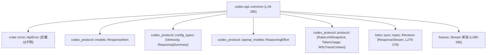
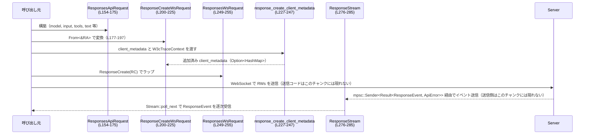

# codex-api/src/common.rs コード解説

## 0. ざっくり一言

このモジュールは、Codex API クライアントで共通して使う **リクエスト／レスポンス用の型** と、  
Responses API の **WebSocket リクエスト／ストリームイベント** および付随ヘルパー関数を定義するファイルです（codex-api/src/common.rs:L19-285）。

---

## 1. このモジュールの役割

### 1.1 概要

- コンパクション（compaction）エンドポイントとメモリ要約（memory summarize）エンドポイント向けの **入力／出力ペイロード型** を提供します（L22-64）。
- OpenAI 互換の Responses API 向けに、HTTP 風の `ResponsesApiRequest` と WebSocket 用 `ResponseCreateWsRequest`／`ResponsesWsRequest` を定義します（L154-175, L200-225, L249-255）。
- Responses API の **ストリーミング応答イベント** を表す `ResponseEvent` と、それを運ぶ `ResponseStream`（`tokio::mpsc::Receiver` をラップした `futures::Stream` 実装）を提供します（L66-96, L276-285）。
- テキスト制御（verbosity・JSON Schema フォーマット）や reasoning 設定を表す補助型と、それらを組み立てるヘルパー関数を提供します（L98-104, L106-133, L135-152, L257-274）。

### 1.2 アーキテクチャ内での位置づけ

このファイルは、Codex API クライアントの「共通 DTO（データ転送オブジェクト）＋ストリームラッパー」として振る舞います。

- 外部クレート `codex_protocol` の型（`ResponseItem`, `Verbosity`, `ReasoningSummary`, `ReasoningEffort`, `RateLimitSnapshot`, `TokenUsage`, `W3cTraceContext`）を利用しつつ（L2-8）、  
  HTTP/WS の転送に適したシリアライズ可能な構造体・列挙体を定義しています。
- 非同期ストリーム処理には `tokio::sync::mpsc` と `futures::Stream` を利用し、`ApiError`（`crate::error::ApiError`、定義はこのチャンクには現れません）でエラーを表現します（L1, L9, L17, L276-285）。

主要な依存関係の関係図（このファイルに現れる範囲）:



### 1.3 設計上のポイント

- **DTO 中心・状態を持たない設計**  
  すべての構造体・列挙体は単なるデータコンテナです。`ResponseStream` 以外に状態を保持するオブジェクトはありません（L24-225, L276-278）。
- **Serde によるシリアライズ制御**  
  - 多くのフィールドに `#[serde(skip_serializing_if = "...")]` が付与され、空文字列や `None` の場合にフィールドを送信しない設計になっています（例: L27-34, L40-44, L157-174, L203-224）。
  - WebSocket リクエスト `ResponsesWsRequest` は `#[serde(tag = "type")]` と `#[serde(rename = "...")]` を使い、OpenAI 互換のメッセージ形式を実現しています（L249-255）。
- **設定値の転写とラッパー**  
  - `VerbosityConfig` から `OpenAiVerbosity` への `From` 実装（L144-151）。
  - `ResponsesApiRequest` → `ResponseCreateWsRequest` への `From<&ResponsesApiRequest>` 実装（L177-197）。
- **トレースメタデータの自動付加**  
  WebSocket 用 `client_metadata` に W3C TraceContext の `traceparent`／`tracestate` を自動挿入するヘルパーを提供します（L227-247）。
- **非同期ストリーミング**  
  `ResponseStream` で `tokio::mpsc::Receiver<Result<ResponseEvent, ApiError>>` を `futures::Stream` として扱い、呼び出し元からは汎用的なストリームとして利用できるようにしています（L276-285）。

---

## 2. 主要な機能一覧

- コンパクション API 入力ペイロード `CompactionInput` の定義（L22-35）。
- メモリ要約 API 入出力ペイロード `MemorySummarizeInput`／`MemorySummarizeOutput` の定義（L37-64）。
- Responses API の reasoning 設定 `Reasoning` とテキスト制御 `TextControls`／`TextFormat`／`OpenAiVerbosity` の定義（L98-104, L106-133, L135-142）。
- Responses API 向け HTTP 風リクエスト `ResponsesApiRequest` の定義（L154-175）。
- Responses API 向け WebSocket リクエスト `ResponseCreateWsRequest`／`ResponsesWsRequest` の定義（L177-197, L200-225, L249-255）。
- Responses API のストリームイベント `ResponseEvent` の定義（L66-96）。
- Responses API の非同期ストリーム `ResponseStream` と `futures::Stream` 実装（L276-285）。
- クライアントメタデータにトレース情報を付与する `response_create_client_metadata`（L227-247）。
- verbosity と JSON Schema から `TextControls` を組む `create_text_param_for_request`（L257-274）。

---

## 3. 公開 API と詳細解説

### 3.1 型一覧（構造体・列挙体など）

#### 構造体・列挙体

| 名前 | 種別 | 役割 / 用途 | 行範囲 |
|------|------|-------------|--------|
| `CompactionInput<'a>` | 構造体 | コンパクションエンドポイントの入力ペイロード。モデル名・レスポンス履歴・オプションの instructions / tools / reasoning / text を含む（L24-35）。 | L24-35 |
| `MemorySummarizeInput` | 構造体 | メモリ要約エンドポイントの入力ペイロード。モデル名と RawMemory のリスト、任意の reasoning 設定を含む（L39-45）。 | L39-45 |
| `RawMemory` | 構造体 | メモリ要約対象の 1 トレースを表す。ID・メタデータ・任意 JSON アイテム群（L47-52）。 | L47-52 |
| `RawMemoryMetadata` | 構造体 | RawMemory のメタデータ。`source_path` のみ保持（L54-57）。 | L54-57 |
| `MemorySummarizeOutput` | 構造体 | メモリ要約エンドポイントの出力。`trace_summary`（または `raw_memory`）と `memory_summary` を含む（L59-64）。Deserialize のみ。 | L59-64 |
| `ResponseEvent` | 列挙体 | Responses API ストリーミングから届くイベントを表す。作成完了、テキストデルタ、reasoning 関連データ、レートリミット情報などを含む（L66-96）。 | L66-96 |
| `Reasoning` | 構造体 | reasoning effort と summary の設定をラップする。`codex_protocol` 側の設定型をそのまま格納（L98-104）。 | L98-104 |
| `TextFormatType` | 列挙体 | TextControls のフォーマット種別。現在は `JsonSchema` のみ（L106-111）。 | L106-111 |
| `TextFormat` | 構造体 | JSON Schema ベースのテキスト出力フォーマット指定（型・strict フラグ・スキーマ本体・名前）（L113-123）。 | L113-123 |
| `TextControls` | 構造体 | Responses API の `text` フィールド制御。verbosity とオプションの `TextFormat` を含む（L125-133）。 | L125-133 |
| `OpenAiVerbosity` | 列挙体 | OpenAI 互換の冗長さ指定（low/medium/high）。`serde(rename_all = "lowercase")` 指定あり（L135-142）。 | L135-142 |
| `ResponsesApiRequest` | 構造体 | HTTP 風の Responses API リクエスト。モデル名・instructions・入力・tools・tool choice などを保持する（L154-175）。 | L154-175 |
| `ResponseCreateWsRequest` | 構造体 | WebSocket 用の response.create リクエストペイロード。`ResponsesApiRequest` に WS 固有の `previous_response_id`／`generate` 等を加えたもの（L200-225）。 | L200-225 |
| `ResponsesWsRequest` | 列挙体 | WebSocket メッセージルート型。`type` フィールドでタグ付けされ、現在は `response.create` のみ（L249-255）。 | L249-255 |
| `ResponseStream` | 構造体 | `tokio::mpsc::Receiver<Result<ResponseEvent, ApiError>>` をラップし、`futures::Stream` として扱うための薄いラッパー（L276-278）。 | L276-278 |

#### 定数

| 名前 | 種別 | 役割 / 用途 | 行範囲 |
|------|------|-------------|--------|
| `WS_REQUEST_HEADER_TRACEPARENT_CLIENT_METADATA_KEY` | `&'static str` | WebSocket 用 `client_metadata` に挿入する `traceparent` キー名（L19）。 | L19 |
| `WS_REQUEST_HEADER_TRACESTATE_CLIENT_METADATA_KEY` | `&'static str` | WebSocket 用 `client_metadata` に挿入する `tracestate` キー名（L20）。 | L20 |

### 3.2 関数詳細

#### `impl From<VerbosityConfig> for OpenAiVerbosity::from(v: VerbosityConfig) -> OpenAiVerbosity`

**概要**

`codex_protocol::config_types::Verbosity` を、このモジュール内で使用する `OpenAiVerbosity` に変換します（L144-151）。

**引数**

| 引数名 | 型 | 説明 |
|--------|----|------|
| `v` | `VerbosityConfig` | 外部設定から読み込まれた冗長さ設定。定義はこのチャンクには現れません（`codex_protocol::config_types::Verbosity`）。 |

**戻り値**

- `OpenAiVerbosity`  
  対応する冗長さ（`Low` / `Medium` / `High`）を表す列挙値。

**内部処理の流れ**

1. `match v` で 3 つのバリアントを列挙（L146-149）。
2. それぞれを同名の `OpenAiVerbosity` バリアントに対応付けて返却（L147-149）。

**Examples（使用例）**

```rust
use codex_protocol::config_types::Verbosity as VerbosityConfig; // 外部設定の型
// OpenAiVerbosity は common.rs で定義されている                   // (L135-142)

fn convert_verbosity(config: VerbosityConfig) -> OpenAiVerbosity {
    OpenAiVerbosity::from(config)                              // From 実装で変換
}
```

**Errors / Panics**

- `match` 文は 3 バリアントをすべて列挙しており、`VerbosityConfig` に追加のバリアントが増えた場合はコンパイルエラーになります（L146-149）。
- ランタイムエラーや panic を発生させるコードはありません。

**Edge cases（エッジケース）**

- `VerbosityConfig` に未知の値が来ることは型システム上想定されておらず、すべてのバリアントが明示的に処理されます（L146-149）。

**使用上の注意点**

- `From` 実装を通じて `Into::<OpenAiVerbosity>` も利用できるため、`verbosity.map(Into::into)` のような記述が可能です（`create_text_param_for_request` でもその形で利用されています、L265-266）。
- 外部ライブラリ側で `VerbosityConfig` にバリアントが追加された場合、この実装の更新が必要になります。

---

#### `impl From<&ResponsesApiRequest> for ResponseCreateWsRequest::from(request: &ResponsesApiRequest) -> ResponseCreateWsRequest`

**概要**

HTTP 風の `ResponsesApiRequest` から、WebSocket 用の `ResponseCreateWsRequest` を構築します（L177-197）。  
既存のフィールドをコピーしつつ、`previous_response_id` と `generate` を `None` に固定しています。

**引数**

| 引数名 | 型 | 説明 |
|--------|----|------|
| `request` | `&ResponsesApiRequest` | HTTP 風に構築されたリクエストオブジェクト（L154-175）。 |

**戻り値**

- `ResponseCreateWsRequest`  
  WebSocket 経由で `response.create` メッセージとして送信するためのペイロード（L200-225）。

**内部処理の流れ**

1. `Self { ... }` で新しい `ResponseCreateWsRequest` を作成（L179-196）。
2. `model`, `instructions`, `input`, `tools`, `tool_choice`, `parallel_tool_calls`, `reasoning`, `store`, `stream`, `include`, `service_tier`, `prompt_cache_key`, `text`, `client_metadata` を `clone` またはコピーして転写（L180-187, L189-193, L195-196）。
3. WebSocket 固有フィールド `previous_response_id` と `generate` を `None` に固定（L182, L194）。

**Examples（使用例）**

```rust
// HTTP 風に作ったリクエストを WebSocket 用に変換する例
fn to_ws_request(http_req: &ResponsesApiRequest) -> ResponseCreateWsRequest {
    ResponseCreateWsRequest::from(http_req)                   // From<&T> 実装を利用
}
```

**Errors / Panics**

- フィールドはすべて単純な `clone` または Copy であり、panic を起こす可能性はありません（L179-196）。
- エラー型を返さない純粋関数です。

**Edge cases（エッジケース）**

- `request.client_metadata` が `None` の場合、`ResponseCreateWsRequest` の `client_metadata` も `None` になります（L195-196）。
- `instructions` が空文字列の場合でもここではそのままコピーされ、シリアライズ時に `skip_serializing_if = "String::is_empty"` によって送信されるかどうかが決まります（L157, L203）。

**使用上の注意点**

- `previous_response_id` を使用する場合は、変換後の `ResponseCreateWsRequest` に対して明示的に設定を行う必要があります（この実装では常に `None` にセットされます、L182）。
- `generate` フィールドもここでは常に `None` のため、サーバ側での挙動に影響を与えたい場合は、変換後に上書きが必要です（L194）。

---

#### `response_create_client_metadata(client_metadata: Option<HashMap<String, String>>, trace: Option<&W3cTraceContext>) -> Option<HashMap<String, String>>`

**概要**

Responses WebSocket リクエスト用 `client_metadata` に、W3C Trace Context (`traceparent` と `tracestate`) を挿入した新しいマップを返します（L227-247）。  
元の `client_metadata` が存在しない場合は空マップから始めます。

**引数**

| 引数名 | 型 | 説明 |
|--------|----|------|
| `client_metadata` | `Option<HashMap<String, String>>` | 既存のクライアントメタデータ。`None` の場合は空マップとして扱われます（L228, L231）。 |
| `trace` | `Option<&W3cTraceContext>` | 追加するトレース情報。`traceparent`／`tracestate` フィールドを利用します（L229, L233-242）。定義はこのチャンクには現れません。 |

**戻り値**

- `Option<HashMap<String, String>>`  
  - `Some(map)` : 元のメタデータに trace 情報を追加したマップ。trace が `None` でも、元マップに要素があれば `Some` になります。
  - `None` : 元マップが空であり、かつ trace から追加された情報もなかった場合（L246）。

**内部処理の流れ**

1. `client_metadata.unwrap_or_default()` で、`None` を空の `HashMap` に変換（L231）。
2. `trace` が `Some` のとき、`trace.traceparent.as_deref()` で `Option<&str>` を取得し、`Some` なら `traceparent` キーで `client_metadata` に `insert`（L233-238）。
3. 同様に `tracestate` フィールドも存在する場合は `tracestate` キーで `insert`（L239-243）。
4. 最後に `(!client_metadata.is_empty()).then_some(client_metadata)` で、空なら `None`、非空なら `Some(map)` を返却（L246）。

**Examples（使用例）**

```rust
use std::collections::HashMap;
use codex_protocol::protocol::W3cTraceContext;              // 定義はこのチャンクには現れません

fn build_client_metadata(
    base: Option<HashMap<String, String>>,
    trace: Option<&W3cTraceContext>,
) -> Option<HashMap<String, String>> {
    response_create_client_metadata(base, trace)             // trace 情報をマージする
}
```

**Errors / Panics**

- `unwrap_or_default` は `Option` に対して安全であり、panic を起こしません（L231）。
- `HashMap::insert` も panic を起こす可能性のある操作は含みません（L234-237, L240-243）。

**Edge cases（エッジケース）**

- `client_metadata == None` かつ `trace == None` :  
  → 空マップから開始し、何も挿入されないため、戻り値は `None` になります（L231, L246）。
- `client_metadata == Some(empty_map)` かつ `trace` ありだが `traceparent`／`tracestate` が両方 `None` の場合:  
  → map は空のままなので `None` を返します（L233-246）。
- 元の `client_metadata` に既に `ws_request_header_traceparent` または `ws_request_header_tracestate` キーがある場合:  
  → `insert` により新しい値で上書きされます（L234-237, L240-243）。

**使用上の注意点**

- 呼び出し側がこれらのキー（`WS_REQUEST_HEADER_TRACEPARENT_CLIENT_METADATA_KEY`／`...TRACESTATE...`）を事前に設定している場合、ここで上書きされる点に注意が必要です（L19-20, L234-243）。
- 戻り値が `None` の場合は「メタデータを一切送信しない」という意味になるため、呼び出し側の HTTP/WS クライアントコードで `Option` を適切に扱う必要があります。
- `W3cTraceContext` の構造（`traceparent`／`tracestate` の意味やフォーマット）はこのチャンクには現れないため、その仕様に従う必要があります。

---

#### `create_text_param_for_request(verbosity: Option<VerbosityConfig>, output_schema: &Option<Value>) -> Option<TextControls>`

**概要**

Responses API に渡す `text` パラメータ（`TextControls`）を、オプションの verbosity 設定と JSON Schema から組み立てます（L257-274）。  
両方とも `None` の場合は `None` を返し、`text` フィールドを付けないようにします。

**引数**

| 引数名 | 型 | 説明 |
|--------|----|------|
| `verbosity` | `Option<VerbosityConfig>` | レスポンスの冗長さ設定。`codex_protocol::config_types::Verbosity`、定義はこのチャンクには現れません（L258）。 |
| `output_schema` | `&Option<Value>` | JSON Schema を表す `serde_json::Value`。`None` の場合は schema を指定しません（L259）。 |

**戻り値**

- `Option<TextControls>`  
  - `Some(TextControls)` : いずれか一方または両方が指定された場合。
  - `None` : verbosity も output_schema も `None` の場合（L261-263）。

**内部処理の流れ**

1. 冒頭で `if verbosity.is_none() && output_schema.is_none()` をチェックし、両方 `None` なら `None` を返す（L261-263）。
2. それ以外の場合は `Some(TextControls { ... })` を返す（L265-273）。
3. `verbosity` は `verbosity.map(std::convert::Into::into)` で `OpenAiVerbosity` に変換しつつ `Option` のまま保持（L265-266）。
4. `format` は `output_schema.as_ref().map(|schema| TextFormat { ... })` によって、`Some(schema)` のときのみ `TextFormat` を構築（L267-272）。
   - `r#type: TextFormatType::JsonSchema`（L268）。
   - `strict: true`（L269）。
   - `schema: schema.clone()`（L270）。
   - `name: "codex_output_schema".to_string()`（L271）。

**Examples（使用例）**

```rust
use codex_protocol::config_types::Verbosity as VerbosityConfig;
use serde_json::json;

fn build_text_controls() -> Option<TextControls> {
    let verbosity = Some(VerbosityConfig::Medium);           // 設定から取得した冗長さ
    let schema = Some(json!({ "type": "object" }));          // 望む出力の JSON Schema

    create_text_param_for_request(verbosity, &schema)        // TextControls を組み立て
}
```

**Errors / Panics**

- いずれの箇所でも panic を引き起こす操作は行われていません。
- `schema.clone()` は `serde_json::Value` の通常の複製処理です（L270）。

**Edge cases（エッジケース）**

- `verbosity == None` かつ `output_schema == None` :  
  → `None` を返し、`text` フィールドを付与しない（L261-263）。
- `verbosity == Some` かつ `output_schema == None` :  
  → `TextControls { verbosity: Some(...), format: None }` （L265-266, L267-272）。
- `verbosity == None` かつ `output_schema == Some(schema)` :  
  → `TextControls { verbosity: None, format: Some(TextFormat { ... }) }`（L265-272）。
- `output_schema` の中身が空のオブジェクトや無効なスキーマであっても、この関数では検証を行いません。

**使用上の注意点**

- `strict: true` が固定されているため（L269）、サーバ側はスキーマに対して厳密な検証を行う前提になります。  
  スキーマの互換性に注意が必要です。
- `name` が `"codex_output_schema"` に固定されており（L271）、テレメトリやデバッグ用途の識別子として機能します。複数の異なるスキーマを使い分ける場合は、必要に応じて実装変更が必要です。
- この関数は `TextControls` の生成のみを行い、実際に `ResponsesApiRequest.text` 等へ設定する処理は呼び出し側で行う必要があります（L171, L220）。

---

#### `impl Stream for ResponseStream::poll_next(self: Pin<&mut Self>, cx: &mut Context<'_>) -> Poll<Option<Result<ResponseEvent, ApiError>>>`

**概要**

`ResponseStream` に対する `futures::Stream` トレイトの実装です（L280-285）。  
内部の `mpsc::Receiver<Result<ResponseEvent, ApiError>>` に対する `poll_recv` を単純に委譲し、非同期に `ResponseEvent` を取り出せるようにします。

**引数**

| 引数名 | 型 | 説明 |
|--------|----|------|
| `self` | `Pin<&mut ResponseStream>` | 自身へのピン留めされた可変参照。`Stream` トレイトの要件（L283）。 |
| `cx` | `&mut Context<'_>` | 非同期ランタイムがスケジューリング情報を保持するコンテキスト（L283）。 |

**戻り値**

- `Poll<Option<Result<ResponseEvent, ApiError>>>`  
  - `Poll::Pending` : まだ次のイベントが到着していない。
  - `Poll::Ready(Some(Ok(event)))` : 新しい `ResponseEvent` が利用可能。
  - `Poll::Ready(Some(Err(err)))` : ストリーム中のエラー（`ApiError`）が発生。
  - `Poll::Ready(None)` : チャネルがクローズされ、これ以上イベントは届かない。

**内部処理の流れ**

1. `fn poll_next(mut self: Pin<&mut Self>, cx: &mut Context<'_>)` として定義（L283）。
2. `self.rx_event.poll_recv(cx)` をそのまま返却（L284）。
   - `rx_event` は `mpsc::Receiver<Result<ResponseEvent, ApiError>>`（L277-278）。
   - `poll_recv` は `Poll<Option<T>>` を返す tokio の非同期受信メソッド。

**Examples（使用例）**

高レベルでは、多くの場合 `StreamExt` の `.next().await` などで利用されます。

```rust
use futures::StreamExt;                                      // .next() 拡張メソッド用

async fn consume_response_stream(mut stream: ResponseStream) {
    while let Some(result) = stream.next().await {           // poll_next が内部で呼ばれる
        match result {
            Ok(event) => {
                // ResponseEvent を処理する
            }
            Err(err) => {
                // ApiError を処理する
            }
        }
    }
}
```

**Errors / Panics**

- この実装自体は panic を発生させません。
- `ApiError` の内容やエラー発生タイミングは、このチャンクには現れないアップストリームの送信側実装によって決まります。

**並行性（Concurrency）の観点**

- `ResponseStream` は `tokio::sync::mpsc::Receiver` を内部に持っています（L276-278）。  
  これは **マルチプロデューサ・シングルコンシューマ** の非同期チャネルであり、複数のタスクからイベントを送信し、1 つのタスクが順次受信する形になります。
- `poll_next` は `&mut self` を要求するため、同じ `ResponseStream` を複数タスクから同時にポーリングすることはできません（Rust の可変参照制約によって防止されます）。

**Edge cases（エッジケース）**

- 送信側がすべてドロップされ、チャネルがクローズされた場合、`poll_recv` は `Poll::Ready(None)` を返し、ストリームも終了します。
- チャネルにイベントがないタイミングでは `Poll::Pending` が返され、`Context` 経由で wakeup がスケジュールされるため、ビジーウェイトは発生しません。

**使用上の注意点**

- `ResponseStream` は 1 コンシューマ前提の設計なので、1 本のストリームを複数タスクで共有する場合は `Arc<Mutex<...>>` などで明示的な同期が必要になりますが、そのようなコードはこのファイルには現れません。
- `ApiError` を含む `Err` バリアントを必ずハンドリングする必要があります。無視するとストリーム処理の異常終了に気づきにくくなります。

---

### 3.3 その他の関数

上記で挙げたもの以外に、このファイルには公開関数は存在しません（`fn` 定義は `response_create_client_metadata` と `create_text_param_for_request` のみ、L227-247, L257-274）。

---

## 4. データフロー

ここでは、典型的な **Responses API の WebSocket 呼び出しシナリオ** におけるデータフローを説明します。

1. 呼び出し元が `ResponsesApiRequest` を構築する（L154-175）。
2. `ResponseCreateWsRequest::from(&request)` によって WebSocket 用ペイロードに変換する（L177-197, L200-225）。
3. 必要に応じて `response_create_client_metadata` で `client_metadata` に TraceContext を埋め込む（L227-247）。
4. `ResponsesWsRequest::ResponseCreate(ws_request)` として実際に送るメッセージを組み立てる（L249-255）。
5. サーバからの応答は `ResponseStream` 経由で `ResponseEvent` のストリームとして受信する（L66-96, L276-285）。

これをシーケンス図で表すと次のようになります（行範囲をラベルに付与）。



---

## 5. 使い方（How to Use）

### 5.1 基本的な使用方法

ここでは、Responses API を WebSocket 経由で呼び出し、ストリーミング応答を処理する想定の高レベルな例を示します。

```rust
use std::collections::HashMap;
use codex_protocol::config_types::Verbosity as VerbosityConfig; // 冗長さ設定
use codex_protocol::models::ResponseItem;                       // モデルへの入力アイテム（定義はこのチャンクには現れません）
use codex_protocol::protocol::W3cTraceContext;                  // トレースコンテキスト
use futures::StreamExt;                                         // .next() 用
use serde_json::json;

// 1. TextControls を組み立てる                                  // create_text_param_for_request を使用
fn build_text_controls() -> Option<TextControls> {
    let verbosity = Some(VerbosityConfig::Medium);              // 中程度の冗長さ
    let schema = Some(json!({ "type": "object" }));             // 出力 JSON Schema
    create_text_param_for_request(verbosity, &schema)           // (L257-274)
}

// 2. HTTP 風リクエストを組み立てる
fn build_responses_api_request(input_items: Vec<ResponseItem>) -> ResponsesApiRequest {
    ResponsesApiRequest {
        model: "gpt-4.1".to_string(),                           // 使用モデル
        instructions: "Explain the result.".to_string(),        // モデルへの指示
        input: input_items,                                     // 入力アイテム
        tools: Vec::new(),                                      // ツール未使用
        tool_choice: "none".to_string(),                        // ツールを使わない選択
        parallel_tool_calls: false,                             // 並列ツール呼び出しなし
        reasoning: None,                                        // reasoning オプション未指定（L163）
        store: false,                                           // レスポンスの保存なし
        stream: true,                                           // ストリーミングを有効化
        include: vec![],                                        // 追加情報なし
        service_tier: None,                                     // サービスティア未指定
        prompt_cache_key: None,                                 // プロンプトキャッシュ未使用
        text: build_text_controls(),                            // TextControls を設定（L171）
        client_metadata: None,                                  // この時点では未設定（L174）
    }
}

// 3. WebSocket 用ペイロードとメタデータを組み立てる
fn build_ws_request(
    request: &ResponsesApiRequest,
    trace: Option<&W3cTraceContext>,
) -> ResponsesWsRequest {
    // HTTP 風リクエストから WS 用に変換（L177-197）
    let mut ws_req = ResponseCreateWsRequest::from(request);
    // client_metadata に trace 情報を付与（L227-247）
    ws_req.client_metadata = response_create_client_metadata(ws_req.client_metadata.take(), trace);
    // WebSocket メッセージとしてラップ（L249-255）
    ResponsesWsRequest::ResponseCreate(ws_req)
}

// 4. ResponseStream を消費する（実際の WebSocket I/O はこのチャンクには現れません）
async fn consume_stream(mut stream: ResponseStream) {
    while let Some(result) = stream.next().await {              // poll_next が呼ばれる（L280-285）
        match result {
            Ok(event) => {
                match event {
                    ResponseEvent::OutputTextDelta(text) => {
                        println!("delta: {}", text);            // テキストデルタを表示
                    }
                    ResponseEvent::Completed { token_usage, .. } => {
                        println!("done: {:?}", token_usage);    // 使用トークン情報など
                    }
                    _ => { /* 他のイベントはここでは省略 */ }
                }
            }
            Err(err) => {
                eprintln!("stream error: {:?}", err);           // ApiError をログに出す
            }
        }
    }
}
```

### 5.2 よくある使用パターン

1. **Compaction エンドポイント入力の構築**

```rust
fn build_compaction_input<'a>(
    model: &'a str,
    history: &'a [ResponseItem],
    instructions: &'a str,
) -> CompactionInput<'a> {
    CompactionInput {
        model,                                                  // モデル名への借用（L25）
        input: history,                                         // レスポンス履歴への借用（L26）
        instructions,                                           // 指示文への借用（L28）
        tools: Vec::new(),                                      // ツールなし
        parallel_tool_calls: false,                             // 並列ツールなし
        reasoning: None,                                        // reasoning 未指定（L32）
        text: None,                                             // text コントロール未指定（L34）
    }
}
```

1. **Memory Summarize エンドポイントの入力／出力**

```rust
fn build_memory_summarize_input(traces: Vec<RawMemory>) -> MemorySummarizeInput {
    MemorySummarizeInput {
        model: "gpt-4.1-mini".to_string(),                      // モデル名（L40）
        raw_memories: traces,                                   // トレース一覧（L42）
        reasoning: None,                                        // reasoning 未指定（L44）
    }
}

// MemorySummarizeOutput は Deserialize のみ（L59-64）なので、
// 受信した JSON を serde_json::from_str などでパースする前提です。
```

### 5.3 よくある間違いと正しい使い方

```rust
// 間違い例: verbosity も schema も指定せずに TextControls を期待している
let verbosity = None;
let schema: Option<Value> = None;
let text_controls = create_text_param_for_request(verbosity, &schema);
// text_controls は None になる（L261-263）

// 正しい例: 少なくとも一方を指定する
let verbosity = Some(VerbosityConfig::Medium);
let schema: Option<Value> = None;
let text_controls = create_text_param_for_request(verbosity, &schema);
// text_controls は Some(TextControls { verbosity: Some(_), format: None })（L265-272）
```

```rust
// 間違い例: 自前で traceparent キーを上書きしてしまう
let mut meta = HashMap::new();
meta.insert(
    WS_REQUEST_HEADER_TRACEPARENT_CLIENT_METADATA_KEY.to_string(),
    "custom".to_string(),
);
let meta = response_create_client_metadata(Some(meta), Some(&trace));
// 上の insert が trace 由来の値で上書きされる（L234-237）

// 正しい例: trace 関連キーはこの関数に任せ、自前では設定しない
let meta = response_create_client_metadata(None, Some(&trace));
```

### 5.4 使用上の注意点（まとめ）

- **Option フィールドと `skip_serializing_if`**  
  多くのフィールドが `Option` かつ `skip_serializing_if` 付きになっており、未指定の場合はフィールド自体が送信されません（例: L31-34, L167-174, L203-224）。  
  サーバ側のデフォルト挙動に依存するため、必須の設定は明示的に埋める必要があります。
- **TextControls の厳密検証**  
  `create_text_param_for_request` では `strict: true` が固定され、スキーマに合致しない応答はサーバ側で拒否される可能性があります（L269）。
- **トレースメタデータの上書き**  
  `response_create_client_metadata` は既存の `traceparent`／`tracestate` キーを上書きするため、自前で設定した値を保持したい場合は注意が必要です（L234-243）。
- **非同期ストリームの単一コンシューマ性**  
  `ResponseStream` は `&mut self` で `poll_next` を行うため、1 つのストリームを複数タスクで同時に消費する設計には向きません（L283-284）。

---

## 6. 変更の仕方（How to Modify）

### 6.1 新しい機能を追加する場合

- **新しい Responses API イベントを追加する**
  1. `ResponseEvent` に新しいバリアントを追加する（L66-96）。
  2. イベント発行側（このチャンクには現れません）が新バリアントを生成するように変更する。
  3. `ResponseStream` の利用側で、新バリアントに対する処理を追加する。

- **Responses API リクエストに新フィールドを追加する**
  1. `ResponsesApiRequest` と `ResponseCreateWsRequest` の両方にフィールドを追加する（L154-175, L200-225）。
  2. `impl From<&ResponsesApiRequest> for ResponseCreateWsRequest` にコピー処理を追加する（L177-197）。
  3. 必要に応じて `ResponsesWsRequest` へのシリアライズ形式をテストで確認する（テストはこのチャンクには現れません）。

- **`text` フォーマットの種類を増やす**
  1. `TextFormatType` にバリアントを追加する（L106-111）。
  2. `create_text_param_for_request` 内で、新しいタイプに応じた `TextFormat` の生成ロジックを追加する（L265-272）。

### 6.2 既存の機能を変更する場合の注意点

- **シリアライズ互換性**
  - `serde` 属性（`rename`, `alias`, `skip_serializing_if`, `tag` など）を変更すると、サーバとの互換性に直接影響します。  
    例: `MemorySummarizeOutput.raw_memory` は `trace_summary` で受信するように `rename` されていますが、`alias = "raw_memory"` により従来名も許可しています（L61）。この互換性は意図的なものと考えられます。
- **トレイト実装の契約**
  - `Stream` 実装は `poll_next` を単に委譲していますが、この契約を変える（例: バッファリングを挟む）と呼び出し側の期待が変わる可能性があります（L283-285）。
- **エラー型の拡張**
  - `ResponseStream` の `Item` は `Result<ResponseEvent, ApiError>` 固定です（L281-282）。エラー型を変える場合、全呼び出し側に影響します。
- **テスト / 使用箇所の再確認**
  - このファイルにはテストコードが含まれていないため（`#[cfg(test)]` 等は存在しません、L1-286）、変更後は別ファイルのテストや実際の使用箇所で挙動確認が必要です。

---

## 7. 関連ファイル・モジュール

このモジュールと密接に関係する外部モジュール（ファイルパスはこのチャンクには現れません）:

| モジュール / パス | 役割 / 関係 |
|------------------|------------|
| `crate::error::ApiError` | ストリーミング中のエラーを表現する型。`ResponseStream` の `Item` に使用されます（L1, L276-282）。定義場所はこのチャンクには現れません。 |
| `codex_protocol::models::ResponseItem` | モデルへの入力および出力の単位を表す型。`CompactionInput` や `ResponsesApiRequest` で使用されます（L4, L26, L159, L207）。定義はこのチャンクには現れません。 |
| `codex_protocol::config_types::{Verbosity, ReasoningSummary}` | 冗長さ設定と reasoning summary 設定。`OpenAiVerbosity` への変換や `Reasoning` に格納されます（L2-3, L98-104, L144-151）。 |
| `codex_protocol::openai_models::ReasoningEffort` | reasoning effort 設定。`Reasoning` のフィールドとして利用されます（L5, L98-104）。 |
| `codex_protocol::protocol::{RateLimitSnapshot, TokenUsage, W3cTraceContext}` | レートリミット情報・トークン使用量・トレースコンテキスト。`ResponseEvent` と `response_create_client_metadata` で利用されます（L6-8, L78-81, L94, L227-243）。 |
| `tokio::sync::mpsc` | 非同期チャネル。`ResponseStream` が `Receiver<Result<ResponseEvent, ApiError>>` を保持します（L17, L276-278）。 |
| `futures::Stream` | 非同期ストリームトレイト。`ResponseStream` が実装しています（L9, L280-285）。 |

このチャンク内では、これらのモジュールの内部実装や具体的なファイルパスは分からないため、「定義はこのチャンクには現れません」としています。
