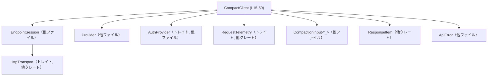
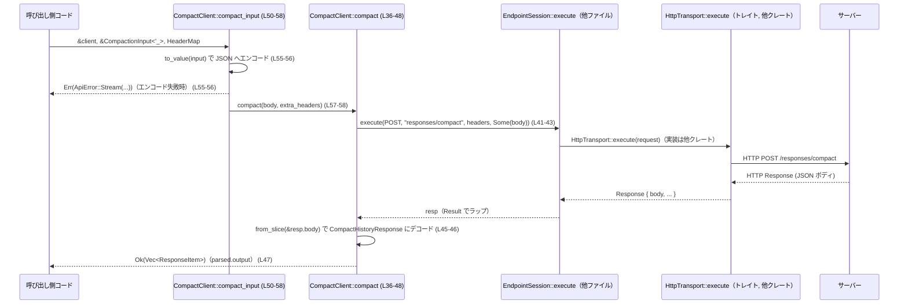

# codex-api/src/endpoint/compact.rs

## 0. ざっくり一言

`CompactClient` を通じて `responses/compact` エンドポイントに HTTP POST を送り、サーバー側の「コンパクション」結果（`Vec<ResponseItem>`）を非同期に取得するクライアントモジュールです。（`CompactClient` とそのメソッド群が中心）（codex-api/src/endpoint/compact.rs:L15-59,36-58）

---

## 1. このモジュールの役割

### 1.1 概要

- このモジュールは、サーバー側の「レスポンス履歴コンパクション」機能を呼び出すための HTTP クライアント層を提供します。（codex-api/src/endpoint/compact.rs:L36-48,50-58）
- 生の `serde_json::Value` または型付きの `CompactionInput<'_>` を JSON にエンコードし、`responses/compact` パスに POST し、`Vec<ResponseItem>` として結果を返します。（L32-34,36-48,50-58）
- HTTP 送信・認証・テレメトリ（トレースやメトリクス）は、`EndpointSession<T, A>` と `RequestTelemetry` に委譲されています。（L15-17,20-23,26-30）

### 1.2 アーキテクチャ内での位置づけ

`CompactClient` を中心にした依存関係（このファイルに現れる範囲）を図示します。



- `CompactClient` は内部に `EndpointSession<T, A>` を 1 つ保持し、そこに HTTP 実行や認証処理を委譲します。（codex-api/src/endpoint/compact.rs:L15-17,20-23,41-44）
- 実際の HTTP 送信は、別クレート `codex_client` の `HttpTransport` 実装に依存します。（L6,69-85）
- 認証トークン取得は `AuthProvider` トレイトに委譲され、このモジュールではトークンの実体や管理は扱いません。（L1,92-95）
- コンパクション対象の入力フォーマットは `CompactionInput<'_>` 型にカプセル化され、ここでは JSON へのシリアライズにのみ使用されます。（L2,50-56）

### 1.3 設計上のポイント

- **責務分割**
  - HTTP リクエストの構築・送信・認証は `EndpointSession<T, A>` に集約し、このモジュールではエンドポイント固有のパス、リクエストボディ、レスポンスパースのみに集中しています。（codex-api/src/endpoint/compact.rs:L15-17,20-23,32-34,36-48）
- **ジェネリックなトランスポートと認証**
  - `CompactClient<T, A>` は `T: HttpTransport, A: AuthProvider` というトレイト境界のみを要求し、具体的な HTTP クライアント実装や認証方式には依存しません。（L15,19）
- **非同期 API**
  - 実際のコンパクション呼び出しは `async fn` で定義され、`await` により非同期の HTTP 通信結果を待ちます。（L36-48,50-58）
- **エラーハンドリング**
  - HTTP 実行中のエラーは `?` 演算子により `ApiError` として呼び出し元に伝搬されます。（L41-44）
  - JSON デコード／エンコードの失敗は `ApiError::Stream` にマッピングされ、エラーメッセージ文字列が格納されます。（L45-47,55-56）
- **テレメトリの差し込み**
  - `with_telemetry` によって `RequestTelemetry` を `Arc` で注入することで、オブザーバビリティ（計測・トレース）のフックポイントを持たせています。（L26-30,7,13）

---

## 2. 主要な機能一覧

- `CompactClient::new`: HTTP トランスポート・プロバイダー・認証を受け取り、`CompactClient` を初期化する。（codex-api/src/endpoint/compact.rs:L19-24）
- `CompactClient::with_telemetry`: 既存のクライアントにリクエストテレメトリを設定した新しいクライアントを返す。（L26-30）
- `CompactClient::compact`: 任意の JSON ボディと追加ヘッダを受け取り、`responses/compact` に POST し、`Vec<ResponseItem>` を返す。（L36-48,32-34）
- `CompactClient::compact_input`: 型付きの `CompactionInput<'_>` を JSON にエンコードしてから `compact` を呼び出すユーティリティ。（L50-58）
- 内部構造体 `CompactHistoryResponse`: レスポンス JSON の `{ "output": [ResponseItem, ...] }` 形式を表現するデシリアライズ用型。（L61-64）

---

## 3. 公開 API と詳細解説

### 3.1 型一覧（構造体・列挙体など）

| 名前 | 種別 | 公開範囲 | 役割 / 用途 | 定義位置 |
|------|------|----------|------------|----------|
| `CompactClient<T, A>` | 構造体 | `pub` | コンパクション API (`responses/compact`) を呼び出すための高水準クライアント。HTTP トランスポートと認証プロバイダを内包し、セッション管理を `EndpointSession` に委譲する。 | codex-api/src/endpoint/compact.rs:L15-17 |
| `CompactHistoryResponse` | 構造体 | 非公開（テスト含めモジュール内専用） | レスポンスボディの JSON を `output: Vec<ResponseItem>` にデシリアライズする内部用型。 | codex-api/src/endpoint/compact.rs:L61-64 |
| `DummyTransport` | 構造体 | テストモジュール内のみ | テスト用のダミー HTTP トランスポート実装。どのメソッドも呼ばれるとエラーを返す。 | codex-api/src/endpoint/compact.rs:L75-77 |
| `DummyAuth` | 構造体 | テストモジュール内のみ | テスト用の認証プロバイダ。常に `None` を返すベアラートークン。 | codex-api/src/endpoint/compact.rs:L89-90 |

### 3.2 重要関数の詳細

#### `CompactClient::new(transport: T, provider: Provider, auth: A) -> Self`

**概要**

`HttpTransport` 実装・`Provider`・`AuthProvider` を受け取り、内部で `EndpointSession` を構築して `CompactClient` を生成するコンストラクタです。（codex-api/src/endpoint/compact.rs:L19-24）

```rust
pub fn new(transport: T, provider: Provider, auth: A) -> Self { // L20
    Self {
        session: EndpointSession::new(transport, provider, auth), // L21-23
    }
}
```

**引数**

| 引数名 | 型 | 説明 | 根拠 |
|--------|----|------|------|
| `transport` | `T` (`T: HttpTransport`) | HTTP リクエストの送信に使用するトランスポート実装。 | codex-api/src/endpoint/compact.rs:L19-21 |
| `provider` | `Provider` | 接続先や API の種別を表すプロバイダ。詳細は他ファイルで定義され、このチャンクには現れません。 | L2,5,20-21 |
| `auth` | `A` (`A: AuthProvider`) | ベアラートークン等を提供する認証プロバイダ。 | L1,19-21 |

**戻り値**

- `CompactClient<T, A>`: 渡された依存関係を内部の `EndpointSession` に格納した新しいクライアント。（codex-api/src/endpoint/compact.rs:L20-23）

**内部処理の流れ**

1. `EndpointSession::new(transport, provider, auth)` を呼び出し、新しいセッションを生成します。（L21-23）
2. 生成したセッションを `session` フィールドに格納した `CompactClient` インスタンスを返します。（L21-23）

`EndpointSession::new` の内部処理は他ファイルにあるため、このチャンクからは分かりません。

**Examples（使用例）**

`Provider` や具体的なトランスポート実装はこのファイルに出てこないため、引数として受け取る形での例です。

```rust
use http::HeaderMap;
use codex_protocol::models::ResponseItem;
use crate::common::CompactionInput;
use crate::endpoint::compact::CompactClient;
use crate::auth::AuthProvider;
use crate::provider::Provider;
use codex_client::HttpTransport;
use crate::error::ApiError;

// 実際のアプリケーションコードの一例（疑似コード）
async fn run_compaction<T, A>(
    transport: T,              // 呼び出し側で用意された HttpTransport
    provider: Provider,        // 呼び出し側で決定された Provider
    auth: A,                   // 呼び出し側の AuthProvider 実装
    input: &CompactionInput<'_>,
) -> Result<Vec<ResponseItem>, ApiError>
where
    T: HttpTransport,
    A: AuthProvider,
{
    let client = CompactClient::new(transport, provider, auth);     // L20-23
    client.compact_input(input, HeaderMap::new()).await             // L50-58
}
```

**Errors / Panics**

- この関数自体ではエラーもパニックも発生させません。単に値をフィールドに格納しているだけです。（codex-api/src/endpoint/compact.rs:L20-23）

**Edge cases（エッジケース）**

- `transport` / `provider` / `auth` にどのような値を渡しても、この関数内では検証やバリデーションを行っていません。（L20-23）
  - 実際に妥当かどうかは `EndpointSession::new` 側に依存し、このチャンクには現れません。

**使用上の注意点**

- 有効な HTTP トランスポート・プロバイダ・認証プロバイダを渡す前提で設計されています。無効なオブジェクトを渡した場合、後続の `compact` 呼び出し時にエラーになる可能性がありますが、詳細はこのファイルからは判断できません。（L20-23）

---

#### `CompactClient::with_telemetry(self, request: Option<Arc<dyn RequestTelemetry>>) -> Self`

**概要**

既存の `CompactClient` から、リクエストテレメトリを追加設定した新しい `CompactClient` を生成します。元のインスタンスは `self` によって消費されます。（codex-api/src/endpoint/compact.rs:L26-30）

```rust
pub fn with_telemetry(self, request: Option<Arc<dyn RequestTelemetry>>) -> Self { // L26
    Self {
        session: self.session.with_request_telemetry(request),                     // L27-29
    }
}
```

**引数**

| 引数名 | 型 | 説明 | 根拠 |
|--------|----|------|------|
| `self` | `Self`（値受け取り） | 元の `CompactClient`。消費され、戻り値として新しいクライアントが返ります。 | codex-api/src/endpoint/compact.rs:L26-29 |
| `request` | `Option<Arc<dyn RequestTelemetry>>` | テレメトリ実装への共有ポインタ。`None` の場合の挙動は `EndpointSession::with_request_telemetry` に依存します。 | L7,13,26-29 |

**戻り値**

- テレメトリ設定済みの `CompactClient`。内部では `EndpointSession::with_request_telemetry` の結果を新しい `session` として持ちます。（codex-api/src/endpoint/compact.rs:L26-30）

**内部処理の流れ**

1. 元の `self.session` に対して `with_request_telemetry(request)` を呼び出します。（L27-29）
2. 返ってきたセッションを新しい `CompactClient` の `session` に格納して返します。（L26-29）

**Examples（使用例）**

```rust
use std::sync::Arc;
use codex_client::RequestTelemetry;
use crate::endpoint::compact::CompactClient;

// ダミーのテレメトリ実装例（このファイルには定義がないので疑似コード）
struct MyTelemetry;
impl RequestTelemetry for MyTelemetry {
    // メソッド定義は他クレート依存のため、このチャンクには現れません
}

// 既存のクライアントにテレメトリを付与して使う例
fn attach_telemetry<T, A>(client: CompactClient<T, A>) -> CompactClient<T, A>
where
    T: HttpTransport,
    A: AuthProvider,
{
    let telemetry = Arc::new(MyTelemetry);
    client.with_telemetry(Some(telemetry)) // L26-30
}
```

※ `RequestTelemetry` のメソッドシグネチャはこのチャンクには現れないため省略しています。

**Errors / Panics**

- この関数自体は `Result` を返さず、`?` や `panic!` も使っていません。（codex-api/src/endpoint/compact.rs:L26-30）
- `EndpointSession::with_request_telemetry` 内でのエラー有無はこのファイルでは分かりません。

**Edge cases（エッジケース）**

- `request` に `None` を渡した場合の挙動（テレメトリを解除するのか、そのまま保持するのか）は、`EndpointSession` の実装に依存し、このチャンクからは分かりません。（L27-29）
- `Arc<dyn RequestTelemetry>` の内部実装がスレッド安全であるかどうかも、このファイルからは判断できませんが、`Arc` 自体は参照カウントによる共有所有権を提供する標準ライブラリ型です。（L13,26-29）

**使用上の注意点**

- `self` を値で受け取るため、このメソッドを呼び出した後に元の変数名で `CompactClient` を使うことはできません（所有権が移動するため）。Rust の所有権ルールにより、これはコンパイルエラーとして検出されます。（L26）

---

#### `CompactClient::compact(&self, body: serde_json::Value, extra_headers: HeaderMap) -> Result<Vec<ResponseItem>, ApiError>`

**概要**

任意の JSON ボディと追加 HTTP ヘッダを受け取り、`responses/compact` エンドポイントへ POST した結果のボディを `CompactHistoryResponse` としてデシリアライズし、`Vec<ResponseItem>` を返します。（codex-api/src/endpoint/compact.rs:L32-34,36-48）

```rust
pub async fn compact(
    &self,
    body: serde_json::Value,
    extra_headers: HeaderMap,
) -> Result<Vec<ResponseItem>, ApiError> {                             // L36-40
    let resp = self
        .session
        .execute(Method::POST, Self::path(), extra_headers, Some(body)) // L41-43
        .await?;                                                        // L44
    let parsed: CompactHistoryResponse =
        serde_json::from_slice(&resp.body).map_err(|e| ApiError::Stream(e.to_string()))?; // L45-46
    Ok(parsed.output)                                                   // L47
}
```

**引数**

| 引数名 | 型 | 説明 | 根拠 |
|--------|----|------|------|
| `&self` | `&CompactClient<T, A>` | 共有参照。内部状態を変更しない前提で `EndpointSession` にリクエストを委譲する。 | codex-api/src/endpoint/compact.rs:L36-43 |
| `body` | `serde_json::Value` | リクエストボディとして送信する JSON 値。 | L38,41-43 |
| `extra_headers` | `HeaderMap` | リクエストに追加する HTTP ヘッダ。上書きや競合ルールは `EndpointSession::execute` 側に依存。 | L39,41-43,9 |

**戻り値**

- `Ok(Vec<ResponseItem>)`: サーバーが返した JSON ボディから抽出した `output` 配列。（codex-api/src/endpoint/compact.rs:L45-47,61-64）
- `Err(ApiError)`: HTTP 実行エラー、あるいは JSON デコードエラーをラップしたエラー。（L41-47）

**内部処理の流れ（アルゴリズム）**

1. `EndpointSession::execute` に対し、HTTP メソッド `POST`、パス `"responses/compact"`、`extra_headers`、ボディ `Some(body)` を渡して非同期に呼び出します。（L32-34,41-43）
2. `.await?` によって、実行結果を待機し、`Result` が `Err(ApiError)` の場合はそのまま呼び出し元に伝搬します。（L44）
3. 成功時は `resp.body`（型は他ファイルで定義）を `serde_json::from_slice` に渡し、`CompactHistoryResponse` にデシリアライズします。（L45-46,61-64）
4. JSON デコードに失敗した場合、エラーを `ApiError::Stream(e.to_string())` に変換して返します。（L45-46）
5. 正常にデコードできた場合は、その `output` フィールド（`Vec<ResponseItem>`）を取り出して `Ok(parsed.output)` として返します。（L47,61-64）

**Examples（使用例）**

手元ですでに JSON 値を持っている場合の利用例です。

```rust
use http::HeaderMap;
use serde_json::json;
use codex_protocol::models::ResponseItem;
use crate::endpoint::compact::CompactClient;
use crate::error::ApiError;

// 既存のクライアントとヘッダを使ってコンパクションを実行する例
async fn compact_raw<T, A>(
    client: &CompactClient<T, A>,
) -> Result<Vec<ResponseItem>, ApiError>
where
    T: HttpTransport,
    A: AuthProvider,
{
    let body = json!({
        "some": "raw-structure"   // 実際のフィールドはサーバ側仕様に依存し、このチャンクには現れません
    });

    let headers = HeaderMap::new();
    client.compact(body, headers).await             // L36-48
}
```

**Errors / Panics**

- `EndpointSession::execute` が `Err(ApiError)` を返した場合、そのまま呼び出し元に返されます（`?` による伝搬）。（codex-api/src/endpoint/compact.rs:L41-44）
  - HTTP ステータスコードやネットワークエラーなど、具体的なエラーの種類は `EndpointSession` と `ApiError` の実装に依存し、このチャンクからは分かりません。
- `serde_json::from_slice(&resp.body)` が失敗した場合（JSON でない、構造が異なる、エンコーディング不正など）、`ApiError::Stream(e.to_string())` に変換されます。（L45-46）
- この関数内には `panic!` 相当の直接的なパニック要因はありません。

**Edge cases（エッジケース）**

- **レスポンスボディが JSON でない／壊れている**  
  `serde_json::from_slice` がエラーになり、`ApiError::Stream` で呼び出し元に返されます。（L45-46）
- **JSON 内に `output` フィールドがない・型が違う**  
  その場合も `serde_json::from_slice` がエラーを返し、同様に `ApiError::Stream` として扱われます。（L45-46,61-64）
- **`extra_headers` に同じヘッダ名が複数含まれる場合**  
  どのように送信されるかは `HeaderMap` と `EndpointSession::execute` の実装に依存し、このチャンクからは分かりません。（L39,41-43）
- **並行呼び出し**  
  型シグネチャ上は `&self` なので、同一クライアントに対し複数タスクから同時に `compact` を呼び出すことが可能です。ただし `EndpointSession<T, A>` および `T: HttpTransport` のスレッド安全性が保証されているかどうかは、このファイルからは判断できません。（L15-17,36-43）

**使用上の注意点**

- サーバーがこのクライアントの期待する JSON 構造（`{ "output": [...] }`）を返さないと、すべて JSON デコードエラーとして `ApiError::Stream` になるため、呼び出し側はこの点を前提として扱う必要があります。（codex-api/src/endpoint/compact.rs:L45-47,61-64）
- `extra_headers` は値渡しで消費されるため、再利用したい場合は `clone` するか、新しく構築する必要があります。（L39,41-43）

---

#### `CompactClient::compact_input(&self, input: &CompactionInput<'_>, extra_headers: HeaderMap) -> Result<Vec<ResponseItem>, ApiError>`

**概要**

`CompactionInput<'_>` 型の入力を `serde_json::Value` に変換し、それを `compact` に委譲するヘルパー関数です。Typed API を提供することで、呼び出し側が直接 JSON を組み立てる必要を減らします。（codex-api/src/endpoint/compact.rs:L50-58）

```rust
pub async fn compact_input(
    &self,
    input: &CompactionInput<'_>,
    extra_headers: HeaderMap,
) -> Result<Vec<ResponseItem>, ApiError> {            // L50-54
    let body = to_value(input)
        .map_err(|e| ApiError::Stream(format!("failed to encode compaction input: {e}")))?; // L55-56
    self.compact(body, extra_headers).await           // L57-58
}
```

**引数**

| 引数名 | 型 | 説明 | 根拠 |
|--------|----|------|------|
| `&self` | `&CompactClient<T, A>` | コンパクション API クライアントの共有参照。 | codex-api/src/endpoint/compact.rs:L50-54 |
| `input` | `&CompactionInput<'_>` | コンパクション対象を表す型付き入力。具体的なフィールドは他ファイルに定義され、このチャンクには現れません。 | L2,50-53 |
| `extra_headers` | `HeaderMap` | `compact` にそのまま渡す追加ヘッダ。 | L53-54,57-58 |

**戻り値**

- `Ok(Vec<ResponseItem>)`: `compact` 経由で得られたコンパクション結果。（codex-api/src/endpoint/compact.rs:L57-58）
- `Err(ApiError)`: JSON へのエンコード失敗、または `compact` 内で発生したエラー。（L55-58）

**内部処理の流れ**

1. `serde_json::to_value(input)`（`to_value`）で `input` を `serde_json::Value` に変換します。（L55）
2. エンコードに失敗した場合は、`ApiError::Stream` に `"failed to encode compaction input: {e}"` のメッセージを設定して返します。（L55-56）
3. 正常にエンコードできた場合は、その `body` を使って `self.compact(body, extra_headers).await` を呼び出し、その結果をそのまま返します。（L57-58）

**Examples（使用例）**

```rust
use http::HeaderMap;
use crate::common::CompactionInput;
use crate::endpoint::compact::CompactClient;
use codex_protocol::models::ResponseItem;
use crate::error::ApiError;

// 型付きの CompactionInput を使ってコンパクションを実行する例
async fn compact_typed<T, A>(
    client: &CompactClient<T, A>,
    input: &CompactionInput<'_>,
) -> Result<Vec<ResponseItem>, ApiError>
where
    T: HttpTransport,
    A: AuthProvider,
{
    let headers = HeaderMap::new();
    client.compact_input(input, headers).await         // L50-58
}
```

**Errors / Panics**

- `to_value(input)` が失敗した場合（`CompactionInput` の `Serialize` 実装に問題があるなど）、`ApiError::Stream` としてエラーが返ります。（codex-api/src/endpoint/compact.rs:L55-56）
- `compact` 呼び出し中に発生した `ApiError`（HTTP エラーや JSON デコードエラー）は、そのまま伝搬します。（L57-58）

**Edge cases（エッジケース）**

- **`CompactionInput` のシリアライズ不整合**  
  `CompactionInput` の構造変更とサーバ側の期待する JSON が一致していない場合、`to_value` では成功しても、サーバ側でエラーになる可能性があります。この挙動はこのモジュールからは観測できません。（L55-56）
- **`input` が参照しているデータのライフタイム**  
  `CompactionInput<'_>` は借用ベースの型であるため、`input` が参照するデータは `compact_input` 完了まで生きている必要があります。これは Rust のライフタイムシステムがコンパイル時に保証します。（L50-53）

**使用上の注意点**

- `compact` を直接呼ぶ代わりに、通常はこちらの `compact_input` を使用すると、型安全にリクエストボディを構築できます。（codex-api/src/endpoint/compact.rs:L50-58）
- 返されるエラーがすべて `ApiError` に集約されるため、呼び出し側で JSON エンコードエラーと HTTP エラー、JSON デコードエラーを区別する場合は、`ApiError` のバリアントを確認する必要があります（`Stream` バリアントに JSON 関連エラーが集約されている点が特徴的です）。（L45-47,55-56）

---

### 3.3 その他の関数・メソッド（インベントリー）

このチャンクに現れる主な関数・メソッドの一覧です。

| 関数名 / メソッド名 | 所属 | 役割（1 行） | 定義位置 |
|---------------------|------|--------------|----------|
| `CompactClient::path()` | `CompactClient<T, A>` | コンパクション API のパス `"responses/compact"` を返す内部ヘルパー。 | codex-api/src/endpoint/compact.rs:L32-34 |
| `DummyTransport::execute` | `DummyTransport` | テスト用に、呼び出されると必ず `TransportError::Build("execute should not run")` を返す `HttpTransport` 実装。 | codex-api/src/endpoint/compact.rs:L79-82 |
| `DummyTransport::stream` | `DummyTransport` | 同上で、ストリーミング実行用のメソッド。必ずエラーを返す。 | codex-api/src/endpoint/compact.rs:L84-85 |
| `DummyAuth::bearer_token` | `DummyAuth` | テスト用の認証プロバイダ。常に `None` を返す。 | codex-api/src/endpoint/compact.rs:L92-95 |
| `path_is_responses_compact` | テスト関数 | `CompactClient::<DummyTransport, DummyAuth>::path()` が `"responses/compact"` であることを検証する単体テスト。 | codex-api/src/endpoint/compact.rs:L98-104 |

---

## 4. データフロー

### 4.1 代表的な処理シナリオ：`compact_input` 経由でコンパクション実行

このモジュールで典型的なフローは、`CompactClient::compact_input` を呼び出し、内部で JSON エンコードと `compact` 呼び出しを行い、`EndpointSession` 経由で HTTP リクエストを送信するものです。（codex-api/src/endpoint/compact.rs:L50-58,36-48）



- **エラー発生ポイント**
  - `to_value(input)` 失敗（JSON へのシリアライズ失敗） → `ApiError::Stream`（L55-56）
  - `EndpointSession::execute` 内での HTTP エラー → そのまま `ApiError` として伝搬（L41-44）
  - `serde_json::from_slice(&resp.body)` 失敗（JSON デコード失敗） → `ApiError::Stream`（L45-46）

このように、データは `CompactionInput<'_>` → `serde_json::Value` → HTTP ボディ（バイト列） → `CompactHistoryResponse` → `Vec<ResponseItem>` という形に変換されます。（codex-api/src/endpoint/compact.rs:L50-58,45-47,61-64）

---

## 5. 使い方（How to Use）

### 5.1 基本的な使用方法

`CompactClient::new` でクライアントを生成し、`compact_input` でコンパクション結果を取得する基本フローです。

```rust
use http::HeaderMap;
use codex_client::HttpTransport;
use codex_protocol::models::ResponseItem;
use crate::auth::AuthProvider;
use crate::common::CompactionInput;
use crate::endpoint::compact::CompactClient;
use crate::error::ApiError;
use crate::provider::Provider;

// アプリケーションコード側の非同期関数の例
async fn run<T, A>(
    transport: T,
    provider: Provider,
    auth: A,
    input: &CompactionInput<'_>,
) -> Result<Vec<ResponseItem>, ApiError>
where
    T: HttpTransport,
    A: AuthProvider,
{
    // クライアントの初期化（L19-24）
    let client = CompactClient::new(transport, provider, auth);

    // 型付き入力でコンパクション呼び出し（L50-58）
    let headers = HeaderMap::new();
    let result = client.compact_input(input, headers).await?;

    Ok(result)
}
```

この例では、実際の `HttpTransport` 実装や `Provider` の生成方法は他のモジュールに依存するため、呼び出し側から引数として受け取る形にしています。

### 5.2 よくある使用パターン

1. **型付き入力での呼び出し（推奨パターン）**

   ```rust
   async fn compact_typed_example<T, A>(
       client: &CompactClient<T, A>,
       input: &CompactionInput<'_>,
   ) -> Result<Vec<ResponseItem>, ApiError>
   where
       T: HttpTransport,
       A: AuthProvider,
   {
       client.compact_input(input, HeaderMap::new()).await // L50-58
   }
   ```

2. **生の JSON 値を使った呼び出し**

   ```rust
   use serde_json::json;

   async fn compact_raw_example<T, A>(
       client: &CompactClient<T, A>,
   ) -> Result<Vec<ResponseItem>, ApiError>
   where
       T: HttpTransport,
       A: AuthProvider,
   {
       let body = json!({ "custom": "payload" });
       client.compact(body, HeaderMap::new()).await        // L36-48
   }
   ```

3. **テレメトリ付きクライアント**

   ```rust
   use std::sync::Arc;
   use codex_client::RequestTelemetry;

   struct MyTelemetry;
   impl RequestTelemetry for MyTelemetry {
       // 実装詳細は他クレート依存
   }

   async fn compact_with_telemetry<T, A>(
       transport: T,
       provider: Provider,
       auth: A,
       input: &CompactionInput<'_>,
   ) -> Result<Vec<ResponseItem>, ApiError>
   where
       T: HttpTransport,
       A: AuthProvider,
   {
       let base_client = CompactClient::new(transport, provider, auth); // L20-23
       let telemetry = Arc::new(MyTelemetry);
       let client = base_client.with_telemetry(Some(telemetry));       // L26-30

       client.compact_input(input, HeaderMap::new()).await             // L50-58
   }
   ```

### 5.3 よくある間違いと正しい使い方

```rust
use http::HeaderMap;
use crate::endpoint::compact::CompactClient;

// 間違い例 1: async 関数を await せずに使用
async fn wrong_usage<T, A>(client: &CompactClient<T, A>)
where
    T: HttpTransport,
    A: AuthProvider,
{
    let headers = HeaderMap::new();

    // NG（コンパイルエラー）: `compact_input` は Future を返すので、`.await` が必要
    // let result = client.compact_input(input, headers);

    // 正しい例
    // let result = client.compact_input(input, headers).await;
}

// 間違い例 2: with_telemetry 呼び出し後に元のクライアントを使用
fn wrong_telemetry_usage<T, A>(client: CompactClient<T, A>)
where
    T: HttpTransport,
    A: AuthProvider,
{
    let telemetry_client = client.with_telemetry(None); // client の所有権が移動（L26-30）

    // NG（コンパイルエラー）: client は move されており、ここでは使えない
    // client.compact(...);

    // 正しい例: telemetry_client を使う
    // telemetry_client.compact(...);
}
```

### 5.4 使用上の注意点（まとめ）

- **非同期実行が必須**  
  `compact` / `compact_input` は `async fn` であり、`await` できるコンテキスト（例: tokio などの async ランタイム上）で呼び出す必要があります。（codex-api/src/endpoint/compact.rs:L36-48,50-58）
- **エラーの集約先としての `ApiError`**  
  ネットワークエラーと JSON エンコード／デコードエラーはすべて `ApiError` に集約され、JSON 関連は `ApiError::Stream` にマッピングされています。呼び出し側でエラー原因を区別する場合は、`ApiError` のバリアントを確認する前提になります。（L41-47,55-56）
- **レスポンス形式への依存**  
  サーバーは `{ "output": [...] }` 形式の JSON を返す必要があります。それ以外の形式の場合は JSON デコードエラー（`ApiError::Stream`）になります。（L45-47,61-64）
- **パフォーマンス上の観点**  
  - `serde_json::from_slice` によりレスポンスボディ全体を一括でパースするため、非常に大きなレスポンスを扱う場合はメモリ使用量が増えます。（L45-46）
  - テレメトリを追加する場合、`RequestTelemetry` 実装の重さによってはリクエストごとのオーバーヘッドが増える可能性がありますが、実装内容はこのチャンクには現れません。（L7,26-30）
- **セキュリティ上の観点**  
  認証トークンの取得や HTTP 通信の暗号化（TLS）は `AuthProvider` と `HttpTransport` 側に委譲されており、このモジュールでは追加の検証や暗号化処理を行っていません。（L1,6,79-85,92-95）

---

## 6. 変更の仕方（How to Modify）

### 6.1 新しい機能を追加する場合

例: コンパクション API に対して別のエンドポイントを追加したい場合。

1. **新しいクライアント構造体を追加**  
   - `CompactClient` と同様に、`EndpointSession<T, A>` を内部に持つ新しい構造体を定義します。（codex-api/src/endpoint/compact.rs:L15-17 を参考）
2. **パス用ヘルパー関数を定義**  
   - `fn path() -> &'static str` と同様に、新エンドポイントのパスを返す関数を用意します。（L32-34）
3. **非同期メソッドを定義**  
   - `compact` を参考に、`session.execute(Method::POST, Self::path(), ...)` で HTTP 呼び出しを行い、レスポンスを適切な構造体にデシリアライズして返すメソッドを追加します。（L36-48）
4. **レスポンス用構造体の追加**  
   - `CompactHistoryResponse` と同様に、`Deserialize` を derive した内部構造体を定義して JSON 形式に対応させます。（L61-64）
5. **テストの追加**  
   - `path_is_responses_compact` と同様に、パス文字列や基本的な振る舞いを検証するテストを追加します。（L98-104）

### 6.2 既存の機能を変更する場合

- **レスポンス JSON の構造を変更する場合**
  - `CompactHistoryResponse` のフィールドを変更し、それに合わせてサーバー側のレスポンス形式を変更する必要があります。（codex-api/src/endpoint/compact.rs:L61-64）
  - `serde_json::from_slice` の呼び出し部分（`compact` 内）に影響があります。（L45-47）
- **エラー表現を変更する場合**
  - 現在は JSON エンコード／デコードエラーを `ApiError::Stream` にまとめていますが、他のバリアントへ変更する場合は `compact` および `compact_input` の `map_err` 部分を書き換えます。（L45-47,55-56）
  - これに依存する呼び出し側コードがあれば、合わせて修正が必要です。
- **テレメトリの扱いを変える場合**
  - `with_telemetry` 内で呼び出している `EndpointSession::with_request_telemetry` の API 変更は、このメソッドのシグネチャや実装に直接影響します。（L26-30）

変更時には、`EndpointSession`、`ApiError`、`CompactionInput` といった関連モジュールのインターフェースと整合しているかを確認することが重要です。このチャンクだけではそれらの詳細は分からないため、関連ファイルを併せて参照する必要があります。

---

## 7. 関連ファイル

このモジュールと密接に関係する型・モジュール（このチャンクに現れるもの）です。

| パス / 型 | 役割 / 関係 | 根拠 |
|-----------|------------|------|
| `crate::endpoint::session::EndpointSession` | HTTP 実行と認証を担うセッションオブジェクト。`CompactClient` が内部に保持し、すべての HTTP リクエストをここへ委譲します。 | codex-api/src/endpoint/compact.rs:L3,15-17,20-23,41-43 |
| `crate::auth::AuthProvider` | ベアラートークンを提供するトレイト。`CompactClient` のジェネリック引数 `A` として使用され、テスト内の `DummyAuth` が実装例を示しています。 | L1,15,19,89-95 |
| `crate::provider::Provider` | 接続先や API プロバイダ種別を表す型。`CompactClient::new` の引数として使用されます。 | L5,20-21 |
| `crate::common::CompactionInput<'_>` | コンパクションの入力データを表す型。`compact_input` で `serde_json::Value` にエンコードされます。 | L2,50-56 |
| `crate::error::ApiError` | このモジュールが返すエラー型。HTTP 実行エラーと JSON エンコード／デコードエラーをラップします。 | L4,36-40,45-47,50-58 |
| `codex_client::HttpTransport` | HTTP クライアントの抽象トレイト。`CompactClient` のジェネリック引数 `T` として使用され、テストでは `DummyTransport` が実装例を示します。 | L6,15,19,69-85 |
| `codex_client::RequestTelemetry` | リクエスト単位で計測やトレースを行うためのトレイト。`with_telemetry` で `Arc<dyn RequestTelemetry>` として扱われます。 | L7,13,26-30 |
| `codex_protocol::models::ResponseItem` | コンパクション結果の要素を表すモデル型。`Vec<ResponseItem>` としてクライアントの戻り値になります。 | L8,40,54,63 |
| `http::HeaderMap` / `http::Method` | HTTP ヘッダとメソッドを表す標準的な型。リクエスト構築に使用されます。 | L9-10,36-43,50-54 |
| `serde_json::to_value` / `serde_json::from_slice` | JSON エンコード／デコード関数。リクエストボディとレスポンスボディの変換に使われます。 | L12,45-46,55-56 |

---

### テストコードについて

- このファイルには 1 つのテスト `path_is_responses_compact` が含まれ、`CompactClient::path()` が `"responses/compact"` を返すことのみを検証しています。（codex-api/src/endpoint/compact.rs:L98-104）
- `DummyTransport` および `DummyAuth` は、`CompactClient` の型パラメータを埋めるためのテスト用スタブとして定義されており、実行されると必ずエラーを返すように実装されています（実際に HTTP が走らないようにする意図が読み取れますが、これはコード上の挙動に基づく事実記述です）。（L75-85,89-95）

このチャンク内では、より高レベルな機能テスト（実際の HTTP 通信や JSON パースを伴うテスト）は定義されていません。
