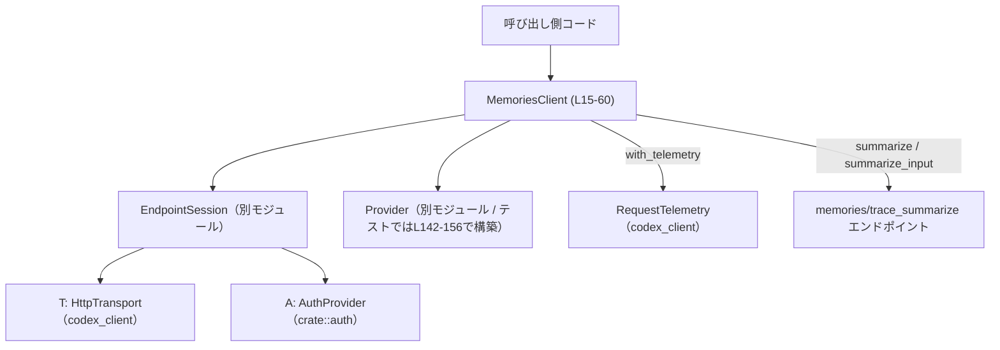
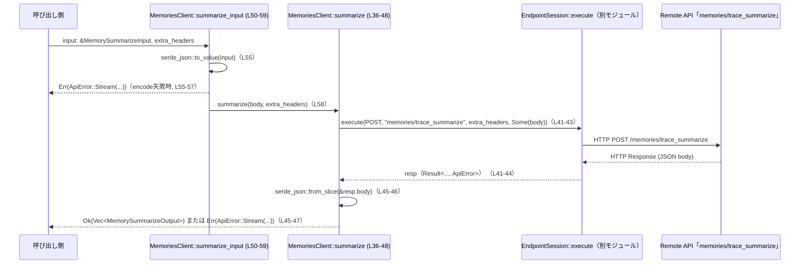

# codex-api/src/endpoint/memories.rs

## 0. ざっくり一言

このファイルは、外部の「memories/trace_summarize」HTTP エンドポイントに対してリクエストを送り、メモリトレースの要約結果を取得するクライアント `MemoriesClient` を定義するモジュールです（`codex-api/src/endpoint/memories.rs:L15-60`）。

---

## 1. このモジュールの役割

### 1.1 概要

- このモジュールは **メモリトレースの要約 API** を呼び出すためのクライアントを提供します。
- 呼び出し側は `MemorySummarizeInput`（型安全な入力）または任意の `serde_json::Value` からリクエストボディを構築し、要約結果 `Vec<MemorySummarizeOutput>` を取得できます（`L36-59`）。
- HTTP 送信処理や認証は汎用的な `EndpointSession<T, A>` に委譲されます（`L15-23, L41-44`）。

### 1.2 アーキテクチャ内での位置づけ

このモジュールの中心は `MemoriesClient` で、HTTP トランスポート実装と認証プロバイダを注入して利用します。



- `MemoriesClient` は、`EndpointSession` に対する薄いラッパです（`L15-17, L20-24, L41-44`）。
- 実際の HTTP リクエスト生成・送信は `EndpointSession::execute` に委譲されています（`L41-44`）。
- このモジュール自身は **エンドポイントパスの固定化** と **JSON のシリアライズ／デシリアライズ** に集中しています（`L32-34, L45-47, L55-57`）。

### 1.3 設計上のポイント（コードから読み取れる範囲）

- **責務分割**
  - `MemoriesClient` は「エンドポイント固有のロジック（パス、入出力の型）」のみを持ち、通信／認証は `EndpointSession` に委譲しています（`L20-24, L41-44`）。
- **ジェネリックなトランスポート／認証**
  - `T: HttpTransport`, `A: AuthProvider` というジェネリクスにより、テスト用・本番用のトランスポート／認証を差し替え可能です（`L15, L88-100, L102-109, L111-140`）。
- **ビルダースタイルの telemetry 設定**
  - `with_telemetry(self, ...) -> Self` によってリクエスト単位のテレメトリを設定できる構造になっています（`L26-30`）。
- **エラーハンドリング**
  - JSON デコードエラーや入力のエンコードエラーは `ApiError::Stream` に変換されます（`L45-47, L55-57`）。
  - HTTP/トランスポートエラーは `EndpointSession::execute` から `?` でそのまま委譲されます（`L41-44`）。
- **不変な共有状態**
  - `MemoriesClient` 自体は `session: EndpointSession<T, A>` を持つだけで、メソッドは `&self` を取る非破壊的な呼び出しです（`L15-17, L36-59`）。

---

## 2. 主要な機能一覧

- メモリ要約エンドポイントクライアント `MemoriesClient` の提供（`L15-60`）
- 汎用 JSON ボディを用いた要約呼び出し `summarize`（`L36-48`）
- 型安全な入力 `MemorySummarizeInput` を用いた要約呼び出し `summarize_input`（`L50-59`）
- テレメトリ設定付きクライアント生成 `with_telemetry`（`L26-30`）

### 2.1 コンポーネント一覧（本体コード）

#### 型

| 名前 | 種別 | 公開性 | 役割 / 用途 | 定義位置 |
|------|------|--------|-------------|----------|
| `MemoriesClient<T, A>` | 構造体 | `pub` | memories 要約エンドポイントを叩くクライアント。通信は `EndpointSession` に委譲 | `codex-api/src/endpoint/memories.rs:L15-17` |
| `SummarizeResponse` | 構造体 | `pub(crate)` 相当（モジュール内のみ） | レスポンス JSON のトップレベル `{ "output": [...] }` をマッピングするための内部用型 | `L62-65` |

#### メソッド・関数（本体コード）

| 名前 | 種別 | 公開性 | 概要 | 定義位置 |
|------|------|--------|------|----------|
| `MemoriesClient::new` | 関連関数 | `pub` | トランスポート・プロバイダ・認証からクライアントを構築 | `L20-24` |
| `MemoriesClient::with_telemetry` | メソッド | `pub` | テレメトリを注入した新しいクライアントを返す（ビルダー） | `L26-30` |
| `MemoriesClient::path` | 関連関数 | `fn`（モジュール内） | エンドポイントパス `"memories/trace_summarize"` を返す | `L32-34` |
| `MemoriesClient::summarize` | メソッド（async） | `pub` | 任意の JSON ボディを POST し、`Vec<MemorySummarizeOutput>` を返す | `L36-48` |
| `MemoriesClient::summarize_input` | メソッド（async） | `pub` | `MemorySummarizeInput` を JSON に変換して `summarize` に委譲 | `L50-59` |

### 2.2 コンポーネント一覧（テストコード）

#### 型

| 名前 | 種別 | 用途 | 定義位置 |
|------|------|------|----------|
| `DummyTransport` | 構造体 | 実際の HTTP 実行を行わないテスト用トランスポート | `L88-100` |
| `DummyAuth` | 構造体 | ベアラートークンを返さないテスト用認証 | `L102-109` |
| `CapturingTransport` | 構造体 | 直近の `Request` を保存し、指定されたボディを返すトランスポート | `L111-115, L117-124, L126-140` |

#### 関数・テスト

| 名前 | 種別 | 概要 | 定義位置 |
|------|------|------|----------|
| `provider` | 関数 | テスト用の `Provider` を組み立てるヘルパ | `L142-156` |
| `path_is_memories_trace_summarize_for_wire_compatibility` | `#[test]` | `path()` が期待どおりのパスを返すことを検証 | `L159-165` |
| `summarize_input_posts_expected_payload_and_parses_output` | `#[tokio::test]` | POST される URL/メソッド/ボディとレスポンスのパース結果を検証 | `L167-228` |

---

## 3. 公開 API と詳細解説

### 3.1 型一覧

| 名前 | 種別 | 役割 / 用途 | 備考 |
|------|------|-------------|------|
| `MemoriesClient<T, A>` | 構造体 | memories 要約 API を叩くための高レベルクライアント | ジェネリックなトランスポート・認証に対応（`L15-17`） |
| `SummarizeResponse` | 構造体 | レスポンス JSON のトップレベルラッパ `{ output: Vec<MemorySummarizeOutput> }` | モジュール内専用（`L62-65`） |

### 3.2 重要な関数・メソッド詳細

#### `MemoriesClient::new(transport: T, provider: Provider, auth: A) -> Self`

**概要**

- `EndpointSession` を内部に保持する `MemoriesClient` を構築します（`L20-24`）。

**引数**

| 引数名 | 型 | 説明 |
|--------|----|------|
| `transport` | `T`（`T: HttpTransport`） | HTTP リクエストを実際に送信するトランスポート実装（`L15, L20`） |
| `provider` | `Provider` | ベース URL やリトライ設定など、エンドポイントへの接続情報（`L20, L142-156`） |
| `auth` | `A`（`A: AuthProvider`） | 認証情報を提供するプロバイダ（`L15, L20`） |

**戻り値**

- `MemoriesClient<T, A>` インスタンス。内部に `EndpointSession::new(transport, provider, auth)` で構築されたセッションを保持します（`L21-23`）。

**内部処理の流れ**

1. `EndpointSession::new(transport, provider, auth)` を呼び出し（`L22`）。
2. 返ってきたセッションを `session` フィールドに格納した `MemoriesClient` を `Self { ... }` で返します（`L21-23`）。

**Errors / Panics**

- `MemoriesClient::new` 自体は `Result` を返しておらず、`?` なども使っていないため、ここではエラーや panic は発生しません（`L20-24`）。
  - ただし、`EndpointSession::new` が内部で panic する可能性があるかどうかは、このファイルからは分かりません（定義は別モジュール）。

**Edge cases（エッジケース）**

- `provider.base_url` が不正であっても、この関数では検証されません（`L20-24`）。実際にリクエストを投げる際に問題になる可能性があります（`L41-44`）。

**使用上の注意点**

- `MemoriesClient` のライフサイクルは `transport` および `auth` のライフサイクルに依存します。所有権は `new` に移動し、`MemoriesClient` がスコープを抜けるとそれらも破棄されます（所有権の一般ルールに従う）。
- スレッド安全性 (`Send`/`Sync`) は `T`, `A`, `EndpointSession` の実装に依存し、このファイルからは判断できません。

---

#### `MemoriesClient::with_telemetry(self, request: Option<Arc<dyn RequestTelemetry>>) -> Self`

**概要**

- 既存の `MemoriesClient` からテレメトリ付きの新しい `MemoriesClient` を構築します（`L26-30`）。

**引数**

| 引数名 | 型 | 説明 |
|--------|----|------|
| `self` | `Self`（所有権を取る） | 元のクライアント。`self` は消費され、新しいインスタンスが返る |
| `request` | `Option<Arc<dyn RequestTelemetry>>` | リクエスト単位のテレメトリオブジェクト。`None` の場合はテレメトリなし | `L26` |

**戻り値**

- 新しい `MemoriesClient<T, A>`。内部の `session` は `session.with_request_telemetry(request)` の結果に置き換えられています（`L27-29`）。

**内部処理の流れ**

1. `self.session.with_request_telemetry(request)` を呼び出してテレメトリ設定済みのセッションを得る（`L28`）。
2. そのセッションを持つ新しい `MemoriesClient` を `Self { session: ... }` で生成して返す（`L27-29`）。

**Errors / Panics**

- このメソッド自体には `Result` 型はなく、`?` も使っていません（`L26-30`）。
- `with_request_telemetry` の実装に依存する潜在的な panic の有無は、このファイルからは分かりません。

**Edge cases**

- `request` に `None` を渡した場合の挙動は `with_request_telemetry` の実装次第で、このファイルには現れません。
- `self` を消費するため、同じインスタンスに対して複数回 `with_telemetry` を呼び出すには、都度返り値を受け取る必要があります。

**使用上の注意点**

- `with_telemetry` は所有権を消費するため、既に共有されている `MemoriesClient` を後から書き換える形では利用できません。必要であれば、テレメトリ設定後のインスタンスを共有する設計にする必要があります。
- `Arc<dyn RequestTelemetry>` によりテレメトリ実装を複数のリクエストで共有できます（`L26`）。

---

#### `MemoriesClient::summarize(&self, body: serde_json::Value, extra_headers: HeaderMap) -> Result<Vec<MemorySummarizeOutput>, ApiError>`

**概要**

- 任意の JSON ボディを指定して memories 要約エンドポイントを呼び出し、レスポンスの `output` フィールドを `Vec<MemorySummarizeOutput>` として返します（`L36-48`）。

**引数**

| 引数名 | 型 | 説明 |
|--------|----|------|
| `&self` | `&MemoriesClient<T, A>` | 共有参照。内部状態は変更しない（`L36-40`） |
| `body` | `serde_json::Value` | POST する JSON ボディ | `L38` |
| `extra_headers` | `HeaderMap` | 追加の HTTP ヘッダ | `L39` |

**戻り値**

- 成功時: `Ok(Vec<MemorySummarizeOutput>)` — レスポンス JSON の `output` 配列（`L45-47`）。
- 失敗時: `Err(ApiError)` — 通信エラーまたは JSON パースエラー（`L41-44, L45-47`）。

**内部処理の流れ**

1. `self.session.execute(Method::POST, Self::path(), extra_headers, Some(body))` を呼び、HTTP リクエストを送信（`L41-43`）。
   - `Method::POST` と `Self::path()`（`"memories/trace_summarize"`）が固定されています（`L32-34, L41-43`）。
2. `await?` により、`EndpointSession::execute` の結果が `Err(ApiError)` の場合はそのまま呼び出し元に伝播します（`L43-44`）。
3. 成功時、戻り値 `resp.body`（バイト列）を `serde_json::from_slice(&resp.body)` で `SummarizeResponse` にデコード（`L45-46`）。
4. JSON パースエラー時には `ApiError::Stream(e.to_string())` に変換して `Err` として返します（`L45-47`）。
5. パース成功時は `Ok(parsed.output)` として `Vec<MemorySummarizeOutput>` を返します（`L47`）。

**Errors / Panics**

- エラー条件（`Result` の `Err`）:
  - HTTP／トランスポート層のエラー（`EndpointSession::execute` が返す `Err`）（`L41-44`）。
  - レスポンスボディの JSON が `SummarizeResponse` にデコードできない場合（`L45-47`）。
    - 例: `output` フィールド欠如、要素の構造が `MemorySummarizeOutput` と不整合など。
- panic:
  - この関数内には `unwrap` や `expect` は存在せず、明示的な panic はありません（`L36-48`）。

**Edge cases（エッジケース）**

- **レスポンスに `output` が存在しない場合**  
  `serde_json::from_slice` がエラーになり、`ApiError::Stream("<parse error>")` で返します（`L45-47`）。
- **`output` が空配列の場合**  
  JSON デコードは成功し、結果として `Ok(Vec::new())` に相当する空ベクタが返ると考えられます（`L45-47`）（これは serde の一般挙動に基づく推測です）。
- **レスポンスに余分なフィールドが含まれる場合**  
  通常の serde の挙動としては無視されるため、この構造でもデコード可能です（`L62-65`）。ただし、このファイルでは明示されていません。

**使用例（概念的）**

```rust
// 非同期コンテキスト内（tokio など）
use http::HeaderMap;
use serde_json::json;

async fn run_summarize(client: &MemoriesClient<MyTransport, MyAuth>) -> Result<(), ApiError> {
    let body = json!({
        "model": "gpt-test",
        "traces": [/* ... */],
    }); // 任意の JSON ボディ

    let headers = HeaderMap::new(); // 追加ヘッダがあればここで設定

    let outputs = client.summarize(body, headers).await?; // L36-48
    // outputs: Vec<MemorySummarizeOutput>
    Ok(())
}
```

**使用上の注意点**

- この関数は HTTP レイヤの詳細を隠蔽しつつ、**完全に自由な JSON** を受け取るため、呼び出し側がサーバ仕様に合致したボディを構築する責任を負います。
- レスポンスの JSON 構造が期待と異なると `ApiError::Stream` となり、エラー内容は `e.to_string()` だけであるため、詳細なデバッグにはレスポンス内容の別途ログ出力が必要になる場合があります（`L45-47`）。

---

#### `MemoriesClient::summarize_input(&self, input: &MemorySummarizeInput, extra_headers: HeaderMap) -> Result<Vec<MemorySummarizeOutput>, ApiError>`

**概要**

- 型安全な `MemorySummarizeInput` を JSON にエンコードし、`summarize` を通じてエンドポイントを呼び出す高レベル API です（`L50-59`）。

**引数**

| 引数名 | 型 | 説明 |
|--------|----|------|
| `&self` | `&MemoriesClient<T, A>` | クライアントの共有参照 | `L50-54` |
| `input` | `&MemorySummarizeInput` | 要約対象やモデルを含む入力構造体 | `L52` |
| `extra_headers` | `HeaderMap` | 追加の HTTP ヘッダ | `L53` |

**戻り値**

- `summarize` と同様に `Result<Vec<MemorySummarizeOutput>, ApiError>`（`L54-59`）。

**内部処理の流れ**

1. `serde_json::to_value(input)` を `to_value(input)` として呼び出し、`input` を `serde_json::Value` に変換（`L55-57`）。
2. 変換エラー時には  
   `ApiError::Stream(format!("failed to encode memory summarize input: {e}"))` に変換して `Err` とする（`L55-57`）。
3. 変換成功時には `self.summarize(body, extra_headers).await` を呼び出し、その結果をそのまま返す（`L58-59`）。

**Errors / Panics**

- エラー条件:
  - `MemorySummarizeInput` のシリアライズに失敗した場合（`L55-57`）。
  - `summarize` が返すエラー（通信エラーやレスポンス JSON パースエラー）（`L58-59`）。
- panic:
  - この関数内には `unwrap` や `expect` はなく、明示的な panic はありません（`L50-59`）。

**Edge cases（エッジケース）**

- `input` の内容が serde でシリアライズできない場合（循環参照など）は `ApiError::Stream("failed to encode memory summarize input: ...")` になります（`L55-57`）。
- `extra_headers` に同じキーが複数含まれている場合の挙動は `HeaderMap` の仕様に依存し、このファイルからは詳細は分かりません。

**使用例**

テストコードはこのメソッドの代表的な使い方を示しています（`L167-228`）。

```rust
// テストから簡略化した例（L186-196, L198-204 に基づく）
use crate::common::{MemorySummarizeInput, RawMemory, RawMemoryMetadata};
use http::HeaderMap;
use serde_json::json;

async fn call_summarize_input(client: &MemoriesClient<MyTransport, MyAuth>) -> Result<(), ApiError> {
    let input = MemorySummarizeInput {
        model: "gpt-test".to_string(),
        raw_memories: vec![RawMemory {
            id: "trace-1".to_string(),
            metadata: RawMemoryMetadata {
                source_path: "/tmp/trace.json".to_string(),
            },
            items: vec![json!({"type": "message", "role": "user", "content": []})],
        }],
        reasoning: None,
    }; // L186-196

    let outputs = client
        .summarize_input(&input, HeaderMap::new())
        .await?; // L198-201

    // outputs[0].raw_memory / memory_summary などにアクセス（L202-204）
    Ok(())
}
```

**使用上の注意点**

- サーバ側との契約（契約仕様）は `MemorySummarizeInput` のシリアライズ実装に依存します。
  - テストでは `raw_memories` が `traces` フィールドとして送信されていることが確認されていますが（`body["traces"][0]["id"]` など、`L223-224`）、その変換ロジック自体はこのファイルにはありません。
- `extra_headers` の設定ミス（認証ヘッダの二重設定など）は `EndpointSession` の実装に依存します。

---

### 3.3 その他の関数

| 関数名 | 役割（1 行） | 定義位置 |
|--------|--------------|----------|
| `MemoriesClient::path()` | エンドポイントのパス文字列 `"memories/trace_summarize"` を返す内部用関数。テストでワイヤ互換性を検証 | `L32-34` |
| `provider(base_url: &str) -> Provider`（テスト） | テスト用 Provider を構築するヘルパ。リトライ設定やタイムアウトを最小限に設定 | `L142-156` |

---

## 4. データフロー

### 4.1 代表的な処理シナリオ：`summarize_input`

`MemorySummarizeInput` を使って要約リクエストを送る際のデータの流れです。



- **リクエスト URL** は `provider.base_url` と `MemoriesClient::path()` により構成されます。テストで `"https://example.com/api/codex/memories/trace_summarize"` となることが確認されています（`L142-146, L212-215`）。
- **リクエストボディ** は `MemorySummarizeInput` → `serde_json::Value` → HTTP ボディの順で変換されます（`L55-59, L218-221`）。
- **レスポンスボディ** は JSON から `SummarizeResponse` → `Vec<MemorySummarizeOutput>` に変換されます（`L45-47, L62-65`）。

### 4.2 バグ・セキュリティ観点（コードから読み取れる範囲）

- **パスの固定化**
  - パスは `fn path() -> &'static str` で一箇所に定義されており（`L32-34`）、テストで検証されています（`L159-165`）。変更漏れによるバグのリスクが低減されています。
- **入力／出力のシリアライズ**
  - 入力の JSON 変換失敗およびレスポンスの JSON パース失敗が、共に `ApiError::Stream` にまとめられているため、エラー原因の粒度がやや粗くなっています（`L45-47, L55-57`）。
  - セキュリティ的には、エラーメッセージにシリアライズエラーの内容（`e.to_string()`）を含めているため、ログ出力時に入力内容が漏れる可能性があります。この点は本ファイル単体では制御していません。
- **URL の安全性**
  - 実際の URL は `Provider.base_url` に依存します（`L142-146, L212-215`）。`base_url` が外部入力由来の場合、SSRF のような問題が起こりうるかどうかは、アプリ全体の設計に依存し、このファイル単体からは判断できません。

---

## 5. 使い方（How to Use）

### 5.1 基本的な使用方法

以下は、実際のアプリケーションから `MemoriesClient` を利用してメモリ要約を呼び出すイメージのコード例です。

```rust
use codex_api::endpoint::memories::MemoriesClient;      // 本モジュールのクライアント
use codex_api::common::{MemorySummarizeInput, RawMemory, RawMemoryMetadata};
use codex_api::provider::Provider;
use codex_api::auth::MyAuth;                            // AuthProvider を実装した型（別モジュール）
use codex_client::MyTransport;                          // HttpTransport を実装した型（別モジュール）
use http::HeaderMap;
use serde_json::json;

#[tokio::main]
async fn main() -> Result<(), codex_api::error::ApiError> {
    // 1. Provider / Transport / Auth を準備する
    let provider = Provider {
        name: "prod".to_string(),
        base_url: "https://example.com/api/codex".to_string(),
        // その他のフィールドは省略
        ..Default::default()
    };

    let transport = MyTransport::new();                 // HttpTransport 実装
    let auth = MyAuth::new();                           // AuthProvider 実装

    // 2. MemoriesClient を構築する（L20-24）
    let client = MemoriesClient::new(transport, provider, auth);

    // 3. 入力を組み立てる（L186-196 を参考）
    let input = MemorySummarizeInput {
        model: "gpt-test".to_string(),
        raw_memories: vec![RawMemory {
            id: "trace-1".to_string(),
            metadata: RawMemoryMetadata {
                source_path: "/tmp/trace.json".to_string(),
            },
            items: vec![json!({"type": "message", "role": "user", "content": []})],
        }],
        reasoning: None,
    };

    // 4. summarize_input を呼び出す（L50-59）
    let outputs = client
        .summarize_input(&input, HeaderMap::new())
        .await?;

    // 5. 結果を利用する（L202-204）
    for output in outputs {
        println!("raw: {}", output.raw_memory);
        println!("summary: {}", output.memory_summary);
    }

    Ok(())
}
```

### 5.2 よくある使用パターン

1. **テレメトリ付きクライアントを使う**

```rust
use std::sync::Arc;
use codex_client::MyTelemetry; // RequestTelemetry を実装

let client = MemoriesClient::new(transport, provider, auth)
    .with_telemetry(Some(Arc::new(MyTelemetry::new()))); // L26-30

// 以降、client.summarize_input(...) などを使用
```

1. **生の JSON ボディからの呼び出し**

```rust
use serde_json::json;
use http::HeaderMap;

let body = json!({
    "model": "gpt-test",
    "traces": [/* ... */],
});

let outputs = client
    .summarize(body, HeaderMap::new()) // L36-48
    .await?;
```

- `summarize_input` では `MemorySummarizeInput` 型に沿ったボディを自動生成します（`L55-59`）。
- `summarize` では、より柔軟ですが、サーバ仕様に沿った JSON を自分で構築する必要があります。

### 5.3 よくある間違い（想定）

- **非同期コンテキスト外で `.await` を使う**
  - `summarize` / `summarize_input` は `async fn` のため、`tokio` などのランタイム内で `.await` する必要があります（`L36, L50`）。
- **`with_telemetry` の戻り値を無視する**

```rust
// 誤りの例
let client = MemoriesClient::new(transport, provider, auth);
client.with_telemetry(Some(telemetry)); // ここで返り値を捨てている

// 正しい例
let client = MemoriesClient::new(transport, provider, auth)
    .with_telemetry(Some(telemetry)); // L26-30
```

- **`HeaderMap` を意図せず使い回してしまう**
  - `extra_headers` は値渡しなので（`L39, L53`）、明示的にコピーしない限りは使い回されませんが、`HeaderMap` 自体を `clone` して再利用する場合は重複ヘッダに注意が必要です。

### 5.4 使用上の注意点（まとめ）

- **前提条件**
  - `T: HttpTransport` と `A: AuthProvider` が正しく実装されていること（`L15`）。
  - `Provider.base_url` が有効な URL であること（`L142-146`）。
- **エラー処理**
  - すべてのエラーは `ApiError` として返るため、上位層で適切にハンドリングする必要があります（`L36-48, L50-59`）。
- **スレッド安全性**
  - メソッドは `&self` を取り内部状態を変更しないため、`MemoriesClient` が `Sync` であれば同時に複数のタスクから利用することが可能です。ただし、それが保証されるかは `EndpointSession` および `T`, `A` の実装に依存します（このファイルには記述がありません）。
- **性能・スケーラビリティ**
  - 各呼び出しで JSON のシリアライズ／デシリアライズが行われるため、高頻度で呼ぶ場合はこのオーバーヘッドが支配的になる可能性があります（`L45-47, L55-57`）。

---

## 6. 変更の仕方（How to Modify）

### 6.1 新しい機能を追加する場合

例として、memories 関連で別のエンドポイント（例: `memories/delete`）を追加したい場合を考えます。

1. **パス定数の追加**
   - `fn path()` と同様に新しいパスを返す関数を追加するか、列挙体や定数でパスを管理します（`L32-34` を参考）。
2. **新規メソッドの追加**
   - `summarize` / `summarize_input` と同じパターンで、`EndpointSession::execute` を呼び出す `async fn` を追加します（`L36-48, L50-59`）。
3. **レスポンス型の定義**
   - `SummarizeResponse` と同様に、レスポンス JSON 構造に対応する内部用構造体を定義します（`L62-65`）。
4. **テストの追加**
   - `CapturingTransport` と `provider` を再利用し、新しいメソッドが正しい URL・HTTP メソッド・ボディでリクエストを送信し、レスポンスを期待どおりに解釈できることを検証します（`L167-228` を参考）。

### 6.2 既存の機能を変更する場合

- **エンドポイントのパスを変更する場合**
  - `MemoriesClient::path()` の戻り値のみを変更します（`L32-34`）。
  - `path_is_memories_trace_summarize_for_wire_compatibility` テストを新しい期待値に合わせて更新します（`L159-165`）。
- **レスポンスフォーマットが変わった場合**
  - `SummarizeResponse` や `MemorySummarizeOutput` の定義を更新します（`L62-65, L202-204`）。
  - JSON パースエラーが増えないよう、serde の属性（`rename` など）を調整する必要がありますが、それは別ファイルです。
- **エラー型を細分化したい場合**
  - 現在はシリアライズ／デシリアライズエラーを `ApiError::Stream` に集約しています（`L45-47, L55-57`）。これを変更する場合は `ApiError` 定義（別モジュール）も併せて変更し、呼び出し側のエラー処理への影響を確認する必要があります。

---

## 7. 関連ファイル

このモジュールと密接に関係する型・モジュール（定義はこのチャンクには現れません）をまとめます。

| パス / モジュール | 役割 / 関係 |
|-------------------|------------|
| `crate::endpoint::session::EndpointSession` | 実際の HTTP リクエスト送信とリトライ等を行うセッション。`MemoriesClient` がこれを内包し、`execute` を呼び出します（`L15-17, L20-24, L41-44`）。 |
| `crate::auth::AuthProvider` | 認証情報（例: Bearer トークン）を提供するトレイト。ジェネリクス `A` の制約として利用（`L1, L15, L105-107`）。 |
| `crate::provider::Provider` | ベース URL やヘッダ、リトライ設定を保持する構造体。`MemoriesClient::new` およびテストヘルパ `provider` で使用（`L6, L20, L142-156`）。 |
| `crate::common::MemorySummarizeInput` | 要約の入力データ構造。`summarize_input` の引数およびテストで使用（`L2, L50-52, L186-196`）。 |
| `crate::common::MemorySummarizeOutput` | 要約の出力データ構造。`SummarizeResponse` の `output` として利用（`L3, L40-47, L62-65, L202-204`）。 |
| `crate::common::{RawMemory, RawMemoryMetadata}` | `MemorySummarizeInput` 内で使用されるトレースの構造。テストで JSON 変換結果を検証（`L70-71, L186-194, L223-226`）。 |
| `codex_client::HttpTransport` | HTTP リクエストを送信するトレイト。`MemoriesClient<T, A>` のトランスポート境界として使用（`L7, L15, L88-100, L126-140`）。 |
| `codex_client::{Request, Response, RequestBody, StreamResponse, TransportError, RequestTelemetry}` | テストトランスポートやテレメトリで使用される型群。`MemoriesClient` の実際の利用時にも同等の型が関与（`L8, L74-78, L112-115, L126-139, L206-221`）。 |
| `crate::error::ApiError` | このモジュールで返されるエラー型。JSON のエンコード／デコードエラーを `Stream` バリアントとして扱う（`L5, L40-47, L55-57`）。 |

このファイルだけで確認できない点は「別モジュール」「このチャンクには現れない」として明示しました。
