# codex-api/src/endpoint/mod.rs 解説レポート

## 0. ざっくり一言

`endpoint` モジュールは、複数のエンドポイント別クライアント（`CompactClient`, `ModelsClient` など）をサブモジュールから集約し、外部に再エクスポートする「ハブ」として機能するモジュールです（`endpoint/mod.rs:L1-7`, `L10-26`）。

---

## 1. このモジュールの役割

### 1.1 概要

- このモジュールは、エンドポイントごとのクライアント実装をまとめるために存在し、各エンドポイント向けのクライアント型や関連型を一括して公開する役割を持ちます。
- 具体的には、`compact`, `memories`, `models`, `realtime_call`, `realtime_websocket`, `responses`, `responses_websocket` といったサブモジュールを宣言し（`endpoint/mod.rs:L1-7`）、それらから主要な型・関数を `pub use` で再エクスポートしています（`endpoint/mod.rs:L10-26`）。

### 1.2 アーキテクチャ内での位置づけ

このファイルの情報だけから見える依存関係を図示します。

```mermaid
graph TD
    A["endpoint (mod.rs L1-26)"]:::endpoint

    subgraph "サブモジュール宣言 (L1-8)"
        C["compact"]:::submod
        M["memories"]:::submod
        MD["models"]:::submod
        RC["realtime_call"]:::submod
        RW["realtime_websocket"]:::submod
        R["responses"]:::submod
        RWWS["responses_websocket"]:::submod
        S["session (非公開)"]:::internal
    end

    A --> C
    A --> M
    A --> MD
    A --> RC
    A --> RW
    A --> R
    A --> RWWS
    A --> S

    subgraph "再エクスポートされる公開 API (L10-26)"
        CC["CompactClient"]:::api
        MC["MemoriesClient"]:::api
        MDC["ModelsClient"]:::api

        RCC["RealtimeCallClient"]:::api
        RCR["RealtimeCallResponse"]:::api

        RWE["RealtimeEventParser"]:::api
        RWCfg["RealtimeSessionConfig"]:::api
        RWMode["RealtimeSessionMode"]:::api
        RWClient["RealtimeWebsocketClient"]:::api
        RWConn["RealtimeWebsocketConnection"]:::api
        RWEvents["RealtimeWebsocketEvents"]:::api
        RWWriter["RealtimeWebsocketWriter"]:::api
        RWUpdate["session_update_session_json"]:::api

        RespC["ResponsesClient"]:::api
        RespOpt["ResponsesOptions"]:::api
        RWSC["ResponsesWebsocketClient"]:::api
        RWSCn["ResponsesWebsocketConnection"]:::api
    end

    C --> CC
    M --> MC
    MD --> MDC

    RC --> RCC
    RC --> RCR

    RW --> RWE
    RW --> RWCfg
    RW --> RWMode
    RW --> RWClient
    RW --> RWConn
    RW --> RWEvents
    RW --> RWWriter
    RW --> RWUpdate

    R --> RespC
    R --> RespOpt

    RWWS --> RWSC
    RWWS --> RWSCn

    classDef endpoint fill:#fdf6e3,stroke:#657b83;
    classDef submod fill:#eee8d5,stroke:#93a1a1;
    classDef internal fill:#eee8d5,stroke:#cb4b16,stroke-dasharray: 3 3;
    classDef api fill:#e0f7fa,stroke:#00796b;
```



**説明**

- `endpoint (mod.rs)` はサブモジュールを宣言するだけでなく、そこから代表的な型・関数を再エクスポートし、クライアントコードが一箇所から取得できるようにしています（`endpoint/mod.rs:L1-7`, `L10-26`）。
- `session` モジュールは `mod session;` として宣言されていますが `pub(crate)` ではないため、`endpoint` モジュール外には公開されない内部用のモジュールと解釈できます（`endpoint/mod.rs:L8`）。

### 1.3 設計上のポイント

コードから読み取れる設計上の特徴を挙げます。

- **責務の分割**
  - エンドポイントごとにモジュールを分割しています（`compact`, `memories`, `models`, `realtime_call`, `realtime_websocket`, `responses`, `responses_websocket`）（`endpoint/mod.rs:L1-7`）。
  - `session` は別モジュールとして分けられており、リアルタイム WebSocket などの内部状態管理に関係する可能性がありますが、このファイルだけでは詳細は分かりません（`endpoint/mod.rs:L8`）。

- **公開 API 集約層**
  - `pub use` により、各サブモジュールの主要型や関数を `endpoint` モジュール直下に再エクスポートしています（`endpoint/mod.rs:L10-26`）。
  - これにより、利用側はサブモジュールの細かい構造を知らなくても、`endpoint` 経由でクライアント型を取得できる構造になっています。

- **状態・エラーハンドリング・並行性**
  - このファイル自身には関数定義や構造体定義がなく、ロジックを持たないため、
    - どのような状態を持つか
    - エラーをどのように扱うか
    - 並行性（スレッド安全性など）にどのように対応しているか  
    といった点は、このチャンクからは読み取れません。
  - これらは各サブモジュール側の実装（例: `realtime_websocket` モジュール）の内容に依存します。

---

## 2. 主要な機能一覧

このモジュールの「機能」は、実行ロジックよりも「公開 API の入口をまとめる」ことにあります。再エクスポートされている各コンポーネントを機能単位で整理します（`endpoint/mod.rs:L10-26`）。

- Compact エンドポイントクライアント:
  - `CompactClient`
- Memories エンドポイントクライアント:
  - `MemoriesClient`
- Models エンドポイントクライアント:
  - `ModelsClient`
- Realtime Call エンドポイント:
  - `RealtimeCallClient`
  - `RealtimeCallResponse`
- Realtime WebSocket エンドポイント:
  - `RealtimeEventParser`
  - `RealtimeSessionConfig`
  - `RealtimeSessionMode`
  - `RealtimeWebsocketClient`
  - `RealtimeWebsocketConnection`
  - `RealtimeWebsocketEvents`
  - `RealtimeWebsocketWriter`
  - `session_update_session_json`
- Responses エンドポイント:
  - `ResponsesClient`
  - `ResponsesOptions`
- Responses WebSocket エンドポイント:
  - `ResponsesWebsocketClient`
  - `ResponsesWebsocketConnection`

それぞれの具体的な動作内容は、対応するサブモジュールに定義されており、このファイルには現れていません。

---

## 3. 公開 API と詳細解説

### 3.1 型・コンポーネント一覧

このファイルで再エクスポートされているコンポーネントの一覧です。型の種別（構造体・列挙体・関数など）はこのファイルからは分からないため、「種別」は不明と記載します。

#### サブモジュール一覧

| モジュール名 | 公開範囲       | 役割 / 用途（推測を含む） | 根拠 |
|--------------|----------------|---------------------------|------|
| `compact` | `pub(crate) mod` | Compact 形式のエンドポイントを扱うモジュールと考えられますが、このチャンクには実装がありません。 | `endpoint/mod.rs:L1` |
| `memories` | `pub(crate) mod` | メモリ／履歴のような概念を扱うエンドポイント用モジュールと考えられますが、詳細は不明です。 | `endpoint/mod.rs:L2` |
| `models` | `pub(crate) mod` | モデル一覧取得やモデル関連操作を行うエンドポイント用モジュールである可能性がありますが、詳細は不明です。 | `endpoint/mod.rs:L3` |
| `realtime_call` | `pub(crate) mod` | リアルタイムな「呼び出し」を扱うモジュール名ですが、挙動はこのファイルからは分かりません。 | `endpoint/mod.rs:L4` |
| `realtime_websocket` | `pub(crate) mod` | リアルタイム WebSocket 通信を扱うモジュール名ですが、実装はこのチャンクには現れません。 | `endpoint/mod.rs:L5` |
| `responses` | `pub(crate) mod` | レスポンス生成／取得を扱うエンドポイント用モジュールと考えられますが、詳細は不明です。 | `endpoint/mod.rs:L6` |
| `responses_websocket` | `pub(crate) mod` | レスポンスを WebSocket でやり取りするためのモジュール名ですが、実装内容は不明です。 | `endpoint/mod.rs:L7` |
| `session` | `mod`（非 `pub`） | 内部用のセッション管理モジュールと思われますが、外部には公開されず、実装もこのチャンクからは見えません。 | `endpoint/mod.rs:L8` |

> 「〜と考えられます」はモジュール名からの推測であり、このファイルだけでは断定できません。

#### 再エクスポートされるコンポーネント一覧

| 名前 | 種別 | 元モジュール | 役割 / 用途（事実 + 必要に応じて推測） | 根拠 |
|------|------|--------------|-----------------------------------------|------|
| `CompactClient` | 不明 | `compact` | Compact エンドポイント用クライアント型と推測されますが、このファイルには定義がありません。 | `endpoint/mod.rs:L10` |
| `MemoriesClient` | 不明 | `memories` | Memories エンドポイント用クライアント型と推測されます。 | `endpoint/mod.rs:L11` |
| `ModelsClient` | 不明 | `models` | Models エンドポイント用クライアント型と推測されます。 | `endpoint/mod.rs:L12` |
| `RealtimeCallClient` | 不明 | `realtime_call` | リアルタイムコールのクライアントを表すコンポーネント名ですが、種別・挙動は不明です。 | `endpoint/mod.rs:L13` |
| `RealtimeCallResponse` | 不明 | `realtime_call` | リアルタイムコールのレスポンスを表すコンポーネント名ですが、詳細は不明です。 | `endpoint/mod.rs:L14` |
| `RealtimeEventParser` | 不明 | `realtime_websocket` | リアルタイム WebSocket イベントをパースするコンポーネント名ですが、詳細な仕様は不明です。 | `endpoint/mod.rs:L15` |
| `RealtimeSessionConfig` | 不明 | `realtime_websocket` | リアルタイムセッション設定を表す型名ですが、フィールドなどは不明です。 | `endpoint/mod.rs:L16` |
| `RealtimeSessionMode` | 不明 | `realtime_websocket` | セッションモードを表す列挙体の可能性がありますが、このファイルからは断定できません。 | `endpoint/mod.rs:L17` |
| `RealtimeWebsocketClient` | 不明 | `realtime_websocket` | リアルタイム WebSocket 用クライアントと推測されます。 | `endpoint/mod.rs:L18` |
| `RealtimeWebsocketConnection` | 不明 | `realtime_websocket` | WebSocket 接続を表すコンポーネント名ですが、詳細は不明です。 | `endpoint/mod.rs:L19` |
| `RealtimeWebsocketEvents` | 不明 | `realtime_websocket` | WebSocket で発生するイベント集合を表す型名と推測されます。 | `endpoint/mod.rs:L20` |
| `RealtimeWebsocketWriter` | 不明 | `realtime_websocket` | WebSocket に対してメッセージを書き込むためのコンポーネント名ですが、詳細は不明です。 | `endpoint/mod.rs:L21` |
| `session_update_session_json` | 不明 | `realtime_websocket` | スネークケース名のため関数である可能性が高いですが、このファイルだけでは種別・引数・戻り値は分かりません。 | `endpoint/mod.rs:L22` |
| `ResponsesClient` | 不明 | `responses` | Responses エンドポイント用クライアントと推測されます。 | `endpoint/mod.rs:L23` |
| `ResponsesOptions` | 不明 | `responses` | Responses エンドポイントに関連するオプション設定を表すコンポーネント名ですが、詳細は不明です。 | `endpoint/mod.rs:L24` |
| `ResponsesWebsocketClient` | 不明 | `responses_websocket` | WebSocket ベースの Responses クライアント名ですが、実装は見えません。 | `endpoint/mod.rs:L25` |
| `ResponsesWebsocketConnection` | 不明 | `responses_websocket` | Responses WebSocket の接続を表すコンポーネント名ですが、詳細は不明です。 | `endpoint/mod.rs:L26` |

### 3.2 関数詳細

このファイルには関数定義が存在せず、`pub use realtime_websocket::session_update_session_json;` により再エクスポートされている `session_update_session_json` の定義もサブモジュール側にあります（`endpoint/mod.rs:L22`）。  
したがって、このチャンクだけからは以下は分かりません。

- `session_update_session_json` の
  - 正確なシグネチャ（引数・戻り値）
  - エラー型
  - 具体的な処理内容
  - エッジケースでの挙動

関数詳細テンプレートを適用できるだけの情報がないため、ここでは詳細解説を行いません。

### 3.3 その他の関数

- このファイル自体には、関数定義やメソッド定義は一切含まれていません（`endpoint/mod.rs:L1-26`）。

---

## 4. データフロー

このモジュールで実際の「データ処理」は行われず、型や関数を再エクスポートするだけです。そのため、ランタイムのデータフローではなく、「**コンパイル時にどのように名前解決されるか**」に関するフローを示します。

### 4.1 代表的なフロー: 利用側コードからクライアント型へ

```mermaid
sequenceDiagram
    participant U as 利用側コード
    participant E as endpoint モジュール<br/>(mod.rs L1-26)
    participant RW as realtime_websocket<br/>モジュール

    Note over E: pub use realtime_websocket::RealtimeWebsocketClient;<br/>(L18)

    U->>E: use crate::endpoint::RealtimeWebsocketClient;
    Note right of U: 利用側は endpoint を入口として<br/>RealtimeWebsocketClient をインポート

    E-->>RW: RealtimeWebsocketClient の定義元を参照<br/>(コンパイル時名前解決)
    Note over RW: 型の本体やロジックは realtime_websocket モジュール<br/>（このチャンクには未掲載）に存在
```

**要点**

- 利用側コードは `crate::endpoint::RealtimeWebsocketClient` のように、このモジュールが再エクスポートする経路を通じてクライアント型にアクセスします（`endpoint/mod.rs:L18`）。
- 実際の処理（接続確立・メッセージ送受信など）は、`realtime_websocket` モジュール側の実装に依存しており、このファイル内には記述がありません。

---

## 5. 使い方（How to Use）

### 5.1 基本的な使用方法

このモジュールは「サブモジュールからの公開 API を集約する」役割に特化しているため、典型的な使い方は **型のインポートパスとして利用する** ことです。

以下は「どのようにインポートするか」を示す例です。コンストラクタやメソッド名は、このチャンクからは分からないため記載していません。

```rust
// crate::endpoint モジュールから各種クライアント型をインポートする例
use crate::endpoint::{
    CompactClient,              // compact エンドポイント用クライアント（定義は compact モジュール側）
    ModelsClient,               // models エンドポイント用クライアント
    ResponsesClient,            // responses エンドポイント用クライアント
    RealtimeWebsocketClient,    // リアルタイム WebSocket クライアント
    ResponsesWebsocketClient,   // Responses WebSocket クライアント
};

// 実際の生成やメソッド呼び出しは、各型の定義元モジュール
// （compact.rs, models.rs など）を参照する必要があります。
// このファイル（endpoint/mod.rs）には、それらの詳細は含まれていません。
```

### 5.2 よくある使用パターン（推測ベースの整理）

コード上の事実として分かるのは「複数のクライアント型がこのモジュール経由でアクセスされる」という点です（`endpoint/mod.rs:L10-26`）。そこから、以下のような使い分けパターンが想定されますが、いずれもこのチャンクからは挙動を確認できません。

- **HTTP/通常エンドポイント vs WebSocket/リアルタイムエンドポイント**
  - `CompactClient`, `ModelsClient`, `ResponsesClient` など: 通常のリクエスト／レスポンス型のエンドポイント用クライアントである可能性があります。
  - `RealtimeWebsocketClient`, `ResponsesWebsocketClient`: WebSocket を使った双方向通信／ストリーミング向けクライアントと推測されます。

- **同期／非同期の違い**
  - メソッドが同期か非同期 (`async fn`) かは、サブモジュール側の定義を見ないと分かりません。このファイルからは判定できません。

### 5.3 よくある間違い（この構造から起こり得るもの）

このファイル構造から推測される「誤用しやすいポイント」を、中立的に整理します。

- **再エクスポートを経由しないパスの利用**
  - クレート外から利用する場合:
    - `endpoint` モジュールのサブモジュールは `pub(crate)` で定義されているため、クレート外からは `crate::endpoint::realtime_websocket::RealtimeWebsocketClient` のようなパスではアクセスできません（`endpoint/mod.rs:L1-7`）。
    - クレート外コードからは、再エクスポートされたパス（例: `crate::endpoint::RealtimeWebsocketClient`）を利用する必要があります（`endpoint/mod.rs:L18`）。
  - クレート内から利用する場合:
    - クレート内部であれば `crate::endpoint::realtime_websocket::RealtimeWebsocketClient` のようにサブモジュール経由のパスも利用できる可能性がありますが、この構造の目的は「`endpoint` 直下から利用できる統一的な API を提供すること」と読み取れます。

### 5.4 使用上の注意点（まとめ）

- **API の実態はサブモジュールにある**
  - このモジュールは再エクスポートのみを行っており、実際のロジック・エラー処理・スレッド安全性などはサブモジュール（`compact`, `realtime_websocket` など）に実装されています（`endpoint/mod.rs:L1-7`, `L10-26`）。
  - したがって、具体的な利用方法・制約・パフォーマンス特性を理解するには、対応するサブモジュールの実装を参照する必要があります。

- **公開 API の安定性への影響**
  - `pub use` により型・関数を公開しているため、これらのシンボルを削除したり名前を変更したりすると、公開 API の互換性に影響が出る可能性があります（`endpoint/mod.rs:L10-26`）。

- **言語特有の安全性・並行性**
  - このファイル自体には所有権・借用・スレッドセーフティを扱うコードがなく、Rust の安全性機構に関する特別な注意点は見当たりません。
  - ただし、リアルタイム通信や WebSocket を扱うクライアント（`RealtimeWebsocketClient` など）は、内部実装で非同期処理や並行性を扱っている可能性が高く、その安全性・エラー処理はサブモジュール側に依存します。

---

## 6. 変更の仕方（How to Modify）

### 6.1 新しい機能を追加する場合

新しいエンドポイント用のクライアントを追加する場合に、このモジュールで必要になる変更の流れを整理します。

1. **サブモジュールの追加**
   - 例: `analytics` エンドポイントを追加する場合、`src/endpoint/analytics.rs` あるいは `src/endpoint/analytics/mod.rs` を作成し、その中にクライアント型などを定義します（この部分はこのチャンクには現れませんが、Rust の一般的なモジュール構造です）。
   - その上で、このファイルに `pub(crate) mod analytics;` のような行を追加します（`compact` などと同じパターン; `endpoint/mod.rs:L1-7` を参照）。

2. **再エクスポートの追加**
   - サブモジュール内に定義したクライアント型やオプション型を、`pub use analytics::AnalyticsClient;` のように再エクスポートします（`endpoint/mod.rs:L10-26` の既存行と同様のパターン）。
   - これにより、利用者は `crate::endpoint::AnalyticsClient` のような統一的なパスで新機能を利用できます。

3. **公開範囲の検討**
   - `pub(crate) mod` とするかどうかは、サブモジュール自体を外部クレートから直接見せるかどうかの設計方針に依存しますが、このファイルでは既存モジュールはすべて `pub(crate)` となっています（`endpoint/mod.rs:L1-7`）。
   - 一貫性の観点から、同じ方針を踏襲すると、クレート外からは `endpoint` の再エクスポートを通じてのみアクセスできる構造になります。

### 6.2 既存の機能を変更する場合

既存のクライアント型や関連型に変更が必要な場合、このモジュールで注意すべき点を列挙します。

- **型名の変更**
  - 例: `RealtimeWebsocketClient` の名前を変更する場合、`realtime_websocket` モジュール側でのリネームに加え、このファイルの `pub use realtime_websocket::RealtimeWebsocketClient;` 行も変更が必要です（`endpoint/mod.rs:L18`）。
  - `pub use` を更新し忘れると、コンパイルエラーになるため、両方をセットで確認する必要があります。

- **公開する／しないの切り替え**
  - ある型を公開 API から外す場合は、対応する `pub use` 行を削除またはコメントアウトします（`endpoint/mod.rs:L10-26`）。
  - これにより、その型は `endpoint` モジュール経由ではアクセスできなくなりますが、クレート内からは元のサブモジュール経由でアクセスできる可能性があります（サブモジュールの公開範囲次第）。

- **セッション関連 API の変更**
  - `session_update_session_json` のような内部処理に近い名前を持つ関数（と推測されるもの）を公開しているため（`endpoint/mod.rs:L22`）、そのシグネチャや意味を変更する場合は、利用側への影響が大きい可能性があります。
  - 実際の契約（前提条件や戻り値の意味）はこのチャンクからは分からないため、定義元の `realtime_websocket` モジュールを参照して影響範囲を確認する必要があります。

---

## 7. 関連ファイル

このモジュールと密接に関係するファイル・ディレクトリを整理します。いずれもこのチャンクには中身が含まれていないため、役割は名前からの推測を含みます。

| パス（推定） | 役割 / 関係 | 根拠 |
|-------------|------------|------|
| `src/endpoint/compact.rs` または `src/endpoint/compact/mod.rs` | `CompactClient` の定義元。Compact エンドポイント用クライアント実装を含むと推測されます。 | `pub(crate) mod compact;`（`endpoint/mod.rs:L1`）, `pub use compact::CompactClient;`（`endpoint/mod.rs:L10`） |
| `src/endpoint/memories.rs` | `MemoriesClient` の定義元。Memories エンドポイント用クライアント実装を含むと推測されます。 | `endpoint/mod.rs:L2`, `L11` |
| `src/endpoint/models.rs` | `ModelsClient` の定義元。Models エンドポイント用クライアント実装を含むと推測されます。 | `endpoint/mod.rs:L3`, `L12` |
| `src/endpoint/realtime_call.rs` | `RealtimeCallClient`, `RealtimeCallResponse` の定義元。リアルタイムコール関連の実装を含むと推測されます。 | `endpoint/mod.rs:L4`, `L13-14` |
| `src/endpoint/realtime_websocket.rs` | リアルタイム WebSocket 関連コンポーネント（`RealtimeWebsocketClient` など）の定義元。非同期処理やイベント処理を行うと推測されます。 | `endpoint/mod.rs:L5`, `L15-22` |
| `src/endpoint/responses.rs` | `ResponsesClient`, `ResponsesOptions` の定義元。レスポンス系エンドポイントのクライアント実装を含むと推測されます。 | `endpoint/mod.rs:L6`, `L23-24` |
| `src/endpoint/responses_websocket.rs` | `ResponsesWebsocketClient`, `ResponsesWebsocketConnection` の定義元。WebSocket ベースのレスポンス処理を行うと推測されます。 | `endpoint/mod.rs:L7`, `L25-26` |
| `src/endpoint/session.rs` または `src/endpoint/session/mod.rs` | `session` モジュールの定義元。`endpoint` 内部専用のセッション管理ロジックが含まれている可能性がありますが、公開されていません。 | `mod session;`（`endpoint/mod.rs:L8`） |

> 上記パスは Rust のモジュール規約からの推測であり、実際のファイル構成はこのチャンクだけでは確定できません。

---

### Bugs / Security / Contracts / Edge Cases / Tests / Performance に関する補足

- **Bugs / Security**
  - このファイルにはロジックがないため、直接のバグやセキュリティ上の問題は読み取れません。
  - 公開 API の観点では、内部的な関数と思われる `session_update_session_json` も再エクスポートされている点（`endpoint/mod.rs:L22`）が特徴的であり、この関数の公開が意図したものかどうかは、定義元を確認する必要があります。

- **Contracts / Edge Cases**
  - 各クライアント型・関数の契約（前提条件・戻り値の意味・エッジケースでの挙動）は、このファイルからは分かりません。定義元モジュールを参照する必要があります。

- **Tests**
  - このファイルにはテストコードは含まれていません（`endpoint/mod.rs:L1-26`）。

- **Performance / Scalability / Observability**
  - パフォーマンスやスケーラビリティ、ログ・メトリクスのような観測可能性に関するコードは、このファイルには存在しません。
  - それらの特性は各クライアント実装側（サブモジュール）に依存します。
