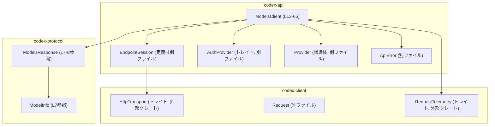
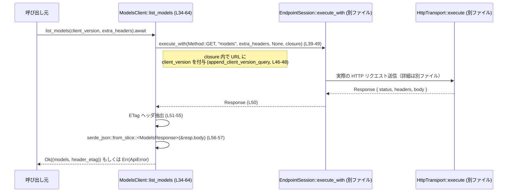

# codex-api/src/endpoint/models.rs コード解説

## 0. ざっくり一言

`ModelsClient` を通して `models` エンドポイントに HTTP GET を投げ、  
モデル一覧 (`Vec<ModelInfo>`) とレスポンスヘッダの `ETag` を取得するためのクライアント実装です（`models.rs:L13-65`）。

---

## 1. このモジュールの役割

### 1.1 概要

- このモジュールは **Codex API の `models` エンドポイントに対するクライアント** を提供します。
- HTTP トランスポート・認証・プロバイダ情報を `EndpointSession` に委譲しつつ、**クエリパラメータ `client_version` の付与** と **モデル一覧レスポンスの JSON デコード** を行います（`models.rs:L16-64`）。
- 利用者は `ModelsClient::list_models` を呼ぶことで、モデル一覧と `ETag` を一度に取得できます。

### 1.2 アーキテクチャ内での位置づけ

このモジュールが他コンポーネントとどのように連携するかを図示します。



※ `EndpointSession`, `AuthProvider`, `Provider`, `ApiError` の詳細実装はこのチャンクには現れません。

### 1.3 設計上のポイント

根拠となる行を併記します。

- **セッションオブジェクトへの委譲**  
  - `ModelsClient` は `EndpointSession<T, A>` を 1 フィールドだけ持つ薄いラッパーです（`models.rs:L13-15`）。
  - 実際の HTTP リクエスト組み立て・送信は `EndpointSession::execute_with` に委譲されています（`models.rs:L39-50`）。
- **非同期 API**  
  - モデル一覧取得は `pub async fn list_models` として定義され、非同期ランタイム上での利用を前提としています（`models.rs:L34-64`）。
- **型安全な依存の注入**  
  - トランスポート `T: HttpTransport` と認証 `A: AuthProvider` をジェネリックパラメータとして受け取ることで、テスト時にモック実装を注入しやすい構造になっています（`models.rs:L13`, `L16-21`, `L82-115`, `L116-122`）。
- **JSON デコードとエラーハンドリング**  
  - レスポンスボディは `serde_json::from_slice::<ModelsResponse>` でパースされ、失敗時には `ApiError::Stream` に変換されます（`models.rs:L56-62`）。
  - エラー時のメッセージにはレスポンスボディの内容が UTF-8 lossily に埋め込まれます（`models.rs:L58-61`）。
- **テレメトリの差し込み**  
  - `with_telemetry` で `RequestTelemetry` を `EndpointSession` に伝播させる仕組みがあります（`models.rs:L22-26`）。
- **ETag の抽出**  
  - レスポンスヘッダから `ETag` を取り出し、`Option<String>` として返します。ヘッダがない・UTF-8 として不正な場合は `None` になります（`models.rs:L51-55`）。

---

## 2. 主要な機能一覧

- `ModelsClient` の生成: HTTP トランスポートとプロバイダ、認証情報からクライアントを構築する（`models.rs:L17-21`）。
- テレメトリ付きクライアントの生成: `RequestTelemetry` を設定した新しい `ModelsClient` を返す（`models.rs:L22-26`）。
- モデル一覧の取得: `list_models` で `models` エンドポイントに GET し、`Vec<ModelInfo>` と `ETag` を返す（`models.rs:L34-64`）。
- （テスト用）トランスポートのモックと動作検証:
  - `CapturingTransport` による送信リクエストの記録と固定レスポンスの返却（`models.rs:L82-115`）。
  - `DummyAuth` によるダミー認証（`models.rs:L116-122`）。
  - `appends_client_version_query` など 3 つの非同期テスト（`models.rs:L139-238`）。

---

## 3. 公開 API と詳細解説

### 3.1 型一覧（構造体・列挙体など）

#### プロダクションコード

| 名前 | 種別 | 役割 / 用途 | 定義位置 |
|------|------|-------------|----------|
| `ModelsClient<T, A>` | 構造体 | `EndpointSession<T, A>` を内包し、`models` エンドポイント向けの API を提供するクライアント | `codex-api/src/endpoint/models.rs:L13-15` |

#### テストコード（`#[cfg(test)]` 内）

| 名前 | 種別 | 役割 / 用途 | 定義位置 |
|------|------|-------------|----------|
| `CapturingTransport` | 構造体 | `HttpTransport` のテスト用実装。最後に送信された `Request` とレスポンスボディ・ETag を保持する | `models.rs:L82-87` |
| `DummyAuth` | 構造体 | `AuthProvider` のテスト用ダミー実装。常にトークンなしを返す | `models.rs:L116-122` |

### 3.2 関数詳細

ここではコアロジックに関わる 4 つの関数／メソッドを詳細に説明します。

---

#### `ModelsClient::new(transport: T, provider: Provider, auth: A) -> Self`

**概要**

- 指定された HTTP トランスポート・プロバイダ設定・認証情報から `EndpointSession` を構築し、それを内包する `ModelsClient` を返します（`models.rs:L17-21`）。

**引数**

| 引数名 | 型 | 説明 |
|--------|----|------|
| `transport` | `T` where `T: HttpTransport` | 実際に HTTP リクエストを送信するトランスポート実装（例: 実サービス用クライアントやテスト用モック） |
| `provider` | `Provider` | ベース URL やリトライポリシ等を持つプロバイダ設定（定義は別ファイル） |
| `auth` | `A` where `A: AuthProvider` | 認証情報を提供する実装（例: ベアラートークン取得） |

**戻り値**

- `Self` (`ModelsClient<T, A>`)  
  内部に `EndpointSession<T, A>` を持つクライアントインスタンス（`models.rs:L18-20`）。

**内部処理の流れ**

1. `EndpointSession::new(transport, provider, auth)` を呼び出し（`models.rs:L19`）、セッションを構築。
2. そのセッションを `session` フィールドに格納した `ModelsClient` を返却（`models.rs:L18-20`）。

**Examples（使用例）**

```rust
// 仮の HttpTransport 実装 MyTransport と、AuthProvider 実装 MyAuth があるとする
use codex_api::endpoint::models::ModelsClient;
use codex_api::provider::Provider;

let transport = MyTransport::new();              // 実サービスあるいはモックのトランスポート
let provider  = make_provider();                 // ベースURLなどを設定した Provider
let auth      = MyAuth::new();                   // 認証情報保持

let client = ModelsClient::new(transport, provider, auth); // クライアント生成
```

**Errors / Panics**

- `new` 自体は `Result` を返さず、内部でも `unwrap` などは使っていないため、この関数単体でのエラーや panic の可能性はコード上確認できません（`models.rs:L17-21`）。

**Edge cases（エッジケース）**

- 引数 `transport`, `provider`, `auth` がどのような値であってもそのまま `EndpointSession::new` に渡されます。  
  `EndpointSession::new` 側の制約や前提条件は、このチャンクには現れません。

**使用上の注意点**

- `T` と `A` にどのような型を与えるかによって、スレッド安全性や非同期ランタイム依存が変わります。  
  例えば非同期関数 `list_models` をマルチスレッドで使う場合、`EndpointSession<T, A>` が `Send`/`Sync` かどうかは、`T` と `A` の実装に依存します（このファイルからは判断できません）。

---

#### `ModelsClient::with_telemetry(self, request: Option<Arc<dyn RequestTelemetry>>) -> Self`

**概要**

- 既存の `ModelsClient` インスタンスから、リクエストテレメトリを設定した新しい `ModelsClient` を生成します（`models.rs:L22-26`）。

**引数**

| 引数名 | 型 | 説明 |
|--------|----|------|
| `self` | `Self` | 元のクライアント。所有権がムーブされます。 |
| `request` | `Option<Arc<dyn RequestTelemetry>>` | リクエスト単位のメトリクス／トレース収集インターフェース。`None` ならテレメトリなし。 |

**戻り値**

- `Self`  
  内部の `EndpointSession` に対して `with_request_telemetry` を適用した新しいクライアント（`models.rs:L23-25`）。

**内部処理の流れ**

1. 元の `self.session` を用いて `self.session.with_request_telemetry(request)` を呼び出す（`models.rs:L24`）。
2. その結果を `session` フィールドに持つ `ModelsClient` を新たに構築して返す（`models.rs:L23-25`）。

**Examples（使用例）**

```rust
use std::sync::Arc;
use codex_client::RequestTelemetry;

// 既に作成済みの client があるとする
let client: ModelsClient<MyTransport, MyAuth> = make_client();

// ユーザー定義の RequestTelemetry 実装
struct MyTelemetry;
impl RequestTelemetry for MyTelemetry {
    // メソッド定義は省略（このファイルにはインターフェース定義がありません）
}

let telemetry = Arc::new(MyTelemetry);

// テレメトリ付きクライアントを生成
let client_with_telemetry = client.with_telemetry(Some(telemetry));
```

**Errors / Panics**

- このメソッド内には `unwrap` などはなく、`Result` も返していないため、メソッド自体はエラー・panic を発生させません（`models.rs:L22-26`）。
- `EndpointSession::with_request_telemetry` が内部で panic する可能性は、このチャンクからは分かりません。

**Edge cases（エッジケース）**

- `request` に `None` を渡した場合、`with_request_telemetry` の挙動（テレメトリ解除か、無変更か）は `EndpointSession` 側の実装に依存し、このチャンクからは不明です。
- `self` をムーブしているため、元のクライアントは以後使用できません。所有権の移動に注意が必要です（`models.rs:L22`）。

**使用上の注意点**

- `self` を消費するデザインのため、同じクライアントインスタンスをテレメトリあり／なしで併用したい場合は、元の `ModelsClient` を複数生成する必要があります。
- `Arc<dyn RequestTelemetry>` を使うことで、多数のリクエスト間で同一テレメトリインスタンスを共有できます。ただし `RequestTelemetry` 実装がスレッドセーフかどうかは、その実装次第です。

---

#### `ModelsClient::append_client_version_query(req: &mut codex_client::Request, client_version: &str)`

**概要**

- リクエスト URL の末尾に `client_version` クエリパラメータを付与します（`models.rs:L30-33`）。
- すでにクエリ文字列が存在する場合は `&`、存在しない場合は `?` をセパレータとして使用します。

**引数**

| 引数名 | 型 | 説明 |
|--------|----|------|
| `req` | `&mut codex_client::Request` | URL を含むリクエストオブジェクト。`url` フィールドが直接書き換えられます。 |
| `client_version` | `&str` | 付与するクライアリパラメータ `client_version` の値。 |

**戻り値**

- なし (`()`)

**内部処理の流れ**

1. `req.url.contains('?')` で URL に `?` が含まれるか判定（`models.rs:L31`）。
2. 含まれていれば `separator = '&'`、含まれていなければ `separator = '?'` を選択（`models.rs:L31`）。
3. `format!("{}{}client_version={client_version}", req.url, separator)` で新しい URL を作成し、`req.url` に代入（`models.rs:L32`）。

**Examples（使用例）**

テストでの利用例（簡略化）:

```rust
use codex_client::Request;

let mut req = Request {
    // 他フィールドは省略
    url: "https://example.com/api/codex/models".to_string(),
    // ...
};

ModelsClient::<CapturingTransport, DummyAuth>::append_client_version_query(
    &mut req,
    "0.99.0",
);

assert_eq!(
    req.url,
    "https://example.com/api/codex/models?client_version=0.99.0"
);
```

※ 実際にはこのメソッドは `list_models` 内のクロージャから呼ばれており、外部から直接呼ばれることはありません（`models.rs:L46-48`）。

**Errors / Panics**

- この関数内に `unwrap` 等はなく、標準ライブラリの安全な API (`contains`, `format!`) のみを使用しているため、通常は panic しません（`models.rs:L30-33`）。

**Edge cases（エッジケース）**

- すでに URL にクエリがある場合  
  例: `https://example.com/path?foo=bar`  
  → `https://example.com/path?foo=bar&client_version=...` のようになります（`models.rs:L31-32`）。
- `client_version` に `&` や `?` や空白など、クエリとして特別な意味を持つ文字が含まれている場合:
  - この関数は URL エンコードを行っていないため、結果の URL はエンコードされていません（`models.rs:L32`）。
  - 外部から渡される任意文字列を `client_version` に使う場合は、事前に URL エンコードする必要があります。
- `req.url` にすでに `client_version` が含まれていても、それを上書きせず単純に末尾に追記します。重複に関する扱いはサーバ側の実装に依存します。

**使用上の注意点**

- セキュリティ／安全性の観点:
  - `client_version` が外部から渡される値である場合、URL エンコードやバリデーションを行わないと、クエリ文字列の構造が崩れる可能性があります。  
    この関数自体は入力の検証を行っていません（`models.rs:L30-33`）。
- 並行性:
  - `req` は可変参照で受け取っているため、この関数の呼び出し時点でその `Request` を他スレッドから同時に操作していないことが前提です。

---

#### `ModelsClient::list_models(&self, client_version: &str, extra_headers: HeaderMap) -> Result<(Vec<ModelInfo>, Option<String>), ApiError>`

**概要**

- `models` エンドポイントに対して HTTP GET リクエストを送り、
  1. レスポンスボディを `ModelsResponse` として JSON デコードした上で `Vec<ModelInfo>` を取り出し、
  2. レスポンスヘッダから `ETag` を `Option<String>` として抽出し、
- これらを `(models, header_etag)` のタプルとして返す非同期関数です（`models.rs:L34-64`）。

**引数**

| 引数名 | 型 | 説明 |
|--------|----|------|
| `&self` | `&ModelsClient<T, A>` | クライアント本体の参照。内部の `EndpointSession` を通じて HTTP を発行します。 |
| `client_version` | `&str` | クエリパラメータ `client_version` の値。URL に付与されます（`models.rs:L46-48`）。 |
| `extra_headers` | `HeaderMap` | リクエストに追加送信するヘッダマップ。`EndpointSession::execute_with` に渡されます（`models.rs:L44`）。 |

**戻り値**

- `Result<(Vec<ModelInfo>, Option<String>), ApiError>`  
  - `Ok((models, etag))`:
    - `models`: パースされた `Vec<ModelInfo>`（`ModelsResponse` の `models` フィールド）（`models.rs:L56-63`）。
    - `etag`: レスポンスヘッダ `ETag` が UTF-8 として解釈できた場合は `Some(String)`、存在しないか不正な場合は `None`（`models.rs:L51-55`）。
  - `Err(ApiError)`: HTTP 通信や JSON パースなどで発生したエラー。詳細は `ApiError` の実装次第ですが、JSON パースエラーの場合 `ApiError::Stream` が使われます（`models.rs:L56-62`）。

**内部処理の流れ（アルゴリズム）**



**Errors / Panics**

***HTTP 通信・トランスポート層のエラー***

- `self.session.execute_with(...).await?` により、`EndpointSession::execute_with` が返すエラーは `?` 演算子でそのまま `ApiError` に変換され、呼び出し元に伝播します（`models.rs:L39-50`）。
- 具体的な変換ルール（例えば `TransportError` → `ApiError`）は `EndpointSession` の実装に依存し、このチャンクからは分かりません。

***ETag 抽出時のエラー***

- `.get(ETAG)` でヘッダを取得し、`.to_str().ok()` で UTF-8 文字列として解釈できなければ `None` が返されます（`models.rs:L51-55`）。
- この部分で panic する可能性はありません。

***JSON パースエラー***

- `serde_json::from_slice::<ModelsResponse>(&resp.body)` がエラーを返した場合、`map_err` によって `ApiError::Stream` に変換されます（`models.rs:L56-62`）。
- その際、エラーメッセージには元の `serde_json` エラー内容と、レスポンスボディを UTF-8 lossily 変換した文字列が含まれます（`models.rs:L58-61`）。
- panic は発生せず、`Err(ApiError::Stream(...))` として返されます。

***Panics***

- この関数内に `unwrap` などは存在しないため、少なくとも `list_models` の内部で直接 panic が発生する箇所は見当たりません（`models.rs:L34-64`）。
- ただし、呼び出している `EndpointSession::execute_with` や `serde_json::from_slice` が内部で panic する可能性は、ここからは判断できません。

**Edge cases（エッジケース）**

- **ETag ヘッダが存在しない場合**  
  → `header_etag` は `None` になります（`models.rs:L51-55`）。  
  テスト `list_models_includes_etag` では、存在する場合に `Some("\"abc\"".to_string())` が得られることを確認しています（`models.rs:L219-238`）。

- **ETag ヘッダが UTF-8 でない場合**  
  → `.to_str().ok()` が `None` を返すため、`header_etag` は `None` になります（`models.rs:L53-55`）。  
  バイナリ値や不正なエンコーディングの ETag は静かに無視されます。

- **レスポンスボディが空またはフォーマット不正な場合**  
  → `serde_json::from_slice::<ModelsResponse>(&resp.body)` がエラーとなり、`ApiError::Stream` が返ります（`models.rs:L56-62`）。  
  テスト `parses_models_response` では、期待通りにパースできる JSON の例が使われています（`models.rs:L170-199`）。

- **`client_version` に特殊文字が含まれる場合**  
  → `append_client_version_query` が URL エンコードを行わないため、URL のクエリ部分が意図せず壊れたり、サーバ側で正しく解釈されない可能性があります（`models.rs:L30-33`, `L46-48`）。

**使用上の注意点**

- **非同期コンテキスト必須**  
  - `list_models` は `async fn` のため、Tokio などの非同期ランタイム上で `.await` する必要があります（`models.rs:L34`）。  
    テストでは `#[tokio::test]` が使用されています（`models.rs:L139`, `L170`, `L219`）。

- **レスポンスボディの露出**  
  - JSON パース失敗時の `ApiError::Stream` には、レスポンスボディ（`String::from_utf8_lossy(&resp.body)`）が含まれます（`models.rs:L58-61`）。  
    上位層でこのエラーをログ出力する場合、機密情報が含まれうる点に注意が必要です。

- **並行性**  
  - `&self` で呼び出せるため、同一 `ModelsClient` を複数タスクから同時に `list_models` することはシグネチャ上許容されています（`models.rs:L34-36`）。  
    実際にスレッドセーフかどうかは `EndpointSession<T, A>` の実装に依存し、このチャンクからは判断できません。

- **追加ヘッダの扱い**  
  - `extra_headers` はそのまま `EndpointSession::execute_with` に渡されます（`models.rs:L44`）。  
    認証ヘッダや必須ヘッダの競合や上書きがどう扱われるかは `EndpointSession` の実装に依存します。

---

### 3.3 その他の関数・テスト用関数

#### プロダクションコード内の補助関数

| 関数名 | 役割（1 行） | 定義位置 |
|--------|--------------|----------|
| `ModelsClient::path() -> &'static str` | `models` エンドポイントのパス文字列 `"models"` を返す | `models.rs:L27-29` |

#### テストモジュール内の関数等

| 関数名 / メソッド | 役割（1 行） | 定義位置 |
|-------------------|--------------|----------|
| `CapturingTransport::default()` | 空の `ModelsResponse` と `None` の ETag を持つデフォルトトランスポートを生成 | `models.rs:L88-96` |
| `CapturingTransport::execute(&self, req: Request)` | 受け取ったリクエストを `last_request` に保存し、固定の JSON ボディと任意の ETag を返す | `models.rs:L99-111` |
| `CapturingTransport::stream(&self, _req: Request)` | テストでは利用されるべきでないため、必ずエラーを返す | `models.rs:L112-114` |
| `DummyAuth::bearer_token(&self)` | 常に `None` を返す認証実装 | `models.rs:L118-122` |
| `provider(base_url: &str)` | テスト用の `Provider` 構造体を生成するユーティリティ | `models.rs:L123-138` |
| `appends_client_version_query()` | URL に `client_version` クエリが付与されることを検証する非同期テスト | `models.rs:L139-169` |
| `parses_models_response()` | JSON レスポンスから `ModelInfo` が正しくパースされることを検証する非同期テスト | `models.rs:L170-218` |
| `list_models_includes_etag()` | `list_models` の戻り値に `ETag` が含まれることを検証する非同期テスト | `models.rs:L219-238` |

---

## 4. データフロー

ここでは代表的なシナリオとして「モデル一覧取得」のデータフローを説明します。

1. 利用者が `ModelsClient::list_models("0.99.0", extra_headers).await` を呼び出します（`models.rs:L34-38`, `L152-155`）。
2. `ModelsClient` は `EndpointSession::execute_with` に対して:
   - HTTP メソッド `GET`（`Method::GET`）、
   - パス `"models"`（`Self::path()` の戻り値、`models.rs:L27-29`, `L42-43`）、
   - 追加ヘッダ `extra_headers`（`models.rs:L44`）、
   - ボディ `None`（`models.rs:L45`）、
   - リクエスト URL に `client_version` を追加するクロージャ  
     を渡して実行します（`models.rs:L39-49`）。
3. `EndpointSession` は内部で `codex_client::Request` を組み立て、`HttpTransport` 実装の `execute` を呼び出すと考えられますが、詳細実装はこのチャンクには現れません。
4. HTTP レスポンスを受け取った後、`ModelsClient` は:
   - `ETag` ヘッダを抽出して `Option<String>` に変換（`models.rs:L51-55`）。
   - ボディを `ModelsResponse` として JSON デコードし、`models` フィールドを取り出す（`models.rs:L56-63`）。
5. 最終的に `(models, header_etag)` を `Ok` で返すか、途中のエラーを `Err(ApiError)` として返します（`models.rs:L39-50`, `L56-63`）。

Mermaid のシーケンス図は 3.2 の `list_models` セクションに掲載した通りです。

---

## 5. 使い方（How to Use）

### 5.1 基本的な使用方法

`ModelsClient` を使ってモデル一覧を取得する基本フローの例です。  
実際には `T: HttpTransport` と `A: AuthProvider` の具体的な実装が別途必要です。

```rust
use codex_api::endpoint::models::ModelsClient;
use codex_api::provider::Provider;
use http::HeaderMap;

// 仮のトランスポート・認証型
use my_crate::{MyTransport, MyAuth};

#[tokio::main]
async fn main() -> Result<(), Box<dyn std::error::Error>> {
    // Provider 設定（このファイルの provider 関数を参考にする）
    let provider = Provider {
        name: "prod".to_string(),
        base_url: "https://example.com/api/codex".to_string(),
        query_params: None,
        headers: HeaderMap::new(),
        retry: /* RetryConfig の具体値 */,
        stream_idle_timeout: std::time::Duration::from_secs(30),
    };

    let transport = MyTransport::new();
    let auth = MyAuth::new();

    // クライアントの生成
    let client = ModelsClient::new(transport, provider, auth);

    // 追加ヘッダ（なければ空でOK）
    let extra_headers = HeaderMap::new();

    // モデル一覧の取得
    let (models, etag_opt) = client
        .list_models("1.0.0", extra_headers)
        .await?;  // ApiError がここで ? によって伝播する

    println!("models count = {}", models.len());
    if let Some(etag) = etag_opt {
        println!("ETag: {}", etag);
    }

    Ok(())
}
```

### 5.2 よくある使用パターン

#### パターン1: テレメトリ付きクライアント

リクエストごとにテレメトリを付与したい場合の例です。

```rust
use std::sync::Arc;
use codex_client::RequestTelemetry;
use codex_api::endpoint::models::ModelsClient;

#[derive(Clone)]
struct MyTelemetry;
impl RequestTelemetry for MyTelemetry {
    // 必要なメソッドを実装（定義はこのチャンクにはない）
}

async fn use_client_with_telemetry<T, A>(base_client: ModelsClient<T, A>)
where
    T: codex_client::HttpTransport + Clone,
    A: codex_api::auth::AuthProvider + Clone,
{
    let telemetry = Arc::new(MyTelemetry);

    // テレメトリを設定した新しいクライアントを作る
    let client = base_client.with_telemetry(Some(telemetry));

    let (models, _etag) = client
        .list_models("1.0.0", http::HeaderMap::new())
        .await
        .expect("request should succeed");

    println!("models = {}", models.len());
}
```

#### パターン2: ETag の活用（利用例）

`list_models` は `ETag` を `Option<String>` として返します（`models.rs:L51-55`, `L63`）。  
この値を呼び出し側で保持し、条件付きリクエストを行うような使い方も可能です（HTTP `If-None-Match` ヘッダの利用など）。  
ただし、そのような条件付きリクエストが実際にサポートされているかどうかは、このファイルからは分かりません。

```rust
use http::{HeaderMap, header::IF_NONE_MATCH};

async fn get_models_with_etag<T, A>(
    client: &ModelsClient<T, A>,
    previous_etag: Option<String>,
) -> Result<(Vec<ModelInfo>, Option<String>), ApiError>
where
    T: codex_client::HttpTransport,
    A: codex_api::auth::AuthProvider,
{
    let mut headers = HeaderMap::new();
    if let Some(etag) = previous_etag {
        headers.insert(IF_NONE_MATCH, etag.parse().unwrap());
    }

    client.list_models("1.0.0", headers).await
}
```

※ 上記は呼び出し側の一例であり、サーバ側の挙動はこのコードからは分かりません。

### 5.3 よくある間違い

```rust
// 間違い例: 非同期ランタイム外で .await しようとしている
fn main() {
    let client = make_client();
    // let (models, etag) = client.list_models("1.0.0", HeaderMap::new()).await;
    // ↑ コンパイルエラー: main が async でない
}

// 正しい例: Tokio などのランタイムで async main を定義
#[tokio::main]
async fn main() {
    let client = make_client(); // ModelsClient<T, A>
    let (models, etag) = client
        .list_models("1.0.0", http::HeaderMap::new())
        .await
        .expect("request should succeed");
}
```

```rust
// 間違い例: with_telemetry 呼び出し後に古い client を使ってしまう
let client = make_client();
let client2 = client.with_telemetry(None);
// println!("{:?}", client); // 所有権が移動済みなのでコンパイルエラー

// 正しい例: 変数を上書きするか、別名を使う
let client = make_client();
let client = client.with_telemetry(None); // 変数を再束縛して使う
```

### 5.4 使用上の注意点（まとめ）

- **非同期実行環境**  
  - `list_models` は `async fn` であり、Tokio などの非同期ランタイムで `.await` する必要があります（`models.rs:L34`）。
- **クエリ文字列の安全性**  
  - `client_version` は URL エンコードされずに直接クエリ文字列に埋め込まれます（`models.rs:L30-32`）。  
    外部入力から生成する場合は、事前のエンコードやバリデーションが推奨されます。
- **エラーメッセージの取り扱い**  
  - JSON パースエラー時、レスポンスボディの内容がエラーメッセージに含まれるため（`models.rs:L58-61`）、ログ出力する際には情報漏えいの可能性に注意する必要があります。
- **スレッド安全性**  
  - `ModelsClient` のフィールドは `EndpointSession<T, A>` のみであり（`models.rs:L13-15`）、スレッド安全性は `T` と `A` の実装、および `EndpointSession` の設計に依存します。  
    `list_models` は `&self` で呼べるため、マルチスレッド環境での共有を想定する場合は、これらの型が `Send`/`Sync` を満たすか確認する必要があります。

---

## 6. 変更の仕方（How to Modify）

### 6.1 新しい機能を追加する場合

例として、`models` エンドポイントに別の操作（例: モデル詳細取得）が必要になった場合を考えます。

1. **メソッドの追加場所**  
   - `ModelsClient` の `impl` ブロック（`models.rs:L16-65`）に、新しい `pub async fn` を追加するのが自然です。
2. **`EndpointSession` の利用**  
   - 既存の `list_models` 同様、`self.session.execute_with` を利用して HTTP リクエストを行うパターンが考えられます（`models.rs:L39-50`）。  
     ただし `execute_with` の詳細なシグネチャはこのチャンクにはないため、別ファイルの定義を確認する必要があります。
3. **パスや HTTP メソッドの指定**  
   - パスが `models` 以外であれば、`path()` と同様のプライベート関数を新たに定義するか、メソッド内に直接文字列リテラルを書くことができます（`models.rs:L27-29`）。
4. **レスポンス型の扱い**  
   - `ModelsResponse` / `ModelInfo` 以外の型を扱う場合は、`codex_protocol` の対応する型をインポートして利用します（`models.rs:L7-8`）。
5. **エラーハンドリング**  
   - JSON デコードに `serde_json::from_slice` を使い、エラーを `ApiError` に変換するパターンは `list_models` を参照できます（`models.rs:L56-62`）。

### 6.2 既存の機能を変更する場合

`list_models` の振る舞いを変更／拡張する際に確認すべき点です。

- **影響範囲の確認**
  - テストモジュール内の 3 つのテスト関数（`appends_client_version_query`, `parses_models_response`, `list_models_includes_etag`）は `list_models` の具体的な挙動に依存しています（`models.rs:L139-238`）。
  - インターフェース（引数や戻り値）を変更する場合、これらのテストと他モジュールからの呼び出し箇所も修正が必要です。

- **契約（前提条件・返り値の意味）**
  - `client_version` が必須かどうか、どのような形式を受け入れるか、といった仕様はこのコードからは明示されていません。変更時には API ドキュメントや上位仕様を確認する必要があります。
  - 戻り値の `Option<String>` が `ETag` を表すこと（存在しない場合は `None`）はコードに基づく事実です（`models.rs:L51-55`, `L63`）。他箇所でこの契約に依存していないか確認が必要です。

- **エラーメッセージ形式**
  - JSON デコードエラー時のメッセージフォーマット（`"failed to decode models response: {e}; body: {}"`）を変更する場合、ログ解析やモニタリングツールがこの文字列に依存していないか確認します（`models.rs:L58-60`）。

- **テストの更新**
  - URL の生成ロジック（`append_client_version_query`）を変更する場合は、`appends_client_version_query` テストの期待値（URL 文字列）も合わせて更新する必要があります（`models.rs:L139-169`）。
  - レスポンス JSON の形式を変更した場合は、`parses_models_response` の JSON サンプルも更新する必要があります（`models.rs:L170-199`）。

---

## 7. 関連ファイル

このモジュールと密接に関係する型・モジュールの一覧です。  
定義がこのチャンクに存在しないものは「詳細不明」と明記します。

| パス / 型名 | 役割 / 関係 |
|-------------|------------|
| `crate::endpoint::session::EndpointSession` | `ModelsClient` が内部に保持するセッション型。HTTP リクエストの組み立て・送信・リトライなどを担当していると推測されますが、実装はこのチャンクには現れません（`models.rs:L2`, `L14`, `L19`, `L39-41`）。 |
| `crate::auth::AuthProvider` | 認証情報を提供するトレイト。`ModelsClient` のジェネリックパラメータ `A` の制約として利用されています（`models.rs:L1`, `L13`, `L16`）。 |
| `crate::provider::Provider` | ベース URL やリトライ設定を含む構造体。`ModelsClient::new` の引数となっています（`models.rs:L4`, `L17`, `L123-138`）。 |
| `crate::provider::RetryConfig` | テスト用 `provider` 関数で使用されるリトライ設定構造体（`models.rs:L69`, `L129-135`）。 |
| `crate::error::ApiError` | `list_models` が返すエラー型。HTTP 通信エラーや JSON パースエラーをまとめて表現します（`models.rs:L3`, `L38`, `L56-62`）。 |
| `codex_client::HttpTransport` | 実際の HTTP 通信インターフェースを表すトレイト。`ModelsClient` のジェネリックパラメータ `T` の制約です（`models.rs:L5`, `L13`, `L16`, `L97-115`）。 |
| `codex_client::Request`, `Response`, `StreamResponse`, `TransportError` | テスト用トランスポート `CapturingTransport` 内で使用される、HTTP リクエスト・レスポンスとそのエラー型（`models.rs:L71-74`, `L99-114`）。 |
| `codex_client::RequestTelemetry` | リクエスト毎のテレメトリを表すトレイト。`with_telemetry` で `Option<Arc<dyn RequestTelemetry>>` として使用されます（`models.rs:L6`, `L22`）。 |
| `codex_protocol::openai_models::ModelsResponse`, `ModelInfo` | `models` エンドポイントの JSON レスポンス形式と、そこに含まれるモデル情報の型（`models.rs:L7-8`, `L56-63`, `L170-199`）。 |

このファイルは、`models` エンドポイント専用の薄いクライアントレイヤとして設計されており、  
HTTP レイヤ（`EndpointSession` / `HttpTransport`）とプロトコル定義（`ModelsResponse` / `ModelInfo`）の橋渡しを行う役割を担っています。
