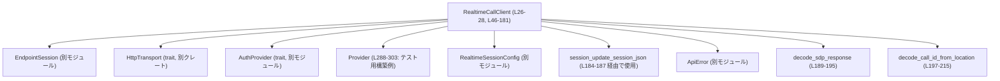
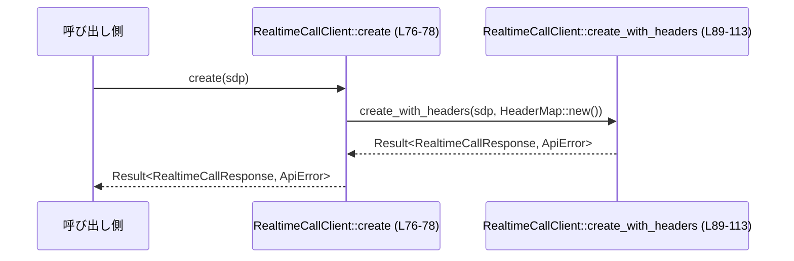
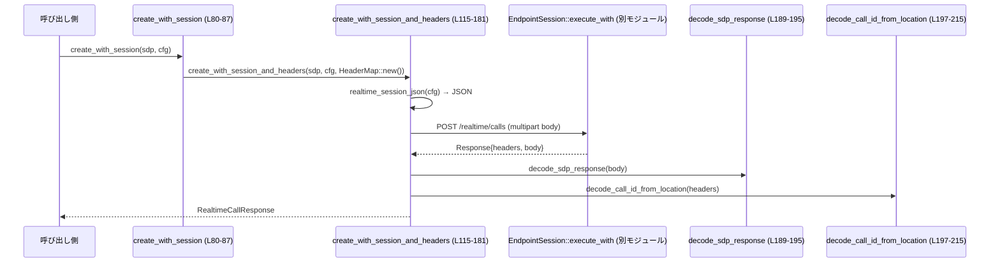
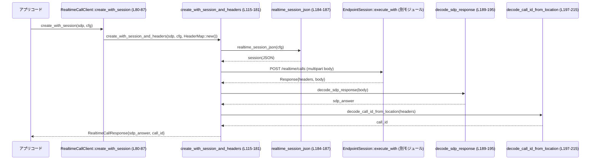

# codex-api/src/endpoint/realtime_call.rs

## 0. ざっくり一言

WebRTC の Realtime コール（音声通話など）の **SDP オファーを送信してコールを作成し、その応答 SDP と call_id を取得するクライアント**を提供するモジュールです（`RealtimeCallClient`、`RealtimeCallResponse`）（realtime_call.rs:L26-38, L46-181）。

---

## 1. このモジュールの役割

### 1.1 概要

- このモジュールは、**Codex/OpenAI API もしくは backend-api 経由で WebRTC Realtime call を開始する HTTP クライアント**として機能します。
- クライアントは、SDP オファー（`String`）を HTTP POST で送信し、応答ボディから SDP を復号し、`Location` ヘッダから `call_id` を抽出して返します（realtime_call.rs:L76-113, L115-181, L189-215）。
- backend API 用と通常 API 用で **リクエストフォーマット（JSON vs multipart/form-data）を切り替える**ロジックも含まれます（realtime_call.rs:L121-142, L144-158）。

### 1.2 アーキテクチャ内での位置づけ

主な依存関係は以下です。

- `EndpointSession<T, A>`: HTTP 実行や認証、ベース URL 管理を担う抽象セッション（定義はこのチャンクには現れません）（realtime_call.rs:L26-27, L47-51, L94-107, L135-138, L160-175）。
- `HttpTransport`: 実際の HTTP トランスポート抽象（realtime_call.rs:L8, L46）。
- `AuthProvider`: 認証トークン取得の抽象（realtime_call.rs:L1, L46）。
- `Provider`: ベース URL やリトライ設定を持つ設定構造体（realtime_call.rs:L6, L47-51, tests L288-303）。
- `RealtimeSessionConfig` と `session_update_session_json`: Realtime WebSocket セッション設定を JSON にするための補助（realtime_call.rs:L2-3, L115-127, L184-187）。
- `ApiError`: このクライアントが返すエラー型（realtime_call.rs:L5, L76, L80-87, L89-93, L115-120, L184-215）。

依存関係図（このファイル全体 L1-534 を対象）:



`EndpointSession` や `RealtimeSessionConfig` の内部構造はこのチャンクには現れないため、不明です。

### 1.3 設計上のポイント

- **ジェネリックな HTTP 実装**  
  - クライアントは `HttpTransport` と `AuthProvider` をジェネリクスで受け取り、特定の HTTP クライアント実装に依存しません（realtime_call.rs:L26, L46）。
- **エラーはすべて `Result<_, ApiError>` で明示的に扱う**  
  - SDP デコード失敗や `Location` ヘッダ不備などを `ApiError::Stream` / `ApiError::InvalidRequest` にマッピングしています（realtime_call.rs:L134-135, L144-146, L184-187, L189-195, L197-215）。
- **backend-api 用と通常 API 用の二系統のリクエストフォーマット**  
  - `Provider.base_url` に `/backend-api` が含まれるかどうかで JSON ボディか multipart ボディかを切り替えます（realtime_call.rs:L63-65, L121-142, L144-158）。
- **非同期 + 安全性**  
  - すべてのネットワーク処理は `async fn` として定義されており（`create*` 系）、`HttpTransport` の `async fn execute` に委譲します（realtime_call.rs:L76-78, L80-87, L89-113, L115-181, tests L263-277）。
  - このファイル内では `unsafe` は一切使用されていません。
- **オブザーバビリティ**  
  - `tracing::instrument` によるスパン計測（`create` に付与）（realtime_call.rs:L67-75）。
  - `with_telemetry` で `RequestTelemetry` を `EndpointSession` に設定可能（realtime_call.rs:L53-57）。

---

## 2. 主要な機能一覧

- Realtime call クライアントの構築: `RealtimeCallClient::new` で HTTP トランスポート・プロバイダ・認証を束ねます（realtime_call.rs:L47-51）。
- 単純な SDP オファー送信: `RealtimeCallClient::create` / `create_with_headers` により SDP をそのまま HTTP ボディとして POST します（realtime_call.rs:L76-78, L89-113）。
- セッション情報付き call 作成: `RealtimeCallClient::create_with_session` / `create_with_session_and_headers` で WebSocket セッション設定を同時に送信します（realtime_call.rs:L80-87, L115-181）。
- backend-api 向け JSON リクエストと通常 API 向け multipart/form-data の切り替え（realtime_call.rs:L121-142, L144-158）。
- 応答処理ユーティリティ:
  - SDP ボディの UTF-8 デコード: `decode_sdp_response`（realtime_call.rs:L189-195）。
  - `Location` ヘッダから `rtc_...` call_id を抽出: `decode_call_id_from_location`（realtime_call.rs:L197-215）。
- Realtime セッション JSON 生成ラッパー: `realtime_session_json`（realtime_call.rs:L184-187）。

---

## 3. 公開 API と詳細解説

### 3.1 型一覧（構造体など）

| 名前 | 種別 | 公開範囲 | 役割 / 用途 | 定義位置 |
|------|------|----------|-------------|----------|
| `RealtimeCallClient<T, A>` | 構造体 | `pub` | Realtime call 作成用の HTTP クライアント。内部で `EndpointSession<T, A>` を保持します。 | realtime_call.rs:L26-28 |
| `RealtimeCallResponse` | 構造体 | `pub` | Call 作成応答を表す。SDP と `call_id` を保持します。 | realtime_call.rs:L30-38 |
| `BackendRealtimeCallRequest<'a>` | 構造体 | モジュール内限定 | backend-api 用の JSON リクエストボディ (`sdp` + `session`) を表現します。 | realtime_call.rs:L40-44 |
| `CapturingTransport` | 構造体 | tests モジュール内 | テスト用の `HttpTransport` 実装。最後に送信された `Request` と固定ヘッダを保持します。 | realtime_call.rs:L235-239 |
| `DummyAuth` | 構造体 | tests モジュール内 | テスト用の `AuthProvider` 実装。固定のトークンを返します。 | realtime_call.rs:L279-280 |

> 補足: `EndpointSession`, `Provider`, `RealtimeSessionConfig` などは他モジュールで定義されており、このチャンクには定義が現れないため詳細は不明です。

#### コンポーネントインベントリー（関数・メソッド）

25 個の関数／メソッドを一覧化します（Meta: functions=25）。

**本体部分**

| 名称 | 種別 | 役割 | 定義位置 |
|------|------|------|----------|
| `RealtimeCallClient::new` | 関連関数 | `EndpointSession` を初期化してクライアントを生成 | realtime_call.rs:L47-51 |
| `RealtimeCallClient::with_telemetry` | メソッド (by value) | `RequestTelemetry` を組み込んだクライアントを返す | realtime_call.rs:L53-57 |
| `RealtimeCallClient::path` | 関連関数 (private) | 共通 API パス `"realtime/calls"` を返す | realtime_call.rs:L59-61 |
| `RealtimeCallClient::uses_backend_request_shape` | メソッド (private) | `Provider.base_url` に `/backend-api` を含むかどうかを判定 | realtime_call.rs:L63-65 |
| `RealtimeCallClient::create` | `async` メソッド | ヘッダ追加なしで SDP オファーを送信 | realtime_call.rs:L67-78 |
| `RealtimeCallClient::create_with_session` | `async` メソッド | セッション設定つき call 作成（ヘッダ追加なし） | realtime_call.rs:L80-87 |
| `RealtimeCallClient::create_with_headers` | `async` メソッド | 任意ヘッダ付きで SDP オファー送信 | realtime_call.rs:L89-113 |
| `RealtimeCallClient::create_with_session_and_headers` | `async` メソッド | 任意ヘッダ・セッション設定付きで call 作成 | realtime_call.rs:L115-181 |
| `realtime_session_json` | 関数 | `RealtimeSessionConfig` からセッション JSON を作成するラッパー | realtime_call.rs:L184-187 |
| `decode_sdp_response` | 関数 | HTTP ボディを UTF-8 文字列に変換 | realtime_call.rs:L189-195 |
| `decode_call_id_from_location` | 関数 | `Location` ヘッダから `rtc_...` call_id を抽出 | realtime_call.rs:L197-215 |

**tests モジュール**

| 名称 | 種別 | 役割 | 定義位置 |
|------|------|------|----------|
| `CapturingTransport::new` | 関連関数 | 既定の `Location` ヘッダ付きテストトランスポート生成 | realtime_call.rs:L241-244 |
| `CapturingTransport::with_location` | 関連関数 | 任意 `Location` ヘッダ付きトランスポート生成 | realtime_call.rs:L246-253 |
| `CapturingTransport::without_location` | 関連関数 | `Location` ヘッダなしトランスポート生成 | realtime_call.rs:L255-260 |
| `CapturingTransport::execute` | `async` メソッド（trait 実装） | リクエストを保存し、固定レスポンスを返す | realtime_call.rs:L263-272 |
| `CapturingTransport::stream` | `async` メソッド（trait 実装） | 常にエラーを返す（このモジュールでは利用しないことを確認する） | realtime_call.rs:L274-276 |
| `DummyAuth::bearer_token` | メソッド（trait 実装） | 固定トークン `"test-token"` を返す | realtime_call.rs:L282-285 |
| `provider` | 関数 | テスト用 `Provider` 構築 | realtime_call.rs:L288-303 |
| `realtime_session_config` | 関数 | テスト用 `RealtimeSessionConfig` 構築 | realtime_call.rs:L305-313 |
| `sends_sdp_offer_as_raw_body` | `#[tokio::test]` | `create` が SDP を raw body + `application/sdp` で送ることを確認 | realtime_call.rs:L316-356 |
| `extracts_call_id_from_forwarded_backend_location` | `#[tokio::test]` | backend 経由の Location パスから call_id を抽出できることを確認 | realtime_call.rs:L358-391 |
| `sends_api_session_call_as_multipart_body` | `#[tokio::test]` | 通常 API 用セッション付き call が multipart/form-data になることを確認 | realtime_call.rs:L393-452 |
| `sends_backend_session_call_as_json_body` | `#[tokio::test]` | backend 用セッション付き call が JSON body になることを確認 | realtime_call.rs:L455-501 |
| `errors_when_location_is_missing` | `#[tokio::test]` | Location ヘッダ欠如時にエラーとなることを確認 | realtime_call.rs:L504-519 |
| `rejects_location_without_call_id` | `#[test]` | `rtc_` セグメントを含まない Location をエラーにすることを確認 | realtime_call.rs:L521-533 |

---

### 3.2 関数詳細（主要 7 件）

#### `RealtimeCallClient::create(&self, sdp: String) -> Result<RealtimeCallResponse, ApiError>`

**概要**

- SDP オファーを HTTP POST で `/realtime/calls` に送信し、応答から SDP と `call_id` を抽出して返します（realtime_call.rs:L67-78）。
- 追加ヘッダはなく、最もシンプルな call 作成 API です。

**引数**

| 引数名 | 型 | 説明 |
|--------|----|------|
| `&self` | `&RealtimeCallClient<T, A>` | 既に初期化されたクライアントインスタンス |
| `sdp` | `String` | 送信する SDP オファー文字列 |

**戻り値**

- `Ok(RealtimeCallResponse)`  
  - `sdp`: 応答ボディから UTF-8 として復号した SDP（realtime_call.rs:L109-110, L189-195）。
  - `call_id`: `Location` ヘッダから抽出された `rtc_...` 形式の ID（realtime_call.rs:L110, L197-215）。
- `Err(ApiError)`  
  - HTTP 実行エラー、応答ボディが非 UTF-8、`Location` ヘッダ問題など。

**内部処理の流れ**

1. 新しい空の `HeaderMap` を作成（`HeaderMap::new()`）（realtime_call.rs:L77）。
2. `create_with_headers(sdp, extra_headers)` を呼び出し、その `Future` を `await` します（realtime_call.rs:L76-78）。
3. エラー処理や応答処理はすべて `create_with_headers` に委譲されます。

フロー図:



**Examples（使用例）**

```rust
use codex_api::endpoint::realtime_call::RealtimeCallClient;
// HttpTransport と AuthProvider の具体型は別モジュール側で用意されている想定です。

#[tokio::main]
async fn main() -> Result<(), Box<dyn std::error::Error>> {
    // transport, provider, auth は適切な実装を用意する
    let transport = /* T: HttpTransport */ unimplemented!();
    let provider = /* Provider */ unimplemented!();
    let auth = /* A: AuthProvider */ unimplemented!();

    let client = RealtimeCallClient::new(transport, provider, auth);
    let offer_sdp = "v=0\r\n...".to_string();

    let response = client.create(offer_sdp).await?; // realtime_call.rs:L76-78

    println!("Answer SDP: {}", response.sdp);
    println!("Call ID: {}", response.call_id);
    Ok(())
}
```

**Errors / Panics**

- `Err(ApiError)` になりうるケース（いずれも `create_with_headers` → `decode_*` による）:
  - HTTP 実行に失敗した場合（`EndpointSession::execute_with` 内のエラー）（realtime_call.rs:L94-107）。  
    → `ApiError` の具体的なバリアントはこのチャンクには現れません。
  - 応答ボディが UTF-8 でない場合:  
    `String::from_utf8` 失敗 → `"failed to decode realtime call SDP response: {err}"` メッセージで `ApiError::Stream`（realtime_call.rs:L189-195）。
  - `Location` ヘッダが欠如している場合:  
    `"realtime call response missing Location"` で `ApiError::Stream`（realtime_call.rs:L197-201）。
  - `Location` ヘッダ値が非 UTF-8 の場合:  
    `"invalid realtime call Location: {err}"` で `ApiError::Stream`（realtime_call.rs:L201-202）。
  - `Location` に `rtc_` セグメントが含まれない場合:  
    `"realtime call Location does not contain a call id: {location}"`（realtime_call.rs:L204-215）。

- `create` 自体には `panic!` 呼び出しはありません。

**Edge cases（エッジケース）**

- `sdp` が空文字列でも、そのままサーバに送信されます（realtime_call.rs:L104-105）。サーバ側の扱いはこのチャンクからは分かりません。
- 応答ボディが空 (`body == b""`) の場合、`decode_sdp_response` は空文字列として成功します（`String::from_utf8(vec![])` は成功）（realtime_call.rs:L189-195）。
- `Location` にクエリ文字列が含まれる場合でも、`?` より後は無視されます（realtime_call.rs:L204-207）。

**使用上の注意点**

- `async fn` のため、Tokio などの非同期ランタイム内で `.await` する必要があります（テストは `#[tokio::test]` を使用）（realtime_call.rs:L316, L359, L393, L455, L504）。
- SDP が UTF-8 として扱われる前提であるため、バイナリデータを含む場合はエラーとなる可能性があります（realtime_call.rs:L189-195）。
- `Location` ヘッダが正しく `rtc_...` を含む URL である必要があります。そうでない場合は `ApiError::Stream` になります（realtime_call.rs:L197-215, tests:L521-533）。

---

#### `RealtimeCallClient::create_with_session(&self, sdp: String, session_config: RealtimeSessionConfig) -> Result<RealtimeCallResponse, ApiError>`

**概要**

- SDP オファーと Realtime セッション設定（`RealtimeSessionConfig`）を同時に送信して call を作成します（realtime_call.rs:L80-87）。
- 実装は `create_with_session_and_headers` に委譲し、追加ヘッダは指定しません。

**引数**

| 引数名 | 型 | 説明 |
|--------|----|------|
| `&self` | `&RealtimeCallClient<T, A>` | クライアント |
| `sdp` | `String` | SDP オファー |
| `session_config` | `RealtimeSessionConfig` | WebSocket 用のセッション設定（構造は他モジュールのため不明） |

**戻り値**

- `RealtimeCallResponse` または `ApiError`（`create_with_session_and_headers` と同じ）。

**内部処理の流れ**

1. 空の `HeaderMap` を用意（realtime_call.rs:L85-86）。
2. `create_with_session_and_headers(sdp, session_config, HeaderMap::new())` を呼び出し（realtime_call.rs:L80-87）。
3. 結果をそのまま返却。

**使用例**

tests では以下のように使用されています（realtime_call.rs:L393-452, L455-501）。

```rust
let transport = CapturingTransport::new();
let client = RealtimeCallClient::new(
    transport.clone(),
    provider("https://api.openai.com/v1"),
    DummyAuth,
);

let response = client
    .create_with_session(
        "v=offer\r\n".to_string(),
        realtime_session_config("sess-api"),
    )
    .await
    .expect("request should succeed");
```

**Errors / Edge cases / 注意点**

- エラー条件やエッジケースは `create_with_session_and_headers` と同一です（realtime_call.rs:L115-181, L184-215）。
- `session_config` の内容が不正な場合、`session_update_session_json` からのエラーとして `ApiError::Stream` が返されます（realtime_call.rs:L184-187）。

---

#### `RealtimeCallClient::create_with_headers(&self, sdp: String, extra_headers: HeaderMap) -> Result<RealtimeCallResponse, ApiError>`

**概要**

- SDP オファーを HTTP POST で送信しつつ、呼び出し側が追加ヘッダを指定できる API です（realtime_call.rs:L89-113）。

**引数**

| 引数名 | 型 | 説明 |
|--------|----|------|
| `&self` | `&RealtimeCallClient<T, A>` | クライアント |
| `sdp` | `String` | SDP オファー |
| `extra_headers` | `HeaderMap` | 追加のリクエストヘッダ |

**戻り値**

- `RealtimeCallResponse` または `ApiError`。

**内部処理の流れ**

1. `self.session.execute_with` を呼び出し、HTTP リクエストを構築・送信（realtime_call.rs:L94-107）。
   - `Method::POST` とパス `Self::path()`（=`"realtime/calls"`）を指定（realtime_call.rs:L97-99）。
   - `extra_headers` を渡す。
   - ボディ引数は `None` とし、クロージャ内で `req` を加工：
     - `Content-Type: application/sdp` を設定（realtime_call.rs:L101-103）。
     - `req.body = Some(RequestBody::Raw(Bytes::from(sdp.clone())))` として SDP をそのままバイト列で設定（realtime_call.rs:L104-105）。
2. 応答ボディを `decode_sdp_response` で UTF-8 文字列に変換（realtime_call.rs:L109, L189-195）。
3. 応答ヘッダを `decode_call_id_from_location` に渡し、`call_id` を抽出（realtime_call.rs:L110, L197-215）。
4. `RealtimeCallResponse { sdp, call_id }` を作成して `Ok` で返す（realtime_call.rs:L112）。

**Examples（使用例）**

tests では、トークンや Content-Type を含む完全な HTTP リクエストが送信されることが検証されています（realtime_call.rs:L316-356）。

```rust
let transport = CapturingTransport::new();
let client = RealtimeCallClient::new(
    transport.clone(),
    provider("https://api.openai.com/v1"),
    DummyAuth,
);

let response = client
    .create("v=offer\r\n".to_string())
    .await
    .expect("request should succeed");

let request = transport.last_request.lock().unwrap().clone().unwrap();
assert_eq!(request.method, Method::POST);
assert_eq!(request.url, "https://api.openai.com/v1/realtime/calls");
assert_eq!(
    request.headers.get(CONTENT_TYPE).unwrap(),
    HeaderValue::from_static("application/sdp")
);
assert_eq!(
    request
        .headers
        .get(http::header::AUTHORIZATION)
        .and_then(|value| value.to_str().ok()),
    Some("Bearer test-token")
);
```

`create` → `create_with_headers` で呼び出されているため、上記は `create_with_headers` の挙動です。

**Errors / Edge cases / 注意点**

- エラー条件・エッジケースは `create` の項で述べた `decode_*` 関数と同じです（realtime_call.rs:L189-215）。
- `extra_headers` に `CONTENT_TYPE` が既に入っていても、ここで `insert` により上書きされます（realtime_call.rs:L101-103）。
- SDP 文字列は `sdp.clone()` によりクロージャにコピーされますが、これは所有権の都合であり、挙動への影響はありません（realtime_call.rs:L104-105）。

---

#### `RealtimeCallClient::create_with_session_and_headers(&self, sdp: String, session_config: RealtimeSessionConfig, extra_headers: HeaderMap) -> Result<RealtimeCallResponse, ApiError>`

**概要**

- SDP オファーと Realtime セッション設定を一緒に送信し、追加ヘッダも指定可能な最も汎用的な API です（realtime_call.rs:L115-181）。
- `Provider.base_url` によって、**backend-api 向け JSON ボディ**と**通常 API 向け multipart/form-data ボディ**を切り替えます。

**引数**

| 引数名 | 型 | 説明 |
|--------|----|------|
| `&self` | `&RealtimeCallClient<T, A>` | クライアント |
| `sdp` | `String` | SDP オファー |
| `session_config` | `RealtimeSessionConfig` | セッション設定 |
| `extra_headers` | `HeaderMap` | 追加ヘッダ |

**戻り値**

- `RealtimeCallResponse` または `ApiError`。

**内部処理の流れ**

1. `realtime_session_json(session_config)` を呼び出し、`Value` 型のセッション JSON を取得（realtime_call.rs:L124, L184-187）。
   - エラー時は `"failed to encode realtime call session: {err}"` メッセージの `ApiError::Stream`。
2. JSON がオブジェクトの場合、その `id` フィールドを削除（realtime_call.rs:L125-127）。
3. `uses_backend_request_shape()` で backend-api ルートかどうか判定（realtime_call.rs:L63-65, L128-129）。
   - `base_url` に `"/backend-api"` を含む場合: **backend 分岐**。
   - それ以外: **通常 API 分岐**。

**3-1. backend 分岐（JSON ボディ）**

1. `BackendRealtimeCallRequest { sdp: &sdp, session: &session }` を `serde_json::to_value` で JSON `Value` に変換（realtime_call.rs:L130-133, L40-44）。
   - 失敗時 `"failed to encode realtime call: {err}"` の `ApiError::Stream`（realtime_call.rs:L134-135）。
2. `self.session.execute(Method::POST, Self::path(), extra_headers, Some(body))` を呼び出し（realtime_call.rs:L135-138）。
3. 応答 SDP と `call_id` を `decode_sdp_response` / `decode_call_id_from_location` で処理（realtime_call.rs:L139-141）。
4. `RealtimeCallResponse` を返す（`return Ok(...)`）（realtime_call.rs:L141）。

**3-2. 通常 API 分岐（multipart/form-data ボディ）**

1. `session` JSON を `to_string` で文字列化（realtime_call.rs:L144-146）。
   - 失敗時は `ApiError::InvalidRequest { message: err.to_string() }`（realtime_call.rs:L144-146）。
2. `Vec<u8>` の `body` を構築（realtime_call.rs:L147-158）。
   - `--codex-realtime-call-boundary` 境界線で `sdp` パートと `session` パート（JSON）を連結。
   - `Content-Disposition`, `Content-Type` ヘッダ行を手動で組み立て。
3. `self.session.execute_with` を呼び出し、`Content-Type: MULTIPART_CONTENT_TYPE` を設定し、body を `RequestBody::Raw(Bytes::from(body.clone()))` として送信（realtime_call.rs:L160-175, L23-24）。
4. 応答 SDP と `call_id` を `decode_sdp_response` / `decode_call_id_from_location` で処理（realtime_call.rs:L177-178）。
5. `RealtimeCallResponse` を返す（realtime_call.rs:L180）。

**フロー図（通常 API 分岐）**



**Examples（使用例）**

tests における通常 API 向け呼び出し（multipart body）の例です（realtime_call.rs:L393-452）。

```rust
let transport = CapturingTransport::new();
let client = RealtimeCallClient::new(
    transport.clone(),
    provider("https://api.openai.com/v1"),
    DummyAuth,
);

let response = client
    .create_with_session(
        "v=offer\r\n".to_string(),
        realtime_session_config("sess-api"),
    )
    .await
    .expect("request should succeed");

let request = transport.last_request.lock().unwrap().clone().unwrap();
assert_eq!(request.method, Method::POST);
assert_eq!(request.url, "https://api.openai.com/v1/realtime/calls");
assert_eq!(
    request.headers.get(CONTENT_TYPE).unwrap(),
    HeaderValue::from_static("multipart/form-data; boundary=codex-realtime-call-boundary")
);
```

backend 分岐の例（JSON body）は別テストで確認されています（realtime_call.rs:L455-501）。

**Errors**

- セッション JSON 化の失敗: `"failed to encode realtime call session: {err}"`（realtime_call.rs:L184-187）。
- backend リクエスト JSON 化の失敗: `"failed to encode realtime call: {err}"`（realtime_call.rs:L130-135）。
- セッション JSON 文字列化の失敗: `ApiError::InvalidRequest`（realtime_call.rs:L144-146）。
- HTTP 実行エラー、SDP デコードエラー、Location 関連エラーは前述と同様です（realtime_call.rs:L135-138, L160-175, L189-215）。

**Edge cases**

- `session` がオブジェクトでない場合、`as_object_mut()` は `None` を返し、`id` 削除は行われません（realtime_call.rs:L125-127）。この状況が起こりうるかは `session_update_session_json` の実装次第で、このチャンクには現れません。
- `base_url` に `/backend-api` が含まれれば backend 分岐になります（realtime_call.rs:L63-65）。`https://chatgpt.com/backend-api/codex` などがテストされています（realtime_call.rs:L460-461）。

**使用上の注意点**

- backend / 通常 API の切り替えは `Provider.base_url` の部分文字列判定で行われるため、予期せぬ URL に `/backend-api` を含めると意図しないフォーマットになる可能性があります（realtime_call.rs:L63-65）。
- multipart ボディを手組みしているため、境界文字列や CRLF のフォーマットに依存します（tests が正確さを検証しています）（realtime_call.rs:L147-158, L439-451）。

---

#### `realtime_session_json(session_config: RealtimeSessionConfig) -> Result<Value, ApiError>`

**概要**

- `session_update_session_json` をラップし、エラーメッセージをこのモジュール用に調整する小さな関数です（realtime_call.rs:L184-187）。

**引数**

| 引数名 | 型 | 説明 |
|--------|----|------|
| `session_config` | `RealtimeSessionConfig` | セッション設定 |

**戻り値**

- `Ok(Value)`  
  - WebSocket セッション更新に用いる JSON 表現。
- `Err(ApiError::Stream)`  
  - 変換失敗時 `"failed to encode realtime call session: {err}"`。

**内部処理**

1. `session_update_session_json(session_config)` を呼ぶ（realtime_call.rs:L185）。
2. `map_err` により、任意のエラーを `ApiError::Stream(format!(...))` に変換（realtime_call.rs:L185-187）。

**使用例**

```rust
let mut session = realtime_session_json(realtime_session_config("sess-api"))
    .expect("session should encode");
// tests 内の利用例（realtime_call.rs:L429-435）
```

**Edge cases / 注意点**

- `session_update_session_json` のエラー条件はこのチャンクには現れません。
- ここで `ApiError::Stream` に包むことで、Realtime call 全体のエラーハンドリングを一貫させています。

---

#### `decode_sdp_response(body: &[u8]) -> Result<String, ApiError>`

**概要**

- HTTP 応答ボディの SDP を UTF-8 文字列として復号します（realtime_call.rs:L189-195）。

**引数**

| 引数名 | 型 | 説明 |
|--------|----|------|
| `body` | `&[u8]` | HTTP 応答ボディの生バイト列 |

**戻り値**

- `Ok(String)`  
  - SDP 文字列。
- `Err(ApiError::Stream)`  
  - UTF-8 でない場合 `"failed to decode realtime call SDP response: {err}"`。

**内部処理**

1. `body.to_vec()` で `Vec<u8>` にコピー（realtime_call.rs:L190）。
2. `String::from_utf8(...)` を呼び、UTF-8 としてデコード（realtime_call.rs:L190）。
3. エラー時は `map_err` でメッセージを整形し `ApiError::Stream` に変換（realtime_call.rs:L191-194）。

**Edge cases / 注意点**

- `body` が空の場合でも `Ok(String::new())` を返します。
- SDP は通常 ASCII ベースのテキストなので UTF-8 として扱う設計になっていますが、もし非 UTF-8 のバイトが含まれていた場合にエラーとなります。

---

#### `decode_call_id_from_location(headers: &HeaderMap) -> Result<String, ApiError>`

**概要**

- HTTP レスポンスの `Location` ヘッダから call ID (`"rtc_..."`) を抽出します（realtime_call.rs:L197-215）。
- WebRTC Realtime call の join に必要な call ID をサーバから受け取る用途です。

**引数**

| 引数名 | 型 | 説明 |
|--------|----|------|
| `headers` | `&HeaderMap` | HTTP 応答ヘッダ |

**戻り値**

- `Ok(String)`  
  - 先頭が `"rtc_"` で 4 文字より長いセグメント（`/` 区切り）が見つかった場合、その文字列。
- `Err(ApiError::Stream)`  
  - `Location` ヘッダが無い、非 UTF-8、または `rtc_` セグメントが無い場合。

**内部処理の流れ**

1. `headers.get(LOCATION)` でヘッダを取得し、`Option` を `ok_or_else` で `ApiError::Stream("realtime call response missing Location")` に変換（realtime_call.rs:L198-201）。
2. `.to_str()` でヘッダ値を UTF-8 文字列に変換。失敗時 `"invalid realtime call Location: {err}"` でエラー（realtime_call.rs:L201-202）。
3. 文字列を `?` で分割し、最初の部分（クエリ前）を取得（realtime_call.rs:L204-207）。
4. その部分を `/` で右から分割（`rsplit('/')`）し、以下の条件を満たす最初のセグメントを探す（realtime_call.rs:L208-209）。
   - `segment.starts_with("rtc_")` かつ
   - `segment.len() > "rtc_".len()`（最低 `"rtc_x"` のように 1 文字以上の ID が必要）
5. 見つかれば `to_string()` で返す（realtime_call.rs:L210）。
6. 見つからなければ `"realtime call Location does not contain a call id: {location}"` でエラー（realtime_call.rs:L211-215）。

**Examples（使用例）**

tests では以下がカバーされています（realtime_call.rs:L359-391, L521-533）。

```rust
// 正常例
let transport =
    CapturingTransport::with_location("/v1/realtime/calls/calls/rtc_backend_test");
let client = RealtimeCallClient::new(
    transport.clone(),
    provider("https://chatgpt.com/backend-api/codex"),
    DummyAuth,
);
let response = client
    .create("v=offer\r\n".to_string())
    .await
    .expect("request should succeed");

assert_eq!(response.call_id, "rtc_backend_test");

// エラー例（rtc_ セグメントなし）
let mut headers = HeaderMap::new();
headers.insert(LOCATION, HeaderValue::from_static("/v1/realtime/calls"));
let err = decode_call_id_from_location(&headers)
    .expect_err("Location without rtc_ segment should fail");
```

**Edge cases**

- `Location` が `"…/rtc_test?x=1"` のような形式の場合、`?` より後は無視され、`rtc_test` が抽出されます（realtime_call.rs:L204-207）。
- `Location` に複数の `rtc_...` が含まれる場合、`rsplit` により **最後の** `rtc_...` セグメントが選ばれます（realtime_call.rs:L208-210）。
- `Location` が `"/v1/realtime/calls/rtc_"` のように `"rtc_"` のみの場合は `len() > "rtc_".len()` の条件で除外され、エラーになります（realtime_call.rs:L209-215）。

**使用上の注意点**

- サーバが Location ヘッダを常に設定している前提に依存しています。ヘッダが無い場合はこの関数が必ずエラーになります（tests で検証済み）（realtime_call.rs:L505-519）。
- Location の形式を変更する場合、この関数とそれに依存するテストを同時に更新する必要があります（realtime_call.rs:L521-533）。

---

### 3.3 その他の関数

| 関数名 | 役割（1 行） | 定義位置 |
|--------|--------------|----------|
| `RealtimeCallClient::new` | `EndpointSession::new` をラップし、クライアントを構築します。 | realtime_call.rs:L47-51 |
| `RealtimeCallClient::with_telemetry` | 内部 `EndpointSession` に `RequestTelemetry` を設定した新インスタンスを返します。 | realtime_call.rs:L53-57 |
| `RealtimeCallClient::path` | 固定パス `"realtime/calls"` を返します。 | realtime_call.rs:L59-61 |
| `RealtimeCallClient::uses_backend_request_shape` | `Provider.base_url` に `/backend-api` が含まれるかを判定します。 | realtime_call.rs:L63-65 |

---

## 4. データフロー

ここでは、**セッション付き Realtime call（通常 API 分岐）の一連のデータフロー**を示します。

1. 呼び出し側コードが `RealtimeCallClient::create_with_session` に SDP と `RealtimeSessionConfig` を渡す（realtime_call.rs:L80-87）。
2. `create_with_session` は `create_with_session_and_headers` に委譲し、そこで `realtime_session_json` により JSON セッションを生成し、`id` フィールドを削除する（realtime_call.rs:L124-127, L184-187）。
3. `uses_backend_request_shape` で通常 API と判定されると、multipart/form-data ボディを組み立てる（realtime_call.rs:L121-129, L144-158）。
4. `EndpointSession::execute_with` により HTTP POST が送信される（realtime_call.rs:L160-175）。
5. 応答から `decode_sdp_response` で SDP をデコードし、`decode_call_id_from_location` で `call_id` を抽出（realtime_call.rs:L177-178, L189-215）。
6. `RealtimeCallResponse` として呼び出し側に返る（realtime_call.rs:L180）。

シーケンス図:



backend 分岐の場合、`execute_with` の代わりに `EndpointSession::execute` が呼ばれ、ボディが JSON になる点だけが異なります（realtime_call.rs:L135-138, L130-135）。

---

## 5. 使い方（How to Use）

### 5.1 基本的な使用方法

**最小構成: SDP のみを送信して call を作成**

```rust
use codex_api::endpoint::realtime_call::RealtimeCallClient;
// ここでは HttpTransport / AuthProvider の具体型は別モジュールで定義されている前提です。

#[tokio::main]
async fn main() -> Result<(), Box<dyn std::error::Error>> {
    let transport = /* 実装済みの HttpTransport */ unimplemented!();
    let provider = /* Provider: base_url = "https://api.openai.com/v1" など */ unimplemented!();
    let auth = /* AuthProvider 実装 */ unimplemented!();

    let client = RealtimeCallClient::new(transport, provider, auth); // realtime_call.rs:L47-51

    let offer_sdp = "v=0\r\n...".to_string();

    let resp = client.create(offer_sdp).await?; // realtime_call.rs:L76-78

    println!("Answer SDP: {}", resp.sdp);
    println!("Call ID: {}", resp.call_id);
    Ok(())
}
```

**セッション情報付きで call を作成**

テスト内の `realtime_session_config` を参考にすると、実際のコードでは何らかの `RealtimeSessionConfig` を準備して渡します（realtime_call.rs:L305-313）。

```rust
use codex_api::endpoint::realtime_call::RealtimeCallClient;
use codex_api::endpoint::realtime_websocket::RealtimeSessionConfig;

async fn create_call_with_session(
    client: &RealtimeCallClient<impl HttpTransport, impl AuthProvider>,
    sdp: String,
    session_config: RealtimeSessionConfig,
) -> Result<(), ApiError> {
    let resp = client
        .create_with_session(sdp, session_config)
        .await?; // realtime_call.rs:L80-87

    println!("Answer SDP: {}", resp.sdp);
    println!("Call ID: {}", resp.call_id);
    Ok(())
}
```

### 5.2 よくある使用パターン

1. **通常 API (`/v1`) を使う場合（multipart/form-data）**

   - `Provider.base_url` が `https://api.openai.com/v1` のような値（tests 参照）（realtime_call.rs:L319-323, L398-400）。
   - セッション付き call では multipart body が使われ、`Content-Type` が `multipart/form-data; boundary=codex-realtime-call-boundary` になります（realtime_call.rs:L160-171, L423-424）。

2. **backend API (`/backend-api`) を使う場合（JSON body）**

   - `Provider.base_url` が `https://chatgpt.com/backend-api/codex` のように `/backend-api` を含む（realtime_call.rs:L364-365, L460-461）。
   - この場合 `uses_backend_request_shape()` が `true` となり、`BackendRealtimeCallRequest` を JSON として送信します（realtime_call.rs:L63-65, L128-142）。

3. **追加ヘッダを付けたい場合**

   - `create_with_headers` または `create_with_session_and_headers` を直接呼び出し、`HeaderMap` にヘッダを設定して渡します（realtime_call.rs:L89-93, L115-120）。
   - ただし `Content-Type` は内部で上書きされます（realtime_call.rs:L101-103, L168-170）。

### 5.3 よくある間違い

以下は、コードから推測される誤用パターンです。

```rust
// 誤り例: 非同期コンテキスト外で .await を使う
// fn main() {
//     let response = client.create("v=offer\r\n".to_string()).await; // コンパイルエラー
// }

// 正しい例: tokio ランタイム内で実行
#[tokio::main]
async fn main() {
    // ...
    let response = client.create("v=offer\r\n".to_string()).await.unwrap();
}
```

```rust
// 誤り例: backend API にもかかわらず base_url に /backend-api を含めない
let provider = provider("https://chatgpt.com/api/codex"); // /backend-api ではない
// → JSON ではなく multipart/form-data で送信される（設計として問題なければ OK ですが、
//   backend 側が JSON を期待していると不整合になります）。

// 正しい例（tests に合わせたパターン）
let provider = provider("https://chatgpt.com/backend-api/codex"); // realtime_call.rs:L364-365
```

### 5.4 使用上の注意点（まとめ）

- **非同期実行の前提**  
  - すべての公開メソッド（`create*`）は `async fn` であり、非同期ランタイムが必須です（realtime_call.rs:L76-78, L80-87, L89-113, L115-181）。
- **応答形式の前提**  
  - 応答 SDP は UTF-8 テキストである必要があります。非 UTF-8 の場合は `ApiError::Stream` となります（realtime_call.rs:L189-195）。
  - `Location` ヘッダが `rtc_...` を含む URL である前提があります（realtime_call.rs:L197-215）。
- **リクエスト形式の自動切り替え**  
  - `/backend-api` という文字列を含むかどうかだけで JSON か multipart かを切り替えるため、ベース URL の命名には注意が必要です（realtime_call.rs:L63-65）。
- **スレッド安全性**  
  - このファイル単体では `RealtimeCallClient` の Send/Sync 性は明示されていません。`HttpTransport` や `EndpointSession` の実装に依存します（このチャンクには現れません）。

---

## 6. 変更の仕方（How to Modify）

### 6.1 新しい機能を追加する場合

**例: call 作成後に追加情報を返したい場合**

1. **レスポンス構造体の拡張**
   - `RealtimeCallResponse` にフィールドを追加します（realtime_call.rs:L35-37）。
2. **デコード処理の拡張**
   - 新しい情報が応答ボディまたはヘッダに入る場合は、`create*` 系メソッド内で `decode_*` に相当する関数を追加し、`RealtimeCallResponse` に詰めます（realtime_call.rs:L109-112, L139-141, L177-180）。
3. **テストの追従**
   - `tests` モジュール内で `RealtimeCallResponse` の `assert_eq!` を更新し、新フィールドを検証します（realtime_call.rs:L330-336, L373-379, L410-416, L472-478）。

### 6.2 既存の機能を変更する場合

**call_id 抽出ロジックを変更したい場合**

- 関連箇所:
  - `decode_call_id_from_location` 本体（realtime_call.rs:L197-215）。
  - テスト: `extracts_call_id_from_forwarded_backend_location` と `rejects_location_without_call_id`（realtime_call.rs:L358-391, L521-533）。
- 注意点:
  - 既存のエラーメッセージ文字列はテストで `to_string()` と `assert_eq!` によって検証されているため、メッセージを変更するとテストも更新が必要です（realtime_call.rs:L515-518, L529-532）。
  - クエリを無視する挙動（`split('?')`）や最後のセグメントを採用する挙動（`rsplit('/')`）を変える場合、既存クライアントとの互換性を考慮する必要があります。

**backend / API 判定ロジックを変更したい場合**

- `uses_backend_request_shape`（realtime_call.rs:L63-65）と、それを使う条件分岐（realtime_call.rs:L128-129）を変更します。
- 判定ルールを変えた場合、以下のテストが影響を受けます。
  - `sends_api_session_call_as_multipart_body`（通常 API）（realtime_call.rs:L393-452）。
  - `sends_backend_session_call_as_json_body`（backend）（realtime_call.rs:L455-501）。

---

## 7. 関連ファイル

このモジュールと密接に関係する他モジュール（ファイルパスはこのチャンクからは特定できません）:

| モジュールパス | 役割 / 関係 |
|----------------|------------|
| `crate::endpoint::session` | `EndpointSession<T, A>` を提供し、HTTP 実行・認証・テレメトリ設定を担います（realtime_call.rs:L4, L26-28, L47-51, L94-107, L135-138, L160-175）。 |
| `crate::endpoint::realtime_websocket` | `RealtimeSessionConfig`, `RealtimeEventParser`, `RealtimeSessionMode`, `session_update_session_json` を提供し、Realtime WebSocket セッション設定・更新ロジックを担います（realtime_call.rs:L2-3, L115-127, L184-187, tests L221-222, L305-313）。 |
| `crate::auth` | `AuthProvider` を定義し、`bearer_token` などで認証情報を提供します（realtime_call.rs:L1, tests L282-285）。 |
| `crate::provider` | `Provider`, `RetryConfig` を定義し、ベース URL やリトライポリシーなどの接続設定を管理します（realtime_call.rs:L6, tests L223-224, L288-303）。 |
| `crate::error` | `ApiError` 型を定義し、このモジュールのすべてのエラーをラップします（realtime_call.rs:L5, L76, L80-87, L89-93, L115-120, L184-215）。 |
| `codex_client` クレート | `HttpTransport`, `Request`, `Response`, `RequestBody`, `StreamResponse`, `TransportError`, `RequestTelemetry` など、HTTP クライアント抽象とテレメトリを提供します（realtime_call.rs:L8-10, tests L225-228, L263-277）。 |
| `codex_protocol::protocol` | `RealtimeVoice` など、Realtime プロトコル仕様に関する型を提供します（tests L229-229, L305-313）。 |

---

### 補足: 安全性・セキュリティ・テスト・性能に関する観点（簡潔なまとめ）

- **メモリ安全性 / 並行性**
  - このファイルには `unsafe` コードはなく、共有可変状態もテスト用の `Arc<Mutex<...>>` のみです（realtime_call.rs:L235-239, L250-251, L263-267）。
  - ネットワーク処理は `async` + `HttpTransport` に委譲されており、ブロッキング I/O はこのチャンクには現れません。
- **セキュリティ上の前提**
  - SDP やセッション JSON はそのまま HTTP ボディとして送信され、入力検証は行っていません。検証はサーバ側または上位層が担う前提と解釈できます（realtime_call.rs:L101-105, L147-158, L130-138）。
  - `Location` ヘッダを信頼して call_id を抽出しますが、その形式が期待通りかどうかはテストで検証されています（realtime_call.rs:L359-391, L521-533）。
- **テストカバレッジ**
  - SDP を raw body として送るパス（`create`）と、backend/api 両方のセッション付きパス（JSON/multipart）が網羅されています（realtime_call.rs:L316-356, L393-452, L455-501）。
  - Location 欠如・不正 Location のエラーハンドリングもテストされています（realtime_call.rs:L504-519, L521-533）。
- **性能上の注意**
  - `body.to_vec()` や `Bytes::from(body.clone())` により、応答・リクエストボディをコピーしています（realtime_call.rs:L189-190, L172-172）。非常に大きな SDP/セッションの場合はコピーコストが発生しますが、WebRTC SDP の典型的なサイズを考えると実務上大きな問題にはなりにくいと考えられます。
- **オブザーバビリティ**
  - `tracing::instrument` によるメソッドスパン（realtime_call.rs:L67-75）。
  - `with_telemetry` によるリクエストごとのテレメトリフック設定（realtime_call.rs:L53-57）。

以上が、このファイルに基づいて読み取れる範囲での、公開 API・コアロジック・安全性・エラー・並行性・データフローの整理です。
