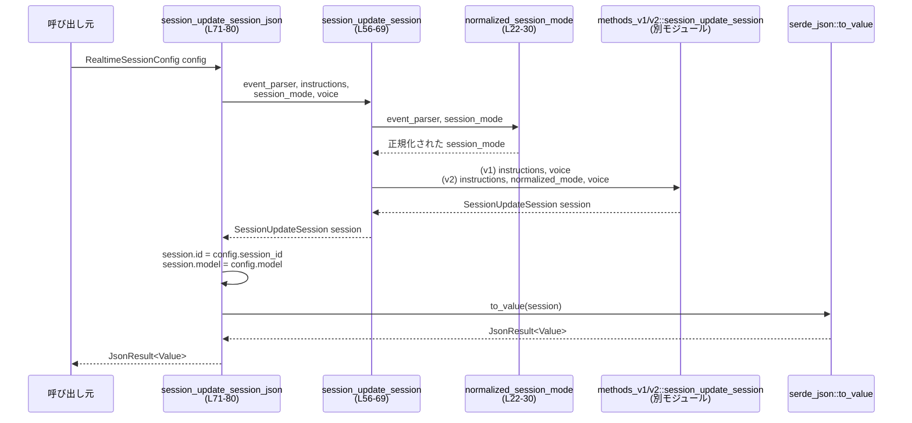

# codex-api/src/endpoint/realtime_websocket/methods_common.rs

## 0. ざっくり一言

`methods_v1` / `methods_v2` それぞれに実装されているリアルタイム WebSocket 用メソッドを、「どのプロトコルバージョンか」に応じて呼び分ける **共通フロントエンド** となるモジュールです（`RealtimeEventParser` に基づくディスパッチ）。  
同時に、セッション更新メッセージを JSON にシリアライズする公開 API を 1 つ提供します。

---

## 1. このモジュールの役割

### 1.1 概要

- このモジュールは **リアルタイム WebSocket の v1 / v2 実装を統一的に扱う** ために存在し、  
  **会話メッセージの作成・ハンドオフの追記・セッション更新・WebSocket Intent 取得** をバージョンに応じて切り替える機能を提供します。
- また、`RealtimeSessionConfig` からセッション更新メッセージを構築し、`serde_json::Value` に変換する公開関数 `session_update_session_json` を提供します（`methods_common.rs:L71-80`）。

### 1.2 アーキテクチャ内での位置づけ

このファイルは `endpoint::realtime_websocket` モジュール内で、プロトコルバージョンごとの実装 (`methods_v1`, `methods_v2`) に対する **薄い共通ラッパ** として機能しています。

```mermaid
graph TD
    Caller["呼び出し元コード<br/>（上位エンドポイント）"] 
    MC["methods_common.rs<br/>(このファイル)"]
    V1["realtime_websocket::methods_v1<br/>(別モジュール)"]
    V2["realtime_websocket::methods_v2<br/>(別モジュール)"]
    Proto["realtime_websocket::protocol<br/>型群"]
    Serde["serde_json"]

    Caller -->|config, text 等| MC
    MC -->|v1_* 呼び出し| V1
    MC -->|v2_* 呼び出し| V2
    MC -->|RealtimeEventParser,<br/>RealtimeSessionConfig など| Proto
    MC -->|to_value()| Serde
```

- ノード `V1` / `V2` / `Proto` は他ファイルで定義されており、このチャンクには実装が現れません。
- `RealtimeEventParser` により **「v1 を使うか / v2 を使うか」** が決まり、`methods_common` 内の各関数が対応する実装にディスパッチします（`methods_common.rs:L22-29`, `L36-39`, `L48-52`, `L63-67`, `L84-87`）。

### 1.3 設計上のポイント

- **バージョン切り替えの一元化**  
  - すべての機能が `RealtimeEventParser` を引数に取り、`match` で `V1` / `RealtimeV2` に分岐します。
- **セッションモードの正規化**  
  - `normalized_session_mode` により、v1 使用時は `RealtimeSessionMode::Conversational` に強制し、v2 の場合は指定値をそのまま使用します（`methods_common.rs:L22-29`）。
- **状態を持たない純粋関数**  
  - 関数は全て引数だけに依存し、グローバルな可変状態を持ちません。
- **エラーハンドリングの方針**  
  - v1/v2 の呼び出し自体は `Result` を返さず（このファイル内では少なくとも）、エラーが起こりうるのは JSON シリアライズ (`serde_json::to_value`) のみです（`methods_common.rs:L71-80`）。
- **スレッド安全性**  
  - 共有可変状態や `unsafe` ブロックがなく、純粋関数と不変定数のみのため、このファイルの範囲ではスレッド安全性の懸念は見当たりません。

---

## 2. 主要な機能一覧（コンポーネントインベントリー）

このチャンクに登場する定数・関数の一覧です。

### 定数

| 名前 | 可視性 | 型 | 役割 / 用途 | 根拠 |
|------|--------|----|-------------|------|
| `REALTIME_AUDIO_SAMPLE_RATE` | `pub(super)` | `u32` | リアルタイム音声用のサンプルレート定数（値は 24_000）。このファイル内では参照されていませんが、上位のモジュールから音声処理で使用される前提と思われます。 | `methods_common.rs:L19` |
| `AGENT_FINAL_MESSAGE_PREFIX` | `const` | `&'static str` | ハンドオフ用最終メッセージに付与する固定プレフィックス `"\"Agent Final Message\":\n\n"`。`conversation_handoff_append_message` 内で使用されます。 | `methods_common.rs:L20`, `L47` |

### 関数

| 名前 | 可視性 | 役割 / 用途 | 根拠 |
|------|--------|-------------|------|
| `normalized_session_mode` | `pub(super)` | `RealtimeEventParser` に応じて、セッションモードを v1 向けに正規化（v1 は常に `Conversational`）。 | `methods_common.rs:L22-30` |
| `conversation_item_create_message` | `pub(super)` | バージョンに応じた「会話用アイテム作成」メッセージを構築し、`RealtimeOutboundMessage` を返します。 | `methods_common.rs:L32-40` |
| `conversation_handoff_append_message` | `pub(super)` | 出力テキストにエージェント最終メッセージのプレフィックスを付与し、v1/v2 のハンドオフ追記メソッドにディスパッチします。 | `methods_common.rs:L42-54` |
| `session_update_session` | `pub(super)` | セッションモードの正規化を行った上で、v1/v2 適切な `session_update_session` を呼び出し、`SessionUpdateSession` を返します。 | `methods_common.rs:L56-69` |
| `session_update_session_json` | `pub` | `RealtimeSessionConfig` から `SessionUpdateSession` を構築し、`session_id` / `model` を設定したうえで JSON (`serde_json::Value`) にシリアライズして返す公開 API。 | `methods_common.rs:L71-80` |
| `websocket_intent` | `pub(super)` | v1/v2 に応じた WebSocket intent（`Option<&'static str>`）を取得するラッパ。 | `methods_common.rs:L83-87` |

---

## 3. 公開 API と詳細解説

### 3.1 型一覧（このファイルで利用している主要な型）

このファイル自身は型を定義していませんが、`protocol` モジュール由来の型を利用しています。

| 名前 | 種別 | 定義元（モジュール） | このファイル内での役割 / 用途 | 根拠 |
|------|------|----------------------|--------------------------------|------|
| `RealtimeEventParser` | 列挙体 | `endpoint::realtime_websocket::protocol` | プロトコルバージョンの種別 (`V1` / `RealtimeV2`) を表現し、v1/v2 どちらの実装を呼ぶかを決めるフラグとして使用されます。 | `methods_common.rs:L9`, `L22-27`, `L32-38`, `L42-50`, `L56-63`, `L71-76`, `L83-86` |
| `RealtimeOutboundMessage` | 構造体または列挙体 | 同上 | 会話アイテム作成・ハンドオフ追記時の送信メッセージを表す型。具体的なフィールドはこのチャンクには現れません。 | `methods_common.rs:L10`, `L32-40`, `L42-54` |
| `RealtimeSessionConfig` | 構造体 | 同上 | セッション更新に必要な設定値（`event_parser`, `instructions`, `session_mode`, `voice`, `session_id`, `model`）をまとめた構造体として利用されています。 | `methods_common.rs:L11`, `L71-79` |
| `RealtimeSessionMode` | 列挙体 | 同上 | セッションのモード種別を表現し、v1 の場合は `Conversational` に固定されています。その他のバリアントはこのチャンクからは不明です。 | `methods_common.rs:L12`, `L22-29`, `L56-63`, `L71-76` |
| `RealtimeVoice` | 構造体または列挙体 | 同上 | セッションで利用する音声設定を表す型。内容はこのチャンクには現れませんが、セッション更新時にそのまま v1/v2 関数に渡されています。 | `methods_common.rs:L13`, `L56-61`, `L64-67`, `L71-77` |
| `SessionUpdateSession` | 構造体 | 同上 | セッション更新メッセージそのものを表現する型。`session_update_session` が返し、`session_update_session_json` 内で `id` / `model` フィールドが書き換えられます。 | `methods_common.rs:L14`, `L56-69`, `L71-79` |
| `JsonResult` | 型エイリアス | `serde_json::Result` | JSON シリアライズ処理の結果型。成功時 `serde_json::Value`、失敗時エラーを返します。 | `methods_common.rs:L15`, `L71` |
| `Value` | 構造体 | `serde_json::Value` | JSON 値を表す型。`session_update_session_json` の戻り値として利用されます。 | `methods_common.rs:L16`, `L71` |

> `RealtimeSessionConfig` の各フィールドの型や詳細な仕様は、このチャンク内のアクセス（`config.event_parser` 等）から存在が分かるのみで、定義は確認できません。

---

### 3.2 関数詳細

#### `normalized_session_mode(event_parser: RealtimeEventParser, session_mode: RealtimeSessionMode) -> RealtimeSessionMode`（`methods_common.rs:L22-30`）

**概要**

- プロトコルバージョンに応じて、セッションモードを正規化する関数です。
- v1 (`RealtimeEventParser::V1`) の場合は常に `RealtimeSessionMode::Conversational` を返し、v2 (`RealtimeEventParser::RealtimeV2`) の場合は引数の `session_mode` をそのまま返します。

**引数**

| 引数名 | 型 | 説明 |
|--------|----|------|
| `event_parser` | `RealtimeEventParser` | 使用するプロトコルバージョン。`V1` または `RealtimeV2`。 |
| `session_mode` | `RealtimeSessionMode` | 呼び出し元が指定したセッションモード。v1 の場合は無視されます。 |

**戻り値**

- `RealtimeSessionMode`  
  - v1 の場合: `RealtimeSessionMode::Conversational` に固定。  
  - v2 の場合: 引数 `session_mode` をそのまま返却。

**内部処理の流れ**

1. `match event_parser` で `V1` / `RealtimeV2` に分岐します（`methods_common.rs:L26`）。
2. `V1` の場合は `RealtimeSessionMode::Conversational` を返します（`methods_common.rs:L27`）。
3. `RealtimeV2` の場合は、引数 `session_mode` をそのまま返します（`methods_common.rs:L28`）。

**Examples（使用例）**

```rust
// event_parser とユーザー指定の session_mode があるとする
let mode = normalized_session_mode(
    RealtimeEventParser::V1,        // v1 を指定
    RealtimeSessionMode::Conversational, // ここで何を渡しても v1 では Conversational に正規化される
);
// mode は常に RealtimeSessionMode::Conversational になる
```

> `RealtimeSessionMode` のバリアント定義はこのチャンクにはありませんが、少なくとも `Conversational` バリアントが存在することがコードから分かります（`methods_common.rs:L27`）。

**Errors / Panics**

- この関数自身は `Result` を返さず、内部でパニックを起こしうる処理も含まれていません。
- `match` で `RealtimeEventParser` の全バリアントが網羅されているため、到達不能分岐はありません（このチャンクに存在する 2 つのバリアントに対して完全）。

**Edge cases（エッジケース）**

- `session_mode` にどのような値を渡しても、v1 の場合は必ず `Conversational` に上書きされます。
- v2 の場合は、渡された `session_mode` がそのまま返されるため、「既定値へフォールバック」などの処理は行われません。

**使用上の注意点**

- v1 プロトコルで他のモードを利用したくなっても、この関数を通すと `Conversational` に固定されます。  
  v1 で別モードを表現したい場合、この制約を考慮する必要があります。
- セッションモードの正規化が必要な場合は、`session_update_session` のようにこの関数を利用する構造になっています（`methods_common.rs:L62`）。

---

#### `conversation_item_create_message(event_parser: RealtimeEventParser, text: String) -> RealtimeOutboundMessage`（`methods_common.rs:L32-40`）

**概要**

- プロトコルバージョンに応じて、会話アイテムの作成メッセージを生成する関数です。
- v1 用の `v1_conversation_item_create_message` または v2 用の `v2_conversation_item_create_message` を呼び出し、その結果の `RealtimeOutboundMessage` を返します。

**引数**

| 引数名 | 型 | 説明 |
|--------|----|------|
| `event_parser` | `RealtimeEventParser` | 使用するプロトコルバージョン。 |
| `text` | `String` | 作成したい会話アイテムの本文テキスト。所有権がこの関数にムーブされます。 |

**戻り値**

- `RealtimeOutboundMessage`  
  バージョン固有の `conversation_item_create_message` が構築した送信メッセージ。

**内部処理の流れ**

1. `match event_parser` で v1 / v2 を判定します（`methods_common.rs:L36-38`）。
2. v1 の場合: `v1_conversation_item_create_message(text)` を呼び出します（`methods_common.rs:L37`）。
3. v2 の場合: `v2_conversation_item_create_message(text)` を呼び出します（`methods_common.rs:L38`）。

**Examples（使用例）**

```rust
let message = conversation_item_create_message(
    RealtimeEventParser::RealtimeV2, // v2 を指定
    "Hello, world".to_string(),      // 会話テキスト（所有権は関数にムーブされる）
);
// message は v2 形式の RealtimeOutboundMessage になる
```

**Errors / Panics**

- この関数自身は `Result` を返していません。
- v1/v2 の下位関数がどのようなエラー処理を行うかは、このチャンクには現れません。

**Edge cases（エッジケース）**

- `text` が空文字列であっても、そのまま v1/v2 の関数に渡されます。空入力に対する挙動は下位実装に依存します。
- 非 ASCII 文字を含むなどのケースも同様に、そのまま下位実装へ渡されます。

**使用上の注意点**

- `text: String` をムーブで受け取るため、呼び出し後に元の `String` 変数は利用できません（Rust の所有権ルール）。
- エラーハンドリングをしたい場合は、`RealtimeOutboundMessage` を送信するレイヤーで対処する必要があります。

---

#### `conversation_handoff_append_message(event_parser: RealtimeEventParser, handoff_id: String, output_text: String) -> RealtimeOutboundMessage`（`methods_common.rs:L42-54`）

**概要**

- 「エージェント最終メッセージ」という固定プレフィックスを `output_text` の先頭に付与し、そのテキストをハンドオフメッセージとして v1/v2 の実装に渡します。
- バージョンに応じたハンドオフ追記メッセージ `RealtimeOutboundMessage` を返します。

**引数**

| 引数名 | 型 | 説明 |
|--------|----|------|
| `event_parser` | `RealtimeEventParser` | 使用するプロトコルバージョン。 |
| `handoff_id` | `String` | ハンドオフ対象を識別する ID。所有権は関数へムーブされます。 |
| `output_text` | `String` | エージェントの最終メッセージ本文。所有権は関数へムーブされます。 |

**戻り値**

- `RealtimeOutboundMessage`  
  バージョン固有のハンドオフ追記メッセージ。

**内部処理の流れ**

1. `AGENT_FINAL_MESSAGE_PREFIX` を `output_text` の前に連結し、新しい `output_text` を生成します（`methods_common.rs:L47`）。
   - プレフィックスは `"\"Agent Final Message\":\n\n"` です（`methods_common.rs:L20`）。
2. `match event_parser` で v1 / v2 を判定します（`methods_common.rs:L48-52`）。
3. v1 の場合: `v1_conversation_handoff_append_message(handoff_id, output_text)` を呼び出します（`methods_common.rs:L49`）。
4. v2 の場合: `v2_conversation_handoff_append_message(handoff_id, output_text)` を呼び出します（`methods_common.rs:L50-51`）。

**Examples（使用例）**

```rust
let msg = conversation_handoff_append_message(
    RealtimeEventParser::RealtimeV2,
    "handoff-123".to_string(),  // ハンドオフ ID
    "This is the final answer.".to_string(), // 最終メッセージ本文
);
// 実際に送信されるテキストは "\"Agent Final Message\":\n\nThis is the final answer." から始まる
```

**Errors / Panics**

- この関数自身は `Result` を返さず、`format!` も通常はパニックを起こしません（フォーマット文字列が固定であり、`output_text` は `Display` を実装済の `String` のため）。

**Edge cases（エッジケース）**

- `output_text` が空でも、プレフィックスのみが付与されたメッセージになります。
- `handoff_id` が空文字列のときの扱いは下位の v1/v2 実装に依存します。

**使用上の注意点**

- ここでプレフィックスを付与しているため、v1/v2 の実装側で同種のプレフィックスを追加すると二重になる可能性があります。  
  メッセージのプレフィックス付与は、この関数に一元化されている前提で設計されていると解釈できます（根拠: プレフィックス定数がこの関数でのみ使用されていること、`methods_common.rs:L20`, `L47`）。

---

#### `session_update_session(event_parser: RealtimeEventParser, instructions: String, session_mode: RealtimeSessionMode, voice: RealtimeVoice) -> SessionUpdateSession`（`methods_common.rs:L56-69`）

**概要**

- セッション更新メッセージ `SessionUpdateSession` を生成する内部用関数です。
- まず `normalized_session_mode` でセッションモードを正規化し、v1/v2 の適切な `session_update_session` 実装を呼び出して結果を返します。

**引数**

| 引数名 | 型 | 説明 |
|--------|----|------|
| `event_parser` | `RealtimeEventParser` | 使用するプロトコルバージョン。 |
| `instructions` | `String` | セッションの振る舞いを決めるインストラクションテキスト。所有権は関数へムーブされます。 |
| `session_mode` | `RealtimeSessionMode` | 希望するセッションモード。v1 の場合は正規化で `Conversational` に上書きされる可能性があります。 |
| `voice` | `RealtimeVoice` | 利用する音声設定。所有権は関数へムーブされます。 |

**戻り値**

- `SessionUpdateSession`  
  v1/v2 の `session_update_session` 実装によって生成されたセッション更新メッセージ。

**内部処理の流れ**

1. `normalized_session_mode(event_parser, session_mode)` を呼び出し、`session_mode` を正規化します（`methods_common.rs:L62`）。
2. `match event_parser` で v1 / v2 を判定します（`methods_common.rs:L63-67`）。
3. v1 の場合: `v1_session_update_session(instructions, voice)` を呼び出します（`methods_common.rs:L64`）。  
   - v1 の関数は `session_mode` 引数を受け取らないため、セッションモードの指定は無視されます。
4. v2 の場合: `v2_session_update_session(instructions, session_mode, voice)` を呼び出します（`methods_common.rs:L65-67`）。

**Examples（使用例）**

```rust
let session = session_update_session(
    RealtimeEventParser::RealtimeV2,
    "You are a helpful assistant.".to_string(),  // インストラクション
    RealtimeSessionMode::Conversational,        // モード
    voice,                                      // RealtimeVoice のインスタンス（定義は別モジュール）
);
// session は v2 向けの SessionUpdateSession になる
```

**Errors / Panics**

- この関数自身は `Result` を返していません。
- v1/v2 の `session_update_session` がどういう条件でエラーを返すか（もしくはパニックするか）は、このチャンクからは分かりません。

**Edge cases（エッジケース）**

- v1 を使用する場合、どのような `session_mode` を渡してもモードは内部的に `Conversational` に固定され、下位関数にも渡されません。
- `instructions` が空文字の場合の挙動は下位実装に依存します。

**使用上の注意点**

- v1 ではセッションモードが固定であるため、「モードを切り替える UI」などから渡された `session_mode` が期待通りに反映されない可能性があります。  
  呼び出し側は、v1/v2 の仕様差を考慮する必要があります。
- 所有権をムーブしている引数（`instructions`, `voice`）は、呼び出し後に手元では使えなくなります。

---

#### `session_update_session_json(config: RealtimeSessionConfig) -> JsonResult<Value>`（`methods_common.rs:L71-80`）

**概要**

- このファイルで唯一の **公開 API (`pub`)** です。
- `RealtimeSessionConfig` から `SessionUpdateSession` を構築し、`session_id` / `model` を設定したうえで `serde_json::Value` にシリアライズして返します。

**引数**

| 引数名 | 型 | 説明 |
|--------|----|------|
| `config` | `RealtimeSessionConfig` | セッション更新に必要な設定をまとめた構造体。所有権は関数へムーブされます。少なくとも `event_parser`, `instructions`, `session_mode`, `voice`, `session_id`, `model` フィールドを持ちます（`methods_common.rs:L73-79`）。 |

**戻り値**

- `JsonResult<Value>` (`serde_json::Result<serde_json::Value>` のエイリアス)  
  - `Ok(Value)`: 構築した `SessionUpdateSession` を JSON に変換した値。  
  - `Err(e)`: シリアライズに失敗した場合のエラー。

**内部処理の流れ**

1. `session_update_session` を呼び出し、`SessionUpdateSession` インスタンスを生成します（`methods_common.rs:L72-77`）。
   - `event_parser`, `instructions`, `session_mode`, `voice` を `config` から取り出して渡します（`methods_common.rs:L73-76`）。
2. 返ってきた `session` を `mut` で受け取り、`session.id` に `config.session_id` を代入します（`methods_common.rs:L78`）。
3. 同様に、`session.model` に `config.model` を代入します（`methods_common.rs:L79`）。
4. 最終的な `session` を `serde_json::to_value(session)` で JSON に変換し、その `Result<Value>` を返します（`methods_common.rs:L80`）。

**Examples（使用例）**

この関数を利用してセッション更新 JSON を取得する最小限の例です。  
`RealtimeSessionConfig` の詳細な構築方法は、このチャンクには定義がないため擬似コードとして示します。

```rust
use crate::endpoint::realtime_websocket::protocol::{
    RealtimeEventParser, RealtimeSessionConfig, RealtimeSessionMode, RealtimeVoice,
};
use crate::endpoint::realtime_websocket::methods_common::session_update_session_json;

fn build_session_json(
    config: RealtimeSessionConfig,  // ここでは既に適切に構築されているとする
) -> serde_json::Result<serde_json::Value> {
    // RealtimeSessionConfig の構築方法はこのチャンクには定義がないため省略
    // let config: RealtimeSessionConfig = /* ... */;

    let json = session_update_session_json(config)?;  // JSON にシリアライズされたセッション更新メッセージ
    Ok(json)
}
```

**Errors / Panics**

- `serde_json::to_value(session)` が失敗した場合、`Err` を返します。
  - 具体的な失敗条件は `serde_json` の仕様に依存しますが、通常は対象型が `Serialize` を実装していないなどのケースです。
- 関数内でパニックを起こしうる処理（インデックスアクセスなど）は見当たりません。

**Edge cases（エッジケース）**

- `config.session_id` / `config.model` が `None` などの値を取りうるかどうかは、このチャンクからは分かりません。  
  ただし、どのような値であってもそのまま `session.id` / `session.model` に代入されます（`methods_common.rs:L78-79`）。
- `config.instructions` が空文字列の場合も、そのまま `session_update_session` に渡されます。  
  インストラクションが空の場合の挙動は下位実装に依存します。

**使用上の注意点**

- この関数は `config` の所有権をムーブするため、呼び出し後に `config` を再利用したい場合は、事前にクローンする必要があります。
- v1/v2 の分岐は `config.event_parser` によって決まるため、誤ったバージョンを指定すると意図しない形式の JSON が生成される可能性があります（エラーにはならない）。
- JSON 変換はシリアライゼーションを伴うため、高頻度に呼び出す場合はパフォーマンスへの影響を考慮する必要があります（CPU とメモリ割り当て）。

---

#### `websocket_intent(event_parser: RealtimeEventParser) -> Option<&'static str>`（`methods_common.rs:L83-87`）

**概要**

- WebSocket 接続時の intent を表す文字列（または `None`）を、v1/v2 の実装から取得するためのラッパ関数です。

**引数**

| 引数名 | 型 | 説明 |
|--------|----|------|
| `event_parser` | `RealtimeEventParser` | 使用するプロトコルバージョン。 |

**戻り値**

- `Option<&'static str>`  
  v1/v2 の `websocket_intent` が返す intent 文字列。  
  意味や具体的な文字列はこのチャンクには現れません。

**内部処理の流れ**

1. `match event_parser` で v1 / v2 を判定します（`methods_common.rs:L84-86`）。
2. v1 の場合: `v1_websocket_intent()` を呼び出します（`methods_common.rs:L85`）。
3. v2 の場合: `v2_websocket_intent()` を呼び出します（`methods_common.rs:L86`）。

**Examples（使用例）**

```rust
if let Some(intent) = websocket_intent(RealtimeEventParser::RealtimeV2) {
    // intent を WebSocket 接続のクエリパラメータなどに利用する
}
```

**Errors / Panics**

- `Option` を返すだけで、エラー型は利用していません。
- 下位の v1/v2 関数がパニックを起こしうるかどうかは、このチャンクからは分かりません。

**Edge cases（エッジケース）**

- v1/v2 のどちらか、あるいは両方が `None` を返す可能性がありますが、その条件はこのチャンクには現れません。

**使用上の注意点**

- `&'static str` を返すため、ライフタイム管理は不要です（コンパイル時に固定された文字列）。
- intent を変更したい場合、変更箇所は `methods_v1` / `methods_v2` 側であり、この関数はラッパに留まります。

---

### 3.3 その他の関数

- このファイルには、上記 6 つ以外の関数は定義されていません。

---

## 4. データフロー

ここでは、代表的な処理として **セッション更新 JSON の生成フロー** を説明します。

### 4.1 セッション更新 JSON 生成のデータフロー

`session_update_session_json` を呼び出したときのデータの流れです。



**要点**

- `RealtimeSessionConfig` から、バージョンに応じた `SessionUpdateSession` を構築し、さらに `session_id` / `model` を上書きした上で JSON に変換しています（`methods_common.rs:L71-80`）。
- セッションモードの v1/v2 差異は `normalized_session_mode` と `session_update_session` の組み合わせで吸収されています（`methods_common.rs:L56-69`）。
- JSON シリアライズは `serde_json::to_value` の単一呼び出しで行われます（`methods_common.rs:L80`）。

---

## 5. 使い方（How to Use）

### 5.1 基本的な使用方法

このファイルの外から利用できる主な関数は `session_update_session_json` です。

```rust
use crate::endpoint::realtime_websocket::protocol::{
    RealtimeEventParser, RealtimeSessionConfig, RealtimeSessionMode, RealtimeVoice,
};
use crate::endpoint::realtime_websocket::methods_common::session_update_session_json;

fn build_session_update() -> serde_json::Result<serde_json::Value> {
    // RealtimeSessionConfig の具体的なフィールド構成・初期化方法は
    // このチャンクには定義がないため、疑似コード的に記述します。
    let config: RealtimeSessionConfig = {
        // 実際には protocol モジュール側の定義に従って構築する
        // event_parser, instructions, session_mode, voice, session_id, model 等を設定する
        unimplemented!() // 擬似コード
    };

    let json = session_update_session_json(config)?; // セッション更新 JSON を取得
    Ok(json)
}
```

- `config` の構築は `protocol` モジュールの定義に依存するため、このチャンクからは正確には書けません。
- JSON を送信する層では、この戻り値の `Value` を文字列化したり WebSocket メッセージに埋め込んだりすることになります。

### 5.2 よくある使用パターン

1. **プロトコルバージョンごとのセッション更新**

   ```rust
   fn build_v1_session_update(config: RealtimeSessionConfig) -> serde_json::Result<serde_json::Value> {
       // config.event_parser は V1 に設定されている前提
       session_update_session_json(config)
   }

   fn build_v2_session_update(config: RealtimeSessionConfig) -> serde_json::Result<serde_json::Value> {
       // config.event_parser は RealtimeV2 に設定されている前提
       session_update_session_json(config)
   }
   ```

   - v1/v2 の違いは `config.event_parser` の値に集約されています（`methods_common.rs:L73`）。

2. **バージョンを意識せず会話メッセージを作成**

   ```rust
   use crate::endpoint::realtime_websocket::methods_common::conversation_item_create_message;

   fn make_outbound(
       parser: RealtimeEventParser,
       text: String,
   ) -> RealtimeOutboundMessage {
       conversation_item_create_message(parser, text)
   }
   ```

   - 呼び出し側は `RealtimeEventParser` を選ぶだけで、v1/v2 の違いを意識せずにメッセージを生成できます。

### 5.3 よくある間違い

このファイルのコードと Rust の所有権モデルから、起こりやすい誤用を挙げます。

```rust
// 誤り例: String の所有権ムーブを意識していない
let text = "hello".to_string();
let msg1 = conversation_item_create_message(parser, text);
// ここで text を使おうとするとコンパイルエラーになる
// println!("{}", text); // 所有権が move されているため

// 正しい例: 使い回したい場合は clone する
let text = "hello".to_string();
let msg1 = conversation_item_create_message(parser, text.clone());
println!("{}", text); // text はまだ使える
```

- `conversation_item_create_message` や `conversation_handoff_append_message`、`session_update_session` は `String` や `RealtimeVoice` をムーブで受け取るため、呼び出し後に元の変数は使用できません。

### 5.4 使用上の注意点（まとめ）

- **バージョン差異の把握**
  - v1 のセッションモードが `Conversational` に固定される点（`methods_common.rs:L22-29`, `L62-65`）は、UI や設定の設計時に考慮が必要です。
- **エラーハンドリング**
  - 実際に `Result` を返すのは `session_update_session_json` だけであり、エラーは JSON シリアライズ時に発生します（`methods_common.rs:L80`）。
- **並行性**
  - このモジュールは状態を持たない純粋関数のみで構成されているため、マルチスレッド環境であっても関数自体の再入性やデータ競合の心配はありません。
- **パフォーマンス**
  - `session_update_session_json` はシリアライズ処理を伴うため、頻繁な呼び出しは CPU 負荷・メモリ割り当てが増加します。  
    一方で、その他の関数は単純な `match` と文字列連結程度でコストは小さい構造になっています。

---

## 6. 変更の仕方（How to Modify）

### 6.1 新しい機能を追加する場合

**例: 新しいリアルタイムプロトコルバージョンを追加したい場合**

コードから読み取れる `RealtimeEventParser` の構造（`V1` / `RealtimeV2`）を前提に、別バージョン追加時に必要になる変更点を整理します。

1. `RealtimeEventParser` に新しいバリアントを追加する（定義は `protocol` モジュールで行われているため、このチャンクには現れません）。
2. `methods_v1` / `methods_v2` に倣って、新しいバージョン用の `methods_vX` モジュールと関数群を追加する。
3. 本ファイル側で追加が必要な箇所:
   - `normalized_session_mode` の `match event_parser` に新バリアントを追加（`methods_common.rs:L26-29`）。
   - `conversation_item_create_message` の `match` にも同様に分岐を追加（`methods_common.rs:L36-39`）。
   - `conversation_handoff_append_message` の `match` に分岐を追加（`methods_common.rs:L48-52`）。
   - `session_update_session` の `match` に分岐を追加（`methods_common.rs:L63-67`）。
   - `session_update_session_json` は `event_parser` をそのまま渡しているだけなので、通常は修正不要です（`methods_common.rs:L72-76`）。
   - `websocket_intent` の `match` にも分岐追加（`methods_common.rs:L84-86`）。

### 6.2 既存の機能を変更する場合

- **セッションモード仕様を変えたい場合**
  - `normalized_session_mode` の挙動を変更することで、v1 のモード固定などのロジックを一箇所で修正できます（`methods_common.rs:L22-30`）。
  - 変更時は `session_update_session` の挙動に直接影響するため、v1/v2 それぞれの `session_update_session` 実装が想定するモードとの整合性を確認する必要があります。

- **ハンドオフメッセージのフォーマットを変えたい場合**
  - プレフィックス文字列を `AGENT_FINAL_MESSAGE_PREFIX` の値変更で一括管理できます（`methods_common.rs:L20`, `L47`）。
  - 変更すると v1/v2 両方のハンドオフメッセージに影響します。

- **テスト観点**
  - `session_update_session_json` については、
    - `config.event_parser` が `V1` / `RealtimeV2` の両方で JSON の構造が妥当か。
    - `config.session_id` / `config.model` の値が JSON に反映されているか。
    を確認するテストを書くと、回 regressions を防ぎやすくなります。
  - `normalized_session_mode` については、`V1` で常に `Conversational` になること、`RealtimeV2` では入力がそのまま返ることをユニットテストで確認できます。

---

## 7. 関連ファイル

このモジュールと密接に関係するモジュール（ファイルパスは推測できないためモジュールパスで記載します）。

| パス / モジュール | 役割 / 関係 |
|-------------------|------------|
| `crate::endpoint::realtime_websocket::methods_v1` | v1 プロトコル向けの `conversation_item_create_message`, `conversation_handoff_append_message`, `session_update_session`, `websocket_intent` を提供するモジュール。`use` 句と関数呼び出しから存在が分かります（`methods_common.rs:L1-4`, `L37`, `L49`, `L64`, `L85`）。 |
| `crate::endpoint::realtime_websocket::methods_v2` | v2 プロトコル向けの同名関数群を提供するモジュール。`methods_common` から v2 用の実装として呼び出されています（`methods_common.rs:L5-8`, `L38`, `L50-51`, `L65`, `L86`）。 |
| `crate::endpoint::realtime_websocket::protocol` | `RealtimeEventParser`, `RealtimeOutboundMessage`, `RealtimeSessionConfig`, `RealtimeSessionMode`, `RealtimeVoice`, `SessionUpdateSession` など、本ファイルで利用している型を定義するモジュール（`methods_common.rs:L9-14`）。 |
| `serde_json` | JSON シリアライザ / デシリアライザライブラリ。`Result` 型のエイリアス `JsonResult`、`Value` 型、`to_value` 関数を通じて利用されています（`methods_common.rs:L15-17`, `L71-80`）。 |

> 上記モジュールの具体的なファイル名（`mod.rs` なのか `methods_v1.rs` なのか等）は、このチャンクには現れないため不明です。
