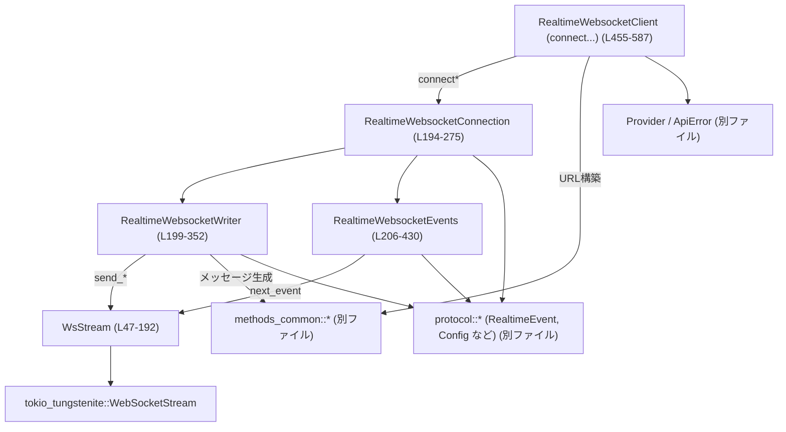
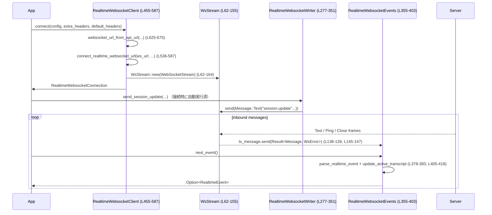

# codex-api/src/endpoint/realtime_websocket/methods.rs コード解説

※行番号は、この回答内で数えたものに基づく近似ですが、1 ファイル内で整合が取れるように付与しています。

---

## 0. ざっくり一言

このモジュールは、**Codex のリアルタイム WebSocket エンドポイント（音声/テキスト）への接続・送受信をカプセル化するクライアント実装**です。  
WebSocket の低レベル I/O を `WsStream` タスクに集約し、その上に `RealtimeWebsocketClient / Connection / Writer / Events` という高レベル API を提供します。

---

## 1. このモジュールの役割

### 1.1 概要

このモジュールは **リアルタイム音声/テキストセッション**を扱うために存在し、次の機能を提供します。

- WebSocket URL の構築と TLS 設定を含む接続確立（通常のリアルタイム / WebRTC サイドバンド両方）  
  （`RealtimeWebsocketClient`、`websocket_url_from_api_url` など, methods.rs:L450-588, L625-675）
- WebSocket 上での送受信を行う非同期タスク `WsStream` と、その安全なコマンドインタフェース  
  （methods.rs:L47-192）
- 高レベルな送信 API（音声フレーム送信、会話メッセージ送信、セッション更新など）  
  （`RealtimeWebsocketWriter`, methods.rs:L199-352）
- 受信メッセージの JSON パースと `RealtimeEvent` への変換、アクティブなトランスクリプトの管理  
  （`RealtimeWebsocketEvents`, `append_transcript_delta`, methods.rs:L206-430, L432-448）
- HTTP ヘッダや URL の補助関数、および豊富な単体 / E2E テスト群（methods.rs:L590-719, L721-以降）

### 1.2 アーキテクチャ内での位置づけ

主なコンポーネントの依存関係は次のようになっています。



- アプリケーションは `RealtimeWebsocketClient::connect` から入り、`RealtimeWebsocketConnection` が返されます（methods.rs:L459-474）。
- `RealtimeWebsocketConnection` は、送信側 `RealtimeWebsocketWriter` と受信側 `RealtimeWebsocketEvents` をまとめたハンドルです（methods.rs:L194-275）。
- 双方向の実際の I/O は、`WsStream` タスクによって処理されます（methods.rs:L62-155）。
- プロトコルの詳細（イベント型、セッション設定生成など）は `protocol` / `methods_common` モジュールに委譲されています（このチャンクには定義なし）。

### 1.3 設計上のポイント

コードから読み取れる特徴を列挙します。

- **読み書きを 1 タスクに集約した非同期設計**  
  - `WsStream` が WebSocket の読み取り・書き込み双方を担当し、外部からは `mpsc::Sender<WsCommand>` 経由で操作します（methods.rs:L62-88, L101-151）。
  - これにより、`split()` した `Sink`/`Stream` を複数タスクで共有するパターンよりも、**所有権と並行性の管理が明確**になっています。

- **スレッド安全な共有とクローン可能なハンドル**  
  - `Arc<WsStream>` と `Arc<AtomicBool>` を使い、`RealtimeWebsocketWriter` / `RealtimeWebsocketEvents` をクローン可能にしています（methods.rs:L254-273）。
  - 受信ストリームは `Arc<Mutex<UnboundedReceiver<...>>>` で保護され、同一接続から複数のコンシューマが読み出さないようにしています（methods.rs:L206-211, L355-375）。

- **明示的なクローズ状態管理**  
  - `is_closed: AtomicBool` を共有し、送信側・受信側で共通のクローズ状態を参照します（methods.rs:L200-203, L207-212）。
  - `close` は idempotent（複数回呼んでも 1 回目以外は何もしない）に実装されています（methods.rs:L318-329）。

- **エラーの正規化**  
  - WebSocket エラー `WsError` は、すべて `ApiError::Stream(String)` に変換されます（methods.rs:L322-327, L346-350, L366-368, L545-569 など）。
  - URL やヘッダ生成時のバリデーションエラーも、同じ `ApiError::Stream` 経由で報告されます（methods.rs:L632-647, L613-616）。

- **プロトコルレベルの抽象化**  
  - 送信メッセージは `RealtimeOutboundMessage` によって表現され、JSON にシリアライズしてから送信します（methods.rs:L332-337）。
  - 受信メッセージは `parse_realtime_event`（別ファイル）を通じて `RealtimeEvent` に変換されます（methods.rs:L379-383）。

- **アクティブなトランスクリプトの状態管理**  
  - 入出力の transcript delta を内部の `ActiveTranscriptState` に蓄積し、特定のイベント（`HandoffRequested`）でまとめて引き渡します（methods.rs:L405-418, L432-448）。
  - Realtime V1 parser の場合のみ `active_transcript` をハンドオフに埋め込む条件分岐があります（methods.rs:L415-417）。

---

## 2. 主要な機能一覧

このモジュールが提供する主要機能を列挙します。

- WebSocket 接続確立:
  - `RealtimeWebsocketClient::connect` — 通常のリアルタイム WebSocket セッションを開く（methods.rs:L459-474）。
  - `RealtimeWebsocketClient::connect_webrtc_sideband` — 既存の WebRTC セッション用サイドバンド WebSocket にリトライ付きで接続する（methods.rs:L476-514）。

- 送信 API（Writer）:
  - 音声フレーム送信: `RealtimeWebsocketWriter::send_audio_frame`（methods.rs:L277-281）。
  - テキストメッセージ送信: `send_conversation_item_create`（methods.rs:L283-286）。
  - ハンドオフ出力送信: `send_conversation_handoff_append`（methods.rs:L288-299）。
  - レスポンス生成トリガ: `send_response_create`（methods.rs:L301-304）。
  - セッション設定更新: `send_session_update`（methods.rs:L306-316）。
  - 低レベル: 任意 JSON ペイロード送信: `send_payload`（methods.rs:L339-351）。

- 受信 API（Events）:
  - 次の `RealtimeEvent` を待つ: `RealtimeWebsocketEvents::next_event`（methods.rs:L355-403）。
  - トランスクリプト状態の更新: `update_active_transcript`（methods.rs:L405-429）。

- 接続ハンドル（Connection）:
  - 上記 Writer / Events の薄いラッパーとして、同名メソッドを提供（methods.rs:L219-244）。

- URL・ヘッダユーティリティ:
  - `websocket_url_from_api_url` / `_for_call` — API ベース URL から WebSocket URL を構築（methods.rs:L625-675, L677-693）。
  - `normalize_realtime_path` — `/v1/realtime` パスを付与・正規化（methods.rs:L695-719）。
  - `merge_request_headers` — プロバイダ / 追加 / デフォルトヘッダの優先順位付きマージ（methods.rs:L590-603）。
  - `with_session_id_header` — `x-session-id` ヘッダの付与（methods.rs:L605-619）。

---

## 3. 公開 API と詳細解説

### 3.1 型一覧（構造体・列挙体など）

#### 型インベントリー

| 名前 | 種別 | 公開 | 役割 / 用途 | 行 |
|------|------|------|-------------|----|
| `WsStream` | 構造体 | 非公開 | 実際の `WebSocketStream` を保持し、送受信ループ（ポンプタスク）と制御用 mpsc チャネルを管理する | methods.rs:L47-186 |
| `WsCommand` | 列挙体 | 非公開 | `WsStream` に対する操作（Send/Close）を表すコマンド | methods.rs:L52-60 |
| `RealtimeWebsocketConnection` | 構造体 | 公開 | 1 セッション分の接続ハンドル。内部に Writer と Events を持つ | methods.rs:L194-197 |
| `RealtimeWebsocketWriter` | 構造体 | 公開（Clone） | WebSocket への送信専用ハンドル | methods.rs:L199-204 |
| `RealtimeWebsocketEvents` | 構造体 | 公開（Clone） | WebSocket からのイベント受信専用ハンドル | methods.rs:L206-212 |
| `ActiveTranscriptState` | 構造体 | 非公開 | アクティブな会話の transcript エントリ（ユーザー/アシスタント）の蓄積に使用 | methods.rs:L214-217 |
| `RealtimeWebsocketClient` | 構造体 | 公開 | `Provider` を保持し、新しい WebSocket 接続を作成するクライアント | methods.rs:L450-452 |

### 3.2 関数詳細（代表 7 件）

#### 1. `RealtimeWebsocketClient::connect`

```rust
pub async fn connect(
    &self,
    config: RealtimeSessionConfig,
    extra_headers: HeaderMap,
    default_headers: HeaderMap,
) -> Result<RealtimeWebsocketConnection, ApiError>
```

**概要**

- 通常のリアルタイム WebSocket セッションを開き、`RealtimeWebsocketConnection` を返します（methods.rs:L459-474）。
- URL 構築、TLS 設定、初回 `session.update` の送信までを一括で行います。

**引数**

| 引数名 | 型 | 説明 |
|--------|----|------|
| `config` | `RealtimeSessionConfig` | モデル名、セッション ID、イベントパーサ種別、セッションモード、音声ボイスなどの設定（別モジュール定義） |
| `extra_headers` | `HeaderMap` | 呼び出し側が追加したい HTTP/WebSocket ヘッダ |
| `default_headers` | `HeaderMap` | Codex が用意するデフォルトヘッダ群（`originator` 等） |

**戻り値**

- `Ok(RealtimeWebsocketConnection)` — 接続および初回 `session.update` 送信まで成功した場合。
- `Err(ApiError)` — URL 生成エラー、TLS 構成エラー、接続失敗、`session.update` 送信失敗のいずれか。

**内部処理の流れ**

1. `websocket_url_from_api_url` でベース URL とクエリパラメータから WebSocket URL を構築（methods.rs:L465-471）。
2. `connect_realtime_websocket_url` を呼び出し、実際の接続と初期設定を行う（methods.rs:L472-473）。
   - ここで `WsStream::new` や `send_session_update` が利用されます。

**Errors / Panics**

- `websocket_url_from_api_url` 内で URL が不正な場合 `ApiError::Stream` を返します（methods.rs:L632-647）。
- `connect_realtime_websocket_url` 内で TLS 構成や接続自体が失敗すると `ApiError::Stream` を返します（methods.rs:L545-569, L569-569）。
- パニックを起こす処理はこの関数自体にはありません（`unwrap` 等なし）。

**Edge cases**

- `config.model` が `None` の場合、URL に `model=` クエリが追加されない（tests 参照, websocket_url_from_api_url のテスト）。
- `config.session_id` が `None` の場合、`x-session-id` ヘッダは付与されません（methods.rs:L605-611）。

**使用上の注意点**

- この関数は **初回の `session.update` を自動送信**します。そのため、接続直後に `RealtimeWebsocketConnection::next_event` を呼び出すと、まず `SessionUpdated` イベントが届く前提があります（tests.e2e, methods.rs:L721-以降）。
- 接続のリトライロジックは含まれていません。リトライが必要な場合は `connect_webrtc_sideband` のパターンを参考にする必要があります。

---

#### 2. `RealtimeWebsocketClient::connect_webrtc_sideband`

```rust
pub async fn connect_webrtc_sideband(
    &self,
    config: RealtimeSessionConfig,
    call_id: &str,
    extra_headers: HeaderMap,
    default_headers: HeaderMap,
) -> Result<RealtimeWebsocketConnection, ApiError>
```

**概要**

- 既存の WebRTC コール（`call_id` 指定）に対するサイドバンド制御 WebSocket へ接続します（methods.rs:L476-514）。
- `self.provider.retry` 設定に基づき、接続に失敗した場合にリトライします。

**引数**

| 引数名 | 型 | 説明 |
|--------|----|------|
| `config` | `RealtimeSessionConfig` | 通常の connect と同様のセッション設定 |
| `call_id` | `&str` | 既存の WebRTC セッションを識別する ID。URL の `call_id` クエリに使用される（methods.rs:L677-693）。 |
| `extra_headers` | `HeaderMap` | 追加ヘッダ |
| `default_headers` | `HeaderMap` | デフォルトヘッダ |

**戻り値**

- 成功時は通常の `RealtimeWebsocketConnection` と同様のオブジェクト。
- リトライが尽きると `ApiError::Stream("realtime sideband websocket retry loop exhausted")` を返す（methods.rs:L511-513）。

**内部処理の流れ**

1. `for attempt in 0..=self.provider.retry.max_attempts` でリトライループを実行（methods.rs:L486-487）。
2. 各試行で `connect_webrtc_sideband_once` を呼び、結果を `result` に格納（methods.rs:L487-494）。
3. 成功 (`Ok`) なら即座に返す。失敗 (`Err`) で、かつ最後の試行でなければ `backoff` 関数でディレイを計算し `sleep` する（methods.rs:L496-505）。
4. 最後まで失敗した場合は固定メッセージの `ApiError::Stream` を返す（methods.rs:L511-513）。

**Errors / Panics**

- `connect_webrtc_sideband_once` 内のエラー（URL 生成、接続失敗など）をそのまま伝搬します（methods.rs:L516-534）。
- パニックとなる処理は含まれていません。

**Edge cases**

- `max_attempts` が 0 の場合、ループは 1 回だけ試行し、失敗時即座に `Err` を返します（`0..=0` のため）。
- `retry.base_delay` が極端に小さい場合でも `backoff` を使用しているため、ある程度指数バックオフがかかることが期待されます（`backoff` 実装はこのチャンクにはありません）。

**使用上の注意点**

- この関数は **WebRTC 呼び出しがすでに存在する前提**であり、サイドバンドのみの接続を行います（コメント, methods.rs:L483-485）。
- `Provider.retry` の設定に応じて待機時間が変わるため、上位で全体のタイムアウトを設けることが推奨されます。

---

#### 3. `RealtimeWebsocketClient::connect_realtime_websocket_url`

```rust
async fn connect_realtime_websocket_url(
    &self,
    ws_url: Url,
    config: RealtimeSessionConfig,
    extra_headers: HeaderMap,
    default_headers: HeaderMap,
) -> Result<RealtimeWebsocketConnection, ApiError>
```

**概要**

- 具体的な WebSocket URL が決まっている前提で、TLS 設定・接続・`WsStream` 構築・初回セッション更新までを行う内部関数です（methods.rs:L536-587）。

**引数**

| 引数名 | 型 | 説明 |
|--------|----|------|
| `ws_url` | `Url` | 接続先 WebSocket URL |
| `config` | `RealtimeSessionConfig` | セッション設定 |
| `extra_headers` | `HeaderMap` | 追加ヘッダ |
| `default_headers` | `HeaderMap` | デフォルトヘッダ |

**戻り値**

- `Ok(RealtimeWebsocketConnection)` — 正常に接続し、`session.update` が送信された場合。
- `Err(ApiError::Stream(...))` — リクエスト組立、TLS 構成、接続、自動 `session.update` 送信のいずれかが失敗した場合。

**内部処理の流れ**

1. `ensure_rustls_crypto_provider()` を呼び出し、Rustls の暗号プロバイダを初期化（methods.rs:L543-543）。
2. `ws_url.as_str().into_client_request()` で WebSocket クライアントリクエストを生成し、エラーなら `ApiError::Stream` に変換（methods.rs:L545-548）。
3. `merge_request_headers` と `with_session_id_header` でヘッダをまとめ、リクエストにセット（methods.rs:L549-554）。
4. `maybe_build_rustls_client_config_with_custom_ca()` でカスタム CA を考慮した Rustls 設定を取得（methods.rs:L559-561）。
5. `tokio_tungstenite::connect_async_tls_with_config` で非同期に WebSocket 接続を確立（methods.rs:L562-569）。
6. 返された `WebSocketStream` を `WsStream::new` に渡し、送受信用のタスク＋メッセージ受信チャネルを構築（methods.rs:L576-577）。
7. `RealtimeWebsocketConnection::new` で Writer / Events を構築（methods.rs:L577-577）。
8. `connection.writer.send_session_update(...)` を呼び出し、初回のセッション設定を送信（methods.rs:L582-585）。

**Errors / Panics**

- TLS 構成・接続エラーは全て `ApiError::Stream("failed to ...: {err}")` として返却（methods.rs:L545-561, L569-569）。
- `send_session_update` 内の JSON エンコードや送信失敗も `ApiError::Stream` に変換されます（methods.rs:L332-337, L346-350）。
- パニックを伴う処理はありません。

**Edge cases**

- カスタム CA 設定に失敗した場合、接続開始前に即座に `Err` となります（methods.rs:L559-561）。
- サーバが接続は受け付けるがすぐに閉じる場合でも、`WsStream::new` は正常に生成されますが、その後の `next_event` でクローズが検知されます（ポンプタスクの実装, methods.rs:L101-155）。

**使用上の注意点**

- この関数は内部用で、URL は既に正規化されている前提です（`websocket_url_from_api_url` を通すことが想定されます）。
- ここで `session.update` を送信するため、`RealtimeWebsocketConnection` を返された時点で、すでにセッション構成がサーバに伝わっています。

---

#### 4. `WsStream::new`

```rust
fn new(
    inner: WebSocketStream<MaybeTlsStream<TcpStream>>,
) -> (Self, mpsc::UnboundedReceiver<Result<Message, WsError>>)
```

**概要**

- `WebSocketStream` をラップし、**専用タスクで送受信を処理する非同期ポンプ**を起動します（methods.rs:L62-164）。
- 呼び出し側には、制御用の `WsStream` と、受信メッセージを流す `UnboundedReceiver` を返します。

**引数**

| 引数名 | 型 | 説明 |
|--------|----|------|
| `inner` | `WebSocketStream<MaybeTlsStream<TcpStream>>` | 接続済みの WebSocket ストリーム |

**戻り値**

- `(WsStream, mpsc::UnboundedReceiver<Result<Message, WsError>>)`  
  - `WsStream` — `send` / `close` などのコマンドインタフェースを提供。
  - `UnboundedReceiver` — 受信した `Message` または `WsError` を非同期に取得するためのチャネル。

**内部処理の流れ（ポンプタスク）**

1. `mpsc::channel::<WsCommand>(32)` を作成し、送信側 `tx_command` を `WsStream` に保持（methods.rs:L66-67, L158-161）。
2. `mpsc::unbounded_channel::<Result<Message, WsError>>()` を作成し、`tx_message` をポンプタスクが保持（methods.rs:L67-67）。
3. `tokio::spawn` でポンプタスクを起動し、`inner` をローカル変数として所有（methods.rs:L69-71）。
4. `tokio::select!` で以下を同時に待機（methods.rs:L72-152）:
   - `rx_command.recv()`  
     - `WsCommand::Send`: `inner.send` を await。エラーをログに出し、呼び出し元の oneshot に結果を返す。エラーならループ終了（methods.rs:L78-88）。
     - `WsCommand::Close`: `inner.close(None)` を await。結果を oneshot に返し、必ずループ終了（methods.rs:L90-98）。
   - `inner.next()`  
     - `Ping`: 自動で `Pong` を返し、エラー時には `tx_message` に `Err` を送ってループ終了（methods.rs:L106-113）。
     - `Pong`: 何もしない（methods.rs:L114-114）。
     - `Text/Binary/Close/Frame`: ログ出力後、`tx_message` に `Ok(message)` を送信。`Close` だった場合はループ終了（methods.rs:L115-143）。
     - `Err(err)`: ログ出力後、`tx_message` に `Err(err)` を送信しループ終了（methods.rs:L145-149）。
5. ループ終了後、`info!("realtime websocket pump exiting")` を出力してタスク終了（methods.rs:L154-155）。
6. `WsStream` の `Drop` 実装で `pump_task.abort()` を呼び、明示的にタスクを中断できるようにする（methods.rs:L188-192）。

**Errors / Panics**

- エラーは基本的に `tx_message` へ `Err(WsError)` として流れます。
- コマンド側のエラーは oneshot 経由で `WsStream::send` / `close` に返されます（methods.rs:L166-175）。
- ポンプタスク内に `panic!` はなく、すべてログ＋チャネル送信で終了します。

**Edge cases**

- `rx_command` 側がクローズすると、`rx_command.recv()` が `None` を返し、ポンプタスクはループを抜けます（methods.rs:L73-76）。
- `tx_message.send(..)` が失敗する（＝受信側がドロップされている）場合も、ループ終了します（methods.rs:L138-140）。

**使用上の注意点**

- `WsStream` は `Drop` でタスクを `abort` するため、外部が `WsStream` をドロップすると、WebSocket のクローズフレーム送信なしに即座にタスクが終了する可能性があります（methods.rs:L188-192）。
- 送受信は単一タスクでシリアルに処理されるため、**送信中に受信が一時停止**する点に注意が必要です（ただしテストで、送信が `next_event` をブロックしないことが確認されています。後述）。

---

#### 5. `RealtimeWebsocketEvents::next_event`

```rust
pub async fn next_event(&self) -> Result<Option<RealtimeEvent>, ApiError>
```

**概要**

- WebSocket から次のメッセージを読み取り、`RealtimeEvent` に変換して返します（methods.rs:L355-403）。
- クローズ済みの場合は `Ok(None)` を返します。

**引数**

- なし（`self` のみ）

**戻り値**

- `Ok(Some(event))` — イベントが正常に読み取れた場合。
- `Ok(None)` — ストリームが終了している、またはクローズフレームを受信した場合。
- `Err(ApiError::Stream)` — WebSocket 読み取り中にエラーが発生した場合。

**内部処理の流れ**

1. `is_closed` が `true` であれば即座に `Ok(None)` を返す（methods.rs:L355-358）。
2. ループで `rx_message.lock().await.recv().await` により、`WsStream` から流れてくるメッセージを待つ（methods.rs:L360-375）。
   - `Some(Ok(msg))` — 実際の `Message` を処理。
   - `Some(Err(err))` — `is_closed` を `true` にし、ログ出力後 `Err(ApiError::Stream(...))` で終了（methods.rs:L363-368）。
   - `None` — `is_closed` を `true` にし、ログ出力後 `Ok(None)` を返す（methods.rs:L370-373）。
3. `Message` の内容に応じて分岐（methods.rs:L377-401）:
   - `Text(text)` — `parse_realtime_event` で JSON をパース → `Some(event)` なら `update_active_transcript` で状態更新し、`Ok(Some(event))` を返す。サポート外メッセージはログのみ（methods.rs:L378-385）。
   - `Close(frame)` — `is_closed` を `true` にし、ログ出力後 `Ok(None)` を返す（methods.rs:L386-393）。
   - `Binary(_)` — プロトコル上想定外のバイナリイベントとして、`RealtimeEvent::Error` を返す（methods.rs:L395-398）。
   - その他（`Frame`, `Ping`, `Pong`） — 無視してループを続行（methods.rs:L400-400）。

**Errors / Panics**

- 読み取りエラーは `ApiError::Stream("failed to read websocket message: {err}")` として返されます（methods.rs:L363-368）。
- パニックは発生しません。

**Edge cases**

- `is_closed` が既に `true` の場合は、チャネルの状態に関わらず `Ok(None)` を返すため、その後の呼び出しは全て `None` になります（methods.rs:L355-358）。
- バイナリメッセージはクローズを引き起こさず、`RealtimeEvent::Error` を 1 件返した後、ループを継続します（methods.rs:L395-399）。

**使用上の注意点**

- `next_event` は **ストリームの終了を `None` で表現する** ため、呼び出し側は `Ok(None)` を検出してループを抜ける必要があります。
- 送信と同時に呼び出してもブロックしないことがテストで確認されています（`send_does_not_block_while_next_event_waits_for_inbound_data`, tests 内）。

---

#### 6. `RealtimeWebsocketWriter::send_session_update`

```rust
pub async fn send_session_update(
    &self,
    instructions: String,
    session_mode: RealtimeSessionMode,
    voice: RealtimeVoice,
) -> Result<(), ApiError>
```

**概要**

- セッションの種別・音声入出力の形・ツール設定などを含む `session.update` メッセージを送信します（methods.rs:L306-316）。
- 接続直後の初期化や、途中での設定変更に利用されます。

**引数**

| 引数名 | 型 | 説明 |
|--------|----|------|
| `instructions` | `String` | モデルへのシステムプロンプトなどの指示文 |
| `session_mode` | `RealtimeSessionMode` | 会話モード / トランスクリプションモード等（別モジュール） |
| `voice` | `RealtimeVoice` | 使用する TTS ボイス（別モジュール） |

**戻り値**

- `Ok(())` — JSON 生成と送信が成功した場合。
- `Err(ApiError::Stream)` — JSON シリアライズ失敗、または WebSocket 送信失敗。

**内部処理の流れ**

1. `normalized_session_mode(self.event_parser, session_mode)` で、パーサ種別に応じたモード正規化を行う（methods.rs:L312-312）。
   - 例: テストから、V1 では transcription モードでも `quicksilver` として扱うことが分かります（tests: `v1_transcription_mode_is_treated_as_conversational`）。
2. `session_update_session(self.event_parser, instructions, session_mode, voice)` でセッション設定 JSON のペイロードを生成する（methods.rs:L313-313）。
3. 生成した `session` を `RealtimeOutboundMessage::SessionUpdate { session }` にラップし、`send_json` で送信（methods.rs:L314-315）。

**Errors / Panics**

- `send_json` 内での `serde_json::to_string` エラーは `ApiError::Stream("failed to encode realtime request: {err}")` に変換されます（methods.rs:L332-335）。
- WebSocket 送信失敗は `ApiError::Stream("failed to send realtime request: {err}")` に変換されます（methods.rs:L346-350）。

**Edge cases**

- Realtime V2 かつ transcription モードの場合、テストから、`session.update` には instructions や output audio が含まれないように shaping されます（tests: `transcription_mode_session_update_omits_output_audio_and_instructions`）。この詳細ロジックは `session_update_session` 側にあります（このチャンクには定義なし）。
- V1 transcription モードは conversatonal と同様に扱われ、instructions や output voice が含まれます（tests: `v1_transcription_mode_is_treated_as_conversational`）。

**使用上の注意点**

- `send_session_update` は接続時に必ず 1 回呼ばれますが、必要に応じて追加の更新にも使用できます。
- `event_parser` によって生成される JSON 形式が変わるため、サーバ側の API バージョンに合わせて parser を選ぶ必要があります。

---

#### 7. `RealtimeWebsocketWriter::send_audio_frame`

```rust
pub async fn send_audio_frame(&self, frame: RealtimeAudioFrame) -> Result<(), ApiError>
```

**概要**

- 入力音声バッファへの追加入力を表す `input_audio_buffer.append` メッセージを送信します（methods.rs:L277-281）。
- 実データには `frame.data`（おそらく base64 などのエンコード表現）が使われます。

**引数**

| 引数名 | 型 | 説明 |
|--------|----|------|
| `frame` | `RealtimeAudioFrame` | 音声データ（data, sample_rate, num_channels などを持つ構造体, 別モジュール） |

**戻り値**

- `Ok(())` — JSON エンコードと送信が成功した場合。
- `Err(ApiError::Stream)` — JSON エンコード失敗、または WebSocket 送信失敗。

**内部処理の流れ**

1. `RealtimeOutboundMessage::InputAudioBufferAppend { audio: frame.data }` を生成（methods.rs:L279-279）。
2. `send_json` で JSON にシリアライズし、`send_payload` で `Message::Text` として送信（methods.rs:L332-351）。

**Errors / Panics**

- `send_json` / `send_payload` 内のエラーは、前述のとおり `ApiError::Stream` で返されます。
- `is_closed` が `true` の場合、送信前に `"realtime websocket connection is closed"` エラーを返します（methods.rs:L339-343）。

**Edge cases**

- 送信時点でサーバが既に接続を閉じている場合、`WsStream::send` が `WsError` を返し、`ApiError::Stream("failed to send realtime request: {err}")` になります（methods.rs:L346-350）。
- `frame` のサンプリングレートやチャンネル数はこの関数内ではチェックされません（テストでは 24kHz と 48kHz の例あり, tests:e2e）。

**使用上の注意点**

- `send_audio_frame` は**非ブロッキングに近い挙動**を持ち、`next_event` が受信待ちをしていてもブロックしないことが E2E テストで検証されています（tests: `send_does_not_block_while_next_event_waits_for_inbound_data`）。
- 高頻度で呼び出される可能性があるため、必要ならば呼び出し側でスロットリングやバッファリングを行うことが望ましいです。

---

### 3.3 その他の関数（インベントリー）

#### `RealtimeWebsocketConnection` メソッド（methods.rs:L219-275）

| 関数名 | 公開 | 役割 / 一言説明 | 行 |
|--------|------|-----------------|----|
| `send_audio_frame` | 公開 | Writer 経由で音声フレームを送信するラッパー | L219-222 |
| `send_conversation_item_create` | 公開 | テキストメッセージ送信のラッパー | L224-226 |
| `send_conversation_handoff_append` | 公開 | ハンドオフ用出力テキスト送信のラッパー | L228-236 |
| `close` | 公開 | Writer の `close` を呼んで接続を閉じる | L238-240 |
| `next_event` | 公開 | Events の `next_event` を呼んで次のイベントを取得 | L242-244 |
| `writer` | 公開 | 内部の `RealtimeWebsocketWriter` のクローンを返す | L246-248 |
| `events` | 公開 | 内部の `RealtimeWebsocketEvents` のクローンを返す | L250-252 |
| `new` | 非公開 | Stream, Rx, Parser から Connection を組み立てる内部コンストラクタ | L254-274 |

#### `RealtimeWebsocketWriter` メソッド（methods.rs:L277-352）

（`send_audio_frame`, `send_session_update` は詳細解説済み）

| 関数名 | 公開 | 役割 / 一言説明 | 行 |
|--------|------|-----------------|----|
| `send_conversation_item_create` | 公開 | `conversation_item_create_message`（別モジュール）を使い、テキストメッセージを送信 | L283-286 |
| `send_conversation_handoff_append` | 公開 | `conversation_handoff_append_message`（別モジュール）を使い、ハンドオフ出力を送信 | L288-299 |
| `send_response_create` | 公開 | レスポンス生成トリガ `ResponseCreate` を送信 | L301-304 |
| `close` | 公開 | WebSocket をクローズし、`is_closed` を設定 | L318-329 |
| `send_json` | 非公開 | `RealtimeOutboundMessage` を JSON にシリアライズし、`send_payload` に渡す | L332-337 |
| `send_payload` | 公開 | 任意の文字列ペイロードを `Message::Text` として送信 | L339-351 |

#### `RealtimeWebsocketEvents` メソッド（methods.rs:L355-429）

| 関数名 | 公開 | 役割 / 一言説明 | 行 |
|--------|------|-----------------|----|
| `next_event` | 公開 | WebSocket からの次イベントをパースして返す（詳細解説済み） | L355-403 |
| `update_active_transcript` | 非公開 | Transcript 系イベントを `ActiveTranscriptState` に反映し、必要に応じてハンドオフに埋め込む | L405-429 |

#### その他の自由関数（methods.rs:L432-719）

| 関数名 | 公開 | 役割 / 一言説明 | 行 |
|--------|------|-----------------|----|
| `append_transcript_delta` | 非公開 | 役割（user/assistant）ごとに transcript delta を最後のエントリにマージ or 新規追加 | L432-448 |
| `merge_request_headers` | 非公開 | provider → extra → default の優先度でヘッダをマージ | L590-603 |
| `with_session_id_header` | 非公開 | `x-session-id` ヘッダを `HeaderMap` に追加 | L605-619 |
| `websocket_config` | 非公開 | `WebSocketConfig::default()` を返す | L621-623 |
| `websocket_url_from_api_url` | 非公開 | API ベース URL から WebSocket URL を生成し、intent/model/追加クエリを組み立てる | L625-675 |
| `websocket_url_from_api_url_for_call` | 非公開 | 既存の `websocket_url_from_api_url` に `call_id` クエリを追加 | L677-693 |
| `normalize_realtime_path` | 非公開 | URL パスを `/v1/realtime` に正規化 | L695-719 |

---

## 4. データフロー

ここでは、**通常のリアルタイム接続**の典型的なデータフローを説明します。

### 4.1 接続〜初回セッション更新〜イベント受信



要点:

- **送受信の分離**:  
  - `App` は `Writer` を通じて送信、`Events` を通じて受信を行います。  
  - 実際の I/O は `WsStream` のポンプタスクでシリアルに処理されます。

- **クローズ処理**:
  - サーバからの Close フレームまたはストリーム終了が検知されると、`WsStream` は `tx_message` にエラーまたは `None` を送信しタスクを終了します（methods.rs:L101-155）。
  - `Events::next_event` はそれを検出して `is_closed` を `true` に設定し、`Ok(None)` や `Err` を返します（methods.rs:L363-373）。

---

## 5. 使い方（How to Use）

### 5.1 基本的な使用方法

以下は、リアルタイム会話セッションを開始し、音声・テキストを送受信する最小構成の例です。

```rust
use codex_api::endpoint::realtime_websocket::methods::{
    RealtimeWebsocketClient, RealtimeWebsocketConnection,
};
use codex_api::endpoint::realtime_websocket::protocol::{
    RealtimeSessionConfig, RealtimeSessionMode, RealtimeVoice, RealtimeAudioFrame,
    RealtimeEventParser,
};
use codex_api::provider::Provider;
use http::HeaderMap;
use std::collections::HashMap;
use std::time::Duration;

#[tokio::main]
async fn main() -> Result<(), Box<dyn std::error::Error>> {
    // Provider の準備（tests のパターンを簡略化）
    let provider = Provider {
        name: "test".to_string(),                          // プロバイダ名
        base_url: "https://api.openai.com/v1".to_string(), // ベース URL
        query_params: Some(HashMap::new()),                // 追加クエリ（なければ None）
        headers: HeaderMap::new(),                         // 認証ヘッダなどをここに入れる
        retry: codex_api::provider::RetryConfig {
            max_attempts: 1,
            base_delay: Duration::from_millis(100),
            retry_429: false,
            retry_5xx: false,
            retry_transport: false,
        },
        stream_idle_timeout: Duration::from_secs(30),
    };

    // クライアントを作成
    let client = RealtimeWebsocketClient::new(provider);   // methods.rs:L455-457

    // セッション設定を準備
    let config = RealtimeSessionConfig {
        instructions: "You are a helpful assistant.".to_string(), // モデルへの指示
        model: Some("realtime-test-model".to_string()),           // 使用モデル
        session_id: Some("conv_1".to_string()),                   // セッション ID（任意）
        event_parser: RealtimeEventParser::RealtimeV2,            // プロトコルバージョン
        session_mode: RealtimeSessionMode::Conversational,        // 会話モード
        voice: RealtimeVoice::Cedar,                              // 出力音声ボイス
    };

    // WebSocket に接続し、Connection を取得
    let connection: RealtimeWebsocketConnection = client
        .connect(config, HeaderMap::new(), HeaderMap::new())
        .await?;                                                  // methods.rs:L459-474

    // 最初のイベント（SessionUpdated）を受信
    if let Some(event) = connection.next_event().await? {         // methods.rs:L242-244
        println!("first event: {:?}", event);
    }

    // 音声フレームを送信（例としてダミーデータ）
    connection
        .send_audio_frame(RealtimeAudioFrame {
            data: "AQID".to_string(),                             // エンコード済み音声データ
            sample_rate: 24_000,
            num_channels: 1,
            samples_per_channel: Some(480),
            item_id: None,
        })
        .await?;

    // テキストメッセージ送信
    connection
        .send_conversation_item_create("hello agent".to_string())
        .await?;

    // イベント受信ループ（簡略版）
    while let Some(event) = connection.next_event().await? {
        println!("event: {:?}", event);
        // 適宜 break などでループ終了
    }

    // 明示的にクローズ（冪等）
    connection.close().await?;

    Ok(())
}
```

### 5.2 よくある使用パターン

1. **リアルタイム会話（音声入出力）**  
   - `RealtimeSessionMode::Conversational` + `RealtimeEventParser::RealtimeV2`  
   - `send_audio_frame` / `next_event` で音声のストリーミングと transcript / audio delta を処理。

2. **トランスクリプション専用セッション**  
   - `RealtimeSessionMode::Transcription` + `RealtimeEventParser::RealtimeV2`  
   - `session.update` に output audio や tools を含めないよう shaping されます（tests: `transcription_mode_session_update_omits_output_audio_and_instructions`）。
   - 主に `send_audio_frame` と `InputTranscriptDelta` イベントを扱う。

3. **WebRTC サイドバンド制御**  
   - 既存の WebRTC コールに対して `connect_webrtc_sideband` を使い、`call_id` で join します（methods.rs:L476-514, L677-693）。

### 5.3 よくある間違い

```rust
// 間違い例: next_event() が None を返した後も send_* を呼び続ける
// ストリームは既に閉じられており、送信はエラーになります。
let event = connection.next_event().await?;
if event.is_none() {
    // ここで終了せず、さらに送信しようとすると...
    let _ = connection.send_audio_frame(frame).await; // エラー: "connection is closed"
}

// 正しい例: None が返ったらループを抜けて、クローズする
while let Some(event) = connection.next_event().await? {
    // イベント処理...
}
connection.close().await?; // 冪等なので二重クローズも安全
```

### 5.4 使用上の注意点（まとめ）

- **クローズ検知**:  
  - `next_event` が `Ok(None)` または `Err` を返したら、その接続からの送信は `is_closed` により拒否されます（methods.rs:L355-358, L339-343）。  
  - アプリ側はそれ以降の送信を行わない設計にする必要があります。

- **並行性**:  
  - `send_*` 系メソッドと `next_event` は、内部で `WsStream` によって調停されるため、**別タスクで同時に await しても問題ない**よう設計されています（tests: `send_does_not_block_while_next_event_waits_for_inbound_data`）。
  - ただし、受信側 `rx_message` は Mutex で保護され、全体で一つのイベントストリームとして扱われます。

- **エラー処理**:  
  - ネットワークエラーはすべて `ApiError::Stream` にまとめられているため、呼び出し側は `match ApiError::Stream(msg)` 等でまとめて扱うことができます。
  - URL やヘッダの不正（例: 無効な session_id）があると接続前にエラーになります（methods.rs:L613-616）。

---

## 6. 変更の仕方（How to Modify）

### 6.1 新しい機能を追加する場合

例: 新しい種類のアウトバウンドメッセージ `RealtimeOutboundMessage::FooBar` を追加したい場合。

1. **プロトコル定義の拡張**  
   - `crate::endpoint::realtime_websocket::protocol` 側で `RealtimeOutboundMessage` に新しい variant を追加し、serde シリアライズを定義する（このチャンクには定義なし）。

2. **Writer にメソッド追加**  
   - `impl RealtimeWebsocketWriter` ブロック（methods.rs:L277-352）に、新メソッドを追加します。

   ```rust
   impl RealtimeWebsocketWriter {
       pub async fn send_foobar(&self, param: String) -> Result<(), ApiError> {
           let message = RealtimeOutboundMessage::FooBar { param };
           self.send_json(&message).await
       }
   }
   ```

   - エラーは `send_json` 経由で `ApiError::Stream` に統一されます。

3. **Connection のラッパーメソッド（必要に応じて）**  
   - `RealtimeWebsocketConnection` に薄いラッパーを追加すると、利用側のコードが簡潔になります（methods.rs:L219-244）。

4. **テストの追加**  
   - `#[cfg(test)] mod tests` 内に、モック WS サーバとの E2E テストを追加し、期待する JSON が実際に送信されることを検証するのがこのモジュールの流儀です（既存のテスト参照, methods.rs:L721-以降）。

### 6.2 既存の機能を変更する場合

- **影響範囲の確認**  
  - 送信メッセージの形を変更する際は、`methods_common::*` や `protocol::*` と、このファイルの Writer メソッド、さらにテスト群（特に E2E）を参照する必要があります。
  - URL 生成ロジックを変更する場合は、`websocket_url_from_api_url` およびそのテストを全て確認します（methods.rs:L625-675, tests: 各種 URL テスト）。

- **契約（前提条件・返り値）の維持**  
  - `next_event` の「ストリーム終了は `Ok(None>`」という契約や、`close` の冪等性（複数回呼んでもエラーにしない）は、上位コードから依存されやすい部分です（methods.rs:L355-358, L318-321）。
  - エラー種別が `ApiError::Stream` で統一されている点も、エラー処理の簡潔さに関わるため、安易に変更しないほうがよいと考えられます。

- **テストの更新**  
  - このモジュールには詳細な単体テストと E2E テストが含まれているため、実装変更時には必ずテストを更新・実行する必要があります（methods.rs:L721-以降）。

---

## 7. 関連ファイル

このモジュールと密接に関係するファイルをまとめます。

| パス | 役割 / 関係 |
|------|------------|
| `crate::endpoint::realtime_websocket::protocol` | `RealtimeEvent`, `RealtimeAudioFrame`, `RealtimeSessionConfig` などのプロトコル型とパーサを定義する。`methods.rs` から多く参照される。 |
| `crate::endpoint::realtime_websocket::methods_common` | `conversation_item_create_message`, `conversation_handoff_append_message`, `normalized_session_mode`, `session_update_session`, `websocket_intent` など、送信メッセージ生成や URL 意図クエリの共通ロジックを提供する。 |
| `crate::provider::Provider` | ベース URL、デフォルトヘッダ、リトライ設定などを保持し、`RealtimeWebsocketClient` がそれを利用して接続を構成する。 |
| `crate::error::ApiError` | 全 API で共通のエラー型。ここでは主に `ApiError::Stream(String)` としてネットワーク・シリアライズ・URL エラーを表現する。 |
| `codex_client::backoff` | サイドバンド接続のリトライ時に使用されるバックオフ計算関数。 |
| `codex_client::maybe_build_rustls_client_config_with_custom_ca` / `codex_utils_rustls_provider::ensure_rustls_crypto_provider` | WebSocket TLS 接続のための Rustls 設定を構築する。 |

---

## 補足: 想定される不具合リスクとセキュリティ・パフォーマンス上の観点

- **不具合リスク**
  - `WsStream::Drop` で `pump_task.abort()` を呼ぶため、アプリ側が `RealtimeWebsocketConnection` を早期にドロップすると、サーバに Close フレームを送れないケースがあります（methods.rs:L188-192）。プロトコル的に問題ない場合もありますが、クリーンなクローズに依存する環境では注意が必要です。
  - `append_transcript_delta` は空文字 delta を無視し、同一 role の連続エントリをマージする実装です（methods.rs:L432-447）。サーバ側の挙動変更で delta の粒度が変わった場合、想定と異なる transcript が構築される可能性があります。

- **セキュリティ**
  - URL スキームは `ws/wss/http/https` 以外を拒否し、その他は `unsupported realtime api_url scheme` エラーになります（methods.rs:L637-647）。これにより意図しないスキーム（`file:` など）への接続を防いでいます。
  - `with_session_id_header` は `HeaderValue::from_str` を使用し、不正な文字列を含む `session_id` をヘッダに入れないようにしています（methods.rs:L613-616）。
  - TLS 設定は `maybe_build_rustls_client_config_with_custom_ca` を通じてカスタム CA をサポートしており、社内 CA などの利用を想定しています（methods.rs:L559-561）。

- **パフォーマンス / スケーラビリティ**
  - 受信チャネルは `mpsc::UnboundedReceiver` を使用しているため、サーバからのメッセージが急増するとメモリ使用量が増加する可能性があります（methods.rs:L67-67）。上位コードで適切に `next_event` を呼び続けることが重要です。
  - 送信コマンドチャネルはバッファサイズ 32 に制限されています（methods.rs:L66-66）。32 を超える同時送信要求が溜まると、`WsStream::request` の `send` がバックプレッシャーを受けます。

- **観測性（Observability）**
  - `tracing` クレートを使用して、接続/切断、送受信、エラーなどをログ出力しています（methods.rs:L39-43, L79-83, L92-95, L106-113, L121-135, L145-147, L154, L365-373, L387-393, L556-573, L578-581）。  
  - これにより、本番環境での問題調査がしやすい構造になっています。

このレポートの内容は、すべて `methods.rs` 内および同ファイル内テストコードから読み取れる事実に基づいています。
