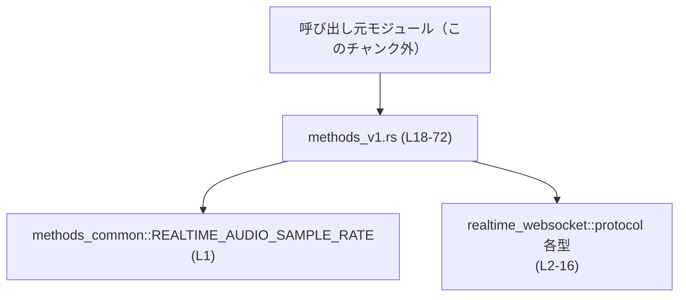
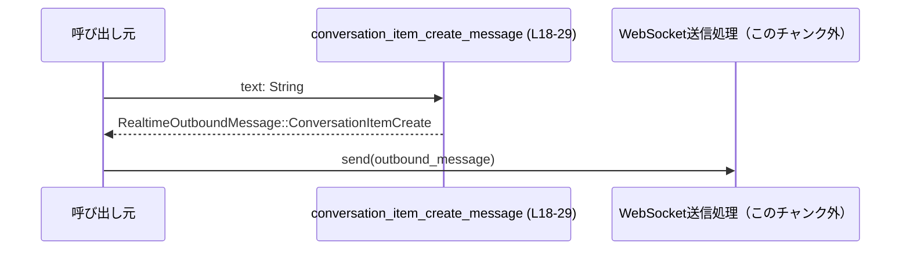
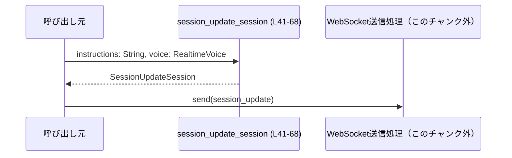

codex-api/src/endpoint/realtime_websocket/methods_v1.rs

---

## 0. ざっくり一言

- Realtime WebSocket 用プロトコルオブジェクト（会話メッセージやセッション設定）を組み立てる、小さなヘルパー関数群のモジュールです（methods_v1.rs:L18-72）。

---

## 1. このモジュールの役割

### 1.1 概要

- このモジュールは、Realtime WebSocket エンドポイント向けに送信するメッセージやセッション更新リクエストを簡潔に生成するためのヘルパー関数を提供します（methods_v1.rs:L18-72）。
- 具体的には、ユーザーのテキストメッセージを会話アイテムに変換する関数、ハンドオフ結果を追記するメッセージを生成する関数、音声付きセッション設定を構築する関数、WebSocket intent 文字列を返す関数が定義されています（methods_v1.rs:L18-39, L41-72）。

### 1.2 アーキテクチャ内での位置づけ

- 本モジュールは、`crate::endpoint::realtime_websocket::protocol` で定義される型群と、`methods_common::REALTIME_AUDIO_SAMPLE_RATE` を利用して、送信用オブジェクトを構築します（methods_v1.rs:L1-16）。
- このモジュール自体は呼び出し専用であり、WebSocket の送信処理や実際のネットワーク I/O はこのチャンクには現れていません（不明）。



### 1.3 設計上のポイント

- **責務の分割**  
  - 送信メッセージ・セッション設定の「組み立てロジック」のみを担当し、送信処理やエラー処理は持っていません（methods_v1.rs:L18-72）。
- **状態を持たない**  
  - すべての関数は引数から新しい値を生成して返す純粋関数であり、内部に状態を保持しません（methods_v1.rs:L18-72）。
- **エラーハンドリング**  
  - いずれの関数も `Result` などは返さず、パニックを起こすコードも含まれていません。入力値をそのままフィールドに格納するだけの構造になっています（methods_v1.rs:L18-29, L31-39, L41-68, L70-72）。
- **スレッド安全性**  
  - グローバルな可変状態や `unsafe` は使用しておらず（methods_v1.rs:L1-72）、関数は純粋に値を生成するだけなので、一般的な Rust の前提では複数スレッドからの呼び出しも安全に行える構造になっています。

---

## 2. 主要な機能一覧

- 会話メッセージ生成: ユーザーのテキストから `ConversationItemCreate` 用メッセージを生成する（methods_v1.rs:L18-29）。
- ハンドオフ追記メッセージ生成: handoff ID と出力テキストから `ConversationHandoffAppend` メッセージを生成する（methods_v1.rs:L31-39）。
- セッション更新設定生成: 音声設定付きの `SessionUpdateSession` オブジェクトを構築する（methods_v1.rs:L41-68）。
- WebSocket intent 取得: WebSocket セッション用 intent 文字列 `"quicksilver"` を返す（methods_v1.rs:L70-72）。

---

## 3. 公開 API と詳細解説

### 3.1 このファイルで扱う主な型一覧

※型の定義そのものは他モジュールにありますが、本ファイル内での利用から分かる範囲を整理します。

| 名前 | 種別 | 役割 / 用途 | 根拠 |
|------|------|-------------|------|
| `RealtimeOutboundMessage` | 列挙体と推定 | WebSocket で送信するメッセージ種別（`ConversationItemCreate`, `ConversationHandoffAppend` など）を表す（Variant 初期化から推定） | methods_v1.rs:L9, L18-20, L31-38 |
| `ConversationItemPayload` | 列挙体と推定 | 会話アイテムの内容種別（ここでは `Message`）を表す | methods_v1.rs:L5, L20 |
| `ConversationMessageItem` | 構造体と推定 | 会話メッセージの本体（type, role, content）を保持する | methods_v1.rs:L7, L20-27 |
| `ConversationItemContent` | 構造体と推定 | 単一のコンテンツ（ここでは Text）を表す | methods_v1.rs:L4, L23-26 |
| `ConversationContentType` | 列挙体と推定 | コンテンツの種類（Text など）を表す | methods_v1.rs:L3, L24 |
| `ConversationItemType` | 列挙体と推定 | 会話アイテムの種類（Message など）を表す | methods_v1.rs:L6, L21 |
| `ConversationRole` | 列挙体と推定 | メッセージの送信者ロール（ここでは User）を表す | methods_v1.rs:L8, L22 |
| `SessionUpdateSession` | 構造体と推定 | セッションの設定更新を表すリクエストオブジェクト | methods_v1.rs:L16, L41-68 |
| `SessionType` | 列挙体と推定 | セッションの種類（ここでは Quicksilver）を表す | methods_v1.rs:L15, L47 |
| `SessionAudio` | 構造体と推定 | セッションの音声設定（入力・出力）をまとめる | methods_v1.rs:L11, L51-64 |
| `SessionAudioInput` | 構造体と推定 | 音声入力に関する設定（format, noise_reduction, turn_detection） | methods_v1.rs:L13, L52-59 |
| `SessionAudioOutput` | 構造体と推定 | 音声出力に関する設定（format, voice） | methods_v1.rs:L14, L60-63 |
| `SessionAudioFormat` | 構造体と推定 | 音声フォーマット（type, rate）を表す | methods_v1.rs:L12, L53-56 |
| `AudioFormatType` | 列挙体と推定 | 音声フォーマットの種類（ここでは AudioPcm） | methods_v1.rs:L2, L54 |
| `RealtimeVoice` | 型（構造体/列挙体など, 不明） | 音声出力に利用する声の種類・設定を表す | methods_v1.rs:L10, L42-43, L62 |
| `REALTIME_AUDIO_SAMPLE_RATE` | 定数 | PCM 音声のサンプルレート | methods_v1.rs:L1, L55 |

※「構造体/列挙体と推定」は、構造体リテラル・列挙体バリアント初期化の構文から判断しています。

### 3.2 関数詳細

#### `conversation_item_create_message(text: String) -> RealtimeOutboundMessage`

**概要**

- 渡されたテキスト文字列から、ユーザーによるテキストメッセージを表す `ConversationItemCreate` メッセージを生成し、`RealtimeOutboundMessage` として返します（methods_v1.rs:L18-29）。

**引数**

| 引数名 | 型 | 説明 | 根拠 |
|--------|----|------|------|
| `text` | `String` | メッセージ本文となるテキスト。空文字もそのまま利用されます。 | methods_v1.rs:L18, L25 |

**戻り値**

- `RealtimeOutboundMessage` 型の `ConversationItemCreate` バリアントが返されます（methods_v1.rs:L18-20）。
  - `item` フィールドには `ConversationItemPayload::Message` が設定されます（methods_v1.rs:L20）。
  - その中の `ConversationMessageItem` には以下が設定されます（methods_v1.rs:L20-27）:
    - `type`: `ConversationItemType::Message`（methods_v1.rs:L21）
    - `role`: `ConversationRole::User`（methods_v1.rs:L22）
    - `content`: `ConversationItemContent` のベクタ。要素は 1 つで、`type: ConversationContentType::Text` と `text: 引数 text`（methods_v1.rs:L23-26）。

**内部処理の流れ**

1. `RealtimeOutboundMessage::ConversationItemCreate` バリアントのリテラルを構築します（methods_v1.rs:L19-20）。
2. `item` フィールドに `ConversationItemPayload::Message` を設定し、その中で `ConversationMessageItem` 構造体リテラルを生成します（methods_v1.rs:L20-27）。
3. `ConversationMessageItem` の `type` を `ConversationItemType::Message` に固定し、`role` を `ConversationRole::User` に固定します（methods_v1.rs:L21-22）。
4. `content` に長さ 1 の `Vec<ConversationItemContent>` を作り、`type: ConversationContentType::Text`, `text: 引数 text` をセットします（methods_v1.rs:L23-26）。
5. 完成した `RealtimeOutboundMessage` を返します（methods_v1.rs:L18-29）。

**Examples（使用例）**

同一モジュール内、もしくは適切に `use` した状態を想定した例です。

```rust
// ユーザーからの入力テキスト
let user_input = String::from("こんにちは");

// WebSocket で送信するメッセージオブジェクトを生成する
let outbound = conversation_item_create_message(user_input);

// 生成された `outbound` は RealtimeOutboundMessage::ConversationItemCreate となる
// ここから先は、この値を WebSocket 送信用コードに渡す想定です
```

**Errors / Panics**

- 本関数には `?` 演算子や `unwrap` などは登場せず、配列のインデックスアクセスも行っていないため、パニック条件は見当たりません（methods_v1.rs:L18-29）。
- 例外的な状況でも `RealtimeOutboundMessage` を必ず返す設計です。

**Edge cases（エッジケース）**

- `text` が空文字列のとき  
  → そのまま `ConversationItemContent.text` にセットされます。特別な処理は行われていません（methods_v1.rs:L23-26）。
- 非 ASCII 文字（絵文字やマルチバイト文字など）  
  → `String` として扱われるのみで、この関数内での変換や正規化処理はありません（methods_v1.rs:L18-29）。

**使用上の注意点**

- 本関数はロールを常に `ConversationRole::User` に固定します（methods_v1.rs:L22）。システムメッセージやアシスタントメッセージを送りたい場合は、別の関数やロジックが必要です（このチャンクには現れない）。
- コンテンツは常に 1 要素のテキストのみです（methods_v1.rs:L23-26）。複数コンテンツや非テキストコンテンツ（音声など）を扱うには別途拡張が必要です（このチャンクには現れない）。
- 入力値の検証（長さ制限、禁止文字のチェックなど）は一切行っていないため、必要な検証は呼び出し元で行う前提の設計です（methods_v1.rs:L18-29）。

---

#### `conversation_handoff_append_message(handoff_id: String, output_text: String) -> RealtimeOutboundMessage`

**概要**

- handoff（引き継ぎ）セッションに対してテキストを追記するための `ConversationHandoffAppend` メッセージを生成します（methods_v1.rs:L31-39）。

**引数**

| 引数名 | 型 | 説明 | 根拠 |
|--------|----|------|------|
| `handoff_id` | `String` | 対象ハンドオフセッションを識別する ID | methods_v1.rs:L31-33, L36 |
| `output_text` | `String` | 追記するテキスト内容 | methods_v1.rs:L32-33, L37 |

**戻り値**

- `RealtimeOutboundMessage::ConversationHandoffAppend` バリアントが返され、`handoff_id` と `output_text` フィールドに引数がそのまま設定されます（methods_v1.rs:L35-38）。

**内部処理の流れ**

1. `RealtimeOutboundMessage::ConversationHandoffAppend` のリテラルを構築します（methods_v1.rs:L35）。
2. `handoff_id` フィールドに引数 `handoff_id` を代入します（methods_v1.rs:L36）。
3. `output_text` フィールドに引数 `output_text` を代入します（methods_v1.rs:L37）。
4. 完成した `RealtimeOutboundMessage` を返します（methods_v1.rs:L31-39）。

**Examples（使用例）**

```rust
// 既存の handoff セッションの ID
let handoff_id = String::from("session-123");

// セッションに追記したいテキスト
let text = String::from("この件はオペレーターに引き継がれました。");

// 追記用メッセージを生成
let outbound = conversation_handoff_append_message(handoff_id, text);

// outbound を WebSocket 送信処理に渡す想定
```

**Errors / Panics**

- 本関数も単純な構造体/列挙体リテラルの生成のみであり、パニックを引き起こすコードはありません（methods_v1.rs:L31-39）。

**Edge cases（エッジケース）**

- `handoff_id` や `output_text` が空文字列でも、そのままフィールドにセットされます（methods_v1.rs:L31-39）。
- ID 形式の妥当性や、テキスト長の制限などはチェックされません。

**使用上の注意点**

- `handoff_id` の存在確認や整合性チェックは行っていないため、無効な ID を渡すと後段の処理（このチャンク外）でエラーになる可能性があります。
- `output_text` の長さや内容の検証は呼び出し元の責務です（methods_v1.rs:L31-39）。

---

#### `session_update_session(instructions: String, voice: RealtimeVoice) -> SessionUpdateSession`

**概要**

- Quicksilver セッション向けの `SessionUpdateSession` 設定オブジェクトを構築します。音声入出力設定を含み、入力フォーマットは PCM (`AudioFormatType::AudioPcm`)、サンプルレートは `REALTIME_AUDIO_SAMPLE_RATE` に固定されています（methods_v1.rs:L41-68）。

**引数**

| 引数名 | 型 | 説明 | 根拠 |
|--------|----|------|------|
| `instructions` | `String` | セッションに与える指示テキスト。`Some` に包まれて設定されます。 | methods_v1.rs:L41-43, L49 |
| `voice` | `RealtimeVoice` | 出力音声に利用する声設定。`SessionAudioOutput.voice` に設定されます。 | methods_v1.rs:L42-43, L60-63 |

**戻り値**

- `SessionUpdateSession` 構造体が返されます（methods_v1.rs:L41-68）。
  - 主なフィールド:
    - `id: None`（methods_v1.rs:L46）
    - `type: SessionType::Quicksilver`（methods_v1.rs:L47）
    - `model: None`（methods_v1.rs:L48）
    - `instructions: Some(instructions)`（methods_v1.rs:L49）
    - `output_modalities: None`（methods_v1.rs:L50）
    - `audio: SessionAudio`（methods_v1.rs:L51-64）
      - `input: SessionAudioInput`（methods_v1.rs:L52-59）
        - `format: SessionAudioFormat { type: AudioFormatType::AudioPcm, rate: REALTIME_AUDIO_SAMPLE_RATE }`（methods_v1.rs:L53-56）
        - `noise_reduction: None`（methods_v1.rs:L57）
        - `turn_detection: None`（methods_v1.rs:L58）
      - `output: Some(SessionAudioOutput { format: None, voice })`（methods_v1.rs:L60-63）
    - `tools: None`（methods_v1.rs:L65）
    - `tool_choice: None`（methods_v1.rs:L66）

**内部処理の流れ**

1. `SessionUpdateSession` 構造体のリテラルを生成します（methods_v1.rs:L45-67）。
2. ID, モデル, ツール関連は `None` に設定し、セッションタイプは `SessionType::Quicksilver` に固定します（methods_v1.rs:L46-48, L65-66）。
3. 指示文 `instructions` を `Some(instructions)` としてフィールドに設定します（methods_v1.rs:L49）。
4. `audio` フィールドについて、`SessionAudio` を構築します（methods_v1.rs:L51-64）。
   - 入力側 `SessionAudioInput` に、`SessionAudioFormat` を設定します。フォーマットタイプは `AudioFormatType::AudioPcm`、サンプルレートは `REALTIME_AUDIO_SAMPLE_RATE` です（methods_v1.rs:L52-56）。
   - `noise_reduction` と `turn_detection` は `None` に設定され、特別な処理は有効化されていません（methods_v1.rs:L57-58）。
   - 出力側 `SessionAudioOutput` は `Some(...)` でラップされ、`format: None` と `voice: 引数 voice` が設定されます（methods_v1.rs:L60-63）。
5. 完成した `SessionUpdateSession` を返します（methods_v1.rs:L45-68）。

**Examples（使用例）**

`RealtimeVoice` 型の具体的な初期化方法はこのチャンクには現れないため、ここでは既に `voice` が用意されている前提の例を示します。

```rust
// 例: 何らかの方法で取得した RealtimeVoice
let voice: RealtimeVoice = obtain_default_voice(); // ダミー関数。実際の取得方法はこのチャンクには現れない。

// セッションに対する指示文
let instructions = String::from("ユーザーの質問に対して日本語で丁寧に応答してください。");

// セッション更新オブジェクトを生成
let update = session_update_session(instructions, voice);

// `update` を WebSocket 経由でセッション更新 API に送ることを想定
```

**Errors / Panics**

- 本関数にもパニック要因となるコードは存在しません。すべてのフィールドは定数もしくは引数から直接設定されています（methods_v1.rs:L41-68）。
- `REALTIME_AUDIO_SAMPLE_RATE` の値が不正な場合（負数など）は、このチャンクだけからは判断できませんが、少なくともここではその値をチェックしていません（methods_v1.rs:L55）。

**Edge cases（エッジケース）**

- `instructions` が空文字列  
  → `Some("")` として設定され、特別な扱いはありません（methods_v1.rs:L49）。
- `voice` にどのような値が来ても（無効値かどうか含め）そのまま `SessionAudioOutput.voice` に格納されます（methods_v1.rs:L60-63）。
- `output` フィールドは常に `Some(...)` となり、音声出力が無効化されるケース（`None`）はこの関数からは生成されません（methods_v1.rs:L60-63）。

**使用上の注意点**

- セッションタイプは `SessionType::Quicksilver` に固定されているため、他のセッションタイプを扱う必要がある場合は別関数が必要です（methods_v1.rs:L47）。
- ノイズ除去や自動ターン検出は `None`（無効）で設定されているため、これらの機能を利用したい場合は別の初期化ロジックや属性変更が必要です（methods_v1.rs:L57-58）。
- ツール関連フィールド（`tools`, `tool_choice`）もすべて `None` で初期化されるため、ツールを利用したセッションを作る場合は後処理でこれらのフィールドを設定する必要があります（methods_v1.rs:L65-66）。
- 音声フォーマット種類とサンプルレートは固定値であり、柔軟に変更するインターフェースはこの関数にはありません（methods_v1.rs:L54-55）。

---

#### `websocket_intent() -> Option<&'static str>`

**概要**

- WebSocket セッションの intent を表す文字列 `"quicksilver"` を `Some` で返します（methods_v1.rs:L70-72）。

**引数**

- 引数はありません（methods_v1.rs:L70-72）。

**戻り値**

- `Option<&'static str>` で、常に `Some("quicksilver")` を返します（methods_v1.rs:L70-71）。

**内部処理の流れ**

1. リテラル `"quicksilver"` を返り値として `Some(...)` でラップします（methods_v1.rs:L71）。
2. それ以外の分岐や条件はありません（methods_v1.rs:L70-72）。

**Examples（使用例）**

```rust
// WebSocket intent を取得
if let Some(intent) = websocket_intent() {
    // intent を使って WebSocket 接続パラメータを構築する、など
    println!("Using WebSocket intent: {}", intent);
}
```

**Errors / Panics**

- パニックを起こす要素はありません。常に `Some` を返すだけです（methods_v1.rs:L70-72）。

**Edge cases（エッジケース）**

- 現状、`None` が返されるケースはありません（methods_v1.rs:L70-72）。
- intent 文字列が変更される可能性はコード上では見えず、固定値 `"quicksilver"` となっています（methods_v1.rs:L71）。

**使用上の注意点**

- 戻り値が `Option` 型であるため、呼び出し側は `None` になる可能性も考慮したコードを書くのが安全ですが、この実装に限って言えば常に `Some("quicksilver")` です（methods_v1.rs:L70-72）。
- intent 名と `SessionType::Quicksilver` が一致していることから（methods_v1.rs:L47, L71）、両者の整合性を前提とした設計であると考えられますが、厳密な契約はこのチャンクには現れません。

---

### 3.3 その他の関数

- このファイルには、上記 4 関数以外の補助的な関数やラッパー関数は定義されていません（methods_v1.rs:L18-72）。

---

## 4. データフロー

ここでは、典型的な「テキストメッセージ送信」のフローと「セッション更新」のフローをまとめて示します。

### 4.1 テキストメッセージ送信のフロー

1. 呼び出し元がユーザー入力 `text` を収集します（このチャンク外）。
2. `conversation_item_create_message(text)` で `RealtimeOutboundMessage` を生成します（methods_v1.rs:L18-29）。
3. 生成したメッセージを WebSocket 送信処理に渡して送信します（このチャンク外）。



### 4.2 セッション更新のフロー

1. 呼び出し元が `instructions` と `voice` を用意します（このチャンク外）。
2. `session_update_session(instructions, voice)` を呼んで `SessionUpdateSession` を生成します（methods_v1.rs:L41-68）。
3. 生成したオブジェクトを WebSocket 経由のセッション更新 API などに渡します（このチャンク外）。



---

## 5. 使い方（How to Use）

### 5.1 基本的な使用方法

本モジュールの関数を用いて、セッションを更新し、ユーザーからのテキストメッセージを送信する一連のコード例です（同一モジュール内での使用を想定）。

```rust
// 1. 音声設定付きでセッションを更新する
let voice: RealtimeVoice = obtain_default_voice(); // 実際の取得ロジックはこのチャンクには現れない
let instructions = String::from("ユーザーの質問に自然な音声で応答してください。");

let update = session_update_session(instructions, voice);
// `update` を WebSocket 経由で送信する処理は別モジュール（このチャンク外）

// 2. ユーザーからのテキスト入力を会話メッセージに変換する
let user_input = String::from("今日の天気は？");
let outbound_msg = conversation_item_create_message(user_input);
// `outbound_msg` を WebSocket 送信処理に渡す
```

### 5.2 よくある使用パターン

1. **テキストのみのチャット WebSocket**  
   - `conversation_item_create_message` でテキストメッセージを生成し、WebSocket に送信する（methods_v1.rs:L18-29）。
2. **音声応答付きセッション**  
   - セッション開始時に `session_update_session` を使って音声出力設定（`voice`）と `instructions` を送信し、その後テキストメッセージを送信する（methods_v1.rs:L41-68）。

### 5.3 よくある間違い

```rust
// 間違い例: role を変えたいが、そのために conversation_item_create_message を直接書き換えてしまう
// → 他のコードが User 固定である前提に依存している可能性がある（このチャンク外）。
// RealtimeOutboundMessage::ConversationItemCreate {
//     item: ConversationItemPayload::Message(ConversationMessageItem {
//         r#type: ConversationItemType::Message,
//         role: ConversationRole::System, // ここを勝手に変更
//         content: vec![/* ... */],
//     }),
// }

// 正しい例: 本関数は「User ロールのテキストメッセージを生成する」責務に限定して利用する
let msg = conversation_item_create_message("こんにちは".to_string());

// 別ロールのメッセージが必要な場合は、別途専用のヘルパー関数を追加する（このファイルを拡張）
```

```rust
// 間違い例: audio 設定を変えたいからといって、session_update_session の呼び出し後に
// 直接フィールドを変更せずにそのまま使ってしまう
let update = session_update_session("...".to_string(), voice);
// update.audio.input.format.rate を変更したいが、何もしない

// 正しいパターンの一例（SessionUpdateSession が可変なら）
let mut update = session_update_session("...".to_string(), voice);
update.audio.input.format.rate = 16_000; // 実際にこのフィールドが公開されているかはこのチャンクには現れない
```

### 5.4 使用上の注意点（まとめ）

- **入力検証がない**  
  - すべての関数は引数をそのままフィールドに設定しており、長さや形式の検証を行いません（methods_v1.rs:L18-29, L31-39, L41-68）。必要な制約は呼び出し元で保証する必要があります。
- **固定値への依存**  
  - セッションタイプは `Quicksilver`、audio フォーマットは `AudioPcm` + `REALTIME_AUDIO_SAMPLE_RATE` に固定されており（methods_v1.rs:L47, L54-55, L71）、他の構成が必要な場合は別途拡張が必要です。
- **Option フィールドの既定値**  
  - 多くのフィールド（`id`, `model`, `output_modalities`, `noise_reduction`, `turn_detection`, `tools`, `tool_choice`, `SessionAudioOutput.format` など）は `None` に初期化されます（methods_v1.rs:L46, L48, L50, L57-58, L60-61, L65-66）。これらを使いたい場合は後から設定する前提です。

---

## 6. 変更の仕方（How to Modify）

### 6.1 新しい機能を追加する場合

- 例: システムメッセージやアシスタントメッセージを生成するヘルパーを追加したい場合。
  1. 本ファイル（methods_v1.rs）に新しい関数 `conversation_item_create_system_message` などを追加する。
  2. `conversation_item_create_message` と同様に `RealtimeOutboundMessage::ConversationItemCreate` を構築しつつ、`ConversationRole` や `ConversationContentType` を目的に応じて変更する（methods_v1.rs:L18-27 を参考）。
  3. 呼び出し側から新関数を利用するように変更する（呼び出し側コードはこのチャンクには現れない）。

### 6.2 既存の機能を変更する場合

- **影響範囲の確認**  
  - これらの関数は `pub(super)` で公開されているため、親モジュールから利用されている可能性があります（methods_v1.rs:L18, L31, L41, L70）。親モジュールや他ファイルの使用箇所を検索し、影響範囲を確認する必要があります（このチャンクには現れない）。
- **契約の維持**  
  - 例: `conversation_item_create_message` が「User ロールのテキストメッセージを返す」ことを前提にしている呼び出しコードが存在する可能性があります。`role` や `content` の形式を変える場合は、その前提が壊れないか確認が必要です（methods_v1.rs:L21-23）。
  - `session_update_session` の `SessionType::Quicksilver` と `websocket_intent` の `"quicksilver"` は意味的に対応していると考えられるため（methods_v1.rs:L47, L71）、どちらかを変更する際は整合性を保つ必要があります。
- **テスト・呼び出し側の再確認**  
  - 変更後は、WebSocket 通信シーケンスやサーバー側 API が期待するフォーマットと合っているか確認する必要があります。関連するテストコードはこのチャンクには現れません。

---

## 7. 関連ファイル

このモジュールと密接に関係するモジュール（ファイル）は、`use` 文から次のように読み取れます。

| パス / モジュール | 役割 / 関係 | 根拠 |
|-------------------|------------|------|
| `crate::endpoint::realtime_websocket::methods_common` | `REALTIME_AUDIO_SAMPLE_RATE` 定数を提供し、本モジュールの audio フォーマット設定で利用されています。 | methods_v1.rs:L1, L55 |
| `crate::endpoint::realtime_websocket::protocol` | 各種プロトコル用型（`RealtimeOutboundMessage`, `SessionUpdateSession`, `Conversation*` 系, `SessionAudio*` 系, `RealtimeVoice` など）を提供し、本モジュール内でのオブジェクト構築に利用されています。 | methods_v1.rs:L2-16 |

※ 実際のファイルパス（`protocol.rs` / `protocol/mod.rs` など）は、このチャンクからは特定できません。
