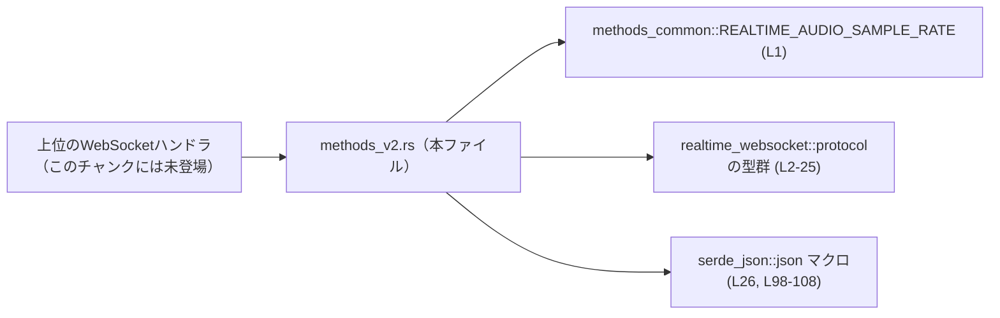
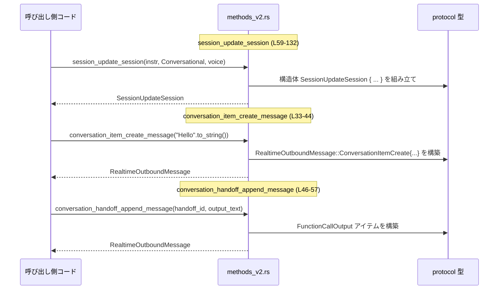

# codex-api/src/endpoint/realtime_websocket/methods_v2.rs

## 0. ざっくり一言

Realtime WebSocket v2 セッション向けに、  
「会話メッセージ」と「セッション設定(SessionUpdateSession)」を組み立てるための **内部ヘルパー関数群**を定義しているモジュールです（`pub(super)` のためモジュール内限定公開）。  
根拠: `methods_v2.rs:L28-31, L33-137`

---

## 1. このモジュールの役割

### 1.1 概要

- このモジュールは、Realtime WebSocket エンドポイントで使用する **送信メッセージ（`RealtimeOutboundMessage`）** と  
  **セッション更新メッセージ（`SessionUpdateSession`）** を、一定のポリシーに従って組み立てるために存在します。  
- 具体的には、以下を提供します。
  - ユーザー発話を表す会話アイテムの生成  
    根拠: `methods_v2.rs:L33-44`
  - ハンドオフ（function call）の追記メッセージの生成  
    根拠: `methods_v2.rs:L46-57`
  - セッションモード（会話 / 音声書き起こし）に応じた `SessionUpdateSession` の生成  
    根拠: `methods_v2.rs:L59-132`
  - WebSocket 意図文字列のプレースホルダ（現状は常に `None`）  
    根拠: `methods_v2.rs:L135-137`

### 1.2 アーキテクチャ内での位置づけ

このモジュールは、上位の WebSocket ハンドラ（呼び出し元の具体名はこのチャンクには現れません）から呼ばれ、  
`protocol` モジュールで定義された型を組み立てて返します。



- 依存関係はすべて **型/定数レベル** であり、I/O やスレッド操作は行っていません。  
  根拠: `methods_v2.rs:L1-26, L33-137`
- `pub(super)` で公開されているため、**同じモジュール階層内の他ファイル**からのみ利用される内部 API です。  
  根拠: `methods_v2.rs:L33, L46, L59, L135`

### 1.3 設計上のポイント

- **ステートレスなヘルパー関数**
  - いずれの関数も内部状態を持たず、引数から新しい構造体インスタンスを生成して返すだけです。  
    根拠: `methods_v2.rs:L33-57, L59-132, L135-137`
- **型安全な構築**
  - `ConversationItemType`, `ConversationRole`, `SessionType`, `AudioFormatType` などの列挙型を直接指定しており、  
    不正な文字列やモードの混在をコンパイル時に防いでいます。  
    根拠: `methods_v2.rs:L36-37, L52, L67, L74, L88, L114, L121`
- **セッションモードごとのポリシー集中**
  - `RealtimeSessionMode` に応じて `SessionUpdateSession` のフィールド（音声入出力設定・ツール・指示文など）を  
    1 箇所で分岐させているため、「会話モード」と「書き起こしモード」の違いがこの関数に集約されています。  
    根拠: `methods_v2.rs:L59-63, L64-132`
- **外部仕様に合致した JSON Schema の埋め込み**
  - 背景エージェント用の Function ツールに対し、`serde_json::json!` でパラメータの JSON Schema を埋め込んでいます。  
    根拠: `methods_v2.rs:L94-110`

---

## 2. 主要な機能一覧（コンポーネントインベントリ）

### 2.1 関数・定数インベントリ

| 種別 | 名前 | 概要 | 定義箇所 |
|------|------|------|----------|
| 定数 | `REALTIME_V2_OUTPUT_MODALITY_AUDIO` | 出力モダリティ `"audio"` を表す文字列 | `methods_v2.rs:L28` |
| 定数 | `REALTIME_V2_TOOL_CHOICE` | ツール選択ポリシー `"auto"` | `methods_v2.rs:L29` |
| 定数 | `REALTIME_V2_BACKGROUND_AGENT_TOOL_NAME` | 背景エージェント Function ツールの名前 `"background_agent"` | `methods_v2.rs:L30` |
| 定数 | `REALTIME_V2_BACKGROUND_AGENT_TOOL_DESCRIPTION` | 背景エージェントツールの説明文（長文英語） | `methods_v2.rs:L31` |
| 関数 | `conversation_item_create_message` | ユーザーのテキスト入力から `ConversationItemCreate` メッセージを構築 | `methods_v2.rs:L33-44` |
| 関数 | `conversation_handoff_append_message` | function call の出力を会話ログに追記するメッセージを構築 | `methods_v2.rs:L46-57` |
| 関数 | `session_update_session` | セッションモードに応じた `SessionUpdateSession` を構築 | `methods_v2.rs:L59-132` |
| 関数 | `websocket_intent` | WebSocket 用 intent 文字列を返すプレースホルダ（常に `None`） | `methods_v2.rs:L135-137` |

### 2.2 主要な機能（1 行要約）

- 会話メッセージ生成: ユーザーテキストから会話アイテムを作成する。  
  根拠: `methods_v2.rs:L33-44`
- ハンドオフ追記メッセージ: 既存の function call に対する出力を会話アイテムとして追加する。  
  根拠: `methods_v2.rs:L46-57`
- セッション更新メッセージ生成: 会話 / 書き起こしモードごとの音声設定・ツール設定を含む `SessionUpdateSession` を作成する。  
  根拠: `methods_v2.rs:L59-132`
- WebSocket インテント取得: WebSocket 用の intent 文字列を返すが、現状は常に `None` を返す。  
  根拠: `methods_v2.rs:L135-137`

---

## 3. 公開 API と詳細解説

### 3.1 型一覧（このファイルで使用している主な型）

このファイル自身は新しい型を定義していませんが、`protocol` モジュールの型を多用しています。

| 名前 | 種別 | 定義モジュール（推定） | 役割 / 用途 | 使用箇所 |
|------|------|------------------------|-------------|----------|
| `RealtimeOutboundMessage` | 型（enum/struct） | `realtime_websocket::protocol` | WebSocket 経由で送信される Realtime プロトコルのアウトバウンドメッセージ | `methods_v2.rs:L11, L33-44, L46-57` |
| `ConversationItemPayload` | 型 | 同上 | 会話アイテムのペイロード（メッセージ / function call 出力など） | `methods_v2.rs:L6, L35, L51` |
| `ConversationMessageItem` | 型 | 同上 | 通常の会話メッセージ（role と content を持つ） | `methods_v2.rs:L8, L35-41` |
| `ConversationFunctionCallOutputItem` | 型 | 同上 | function call の出力アイテム（`call_id` と `output` を持つ） | `methods_v2.rs:L4, L51-55` |
| `ConversationItemType` | enum | 同上 | 会話アイテムの種類（`Message`, `FunctionCallOutput` など） | `methods_v2.rs:L7, L36, L52` |
| `ConversationContentType` | enum | 同上 | コンテンツの種類（ここでは `InputText`） | `methods_v2.rs:L3, L39` |
| `ConversationItemContent` | 型 | 同上 | メッセージ内の 1 コンテンツ（type と text） | `methods_v2.rs:L5, L38-41` |
| `ConversationRole` | enum | 同上 | 発話者の役割（ここでは常に `User`） | `methods_v2.rs:L9, L37` |
| `RealtimeSessionMode` | enum | 同上 | セッションモード（`Conversational` / `Transcription`） | `methods_v2.rs:L12, L61, L64-65, L112` |
| `RealtimeVoice` | 型 | 同上 | 音声出力時に利用する声の指定 | `methods_v2.rs:L13, L62, L86-92` |
| `SessionUpdateSession` | 型 | 同上 | セッション更新メッセージ全体 | `methods_v2.rs:L24, L63, L65-111, L112-131` |
| `SessionType` | enum | 同上 | セッション種別（`Realtime` / `Transcription`） | `methods_v2.rs:L23, L67, L114` |
| `SessionAudio`, `SessionAudioInput`, `SessionAudioOutput` | 構造体 | 同上 | セッションの音声入出力設定 | `methods_v2.rs:L14-18, L71-93, L118-127` |
| `SessionAudioFormat`, `SessionAudioOutputFormat` | 構造体 | 同上 | 音声フォーマット（種別とサンプルレート） | `methods_v2.rs:L15, L18, L73-76, L87-90, L120-123` |
| `AudioFormatType` | enum | 同上 | 音声フォーマット種別（ここでは `AudioPcm`） | `methods_v2.rs:L2, L74, L88, L121` |
| `SessionNoiseReduction`, `NoiseReductionType` | 型 / enum | 同上 | ノイズ除去設定（ここでは `NearField`） | `methods_v2.rs:L10, L20, L77-79` |
| `SessionTurnDetection`, `TurnDetectionType` | 型 / enum | 同上 | 発話区切り検出設定（ここでは `ServerVad`） | `methods_v2.rs:L22, L25, L80-84` |
| `SessionFunctionTool`, `SessionToolType` | 型 / enum | 同上 | Function ツール定義とその種別 | `methods_v2.rs:L19, L21, L94-99` |

> ※ これらの詳細な定義（フィールドやバリアント）は、このチャンクには含まれていません。

---

### 3.2 関数詳細

#### `conversation_item_create_message(text: String) -> RealtimeOutboundMessage`

**概要**

- ユーザーからのテキスト入力を、`RealtimeOutboundMessage::ConversationItemCreate` 型のメッセージに変換します。  
- 生成される会話アイテムは:
  - `role` が常に `ConversationRole::User`
  - `content[0].type` が `ConversationContentType::InputText`
  となります。  
  根拠: `methods_v2.rs:L33-41`

**引数**

| 引数名 | 型 | 説明 |
|--------|----|------|
| `text` | `String` | ユーザーの入力テキスト。UTF-8 文字列で、空文字列でも受け付けます。 |

**戻り値**

- `RealtimeOutboundMessage`  
  - バリアントは `ConversationItemCreate` で、`item` に `ConversationItemPayload::Message(ConversationMessageItem { ... })` が入ります。  
    根拠: `methods_v2.rs:L34-42`

**内部処理の流れ**

1. `ConversationMessageItem` を組み立てます。
   - `type` = `ConversationItemType::Message`  
     根拠: `methods_v2.rs:L36`
   - `role` = `ConversationRole::User`  
     根拠: `methods_v2.rs:L37`
   - `content` = 長さ 1 の `Vec<ConversationItemContent>` で、要素は  
     `type` = `ConversationContentType::InputText`, `text` = 引数 `text`。  
     根拠: `methods_v2.rs:L38-41`
2. それを `ConversationItemPayload::Message(...)` でラップします。  
   根拠: `methods_v2.rs:L35`
3. 最終的に `RealtimeOutboundMessage::ConversationItemCreate { item: ... }` として返します。  
   根拠: `methods_v2.rs:L34-42`

**Examples（使用例）**

> 以下の例は、この関数と同じモジュール階層（`pub(super)` が届く範囲）から利用することを想定しています。

```rust
// ユーザー発話 "Hello" を会話メッセージに変換する
let outbound = conversation_item_create_message("Hello".to_string());

// 生成された outbound を WebSocket 送信処理に渡す（send_to_websocket は呼び出し側で定義）
send_to_websocket(outbound);
```

**Errors / Panics**

- この関数自体は `Result` を返さず、通常の使用でパニックを起こすコードは含まれていません。
- 事実上の失敗可能性はメモリ不足などのランタイム環境によるもののみです。

**Edge cases（エッジケース）**

- `text` が空文字列 (`""`) の場合
  - 空テキストを持つメッセージが生成されますが、特別な扱いはありません。  
    根拠: `methods_v2.rs:L38-41` にバリデーションがない
- 非 ASCII 文字（日本語など）を含む場合
  - `String` としてそのまま格納されます。文字種による分岐やエスケープは行っていません。

**使用上の注意点**

- `role` は常に `User` で固定されており、システム/アシスタントメッセージを作りたい場合は、この関数ではなく別のヘルパーか直接 `ConversationMessageItem` を組み立てる必要があります。
- 並行性:
  - 入出力はすべて値の所有権移動であり、グローバルな可変状態に触れないため、複数スレッドから同時に呼んでも安全です。

---

#### `conversation_handoff_append_message(handoff_id: String, output_text: String) -> RealtimeOutboundMessage`

**概要**

- 既存の function call（ハンドオフ）の出力を、会話アイテムとして追記する `ConversationItemCreate` メッセージを生成します。  
- `call_id` にハンドオフ ID を埋め込み、`output` にテキスト出力を設定します。  
  根拠: `methods_v2.rs:L46-55`

**引数**

| 引数名 | 型 | 説明 |
|--------|----|------|
| `handoff_id` | `String` | function call（ハンドオフ）の識別子。`call_id` にそのまま格納されます。 |
| `output_text` | `String` | ハンドオフからのテキスト出力。`output` にそのまま格納されます。 |

**戻り値**

- `RealtimeOutboundMessage`  
  - バリアントは `ConversationItemCreate` で、`item` に `ConversationItemPayload::FunctionCallOutput(ConversationFunctionCallOutputItem { ... })` が入ります。  
    根拠: `methods_v2.rs:L50-55`

**内部処理の流れ**

1. `ConversationFunctionCallOutputItem` を組み立てます。
   - `type` = `ConversationItemType::FunctionCallOutput`  
     根拠: `methods_v2.rs:L52`
   - `call_id` = 引数 `handoff_id`  
     根拠: `methods_v2.rs:L53`
   - `output` = 引数 `output_text`  
     根拠: `methods_v2.rs:L54`
2. それを `ConversationItemPayload::FunctionCallOutput(...)` でラップします。  
   根拠: `methods_v2.rs:L51`
3. `RealtimeOutboundMessage::ConversationItemCreate { item: ... }` として返します。  
   根拠: `methods_v2.rs:L50-56`

**Examples（使用例）**

```rust
// 既存の function call に対する出力を会話に追記する
let handoff_id = "task-123".to_string();
let output_text = "The background task has completed.".to_string();

let outbound = conversation_handoff_append_message(handoff_id, output_text);
send_to_websocket(outbound); // 送信処理は呼び出し側で実装
```

**Errors / Panics**

- この関数も `Result` を返さず、内部でパニックを起こす処理はありません。

**Edge cases（エッジケース）**

- `handoff_id` が空文字列の場合
  - 空の `call_id` を持つアイテムが生成されます。ハンドオフとの紐付けができるかどうかは受信側の仕様に依存します。
- `output_text` が長大な文字列の場合
  - そのまま格納されますが、メモリ使用量・転送量は増加します。

**使用上の注意点**

- `handoff_id` が指す function call が存在することは、この関数では検証していません。整合性は呼び出し側で管理する必要があります。
- 並行性の性質は `conversation_item_create_message` と同様で、ステートレスです。

---

#### `session_update_session(instructions: String, session_mode: RealtimeSessionMode, voice: RealtimeVoice) -> SessionUpdateSession`

**概要**

- Realtime WebSocket セッションの設定をまとめた `SessionUpdateSession` を、  
  セッションモード（`RealtimeSessionMode`）に応じて構築します。  
  根拠: `methods_v2.rs:L59-63, L64-132`
- 2 つのモードに対応:
  - `RealtimeSessionMode::Conversational`:
    - `SessionType::Realtime`
    - 音声入出力・背景エージェント Function ツール・音声出力モダリティなどを設定
  - `RealtimeSessionMode::Transcription`:
    - `SessionType::Transcription`
    - 音声入力のみ設定し、ツール・音声出力・インストラクションは無効化  
    根拠: `methods_v2.rs:L65-111, L112-131`

**引数**

| 引数名 | 型 | 説明 |
|--------|----|------|
| `instructions` | `String` | セッションに対する指示文。Conversational モードでのみ `Some` として利用されます。 |
| `session_mode` | `RealtimeSessionMode` | セッションモード。`Conversational` または `Transcription`。 |
| `voice` | `RealtimeVoice` | 音声出力に使用する声の設定。Conversational モードでのみ利用されます。 |

**戻り値**

- `SessionUpdateSession`  
  - `id` は常に `None`  
    根拠: `methods_v2.rs:L66, L113`
  - `type` はモードに応じて `SessionType::Realtime` または `SessionType::Transcription`  
    根拠: `methods_v2.rs:L67, L114`
  - それ以外のフィールド（`instructions`, `output_modalities`, `audio`, `tools`, `tool_choice`）も  
    モードごとに異なる設定になります。  

**内部処理の流れ（Conversational モード）**

根拠: `methods_v2.rs:L64-65, L65-111`

1. `SessionType::Realtime` を設定 (`type`)。  
   根拠: `methods_v2.rs:L67`
2. 指定された `instructions` を `Some(instructions)` として設定。  
   根拠: `methods_v2.rs:L69`
3. `output_modalities` を `"audio"` だけを含む `Vec<String>` に設定。
   - `"audio"` は定数 `REALTIME_V2_OUTPUT_MODALITY_AUDIO` から取得。  
     根拠: `methods_v2.rs:L28, L70`
4. `audio` フィールドを組み立てる。
   - `input`:
     - `format.type` = `AudioFormatType::AudioPcm`
     - `format.rate` = `REALTIME_AUDIO_SAMPLE_RATE`（他モジュールの定数）  
       根拠: `methods_v2.rs:L71-76`
     - `noise_reduction` = `Some(SessionNoiseReduction { type: NoiseReductionType::NearField })`  
       根拠: `methods_v2.rs:L77-79`
     - `turn_detection` = `Some(SessionTurnDetection { type: TurnDetectionType::ServerVad, interrupt_response: true, create_response: true })`  
       根拠: `methods_v2.rs:L80-84`
   - `output`:
     - `format` = `Some(SessionAudioOutputFormat { type: AudioFormatType::AudioPcm, rate: REALTIME_AUDIO_SAMPLE_RATE })`  
       根拠: `methods_v2.rs:L86-90`
     - `voice` = 引数 `voice` をそのまま利用。  
       根拠: `methods_v2.rs:L91`
5. `tools` に背景エージェント Function ツールを 1 つだけ含む `Vec<SessionFunctionTool>` を設定。
   - `type` = `SessionToolType::Function`  
     根拠: `methods_v2.rs:L95`
   - `name` = `"background_agent"`（定数）  
     根拠: `methods_v2.rs:L30, L96`
   - `description` = 定数 `REALTIME_V2_BACKGROUND_AGENT_TOOL_DESCRIPTION`  
     根拠: `methods_v2.rs:L31, L97`
   - `parameters` = `json!({ ... })` で作成された JSON Schema:
     - `type` = `"object"`
     - `properties.prompt.type` = `"string"`
     - `properties.prompt.description` = `"The user request to delegate to the background agent."`
     - `required` = `["prompt"]`
     - `additionalProperties` = `false`  
       根拠: `methods_v2.rs:L98-108`
6. `tool_choice` = `"auto"`（定数 `REALTIME_V2_TOOL_CHOICE`）。  
   根拠: `methods_v2.rs:L29, L110`

**内部処理の流れ（Transcription モード）**

根拠: `methods_v2.rs:L112-131`

1. `SessionType::Transcription` を設定 (`type`)。  
   根拠: `methods_v2.rs:L114`
2. `instructions` = `None`  
   根拠: `methods_v2.rs:L116`
3. `output_modalities` = `None`  
   根拠: `methods_v2.rs:L117`
4. `audio`:
   - `input` の `format` は Conversational と同じく `AudioPcm` / `REALTIME_AUDIO_SAMPLE_RATE`。  
     根拠: `methods_v2.rs:L119-123`
   - `noise_reduction` = `None`  
     根拠: `methods_v2.rs:L124`
   - `turn_detection` = `None`  
     根拠: `methods_v2.rs:L125`
   - `output` = `None`（音声出力を行わない）。  
     根拠: `methods_v2.rs:L127`
5. `tools` = `None`（Function ツールは利用しない）。  
   根拠: `methods_v2.rs:L129`
6. `tool_choice` = `None`  
   根拠: `methods_v2.rs:L130`

**Examples（使用例）**

```rust
// Conversational モードでのセッション更新の例
let instructions = "You are a helpful assistant.".to_string();
let mode = RealtimeSessionMode::Conversational;
let voice: RealtimeVoice = /* protocol 側で定義された任意の声設定 */;

let update = session_update_session(instructions, mode, voice);

// WebSocket セッションに対して update を送信する処理は呼び出し側で実装する
apply_session_update(update);
```

```rust
// Transcription モードでのセッション更新の例
let instructions = "These instructions will be ignored in Transcription mode.".to_string();
let mode = RealtimeSessionMode::Transcription;
// voice は Transcription モードでは使用されないが、引数としては渡す必要がある
let voice: RealtimeVoice = /* 適当な値 */;

let update = session_update_session(instructions, mode, voice);

// update.instruction は None、audio.output や tools も None になる
```

**Errors / Panics**

- 関数内に明示的なエラー処理やパニック呼び出しはありません。
- `serde_json::json!` はこのリテラルであれば通常失敗せず、ランタイムエラーは発生しません。  
  ただし、これは `serde_json` ライブラリの仕様に依存します。  
  根拠: `methods_v2.rs:L26, L98-108`

**Edge cases（エッジケース）**

- `instructions` が空文字列
  - Conversational モードでは空の指示文として `Some("")` が設定されます。
  - Transcription モードでは `None` 固定なので、引数の内容は無視されます。  
    根拠: `methods_v2.rs:L69, L116`
- `session_mode` に存在しないバリアントはコンパイル上ありえない（enum で表現されるため）。
- `voice` は Transcription モードでは構造体内部で参照されないため、「未使用引数」的な扱いになりますが、  
  将来的な仕様変更への備えとして共通インターフェースを保っていると解釈できます。（意図はコードからは断定できません）

**使用上の注意点**

- モードごとの差異の契約:
  - Conversational:
    - `type` = `SessionType::Realtime`
    - `instructions` は必ず `Some`
    - `output_modalities` は `"audio"` のみ
    - `audio.output` は `Some`
    - `tools` / `tool_choice` も `Some`
  - Transcription:
    - `type` = `SessionType::Transcription`
    - `instructions`, `output_modalities`, `audio.output`, `tools`, `tool_choice` はすべて `None`  
  この違いを前提にロジックを書く場合、将来の変更で壊れないよう注意が必要です。
- 並行性:
  - この関数もステートレスで、`REALTIME_AUDIO_SAMPLE_RATE` や文字列定数を参照するのみのため、スレッドセーフです。  
    根拠: `methods_v2.rs:L1, L28-31, L59-132`
- セキュリティ:
  - `instructions` などの文字列はバリデーションされずにそのまま構造体に格納されます。
  - これらがどのように送信・表示されるかは上位レイヤの責務であり、このファイルではサニタイズ等は行いません。

---

#### `websocket_intent() -> Option<&'static str>`

**概要**

- WebSocket 用の「intent」を表す静的文字列を返すための関数と思われますが、  
  現状は常に `None` を返すプレースホルダ実装です。  
  根拠: `methods_v2.rs:L135-137`

**引数**

- なし

**戻り値**

- `Option<&'static str>`
  - 現在の実装では常に `None`。  
    根拠: `methods_v2.rs:L136`

**内部処理の流れ**

1. 何もせず `None` を返す。  
   根拠: `methods_v2.rs:L136`

**Examples（使用例）**

```rust
if let Some(intent) = websocket_intent() {
    // 現状はここには到達しない（常に None）
    register_intent(intent);
} else {
    // intent 指定なしとして扱う
}
```

**Errors / Panics**

- エラーやパニックは発生しません。

**Edge cases（エッジケース）**

- すべての呼び出しが同じ結果（`None`）になります。環境や入力による違いはありません。

**使用上の注意点**

- 将来の仕様追加のためのフックである可能性がありますが、現状この関数の返り値に依存したロジックを組むと、  
  「常に None である」という挙動に縛られることになります。
- 返り値の `'static` ライフタイムから、将来的に定数文字列が返される設計が想定されていると読めますが、  
  具体的な用途はこのチャンクからは分かりません。

---

### 3.3 その他の関数

- このファイルには上記 4 つ以外の関数は存在しません。  
  根拠: `methods_v2.rs:L33-137`

---

## 4. データフロー

ここでは、このファイルの関数を「どのように組み合わせて使うか」の代表例として、  
**会話モードでのセッション設定とメッセージ送信**の流れを示します。

> 実際の呼び出し元モジュール名や WebSocket 送信処理は、このチャンクには現れないため、  
> 図では抽象的な「呼び出し側」として表現します。



- `Caller` は、上位の WebSocket ハンドラやセッション管理ロジックを想定しています（このチャンクには未登場）。  
- `Methods` は本ファイルの関数で、`Proto` で定義された型インスタンスを生成して返します。
- 生成された `SessionUpdateSession` や `RealtimeOutboundMessage` が、実際には WebSocket で送信されると考えられますが、  
  送信処理はこのファイルには含まれていません。

---

## 5. 使い方（How to Use）

### 5.1 基本的な使用方法

以下は、同じモジュール階層（`pub(super)` が届く範囲）からこのヘルパーを利用する典型的な流れの例です。

```rust
// 会話モードのセッションを初期化する
let instructions = "You are a helpful assistant.".to_string();
let mode = RealtimeSessionMode::Conversational;
let voice: RealtimeVoice = /* protocol 側で定義された任意の声設定 */;

let session_update = session_update_session(instructions, mode, voice);
// ここで session_update を WebSocket 経由で送信する
send_session_update(session_update);

// ユーザーからのテキスト入力を会話メッセージに変換
let user_input = "Hello".to_string();
let msg = conversation_item_create_message(user_input);
send_outbound_message(msg);

// 背景エージェントからの結果などをハンドオフとして追記
let handoff_id = "task-123".to_string();
let output_text = "The background processing is completed.".to_string();
let handoff_msg = conversation_handoff_append_message(handoff_id, output_text);
send_outbound_message(handoff_msg);

// websocket_intent は現状 None なので、オプション扱いにする
if let Some(intent) = websocket_intent() {
    configure_intent(intent);
}
```

### 5.2 よくある使用パターン

1. **会話モードと書き起こしモードの切り替え**

```rust
fn build_session_update_for_mode(
    instructions: String,
    mode: RealtimeSessionMode,
    voice: RealtimeVoice,
) -> SessionUpdateSession {
    session_update_session(instructions, mode, voice)
}

// 呼び出し例:
// - 会話 UI から来る場合: mode = Conversational
// - 文字起こしだけ行いたい場合: mode = Transcription
```

1. **ハンドオフ付き会話フロー**

```rust
// 1. ユーザー発話を送信
let msg = conversation_item_create_message("Start background work".to_string());
send_outbound_message(msg);

// 2. バックエンドで function call が実行され、その call_id が返ってくるとする
let handoff_id = "call-001".to_string();

// 3. 途中経過や最終結果を output_text として送信
let output_text = "The task is now running in the background.".to_string();
let handoff_msg = conversation_handoff_append_message(handoff_id, output_text);
send_outbound_message(handoff_msg);
```

### 5.3 よくある間違い（になりうる点）

- **Transcription モードで `instructions` を設定したつもりになる**
  - コード上、Transcription モードでは `instructions` は必ず `None` に上書きされます。  
    根拠: `methods_v2.rs:L116`
  - 書き起こし専用セッションでは、指示文が無視される点に注意が必要です。
- **音声出力を期待しているのに Transcription モードを指定する**
  - Transcription モードでは `audio.output` が `None` になるため、音声での応答は行われません。  
    根拠: `methods_v2.rs:L127`

### 5.4 使用上の注意点（まとめ）

- すべての関数は **純粋な構造体組み立て** であり、I/O やグローバル状態を変更しません。  
  → スレッドから安全に並行呼び出し可能です。
- バリデーションやサニタイズは一切行っていないため、**入力の妥当性・セキュリティ要件の担保は呼び出し側**で行う必要があります。
- `session_update_session` のモード依存の挙動は、上位レイヤのロジック設計に直結するため、  
  「どのモードでどのフィールドが `Some` / `None` になるか」を前提にコードを書く場合は、この関数の仕様と同期させておく必要があります。

---

## 6. 変更の仕方（How to Modify）

### 6.1 新しい機能を追加する場合

- **新しい会話メッセージ種別を追加したい場合**
  1. `protocol` モジュール側で必要な型や列挙体バリアントを追加する。（このチャンクには定義はありません）
  2. このファイルに、新しい組み立てロジックを行う `pub(super)` 関数を追加する。
  3. 既存の呼び出し側コードから新しい関数を呼ぶように変更する。

- **Session モードに応じた設定を増やしたい場合**
  1. `session_update_session` 内の `match session_mode { ... }` に、対応するフィールドの設定を追加する。  
     根拠: `methods_v2.rs:L64-132`
  2. モードごとの契約（どのフィールドが `Some` / `None` か）を崩さないよう確認する。

### 6.2 既存の機能を変更する場合

- 影響範囲の確認ポイント
  - `conversation_item_create_message` / `conversation_handoff_append_message` の変更は、  
    `RealtimeOutboundMessage` のシリアライズ形式に影響します。
  - `session_update_session` の変更は、セッション初期化/更新時の挙動全体に影響します。
- 契約上注意すべき点
  - `session_mode` ごとの `SessionType` の対応（Realtime ↔︎ Conversational / Transcription）。  
    根拠: `methods_v2.rs:L67, L114`
  - モードごとの `None` / `Some` の扱い（特に `instructions`, `tools`, `audio.output`）。
- テスト観点（このファイルから既存テストは読み取れませんが、変更時に有用な観点）
  - モードごとに、`SessionUpdateSession` の型フィールドとオプションフィールドの値が期待どおりになっているか。
  - 生成された `RealtimeOutboundMessage` が、期待する JSON 形式にシリアライズされるか（`protocol` のシリアライズ実装に依存）。

---

## 7. 関連ファイル

| パス / モジュール | 役割 / 関係 |
|------------------|------------|
| `crate::endpoint::realtime_websocket::methods_common` | `REALTIME_AUDIO_SAMPLE_RATE` 定数を提供し、本モジュールの音声フォーマット設定で使用されます。根拠: `methods_v2.rs:L1, L74-76, L88-90, L121-123` |
| `crate::endpoint::realtime_websocket::protocol` | Realtime WebSocket プロトコルの各種型（`RealtimeOutboundMessage`, `SessionUpdateSession` など）を定義し、本モジュールはそれらのインスタンスを組み立てます。根拠: `methods_v2.rs:L2-25, L33-132` |
| `serde_json` クレート | `json!` マクロを通じて、Function ツールのパラメータ定義（JSON Schema）構築に利用されます。根拠: `methods_v2.rs:L26, L98-108` |

> これら関連ファイル・モジュールの具体的な実装内容は、このチャンクには含まれていません。
