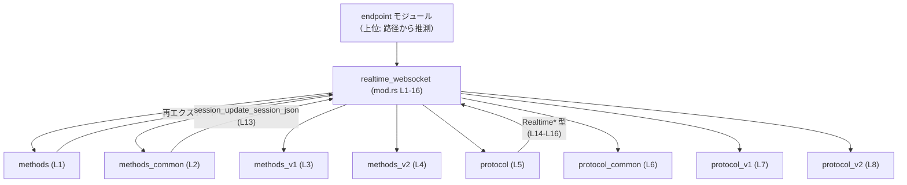
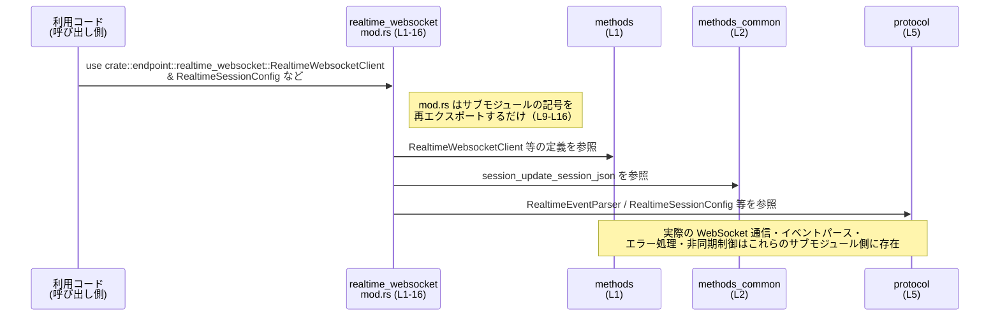

# codex-api/src/endpoint/realtime_websocket/mod.rs

## 0. ざっくり一言

`realtime_websocket` エンドポイント全体の **モジュール構成と公開 API をまとめる入口モジュール** です。  
内部の `methods*` / `protocol*` サブモジュールを束ね、外部から使うべき型・関数だけを再エクスポートしています。

---

## 1. このモジュールの役割

### 1.1 概要

- このモジュールは、リアルタイム WebSocket エンドポイントに対する **クライアント API とプロトコル定義** をまとめています。
- 内部では `methods` と `protocol` 系のサブモジュールに分割され、それぞれを統合する形で公開 API を提供しています（`mod` と `pub use` の構成より、入口となるファサードと解釈できます）。

### 1.2 アーキテクチャ内での位置づけ

`codex-api/src/endpoint/realtime_websocket/mod.rs` 自身は、`endpoint` 配下の 1 モジュールです（パスから判明）。  
内部ではバージョン別の実装を非公開サブモジュールに隠蔽し、共通インターフェースを再エクスポートしています。



> 注: `endpoint` など上位モジュールはファイルパスからの推定であり、このチャンクには定義が現れません。

### 1.3 設計上のポイント（コードから読み取れる範囲）

- **責務分割**
  - `methods*` 系: クライアント API / メソッド呼び出しまわり（名前から推測、定義は別ファイル）
  - `protocol*` 系: イベントパーサやセッション設定など、プロトコル記述（`RealtimeEventParser` 等の名前と再エクスポートから）
  - 共通処理とバージョン固有処理を `*_common` と `*_v1` / `*_v2` に分けています（L2–L4, L6–L8）。

- **バージョン管理方針**
  - `methods_v1`, `methods_v2`（L3–L4）および `protocol_v1`, `protocol_v2`（L7–L8）は非公開モジュールとして宣言されており、外部から直接は利用できません。
  - これにより、外部 API としてはバージョン差異を `methods` / `protocol` の内部に隠蔽している構造になっています。

- **公開範囲の制御**
  - `methods` と `protocol` は `pub(crate)`（L1, L5）なので、クレート内からはアクセス可能ですが、クレート外からはアクセス不可です。
  - 外部に露出させるのは `pub use` で再エクスポートした記号に限定されています（L9–L16）。

- **エラーハンドリング・並行性**
  - このファイルには関数・メソッド定義や `async` / スレッド関連の記述がなく、**具体的なエラー処理・並行性の扱いは読み取れません**。
  - これらは `methods` や `protocol` サブモジュール側に実装されていると推測されますが、このチャンクだけでは確認できません。

---

## 2. 主要な機能一覧

このファイル自身は「機能の実装」ではなく「公開 API の窓口」です。  
再エクスポートされている記号名から読み取れる範囲で整理すると、次のような役割になります（実装は各サブモジュール側）。

- `RealtimeWebsocketClient`（L9）: リアルタイム WebSocket エンドポイントへのクライアント本体（と推測される）
- `RealtimeWebsocketConnection`（L10）: WebSocket 接続を表すハンドル／型（と推測される）
- `RealtimeWebsocketEvents`（L11）: WebSocket で流れるイベントの表現（列挙体などである可能性）
- `RealtimeWebsocketWriter`（L12）: WebSocket 経由でメッセージを送信するための書き込み側（と推測される）
- `session_update_session_json`（L13）: セッション情報を JSON に更新するユーティリティ関数または類似の API（と推測される）
- `RealtimeEventParser`（L14）: 受信イベントをパースするコンポーネント
- `RealtimeSessionConfig`（L15）: WebSocket セッションの設定値を保持する型
- `RealtimeSessionMode`（L16）: セッションモード（例: push / pull など）を表現する型

> これらの詳細な型種別・メソッドは、このチャンクには定義がないため不明です。

---

## 3. 公開 API と詳細解説

### 3.0 コンポーネントインベントリー

#### 3.0.1 サブモジュール一覧

| モジュール名 | 公開範囲 | 役割 / 用途（名前からの推測） | 定義行（根拠） |
|--------------|----------|------------------------------|----------------|
| `methods` | `pub(crate)` | WebSocket クライアントのメソッド/API 群 | `mod.rs:L1` |
| `methods_common` | private | methods 系の共通処理 | `mod.rs:L2` |
| `methods_v1` | private | methods のバージョン 1 実装 | `mod.rs:L3` |
| `methods_v2` | private | methods のバージョン 2 実装 | `mod.rs:L4` |
| `protocol` | `pub(crate)` | プロトコル関連の公開インターフェースをまとめるモジュール | `mod.rs:L5` |
| `protocol_common` | private | プロトコル共通処理 | `mod.rs:L6` |
| `protocol_v1` | private | プロトコル v1 実装 | `mod.rs:L7` |
| `protocol_v2` | private | プロトコル v2 実装 | `mod.rs:L8` |

#### 3.0.2 再エクスポートされる記号一覧

| 名前 | 想定される種別 | 元モジュール | 公開範囲 | 定義行（根拠: pub use） |
|------|----------------|--------------|----------|--------------------------|
| `RealtimeWebsocketClient` | 不明（型名と推測） | `methods` | `pub` | `mod.rs:L9` |
| `RealtimeWebsocketConnection` | 不明（型名と推測） | `methods` | `pub` | `mod.rs:L10` |
| `RealtimeWebsocketEvents` | 不明（型名と推測） | `methods` | `pub` | `mod.rs:L11` |
| `RealtimeWebsocketWriter` | 不明（型名と推測） | `methods` | `pub` | `mod.rs:L12` |
| `session_update_session_json` | 不明（蛇腹ケースより関数の可能性大） | `methods_common` | `pub` | `mod.rs:L13` |
| `RealtimeEventParser` | 不明（型名と推測） | `protocol` | `pub` | `mod.rs:L14` |
| `RealtimeSessionConfig` | 不明（型名と推測） | `protocol` | `pub` | `mod.rs:L15` |
| `RealtimeSessionMode` | 不明（型名と推測） | `protocol` | `pub` | `mod.rs:L16` |

> 「不明」は、このファイルに型定義や関数シグネチャが現れないためです。Rust の慣例（CamelCase = 型、snake_case = 関数）から種別が推測できますが、断定はできません。

---

### 3.1 型一覧（構造体・列挙体など）

このチャンクからは「どの記号が構造体／列挙体か」が特定できません。  
そのため、ここでは「**外部から利用可能な型と思われる記号**」を列挙し、種別は不明として扱います。

| 名前 | 想定される種別 | 役割 / 用途（名前からの推測） | 根拠行 |
|------|----------------|------------------------------|--------|
| `RealtimeWebsocketClient` | 不明（型の可能性） | WebSocket クライアントのエントリポイント | `mod.rs:L9` |
| `RealtimeWebsocketConnection` | 不明（型の可能性） | WebSocket 接続のハンドル | `mod.rs:L10` |
| `RealtimeWebsocketEvents` | 不明（型の可能性） | 受信または送信するイベント集合 | `mod.rs:L11` |
| `RealtimeWebsocketWriter` | 不明（型の可能性） | WebSocket への送信インターフェース | `mod.rs:L12` |
| `RealtimeEventParser` | 不明（型の可能性） | 生データからイベント型へ変換するパーサ | `mod.rs:L14` |
| `RealtimeSessionConfig` | 不明（型の可能性） | セッション設定値 | `mod.rs:L15` |
| `RealtimeSessionMode` | 不明（型の可能性） | セッションモード（列挙体の可能性） | `mod.rs:L16` |

---

### 3.2 関数詳細

このファイルで外部に公開される可能性がある関数的な記号は `session_update_session_json` だけです（snake_case 名、`pub use` から）。

#### `session_update_session_json(...)`（詳細不明）

**概要**

- `methods_common` モジュールから再エクスポートされるユーティリティです（`mod.rs:L13`）。
- 名前からは「セッションの JSON 表現を更新する」処理が想定されますが、**シグネチャや具体的な処理内容はこのチャンクには存在しません**。

**引数 / 戻り値**

- このファイルには定義がないため、型・数・役割は不明です。

**内部処理の流れ（アルゴリズム）**

- 別ファイルに定義されており、このチャンクには現れません。

**Examples（使用例）**

- 具体的なシグネチャが不明なため、コンパイル可能な使用例を示すことはできません。
- 「同一クレート内でのインポート例」だけを示すと、次のようになります:

```rust
// 同一クレート内からの利用例（擬似コード; シグネチャ不明）
use crate::endpoint::realtime_websocket::session_update_session_json;

// 引数・戻り値の型は methods_common 側の定義を確認する必要があります。
```

**Errors / Panics・Edge cases・使用上の注意点**

- いずれも実装がこのファイルに存在しないため、判断できません。
- エラー処理・パニック条件・エッジケースは `methods_common` 側の定義を読む必要があります。

---

### 3.3 その他の関数

- このファイル内には、他に関数定義や `pub use` されている関数らしき記号は存在しません。

---

## 4. データフロー

このファイル単体には処理ロジックがなく、**実際のデータフローは外部モジュールに委譲**されています。  
ここでは、公開 API のラップ構造に限定した「利用者から見たデータフロー（概念図）」を示します。



> この図は「利用コードから見た記号解決の経路」を示すものであり、**実際のネットワーク I/O やメッセージの流れは、このチャンクだけでは特定できません**。

---

## 5. 使い方（How to Use）

### 5.1 基本的な使用方法

このモジュールの意図としては、外部コードはサブモジュールを直接触らず、`endpoint::realtime_websocket` から公開記号をインポートする形が想定されます（`pub use` によるファサード構造から）。

```rust
// 同一クレート内からの利用例
use crate::endpoint::realtime_websocket::{
    RealtimeWebsocketClient,
    RealtimeWebsocketConnection,
    RealtimeWebsocketEvents,
    RealtimeWebsocketWriter,
    RealtimeEventParser,
    RealtimeSessionConfig,
    RealtimeSessionMode,
    // session_update_session_json, // シグネチャ不明なため、ここでは未使用
};

// ここでは型を引数として受け取るだけのダミー関数を定義します。
// 実際のメソッドやコンストラクタ名は、このチャンクからは分かりません。
fn use_realtime_types(
    _client: RealtimeWebsocketClient,
    _conn: RealtimeWebsocketConnection,
    _events: RealtimeWebsocketEvents,
    _writer: RealtimeWebsocketWriter,
    _parser: RealtimeEventParser,
    _config: RealtimeSessionConfig,
    _mode: RealtimeSessionMode,
) {
    // 実際の利用方法は各型の定義側を参照する必要があります。
}
```

- 上記コードは、**「どの名前をどこからインポートすべきか」** を示す目的でのみ有効です。
- 具体的なインスタンス化・メソッド呼び出しは、`methods` / `protocol` 側の定義を参照する必要があります。

### 5.2 よくある使用パターン（推測ベースの概観）

このファイルだけから確定的な API パターンは得られませんが、構造から次のような利用スタイルが想定されます（推測であることに注意してください）:

1. `RealtimeSessionConfig` と `RealtimeSessionMode` を組み合わせてセッション設定を構築
2. `RealtimeWebsocketClient` / `RealtimeWebsocketConnection` を用いて WebSocket 接続を確立
3. `RealtimeEventParser` と `RealtimeWebsocketEvents` を用いて受信イベントを解釈
4. `RealtimeWebsocketWriter` と必要に応じて `session_update_session_json` でセッション情報を更新しながら送信

ただし、これらの手順・メソッド名は **このチャンクからは一切確定できません**。  
実際のコードを読む際は、各サブモジュール（`methods*.rs`, `protocol*.rs`）を確認する必要があります。

### 5.3 よくある間違い（予防的な観点）

コード構造から予防的に言える点は次のとおりです。

```rust
// 間違い例（クレート外から）: 内部バージョンモジュールへの直接アクセス
// use codex_api::endpoint::realtime_websocket::methods_v1; // コンパイル不可: methods_v1 は private（L3）

// 正しい例: mod.rs が再エクスポートしている記号のみを利用する
use crate::endpoint::realtime_websocket::{
    RealtimeWebsocketClient,
    RealtimeSessionConfig,
    RealtimeSessionMode,
};
```

- `methods_v1`, `methods_v2`, `protocol_v1`, `protocol_v2` は非公開なので、クレート外から直接利用する設計にはなっていません（L3, L4, L7, L8）。
- このため、**内部バージョンモジュールに依存するコードを書くことはできません**。バージョン差異は `Realtime*` 系の公開 API 経由で吸収されます。

### 5.4 使用上の注意点（まとめ）

- **公開 API 経由で利用すること**
  - 外部コードは `endpoint::realtime_websocket` が再エクスポートする記号のみを利用します（L9–L16）。
- **内部実装への直接依存を避けること**
  - 同一クレート内であれば `pub(crate)` な `methods` / `protocol` にアクセスできますが、バージョン別モジュール (`*_v1`, `*_v2`) は private です。
  - 内部実装への過度な依存は、将来のバージョン追加・変更時に影響を受けやすくなります。
- **エラー処理・並行性**
  - このファイル自体はロジックを持たないため、エラー処理や async/await, スレッド安全性などの詳細は各サブモジュール側で確認する必要があります。

---

## 6. 変更の仕方（How to Modify）

### 6.1 新しい機能を追加する場合

このモジュールの役割は「サブモジュールの公開窓口」です。新しい機能を追加する際の一般的な流れは次のとおりです。

1. **適切なサブモジュールを決める**
   - 新規クライアントメソッドであれば `methods` / `methods_common` / `methods_v*` 側に追加
   - 新規プロトコル要素（イベント種別など）であれば `protocol` / `protocol_common` / `protocol_v*` 側に追加

2. **サブモジュールで記号を定義**
   - 構造体・列挙体・関数などを定義し、必要に応じて `pub` で公開する  
     （この作業は別ファイルで行い、このチャンクからは見えません）。

3. **必要なら mod.rs から再エクスポート**
   - 外部（クレート外）にも公開したい場合、この `mod.rs` に `pub use` を追加します。
   - 例（概念）:

   ```rust
   // 新しい型 NewFeature を protocol モジュールから公開する例
   pub use protocol::NewFeature;
   ```

4. **クレート内外からの利用パターンを確認**
   - `pub(crate)` に留めるか `pub use` するかは、「外部 API に含めるかどうか」で判断します。

### 6.2 既存の機能を変更する場合

- **影響範囲の確認**
  - `RealtimeWebsocketClient` など再エクスポートされている記号は、クレート外の利用コードからも参照されている可能性があります（L9–L16）。
  - そのため、シグネチャや意味を変更する場合は、外部との「契約」が壊れないか慎重に確認する必要があります。

- **バージョン別モジュールとの関係**
  - `methods_v1` / `methods_v2`, `protocol_v1` / `protocol_v2` はバージョン差異を吸収するための構造と推測されます。
  - 既存の公開 API の意味を変えるよりも、新しいバージョンモジュールを追加して `protocol` / `methods` 側のディスパッチを変える、というアプローチが取りやすいと考えられますが、これは命名規則からの推測であり、このチャンクからは設計方針を断定できません。

- **テスト・利用箇所の再確認**
  - 再エクスポートされた記号は、`endpoint::realtime_websocket` をインポートしている全ての箇所から参照されます。
  - 変更時は、検索（`rg`, `grep` など）で利用箇所を洗い出し、挙動が変わっていないか確認することが重要です。

---

## 7. 関連ファイル

この `mod.rs` から参照されるサブモジュールは次のとおりです。実際のパスはプロジェクト構造に依存しますが、Rust の慣例から `mod.rs` と同じディレクトリ内に `methods.rs` や `protocol_v1.rs` 等のファイルが存在すると考えられます（実際のファイル名・構成はこのチャンクからは確定できません）。

| パス（推定） | 役割 / 関係 |
|--------------|------------|
| `codex-api/src/endpoint/realtime_websocket/methods.rs` | `RealtimeWebsocketClient` などクライアント API を定義（`mod.rs:L1, L9-L12` により参照） |
| `codex-api/src/endpoint/realtime_websocket/methods_common.rs` | 共通ロジックと `session_update_session_json` の定義（`mod.rs:L2, L13` により参照） |
| `codex-api/src/endpoint/realtime_websocket/methods_v1.rs` | methods の v1 実装（`mod.rs:L3`） |
| `codex-api/src/endpoint/realtime_websocket/methods_v2.rs` | methods の v2 実装（`mod.rs:L4`） |
| `codex-api/src/endpoint/realtime_websocket/protocol.rs` | `RealtimeEventParser` / `RealtimeSessionConfig` / `RealtimeSessionMode` 等の公開プロトコル要素（`mod.rs:L5, L14-L16`） |
| `codex-api/src/endpoint/realtime_websocket/protocol_common.rs` | プロトコル共通処理（`mod.rs:L6`） |
| `codex-api/src/endpoint/realtime_websocket/protocol_v1.rs` | プロトコル v1 実装（`mod.rs:L7`） |
| `codex-api/src/endpoint/realtime_websocket/protocol_v2.rs` | プロトコル v2 実装（`mod.rs:L8`） |

> これらのファイルの中身はこのチャンクには含まれていないため、型・関数の詳しい挙動、エラー処理、並行性、安全性などの詳細は、それぞれのファイルを直接確認する必要があります。
