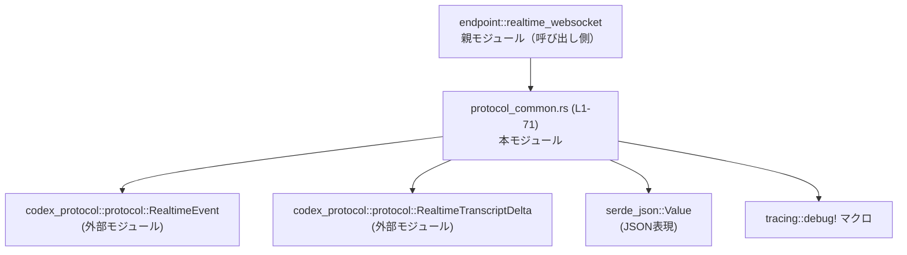
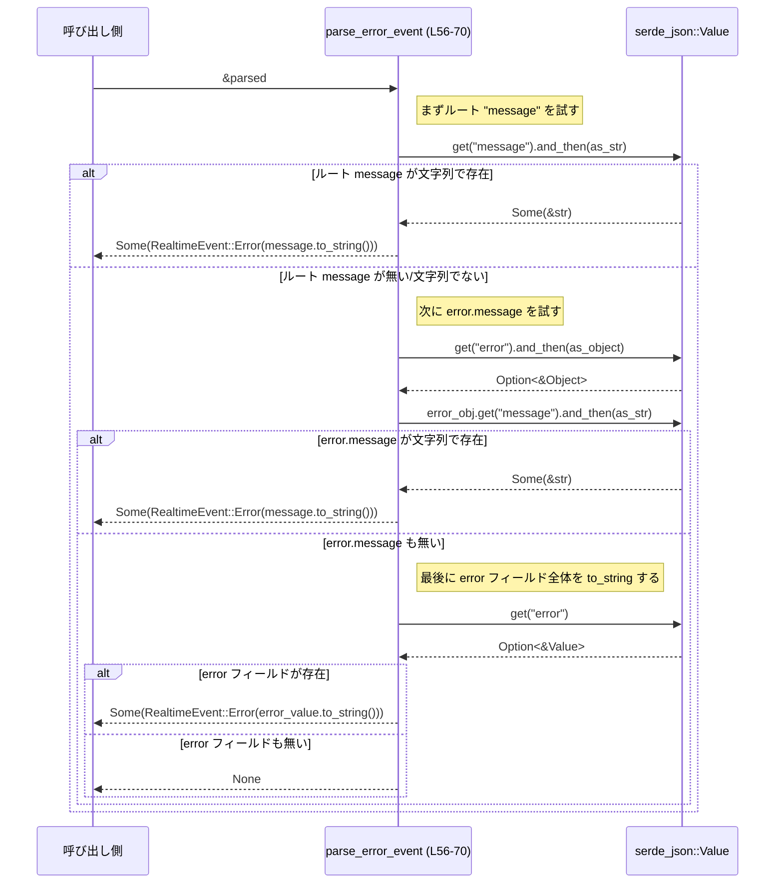

# codex-api/src/endpoint/realtime_websocket/protocol_common.rs コード解説

## 0. ざっくり一言

- Realtime WebSocket で受信した JSON テキストペイロードを `serde_json::Value` にパースし、セッション更新・トランスクリプト差分・エラーを表す `RealtimeEvent` / `RealtimeTranscriptDelta` に変換する内部ヘルパ関数群です（`RealtimeEvent`, `RealtimeTranscriptDelta` のインポートと関数定義より判断できます。`protocol_common.rs:L1-4, L6-70`）。

---

## 1. このモジュールの役割

### 1.1 概要

- このモジュールは **Realtime WebSocket プロトコルの JSON メッセージ** を扱うために存在し、次の機能を提供します（`protocol_common.rs:L1-4, L6-70`）。
  - テキストペイロードを JSON (`serde_json::Value`) にパースし、メッセージ種別文字列を取り出す。
  - 「セッション更新」イベントの JSON から `RealtimeEvent::SessionUpdated` を組み立てる。
  - 「トランスクリプト差分」文字列を `RealtimeTranscriptDelta` に変換する。
  - エラー情報を JSON から抽出し、`RealtimeEvent::Error` を組み立てる。

### 1.2 アーキテクチャ内での位置づけ

- 依存関係（このファイルから見える範囲）:
  - 外部モジュール:
    - `codex_protocol::protocol::RealtimeEvent`（Realtime のイベント型）（`protocol_common.rs:L1, L26, L39, L56, L70`）
    - `codex_protocol::protocol::RealtimeTranscriptDelta`（トランスクリプト差分型）（`protocol_common.rs:L2, L45, L53`）
  - サードパーティ:
    - `serde_json::Value`（JSON 値表現）（`protocol_common.rs:L3, L6-7, L15, L26-38, L45-53, L56-69`）
    - `tracing::debug` マクロ（デバッグログ出力）（`protocol_common.rs:L4, L10, L18`）

- 関数はすべて `pub(super)` で定義されており、**親モジュール `endpoint::realtime_websocket` からのみ呼び出し可能**です（Rust の可視性仕様に基づく。`protocol_common.rs:L6, L26, L45, L56`）。



### 1.3 設計上のポイント

- **ステートレスなヘルパ関数群**  
  - グローバル状態や構造体フィールドを持たず、すべて引数から結果を計算する関数として定義されています（`protocol_common.rs:L6-70`）。
- **エラー処理は `Option` で表現**  
  - すべての関数が `Option<...>` を返し、パース失敗・必須フィールド欠如などのケースを `None` で表現します（`protocol_common.rs:L6, L26, L45, L56`）。
- **致命的エラーでのパニック回避**  
  - `serde_json::from_str` のエラーは `debug!` にログし、`None` を返すだけで `panic!` を発生させません（`protocol_common.rs:L7-13`）。
- **ログによる観測性**  
  - JSON パース失敗や `type` 欠如時に `debug!` ログを出力し、問題のあるペイロードをトレースできるようにしています（`protocol_common.rs:L10, L18`）。
- **JSON アクセスは安全なチェーン (`get` + `and_then`)**  
  - `Value::get` / `Value::as_object` / `Value::as_str` を `and_then` でつなぎ、型が違う・キーがない場合にもパニックせずに `None` になります（`protocol_common.rs:L27-38, L49-53, L58-67`）。
- **並行性**  
  - 共有可変状態を持たず、引数も `&str` と `&Value` の参照のみのため、関数自体は複数スレッドから同時に呼び出してもデータ競合を起こさない構造です（`protocol_common.rs:L6-7, L26, L45-48, L56-57`）。

---

## 2. 主要な機能一覧（コンポーネントインベントリー）

このチャンクに現れる関数の一覧です。

| 名前 | 種別 | シグネチャ（抜粋） | 戻り値 | 定義位置 | 役割（1 行） |
|------|------|---------------------|--------|----------|--------------|
| `parse_realtime_payload` | 関数 | `fn parse_realtime_payload(payload: &str, parser_name: &str)` | `Option<(Value, String)>` | `protocol_common.rs:L6-24` | JSON 文字列を `Value` にパースし、`type` フィールドの文字列を取り出す |
| `parse_session_updated_event` | 関数 | `fn parse_session_updated_event(parsed: &Value)` | `Option<RealtimeEvent>` | `protocol_common.rs:L26-43` | `session.id` / `session.instructions` から `RealtimeEvent::SessionUpdated` を構築する |
| `parse_transcript_delta_event` | 関数 | `fn parse_transcript_delta_event(parsed: &Value, field: &str)` | `Option<RealtimeTranscriptDelta>` | `protocol_common.rs:L45-54` | 指定フィールドの文字列を `RealtimeTranscriptDelta` に変換する |
| `parse_error_event` | 関数 | `fn parse_error_event(parsed: &Value)` | `Option<RealtimeEvent>` | `protocol_common.rs:L56-70` | 複数の候補からエラーメッセージを取り出し `RealtimeEvent::Error` に変換する |

このファイル内で新たな構造体・列挙体等は定義されていません（`protocol_common.rs:L1-71`）。

---

## 3. 公開 API と詳細解説

### 3.1 型一覧（このファイルで使用される主要型）

このファイルで**利用**されている型（定義は他モジュール）をまとめます。

| 名前 | 種別 | 定義場所（モジュール） | このファイル内での役割 | 根拠 |
|------|------|------------------------|------------------------|------|
| `RealtimeEvent` | 列挙体と推測される（詳細不明） | `codex_protocol::protocol` | Realtime セッション更新やエラーなど、論理イベントを表す。`SessionUpdated` と `Error` バリアントが使われていることのみ分かります。 | インポートと利用より（`protocol_common.rs:L1, L26, L39-42, L56, L70`）。このチャンクには定義本体は現れません。 |
| `RealtimeTranscriptDelta` | 構造体または類似の型と推測 | `codex_protocol::protocol` | トランスクリプトの差分テキストを表す。`delta` フィールドを持つことがコードから読み取れます。 | インポートと構築式 `RealtimeTranscriptDelta { delta }` より（`protocol_common.rs:L2, L45-53`）。定義本体はこのチャンクには現れません。 |
| `serde_json::Value` | 構造体 | `serde_json` クレート | JSON ツリーを表す汎用型で、すべてのパーサ関数の入力/中間表現として用いられます。 | インポートと各種 `.get` / `.as_str` 利用より（`protocol_common.rs:L3, L6-7, L15-21, L26-38, L45-53, L56-69`）。 |

※ 型の詳細（フィールド一覧など）は、このチャンクには定義がないため不明です。

---

### 3.2 関数詳細

#### `parse_realtime_payload(payload: &str, parser_name: &str) -> Option<(Value, String)>`

**概要**

- 文字列の JSON ペイロードを `serde_json::Value` にパースし、`type` フィールドの文字列値を抽出して返します（`protocol_common.rs:L6-23`）。
- パースに失敗した場合や `type` フィールドが存在しない場合は `debug!` ログを出力し、`None` を返します（`protocol_common.rs:L7-13, L15-20`）。

**引数**

| 引数名 | 型 | 説明 |
|--------|----|------|
| `payload` | `&str` | WebSocket などで受信した JSON テキストペイロード（`protocol_common.rs:L6-7`）。 |
| `parser_name` | `&str` | ログメッセージに含めるパーサ名。どの文脈で失敗したかを識別するために使われます（`protocol_common.rs:L6, L10, L18`）。 |

**戻り値**

- `Some((parsed, message_type))`:
  - `parsed`: `serde_json::Value` としての JSON オブジェクト全体（`protocol_common.rs:L7-13`）。
  - `message_type`: JSON の `"type"` フィールドから取得した文字列の所有型 `String`（`protocol_common.rs:L15-21`）。
- `None`: JSON パースに失敗、または `"type"` フィールドが存在しない／文字列でない場合（`protocol_common.rs:L7-13, L15-21`）。

**内部処理の流れ**

1. `serde_json::from_str(payload)` で JSON パースを試み、`Result<Value, _>` を得る（`protocol_common.rs:L7`）。
2. 成功 (`Ok(message)`) の場合は `parsed` に束縛し、失敗 (`Err(err)`) の場合は `debug!` でエラーとペイロードをログし、`None` を返して終了（`protocol_common.rs:L8-13`）。
3. `parsed.get("type").and_then(Value::as_str)` で `"type"` フィールドを取得し、かつ文字列型に変換を試みる（`protocol_common.rs:L15`）。
4. `Some(message_type)` の場合は `to_string()` で所有権を持つ `String` に変換（`protocol_common.rs:L16`）。
5. `"type"` が存在しない・文字列でない場合は `debug!` ログを出力して `None` を返す（`protocol_common.rs:L17-20`）。
6. 最後に `Some((parsed, message_type))` を返却（`protocol_common.rs:L23`）。

**Examples（使用例）**

以下は使用例であり、このコードがリポジトリ内に存在するとは限りませんが、関数シグネチャと挙動に基づく典型的な利用方法です。

```rust
use serde_json::Value;
use codex_protocol::protocol::RealtimeEvent;
use crate::endpoint::realtime_websocket::protocol_common::parse_realtime_payload;

// WebSocket などから受信したテキストメッセージ
let payload = r#"{
    "type": "session.updated",              // イベント種別
    "session": { "id": "sess_123" }
}"#;

if let Some((parsed, message_type)) =
    parse_realtime_payload(payload, "realtime_ws")  // パーサ名を指定
{
    // message_type == "session.updated"
    assert_eq!(message_type, "session.updated");    // type フィールドの値

    // parsed は JSON 全体
    assert_eq!(parsed["session"]["id"], "sess_123"); // serde_json::Value としてアクセス
} else {
    // JSON でない、または type フィールドが無いケース
    // ログには debug! で詳細が出力されている
}
```

**Errors / Panics**

- パニック条件:
  - この関数内に `panic!` やインデックスアクセス（`[index]`）は無く、`serde_json::from_str` も失敗時に `Err` を返すだけなので、通常の利用ではパニックしません（`protocol_common.rs:L7-13, L15-21`）。
- エラー表現:
  - パースエラー、`type` 欠如はいずれも `None` で表現されます。
  - 同時に `tracing::debug!` でログが出力されます（`protocol_common.rs:L10, L18`）。

**Edge cases（エッジケース）**

- `payload` が空文字列や不正な JSON:
  - `serde_json::from_str` が `Err` を返し、`debug!` ログ後 `None` を返します（`protocol_common.rs:L7-13`）。
- `payload` が JSON だが `"type"` フィールドがない場合:
  - `"received {parser_name} event without type field"` のログを出力し `None` を返します（`protocol_common.rs:L15-20`）。
- `"type"` フィールドが数値やオブジェクトなど、文字列以外の場合:
  - `Value::as_str` が `None` を返すため、上記と同様にログを出し `None` を返します（`protocol_common.rs:L15-20`）。
- `"type"` フィールドが存在し、文字列だが空文字列:
  - `to_string()` により空の `String` が返り、`Some((parsed, "".to_string()))` になります。空であることは特に検証していません（`protocol_common.rs:L15-16, L23`）。

**使用上の注意点**

- 戻り値が `Option` であるため、呼び出し側で `None` を必ず考慮する必要があります。
- ログに**生の `payload` が含まれる**ため、ペイロードに機密情報が含まれる設計の場合はログレベルやマスキングの検討が必要になります（`protocol_common.rs:L10, L18`）。
- `message_type` は単なる文字列であり、ここでは正当なイベント種別かどうかは検証されません。必要であれば呼び出し側でバリデーションを行う前提になります。

---

#### `parse_session_updated_event(parsed: &Value) -> Option<RealtimeEvent>`

**概要**

- JSON オブジェクト `parsed` から `session.id` を必須、`session.instructions` を任意として取り出し、`RealtimeEvent::SessionUpdated` を構築します（`protocol_common.rs:L26-42`）。
- 必須の `session.id` が取得できない場合は `None` を返します（`protocol_common.rs:L27-33`）。

**引数**

| 引数名 | 型 | 説明 |
|--------|----|------|
| `parsed` | `&Value` | セッション更新イベントを表す JSON オブジェクト。少なくとも `"session"` -> `"id"` フィールドを含むことが期待されています（`protocol_common.rs:L26-33`）。 |

**戻り値**

- `Some(RealtimeEvent::SessionUpdated { session_id, instructions })`:
  - `session_id`: `"session"` オブジェクト内の `"id"` フィールドの文字列値（`protocol_common.rs:L27-32, L39-41`）。
  - `instructions`: `"session"` オブジェクト内の `"instructions"` フィールドの文字列値（存在しない場合は `None`）（`protocol_common.rs:L33-38, L40-41`）。
- `None`: `session.id` が存在しない、オブジェクトでない、または文字列でない場合（`protocol_common.rs:L27-32`）。

**内部処理の流れ**

1. `parsed.get("session")` で `"session"` フィールドを取り出す（`protocol_common.rs:L27-28`）。
2. `Value::as_object` でオブジェクトであることを確認し、オブジェクト参照を得る（`protocol_common.rs:L29`）。
3. そのオブジェクトから `.get("id")` → `Value::as_str` → `map(str::to_string)` と繋ぎ、文字列としての `session_id` を取り出す（`protocol_common.rs:L30-32`）。
4. ここに `?` 演算子が付いているため、どこかで `None` が出た場合は関数全体が `None` を返して終了する（`protocol_common.rs:L27-32`）。
5. 次に同様の手順で `"session.instructions"` を取り出し、今度は `?` ではなく `Option<String>` として `instructions` 変数に格納する（`protocol_common.rs:L33-38`）。
6. `RealtimeEvent::SessionUpdated { session_id, instructions }` を `Some(...)` で返却（`protocol_common.rs:L39-42`）。

**Examples（使用例）**

```rust
use serde_json::Value;
use codex_protocol::protocol::RealtimeEvent;
use crate::endpoint::realtime_websocket::protocol_common::parse_session_updated_event;

let parsed: Value = serde_json::json!({
    "type": "session.updated",
    "session": {
        "id": "sess_123",
        "instructions": "Please summarize the call."
    }
});

if let Some(RealtimeEvent::SessionUpdated { session_id, instructions }) =
    parse_session_updated_event(&parsed)
{
    assert_eq!(session_id, "sess_123");                       // 必須フィールド
    assert_eq!(instructions.as_deref(), Some("Please summarize the call."));
} else {
    // id が欠けている / 文字列でないなどの異常 JSON
}
```

**Errors / Panics**

- パニック:
  - インデックスアクセスや `unwrap` 相当のコードはなく、すべて `Option` チェーンと `?` で処理されているため、通常の JSON に対してパニックするパスはありません（`protocol_common.rs:L27-38`）。
- エラー表現:
  - 必須項目である `session.id` が取得できない場合は `None` を返すのみで、ログなどは出力しません（`protocol_common.rs:L27-32`）。

**Edge cases（エッジケース）**

- `"session"` フィールドが存在しない / `null` / オブジェクト以外:
  - `Value::as_object` が `None` を返し、結果として `session_id` の `?` が発火して `None` が返ります（`protocol_common.rs:L27-32`）。
- `"session.id"` が存在しない、または文字列以外:
  - 同様に `Value::as_str` が `None` となり、`None` を返します（`protocol_common.rs:L27-32`）。
- `"session.instructions"` が存在しない:
  - `instructions` には `None` が入り、`SessionUpdated { session_id, instructions: None }` が返ります（`protocol_common.rs:L33-38, L39-42`）。
- `"session.instructions"` が文字列以外:
  - `Value::as_str` が `None` となり、やはり `instructions` は `None` になります（`protocol_common.rs:L35-38`）。

**使用上の注意点**

- `session.id` は必須ですが、エラーは `None` でしか表現されずログも出ないため、呼び出し側で `None` を検知し、必要ならログやメトリクスを追加する設計が想定されます。
- `instructions` は任意フィールドとして扱われているため、`None` を許容する前提で後続処理を設計する必要があります。

---

#### `parse_transcript_delta_event(parsed: &Value, field: &str) -> Option<RealtimeTranscriptDelta>`

**概要**

- 指定したフィールド名 `field` の値を文字列として取得し、それを `RealtimeTranscriptDelta { delta }` にラップして返します（`protocol_common.rs:L45-53`）。
- フィールドが存在しない、または文字列でない場合は `None` を返します。

**引数**

| 引数名 | 型 | 説明 |
|--------|----|------|
| `parsed` | `&Value` | トランスクリプト差分などを含む JSON オブジェクト（`protocol_common.rs:L45-49`）。 |
| `field` | `&str` | 差分テキストが格納されている JSON フィールド名（`protocol_common.rs:L45-48, L49-51`）。 |

**戻り値**

- `Some(RealtimeTranscriptDelta { delta })`:
  - `delta`: `parsed[field]` の文字列値をコピーした `String`（`protocol_common.rs:L49-53`）。
- `None`:
  - フィールドが存在しない、または文字列以外の場合。

**内部処理の流れ**

1. `parsed.get(field)` で指定フィールドを取得する（`protocol_common.rs:L49-50`）。
2. `and_then(Value::as_str)` で文字列型であることを確認し、`&str` を得る（`protocol_common.rs:L51`）。
3. `map(str::to_string)` で `String` に変換する（`protocol_common.rs:L52`）。
4. さらに `map(|delta| RealtimeTranscriptDelta { delta })` で構造体に包む。どこかで `None` が発生した場合はそのまま `None` を返す（`protocol_common.rs:L53`）。

**Examples（使用例）**

```rust
use serde_json::Value;
use codex_protocol::protocol::RealtimeTranscriptDelta;
use crate::endpoint::realtime_websocket::protocol_common::parse_transcript_delta_event;

let parsed: Value = serde_json::json!({
    "type": "transcript.delta",
    "delta": "追加された文字列"
});

if let Some(RealtimeTranscriptDelta { delta }) =
    parse_transcript_delta_event(&parsed, "delta")
{
    assert_eq!(delta, "追加された文字列");
} else {
    // "delta" が無い・文字列でない場合
}
```

**Errors / Panics**

- パニックするコードは含まれていません。`get` と `as_str` の組み合わせにより、存在しないフィールドや型不一致も `None` で安全に表現されます（`protocol_common.rs:L49-53`）。

**Edge cases（エッジケース）**

- `field` が存在しない:
  - `get(field)` が `None` を返し、最終的に関数も `None` を返します（`protocol_common.rs:L49-53`）。
- `field` が数値・オブジェクトなど文字列以外:
  - `Value::as_str` が `None` を返し、`None` になります（`protocol_common.rs:L51-53`）。
- `field` が空文字列 `""`:
  - 有効なフィールド名として扱われますが、これは呼び出し側の契約に依存します。この関数は検証しません。

**使用上の注意点**

- フィールド名は自由に指定できるため、呼び出し側で正しいフィールド名を渡す契約が必要です。
- 差分内容が大きい文字列の場合でも、そのまま `String` としてコピーされます。大きなデータの場合のメモリ利用を考慮する必要があります。

---

#### `parse_error_event(parsed: &Value) -> Option<RealtimeEvent>`

**概要**

- エラーイベントを表す JSON から、エラーメッセージ文字列を抽出し `RealtimeEvent::Error` として返します（`protocol_common.rs:L56-70`）。
- メッセージ取得には以下の順序でフォールバックします（`protocol_common.rs:L57-69`）。
  1. ルートの `"message"` フィールド（文字列）
  2. `"error"` オブジェクト内の `"message"` フィールド（文字列）
  3. `"error"` フィールド全体を `to_string()` した文字列

**引数**

| 引数名 | 型 | 説明 |
|--------|----|------|
| `parsed` | `&Value` | エラー情報を含む JSON オブジェクト（`protocol_common.rs:L56-69`）。 |

**戻り値**

- `Some(RealtimeEvent::Error(message))`:
  - `message`: 上記の優先順位で見つかったエラーメッセージ文字列（`protocol_common.rs:L57-70`）。
- `None`:
  - 上記 3 パターンのいずれでもメッセージを取得できない場合。

**内部処理の流れ**

1. `parsed.get("message").and_then(Value::as_str)` でルート `"message"` フィールドの文字列を試みる（`protocol_common.rs:L57-60`）。
2. それが `None` の場合、
   - `parsed.get("error").and_then(Value::as_object)` で `"error"` フィールドをオブジェクトとして取得し（`protocol_common.rs:L61-64`）、
   - その中の `"message"` を文字列として試みる（`protocol_common.rs:L65-67`）。
3. それでも `None` の場合、
   - `parsed.get("error").map(ToString::to_string)` で `"error"` フィールド全体を `String` に変換する（`protocol_common.rs:L69`）。
4. 最終的にどこかで `Some(message)` が得られれば、それを `RealtimeEvent::Error` に包んで返す（`protocol_common.rs:L70`）。

**Examples（使用例）**

```rust
use serde_json::Value;
use codex_protocol::protocol::RealtimeEvent;
use crate::endpoint::realtime_websocket::protocol_common::parse_error_event;

// 1. ルート "message" を使うケース
let parsed1: Value = serde_json::json!({
    "type": "error",
    "message": "Invalid request"
});

if let Some(RealtimeEvent::Error(msg)) = parse_error_event(&parsed1) {
    assert_eq!(msg, "Invalid request");
}

// 2. error.message を使うケース
let parsed2: Value = serde_json::json!({
    "type": "error",
    "error": { "code": 400, "message": "Bad Request" }
});

if let Some(RealtimeEvent::Error(msg)) = parse_error_event(&parsed2) {
    assert_eq!(msg, "Bad Request");
}

// 3. error フィールド全体を to_string するケース
let parsed3: Value = serde_json::json!({
    "type": "error",
    "error": { "code": 400, "detail": "Missing field x" }
});

if let Some(RealtimeEvent::Error(msg)) = parse_error_event(&parsed3) {
    // msg は JSON オブジェクトを文字列化したものになる（例: {"code":400,"detail":"Missing field x"}）
    assert!(msg.contains("code"));
}
```

**Errors / Panics**

- パニック:
  - すべてのアクセスは `get` + `as_*` または `get` + `map` で行われており、存在しないキーや型不一致でパニックする経路はありません（`protocol_common.rs:L57-69`）。
- エラー表現:
  - メッセージを取得できない場合でも、ログは出力されず、単に `None` を返します（`protocol_common.rs:L57-70`）。

**Edge cases（エッジケース）**

- `"message"` も `"error"` も存在しない:
  - すべての `.get` が `None` を返し、最終的に `None` が返却されます（`protocol_common.rs:L57-69`）。
- `"message"` が数値など文字列以外:
  - `Value::as_str` が `None` となり、フォールバックとして `"error.message"` → `"error"` を試みます（`protocol_common.rs:L58-67`）。
- `"error"` が文字列:
  - `"message"` も `"error.message"` も無いが `"error"` が存在し、`ToString::to_string` によりその文字列値が使われます（`protocol_common.rs:L69`）。
- `"error"` がオブジェクト:
  - `"error.message"` が無ければオブジェクト全体が JSON 文字列として `message` になります（`protocol_common.rs:L63-67, L69`）。

**使用上の注意点**

- エラー情報がどの形式で届くか（`message` か `error.message` か `error` か）が一定でない場合にも対応するためのフォールバックロジックになっていますが、**「どの形式を優先するか」** が暗黙の契約になっている点に注意が必要です。
- `error` フィールド全体を `to_string()` した結果をユーザーにそのまま表示する場合、余計な情報や機密情報を含む可能性があります。利用箇所でのフィルタリングが必要になる場合があります（`protocol_common.rs:L69-70`）。

---

### 3.3 その他の関数

- このファイルには上記 4 つ以外の関数は定義されていません（`protocol_common.rs:L1-71`）。

---

## 4. データフロー

ここでは、このファイル内で最も分岐が多い `parse_error_event` の内部データフローを例に説明します。

- 入力: `&Value` としての JSON オブジェクト `parsed`（`protocol_common.rs:L56-57`）。
- 出力: `Option<RealtimeEvent::Error(String)>`（`protocol_common.rs:L56, L70`）。
- 処理の要点:
  - 3 段階でエラーメッセージ候補を探索し、最初に見つかったものを採用します（`protocol_common.rs:L57-69`）。



この図は、`parse_error_event` 関数がどのように `serde_json::Value` から文字列メッセージを探し、最終的に `RealtimeEvent::Error` を返すかを示しています（`protocol_common.rs:L56-70`）。

---

## 5. 使い方（How to Use）

### 5.1 基本的な使用方法

以下は、受信した WebSocket メッセージを処理する際に、このモジュールの関数を組み合わせる典型的な例です（あくまで使用例であり、このままのコードがリポジトリ内に存在することは、このチャンクからは分かりません）。

```rust
use serde_json::Value;
use codex_protocol::protocol::{RealtimeEvent, RealtimeTranscriptDelta};
use crate::endpoint::realtime_websocket::protocol_common::{
    parse_realtime_payload,
    parse_session_updated_event,
    parse_transcript_delta_event,
    parse_error_event,
};

fn handle_realtime_message(payload: &str) {
    // 1. テキストペイロードを JSON + type に変換する
    let Some((parsed, message_type)) =
        parse_realtime_payload(payload, "realtime_ws") // エラー時は None + debug! ログ
    else {
        return; // パースできなければ何もしない
    };

    match message_type.as_str() {
        "session.updated" => {
            if let Some(event) = parse_session_updated_event(&parsed) {
                // event は RealtimeEvent::SessionUpdated { .. } のはず
                handle_session_event(event);
            }
        }
        "transcript.delta" => {
            if let Some(delta) = parse_transcript_delta_event(&parsed, "delta") {
                handle_transcript_delta(delta);
            }
        }
        "error" => {
            if let Some(error_event) = parse_error_event(&parsed) {
                handle_error_event(error_event);
            }
        }
        _ => {
            // 未知の type は無視するなどの方針を取る
        }
    }
}

// 以下はダミーのハンドラ例
fn handle_session_event(_event: RealtimeEvent) {}
fn handle_transcript_delta(_delta: RealtimeTranscriptDelta) {}
fn handle_error_event(_event: RealtimeEvent) {}
```

### 5.2 よくある使用パターン

- **型ベースで分岐する前処理として使う**  
  - `parse_realtime_payload` で `message_type` を取得し、それに応じて各種 `parse_*_event` を呼び分ける（例上記）。
- **同じ JSON から複数フィールドを取り出す**  
  - 一度 `parse_realtime_payload` で `Value` を得ておけば、それを `parse_session_updated_event` や `parse_error_event` に再利用できます。
- **フィールド名をパラメータ化したトランスクリプト処理**  
  - `parse_transcript_delta_event` の `field` を `"delta"` や `"transcript_delta"` など、API の仕様に合わせて切り替えることができます（`protocol_common.rs:L45-53`）。

### 5.3 よくある間違い

```rust
// 間違い例: None の可能性を考慮していない
fn bad_handle(payload: &str) {
    // parse_realtime_payload の戻り値をそのまま unwrap している
    let (parsed, message_type) =
        parse_realtime_payload(payload, "realtime_ws").unwrap(); // パース失敗時にパニックする

    // ... 以下略
}

// 正しい例: Option を安全に扱う
fn good_handle(payload: &str) {
    if let Some((parsed, message_type)) =
        parse_realtime_payload(payload, "realtime_ws")
    {
        // ここでは JSON が正しくパースされ、type も存在することが保証されている
        // ...
    } else {
        // パース失敗・type 欠如時の処理をここで行う
    }
}
```

- `parse_session_updated_event` / `parse_transcript_delta_event` / `parse_error_event` も同様に `Option` を返すため、`unwrap()` ではなく `if let` / `match` などで `None` を考慮する必要があります（`protocol_common.rs:L26, L45, L56`）。

### 5.4 使用上の注意点（まとめ）

- **Option ベースの契約**  
  - すべての関数が `Option` を返すため、「入力 JSON が期待通りでないときは `None`」という契約になっています。呼び出し側で `None` の扱いを明確に決めることが重要です。
- **ログの扱い**  
  - `parse_realtime_payload` は生のペイロードを `debug!` ログに出力します。ペイロードに機密情報が含まれる可能性がある場合、ログレベルやログ先、マスキングの運用設計が必要です（`protocol_common.rs:L10, L18`）。
- **スレッドセーフ性**  
  - 関数はいずれもステートレスで引数も共有参照のみであり、内部でグローバル状態の変更や I/O を行っていないため、複数スレッドから安全に呼び出せる構造になっています（`protocol_common.rs:L6-70`）。
- **パフォーマンス面**  
  - JSON パース (`serde_json::from_str`) 自体はコストのある処理です。頻繁に呼び出される場合は、同じペイロードに対して何度もパースを行わないように注意する必要があります（`protocol_common.rs:L7-13`）。

---

## 6. 変更の仕方（How to Modify）

### 6.1 新しい機能を追加する場合

例: 新しいイベント種別 `"session.deleted"` を `RealtimeEvent` に対応させたい場合。

1. **`codex_protocol::protocol::RealtimeEvent` の定義を確認**  
   - `SessionDeleted` など、新しいバリアントを追加する必要があるかどうかを確認します。  
     （このチャンクには定義がないため、実際の場所は `codex_protocol::protocol` モジュールを参照する必要があります。`protocol_common.rs:L1`）
2. **本ファイルに新しいパーサ関数を追加**  
   - 既存の `parse_session_updated_event` に倣い、`fn parse_session_deleted_event(parsed: &Value) -> Option<RealtimeEvent>` のような関数を追加するのが自然です。
   - JSON から必要なフィールドを `get` / `as_*` チェーンで取得し、`RealtimeEvent::SessionDeleted { ... }` を返す形にします。
3. **親モジュールでの分岐を追加**  
   - `message_type` に `"session.deleted"` が来たときに、この新しい関数を呼び出すロジックを親モジュール側に追加します（親モジュールのコードはこのチャンクには現れませんが、`pub(super)` からそこに書かれていると推測できます）。

### 6.2 既存の機能を変更する場合

- **影響範囲の確認**
  - どの関数も `pub(super)` のため、少なくとも親モジュール `endpoint::realtime_websocket` から呼び出されている可能性があります（`protocol_common.rs:L6, L26, L45, L56`）。
  - IDE や検索で `parse_realtime_payload` などの呼び出し箇所を特定する必要があります（このチャンクからは呼び出し側は分かりません）。
- **契約（前提条件・戻り値）の維持**
  - たとえば `parse_session_updated_event` が `None` を返していたケースで、急に `RealtimeEvent::Error` を返すように変更すると、呼び出し側のロジックと食い違う可能性があります。
  - 戻り値の型（特に `Option`／`Some`／`None` の意味）は明示的な契約として扱うのが安全です。
- **エッジケースの再確認**
  - JSON スキーマが変わる場合（例: `session.id` が数値になるなど）は、`Value::as_str` 部分を変更するとともに、古いフォーマットをどう扱うか（後方互換性）を決める必要があります（`protocol_common.rs:L27-32`）。
- **ログ出力の変更**
  - `parse_realtime_payload` のログメッセージフォーマットを変える場合、ログ解析や監視のルールに影響する可能性があります（`protocol_common.rs:L10, L18`）。

---

## 7. 関連ファイル・モジュール

このチャンクから推測できる範囲での関連モジュールを示します。

| パス / モジュール | 役割 / 関係 |
|------------------|------------|
| `crate::endpoint::realtime_websocket` | 親モジュール。`pub(super)` な本ファイルの関数群を呼び出す側となり得ます（`protocol_common.rs:L6, L26, L45, L56` から可視範囲を推定）。具体的なファイル名（`mod.rs` など）はこのチャンクからは分かりません。 |
| `codex_protocol::protocol` | `RealtimeEvent` および `RealtimeTranscriptDelta` を定義する外部モジュールです（`protocol_common.rs:L1-2`）。イベント型の追加や変更時はここも変更候補になります。 |
| `serde_json` クレート | JSON パースと `Value` 型の提供元です（`protocol_common.rs:L3, L7, L15, L27-38, L49-53, L57-69`）。ペイロード構造の変更時は `serde_json::Value` を利用したアクセス方法の見直しが必要になる場合があります。 |
| `tracing` クレート | `debug!` マクロを通じてログ出力を提供します（`protocol_common.rs:L4, L10, L18`）。ログレベルやフォーマットはアプリケーション全体のトレーシング設定に依存します。 |

このチャンクにはテストコードは含まれていないため、これらの関数に対するテストがどこに存在するかは不明です（`protocol_common.rs:L1-71`）。
