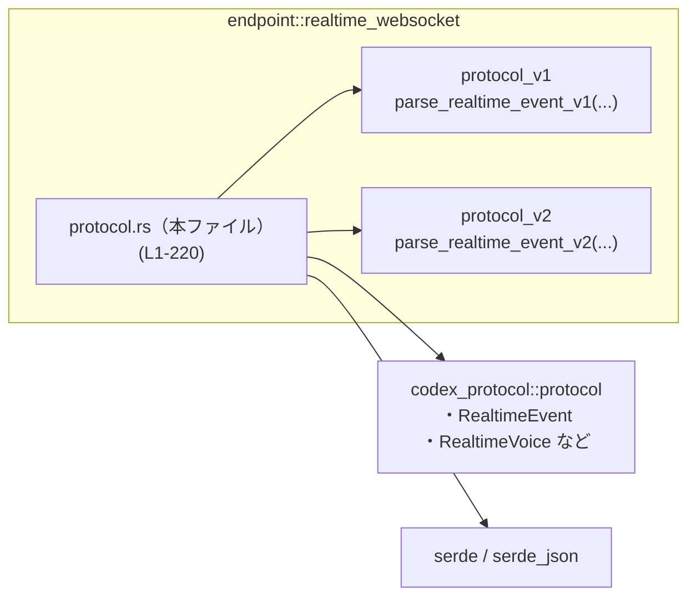
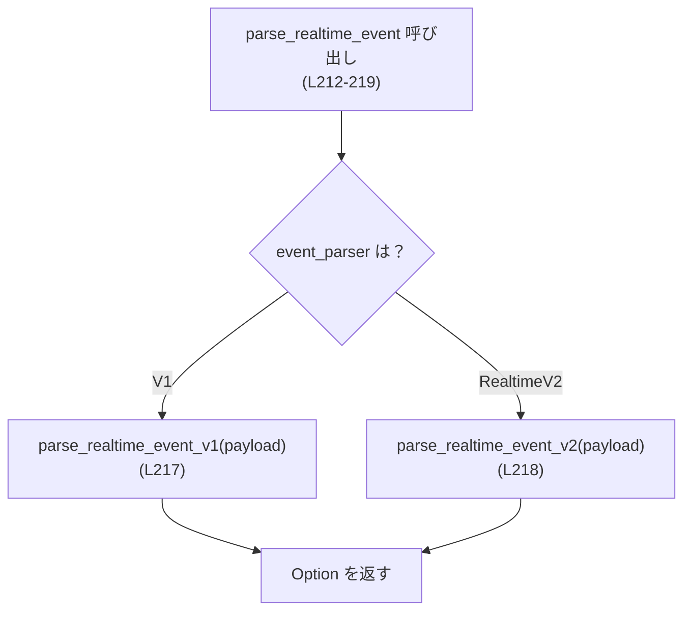
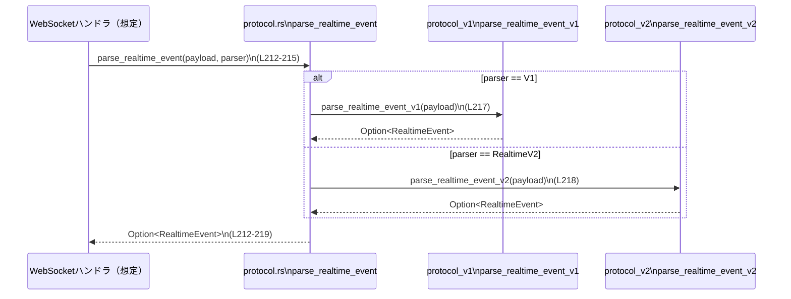

# codex-api/src/endpoint/realtime_websocket/protocol.rs コード解説

## 0. ざっくり一言

このモジュールは、リアルタイム WebSocket エンドポイントで使う **イベントパースのバージョン切り替え** と、セッション設定・送信メッセージの **JSON シリアライズ用データ構造** を定義するファイルです。[protocol.rs:L1-9][protocol.rs:L11-31][protocol.rs:L33-49][protocol.rs:L212-219]

---

## 1. このモジュールの役割

### 1.1 概要

- リアルタイムイベント（`RealtimeEvent`）のパースを、`RealtimeEventParser` という列挙体で **v1 / v2 プロトコルのどちらを使うか切り替える単一の関数** `parse_realtime_event` として提供します。[protocol.rs:L1-2][protocol.rs:L11-15][protocol.rs:L212-219]
- WebSocket 経由で送信するメッセージ（音声バッファ追加・セッション更新・会話アイテム作成など）を表す **シリアライズ専用の内部型** 群を定義します。[protocol.rs:L33-49][protocol.rs:L51-145][protocol.rs:L147-210]
- セッションの基本設定（モデル名、モード、音声ボイスなど）を表す公開構造体 `RealtimeSessionConfig` を定義し、上位レイヤーがセッションを構成するための情報をまとめて扱えるようにします。[protocol.rs:L23-31]

### 1.2 アーキテクチャ内での位置づけ

`protocol.rs` は、同じディレクトリ内の `protocol_v1` / `protocol_v2` モジュールと、外部クレート `codex_protocol::protocol` の型を仲介する位置にあります。[protocol.rs:L1-7]



- `protocol.rs` は、`protocol_v1` / `protocol_v2` のパーサー関数を呼び出す **ファサード** の役割を持ちます。[protocol.rs:L1-2][protocol.rs:L212-219]
- `codex_protocol::protocol` から `RealtimeEvent`・`RealtimeVoice` などを再公開し、このモジュールの利用側が外部クレートの型を意識せずに使えるようにしています。[protocol.rs:L3-7]
- シリアライズ対象の内部型は `serde::Serialize` を derive し、`serde` の属性で JSON 形式（タグ付けやフィールド名）を細かく制御しています。[protocol.rs:L8-9][protocol.rs:L33-49][protocol.rs:L51-145][protocol.rs:L147-210]

※ このチャンクからは、本モジュールを実際に呼び出している上位コード（WebSocket ハンドラなど）の詳細は分かりません。

### 1.3 設計上のポイント

- **バージョン切り替えを列挙体で表現**  
  - `RealtimeEventParser` に `V1` / `RealtimeV2` の 2 つのバリアントを持たせ、`parse_realtime_event` 内の `match` で実際のパーサー関数を切り替えています。[protocol.rs:L11-15][protocol.rs:L212-219]
- **状態を持たない純粋なユーティリティモジュール**  
  - グローバル状態や `static mut`、`unsafe` は存在せず、定義されているのは構造体・列挙体と 1 つの純粋関数だけです。[protocol.rs:L1-220]
- **シリアライズ専用の内部型を `pub(super)` に閉じ込め**  
  - `RealtimeOutboundMessage` や各種 `Session*` / `Conversation*` 型はすべて `pub(super)` で定義され、親モジュール内だけで利用されることを意図しています。[protocol.rs:L33-49][protocol.rs:L51-145][protocol.rs:L147-210]
- **可変な JSON 形式への対応**  
  - 多くのフィールドが `Option<T>` かつ `#[serde(skip_serializing_if = "Option::is_none")]` が付いており、「設定されているものだけを JSON に出す」部分更新型のペイロードを表現しやすい構造になっています。[protocol.rs:L51-67][protocol.rs:L78-92][protocol.rs:L107-112][protocol.rs:L140-145][protocol.rs:L197-203]

---

## 2. 主要な機能一覧

- リアルタイムイベントパース:
  - `parse_realtime_event`: 文字列ペイロードを `RealtimeEvent` に変換しようとし、v1/v2 パーサーを切り替えます。[protocol.rs:L212-219]
- セッション基本設定の保持:
  - `RealtimeSessionConfig`: モデル名・セッション ID・イベントパーサー・セッションモード・ボイス等をまとめた設定構造体。[protocol.rs:L23-31]
- アウトバウンド WebSocket メッセージ定義:
  - `RealtimeOutboundMessage`: 入力音声バッファ追加、ハンドオフ、レスポンス作成、セッション更新、会話アイテム作成などのメッセージ種別を列挙体として定義。[protocol.rs:L33-49]
- セッション・オーディオ関連構造体:
  - `SessionUpdateSession`, `SessionAudio`, `SessionAudioInput`, `SessionAudioOutput`, `SessionAudioFormat`, `SessionAudioOutputFormat`, それに対応する列挙体（`SessionType`, `AudioFormatType`, `NoiseReductionType`, `TurnDetectionType`）。[protocol.rs:L51-145]
- 会話コンテンツ関連構造体:
  - `ConversationMessageItem`, `ConversationFunctionCallOutputItem`, `ConversationItemContent`, `ConversationItemPayload`, および関連列挙体（`ConversationItemType`, `ConversationRole`, `ConversationContentType`）。[protocol.rs:L147-188][protocol.rs:L155-160][protocol.rs:L162-166][protocol.rs:L190-194]
- ツール呼び出し関連構造体:
  - `SessionFunctionTool` と `SessionToolType` により、関数ツールのメタデータ（名前・説明・parameters JSON）を表現。[protocol.rs:L197-210]
- 外部型の再公開:
  - `RealtimeAudioFrame`, `RealtimeEvent`, `RealtimeTranscriptDelta`, `RealtimeTranscriptEntry`, `RealtimeVoice` を外部クレートから再公開。[protocol.rs:L3-7]

---

## 3. 公開 API と詳細解説

### 3.1 型一覧（構造体・列挙体など）

#### 3.1.1 公開コンポーネント（外部から利用可能）

| 名前 | 種別 | 可視性 | 行 | 役割 / 用途 |
|------|------|--------|----|-------------|
| `RealtimeAudioFrame` | 再公開型 | `pub use` | protocol.rs:L3 | 音声フレームを表す型（定義は `codex_protocol::protocol` 側、詳細不明）。 |
| `RealtimeEvent` | 再公開型 | `pub use` | protocol.rs:L4 | リアルタイムイベント全般を表す型。`parse_realtime_event` の戻り値として利用。 |
| `RealtimeTranscriptDelta` | 再公開型 | `pub use` | protocol.rs:L5 | 字幕/転写の差分を表す型（詳細不明）。 |
| `RealtimeTranscriptEntry` | 再公開型 | `pub use` | protocol.rs:L6 | 転写エントリを表す型（詳細不明）。 |
| `RealtimeVoice` | 再公開型 | `pub use` | protocol.rs:L7 | 音声合成などの「声」を表す設定用型。`RealtimeSessionConfig` や `SessionAudioOutput` で使用。 |
| `RealtimeEventParser` | enum | `pub` | protocol.rs:L11-15 | イベント解析に v1 / v2 のどちらのパーサーを使うかを指定するための切り替え列挙体。 |
| `RealtimeSessionMode` | enum | `pub` | protocol.rs:L17-21 | セッションのモード（会話か転写か）を表す列挙体。 |
| `RealtimeSessionConfig` | struct | `pub` | protocol.rs:L23-31 | セッション設定（インストラクション、モデル、セッション ID、パーサー、モード、ボイス）をまとめた構造体。 |

#### 3.1.2 内部コンポーネント（親モジュールまでで利用）

| 名前 | 種別 | 可視性 | 行 | 役割 / 用途 |
|------|------|--------|----|-------------|
| `RealtimeOutboundMessage` | enum | `pub(super)` | protocol.rs:L33-49 | WebSocket で送信する各種メッセージを JSON にシリアライズするための列挙体。`#[serde(tag = "type")]` により `type` フィールドでバリアントを表現。 |
| `SessionUpdateSession` | struct | `pub(super)` | protocol.rs:L51-68 | `session.update` メッセージ内の `session` フィールドの内容を表す構造体。多くのフィールドがオプション。 |
| `SessionType` | enum | `pub(super)` | protocol.rs:L70-76 | セッションタイプ（`quicksilver`, `realtime`, `transcription`）を表す。`snake_case` でシリアライズ。 |
| `SessionAudio` | struct | `pub(super)` | protocol.rs:L78-83 | セッション内オーディオ設定。入力必須・出力は任意。 |
| `SessionAudioInput` | struct | `pub(super)` | protocol.rs:L85-92 | 入力オーディオのフォーマット・ノイズ除去・ターン検出設定。 |
| `SessionAudioFormat` | struct | `pub(super)` | protocol.rs:L94-99 | 入力オーディオの MIME タイプとサンプリングレート。 |
| `AudioFormatType` | enum | `pub(super)` | protocol.rs:L101-105 | `audio/pcm` などのオーディオフォーマット種別。 |
| `SessionAudioOutput` | struct | `pub(super)` | protocol.rs:L107-112 | 出力オーディオのフォーマット（任意）と `RealtimeVoice`。 |
| `SessionNoiseReduction` | struct | `pub(super)` | protocol.rs:L114-118 | ノイズ除去設定。 |
| `NoiseReductionType` | enum | `pub(super)` | protocol.rs:L120-124 | ノイズ除去方式。現状 `near_field` のみ。 |
| `SessionTurnDetection` | struct | `pub(super)` | protocol.rs:L126-132 | 発話ターン検出設定。検出方法とレスポンス割り込み・自動レスポンス生成フラグ。 |
| `TurnDetectionType` | enum | `pub(super)` | protocol.rs:L134-138 | ターン検出方式。`server_vad` のみ。 |
| `SessionAudioOutputFormat` | struct | `pub(super)` | protocol.rs:L140-145 | 出力オーディオのフォーマットとレート。 |
| `ConversationMessageItem` | struct | `pub(super)` | protocol.rs:L147-153 | 会話メッセージ（種類・ロール・テキストコンテンツ）を表す。 |
| `ConversationItemType` | enum | `pub(super)` | protocol.rs:L155-160 | 会話アイテムの種別（通常メッセージか関数呼び出しの出力）。 |
| `ConversationRole` | enum | `pub(super)` | protocol.rs:L162-166 | 会話のロール。現状 `user` のみ。 |
| `ConversationItemPayload` | enum | `pub(super)` | protocol.rs:L168-173 | メッセージか関数呼び出し出力か、どちらかのペイロードを持つ `#[serde(untagged)]` 列挙体。 |
| `ConversationFunctionCallOutputItem` | struct | `pub(super)` | protocol.rs:L175-181 | 関数呼び出しの結果（call_id と出力文字列）。 |
| `ConversationItemContent` | struct | `pub(super)` | protocol.rs:L183-188 | テキストコンテンツの単位。 |
| `ConversationContentType` | enum | `pub(super)` | protocol.rs:L190-194 | テキスト種別（通常 or 入力テキスト）。 |
| `SessionFunctionTool` | struct | `pub(super)` | protocol.rs:L197-203 | セッション内で利用可能な関数ツール定義。名前・説明・パラメータスキーマ（任意 JSON）。 |
| `SessionToolType` | enum | `pub(super)` | protocol.rs:L206-210 | ツール種別。現状 `function` のみ。 |
| `parse_realtime_event` | 関数 | `pub(super)` | protocol.rs:L212-219 | 文字列ペイロードとパーサーバージョンから `Option<RealtimeEvent>` を返す統合パーサー。 |

### 3.2 関数詳細（parse_realtime_event）

#### `parse_realtime_event(payload: &str, event_parser: RealtimeEventParser) -> Option<RealtimeEvent>`

**概要**

`RealtimeEventParser` で指定されたバージョンに応じて、`payload` 文字列を v1 または v2 のパーサーに渡し、その結果の `Option<RealtimeEvent>` をそのまま返す関数です。[protocol.rs:L1-2][protocol.rs:L11-15][protocol.rs:L212-219]

**引数**

| 引数名 | 型 | 説明 |
|--------|----|------|
| `payload` | `&str` | 受信したイベントペイロードの文字列。具体的なフォーマット（JSON など）はこのファイルからは分かりません。 |
| `event_parser` | `RealtimeEventParser` | 使用するパーサーバージョン。`V1` か `RealtimeV2` のいずれか。[protocol.rs:L11-15][protocol.rs:L212-219] |

**戻り値**

- 型: `Option<RealtimeEvent>`（`codex_protocol::protocol` から再公開されている型）。[protocol.rs:L4][protocol.rs:L212-219]
- 意味:
  - `Some(event)`: `payload` を正常にパースして `RealtimeEvent` が得られたケース。
  - `None`: パースに失敗した、あるいはイベントとして解釈できなかったケース。どのような条件で `None` になるかは `parse_realtime_event_v1` / `parse_realtime_event_v2` の実装に依存し、このチャンクからは分かりません。[protocol.rs:L1-2][protocol.rs:L212-219]

**内部処理の流れ（アルゴリズム）**

1. `match event_parser` により、`RealtimeEventParser` のバリアントを判定します。[protocol.rs:L212-216]
2. `RealtimeEventParser::V1` の場合、`parse_realtime_event_v1(payload)` を呼び出します。[protocol.rs:L217]
3. `RealtimeEventParser::RealtimeV2` の場合、`parse_realtime_event_v2(payload)` を呼び出します。[protocol.rs:L218]
4. それぞれのパーサー関数は `Option<RealtimeEvent>` を返すことが型推論上要求されており、その結果がそのまま `parse_realtime_event` の戻り値となります。[protocol.rs:L212-219]

Mermaid でのフロー図は次のようになります。



**Examples（使用例）**

以下は、親モジュール（`endpoint::realtime_websocket`）側から v2 パーサーを使ってイベントを処理する想定の例です。`pub(super)` のため、この関数は親モジュールからアクセスできます。[protocol.rs:L212-219]

```rust
// 想定位置: crate::endpoint::realtime_websocket 内のコード例          // この例は親モジュールからの呼び出しイメージを示す

use super::protocol::{                                         // 親モジュールから protocol モジュールの公開要素を利用する
    parse_realtime_event,                                      // 統合パーサー関数
    RealtimeEventParser,                                       // パーサーのバージョン指定 enum
    RealtimeEvent,                                             // パース結果のイベント型（再公開）
};

fn on_ws_message(payload: &str) {                              // WebSocket で文字列ペイロードを受け取ったときの処理
    let parser = RealtimeEventParser::RealtimeV2;              // v2 プロトコルとして解釈することを指定
    if let Some(event) = parse_realtime_event(payload, parser) // パースを試み、成功時のみ処理する
    {
        handle_event(event);                                   // パースされた RealtimeEvent を別関数で処理（実装は別途）
    } else {
        log::warn!("failed to parse realtime event");          // パースに失敗した場合のロギングなど
    }
}

fn handle_event(event: RealtimeEvent) {                        // パース済みイベントを扱う関数の例
    // event の内容に応じて分岐処理を行う（詳細は codex_protocol::protocol の定義に依存）
}
```

※ `handle_event` の具体的な処理内容や `RealtimeEvent` のバリアントは、このファイルには定義がないため不明です。

**Errors / Panics**

- `parse_realtime_event` 自身には `unwrap` や `panic!` などがなく、明示的な panic 要因はありません。[protocol.rs:L212-219]
- エラーは `Option::None` を通じて表現されますが、どの入力が `None` を引き起こすかは、このファイルからは分かりません（`parse_realtime_event_v1` / `parse_realtime_event_v2` の実装に依存）。[protocol.rs:L1-2][protocol.rs:L212-219]
- 下位パーサー内で `panic!` 等が使われているかどうかは、このチャンクには現れません。

**Edge cases（エッジケース）**

この関数のエッジケースは、主に下位パーサーの挙動に依存します。

- 空文字列 `""` の `payload`  
  - この関数内で特別扱いはなく、そのまま v1 / v2 パーサーに渡されます。[protocol.rs:L212-219]  
  - それが `None` になるかどうかは不明です。
- 非対応フォーマットの文字列  
  - 同様に、下位パーサーに渡され、その戻り値がそのまま返されます。[protocol.rs:L212-219]
- `event_parser` が `V1` / `RealtimeV2` 以外  
  - 列挙体の2バリアントのみが定義されており、`match` で完全に網羅されているため、「それ以外」のケースは存在しません。[protocol.rs:L11-15][protocol.rs:L216-219]

**使用上の注意点**

- **バージョン指定の整合性**  
  - 実際に受信しているペイロードのプロトコルバージョンと `event_parser` の指定が一致している必要があります。一致しない場合、`None` が返される可能性があります（詳細は下位パーサー依存）。[protocol.rs:L11-15][protocol.rs:L212-219]
- **エラー処理の必須性**  
  - 戻り値が `Option` なので、呼び出し側は `None` を必ず考慮する必要があります。`unwrap` などで `Some` を前提にすると、呼び出し側で panic を引き起こす恐れがあります。
- **並行性 / 安全性**  
  - この関数は入力引数のみを参照し、共有状態にアクセスしません。純粋関数のため、複数スレッドから同時に呼び出しても、この関数自身がデータ競合を起こすことはありません。[protocol.rs:L212-219]  
    （ただし、`parse_realtime_event_v1` / `parse_realtime_event_v2` 側がスレッドセーフかどうかは、このチャンクからは分かりません。）

### 3.3 その他の関数

- このファイルには `parse_realtime_event` 以外の関数定義は存在しません。[protocol.rs:L1-220]

---

## 4. データフロー

ここでは代表的なシナリオとして、「受信した WebSocket メッセージをイベントとしてパースする」流れを説明します。

### 4.1 イベント受信から `RealtimeEvent` まで

上位レイヤーの WebSocket ハンドラが文字列ペイロードを受け取り、このモジュールの `parse_realtime_event` を経由して `RealtimeEvent` に変換する、という流れが想定されます。[protocol.rs:L1-2][protocol.rs:L4][protocol.rs:L11-15][protocol.rs:L212-219]



- この図は、本ファイルに現れる `parse_realtime_event` 関数と `protocol_v1` / `protocol_v2` の呼び出し関係を示しています。[protocol.rs:L1-2][protocol.rs:L212-219]
- WebSocket ハンドラ側は、戻り値の `Option<RealtimeEvent>` を見て、パース成功時のみイベント処理を行う設計にできます。

### 4.2 アウトバウンドメッセージのシリアライズ

もう一つの典型的なデータフローは、「内部状態から `RealtimeOutboundMessage` を構築し、JSON にシリアライズして WebSocket へ送信する」というものです。

`RealtimeOutboundMessage` とその関連構造体は、`serde` の属性により具体的な JSON 形式が決まります。[protocol.rs:L33-49][protocol.rs:L51-145][protocol.rs:L147-210]

例: `RealtimeOutboundMessage::SessionUpdate` の JSON 形状（概念図）

```text
{
  "type": "session.update",         // #[serde(tag = "type")] + #[serde(rename = "...")]
  "session": {
    "id": "abc123",                 // Option<String> (設定されていれば出力)
    "type": "realtime",             // SessionType::Realtime → "realtime"
    "model": "my-model",            // Option<String>
    "instructions": "You are ...",  // Option<String>
    "output_modalities": ["audio"], // Option<Vec<String>>
    "audio": {                      // SessionAudio
      "input": {
        "type": "audio/pcm",        // AudioFormatType::AudioPcm → "audio/pcm"
        "rate": 16000
      },
      "output": {
        "type": "audio/pcm",
        "rate": 24000
      }
    },
    "tools": [ ... ],               // Option<Vec<SessionFunctionTool>>
    "tool_choice": "auto"           // Option<String>
  }
}
```

この形は、`RealtimeOutboundMessage` と `SessionUpdateSession` と各種 `Session*` 型に付与された `serde` 属性から読み取れます。[protocol.rs:L33-49][protocol.rs:L51-68][protocol.rs:L94-99][protocol.rs:L101-105][protocol.rs:L140-145][protocol.rs:L197-203]

---

## 5. 使い方（How to Use）

### 5.1 基本的な使用方法（イベントパース）

先ほどの例をもう少し詳細にし、`RealtimeSessionConfig` との組み合わせを示します。

```rust
// 想定位置: crate::endpoint::realtime_websocket 内のコード                   // 親モジュールからの利用例

use super::protocol::{                                                   // protocol モジュールの公開要素をインポート
    parse_realtime_event,                                                // 統合パーサー関数
    RealtimeEventParser,                                                 // パーサーバージョン指定 enum
    RealtimeSessionConfig,                                               // セッション設定 struct
    RealtimeSessionMode,                                                 // セッションモード enum
    RealtimeVoice,                                                       // ボイス設定型（定義は codex_protocol::protocol 側）
};

fn build_session_config(voice: RealtimeVoice) -> RealtimeSessionConfig { // セッション設定を組み立てる補助関数
    RealtimeSessionConfig {                                              // RealtimeSessionConfig 構造体のインスタンスを作成
        instructions: "You are a helpful assistant.".to_string(),        // システムプロンプト／インストラクション
        model: Some("my-realtime-model".to_string()),                    // 使用するモデル名（任意）
        session_id: None,                                                // 既存セッションを継続したい場合は Some になる想定
        event_parser: RealtimeEventParser::RealtimeV2,                   // v2 パーサーを利用
        session_mode: RealtimeSessionMode::Conversational,               // 会話モード
        voice,                                                           // 呼び出し元で決定された RealtimeVoice を利用
    }
}

fn on_ws_message(payload: &str, voice: RealtimeVoice) {                   // WebSocket メッセージを受け取ったときの処理
    let _config = build_session_config(voice);                            // セッション設定の構築（実際にはどこかで利用される想定）

    let parser = RealtimeEventParser::RealtimeV2;                         // v2 としてパースする
    match parse_realtime_event(payload, parser) {                         // イベントのパースを試みる
        Some(event) => {
            handle_event(event);                                          // 成功時の処理
        }
        None => {
            log::warn!("Invalid realtime event payload");                // 失敗時のログ出力など
        }
    }
}

fn handle_event(event: RealtimeEvent) {                                   // 実際のイベント処理
    // event の内容に応じた分岐などを行う（詳細は別モジュールの定義に依存）
}
```

この例では、`RealtimeSessionConfig` はセッションの設定として別途利用され、`parse_realtime_event` はペイロードの解釈に専念する構造になっています。[protocol.rs:L23-31][protocol.rs:L11-15][protocol.rs:L212-219]

### 5.2 よくある使用パターン

1. **プロトコルバージョンでパーサーを切り替える**

   - 旧クライアントには `RealtimeEventParser::V1`、新クライアントには `RealtimeEventParser::RealtimeV2` を使うなど、クライアント能力に応じてパーサーを選択できます。[protocol.rs:L11-15]

   ```rust
   fn on_client_message(payload: &str, use_v2: bool) {
       let parser = if use_v2 {
           RealtimeEventParser::RealtimeV2
       } else {
           RealtimeEventParser::V1
       };
       if let Some(event) = parse_realtime_event(payload, parser) {
           // ...
       }
   }
   ```

2. **セッションモードによる処理分岐**

   - `RealtimeSessionConfig.session_mode` を見て、会話モード（`Conversational`）か転写モード（`Transcription`）かでイベント処理を切り替えることが可能です。[protocol.rs:L17-21][protocol.rs:L23-31]

   ```rust
   fn handle_session(config: &RealtimeSessionConfig, payload: &str) {
       let event = match parse_realtime_event(payload, config.event_parser) {
           Some(e) => e,
           None => return,
       };
       match config.session_mode {
           RealtimeSessionMode::Conversational => handle_conversation(event),
           RealtimeSessionMode::Transcription => handle_transcription(event),
       }
   }
   ```

### 5.3 よくある間違い

```rust
// 間違い例: ペイロードのバージョンとパーサーが一致していない可能性がある
fn on_message_v2_but_parser_v1(payload: &str) {
    let parser = RealtimeEventParser::V1;          // 本当は RealtimeV2 を使うべきペイロードに対して
    let _ = parse_realtime_event(payload, parser); // None が返る可能性が高い（詳細は下位パーサー依存）
}

// 正しい例: ペイロードのプロトコルバージョンに合わせてパーサーを指定する
fn on_message_v2(payload: &str) {
    let parser = RealtimeEventParser::RealtimeV2;  // v2 ペイロードには v2 パーサー
    if let Some(event) = parse_realtime_event(payload, parser) {
        // 正常にパースされたイベントを処理
    }
}
```

- `RealtimeSessionConfig` を使う場合も、`session_mode` と実際に送受信するイベントの種別を揃えておかないと、上位ロジックで矛盾が生じる可能性があります。[protocol.rs:L17-21][protocol.rs:L23-31]

### 5.4 使用上の注意点（まとめ）

- `parse_realtime_event` の戻り値 `Option<RealtimeEvent>` は、必ず `None` を考慮したコードで扱う必要があります。[protocol.rs:L212-219]
- `RealtimeOutboundMessage` や各種 `Session*` / `Conversation*` 型は `pub(super)` のため、このモジュール外（`endpoint::realtime_websocket` より外側）から直接使うことはできません。[protocol.rs:L33-49][protocol.rs:L51-145][protocol.rs:L147-210]
- JSON フォーマットは `serde` 属性に強く依存しているため、外部との互換性が重要な場合、フィールド名・タグ名の変更には注意が必要です。[protocol.rs:L34-38][protocol.rs:L45-48][protocol.rs:L70-76][protocol.rs:L101-105][protocol.rs:L120-124][protocol.rs:L134-138][protocol.rs:L155-160][protocol.rs:L162-166][protocol.rs:L190-194][protocol.rs:L206-210]
- `ConversationItemPayload` は `#[serde(untagged)]` なので、新しいバリアントを追加する際には JSON 形状の曖昧さに注意する必要があります。[protocol.rs:L168-173]

---

## 6. 変更の仕方（How to Modify）

### 6.1 新しい機能を追加する場合

1. **新しいイベントパーサーバージョンを追加する**

   - `RealtimeEventParser` に新しいバリアントを追加します。例: `V3`。[protocol.rs:L11-15]
   - 新しいパーサー関数 `parse_realtime_event_v3` を `protocol_v3` モジュールなどに実装し、このファイルに `use` を追加します。[protocol.rs:L1-2]
   - `parse_realtime_event` の `match` に新しいバリアントの分岐を追加し、`parse_realtime_event_v3(payload)` を呼び出すようにします。[protocol.rs:L212-219]
   - これにより、上位コードは `RealtimeEventParser::V3` を指定するだけで新パーサーを利用できます。

2. **新しいアウトバウンドメッセージ種別を追加する**

   - `RealtimeOutboundMessage` に新しいバリアントを追加します（必要に応じて新しい構造体を別途定義）。[protocol.rs:L33-49]
   - `#[serde(rename = "...")]` で外部プロトコル仕様に合わせた `type` 名を設定します。[protocol.rs:L36-38][protocol.rs:L38-42][protocol.rs:L43-48]
   - 追加した構造体にも `Serialize` と適切な `serde` 属性を付与し、既存の JSON 形式と整合するようにします。

3. **新しいツール種別を追加する**

   - `SessionToolType` に新バリアントを追加し、`#[serde(rename_all = "snake_case")]` の影響を考慮した文字列が出力されることを確認します。[protocol.rs:L206-210]
   - `SessionFunctionTool` の `parameters: Value` は汎用 JSON なので、パラメータ構造が異なるツールも同じ型で表現できます。[protocol.rs:L197-203]

### 6.2 既存の機能を変更する場合

- **`RealtimeSessionConfig` のフィールド追加/変更**

  - フィールドを追加する場合は、上位コード（設定を構築している箇所）も更新する必要があります。[protocol.rs:L23-31]
  - `event_parser` や `session_mode` の意味を変更する際は、それに依存するロジック全体の契約（「どのモードではどのイベントが来るか」など）を整理する必要があります。

- **JSON フォーマットに影響する変更**

  - `serde` 属性（`rename`, `rename_all`, `tag`, `untagged`, `skip_serializing_if` など）を変更すると、外部クライアントとの互換性に直接影響します。[protocol.rs:L34-38][protocol.rs:L70-72][protocol.rs:L101-104][protocol.rs:L120-122][protocol.rs:L134-136][protocol.rs:L155-157][protocol.rs:L162-164][protocol.rs:L190-192][protocol.rs:L206-207]
  - 変更前後で JSON の差分を確認するために、テストやログを活用することが有用です（このチャンクにはテストコードは現れません）。

- **エッジケース・契約の確認**

  - `parse_realtime_event` の戻り値の意味（どの入力で `None` を返すか）は、`protocol_v1` / `protocol_v2` との間で契約として整理されている可能性があります。このファイル単体からは契約内容は分からないため、変更時にはそちらの実装も必ず確認する必要があります。[protocol.rs:L1-2][protocol.rs:L212-219]

---

## 7. 関連ファイル

| パス / モジュール | 役割 / 関係 |
|-------------------|------------|
| `crate::endpoint::realtime_websocket::protocol_v1` | `parse_realtime_event_v1` 関数を提供するモジュール。このファイルの `parse_realtime_event` から呼び出されます。[protocol.rs:L1][protocol.rs:L217] |
| `crate::endpoint::realtime_websocket::protocol_v2` | `parse_realtime_event_v2` 関数を提供するモジュール。同様に、`parse_realtime_event` から呼び出されます。[protocol.rs:L2][protocol.rs:L218] |
| `codex_protocol::protocol` | `RealtimeEvent`、`RealtimeVoice` などリアルタイムプロトコルのコア型を定義する外部クレートのモジュール。このファイルで型が再公開されています。[protocol.rs:L3-7] |
| `serde` / `serde_json` | 本ファイルの多くの構造体・列挙体のシリアライズ／JSON 表現を司るライブラリ。`Serialize` derive と `serde` 属性の解釈に使われます。[protocol.rs:L8-9][protocol.rs:L33-49][protocol.rs:L51-145][protocol.rs:L147-210] |

※ 実際のファイルパス（`protocol_v1.rs` など）は、モジュール定義の仕方により変わる可能性があり、このチャンクだけからは特定できません。
