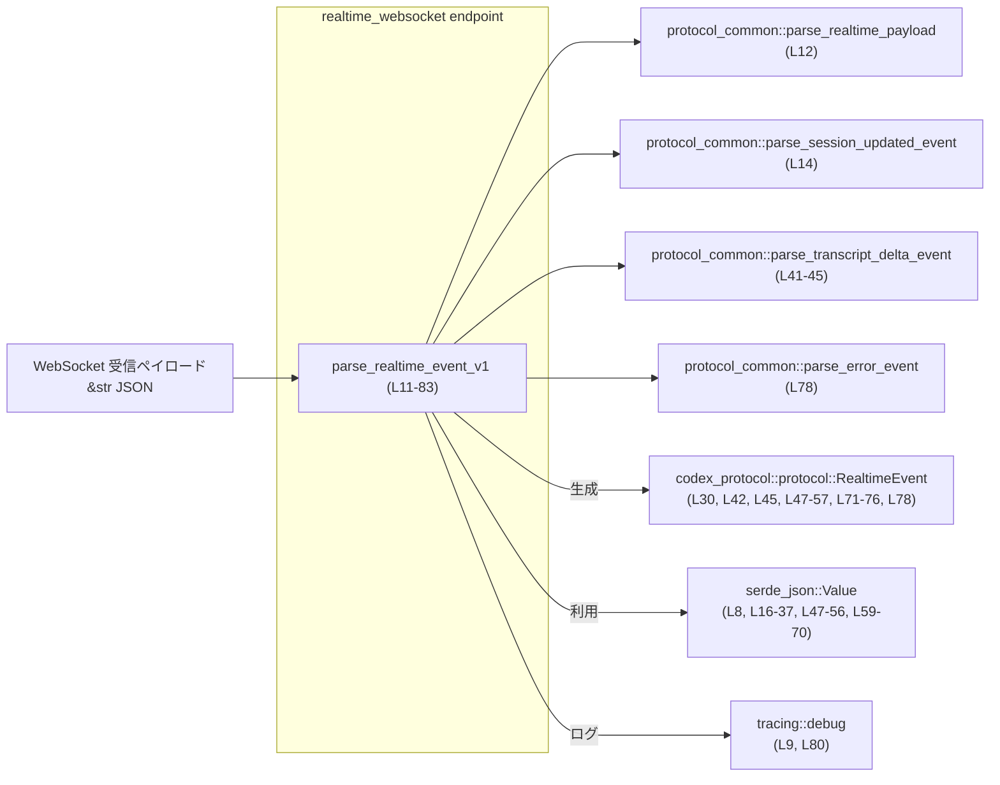
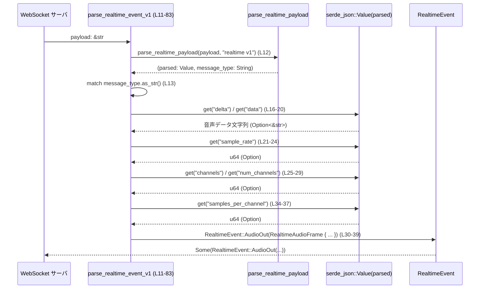

# codex-api\src\endpoint\realtime_websocket\protocol_v1.rs

## 0. ざっくり一言

`realtime v1` プロトコルで送られてくる WebSocket メッセージ（JSON文字列）を解析し、`RealtimeEvent` 列挙体に変換する「v1 専用パーサ関数」を提供するモジュールです（`protocol_v1.rs:L11-83`）。

---

## 1. このモジュールの役割

### 1.1 概要

- このモジュールは、**リアルタイム WebSocket メッセージ（v1 フォーマット）** を内部表現である `RealtimeEvent` に変換するために存在します（`protocol_v1.rs:L11`）。
- JSON 文字列からイベント種別やフィールドを取り出し、音声フレーム・テキストの増分・会話アイテムの追加／完了・ハンドオフ要求・エラーなど、複数種類のイベントを識別します（`protocol_v1.rs:L13-78`）。
- 解析に失敗した場合や未対応のイベント種別は `None` を返して上位に通知します（`protocol_v1.rs:L12, L80-82`）。

### 1.2 アーキテクチャ内での位置づけ

このモジュールは「v1 プロトコル専用のイベントパース層」に位置し、共通パーサ群やプロトコル定義と連携します。



### 1.3 設計上のポイント

- **メインエントリは1関数のみ**  
  `parse_realtime_event_v1` が v1 プロトコルのエントリポイントになっており、この関数内で全イベント種別を `match` で分岐しています（`protocol_v1.rs:L11-83`）。
- **共通ロジックとの分離**  
  生 JSON からの基本的なパースや、一部のイベント（`session.updated`, transcript delta, error）は `protocol_common` モジュールに委譲し、このモジュールでは v1 固有の分岐とマッピングに集中しています（`protocol_v1.rs:L1-4, L14, L41-45, L78`）。
- **Option ベースのエラーハンドリング**  
  パース失敗や欠損フィールドはすべて `None` として扱われ、`?` 演算子と `Option` を組み合わせて早期リターンしています（`protocol_v1.rs:L12, L20, L24, L29, L62, L66, L70`）。
- **副作用はログ出力のみ**  
  未対応イベント種別の場合に `tracing::debug!` でログを出す以外、共有状態や I/O は扱っておらず、スレッド安全な純粋関数に近い構造です（`protocol_v1.rs:L80-82`）。
- **数値型の安全な変換**  
  `sample_rate`・`num_channels`・`samples_per_channel` は `u64` から `u32` / `u16` へ `try_from(...).ok()` を通して変換し、オーバーフロー時は `None` で失敗として扱います（`protocol_v1.rs:L21-24, L25-29, L34-37`）。

### 1.4 コンポーネントインベントリー（このファイル内）

#### 関数

| 種別 | 名前 | 役割 / 用途 | 定義箇所 |
|------|------|-------------|----------|
| 関数 | `parse_realtime_event_v1` | v1 WebSocket ペイロード文字列から `RealtimeEvent` を生成するメインパーサ | `protocol_v1.rs:L11-83` |

#### 依存する関数（他モジュール）

| 種別 | 名前 | 役割 / 用途（このチャンクからわかる範囲） | 利用箇所 |
|------|------|-----------------------------------------|----------|
| 関数 | `parse_realtime_payload` | ペイロードから JSON (`parsed`) とイベント種別 (`message_type`) を取り出す | `protocol_v1.rs:L12` |
| 関数 | `parse_session_updated_event` | `"session.updated"` イベントのパース | `protocol_v1.rs:L14` |
| 関数 | `parse_transcript_delta_event` | transcript delta (`input`/`output`) イベントのパース | `protocol_v1.rs:L41-45` |
| 関数 | `parse_error_event` | `"error"` イベントのパース | `protocol_v1.rs:L78` |

#### 利用する型

| 種別 | 名前 | 役割 / 用途（このチャンクからわかる範囲） | 利用箇所 |
|------|------|-----------------------------------------|----------|
| 構造体 | `RealtimeAudioFrame` | 音声出力フレーム（データ文字列・サンプルレート等）を保持 | `protocol_v1.rs:L30-39` |
| 列挙体 | `RealtimeEvent` | さまざまな realtime イベント種別を表す共通列挙体 | `protocol_v1.rs:L30, L42, L45, L47-57, L71-76, L78` |
| 構造体 | `RealtimeHandoffRequested` | handoff.requested イベントのペイロードを保持 | `protocol_v1.rs:L71-76` |
| 構造体 | `serde_json::Value` | JSON 値の表現。フィールド抽出や型変換に利用 | `protocol_v1.rs:L8, L16-37, L47-56, L59-70` |

---

## 2. 主要な機能一覧

このモジュールが提供する主要な機能は、すべて `parse_realtime_event_v1` の中に集約されています。

- v1 ペイロードの共通パース呼び出し: `parse_realtime_payload` で JSON + 種別に分解（`protocol_v1.rs:L12`）。
- `session.updated` イベントのパース委譲（`protocol_v1.rs:L14`）。
- `conversation.output_audio.delta` イベントからの `RealtimeAudioFrame` 生成（`protocol_v1.rs:L15-40`）。
- `conversation.input_transcript.delta` / `conversation.output_transcript.delta` の増分テキストイベント生成（`protocol_v1.rs:L41-46`）。
- `conversation.item.added` / `conversation.item.done` イベントの ID／アイテム抽出（`protocol_v1.rs:L47-57`）。
- `conversation.handoff.requested` イベントから `RealtimeHandoffRequested` の構築（`protocol_v1.rs:L58-76`）。
- `error` イベントのパース委譲（`protocol_v1.rs:L78`）。
- 未対応イベント種別のデバッグログ出力とスキップ（`protocol_v1.rs:L80-82`）。

---

## 3. 公開 API と詳細解説

### 3.1 型一覧（このファイル内で扱う主な型）

このファイル内で「定義」はされていませんが、使用されている主要な型を整理します。

| 名前 | 種別 | 役割 / 用途 | 根拠 |
|------|------|-------------|------|
| `RealtimeEvent` | 列挙体（外部定義） | 全ての realtime イベントの共通表現。各種 `RealtimeEvent::XXX` を生成して返す | variant 使用箇所（`protocol_v1.rs:L30, L42, L45, L47-57, L71-76, L78`） |
| `RealtimeAudioFrame` | 構造体（外部定義） | 音声出力フレームのペイロード格納（data, sample_rate, num_channels, samples_per_channel, item_id） | フィールド初期化（`protocol_v1.rs:L30-39`） |
| `RealtimeHandoffRequested` | 構造体（外部定義） | handoff.requested の handoff_id / item_id / input_transcript / active_transcript を保持 | フィールド初期化（`protocol_v1.rs:L71-76`） |
| `serde_json::Value` | 構造体（外部ライブラリ） | JSON オブジェクト／値。`get`, `as_str`, `as_u64`, `as_object` でフィールド参照に使用 | メソッド利用箇所（`protocol_v1.rs:L16-37, L47-56, L59-70`） |

### 3.2 関数詳細

#### `parse_realtime_event_v1(payload: &str) -> Option<RealtimeEvent>`

**概要**

- `realtime v1` 形式の WebSocket ペイロード文字列を解析し、対応する `RealtimeEvent` を返す関数です（`protocol_v1.rs:L11`）。
- 解析できない・未対応のイベント種別・必須フィールド欠損などの場合は `None` を返します（`protocol_v1.rs:L12, L20, L24, L29, L62, L66, L70, L80-82`）。

**引数**

| 引数名 | 型 | 説明 | 根拠 |
|--------|----|------|------|
| `payload` | `&str` | WebSocket から受信した JSON 文字列（v1 プロトコル） | 関数シグネチャ（`protocol_v1.rs:L11`） |

**戻り値**

- `Option<RealtimeEvent>`（`protocol_v1.rs:L11`）  
  - `Some(RealtimeEvent::...)` : 正常にパースし、対応するイベントを構築できた場合。
  - `None` : JSON の基本パース失敗、イベント種別不明、必須フィールド欠損・型不一致など、パース不能な場合。

**内部処理の流れ（アルゴリズム）**

1. **共通ペイロードパース**  
   `parse_realtime_payload(payload, "realtime v1")` を呼び出し、  
   `parsed`（JSON オブジェクト）と `message_type`（イベント種別文字列）を取得します（`protocol_v1.rs:L12`）。  
   - ここで `?` を使っているため、失敗時は即座に `None` を返します（Option に対する `?`）（`protocol_v1.rs:L12`）。

2. **イベント種別で分岐**  
   `message_type.as_str()` の結果に対して `match` を行い、種別ごとにパースロジックを切り替えます（`protocol_v1.rs:L13`）。

3. **`session.updated` の処理**（`protocol_v1.rs:L14`）  
   - `parse_session_updated_event(&parsed)` に処理を委譲し、その戻り値（`Option<RealtimeEvent>` と推定される）をそのまま返します。

4. **`conversation.output_audio.delta` の処理**（`protocol_v1.rs:L15-40`）  
   - `data` 文字列を `parsed["delta"]` または `parsed["data"]` から取得し、`String` に変換します（`protocol_v1.rs:L16-20`）。
   - `sample_rate`（u32）を `parsed["sample_rate"]` から `u64` → `u32` に変換します（`protocol_v1.rs:L21-24`）。
   - `num_channels`（u16）を `parsed["channels"]` または `parsed["num_channels"]` から `u64` → `u16` に変換します（`protocol_v1.rs:L25-29`）。
   - `samples_per_channel`（`Option<u32>`）を任意フィールドとして取得します（`protocol_v1.rs:L34-37`）。
   - 上記の必須フィールドで `?` を使用しているため、欠損・型不一致時は `None` を返します（`protocol_v1.rs:L20, L24, L29`）。
   - 正常時は `RealtimeEvent::AudioOut(RealtimeAudioFrame { ... })` を生成し `Some` で返します（`protocol_v1.rs:L30-39`）。

5. **transcript delta の処理**（`protocol_v1.rs:L41-46`）  
   - `"conversation.input_transcript.delta"` の場合は `parse_transcript_delta_event(&parsed, "delta")` を呼び出し、その成功結果を `RealtimeEvent::InputTranscriptDelta` にマッピングします（`protocol_v1.rs:L41-42`）。
   - `"conversation.output_transcript.delta"` の場合は同様に `RealtimeEvent::OutputTranscriptDelta` にマッピングします（`protocol_v1.rs:L44-45`）。

6. **会話アイテムの追加・完了**  
   - `"conversation.item.added"`: `parsed["item"]` をそのままクローンし、`RealtimeEvent::ConversationItemAdded` に包みます（`protocol_v1.rs:L47-50`）。  
     `item` が存在しなければ `None`。
   - `"conversation.item.done"`: `parsed["item"]["id"]` を文字列として取得し、`RealtimeEvent::ConversationItemDone { item_id }` を構築します（`protocol_v1.rs:L51-57`）。  
     ネスト構造や型が期待と異なる場合は `None`。

7. **ハンドオフ要求の処理**（`protocol_v1.rs:L58-76`）  
   - `"conversation.handoff.requested"` の場合、`handoff_id`, `item_id`, `input_transcript` をそれぞれ文字列として取得します（`protocol_v1.rs:L59-70`）。
   - いずれかの取得に失敗した場合は `None` になります（`?` のため）（`protocol_v1.rs:L62, L66, L70`）。
   - 正常時は `RealtimeHandoffRequested { handoff_id, item_id, input_transcript, active_transcript: Vec::new() }` を作成し、`RealtimeEvent::HandoffRequested` に包んで返します（`protocol_v1.rs:L71-76`）。

8. **エラーイベントの処理**（`protocol_v1.rs:L78`）  
   - `"error"` の場合は `parse_error_event(&parsed)` に処理を委譲します。

9. **未対応イベント種別の処理**（`protocol_v1.rs:L79-82`）  
   - どれにもマッチしない場合 `_` アームに入り、`debug!` ログを出力しつつ `None` を返します。

**簡易フローチャート**

```mermaid
flowchart TD
    A["parse_realtime_event_v1 (L11-83) 開始"] --> B["parse_realtime_payload(payload, \"realtime v1\") (L12)"]
    B -->|失敗 / None| Z["None を返す (L12)"]
    B -->|成功: (parsed, message_type)| C["match message_type.as_str() (L13)"]

    C --> D1["\"session.updated\" (L14)"] --> E1["parse_session_updated_event(&parsed) を返す"]
    C --> D2["\"conversation.output_audio.delta\" (L15-40)"] --> E2["RealtimeEvent::AudioOut(...) を Some で返す"]
    C --> D3["input_transcript.delta (L41-42)"] --> E3["RealtimeEvent::InputTranscriptDelta(...)"]
    C --> D4["output_transcript.delta (L44-45)"] --> E4["RealtimeEvent::OutputTranscriptDelta(...)"]
    C --> D5["conversation.item.added (L47-50)"] --> E5["ConversationItemAdded(item)"]
    C --> D6["conversation.item.done (L51-57)"] --> E6["ConversationItemDone { item_id }"]
    C --> D7["handoff.requested (L58-76)"] --> E7["HandoffRequested(...)"]
    C --> D8["\"error\" (L78)"] --> E8["parse_error_event(&parsed)"]
    C --> D9["その他 (L79-82)"] --> E9["debug! ログ後、None"]

    E1 --> F["Option<RealtimeEvent> を返す"]
    E2 --> F
    E3 --> F
    E4 --> F
    E5 --> F
    E6 --> F
    E7 --> F
    E8 --> F
    E9 --> F
```

**Examples（使用例）**

この関数は `pub(super)` なので、同一モジュール階層内からの利用を想定します（`protocol_v1.rs:L11`）。

```rust
// WebSocket から受信したメッセージ文字列を想定する
let message: &str = r#"{
    "type": "conversation.output_audio.delta",
    "delta": "BASE64_AUDIO_DATA",
    "sample_rate": 16000,
    "channels": 1
}"#;

// v1 パーサを呼び出す
if let Some(event) = parse_realtime_event_v1(message) { // 成功時のみ分岐
    match event {
        RealtimeEvent::AudioOut(frame) => {
            // frame.data / frame.sample_rate / frame.num_channels を利用する
            println!("audio sample_rate = {}", frame.sample_rate);
        }
        _ => { /* 他のイベント種別 */ }
    }
} else {
    // パースできなかった場合の処理（ログなど）
    eprintln!("Failed to parse realtime v1 message");
}
```

この例では、必須フィールドが正しく存在するため `AudioOut` イベントとして処理されます。

**エラー / パニック条件**

- **パニック**  
  - この関数内では `unwrap` などは使われていないため、通常の入力に対してパニックは発生しません（`protocol_v1.rs:L11-83`）。
- **`None` を返す条件（事実として確認できる範囲）**
  - `parse_realtime_payload` が失敗した場合（`protocol_v1.rs:L12`）。
  - `"conversation.output_audio.delta"` で `delta` / `data` が存在しない・文字列でない場合（`protocol_v1.rs:L16-20`）。
  - `"conversation.output_audio.delta"` で `sample_rate` が存在しない・整数でない・`u32` に収まらない場合（`protocol_v1.rs:L21-24`）。
  - `"conversation.output_audio.delta"` で `channels` / `num_channels` が存在しない・整数でない・`u16` に収まらない場合（`protocol_v1.rs:L25-29`）。
  - `"conversation.item.added"` で `item` フィールドが存在しない場合（`protocol_v1.rs:L47-50`）。
  - `"conversation.item.done"` で `item` がオブジェクトでない、または `id` フィールドが存在しない・文字列でない場合（`protocol_v1.rs:L51-57`）。
  - `"conversation.handoff.requested"` で `handoff_id` / `item_id` / `input_transcript` のいずれかが存在しない・文字列でない場合（`protocol_v1.rs:L59-70`）。
  - イベント種別が未対応で `_` アームに入った場合（`protocol_v1.rs:L79-82`）。

**エッジケース**

- **空文字列・不正 JSON**  
  - `parse_realtime_payload` が失敗し、`None` を返すため、この関数も `None` になります（`protocol_v1.rs:L12`）。
- **種別はあるが、ペイロードに必要なフィールドが欠けている場合**  
  - 上記の `?` 使用箇所で `None` になり、イベントは生成されません（`protocol_v1.rs:L20, L24, L29, L62, L66, L70`）。
- **数値の境界値**  
  - `sample_rate` や `num_channels` が `u64` としては表現できても、`u32` / `u16` の範囲外であれば `try_from(...).ok()` が `None` になり、同様に `None` を返します（`protocol_v1.rs:L21-24, L25-29`）。
- **任意フィールド `samples_per_channel`**  
  - 存在しない場合はそのまま `None` として `RealtimeAudioFrame` に渡されます（`protocol_v1.rs:L34-37`）。

**使用上の注意点**

- 戻り値が `Option<RealtimeEvent>` であり、`None` の理由（不正 JSON / 未対応種別 / 欠損フィールドなど）を区別できません。必要であれば、上位でログやメトリクスを追加する必要があります。
- 未対応のイベント種別は `debug!` ログに `payload` 全文が出力されるため、ペイロードが大きい・または機微情報を含む場合にはログポリシー上の注意が必要です（`protocol_v1.rs:L80`）。
- この関数は副作用としてログ出力のみを行い、共有可変状態を扱っていないため、並行に呼び出してもこの関数内部でデータ競合は発生しません（`protocol_v1.rs:L11-83`）。

**Bugs / Security 観点（このチャンクから分かる範囲）**

- **ログに機微情報が含まれる可能性**  
  - 未対応イベント種別の際に `payload` をそのまま `debug!` に渡しているため（`protocol_v1.rs:L80`）、ログレベル設定やマスキングが行われていないと、個人情報やシークレットがログに残る可能性があります。
- **イベント種別の typo / バージョン違い**  
  - 種別文字列が厳密一致の `match` で判定されているため、微妙なフォーマット違い（例: `"conversation.output_audio.delta"` の表記ゆれ）があると、すべて「未対応」として扱われます（`protocol_v1.rs:L13-15, L41, L44, L47, L51, L58, L78`）。  
    これは仕様かどうかはこのチャンクからは分かりませんが、結果として `None` が返る点は明確です。
- **DoS 観点**  
  - 異常に大きな `payload` を渡された場合、`String` や `Vec` などのメモリ消費が増加しますが、このチャンクには制限やサイズチェックは見られません（`protocol_v1.rs:L16-20, L59-70, L80`）。  
    ただし、これが問題かどうかは上位の制御によります。このチャンクでは不明です。

### 3.3 その他の関数

- このファイル内には `parse_realtime_event_v1` 以外の関数定義はありません（`protocol_v1.rs:L1-83`）。

---

## 4. データフロー

ここでは代表的な `"conversation.output_audio.delta"` イベントの処理フローを示します。

1. WebSocket から文字列として受信した JSON ペイロードが `parse_realtime_event_v1` に渡されます（`protocol_v1.rs:L11`）。
2. `parse_realtime_payload` が JSON を解析し、`parsed` と `message_type` を返します（`protocol_v1.rs:L12`）。
3. `message_type == "conversation.output_audio.delta"` の場合、`parsed` から `delta` / `data`, `sample_rate`, `channels` / `num_channels`, `samples_per_channel` を抽出します（`protocol_v1.rs:L15-37`）。
4. 抽出した値から `RealtimeAudioFrame` を構築し、`RealtimeEvent::AudioOut` として `Some` で返します（`protocol_v1.rs:L30-39`）。



---

## 5. 使い方（How to Use）

### 5.1 基本的な使用方法

同一モジュール階層内で、WebSocket メッセージを受信した際に呼び出す構成が想定されます。

```rust
// WebSocket 受信ループの一部のイメージ
fn handle_message(payload: &str) {
    // v1 パーサでイベントに変換
    if let Some(event) = parse_realtime_event_v1(payload) { // protocol_v1.rs:L11
        match event {
            RealtimeEvent::AudioOut(frame) => {
                // 音声再生や外部ストリームへの送出
                process_audio_frame(frame);
            }
            RealtimeEvent::InputTranscriptDelta(delta) => {
                update_input_transcript(delta);
            }
            RealtimeEvent::OutputTranscriptDelta(delta) => {
                update_output_transcript(delta);
            }
            // 他のイベントも同様に処理
            _ => {}
        }
    } else {
        // パースできなかったメッセージの取り扱い
        log::warn!("Unparseable realtime v1 payload: {}", payload);
    }
}
```

### 5.2 よくある使用パターン

- **イベント種別ごとのディスパッチ**  
  - `parse_realtime_event_v1` の戻り値を `match` し、`RealtimeEvent` のバリアントごとに別のハンドラ関数に渡すパターンが自然です。
- **`None` の扱い**  
  - `None` は「エラー or 未対応」を包括的に表すため、ログ・メトリクス・リトライなどを行うかどうかは上位で判断する必要があります。

### 5.3 よくある間違い

```rust
// 間違い例: None を無視してしまう
if let Some(event) = parse_realtime_event_v1(payload) {
    // event を処理
}
// else ブロックがなく、パース失敗時の対応がない

// より良い例: None をログやメトリクスに反映させる
match parse_realtime_event_v1(payload) {
    Some(event) => handle_event(event),
    None => {
        // ここで原因調査のための情報を残す
        tracing::warn!("Failed to parse v1 event: {}", payload);
    }
}
```

### 5.4 使用上の注意点（まとめ）

- `parse_realtime_event_v1` は v1 専用であり、他バージョンのペイロードに対しては未対応種別として `None` を返す可能性があります（`protocol_v1.rs:L12-13`）。
- 大きなペイロードをそのままログに出力するとログ量が増大するため、上位でトリミングやマスクを行うことが望ましい場合があります（`protocol_v1.rs:L80`）。
- 関数自体は同期処理であり、非同期コンテキストでも普通の関数としてそのまま呼び出せます（`async` ではないため）（`protocol_v1.rs:L11`）。

---

## 6. 変更の仕方（How to Modify）

### 6.1 新しい機能（イベント種別）を追加する場合

1. **種別文字列の決定**  
   - 新しいイベントの `type`（例: `"conversation.custom_event"`）が決まっている前提です。
2. **`match` 分岐の追加**  
   - `message_type.as_str()` の `match` に新しいアームを追加します（`protocol_v1.rs:L13-78` のいずれかに挿入）。

   ```rust
   "conversation.custom_event" => {
       // parsed から必要なフィールドを抽出
       // RealtimeEvent の新バリアントを構築して Some(...) を返す
   }
   ```

3. **`RealtimeEvent` の拡張**  
   - 必要であれば `codex_protocol::protocol::RealtimeEvent` に新しいバリアントを追加します（このチャンクには定義がないため、別ファイル側の変更になります）。
4. **共通ロジックの切り出し検討**  
   - パースロジックが複雑になる場合、`protocol_common` に補助関数を追加し、ここから呼び出す構成に揃えると一貫します（`protocol_v1.rs:L1-4, L14, L41-45, L78`）。

### 6.2 既存の機能を変更する場合

- **影響範囲の確認**
  - 対象となるイベント種別の `match` アームだけでなく、`RealtimeEvent` の定義（外部ファイル）や、そこから先のハンドラも含めて検索する必要があります。
- **契約（前提条件）の維持**
  - 例えば `"conversation.output_audio.delta"` では `sample_rate` や `num_channels` が必須として扱われています（`protocol_v1.rs:L21-24, L25-29`）。これを変更する場合、上位の音声処理ロジックとの整合性を確認する必要があります。
- **テスト観点**
  - 新旧の JSON ペイロード例（正例・誤例）を用意し、`parse_realtime_event_v1` の戻り値が期待通りの `Some` / `None` になることを検証するユニットテストが有効です。
  - このチャンクにはテストコードは含まれていないため、別ファイルでテストを作成する必要があります（`protocol_v1.rs:L1-83`）。

---

## 7. 関連ファイル

このモジュールと密接に関係するファイルは、`use` 文から以下のように推定できます。

| パス | 役割 / 関係 | 根拠 |
|------|------------|------|
| `crate::endpoint::realtime_websocket::protocol_common` | `parse_realtime_payload`, `parse_session_updated_event`, `parse_transcript_delta_event`, `parse_error_event` など、プロトコル共通のパース処理を提供するモジュール | `use` 文および呼び出し（`protocol_v1.rs:L1-4, L12, L14, L41-45, L78`） |
| `codex_protocol::protocol` | `RealtimeEvent`, `RealtimeAudioFrame`, `RealtimeHandoffRequested` などプロトコルレベルの型定義を提供 | `use` 文および型利用（`protocol_v1.rs:L5-7, L30-39, L42, L45, L47-57, L71-76, L78`） |
| `serde_json` | JSON パースおよび値アクセス用のライブラリ。`Value` 型を通じてフィールドアクセスを行う | `use serde_json::Value;` とメソッド利用（`protocol_v1.rs:L8, L16-37, L47-56, L59-70`） |
| `tracing` | ログ出力ライブラリ。未対応イベント種別のデバッグログに使用 | `use tracing::debug;` と呼び出し（`protocol_v1.rs:L9, L80`） |

このチャンクには、これら関連モジュールの内部実装は含まれていないため、詳細な挙動は「不明」または「このチャンクには現れない」範囲です。
