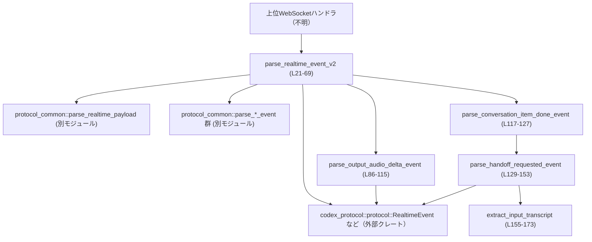
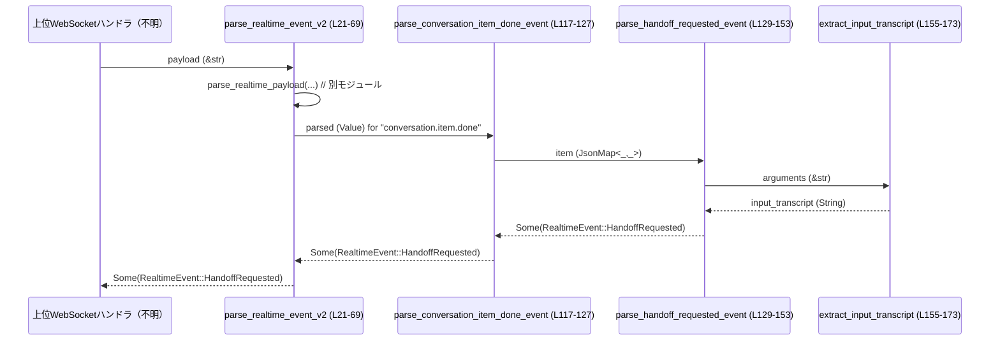

# codex-api/src/endpoint/realtime_websocket/protocol_v2.rs コード解説

## 0. ざっくり一言

WebSocket から受け取った「realtime v2」プロトコルの JSON 文字列を解析し、`codex_protocol::protocol::RealtimeEvent` に変換するための、v2 専用パーサ群です（`parse_realtime_event_v2` を入口とするユーティリティ集です）。  
（根拠: `parse_realtime_event_v2` で message_type に応じて `RealtimeEvent` を生成している `protocol_v2.rs:L21-69`）

---

## 1. このモジュールの役割

### 1.1 概要

- このモジュールは **realtime v2 WebSocket イベントの文字列ペイロード** を解析し、アプリケーション内部で扱いやすい `RealtimeEvent` に変換する役割を持ちます。  
  （`parse_realtime_event_v2` が `parse_realtime_payload` を呼び、`RealtimeEvent` を返している `protocol_v2.rs:L21-69`）
- 音声出力 (`AudioOut`)、テキスト・トランスクリプトの delta、会話アイテム完了 (`ConversationItemDone`) や handoff 要求 (`HandoffRequested`) といったイベントを個別のヘルパ関数で解析します。  
  （`match` 分岐とそれぞれのヘルパ呼び出し `protocol_v2.rs:L24-63`）

### 1.2 アーキテクチャ内での位置づけ

このファイルは「realtime_websocket」エンドポイント内で、v2 プロトコルのペイロードを解釈する層に相当します。

- 上位（呼び出し元）:
  - WebSocket 経由で文字列 `payload` を受け取るコード（このチャンクには定義がありません）
- 同階層・他モジュール:
  - `crate::endpoint::realtime_websocket::protocol_common`  
    - `parse_realtime_payload` / `parse_session_updated_event` / `parse_transcript_delta_event` / `parse_error_event` を提供  
      （`use crate::endpoint::realtime_websocket::protocol_common::...` `protocol_v2.rs:L1-4`）
- 下位（依存先）:
  - `codex_protocol::protocol` のイベント型  
    - `RealtimeEvent`, `RealtimeAudioFrame`, `RealtimeHandoffRequested`, `RealtimeInputAudioSpeechStarted`, `RealtimeResponseCreated`, `RealtimeResponseCancelled`, `RealtimeResponseDone`  
      （`use codex_protocol::protocol::...` `protocol_v2.rs:L5-11`）
  - `serde_json::Value` / `Map` を用いた JSON 解析  
    （`use serde_json::Map as JsonMap; use serde_json::Value;` `protocol_v2.rs:L12-13`）

主要な依存関係を簡略図にすると次のようになります。



### 1.3 設計上のポイント

- **シングルエントリポイント**  
  - `parse_realtime_event_v2` が v2 ペイロード解析の唯一の公開 API（`pub(super)`）になっており、内部で message type に応じて各ヘルパ関数を呼び分けます。  
    （`protocol_v2.rs:L21-69`）
- **文字列ベースのディスパッチ**  
  - `message_type` を文字列で比較して `match` し、イベント種別ごとに処理を分岐しています。  
    （`protocol_v2.rs:L24-63`）
- **エラー表現に Option を使用**  
  - 解析に失敗した場合や未対応の event type に対しては `None` を返します。  
    （`parse_realtime_event_v2` の `?` と `_ => { ...; None }` `protocol_v2.rs:L21-23,L64-67`）
  - `Result` ではなく `Option` を用いることで「パースできなかった／対応していない」という状態のみを表現しており、詳細なエラー理由は `protocol_common` 側やログ (`debug!`) で扱う設計です。
- **非パニック・防御的パース**  
  - JSON からの値取得は `get` + `and_then` + `try_from(...).ok()` + `unwrap_or` といった形で行われ、型不一致や欠損はすべて安全にデフォルト値または `None` にフォールバックします。  
    （例: `parse_output_audio_delta_event` `protocol_v2.rs:L86-115`）
  - `extract_input_transcript` でも `serde_json::from_str` の結果を `if let Ok(..)` で扱い、失敗時もパニックせず元文字列を返します。  
    （`protocol_v2.rs:L160-173`）
- **ステートレスでスレッドセーフ**  
  - グローバルな可変状態を持たない純粋な関数群で構成されており、共有可変データもありません。並行環境から同時に呼び出してもデータ競合は発生しません。
- **特定ツール（background_agent）の handoff 特別扱い**  
  - `BACKGROUND_AGENT_TOOL_NAME` 定数で `"background_agent"` を表し、その function_call アイテムだけを `RealtimeHandoffRequested` として扱う特別な経路があります。  
    （`protocol_v2.rs:L16,L129-153`）

### 1.4 コンポーネント一覧（インベントリー）

#### 関数一覧

| 名称 | 可視性 | 役割 / 用途 | 行範囲 |
|------|--------|------------|--------|
| `parse_realtime_event_v2` | `pub(super)` | v2 ペイロード文字列を解析し、対応する `RealtimeEvent` を 1 件返す（または `None`）メインエントリ | `protocol_v2.rs:L21-69` |
| `parse_response_event_response_id` | `fn` | response 系イベントから `response_id` を `Option<String>` として抽出 | `protocol_v2.rs:L71-84` |
| `parse_output_audio_delta_event` | `fn` | 音声出力 delta イベントを解析し、`RealtimeEvent::AudioOut(RealtimeAudioFrame)` を生成 | `protocol_v2.rs:L86-115` |
| `parse_conversation_item_done_event` | `fn` | `conversation.item.done` イベントを解析し、handoff か通常の `ConversationItemDone` のどちらかにマッピング | `protocol_v2.rs:L117-127` |
| `parse_handoff_requested_event` | `fn` | function_call 型アイテムから `RealtimeHandoffRequested` を構築 | `protocol_v2.rs:L129-153` |
| `extract_input_transcript` | `fn` | arguments JSON から入力テキスト候補を抽出し、handoff の `input_transcript` として利用 | `protocol_v2.rs:L155-173` |

#### 定数一覧

| 名称 | 型 | 値 / 役割 | 行範囲 |
|------|----|-----------|--------|
| `BACKGROUND_AGENT_TOOL_NAME` | `&'static str` | `"background_agent"`。handoff 対象のツール名を識別するために使用 | `protocol_v2.rs:L16` |
| `DEFAULT_AUDIO_SAMPLE_RATE` | `u32` | `24_000`。音声 delta に `sample_rate` が含まれない、または不正な場合のデフォルト | `protocol_v2.rs:L17` |
| `DEFAULT_AUDIO_CHANNELS` | `u16` | `1`。音声チャンネル数に関するデフォルト値 | `protocol_v2.rs:L18` |
| `TOOL_ARGUMENT_KEYS` | `[&str; 5]` | `["input_transcript", "input", "text", "prompt", "query"]`。handoff arguments から入力テキストを探すキー候補 | `protocol_v2.rs:L19` |

---

## 2. 主要な機能一覧

- v2 ペイロードのイベント種別判定とディスパッチ (`parse_realtime_event_v2`)  
  （`protocol_v2.rs:L21-69`）
- response 系イベントからの `response_id` 抽出 (`parse_response_event_response_id`)  
  （`protocol_v2.rs:L71-84`）
- 音声出力 delta イベントの解析と `RealtimeAudioFrame` 生成 (`parse_output_audio_delta_event`)  
  （`protocol_v2.rs:L86-115`）
- 会話アイテム完了イベントからの handoff 判定と `ConversationItemDone` 生成 (`parse_conversation_item_done_event`)  
  （`protocol_v2.rs:L117-127`）
- function_call 型 background_agent 呼び出しからの handoff イベント生成 (`parse_handoff_requested_event`)  
  （`protocol_v2.rs:L129-153`）
- handoff arguments JSON からの入力テキスト抽出 (`extract_input_transcript`)  
  （`protocol_v2.rs:L155-173`）

---

## 3. 公開 API と詳細解説

### 3.1 型一覧（構造体・列挙体など）

このファイル内で **新たに定義されている構造体・列挙体はありません**。

- 代わりに、外部クレート `codex_protocol::protocol` の型を利用しています。  
  （`RealtimeEvent`, `RealtimeAudioFrame`, `RealtimeHandoffRequested`, など `protocol_v2.rs:L5-11`）
- これらの定義はこのチャンクには含まれておらず、詳細は不明です。

### 3.2 関数詳細

#### `parse_realtime_event_v2(payload: &str) -> Option<RealtimeEvent>`

**概要**

- 「realtime v2」WebSocket メッセージのペイロード文字列を解析し、対応する `RealtimeEvent` を 1 件返します。  
- パース不能または未対応のイベントの場合は `None` を返します。  
  （`protocol_v2.rs:L21-69`）

**引数**

| 引数名 | 型 | 説明 |
|--------|----|------|
| `payload` | `&str` | WebSocket 経由で受信した v2 プロトコルのメッセージ文字列 |

**戻り値**

- `Option<RealtimeEvent>`  
  - `Some(event)`: パースに成功し、サポート対象の event type であった場合のイベントオブジェクト  
  - `None`: パースエラー、またはこの関数でサポートされていない event type の場合

**内部処理の流れ**

1. `protocol_common::parse_realtime_payload(payload, "realtime v2")` を呼び出し、  
   - パース済み JSON (`serde_json::Value`) と  
   - メッセージ種別文字列 `message_type`  
   のタプルを取得します。エラー時は `?` により `None` を返します。  
   （`protocol_v2.rs:L21-23`）
2. `match message_type.as_str()` で種別ごとの処理に分岐します。  
   （`protocol_v2.rs:L24-63`）
3. 各 event type に対して:
   - `"session.updated"` → `parse_session_updated_event(&parsed)`  
   - `"response.output_audio.delta"` / `"response.audio.delta"` → `parse_output_audio_delta_event(&parsed)`  
   - 各種 transcription delta / completed → `parse_transcript_delta_event(&parsed, "...")` を呼び、`RealtimeEvent::InputTranscriptDelta` または `RealtimeEvent::OutputTranscriptDelta` に包む  
   - `"input_audio_buffer.speech_started"` → `RealtimeInputAudioSpeechStarted` を構築  
   - `"conversation.item.added"` → `parsed["item"]` をそのまま `RealtimeEvent::ConversationItemAdded` に包む  
   - `"conversation.item.done"` → `parse_conversation_item_done_event(&parsed)`  
   - `"response.created"`, `"response.cancelled"`, `"response.done"` → `parse_response_event_response_id` で `response_id` を抽出し、それぞれ対応するイベントに包む  
   - `"error"` → `parse_error_event(&parsed)`  
4. 上記に該当しない event type の場合、`debug!` ログを出力し `None` を返します。  
   （`protocol_v2.rs:L64-67`）

**Examples（使用例）**

`payload` からイベントを 1 つパースし、種別ごとに処理する典型的な例です（呼び出し側はこのファイルと同じクレート内を想定）。

```rust
use crate::endpoint::realtime_websocket::protocol_v2::parse_realtime_event_v2;
use codex_protocol::protocol::RealtimeEvent;

// WebSocket から受信した文字列ペイロード
fn handle_payload(payload: &str) {
    if let Some(event) = parse_realtime_event_v2(payload) {
        match event {
            RealtimeEvent::AudioOut(frame) => {
                // 音声フレームを再生キューに投入するなどの処理
                // frame.data, frame.sample_rate などを参照
            }
            RealtimeEvent::ConversationItemDone { item_id } => {
                // 会話アイテムの完了処理
                // item_id を使って状態を更新
            }
            RealtimeEvent::HandoffRequested(handoff) => {
                // 別エージェントへの handoff 要求を処理
                // handoff.input_transcript などを参照
            }
            // 他のイベント型も同様に処理
            _ => { /* 必要に応じて無視またはログ出力 */ }
        }
    } else {
        // パースできなかった・未対応イベント
        // ログ出力や統計用カウンタ増加などを行うことが考えられる
    }
}
```

**Errors / Panics**

- `parse_realtime_payload` が `None` を返した場合（パース失敗など）、この関数も `None` を返します。  
  （`?` 演算子による伝播 `protocol_v2.rs:L21-23`）
- 未対応の `message_type` の場合、`debug!` ログを出して `None` を返します。  
  （`protocol_v2.rs:L64-67`）
- この関数自体は **パニックを起こしません**。全ての JSON アクセスは `Option` を介して安全に扱われています。

**Edge cases（エッジケース）**

- `payload` が不正な JSON / v2 形式である場合:
  - `parse_realtime_payload` 側でエラーとなり、`None` が返ります（このチャンクから詳細は不明）。  
- サポートされていない `message_type` の場合:
  - `debug!` ログにメッセージ種別と `payload` が出力され、`None` を返します。  
    （`protocol_v2.rs:L64-66`）
- `response.*` イベントで `response_id` が JSON に含まれない場合:
  - `parse_response_event_response_id` が `None` を返し、`response_id: None` を持つイベントが生成されると推測できます（`RealtimeResponseCreated` などの定義は他ファイルで、不明）。  
    （`protocol_v2.rs:L52-62,L71-83`）

**使用上の注意点**

- 戻り値が `Option` であり、「解析エラー」「未対応種別」を区別しません。必要であれば上位レイヤーで `payload` 文字列やログを併用して把握する必要があります。
- `pub(super)` のため、**同じモジュール階層の上位モジュールからのみ利用可能**です（クレート外公開ではありません）。  
  （`protocol_v2.rs:L21`）
- ログに `payload` 全体が出るため、`debug` レベルが本番環境で有効な場合は機密情報がログに残る可能性があります。  

---

#### `parse_response_event_response_id(parsed: &Value) -> Option<String>`

**概要**

- response 関連イベントの JSON から `response_id` を抽出するユーティリティです。  
  （`protocol_v2.rs:L71-84`）

**引数**

| 引数名 | 型 | 説明 |
|--------|----|------|
| `parsed` | `&Value` | `parse_realtime_payload` によりパースされた JSON オブジェクト |

**戻り値**

- `Option<String>`  
  - `Some(id)` : `response.id` または `response_id` が文字列で存在する場合  
  - `None` : 上記いずれも存在しない場合

**内部処理の流れ**

1. `parsed["response"]` をオブジェクトとして取得し、その中の `"id"` を文字列として取り出せれば `Some(id)` を返します。  
   （`protocol_v2.rs:L72-77`）
2. 1 が失敗した場合、`parsed["response_id"]` を文字列として取り出し、あれば `Some(id)` を返します。  
   （`protocol_v2.rs:L78-83`）
3. どちらも取得できなければ `None` を返します。

**Errors / Panics**

- すべて `Option` チェーンで記述されており、パニック要素はありません。
- `parsed` がオブジェクトでない、または型が合わないケースは `None` です。

**Edge cases**

- `response` フィールドが存在するがオブジェクトでない場合 → `None`  
- `response.id` が数値など文字列以外の場合 → `None`  
- `response` がなく `response_id` がある場合 → `Some(response_id)`  

**使用上の注意点**

- あくまで補助関数であり、この関数だけでは event type の妥当性を判断しません。  
- `None` の場合でも上位イベント (`RealtimeResponseCreated` など) は生成されるため、呼び出し側構造体のフィールド定義に注意が必要です。

---

#### `parse_output_audio_delta_event(parsed: &Value) -> Option<RealtimeEvent>`

**概要**

- 音声出力 delta イベント (`"response.output_audio.delta"` / `"response.audio.delta"`) の JSON から、`RealtimeEvent::AudioOut(RealtimeAudioFrame)` を生成します。  
  （`protocol_v2.rs:L26-28,L86-115`）

**引数**

| 引数名 | 型 | 説明 |
|--------|----|------|
| `parsed` | `&Value` | v2 ペイロードから抽出した JSON オブジェクト |

**戻り値**

- `Option<RealtimeEvent>`  
  - `Some(RealtimeEvent::AudioOut(frame))` : 必須フィールド `delta` が存在した場合  
  - `None` : `delta` が取得できなかった場合（イベントとして扱わない）

**内部処理の流れ**

1. `parsed["delta"]` を文字列として取得し、`data: String` とします。取得できなければ `None`。  
   （`protocol_v2.rs:L87-90`）
2. `sample_rate` を `u32` として取得しようとします。  
   - `parsed["sample_rate"]` を `u64` で取り出し、`u32::try_from` により安全に変換  
   - 失敗時や欠損時は `DEFAULT_AUDIO_SAMPLE_RATE` (= 24000) を使用  
   （`protocol_v2.rs:L91-95`）
3. `num_channels` を `u16` として取得します。  
   - `parsed["channels"]` または `parsed["num_channels"]` を `u64` として読み取り、`u16::try_from` で変換  
   - 失敗時や欠損時は `DEFAULT_AUDIO_CHANNELS` (= 1) を使用  
   （`protocol_v2.rs:L96-101`）
4. `samples_per_channel` はオプション値として `Option<u32>` で設定します（存在しなければ `None`）。  
   （`protocol_v2.rs:L106-109`）
5. `item_id` があれば文字列として取得し `Option<String>` として保持します。  
   （`protocol_v2.rs:L110-113`）
6. 以上を用いて `RealtimeAudioFrame` を構築し、`RealtimeEvent::AudioOut` に包んで返します。  
   （`protocol_v2.rs:L102-114`）

**Examples（使用例）**

```rust
fn handle_event(event: RealtimeEvent) {
    if let RealtimeEvent::AudioOut(frame) = event {
        // frame.data: エンコードされた音声データ（形式はこのチャンクからは不明）
        // frame.sample_rate: サンプルレート（存在しない場合は 24000Hz）
        // frame.num_channels: チャンネル数（存在しない場合は 1）
        // frame.samples_per_channel: サンプル数のヒント（あれば利用）
    }
}
```

**Errors / Panics**

- `delta` がない場合のみ `None` を返します。
- 数値フィールドの型不一致やオーバーフローは `try_from(...).ok()` と `unwrap_or` によってデフォルトへフォールバックされ、**パニックしません**。  
  （`protocol_v2.rs:L91-101`）

**Edge cases**

- `sample_rate` が `u32::MAX` より大きい数値の場合 → 変換失敗 → デフォルト値 24000 になります。  
- `channels` / `num_channels` が `u16::MAX` より大きい場合 → 変換失敗 → デフォルト値 1。  
- `samples_per_channel` が不正／欠損 → `None` となり、呼び出し元は存在チェックが必要になります。

**使用上の注意点**

- `data` は文字列として扱われているため、再生する場合は別途デコードが必要です（形式はこのチャンクからは不明）。  
- 大きな `delta` 文字列を頻繁に処理する場合、ヒープ割り当てが多くなりうるため、上位レイヤーでのバッファ再利用などの検討余地があります。

---

#### `parse_conversation_item_done_event(parsed: &Value) -> Option<RealtimeEvent>`

**概要**

- `"conversation.item.done"` イベントの JSON を解析し、  
  - background_agent の function_call であれば `RealtimeEvent::HandoffRequested`  
  - それ以外で id があれば `RealtimeEvent::ConversationItemDone { item_id }`  
  に変換します。  
  （`protocol_v2.rs:L51,L117-127`）

**引数**

| 引数名 | 型 | 説明 |
|--------|----|------|
| `parsed` | `&Value` | イベント全体の JSON |

**戻り値**

- `Option<RealtimeEvent>`  
  - `Some(RealtimeEvent::HandoffRequested(..))` : background_agent function_call のとき  
  - `Some(RealtimeEvent::ConversationItemDone { item_id })` : 通常の完了イベントのとき  
  - `None` : `item` がオブジェクトでない、または id が取れないとき

**内部処理の流れ**

1. `parsed["item"]` をオブジェクトとして取得します。失敗すれば `None`。  
   （`protocol_v2.rs:L118`）
2. `parse_handoff_requested_event(item)` を呼び出し、handoff かどうかを判定します。  
   - `Some(handoff_event)` が返れば、それを `Some` で返して終了。  
   （`protocol_v2.rs:L119-121`）
3. handoff でなかった場合、`item["id"]` を文字列として取得し `item_id` にします。  
   取得できなければ `None`。  
   （`protocol_v2.rs:L123-126`）
4. `RealtimeEvent::ConversationItemDone { item_id }` を返します。  

**Errors / Panics**

- JSON アクセスはすべて `Option` ベースであり、パニックは発生しません。

**Edge cases**

- `item` が存在しない、またはオブジェクトでない → `None`。  
- `item["type"]` が `"function_call"` かつ `"name" == "background_agent"` であっても、`call_id` がない場合 → `parse_handoff_requested_event` が `None` を返し、結果として `ConversationItemDone` の `item_id` を使用するか、id もなければ `None` になります。  

**使用上の注意点**

- handoff 機能を利用している場合、この関数が返す `RealtimeEvent::HandoffRequested` を優先的に処理する必要があります（通常の ConversationItemDone と区別されます）。
- `None` が返り得ることを前提に、上位でのハンドリング（無視するのか、エラーにするのか）を決める必要があります。

---

#### `parse_handoff_requested_event(item: &JsonMap<String, Value>) -> Option<RealtimeEvent>`

**概要**

- 会話アイテムオブジェクトが background_agent の function_call であるか判定し、該当する場合に `RealtimeHandoffRequested` を生成するヘルパです。  
  （`protocol_v2.rs:L129-153`）

**引数**

| 引数名 | 型 | 説明 |
|--------|----|------|
| `item` | `&JsonMap<String, Value>` | `"item"` フィールドのオブジェクト（事前に `as_object()` 済み） |

**戻り値**

- `Option<RealtimeEvent>`  
  - `Some(RealtimeEvent::HandoffRequested(...))` : 条件を満たした background_agent function_call の場合  
  - `None` : 条件不一致または必要情報不足の場合

**内部処理の流れ**

1. `item["type"]` と `item["name"]` を取得し、  
   - `type == "function_call"`  
   - `name == BACKGROUND_AGENT_TOOL_NAME` (`"background_agent"`)  
   の両方を満たさなければ `None`。  
   （`protocol_v2.rs:L130-133`）
2. `call_id` を  
   - `item["call_id"]`  
   - なければ `item["id"]`  
   のいずれかから文字列として取得します。いずれも無ければ `None`。  
   （`protocol_v2.rs:L136-139`）
3. `item_id` を  
   - `item["id"]` があればその文字列  
   - なければ `call_id`  
   として決定し、`String` に変換します。  
   （`protocol_v2.rs:L140-144`）
4. `arguments` を `item["arguments"]` の文字列値として取得し、なければ空文字列 `""` を用います。  
   （`protocol_v2.rs:L145`）
5. `extract_input_transcript(arguments)` を呼び出して `input_transcript` を生成し、`RealtimeHandoffRequested` 構造体を構築します。`active_transcript` は空の `Vec::new()` で初期化します。  
   （`protocol_v2.rs:L147-152`）

**Errors / Panics**

- `unwrap_or` は `Option<&str>` に対して使用されており、いずれも安全なデフォルト値を持つためパニックしません。  
  （`protocol_v2.rs:L143-145`）
- 必須情報 (`call_id`) がなければ `None` を返します。

**Edge cases**

- `type` や `name` に余分な空白や大文字小文字の違いがあるケースは、単純な文字列比較のため一致しません。  
- `arguments` が不正な JSON または空文字列の場合、`extract_input_transcript` にて JSON として扱えず、元の文字列（または空文字列）がそのまま `input_transcript` に入ります。  
  （`protocol_v2.rs:L155-173`）

**使用上の注意点**

- handoff の判定条件が `"function_call"` + `"background_agent"` にハードコードされているため、他のツール名への拡張はこの関数の変更が必要になります。
- `active_transcript` は常に空 `Vec` で初期化されており、追加情報は別の経路でセットされる前提のように見えます（このチャンクからは詳細不明）。

---

#### `extract_input_transcript(arguments: &str) -> String`

**概要**

- handoff の `arguments` 文字列から、入力テキスト（input_transcript）と思われる内容を抽出する関数です。  
- JSON 形式で `"input_transcript"` や `"input"` などのキーがあれば優先的に利用し、見つからなければ元の文字列全体を返します。  
  （`protocol_v2.rs:L155-173`）

**引数**

| 引数名 | 型 | 説明 |
|--------|----|------|
| `arguments` | `&str` | handoff 元の関数呼び出し arguments 文字列 |

**戻り値**

- `String`  
  - 抽出できた入力テキスト、または元の `arguments` 文字列（空なら空文字列）

**内部処理の流れ**

1. `arguments.is_empty()` ならば即座に `String::new()` を返します。  
   （`protocol_v2.rs:L156-158`）
2. そうでなければ、`serde_json::from_str::<Value>(arguments)` を試みます。  
   - `Ok(arguments_json)` かつ `arguments_json.as_object()` が `Some(arguments_object)` の場合のみ、続きの処理へ。  
   （`protocol_v2.rs:L160-162`）
3. `TOOL_ARGUMENT_KEYS`（`["input_transcript", "input", "text", "prompt", "query"]`）の順にキーを走査します。  
   （`protocol_v2.rs:L163-169`）
4. 各キーについて、`arguments_object[key]` を文字列として取得し、`trim()` で前後の空白を除去します。  
   - トリム後が空でなければ、それを `String` にして即座に返します。  
5. 上記で何も見つからなかった場合、または JSON パースに失敗した場合は、最後に `arguments.to_string()` を返します。  
   （`protocol_v2.rs:L172-173`）

**Examples（使用例）**

```rust
// JSON 形式の arguments から input_transcript を抽出
let args = r#"{"input_transcript": "  Hello, world!  ", "other": 123}"#;
let transcript = extract_input_transcript(args);
// transcript == "Hello, world!"

// JSON でない場合は文字列全体がそのまま返る
let args_raw = "user said: hello";
let transcript2 = extract_input_transcript(args_raw);
// transcript2 == "user said: hello"
```

**Errors / Panics**

- JSON パースに失敗しても `if let Ok(...)` で条件付き処理となっており、**パニックは発生しません**。  
- 巨大な `arguments` 文字列でも理論上処理可能ですが、`serde_json::from_str` に伴うコストは発生します。

**Edge cases**

- `"input_transcript"` が存在するが空文字や空白のみ → 次のキー候補（`"input"` など）を順番にチェックします。  
- JSON がオブジェクトではなく配列やプリミティブの場合 → そのまま `arguments.to_string()` が返ります。  
- キーが複数存在する場合 → `TOOL_ARGUMENT_KEYS` の順序が優先されます。

**使用上の注意点**

- この関数は handoff arguments の形式に強く依存しています。フォーマットが変わる場合、`TOOL_ARGUMENT_KEYS` の更新やパースロジックの変更が必要です。
- JSON でなく任意文字列が渡る可能性もあるため、抽出結果が期待と異なる場合に備え、上位レイヤーでバリデーションやログを加えることが有用です。

---

### 3.3 その他の関数

- このファイル内の関数はすべて上記で詳細を説明済みです。補助的な「その他の関数」はありません。

---

## 4. データフロー

ここでは、「`conversation.item.done` イベントで background_agent function_call が来た場合」に `RealtimeEvent::HandoffRequested` が生成されるまでの流れを示します。

### 処理の要点（handoff シナリオ）

1. 上位の WebSocket ハンドラがペイロード文字列 `payload` を受け取り、`parse_realtime_event_v2` に渡します。  
2. `parse_realtime_event_v2` が `message_type == "conversation.item.done"` を検出し、`parse_conversation_item_done_event` を呼びます。  
   （`protocol_v2.rs:L51,L117-121`）
3. `parse_conversation_item_done_event` は `item` フィールドをオブジェクトとして取得し、`parse_handoff_requested_event` に委譲して handoff 判定を行います。  
   （`protocol_v2.rs:L118-121`）
4. `parse_handoff_requested_event` は `type == "function_call"` かつ `name == "background_agent"` を満たす場合に、`call_id`, `item_id`, `arguments` を元に `RealtimeHandoffRequested` を生成します。  
   （`protocol_v2.rs:L129-153`）
5. `arguments` から `input_transcript` を抽出するために `extract_input_transcript` を呼びます。  
   （`protocol_v2.rs:L145,L147-151,L155-173`）
6. 最終的に `RealtimeEvent::HandoffRequested` が `parse_realtime_event_v2` の戻り値として呼び出し元に渡されます。

### シーケンス図



---

## 5. 使い方（How to Use）

### 5.1 基本的な使用方法

このモジュールの入口は `parse_realtime_event_v2` です。  
WebSocket メッセージ受信ループから呼び出して、`RealtimeEvent` にマッピングします。

```rust
use crate::endpoint::realtime_websocket::protocol_v2::parse_realtime_event_v2;
use codex_protocol::protocol::RealtimeEvent;

// WebSocket から文字列メッセージを受信したときに呼ばれる想定
fn on_message(payload: &str) {
    match parse_realtime_event_v2(payload) {
        Some(event) => {
            // イベント種別ごとの処理
            handle_realtime_event(event);
        }
        None => {
            // パース不能 / 未対応イベント
            // ログやメトリクスに記録するなど
        }
    }
}

fn handle_realtime_event(event: RealtimeEvent) {
    match event {
        RealtimeEvent::AudioOut(frame) => {
            // 音声出力処理
        }
        RealtimeEvent::HandoffRequested(handoff) => {
            // background_agent への handoff 処理
        }
        // 他のイベント型も必要に応じて処理
        _ => {}
    }
}
```

### 5.2 よくある使用パターン

1. **音声ストリームの連続処理**

   - WebSocket から連続する音声 delta を受け取り、`AudioOut` イベントだけを取り出して処理するパターンです。

   ```rust
   fn handle_audio_only(payload: &str) {
       if let Some(RealtimeEvent::AudioOut(frame)) = parse_realtime_event_v2(payload) {
           // frame をオーディオ出力キューに追加
       }
   }
   ```

2. **handoff イベントの専用監視**

   - 既存の会話処理とは別に、handoff 要求だけを監視する場合です。

   ```rust
   fn handle_handoff_only(payload: &str) {
       if let Some(RealtimeEvent::HandoffRequested(handoff)) = parse_realtime_event_v2(payload) {
           // handoff.handoff_id, handoff.input_transcript などを使って処理
       }
   }
   ```

### 5.3 よくある間違い

```rust
// 誤り例: None を考慮せずに unwrap してしまう
let event = parse_realtime_event_v2(payload).unwrap();
// ↑ パース不能 / 未対応イベントの場合にパニックする

// 正しい例: Option を安全に扱う
if let Some(event) = parse_realtime_event_v2(payload) {
    // event を処理
}
```

```rust
// 誤り例: すべてのイベントが必ず response_id を持つと仮定する
if let Some(RealtimeEvent::ResponseDone(done)) = parse_realtime_event_v2(payload) {
    let id = done.response_id.unwrap(); // ← None の可能性があると仮定すべき
}

// 正しい例: Option をそのまま扱う
if let Some(RealtimeEvent::ResponseDone(done)) = parse_realtime_event_v2(payload) {
    if let Some(id) = &done.response_id {
        // id がある場合の処理
    } else {
        // id がない場合の処理
    }
}
```

### 5.4 使用上の注意点（まとめ）

- **契約（Contract）とエッジケース**
  - `parse_realtime_event_v2` は「1 メッセージ → 0 または 1 イベント」というモデルです。複数イベントは発生しません。
  - 戻り値 `None` は「パースエラー」と「未対応のイベント種別」の両方を含むため、両者を区別したい場合は `debug` ログや上位レイヤーの追加情報に依存する必要があります。
  - JSON 構造が部分的に欠けていても、ほとんどのヘルパ関数はデフォルト値や `Option` で安全に扱います。

- **安全性（Rust の観点）**
  - 全関数が参照 (`&str`, `&Value` など) のみを受け取り、所有権を奪いません。呼び出し元は `payload` や JSON を継続利用できます。
  - 可変グローバル状態を持たず、内部で `unsafe` コードも使用していません。このためスレッド間で同時に呼び出してもデータ競合は発生しません。

- **セキュリティ**
  - 受信ペイロードは信頼できない入力とみなされますが、本ファイル内では JSON パースと文字列操作のみに限定されており、任意コード実行などの直接的なリスクは見られません。
  - ただし、`debug!` ログに `payload` がそのまま出力されるため、センシティブな内容がログに残る可能性があります。  
    （`protocol_v2.rs:L64-66`）

- **パフォーマンス / スケーラビリティ**
  - `parse_realtime_event_v2` 自体は軽量ですが、`extract_input_transcript` 内で `serde_json::from_str` を使った再パースが発生します。大量の handoff イベントや大型 JSON では、その分コストが増える点に注意が必要です。  
    （`protocol_v2.rs:L160-161`）
  - 音声 delta の `data` は毎回 `String` にコピーされて保持されるため、大量のデータを扱う場合は上位レイヤーでストリーム処理やバッファリングの設計が重要になります。

- **オブザーバビリティ**
  - ログは未対応 event type のみ `debug!` で出力されます。それ以外の正常系の観測（カウンタや span など）は、このチャンクからは追加されていません。
  - イベント種別やエラー統計を計測したい場合、呼び出し側でメトリクスを追加する必要があります。

---

## 6. 変更の仕方（How to Modify）

### 6.1 新しい機能を追加する場合

**例: 新しい event type `"response.some_new_type"` をサポートしたい場合**

1. **match 分岐の追加**  
   - `parse_realtime_event_v2` の `match message_type.as_str()` に新しいパターンを追加します。  
     （`protocol_v2.rs:L24-63`）

   ```rust
   "response.some_new_type" => {
       parse_some_new_type_event(&parsed)
   }
   ```

2. **ヘルパ関数の追加**  
   - 同ファイル内に `fn parse_some_new_type_event(parsed: &Value) -> Option<RealtimeEvent>` を定義し、既存のヘルパ（`parse_output_audio_delta_event` など）と同様に JSON を解析します。
3. **Option ベースの契約を維持**  
   - パースに失敗した場合や必須フィールド欠損時には `None` を返すようにし、関数がパニックしない設計を維持します。
4. **テストの追加（推奨）**
   - このチャンクにはテストコードは現れませんが、新しい event type を追加する場合は、少なくとも以下をカバーするユニットテストが望ましいです（テストファイルの場所は不明）。
     - 正常系（期待どおりの `RealtimeEvent` が生成される）
     - 必須フィールド欠損時に `None` になる
     - 型不一致時にパニックせず安全にフォールバックする

### 6.2 既存の機能を変更する場合

- **音声イベントのフォーマット変更**
  - `parse_output_audio_delta_event` を変更する際は、`DEFAULT_AUDIO_SAMPLE_RATE` / `DEFAULT_AUDIO_CHANNELS` のデフォルト値と、`try_from(...).ok().unwrap_or(...)` による安全な変換という振る舞いを壊さないよう注意が必要です。  
    （`protocol_v2.rs:L91-101`）
- **handoff 仕様の変更**
  - `background_agent` 以外のツールも handoff 対象にしたい場合:
    - `BACKGROUND_AGENT_TOOL_NAME` を配列に拡張するか、新たな判定ロジックを導入する必要があります。  
    - その際、既存クライアントとの互換性や `RealtimeHandoffRequested` の構造を考慮してください。
- **Contract の維持**
  - どの関数も「パニックしない」「不正入力時は `None` またはデフォルト値」という契約に依存しているため、`unwrap` の追加などは避けることが望ましいです。
- **テストとリグレッション**
  - このチャンクにはテストが含まれていないため、変更を行う際は既存のテストスイート（場所は不明）で `parse_realtime_event_v2` を運用上の代表的なペイロードで検証することが重要です。

---

## 7. 関連ファイル

| パス / モジュール | 役割 / 関係 |
|-------------------|------------|
| `crate::endpoint::realtime_websocket::protocol_common` | `parse_realtime_payload`, `parse_session_updated_event`, `parse_transcript_delta_event`, `parse_error_event` を提供するモジュール。このファイルから呼び出されていますが、実体（ファイルパス）はこのチャンクには現れません。`protocol_v2.rs:L1-4` |
| `codex_protocol::protocol` | `RealtimeEvent`, `RealtimeAudioFrame`, `RealtimeHandoffRequested`, `RealtimeInputAudioSpeechStarted`, `RealtimeResponseCreated`, `RealtimeResponseCancelled`, `RealtimeResponseDone` などのイベント型定義を提供する外部クレート。`protocol_v2.rs:L5-11` |
| テストコード | このチャンクには `mod tests` やテストファイルの参照は現れず、場所・有無は不明です。 |

このファイルは v2 プロトコル専用のパーサであり、v1 など他バージョンのプロトコルが存在する場合は別ファイルに実装されていると推測されますが、その詳細はこのチャンクからは分かりません。
