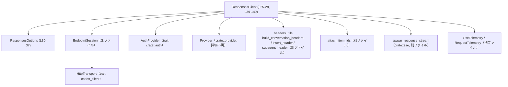
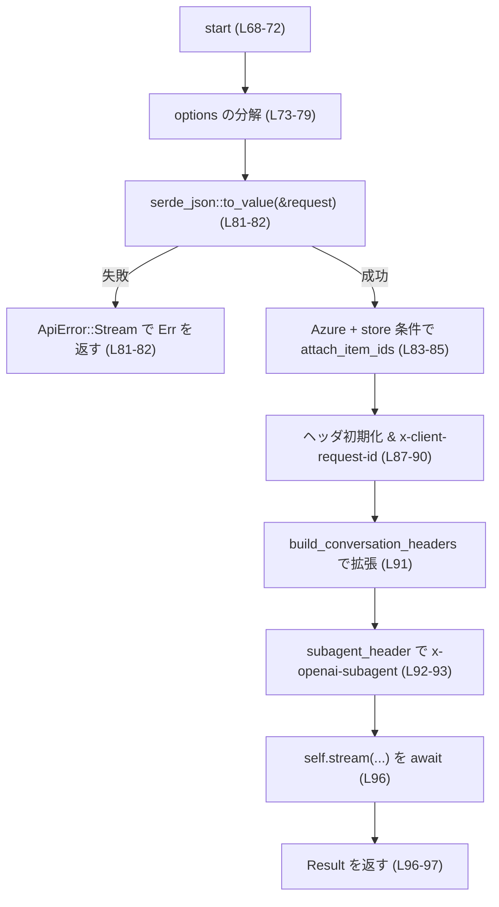
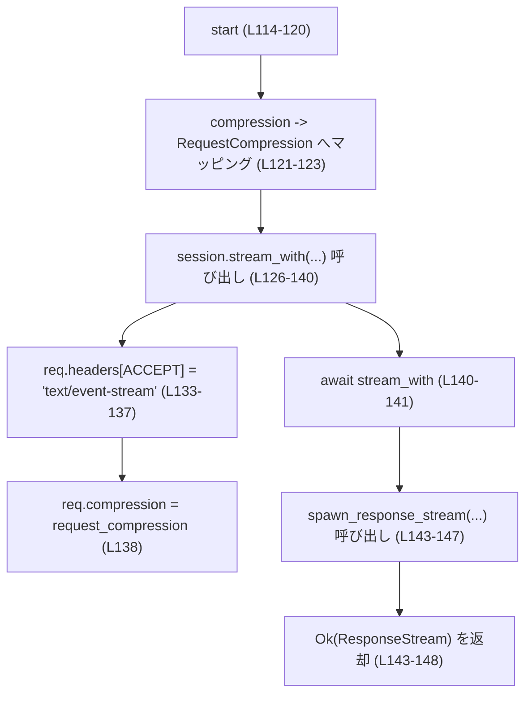
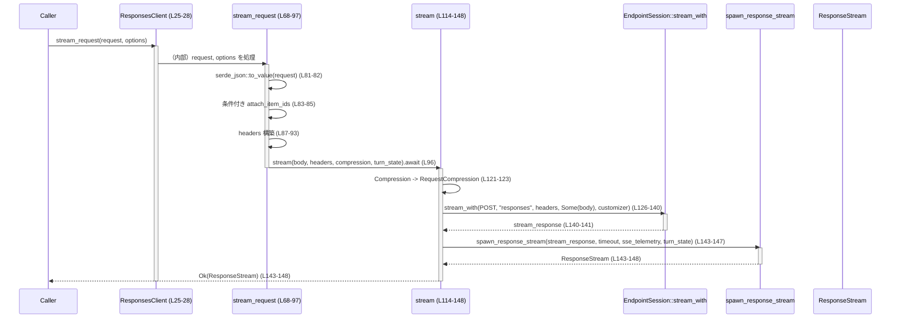

# codex-api/src/endpoint/responses.rs コード解説

---

## 0. ざっくり一言

`ResponsesClient` を通じて「responses」エンドポイントに対して **SSE（Server-Sent Events）形式のストリーミング HTTP リクエスト**を送信し、`ResponseStream` を返すためのクライアント実装です（`codex-api/src/endpoint/responses.rs:L25-L28, L39-L149`）。

---

## 1. このモジュールの役割

### 1.1 概要

- このモジュールは、`HttpTransport` と認証情報 (`AuthProvider`) を使って `EndpointSession` を構築し、  
  「responses」エンドポイントへの **ストリーミング API 呼び出し**を行うための高水準クライアントを提供します  
  （`ResponsesClient` とそのメソッド群, `codex-api/src/endpoint/responses.rs:L25-L28, L39-L149`）。
- リクエストの JSON エンコード、会話関連ヘッダの付与、圧縮設定、SSE ストリームの生成とテレメトリ連携をまとめて処理します  
  （`stream_request`, `stream`, `with_telemetry`, `codex-api/src/endpoint/responses.rs:L47-L56, L68-L97, L114-L148`）。
- 呼び出し側は `ResponsesOptions` で追加ヘッダや圧縮方式、会話 ID などを指定できるようになっています  
  （`ResponsesOptions`, `codex-api/src/endpoint/responses.rs:L30-L37`）。

### 1.2 アーキテクチャ内での位置づけ

このファイルが他コンポーネントとどうつながるかを簡略図で表します。



- `ResponsesClient::new` が `EndpointSession::new` を生成し保持します  
  （`codex-api/src/endpoint/responses.rs:L40-L44`）。
- `stream_request` はヘッダ組み立てや JSON 変換などの前処理を行った後、同じ impl 内の `stream` を呼び出します  
  （`codex-api/src/endpoint/responses.rs:L81-L96`）。
- `stream` は `EndpointSession::stream_with` を呼び出し、その返り値を `spawn_response_stream` に渡して `ResponseStream` を返します  
  （`codex-api/src/endpoint/responses.rs:L121-L148`）。

### 1.3 設計上のポイント

コードから読み取れる設計上の特徴です。

- **役割の分割**
  - `ResponsesClient` は「responses エンドポイント専用の高レベル API」として、  
    パス・ヘッダ・圧縮・テレメトリなどをまとめて扱います（`codex-api/src/endpoint/responses.rs:L25-L28, L39-L149`）。
  - 低レベルの HTTP 呼び出しは `EndpointSession::stream_with` に委譲されています  
    （`codex-api/src/endpoint/responses.rs:L126-L141`）。
- **状態管理**
  - フィールドは `EndpointSession` と `Option<Arc<dyn SseTelemetry>>` のみで、内部に明示的な可変状態はありません  
    （`codex-api/src/endpoint/responses.rs:L25-L28`）。
  - リクエスト単位のオプションは `ResponsesOptions` として値で受け取り、メソッド内で完結して使用されます  
    （`codex-api/src/endpoint/responses.rs:L30-L37, L73-L79`）。
- **エラーハンドリング**
  - JSON への変換失敗を `ApiError::Stream` にマッピングし、メッセージに詳細エラーを含めます  
    （`codex-api/src/endpoint/responses.rs:L81-L82`）。
  - `EndpointSession::stream_with` のエラーは `?` 演算子でそのまま `ApiError` として伝播します  
    （`codex-api/src/endpoint/responses.rs:L140-L141`）。
- **並行性・安全性**
  - `&self` で非同期メソッド (`stream_request`, `stream`) を提供しており、`ResponsesClient` が `Sync` であれば  
    複数タスクから同時に呼び出される前提に適合しやすい構造です（`codex-api/src/endpoint/responses.rs:L68-L72, L114-L120`）。
  - `Arc<dyn SseTelemetry>` や `Arc<OnceLock<String>>` を利用し、複数タスク・スレッド間で共有可能なテレメトリやターン状態を扱っています  
    （`codex-api/src/endpoint/responses.rs:L27, L36, L119`）。  
  - このファイル内に `unsafe` ブロックは存在しません。

---

## 2. 主要な機能一覧（コンポーネントインベントリーの概要）

このモジュールが提供する主要な機能です。

- `ResponsesClient` の生成: `new` により `HttpTransport`・`Provider`・`AuthProvider` をまとめたクライアントを生成  
  （`codex-api/src/endpoint/responses.rs:L40-L44`）。
- テレメトリ設定の付与: `with_telemetry` でリクエストおよび SSE 用のテレメトリを注入  
  （`codex-api/src/endpoint/responses.rs:L47-L55`）。
- 高レベルな streaming API 呼び出し: `stream_request` で型付きの `ResponsesApiRequest` を受け取り、
  JSON 変換・ヘッダ構築・圧縮設定を行った上で SSE ストリームを開始  
  （`codex-api/src/endpoint/responses.rs:L68-L97`）。
- 低レベルなストリーミング呼び出し: `stream` で任意の JSON `Value` とヘッダを受け取り、
  `EndpointSession::stream_with` を利用して SSE ストリームを開始  
  （`codex-api/src/endpoint/responses.rs:L114-L148`）。
- オプション管理: `ResponsesOptions` により会話 ID、セッションソース、追加ヘッダ、圧縮方式、ターン状態を一括管理  
  （`codex-api/src/endpoint/responses.rs:L30-L37`）。

---

## 3. 公開 API と詳細解説

### 3.1 型一覧（構造体）

#### 構造体インベントリー

| 名前 | 種別 | 役割 / 用途 | 定義位置 |
|------|------|-------------|----------|
| `ResponsesClient<T, A>` | 構造体（ジェネリック） | 「responses」エンドポイントへのストリーミングリクエストを送信するクライアント。内部で `EndpointSession<T, A>` を保持し、SSE テレメトリをオプションで保持します。 | `codex-api/src/endpoint/responses.rs:L25-L28` |
| `ResponsesOptions` | 構造体 | `stream_request` / `stream` 呼び出し時のオプション（会話 ID、セッションソース、追加ヘッダ、圧縮方式、ターン状態）を格納します。`Default` を実装しています。 | `codex-api/src/endpoint/responses.rs:L30-L37` |

**フィールド概要**

- `ResponsesClient<T, A>`
  - `session: EndpointSession<T, A>`: 実際の HTTP 通信と認証、ベース URL などを扱うセッション（詳細は別ファイル, `codex-api/src/endpoint/responses.rs:L26`）。
  - `sse_telemetry: Option<Arc<dyn SseTelemetry>>`: SSE ストリームに関するテレメトリ実装への共有参照（`codex-api/src/endpoint/responses.rs:L27`）。

- `ResponsesOptions`（`codex-api/src/endpoint/responses.rs:L30-L37`）
  - `conversation_id: Option<String>`: クライアント側の会話 ID。ヘッダ付与やコンテキスト管理に利用されます。
  - `session_source: Option<SessionSource>`: セッションの起点・由来を表す情報（`SessionSource` の詳細は別モジュール）。
  - `extra_headers: HeaderMap`: 追加で設定したい HTTP ヘッダ。`HeaderMap` のデフォルトは空のマップです。
  - `compression: Compression`: リクエストボディの圧縮方式（`Compression::None` / `Compression::Zstd` がこのファイルに現れます, `codex-api/src/endpoint/responses.rs:L121-L123`）。
  - `turn_state: Option<Arc<OnceLock<String>>>`: 1 ターン分の状態を共有するための `OnceLock`。`spawn_response_stream` に渡されます（`codex-api/src/endpoint/responses.rs:L36, L119, L143-L147`）。

### 3.2 関数詳細（最大 7 件）

#### 3.2.1 `ResponsesClient::new(transport: T, provider: Provider, auth: A) -> Self`

**概要**

- `HttpTransport` 実装、`Provider`、`AuthProvider` を受け取り、それらを元に `EndpointSession` を作成して `ResponsesClient` を構築します  
  （`codex-api/src/endpoint/responses.rs:L40-L44`）。

**引数**

| 引数名 | 型 | 説明 |
|--------|----|------|
| `transport` | `T`（`T: HttpTransport`） | HTTP リクエスト送信を担うトランスポート実装。詳細は `codex_client` 側です。 |
| `provider` | `Provider` | 接続先 API の種別や設定を表す型。`is_azure_responses_endpoint` や `stream_idle_timeout` などの情報を提供するようです（`codex-api/src/endpoint/responses.rs:L83, L145`）。 |
| `auth` | `A`（`A: AuthProvider`） | 認証情報を提供する実装。トークン付与などを行うと考えられますが、このファイルからは詳細不明です。 |

**戻り値**

- 新しく初期化された `ResponsesClient<T, A>`。`session` は `EndpointSession::new` で構築され、`sse_telemetry` は `None` で初期化されます  
  （`codex-api/src/endpoint/responses.rs:L41-L43`）。

**内部処理の流れ**

1. `EndpointSession::new(transport, provider, auth)` を呼び出してセッションを生成（`codex-api/src/endpoint/responses.rs:L42`）。
2. `sse_telemetry` フィールドに `None` を設定（`codex-api/src/endpoint/responses.rs:L43`）。
3. それらのフィールドを持つ `ResponsesClient` を返します。

**Examples（使用例）**

```rust
use std::sync::Arc;
use codex_client::SomeHttpTransport;             // HttpTransport を実装していると仮定
use crate::auth::SomeAuthProvider;               // AuthProvider 実装（仮）
use crate::provider::Provider;
use crate::endpoint::responses::{ResponsesClient};

// transport / provider / auth を準備する
let transport = SomeHttpTransport::new(/* ... */);          // HTTP クライアントの初期化
let provider = Provider::new(/* ... */);                    // 接続先 API の情報
let auth = SomeAuthProvider::new(/* ... */);                // 認証情報

// ResponsesClient を生成する
let client = ResponsesClient::new(transport, provider, auth); // セッションとクライアントを構築
```

**Errors / Panics**

- この関数内では `Result` や `panic!` を扱っておらず、エラーは発生しません（`codex-api/src/endpoint/responses.rs:L40-L45`）。
  実際の失敗可能性は `EndpointSession::new` の実装に依存しますが、このファイルからは不明です。

**Edge cases（エッジケース）**

- 引数が不正（例: 無効な `Provider`）な場合のエラーハンドリングは `EndpointSession::new` 側に依存し、このファイルからは分かりません。

**使用上の注意点**

- `ResponsesClient` は `new` の後に `with_telemetry` を呼び出さないと `sse_telemetry` が設定されないため、SSE テレメトリが不要な場合のみそのまま利用します（`codex-api/src/endpoint/responses.rs:L27, L40-L44, L47-L55`）。

---

#### 3.2.2 `ResponsesClient::with_telemetry(self, request: Option<Arc<dyn RequestTelemetry>>, sse: Option<Arc<dyn SseTelemetry>>) -> Self`

**概要**

- 既存の `ResponsesClient` に対して、リクエストテレメトリと SSE テレメトリを注入した新しいインスタンスを返します  
  （`codex-api/src/endpoint/responses.rs:L47-L55`）。
- 元のインスタンスは `self` のムーブにより利用できなくなります。

**引数**

| 引数名 | 型 | 説明 |
|--------|----|------|
| `self` | `Self` | 既に `new` などで作成された `ResponsesClient`。ムーブされ、ここで消費されます。 |
| `request` | `Option<Arc<dyn RequestTelemetry>>` | リクエスト単位のテレメトリ（トレース ID 付与など）を行う実装。`EndpointSession` に渡されます。 |
| `sse` | `Option<Arc<dyn SseTelemetry>>` | SSE ストリームのイベント単位でテレメトリを行う実装。`ResponsesClient` 自身に保持されます。 |

**戻り値**

- テレメトリ設定が反映された新しい `ResponsesClient<T, A>`。  
  `session` は `with_request_telemetry(request)` 結果で置き換えられ、`sse_telemetry` は引数 `sse` に設定されます  
  （`codex-api/src/endpoint/responses.rs:L52-L55`）。

**内部処理の流れ**

1. `self.session.with_request_telemetry(request)` を呼び出し、テレメトリ付きセッションに置き換えます（`codex-api/src/endpoint/responses.rs:L53`）。
2. `sse_telemetry` フィールドに `sse` をそのまま格納します（`codex-api/src/endpoint/responses.rs:L54`）。
3. それらのフィールドを持つ新しい `ResponsesClient` を返します。

**Examples（使用例）**

```rust
use std::sync::Arc;
use crate::telemetry::{RequestTelemetryImpl, SseTelemetryImpl};
use crate::endpoint::responses::ResponsesClient;

// 既存の client を前提とする
let client: ResponsesClient<_, _> = /* ResponsesClient::new(...) */;

// テレメトリ実装を Arc で包む
let request_telemetry = Arc::new(RequestTelemetryImpl::new());
let sse_telemetry = Arc::new(SseTelemetryImpl::new());

// テレメトリ設定付きのクライアントを得る
let client = client.with_telemetry(
    Some(request_telemetry),  // リクエスト単位のテレメトリ
    Some(sse_telemetry),      // SSE ストリームのテレメトリ
);
```

**Errors / Panics**

- この関数内にエラー処理や `panic!` はありません（`codex-api/src/endpoint/responses.rs:L47-L56`）。
- 実際の挙動は `EndpointSession::with_request_telemetry` に依存しますが、このファイルからは不明です。

**Edge cases**

- `request` / `sse` に `None` を渡した場合、対応するテレメトリは設定されません。元の `session`/`sse_telemetry` が上書きされるかどうかは `with_request_telemetry` の仕様次第ですが、このコードからは `session` は必ず新しい値に置き換えられることのみ分かります（`codex-api/src/endpoint/responses.rs:L52-L55`）。

**使用上の注意点**

- `self` を消費するため、チェーンでの利用が想定されています（例: `ResponsesClient::new(...).with_telemetry(...);`）。
- `ResponsesClient` を共有したい場合は、`Arc<ResponsesClient<_, _>>` などでラップした上で `with_telemetry` を呼ぶのではなく、  
  **テレメトリ設定を行ってから** 共有するほうが分かりやすい構造になります（一般的なパターンとして）。

---

#### 3.2.3 `ResponsesClient::stream_request(&self, request: ResponsesApiRequest, options: ResponsesOptions) -> Result<ResponseStream, ApiError>`

**概要**

- 型付きの `ResponsesApiRequest` を JSON にシリアライズし、必要なヘッダを追加した上で SSE ストリームを開始する高レベル API です  
  （`codex-api/src/endpoint/responses.rs:L68-L97`）。
- `ResponsesOptions` から会話 ID やセッションソース、カスタムヘッダ、圧縮設定、ターン状態を取り出して利用します。

**引数**

| 引数名 | 型 | 説明 |
|--------|----|------|
| `&self` | `&ResponsesClient<T, A>` | 共有参照。内部状態を変更せずに利用します。 |
| `request` | `ResponsesApiRequest` | responses エンドポイントへ送るリクエスト本体。`serde::Serialize` を実装している必要があります（`serde_json::to_value(&request)` から分かります, `codex-api/src/endpoint/responses.rs:L81`）。 |
| `options` | `ResponsesOptions` | 会話 ID、セッションソース、追加ヘッダ、圧縮方式、ターン状態などのオプション設定。 |

**戻り値**

- 成功時: `Ok(ResponseStream)` — SSE ストリームを表す型（詳細は別モジュール, `codex-api/src/endpoint/responses.rs:L2, L143-L148`）。
- 失敗時: `Err(ApiError)` — JSON エンコードや HTTP 呼び出しなどで発生したエラーをラップしたものです  
  （`codex-api/src/endpoint/responses.rs:L81-L82, L126-L141`）。

**内部処理の流れ**

1. `options` を分解し、個々のフィールドにバインド  
   （`conversation_id`, `session_source`, `extra_headers`, `compression`, `turn_state`, `codex-api/src/endpoint/responses.rs:L73-L79`）。
2. `serde_json::to_value(&request)` でリクエストを `serde_json::Value` に変換し、失敗時には  
   `ApiError::Stream("failed to encode responses request: {e}")` に変換して返します  
   （`codex-api/src/endpoint/responses.rs:L81-L82`）。
3. `request.store` が `true` かつ `self.session.provider().is_azure_responses_endpoint()` が `true` の場合、  
   `attach_item_ids(&mut body, &request.input)` を呼び出してボディに item ID を付与します  
   （`codex-api/src/endpoint/responses.rs:L83-L85`）。  
   - `is_azure_responses_endpoint` の詳細は `Provider` 実装に依存します。
4. `extra_headers` を `mut headers` にコピーし（ムーブ）、`conversation_id` が `Some` の場合は  
   `"x-client-request-id"` ヘッダを挿入します（`codex-api/src/endpoint/responses.rs:L87-L90`）。
5. `headers.extend(build_conversation_headers(conversation_id));` で、会話関連のヘッダを追加します  
   （`codex-api/src/endpoint/responses.rs:L91`）。
6. `subagent_header(&session_source)` が `Some(subagent)` を返した場合、  
   `"x-openai-subagent"` ヘッダを挿入します（`codex-api/src/endpoint/responses.rs:L92-L93`）。
7. 最終的な `body`, `headers`, `compression`, `turn_state` を `self.stream(...)` に渡し、その結果を `await` して返します  
   （`codex-api/src/endpoint/responses.rs:L96`）。

**Mermaid フロー図（関数内部, L68-97）**



**Examples（使用例）**

`ResponsesApiRequest` 型が既に存在し、Tokio ランタイム上で使用する例です。

```rust
use std::sync::{Arc, OnceLock};
use http::HeaderMap;
use tokio;
use crate::common::{ResponseStream, ResponsesApiRequest};
use crate::endpoint::responses::{ResponsesClient, ResponsesOptions};
use crate::requests::Compression;

#[tokio::main]
async fn main() -> Result<(), crate::error::ApiError> {
    // 事前に ResponsesClient を構築しておく
    let client: ResponsesClient<_, _> = /* ResponsesClient::new(...).with_telemetry(...); */;

    // リクエスト本体を構築（詳細は ResponsesApiRequest 定義に依存）
    let request = ResponsesApiRequest {
        // フィールドを設定...
        // store: true/false など
    };

    // オプションを設定。不要なものは Default で補う
    let options = ResponsesOptions {
        conversation_id: Some("conv-123".to_string()), // 会話 ID をヘッダなどに反映
        session_source: None,                          // セッションソースなし
        extra_headers: HeaderMap::new(),               // 追加ヘッダなし
        compression: Compression::None,                // 圧縮しない
        turn_state: Some(Arc::new(OnceLock::new())),   // ターン状態を共有したい場合
    };

    // ストリーミングリクエストを送信し、ResponseStream を得る
    let stream: ResponseStream = client.stream_request(request, options).await?;

    // stream の具体的な扱いは ResponseStream の定義に依存
    Ok(())
}
```

**Errors / Panics**

- **JSON エンコードエラー**  
  - `serde_json::to_value(&request)` が失敗すると、`ApiError::Stream` に変換され `Err` で返されます  
    （`codex-api/src/endpoint/responses.rs:L81-L82`）。
- **HTTP 呼び出しエラー**  
  - `self.stream(...)` 内の `EndpointSession::stream_with` が `Err(ApiError)` を返した場合、  
    それがそのまま呼び出し元に伝播します（`codex-api/src/endpoint/responses.rs:L126-L141, L96`）。
- 明示的な `panic!` や `unwrap` はこの関数内には存在しません（`codex-api/src/endpoint/responses.rs:L68-L97`）。

**Edge cases（エッジケース）**

- `conversation_id == None` の場合
  - `"x-client-request-id"` ヘッダは挿入されません（`codex-api/src/endpoint/responses.rs:L88-L90`）。
  - `build_conversation_headers` には `None` が渡されますが、その挙動は別ファイルに依存し、このチャンクからは分かりません。
- `session_source == None` の場合
  - `subagent_header(&session_source)` が `None` を返すと `"x-openai-subagent"` ヘッダは挿入されません  
    （`codex-api/src/endpoint/responses.rs:L92-L93`）。
- `request.store == false` または `provider().is_azure_responses_endpoint() == false` の場合
  - `attach_item_ids` は呼ばれません（`codex-api/src/endpoint/responses.rs:L83-L85`）。
- `extra_headers` にすでに `"x-client-request-id"` や `"x-openai-subagent"` が含まれる場合
  - `insert_header` の具体的な挙動（上書きするかどうか）はこのファイルからは分かりません。

**使用上の注意点**

- `ResponsesApiRequest` が `serde::Serialize` を実装している必要があります（`serde_json::to_value` の使用から分かります, `codex-api/src/endpoint/responses.rs:L81`）。
- `Azure` エンドポイントで `store == true` の場合のみ `attach_item_ids` が走るため、その条件に依存した動作（例: 監査ログ用 ID 付与）を期待する場合は注意が必要です（`codex-api/src/endpoint/responses.rs:L83-L85`）。
- このメソッドは async であり、呼び出し側は `.await` する必要があります。

---

#### 3.2.4 `ResponsesClient::path() -> &'static str`

**概要**

- 「responses」エンドポイントのパス文字列を返す内部ヘルパーです（`codex-api/src/endpoint/responses.rs:L99-L101`）。
- 現状、このパスは `EndpointSession::stream_with` の第 2 引数としてのみ使用されます（`codex-api/src/endpoint/responses.rs:L129-L130`）。

**引数**

- なし（関連する `self` もありません。関連関数です）。

**戻り値**

- `&'static str` — ハードコードされた `"responses"` という文字列を返します（`codex-api/src/endpoint/responses.rs:L100`）。

**内部処理**

- リテラル `"responses"` を返すだけです。

**Examples（使用例）**

通常は `stream` 内部でのみ利用され、外部から直接使う必要はありません。

```rust
use crate::endpoint::responses::ResponsesClient;

fn debug_path<T, A>() where T: codex_client::HttpTransport, A: crate::auth::AuthProvider {
    let path = ResponsesClient::<T, A>::path(); // "responses" が返る
    println!("Endpoint path: {}", path);
}
```

**Errors / Panics / Edge cases**

- エラー・パニック・エッジケースはありません。

**使用上の注意点**

- パスが変更になった場合、この関数のみを更新することで `stream` 呼び出しを一括修正できます。

---

#### 3.2.5 `ResponsesClient::stream(&self, body: Value, extra_headers: HeaderMap, compression: Compression, turn_state: Option<Arc<OnceLock<String>>>) -> Result<ResponseStream, ApiError>`

**概要**

- 任意の JSON `Value` とヘッダ、圧縮方式を受け取り、SSE ストリームを開始する低レベル API です  
  （`codex-api/src/endpoint/responses.rs:L114-L148`）。
- `EndpointSession::stream_with` を通じて HTTP リクエストを送信し、レスポンスを `spawn_response_stream` で SSE ストリームに変換します。

**引数**

| 引数名 | 型 | 説明 |
|--------|----|------|
| `&self` | `&ResponsesClient<T, A>` | 共有参照。内部状態は読み取りのみです。 |
| `body` | `serde_json::Value` | リクエストボディの JSON データ。すでにシリアライズ済みです。 |
| `extra_headers` | `HeaderMap` | 呼び出し元が指定した追加ヘッダ。`EndpointSession::stream_with` にそのまま渡されます（`codex-api/src/endpoint/responses.rs:L131`）。 |
| `compression` | `Compression` | リクエストボディの圧縮方式（`Compression::None` / `Compression::Zstd`）を表す列挙体。 |
| `turn_state` | `Option<Arc<OnceLock<String>>>` | SSE ストリームと共有するターン状態。`spawn_response_stream` に渡されます（`codex-api/src/endpoint/responses.rs:L119, L143-L147`）。 |

**戻り値**

- 成功時: `Ok(ResponseStream)` — ラップされた SSE ストリーム。
- 失敗時: `Err(ApiError)` — `EndpointSession::stream_with` から伝播されたエラー。

**内部処理の流れ**

1. `Compression` を `RequestCompression` に変換  
   - `Compression::None` → `RequestCompression::None`
   - `Compression::Zstd` → `RequestCompression::Zstd`  
   （`codex-api/src/endpoint/responses.rs:L121-L123`）。
2. `self.session.stream_with(...)` を呼び出し、HTTP リクエストを送信  
   - メソッド: `Method::POST`（`codex-api/src/endpoint/responses.rs:L129`）
   - パス: `Self::path()`（"responses"）（`codex-api/src/endpoint/responses.rs:L130`）
   - ヘッダ: 呼び出し元から渡された `extra_headers`（`codex-api/src/endpoint/responses.rs:L131`）
   - ボディ: `Some(body)`（`codex-api/src/endpoint/responses.rs:L132`）
   - カスタマイザクロージャ: `|req| { ... }`（`codex-api/src/endpoint/responses.rs:L133-L139`）
     - `req.headers.insert(ACCEPT, "text/event-stream")`
     - `req.compression = request_compression`
3. `stream_with` の結果 `stream_response` を `await` で受け取ります（`codex-api/src/endpoint/responses.rs:L126-L141`）。
4. `spawn_response_stream(stream_response, self.session.provider().stream_idle_timeout, self.sse_telemetry.clone(), turn_state)` を呼び出し、`ResponseStream` を生成して `Ok(...)` で返します  
   （`codex-api/src/endpoint/responses.rs:L143-L148`）。

**Mermaid フロー図（関数内部, L114-148）**



**Examples（使用例）**

`stream_request` を使わず、より低レベルに `Value` を渡す例です。

```rust
use std::sync::{Arc, OnceLock};
use http::HeaderMap;
use serde_json::json;
use crate::endpoint::responses::ResponsesClient;
use crate::requests::Compression;

async fn call_raw_stream(client: &ResponsesClient<impl codex_client::HttpTransport, impl crate::auth::AuthProvider>)
    -> Result<crate::common::ResponseStream, crate::error::ApiError>
{
    // すでに JSON になっているボディ
    let body = json!({
        "input": "hello",
        "model": "some-model",
    });

    // 必要な追加ヘッダを設定
    let mut headers = HeaderMap::new();
    // 必要があれば headers.insert(...) で設定

    let turn_state = Some(Arc::new(OnceLock::new()));

    // 低レベル API を使ってストリームを開始
    client.stream(body, headers, Compression::Zstd, turn_state).await
}
```

**Errors / Panics**

- `EndpointSession::stream_with` が `Err(ApiError)` を返すと、そのエラーが `?` によってそのまま伝播します  
  （`codex-api/src/endpoint/responses.rs:L126-L141`）。
- `HeaderValue::from_static("text/event-stream")` はコンパイル時に検証されるため、ランタイムエラーや panic は発生しません（`codex-api/src/endpoint/responses.rs:L135-L136`）。
- この関数内には `unwrap` 等のパニックを誘発するコードはありません。

**Edge cases（エッジケース）**

- `compression` が `Compression::None` の場合
  - リクエストは非圧縮で送信されます（`RequestCompression::None`, `codex-api/src/endpoint/responses.rs:L121-L123`）。
- `compression` が `Compression::Zstd` の場合
  - Zstd 圧縮されたボディが送信されます。サーバ側が対応していることが前提です。
- `extra_headers` に `ACCEPT` ヘッダが含まれていた場合
  - カスタマイザ内で再度 `ACCEPT: text/event-stream` を `insert` しているため、上書きされる可能性がありますが、  
    `HeaderMap::insert` の具体的挙動に依存します（`codex-api/src/endpoint/responses.rs:L133-L137`）。
- `turn_state == None` の場合
  - `spawn_response_stream` に `None` が渡されます。ターン状態共有がない場合の振る舞いは `spawn_response_stream` の実装に依存します  
    （`codex-api/src/endpoint/responses.rs:L143-L147`）。

**使用上の注意点**

- `body` はすでに JSON である必要があります。シリアライズの責務は呼び出し元にあります。
- `extra_headers` に SSE と相性の悪いヘッダ（例: `Accept` を別の MIME にするなど）を設定しても、  
  この関数内で `Accept: text/event-stream` に上書きされるため、SSE ストリームとして処理されます（`codex-api/src/endpoint/responses.rs:L133-L137`）。
- `turn_state` に `Arc<OnceLock<String>>` を渡す場合、ストリーム処理側で一度だけ値がセットされる前提のデータ（例: 会話のターン ID）などに適しています。  
  `OnceLock` はスレッド安全に一度だけ値を設定できる型です。

---

### 3.3 その他の関数・補助要素

このファイルには、上記 5 つ以外の関数・メソッドは存在しません。

---

## 4. データフロー

ここでは、典型的なフローである **`stream_request` → `stream` → `EndpointSession::stream_with` → `spawn_response_stream`** のデータ流れを説明します。

### 4.1 高レベルから低レベルへの流れ

1. 呼び出し側が `ResponsesClient::stream_request` を呼ぶ（`codex-api/src/endpoint/responses.rs:L68-L72`）。
2. `stream_request` が:
   - `ResponsesApiRequest` を JSON `Value` に変換し（`L81-L82`）
   - 場合によって `attach_item_ids` でボディを書き換え（`L83-L85`）
   - `extra_headers` に各種ヘッダを追加して `headers` を構成（`L87-L93`）
   - `self.stream(body, headers, compression, turn_state)` を呼び出す（`L96`）。
3. `stream` が:
   - `compression` を `RequestCompression` にマップ（`L121-L123`）
   - `self.session.stream_with(...)` を呼び出し、HTTP リクエストを送信（`L126-L140`）
   - `stream_response` を受け取り、`spawn_response_stream` に渡す（`L143-L148`）。
4. `spawn_response_stream` が:
   - 受け取った `stream_response` とタイムアウト、テレメトリ、`turn_state` を元に `ResponseStream` を組み立てる  
     （詳細は別ファイルですが、呼び出しは `L143-L148` にあります）。

### 4.2 シーケンス図（`stream_request` (L68-97) → `stream` (L114-148)）



- 図中の行番号は `codex-api/src/endpoint/responses.rs` の該当箇所です。
- このシーケンスにより、**型付きのリクエスト → JSON → HTTP ストリーム → SSE ラッパ**という変換の流れが確認できます。

---

## 5. 使い方（How to Use）

### 5.1 基本的な使用方法

もっとも典型的な使用方法は、`ResponsesClient` を初期化し、`stream_request` を呼び出して `ResponseStream` を取得する流れです。

```rust
use std::sync::{Arc, OnceLock};
use http::HeaderMap;
use tokio;
use codex_client::SomeHttpTransport;                  // HttpTransport 実装（仮）
use crate::auth::SomeAuthProvider;                    // AuthProvider 実装（仮）
use crate::provider::Provider;
use crate::common::{ResponseStream, ResponsesApiRequest};
use crate::endpoint::responses::{ResponsesClient, ResponsesOptions};
use crate::requests::Compression;

#[tokio::main]
async fn main() -> Result<(), crate::error::ApiError> {
    // 1. 依存オブジェクトを用意する
    let transport = SomeHttpTransport::new(/* ... */); // HTTP クライアント
    let provider = Provider::new(/* ... */);           // 接続先 API の情報
    let auth = SomeAuthProvider::new(/* ... */);       // 認証情報

    // 2. ResponsesClient を初期化する
    let client = ResponsesClient::new(transport, provider, auth); // (L40-44)

    // 3. 必要ならテレメトリを設定する
    let client = client.with_telemetry(
        None,                          // リクエストテレメトリ（未設定）
        None,                          // SSE テレメトリ（未設定）
    );                                 // (L47-55)

    // 4. リクエストとオプションを用意する
    let request = ResponsesApiRequest {
        // フィールドの設定（型定義に依存）
    };

    let options = ResponsesOptions {
        conversation_id: Some("conv-1".to_string()),
        session_source: None,
        extra_headers: HeaderMap::new(),
        compression: Compression::None,
        turn_state: Some(Arc::new(OnceLock::new())),
    };                                  // (L30-37)

    // 5. ストリーミングリクエストを送信する
    let stream: ResponseStream = client.stream_request(request, options).await?; // (L68-97)

    // 6. stream の処理（詳細は ResponseStream の定義に依存）
    Ok(())
}
```

### 5.2 よくある使用パターン

1. **高レベル API のみを使うパターン（`stream_request`）**
   - 型付きリクエスト + `ResponsesOptions` を渡すだけで、JSON 変換とヘッダ設定が自動的に行われます。  
     ユースケース: 通常のアプリケーションコードから responses エンドポイントを叩く。

2. **低レベル API を使うパターン（`stream`）**
   - すでに JSON `Value` を持っている場合や、別のシリアライズ方法を使いたい場合に便利です。
   - ユースケース: 中間層ライブラリから、細かくヘッダとボディを制御したい場合。

```rust
// 既に serde_json::Value を持っているケース（L114-148）
use serde_json::json;
use http::HeaderMap;
use crate::endpoint::responses::ResponsesClient;
use crate::requests::Compression;

async fn use_low_level(client: &ResponsesClient<impl codex_client::HttpTransport, impl crate::auth::AuthProvider>)
    -> Result<(), crate::error::ApiError>
{
    let body = json!({ "input": "hello", "model": "..." }); // 任意の JSON
    let headers = HeaderMap::new();                         // 必要なら挿入
    let stream = client.stream(body, headers, Compression::Zstd, None).await?;
    // stream の利用...
    Ok(())
}
```

1. **テレメトリ付きクライアントを共有するパターン**

```rust
use std::sync::Arc;
use crate::endpoint::responses::ResponsesClient;
use crate::telemetry::{RequestTelemetryImpl, SseTelemetryImpl};

fn build_shared_client() -> Arc<ResponsesClient<impl codex_client::HttpTransport, impl crate::auth::AuthProvider>> {
    let raw_client = ResponsesClient::new(/* transport */, /* provider */, /* auth */);
    let client = raw_client.with_telemetry(
        Some(Arc::new(RequestTelemetryImpl::new())),
        Some(Arc::new(SseTelemetryImpl::new())),
    );
    Arc::new(client)
}
```

### 5.3 よくある間違い

このファイルから推測できる、起こりがちな誤用例とその対比です。

```rust
use crate::endpoint::responses::{ResponsesClient, ResponsesOptions};
use crate::requests::Compression;
use http::HeaderMap;

// 間違い例: ResponsesOptions を未初期化のまま使おうとする（コンパイルエラー）
fn wrong_usage(client: &ResponsesClient<_, _>, request: crate::common::ResponsesApiRequest) {
    // let options: ResponsesOptions; // 未初期化

    // コンパイルエラー: options が未初期化
    // let _ = client.stream_request(request, options);
}

// 正しい例: Default またはフィールド指定で初期化する
fn correct_usage(client: &ResponsesClient<_, _>, request: crate::common::ResponsesApiRequest) {
    let options = ResponsesOptions {
        extra_headers: HeaderMap::new(),      // 必須フィールドを明示的に設定
        compression: Compression::None,
        ..Default::default()                  // それ以外は Default（L30: #[derive(Default)]）
    };
    // async コンテキスト内で .await する必要がある
    // let _ = client.stream_request(request, options).await;
}
```

他の誤用パターンとして：

- **`.await` の付け忘れ**: `stream_request` / `stream` は async 関数なので `.await` が必須です（付けないとコンパイルエラー）。
- **`ResponseStream` を drop してしまう**: 取得した `ResponseStream` をすぐに破棄すると、ストリームイベントが処理されないまま終わってしまう可能性があります。

### 5.4 使用上の注意点（まとめ）

- `stream_request` / `stream` は **非同期関数**であり、適切な async ランタイム（Tokio など）が必要です。
- `Compression::Zstd` を選択した場合、クライアント側での圧縮処理の CPU コストと、サーバ側での解凍サポートを考慮する必要があります（`codex-api/src/endpoint/responses.rs:L121-L123`）。
- `extra_headers` に指定したヘッダはそのまま送信されますが、`Accept` ヘッダだけは `text/event-stream` に上書きされる点に注意してください（`codex-api/src/endpoint/responses.rs:L133-L137`）。
- `turn_state` の `OnceLock` は、一度だけセットされる前提の情報を共有するための仕組みであり、複数回セットしようとするとエラーになる可能性があります（`OnceLock` の仕様による）。

---

## 6. 変更の仕方（How to Modify）

### 6.1 新しい機能を追加する場合

**例: `ResponsesOptions` に新しいオプションフィールドを追加し、ヘッダに反映させる**

1. `ResponsesOptions` にフィールドを追加する  
   - 例: `pub user_agent: Option<String>,` を追加（`codex-api/src/endpoint/responses.rs:L30-L37` 付近）。
   - `#[derive(Default)]` を維持するためには、追加フィールドも `Default` を実装している必要があります。

2. `stream_request` の `let ResponsesOptions { ... } = options;` に新フィールドを追加する  
   （`codex-api/src/endpoint/responses.rs:L73-L79`）。

3. ヘッダ構築部分で新フィールドを利用する  
   - 例: `if let Some(ua) = &user_agent { insert_header(&mut headers, "User-Agent", ua); }` のように追加  
     （`codex-api/src/endpoint/responses.rs:L87-L93` 付近）。

4. 必要であれば `#[instrument(...)]` の `fields` にも新しい情報を追加して、トレーシングに反映させる  
   （`codex-api/src/endpoint/responses.rs:L58-L66, L103-L112`）。

### 6.2 既存の機能を変更する場合

- **エンドポイントパスを変更したい場合**
  - `ResponsesClient::path` の戻り値のみを変更すれば、`stream` からの呼び出しに一括で反映されます  
    （`codex-api/src/endpoint/responses.rs:L99-L101, L129-L130`）。

- **圧縮方式に新しいバリアントを追加したい場合**
  - `Compression` 列挙体（別ファイル）に新バリアントを追加し、それに対応する `RequestCompression` へのマッピングを  
    `stream` の `match compression` に追加する必要があります（`codex-api/src/endpoint/responses.rs:L121-L123`）。
  - 新バリアントに対するサーバ側対応も別途必要です。

- **ヘッダロジックを変更したい場合**
  - `stream_request` のヘッダ構築部分（`codex-api/src/endpoint/responses.rs:L87-L93`）を確認し、  
    `build_conversation_headers` / `insert_header` / `subagent_header` の役割を理解した上で変更します。
  - これらは別モジュールに定義されているため、挙動の詳細をそちらで確認する必要があります。

- **影響範囲確認**
  - `ResponsesClient` を利用している呼び出し元コード（他モジュール）で、`ResponsesOptions` の新フィールドが必須になっていないか、
    シグネチャが変わっていないかを確認する必要があります。

---

## 7. 関連ファイル

このモジュールと密接に関係する型・関数はすべて他モジュールからインポートされています。

| パス / シンボル | 役割 / 関係 |
|----------------|------------|
| `crate::endpoint::session::EndpointSession` | 実際の HTTP 通信とエンドポイント呼び出しを行うセッション。`ResponsesClient` はこれを内部に保持し、`stream_with` を通じてストリーミングリクエストを送信します（`codex-api/src/endpoint/responses.rs:L4, L26, L126-L141`）。 |
| `crate::common::ResponsesApiRequest` | `stream_request` の高レベル引数となるリクエスト型。`serde::Serialize` を実装している必要があります（`codex-api/src/endpoint/responses.rs:L3, L81`）。 |
| `crate::common::ResponseStream` | SSE レスポンスのストリームを表す型と推測されますが、このチャンクには定義がなく詳細は不明です（`codex-api/src/endpoint/responses.rs:L2, L72, L120`）。 |
| `crate::requests::Compression` | リクエストボディの圧縮方式を表す列挙体。ここでは `None` と `Zstd` が使われています（`codex-api/src/endpoint/responses.rs:L7, L35, L77, L118, L121-L123`）。 |
| `crate::requests::attach_item_ids` | Azure responses エンドポイントかつ `request.store` が true のときに、ボディに item ID を付与する関数です（`codex-api/src/endpoint/responses.rs:L8, L83-L85`）。 |
| `crate::requests::headers::build_conversation_headers` | 会話 ID に基づくヘッダを生成するユーティリティ。`headers.extend(...)` で利用されています（`codex-api/src/endpoint/responses.rs:L9, L91`）。 |
| `crate::requests::headers::insert_header` | ヘッダマップに文字列ベースのヘッダを挿入するユーティリティ。`x-client-request-id` や `x-openai-subagent` の設定に使われます（`codex-api/src/endpoint/responses.rs:L10, L89, L93`）。 |
| `crate::requests::headers::subagent_header` | `SessionSource` からサブエージェント用ヘッダの値（文字列）を生成するユーティリティです（`codex-api/src/endpoint/responses.rs:L11, L92`）。 |
| `crate::sse::spawn_response_stream` | `EndpointSession::stream_with` の返り値を `ResponseStream` に変換し、SSE の idle timeout やテレメトリ、`turn_state` を考慮したストリームを生成する関数です（`codex-api/src/endpoint/responses.rs:L12, L143-L148`）。 |
| `crate::telemetry::SseTelemetry` | SSE ストリームのテレメトリ用トレイト。`ResponsesClient` が `Arc<dyn SseTelemetry>` として保持します（`codex-api/src/endpoint/responses.rs:L13, L27, L50, L54, L146`）。 |
| `codex_client::HttpTransport` | HTTP トランスポートを抽象化するトレイト。`ResponsesClient` のジェネリック境界として使用されます（`codex-api/src/endpoint/responses.rs:L14, L25, L39`）。 |
| `codex_client::RequestCompression` | 基盤クライアント側で理解される圧縮設定。`Compression` とのマッピングに使用されます（`codex-api/src/endpoint/responses.rs:L15, L121-L123, L138`）。 |
| `codex_client::RequestTelemetry` | リクエスト単位のテレメトリ用トレイト。`EndpointSession::with_request_telemetry` に渡されています（`codex-api/src/endpoint/responses.rs:L16, L49, L53`）。 |
| `codex_protocol::protocol::SessionSource` | セッションの由来を表す型。サブエージェントヘッダ生成に利用されます（`codex-api/src/endpoint/responses.rs:L17, L33, L75, L92`）。 |
| `crate::error::ApiError` | API 呼び出しで発生したエラーを表す型。JSON エンコードエラーや `stream_with` のエラーをラップします（`codex-api/src/endpoint/responses.rs:L5, L72, L82, L120, L141`）。 |

---

### Bugs / Security / Tests / Performance に関する補足

- **明示的なバグ候補**
  - このチャンクからは、直ちに誤動作につながるロジックの不整合は確認できません。
- **セキュリティ観点**
  - ヘッダ値やボディは呼び出し元からの入力をほぼそのまま使用するため、  
    X-Client-ID 等に機密情報を含めるかどうかは呼び出し側のポリシーに依存します。
  - このファイルには入力サニタイズ処理はなく、役割としてもその責務は持っていないと考えられます。
- **テスト**
  - このファイル内にテストコード（`#[cfg(test)]` など）は存在しません。
- **パフォーマンス / スケーラビリティ**
  - SSE によるストリーミングは長時間接続を前提とするため、`stream_idle_timeout` の設定値（`Provider` から取得）が  
    負荷やタイムアウト挙動に大きく影響します（`codex-api/src/endpoint/responses.rs:L145`）。
  - Zstd 圧縮を使う場合、CPU 負荷とネットワーク帯域のトレードオフがあります（`codex-api/src/endpoint/responses.rs:L121-L123`）。

この範囲を超える詳細（`EndpointSession`・`spawn_response_stream`・各ユーティリティ関数の内部挙動など）は、  
このチャンクには現れないため不明です。
