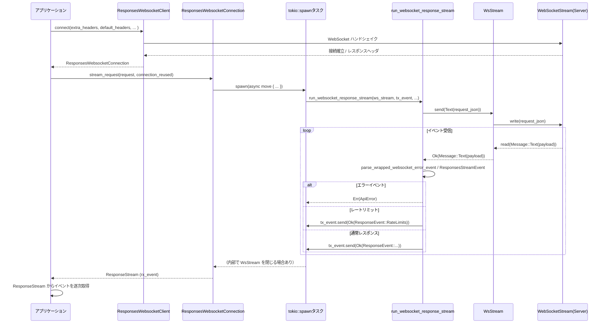

# codex-api/src/endpoint/responses_websocket.rs コード解説

## 0. ざっくり一言

`responses` エンドポイント向けの **WebSocket クライアント**を実装し、接続確立・リクエスト送信・ストリーミングレスポンスのパース・エラーマッピング・テレメトリ通知をまとめて扱うモジュールです。

---

## 1. このモジュールの役割

### 1.1 概要

このモジュールは **Codex API の「responses」ストリーミング API を WebSocket で扱うためのクライアントレイヤ**です。

- `ResponsesWebsocketClient` が WebSocket 接続を張り、認証ヘッダや TLS 設定を適用します。
- `ResponsesWebsocketConnection` が 1 本の WebSocket 接続をラップし、`ResponsesWsRequest` を送信して `ResponseEvent` のストリームを返します。
- 内部では `WsStream` が `tokio_tungstenite::WebSocketStream` をバックグラウンドタスク＋チャネルでラップし、安全に送受信を多重化します。
- サーバからの JSON イベントは `ResponsesStreamEvent` → `ResponseEvent` へ変換され、レートリミット情報やエラーも適切にマッピングされます。

### 1.2 アーキテクチャ内での位置づけ

このモジュール周辺の主な依存関係は次のようになります（依存方向のみを簡略化しています）。

```mermaid
graph TD
  App["アプリケーションコード"] --> Client["ResponsesWebsocketClient"]
  Client -->|connect()| Connection["ResponsesWebsocketConnection"]
  Connection -->|stream_request() (spawn)| Runner["run_websocket_response_stream"]
  Runner -->|send/next| WsStream["WsStream (内部ラッパ)"]
  WsStream -->|I/O| Tng["tokio_tungstenite::WebSocketStream"]
  Runner -->|parse| SSE["ResponsesStreamEvent / process_responses_event<br/>(crate::sse)"]
  Runner -->|send| RespStream["ResponseStream<br/>(crate::common)"]
  Runner -->|telemetry| Telemetry["WebsocketTelemetry<br/>(crate::telemetry)"]
  Runner -->|rate limit| Rate["parse_rate_limit_event<br/>(crate::rate_limits)"]
```

- 認証は `AuthProvider` / `add_auth_headers_to_header_map`（`crate::auth`）に委譲されています。
- HTTP/ネットワークレベルのエラーは `TransportError` / `ApiError`（`crate::error`）に変換されます。
- TLS 周りは `codex_client::maybe_build_rustls_client_config_with_custom_ca` と `codex_utils_rustls_provider::ensure_rustls_crypto_provider` で設定されます。

### 1.3 設計上のポイント

コードから読み取れる設計上の特徴を挙げます。

- **コネクション共有と逐次利用**
  - 1 本の WebSocket を `ResponsesWebsocketConnection` でラップし、`Arc<Mutex<Option<WsStream>>>` で複数タスクから安全に共有しています。
  - `stream_request` ごとにタスクを spawn しますが、内部の `WsStream` へのアクセスは `Mutex` により **同時に 1 リクエストだけ**に制限されています。

- **送受信の分離**
  - `WsStream` が `tokio::mpsc` / `oneshot` チャネルを使い、
    - 上位からは `send(Message)` / `next()` の APIだけを提供
    - 内部の WebSocket I/O はバックグラウンドタスクで処理
  - これにより、`run_websocket_response_stream` は「チャネルを介してメッセージを扱うだけ」の形になり、所有権や同時実行の複雑さが隠蔽されています。

- **エラーハンドリングの統一**
  - WebSocket ライブラリの `WsError` や HTTP ハンドシェイクエラーは `map_ws_error` で `ApiError` / `TransportError` に変換されます。
  - WebSocket テキストペイロード内の「ラップされたエラーイベント」（`WrappedWebsocketErrorEvent`）も `ApiError` にマッピングされます（再試行可能エラー含む）。

- **タイムアウトとアイドル監視**
  - 各レスポンス待ちで `tokio::time::timeout(idle_timeout, ws_stream.next())` を使用し、一定時間メッセージが来なければ `ApiError::Stream("idle timeout…")` で打ち切ります。
  - コネクションのアイドル状態自体を監視する機能はなく、「リクエスト中のアイドル時間」のみ制御しています。

- **テレメトリ・トレース**
  - `#[instrument]` 属性と `tracing` のログ（`info!`, `debug!`, `trace!`, `error!`）で呼び出し状況を観測可能です。
  - `WebsocketTelemetry` トレイトで、リクエスト単位・イベント単位のメトリクスを注入できる拡張ポイントがあります。

---

## 2. 主要な機能一覧

このモジュールが提供する主な機能は次の通りです。

- WebSocket 接続確立 (`ResponsesWebsocketClient::connect`)
- WebSocket コネクションオブジェクト（`ResponsesWebsocketConnection`）の提供と再利用
- `ResponsesWsRequest` の送信と `ResponseEvent` ストリームの生成 (`stream_request`)
- WebSocket メッセージ送受信のラップ (`WsStream`)
  - Ping/Pong 応答、Close ハンドリング
- WebSocket エラー・HTTP エラーの `ApiError` へのマッピング
  - ハンドシェイクエラー (`map_ws_error`)
  - ラップされた JSON エラーイベント (`parse_wrapped_websocket_error_event` / `map_wrapped_websocket_error_event`)
- レートリミットイベントの検出と `ResponseEvent::RateLimits` への変換
- モデル情報・ETag・推論含有フラグのヘッダからの抽出
- リクエスト／イベント単位の WebSocket テレメトリ呼び出し
- リクエストヘッダのマージロジック (`merge_request_headers`)
- WebSocket 圧縮設定（`permessage_deflate`）

---

## 3. 公開 API と詳細解説

### 3.1 型一覧（構造体・列挙体など）

行番号は元コードに付与されておらず、この環境から厳密な値は取得できません。そのため、以下では型名と役割のみを示します（位置はファイル内の出現順です）。

| 名前 | 種別 | 公開範囲 | 役割 / 用途 |
|------|------|----------|-------------|
| `WsStream` | 構造体 | モジュール内（非 `pub`） | `WebSocketStream<MaybeTlsStream<TcpStream>>` をバックグラウンドタスク＋チャネルでラップし、`send` / `next` API を提供します。 |
| `WsCommand` | 列挙体 | モジュール内 | `WsStream` の内部コマンド（現在は `Send` のみ）を表します。 |
| `ResponsesWebsocketConnection` | 構造体 | `pub` | 1 本の WebSocket 接続を表し、`stream_request` でリクエストをストリーミングします。 |
| `ResponsesWebsocketClient<A>` | 構造体 | `pub` | `Provider` と `AuthProvider` を保持し、`connect` で `ResponsesWebsocketConnection` を作成します。 |
| `WrappedWebsocketError` | 構造体 | モジュール内（`Deserialize`） | ラップされたエラーイベント内の `error` フィールド（`code` と `message`）を表します。 |
| `WrappedWebsocketErrorEvent` | 構造体 | モジュール内（`Deserialize`） | WebSocket テキストペイロード内のエラーイベント（`type`, `status`, `error`, `headers`）を表します。 |

主な定数:

- `X_CODEX_TURN_STATE_HEADER`: `"x-codex-turn-state"`
- `X_MODELS_ETAG_HEADER`: `"x-models-etag"`
- `X_REASONING_INCLUDED_HEADER`: `"x-reasoning-included"`
- `OPENAI_MODEL_HEADER`: `"openai-model"`
- `WEBSOCKET_CONNECTION_LIMIT_REACHED_CODE` / `_MESSAGE`: コネクション時間制限エラーのコード／メッセージ

### 3.2 関数詳細（重要な 7 件）

#### 1. `ResponsesWebsocketClient::connect(...) -> Result<ResponsesWebsocketConnection, ApiError>`

**概要**

`Provider` と `AuthProvider` を使って `responses` 用 WebSocket へ接続し、そのコネクションをラップした `ResponsesWebsocketConnection` を返します。

**シグネチャ（要約）**

```rust
pub async fn connect(
    &self,
    extra_headers: HeaderMap,
    default_headers: HeaderMap,
    turn_state: Option<Arc<OnceLock<String>>>,
    telemetry: Option<Arc<dyn WebsocketTelemetry>>,
) -> Result<ResponsesWebsocketConnection, ApiError>
```

**引数**

| 引数名 | 型 | 説明 |
|--------|----|------|
| `extra_headers` | `HeaderMap` | 呼び出し元が追加したいヘッダ。`provider.headers` より優先されます。 |
| `default_headers` | `HeaderMap` | 値が未設定のヘッダにだけ適用されるデフォルトヘッダ。 |
| `turn_state` | `Option<Arc<OnceLock<String>>>` | サーバから返される `x-codex-turn-state` ヘッダを 1 回だけ格納するための共有状態。 |
| `telemetry` | `Option<Arc<dyn WebsocketTelemetry>>` | WebSocket テレメトリコールバック（リクエスト時間やイベント計測用）。 |

**戻り値**

- `Ok(ResponsesWebsocketConnection)`  
  WebSocket 接続に成功し、コネクションオブジェクトが作成された場合。
- `Err(ApiError)`  
  URL 構築、TLS 設定、接続、ハンドシェイク等でエラーが発生した場合。

**内部処理の流れ**

1. `Provider::websocket_url_for_path("responses")` を呼び出し、`ws_url` を生成します。失敗時は `ApiError::Stream("failed to build websocket URL: ...")` に変換。
2. `merge_request_headers(&self.provider.headers, extra_headers, default_headers)` でヘッダをマージします。
3. `add_auth_headers_to_header_map(&self.auth, &mut headers)` で認証ヘッダを追加します。
4. `connect_websocket(ws_url, headers, turn_state.clone()).await` で実際に WebSocket 接続を張ります。
5. 戻り値 `(stream, server_reasoning_included, models_etag, server_model)` を使って `ResponsesWebsocketConnection::new(...)` を呼び出し、`idle_timeout` には `self.provider.stream_idle_timeout` が渡されます。
6. 成功した `ResponsesWebsocketConnection` を `Ok` で返します。

**Examples（使用例・擬似コード）**

```rust
// provider と auth の具体的な型はこのチャンクにはないため擬似コードです。
let provider: Provider = /* ... */;
let auth: impl AuthProvider = /* ... */;

let client = ResponsesWebsocketClient::new(provider, auth);

let extra_headers = HeaderMap::new();      // 追加ヘッダがなければ空でOK
let default_headers = HeaderMap::new();    // デフォルトヘッダも同様
let turn_state = Some(Arc::new(OnceLock::new()));

let telemetry: Option<Arc<dyn WebsocketTelemetry>> = None; // テレメトリ不要の場合

let conn = client
    .connect(extra_headers, default_headers, turn_state, telemetry)
    .await?;
```

**Errors / Panics**

- `websocket_url_for_path` が失敗すると `ApiError::Stream("failed to build websocket URL: ...")`。
- `maybe_build_rustls_client_config_with_custom_ca` が失敗すると `ApiError::Stream("failed to configure websocket TLS: ...")`。
- `connect_async_tls_with_config` の失敗は `map_ws_error` により
  - HTTP ステータス付きエラー (`ApiError::Transport(TransportError::Http { .. })`)
  - ネットワークエラー (`ApiError::Transport(TransportError::Network(..))`)
  にマップされます。
- パニック要因はコード上明示されておらず、`unwrap` 等も使用していません。

**Edge cases（エッジケース）**

- `extra_headers` や `default_headers` に同じヘッダ名がある場合の優先順位は
  - `extra_headers` > `provider.headers` > `default_headers`
  となります（`merge_request_headers` の処理とテストより）。
- `turn_state` が `Some` でも、サーバが `x-codex-turn-state` ヘッダを返さない場合は `OnceLock` は設定されません。
- `turn_state` がすでに `set` 済みの場合、`set()` はエラーを返しますが、戻り値は無視されるため「最初に成功した値」が保持される実装になっています。

**使用上の注意点**

- `connect` 自体は WebSocket 接続のみを張り、リクエストは送りません。送信は `ResponsesWebsocketConnection::stream_request` で行われます。
- 接続確立後に `ResponsesWebsocketConnection` を再利用する設計になっているため、頻繁に `connect` し直すとオーバーヘッドが増えます。
- TLS 設定やカスタム CA を利用する場合は、`maybe_build_rustls_client_config_with_custom_ca` に依存するため、その設定値のライフサイクルに注意が必要です。

---

#### 2. `ResponsesWebsocketConnection::stream_request(...) -> Result<ResponseStream, ApiError>`

**概要**

既存の WebSocket コネクションを使って 1 つの `ResponsesWsRequest` を送信し、`ResponseEvent` のストリームラッパ `ResponseStream` を返します。処理本体は内部で `tokio::spawn` されたタスク（`run_websocket_response_stream`）が行います。

**シグネチャ（要約）**

```rust
pub async fn stream_request(
    &self,
    request: ResponsesWsRequest,
    connection_reused: bool,
) -> Result<ResponseStream, ApiError>
```

**引数**

| 引数名 | 型 | 説明 |
|--------|----|------|
| `request` | `ResponsesWsRequest` | 送信するレスポンス API のリクエスト。シリアライズして WebSocket テキストメッセージになります。 |
| `connection_reused` | `bool` | このコネクションが再利用されているかどうか。テレメトリ用に `run_websocket_response_stream` に渡されます。 |

**戻り値**

- `Ok(ResponseStream)`  
  イベント受信用のチャネルをラップしたストリーム。内部タスクがバックグラウンドで WebSocket を処理します。
- `Err(ApiError)`  
  リクエストの JSON 変換に失敗した場合など、開始時点で致命的なエラーが発生した場合。

**内部処理の流れ**

1. `mpsc::channel::<Result<ResponseEvent, ApiError>>(1600)` を作成し、送信用 `tx_event` と受信用 `rx_event` を得ます。
2. `request` を `serde_json::to_value(&request)` で `serde_json::Value` に変換します。失敗すると即 `Err(ApiError::Stream("failed to encode websocket request: ..."))`。
3. `server_model`, `models_etag`, `server_reasoning_included`, `telemetry`, `idle_timeout` などのフィールドをローカルにクローンします。
4. 現在のトレーススパンを取得し、`tokio::spawn` で非同期タスクを起動します。このタスク内では:
   - 事前に、サーバモデル / ETag / 推論フラグを `ResponseEvent::ServerModel`, `ResponseEvent::ModelsEtag`, `ResponseEvent::ServerReasoningIncluded(true)` として `tx_event` に送信します（存在する場合）。
   - `stream.lock().await` で `Arc<Mutex<Option<WsStream>>>` をロックし、`WsStream` が存在しない場合は `ApiError::Stream("websocket connection is closed")` をイベントとして送信して終了します。
   - 存在する場合は `run_websocket_response_stream(...)` を呼び出し、リクエスト送信〜レスポンス読み取りを行います。
   - `run_websocket_response_stream` が `Err(err)` を返した場合は:
     - `guard.take()` で `WsStream` を `None` にし、コネクションを論理的にクローズします。
     - `WsStream` の Drop によりバックグラウンドタスクが `abort()` されます。
     - エラーを `tx_event` に `Err(err)` として送信します。
5. 呼び出し側には `Ok(ResponseStream { rx_event })` を返します。

**Examples（使用例・擬似コード）**

`ResponseStream` の具体的な API はこのチャンクには現れないため、「`next().await` でイベントを一つずつ取得できる」と仮定した擬似コードです。

```rust
let request: ResponsesWsRequest = /* ... */;
let connection_reused = false;

let response_stream = conn.stream_request(request, connection_reused).await?;

// 疑似コード: ResponseStream に next() があると仮定
while let Some(result) = response_stream.next().await {
    match result {
        Ok(event) => {
            match event {
                ResponseEvent::Completed { .. } => {
                    // 完了
                    break;
                }
                ResponseEvent::RateLimits(snapshot) => {
                    // レートリミット情報の処理
                }
                other => {
                    // 他のイベント種別の処理
                }
            }
        }
        Err(err) => {
            eprintln!("stream error: {err}");
            break;
        }
    }
}
```

**Errors / Panics**

- リクエストの `serde_json::to_value` 失敗時に `ApiError::Stream("failed to encode websocket request: ...")` を即座に返します。
- WebSocket 処理中のエラーは `run_websocket_response_stream` から `ApiError` として返され、バックグラウンドタスクから `tx_event` 経由で通知されます（`stream_request` 自体は成功している可能性がある点に注意が必要です）。
- `WsStream` がすでに `None`（コネクションが閉じられている）場合、バックグラウンドタスク内で `ApiError::Stream("websocket connection is closed")` をイベントとして送信します。
- パニックにつながる `unwrap` や `expect` は使用されていません。

**Edge cases（エッジケース）**

- 呼び出し側が `ResponseStream` をすぐに drop した場合でも、バックグラウンドタスクは `tx_event.send(..)` で `Err` を受け取り終了しようとします。
- 同じ `ResponsesWebsocketConnection` に対して複数の `stream_request` を同時に呼び出すと、内部の `Mutex` により **逐次実行** になります（2 つ目以降は前のリクエストが終わるまで待機します）。
- コネクションエラー発生後は `WsStream` が `None` にセットされるため、その後の `stream_request` では即座に「websocket connection is closed」となります。

**使用上の注意点**

- **非同期タスクが生成される**ため、必ず `ResponseStream` からイベントを読み出すか、少なくとも drop してチャネルを閉じることでタスク終端へのトリガーを与える必要があります。
- `connection_reused` フラグはテレメトリ専用であり、エラー処理やプロトコルの挙動には影響しませんが、再利用状況の計測・ログに役立ちます。
- コネクションごとに 1 本の WebSocket しか持たない設計のため、**高い並列度が必要な場合は複数のコネクションを作る**必要がある可能性があります。

---

#### 3. `run_websocket_response_stream(...) -> Result<(), ApiError>`

**概要**

1 つの `ResponsesWsRequest` を WebSocket で送信し、そのレスポンスストリームを読み取りながら `ResponseEvent` を `tx_event` に流すコアロジックです。アイドルタイムアウト、テレメトリ、レートリミットイベント、ラップされたエラーの処理などを含みます。

**シグネチャ**

```rust
async fn run_websocket_response_stream(
    ws_stream: &mut WsStream,
    tx_event: mpsc::Sender<Result<ResponseEvent, ApiError>>,
    request_body: Value,
    idle_timeout: Duration,
    telemetry: Option<Arc<dyn WebsocketTelemetry>>,
    connection_reused: bool,
) -> Result<(), ApiError>
```

**引数**

| 引数名 | 型 | 説明 |
|--------|----|------|
| `ws_stream` | `&mut WsStream` | 送受信に使用する内部 WebSocket ラッパ。 |
| `tx_event` | `mpsc::Sender<Result<ResponseEvent, ApiError>>` | 呼び出し元へイベント・エラーを送るチャネル。 |
| `request_body` | `serde_json::Value` | リクエストの JSON 値。ここで文字列化されて WebSocket へ送信されます。 |
| `idle_timeout` | `Duration` | 各受信待ちに適用されるアイドルタイムアウト。 |
| `telemetry` | `Option<Arc<dyn WebsocketTelemetry>>` | リクエスト単位／イベント単位のテレメトリを受け取るコールバック。 |
| `connection_reused` | `bool` | コネクション再利用フラグ（テレメトリ用）。 |

**戻り値**

- `Ok(())`  
  レスポンスが正常に完了 (`ResponseEvent::Completed`) した場合。
- `Err(ApiError)`  
  リクエストシリアライズ、送信、受信、JSON パース、ラップされたエラー、タイムアウトなど、何らかのエラーが発生した場合。

**内部処理の流れ（簡略）**

1. **リクエスト文字列化**
   - `serde_json::to_string(&request_body)` を実行。失敗したら `ApiError::Stream("failed to encode websocket request: ...")` を返して終了。

2. **リクエスト送信＋テレメトリ**
   - `ws_stream.send(Message::Text(request_text.into())).await` を実行。
   - 失敗した場合は `ApiError::Stream("failed to send websocket request: ...")` として返す。
   - `WebsocketTelemetry::on_ws_request` に処理時間・エラー・再利用フラグを通知。

3. **レスポンス処理ループ**
   - 無限ループ内で:
     1. `tokio::time::timeout(idle_timeout, ws_stream.next()).await` により、次メッセージを待つ。
     2. テレメトリに `on_ws_event(&response, elapsed)` を通知。
     3. 結果に応じて:
        - `Ok(Some(Ok(msg)))` → `msg` へ進む。
        - `Ok(Some(Err(err)))` → `ApiError::Stream(err.to_string())` で終了。
        - `Ok(None)` → `ApiError::Stream("stream closed before response.completed")` で終了。
        - `Err(timeout_err)` → `ApiError::Stream("idle timeout waiting for websocket")` で終了。
   - メッセージの種類ごとの処理:
     - **Text**:
       1. `parse_wrapped_websocket_error_event(&text)` でラップされたエラーイベントか確認。
       2. エラーイベントであり、`map_wrapped_websocket_error_event` が `Some(ApiError)` を返した場合、その `ApiError` を返して終了。
       3. `serde_json::from_str::<ResponsesStreamEvent>(&text)` で通常イベントとしてパース。失敗時は `debug!` を出しつつ **無視して次へ**。
       4. `event.kind() == "codex.rate_limits"` の場合:
          - `parse_rate_limit_event(&text)` が `Some(snapshot)` なら `ResponseEvent::RateLimits(snapshot)` を `tx_event` に送信し、次のループへ。
       5. `event.response_model()` が `Some(model)` で、直前に送った `last_server_model` と異なる場合:
          - `ResponseEvent::ServerModel(model.clone())` を送信し、`last_server_model` を更新。
       6. `process_responses_event(event)` を呼び出し:
          - `Ok(Some(event))` → `ResponseEvent` を送信。もし `ResponseEvent::Completed { .. }` ならループを `break`。
          - `Ok(None)` → 何も送信せず次のループ。
          - `Err(error)` → `error.into_api_error()` を返して終了。
     - **Binary**:
       - `ApiError::Stream("unexpected binary websocket event")` として即終了。
     - **Close**:
       - `ApiError::Stream("websocket closed by server before response.completed")` として終了。
     - **Frame**, **Ping**, **Pong**:
       - 何もしない（既に `WsStream` の段階で Ping/Pong 対応が行われています）。

**簡易フローチャート（テキスト）**

```text
[リクエストJSON生成] → [Textメッセージ送信]
    ↓
[ループ開始]
    ↓
[timeout(idle_timeout, ws_stream.next())]
    ├─ 時間内にメッセージ無し → Err("idle timeout ...")
    ├─ None (ストリーム終了) → Err("stream closed ...")
    ├─ Err(WsError) → Err(ApiError::Stream)
    └─ Ok(Message)
          ├─ Text → JSON パース・エラー判定・イベント送信
          ├─ Binary → Err("unexpected binary ...")
          ├─ Close → Err("websocket closed by server ...")
          └─ その他 → 無視
```

**Errors / Panics**

- リクエスト JSON 文字列化失敗 → `ApiError::Stream("failed to encode websocket request: ...")`。
- 送信失敗 → `ApiError::Stream("failed to send websocket request: ...")`。
- `timeout` によるアイドルタイムアウト → `ApiError::Stream("idle timeout waiting for websocket")`。
- WebSocket ストリーム終了（`None`）→ `ApiError::Stream("stream closed before response.completed")`。
- サーバ側 Close メッセージ → 同上 `"websocket closed by server before response.completed"`。
- バイナリメッセージ受信 → `"unexpected binary websocket event"`。
- ラップされたエラーイベント → `ApiError::Transport(Http ...)` または `ApiError::Retryable { .. }` など。
- `process_responses_event` のエラー → `into_api_error()` で `ApiError` に変換されます。
- パニックを誘発するコード（`unwrap` 等）はありません。

**Edge cases（エッジケース）**

- サーバが仕様外の JSON を送った場合:
  - `WrappedWebsocketErrorEvent` としてパースできなければ、通常イベントとして再パースを試み、それも失敗すると **ログを出して無視** します。
- `"codex.rate_limits"` イベント:
  - 本体イベントとしては処理せず、別途 `ResponseEvent::RateLimits` を流し、そのままループ継続します（ストリームは終わりません）。
- `ResponseEvent::Completed` が返ってきた後はループを `break` し、それ以降のメッセージは読みません。
  - ただし `WsStream` 内部のバックグラウンドタスクは WebSocket からの受信を継続し、内部の unbounded チャネルに貯め続ける可能性があります（サーバが完了後に追加メッセージを送らない前提と考えられます）。

**使用上の注意点**

- この関数は **内部専用** であり、直接呼び出すことは想定されていません。`ResponsesWebsocketConnection::stream_request` 経由で利用されます。
- `WsStream` を `&mut` 参照で受け取るため、同一コネクションでの並行リクエストを防ぐ役割も兼ねています（`Mutex` と併用）。
- `idle_timeout` はメッセージ間の待ち時間に対して適用されるため、レスポンスが非常に少ない（または遅い）プロトコルの場合は十分大きな値にする必要があります。

---

#### 4. `connect_websocket(...) -> Result<(WsStream, bool, Option<String>, Option<String>), ApiError>`

**概要**

指定された URL とヘッダで WebSocket 接続を張り、TLS 設定・圧縮設定を適用した上で `WsStream` を構築します。同時にレスポンスヘッダから「推論含有フラグ」「モデル ETag」「モデル名」「ターン状態」を抽出します。

**シグネチャ**

```rust
async fn connect_websocket(
    url: Url,
    headers: HeaderMap,
    turn_state: Option<Arc<OnceLock<String>>>,
) -> Result<(WsStream, bool, Option<String>, Option<String>), ApiError>
```

**戻り値**

- `Ok((ws_stream, reasoning_included, models_etag, server_model))`
- `Err(ApiError)` （接続・TLS 設定・ハンドシェイク・HTTP レベルのエラー等）

**内部処理の流れ（要点）**

1. `ensure_rustls_crypto_provider()` で rustls の暗号プロバイダを初期化。
2. `url.as_str().into_client_request()` で WebSocket リクエストを構築し、ヘッダを拡張。
3. `maybe_build_rustls_client_config_with_custom_ca()` で TLS クライアント設定を構築し、`tokio_tungstenite::Connector::Rustls` にラップ。
4. `connect_async_tls_with_config(request, Some(websocket_config()), false, connector).await` を実行。
   - 成功時は `(stream, response)` を得て `info!` ログ。
   - 失敗時は `error!` ログの上 `map_ws_error(err, &url)` で `ApiError` に変換。
5. レスポンスヘッダから:
   - `X_REASONING_INCLUDED_HEADER` → `reasoning_included: bool`
   - `X_MODELS_ETAG_HEADER` → `Option<String>`
   - `OPENAI_MODEL_HEADER` → `Option<String>`
   - `X_CODEX_TURN_STATE_HEADER` → `turn_state` が `Some` な場合に `OnceLock` に `set`。
6. `WsStream::new(stream)` で内部ラッパを作成し、メタデータと共に返します。

**使用上の注意点**

- 失敗時の `ApiError` が HTTP ステータスを含むかどうかは `WsError` の種類によります（`WsError::Http` の場合のみ `TransportError::Http`）。
- `turn_state` は `OnceLock` を使っているため、同一オブジェクトに対して 2 回以上 `set` が呼ばれた場合は無視されます（戻り値未使用）。
- TLS 設定は reqwest ベースの HTTPS 通信と揃える意図がコメントに記載されています。

---

#### 5. `WsStream::new(inner: WebSocketStream<MaybeTlsStream<TcpStream>>) -> Self`

**概要**

生の `WebSocketStream` を受け取り、送信コマンド用 `mpsc::Sender` と、受信メッセージ用 `mpsc::UnboundedReceiver` を持つ `WsStream` を構築します。バックグラウンドタスクが WebSocket I/O を担当します。

**内部処理の流れ（要点）**

1. `mpsc::channel::<WsCommand>(32)` でコマンド用チャネルを作成。
2. `mpsc::unbounded_channel::<Result<Message, WsError>>()` で受信用チャネルを作成。
3. `tokio::spawn` でバックグラウンドタスクを起動し、次を `tokio::select!` でループ:
   - **コマンド受信** (`rx_command.recv()`):
     - `WsCommand::Send { message, tx_result }` の場合:
       - `inner.send(message).await` 実行。
       - 結果を `tx_result` の oneshot チャネルに送信。
       - 失敗したらループを終了。
   - **WebSocket メッセージ受信** (`inner.next()`):
     - `Message::Ping` → `Message::Pong` を返信。失敗したら `tx_message` に `Err(err)` を送り終了。
     - `Message::Pong` → 無視。
     - `Text` / `Binary` / `Close` / `Frame` → `tx_message` に `Ok(message)` を送信。
       - `Close` の場合は送信後にループ終了。
     - `Err(err)` → `tx_message` に `Err(err)` を送信して終了。
4. 構造体フィールド `tx_command`, `rx_message`, `pump_task` を設定して返します。

**Errors / Concurrency**

- 送信側の `send` は oneshot を介して `WsError` を返し、チャネルクローズ時には `WsError::ConnectionClosed` にフォールバックします。
- `Drop` 実装で `pump_task.abort()` を呼び出し、所有者が消えるとバックグラウンドタスクを強制終了します。
- `WsStream` 自体は `Sync` ではなく、外側で `Arc<Mutex<Option<WsStream>>>` によって共有・排他されます。

---

#### 6. `WsStream::send(&self, message: Message) -> Result<(), WsError>`

**概要**

指定された `tungstenite::Message` を内部 WebSocket へ送信する非同期メソッドです。内部的には `WsCommand::Send` コマンド＋oneshot により、バックグラウンドタスクに処理を委譲します。

**引数**

| 引数名 | 型 | 説明 |
|--------|----|------|
| `message` | `tungstenite::Message` | WebSocket で送信するメッセージ（ここでは Text のみが通常利用されます）。 |

**戻り値**

- `Ok(())` 送信成功。
- `Err(WsError)` チャネルクローズや I/O エラーなど。

**内部処理**

- `self.request(|tx_result| WsCommand::Send { message, tx_result }).await` を呼び出すだけの薄いラッパです。
- `request` 内では:
  - `mpsc::Sender::send` でコマンドをバックグラウンドタスクへ送信。
  - コマンド送信に失敗した場合（タスク終了など）は `WsError::ConnectionClosed`。
  - oneshot の `rx_result.await` で送信結果を待ち、送信側で未送信のままドロップされた場合も `WsError::ConnectionClosed` を返します。

**使用上の注意点**

- `WsStream` 単体では排他制御がないため、外部からは `&mut WsStream` もしくは `Mutex` 経由での利用が前提です（このモジュールでは後者）。
- 実行中のバックグラウンドタスクが正常動作していることが前提であり、`Drop` 後の `WsStream` に対しては呼び出さないようにする必要があります（`ResponsesWebsocketConnection` 側が管理）。

---

#### 7. `map_wrapped_websocket_error_event(...) -> Option<ApiError>`

**概要**

WebSocket テキストペイロード内の「ラップされたエラーイベント」（JSON）を `ApiError` に変換します。特定のエラーコード（`websocket_connection_limit_reached`）は再試行可能な `ApiError::Retryable` として扱い、それ以外は通常の HTTP エラー相当として扱います。

**シグネチャ**

```rust
fn map_wrapped_websocket_error_event(
    event: WrappedWebsocketErrorEvent,
    original_payload: String,
) -> Option<ApiError>
```

**引数**

| 引数名 | 型 | 説明 |
|--------|----|------|
| `event` | `WrappedWebsocketErrorEvent` | 事前に `serde_json` でパースされたエラーイベント。 |
| `original_payload` | `String` | 元の JSON 文字列。エラー時に `body` として格納されます。 |

**戻り値**

- `Some(ApiError)`  
  マッピング対象のエラー（ステータスコードあり or 接続制限エラー）の場合。
- `None`  
  ステータスなし／ステータスが成功コード／その他マッピング対象外の場合。

**内部処理の流れ**

1. `event.error` と `error.code` を確認し、コードが `"websocket_connection_limit_reached"` の場合:
   - `ApiError::Retryable { message, delay: None }` を生成して `Some` を返す。
   - `message` は `error.message` があればそれを、なければ `WEBSOCKET_CONNECTION_LIMIT_REACHED_MESSAGE` を使用。
2. 上記に該当しない場合:
   - `status` が `Some(u16)` か確認し、`StatusCode::from_u16(status)` で HTTP ステータスに変換。失敗時は `None`。
   - 成功ステータス（`2xx`）なら `None`。
   - 非成功ステータスの場合:
     - `headers` を `json_headers_to_http_headers` で `HeaderMap` に変換。
     - `ApiError::Transport(TransportError::Http { status, url: None, headers, body: Some(original_payload) })` を返す。

**テストから読み取れる仕様**

- 429 (TOO_MANY_REQUESTS) や 400 (BAD_REQUEST) は、`TransportError::Http` として正しくマッピングされることがテストされています。
- `"websocket_connection_limit_reached"` の場合はステータスが 400 でも `ApiError::Retryable` になることが確認されています。
- `status` フィールドが無いエラーイベントはマッピングされません（`None` を返す）。

**使用上の注意点**

- `WrappedWebsocketErrorEvent` の `type` が `"error"` であることは、呼び出し元 `parse_wrapped_websocket_error_event` で保証されています。
- マッピングされない場合（`None`）は、通常のレスポンスイベントとして扱われる可能性があるため、プロトコル設計上はなるべく `status` を付与することが望ましいと推測されます（コードからの推測であり、仕様はこのチャンクからは不明です）。

---

### 3.3 その他の関数一覧

補助的な関数や単純なラッパー関数は以下の通りです。

| 関数名 | 役割（1 行） |
|--------|--------------|
| `merge_request_headers` | `provider_headers` に `extra_headers` を上書きマージし、足りない分だけ `default_headers` を補う（HTTP の優先順位に相当）。 |
| `websocket_config` | `permessage_deflate` を有効にした `WebSocketConfig` を作成します。 |
| `map_ws_error` | `WsError` を `ApiError` / `TransportError` にマップします。 |
| `parse_wrapped_websocket_error_event` | JSON テキストから `WrappedWebsocketErrorEvent` をパースし、`type != "error"` の場合は `None` を返します。 |
| `json_headers_to_http_headers` | JSON オブジェクト形式のヘッダ (`Map<String, Value>`) を `HeaderMap` に変換します。 |
| `json_header_value` | JSON の値を HTTP ヘッダ値 (`HeaderValue`) に変換します（文字列・数値・bool のみ対応）。 |

---

## 4. データフロー

ここでは、`ResponsesWebsocketConnection::stream_request` を通じて 1 リクエストを処理する際のデータフローを簡略化して示します。

### 4.1 処理シナリオ概要

1. アプリケーションが `ResponsesWebsocketClient::connect` でコネクションを取得。
2. `ResponsesWebsocketConnection::stream_request` を呼び出すと、内部でバックグラウンドタスクが起動。
3. バックグラウンドタスクが `run_websocket_response_stream` を通じて:
   - WebSocket に JSON テキストとしてリクエスト送信。
   - サーバからの JSON テキストメッセージを受信。
   - レートリミット／エラー／通常レスポンスイベントを解析し、`ResponseEvent` として `ResponseStream` に送信。
4. 呼び出し側は `ResponseStream` から `ResponseEvent` を逐次読み取る。

### 4.2 シーケンス図（擬似）



- `WS`（`WsStream`）は、送信コマンド・受信メッセージの多重化を行い、`Runner` からはシンプルな `send` / `next` インターフェースに見えます。
- `Task` は `stream_request` ごとに 1 つ生成され、`ResponseStream` のドロップやチャネルクローズにより自然に終端します。

---

## 5. 使い方（How to Use）

### 5.1 基本的な使用方法（擬似コード）

ここでは、`ResponsesWebsocketClient` と `ResponsesWebsocketConnection` を利用して 1 回のストリーミングリクエストを行う典型的な流れを示します。`Provider`, `AuthProvider`, `ResponsesWsRequest`, `ResponseStream` の具体的な API はこのチャンクにはないため、擬似的なインターフェースを仮定しています。

```rust
use codex_api::endpoint::responses_websocket::ResponsesWebsocketClient;
use codex_api::common::{ResponsesWsRequest, ResponseEvent};

// 具体的な型は別モジュール
let provider: Provider = /* ... */;
let auth: impl AuthProvider = /* ... */;

let client = ResponsesWebsocketClient::new(provider, auth);

// WebSocket 接続を張る
let extra_headers = HeaderMap::new();
let default_headers = HeaderMap::new();
let turn_state = Some(Arc::new(OnceLock::new()));
let telemetry: Option<Arc<dyn WebsocketTelemetry>> = None;

let connection = client
    .connect(extra_headers, default_headers, turn_state, telemetry)
    .await?;

// リクエストを作成
let request: ResponsesWsRequest = /* ... */;

// この接続が再利用かどうか（例: 1 回目なら false）
let connection_reused = false;

// ストリームを開始
let response_stream = connection
    .stream_request(request, connection_reused)
    .await?;

// ResponseStream の API はこのチャンクに無いため、
// ここでは next() メソッドがあると仮定した疑似コードです。
tokio::pin!(response_stream); // Stream として利用する場合の例

while let Some(result) = response_stream.next().await {
    match result {
        Ok(event) => match event {
            ResponseEvent::Completed { .. } => {
                println!("completed");
                break;
            }
            other => {
                println!("event: {:?}", other);
            }
        },
        Err(err) => {
            eprintln!("stream error: {err}");
            break;
        }
    }
}
```

### 5.2 よくある使用パターン

1. **接続の再利用**
   - 同じ `ResponsesWebsocketConnection` に対して複数回 `stream_request` を呼び出すことで、WebSocket コネクションを再利用できます。
   - `connection_reused` フラグを `true` にすることで、テレメトリ側が「再利用リクエスト」であることを把握できます。
   - 内部の `Mutex` によりリクエストは逐次処理されるため、同時並行ストリームが必要な場合は複数接続を作成します。

2. **ヘッダの指定**
   - プロジェクト全体で共通のヘッダは `Provider.headers`（`ResponsesWebsocketClient` の内部）に設定。
   - リクエストごとの上書きは `extra_headers`。
   - 基本的なデフォルト値は `default_headers` に入れ、未設定時のみ適用されるようにします。

3. **コネクション状態の確認**
   - `ResponsesWebsocketConnection::is_closed().await` で、内部の `WsStream` が `None` になっているかどうか（致命的エラー後など）を確認できます。

### 5.3 よくある間違いと正しい使い方

```rust
// 間違い例: 同じ connection に対して複数の stream_request を同時に await する
let conn = /* ResponsesWebsocketConnection */;
let req1 = /* ... */;
let req2 = /* ... */;

let s1 = conn.stream_request(req1, false); // ここで spawn される
let s2 = conn.stream_request(req2, true);  // こちらも spawn され Mutex 取得待ちになる

// どちらも動作はしますが、2 つ目は 1 つ目が終わるまでブロックされるため
// 真の並列ストリーミングにはなりません。

// 正しい例: 並列に処理したい場合は別コネクションを確立
let conn1 = client.connect(...).await?;
let conn2 = client.connect(...).await?;

let s1 = conn1.stream_request(req1, false).await?;
let s2 = conn2.stream_request(req2, false).await?;
```

```rust
// 間違い例: ResponseStream を無視してすぐに drop してしまう
let stream = conn.stream_request(request, false).await?;
// 何もせずに関数を抜ける → バックグラウンドタスクはエラーを送れない

// 正しい例: 少なくともエラーか完了イベントまで読む、または drop を明示
let stream = conn.stream_request(request, false).await?;
// ... 必要なイベントだけ読み出す（API は別モジュールで定義）
drop(stream); // 不要になったら明示的に drop してチャネルを閉じる
```

### 5.4 使用上の注意点（まとめ）

- **並行性**
  - コネクション単位で `WsStream` は 1 つであり、`stream_request` ごとに `Mutex` を取る設計です。高スループット用途ではコネクション数で調整する必要があります。
- **エラー処理**
  - 多くのエラーは `ApiError::Stream` または `ApiError::Transport`（HTTP/ネットワーク）として表現されます。
  - 特定コード `websocket_connection_limit_reached` は `ApiError::Retryable` になります。再接続・再リクエストの実装でこのケースを考慮する必要があります。
- **タイムアウト**
  - `idle_timeout` はレスポンス待ち中の無通信時間に対して適用されます。モデルの応答が遅い場合には十分大きく設定する必要があります。
- **ログと機密情報**
  - `trace!("websocket request: {request_text}")` と `trace!("websocket event: {text}")` で完全な JSON 内容をログに出すため、トレースレベルログを本番で有効にする場合は機密情報の扱いに注意が必要です。

---

## 6. 変更の仕方（How to Modify）

### 6.1 新しい機能を追加する場合

1. **新しいレスポンスイベント種別を扱う**
   - JSON イベント構造が変わる場合は `ResponsesStreamEvent`（`crate::sse`）と `process_responses_event` 側の変更が主になります。
   - このモジュール側では、`run_websocket_response_stream` 内の処理（特に `event.kind() == "codex.rate_limits"` の特別扱い）に新しい特別扱いを追加する場合があります。

2. **新しいヘッダを抽出したい場合**
   - `connect_websocket` 内で `response.headers().get("x-new-header")` のように追加し、必要であれば `ResponsesWebsocketConnection` のフィールドとして保持します。
   - その情報をストリーム開始時にクライアントへ通知したい場合は `ResponsesWebsocketConnection::stream_request` の冒頭で対応する `ResponseEvent` を追加します。

3. **テレメトリ項目の拡張**
   - `WebsocketTelemetry` トレイトにメソッドを追加し、このモジュール内の `run_websocket_response_stream` から呼び出す形で拡張できます。
   - 新しいメトリクスを追加した際には、`on_ws_request` / `on_ws_event` 呼び出し箇所も合わせて見直します。

### 6.2 既存の機能を変更する場合

- **エラーマッピングの変更**
  - WebSocket ハンドシェイクや I/O エラーの扱いを変更する場合は `map_ws_error` を修正します。
  - テキストペイロード内のエラーイベントの扱いは `map_wrapped_websocket_error_event` が入口です。新しいエラーコードや再試行ポリシーの変更もここで行います。
  - 関連テスト（`parse_wrapped_websocket_error_event_*`）の追加・更新が必要です。

- **タイムアウトポリシーの調整**
  - 各メッセージ間のアイドルタイムアウトは `run_websocket_response_stream` の `tokio::time::timeout` 部分に集中しています。プロトコル仕様に合わせてメッセージごと／全体で扱いを変える場合はここを調整します。

- **圧縮設定の変更**
  - WebSocket 圧縮の有効／無効やパラメータ変更は `websocket_config` で行います。テスト `websocket_config_enables_permessage_deflate` との整合性に注意が必要です。

- **ヘッダマージロジックの変更**
  - HTTP と同じ優先順位を維持したい場合は `merge_request_headers` とテスト `merge_request_headers_matches_http_precedence` を参照しながら修正します。

変更時は次の点を確認すると安全です。

- `ResponsesWebsocketClient` / `ResponsesWebsocketConnection` の公開 API シグネチャを変えないか。
- エラー型 (`ApiError`, `TransportError`) の意味が変わらないか。
- テレメトリ呼び出しとの整合性（呼び出し回数・タイミング）が崩れていないか。
- `cfg(test)` のテストがカバーしている仕様と整合しているか。

---

## 7. 関連ファイル

このモジュールと密接に関係するファイル・モジュールは、インポートから次のように推測できます（コード内の import に基づく事実のみを記述します）。

| パス / モジュール | 役割 / 関係 |
|-------------------|------------|
| `crate::auth::AuthProvider` / `add_auth_headers_to_header_map` | WebSocket リクエストに認証ヘッダを付与するために使用されます。 |
| `crate::common::{ResponseEvent, ResponseStream, ResponsesWsRequest}` | ストリーミング API のリクエスト型と、クライアントに返されるイベント／ストリーム型を定義します。 |
| `crate::error::ApiError` | このモジュール全体で使用される API レベルのエラー型。WebSocket/HTTP/ネットワークエラーを集約します。 |
| `crate::provider::Provider` | ベース URL やデフォルトヘッダ、`stream_idle_timeout` など、接続先プロバイダの設定を提供します。 |
| `crate::rate_limits::parse_rate_limit_event` | `"codex.rate_limits"` イベントの JSON からレートリミットスナップショットを取り出します。 |
| `crate::sse::{ResponsesStreamEvent, process_responses_event}` | WebSocket テキストペイロードを一旦 SSE 風のイベント型にパースし、最終的な `ResponseEvent` に変換するロジックを提供します。 |
| `crate::telemetry::WebsocketTelemetry` | WebSocket リクエスト・イベントに関するメトリクスやログなどのテレメトリを注入するためのトレイトです。 |
| `codex_client::{TransportError, maybe_build_rustls_client_config_with_custom_ca}` | HTTP/ネットワークエラー型と、カスタム CA 対応の TLS クライアント設定構築ロジックを提供します。 |
| `codex_utils_rustls_provider::ensure_rustls_crypto_provider` | rustls 暗号プロバイダの初期化処理。WebSocket の TLS 通信にも適用されます。 |

---

## 付録: テストから読み取れる仕様補足

- `websocket_config_enables_permessage_deflate`
  - `websocket_config()` で `permessage_deflate` が有効化されていることを保証します。
- `parse_wrapped_websocket_error_event_*` 系テスト
  - `"type": "error"` のみが対象。
  - `status` あり → 非 2xx なら `TransportError::Http`。429/400 の具体例がテストされています。
  - `status` なし → マッピングされない (`None`)。
  - `error.code == "websocket_connection_limit_reached"` → `ApiError::Retryable` にマップ。
- `merge_request_headers_matches_http_precedence`
  - ヘッダ優先順位 `extra_headers > provider_headers > default_headers` がテストにより明示されています。

これらのテストは、仕様変更時に守るべき振る舞い（特にエラーマッピングとヘッダ優先順位）を示すリファレンスとして利用できます。
