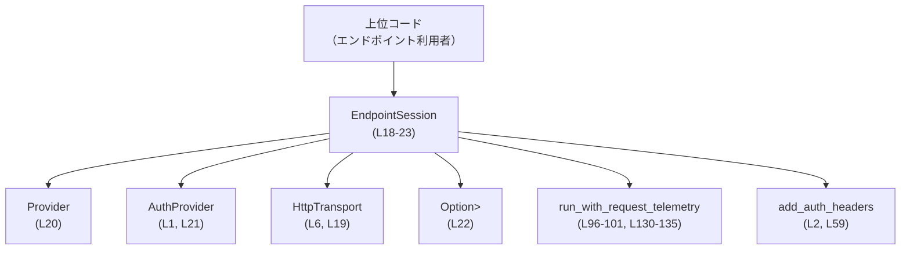
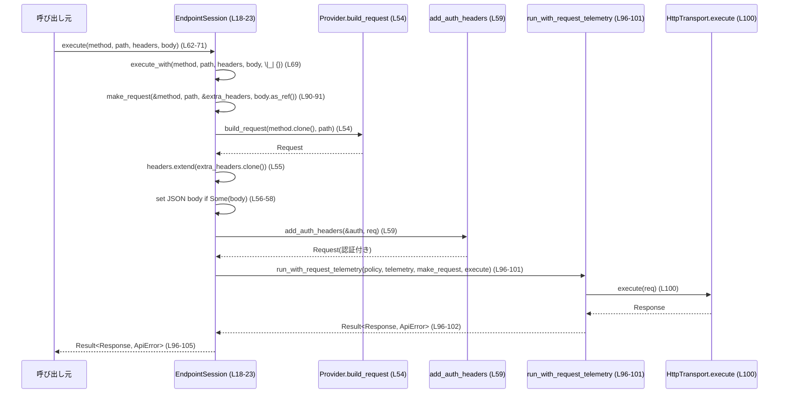

# codex-api/src/endpoint/session.rs コード解説

## 0. ざっくり一言

`EndpointSession` は、`Provider` と `HttpTransport`、認証情報、任意のリクエスト計測（telemetry）を束ねて、HTTP エンドポイント呼び出し（通常レスポンス／ストリームレスポンス）の実行を行う内部用のセッションオブジェクトです（根拠: `EndpointSession` のフィールドとメソッド群 `codex-api/src/endpoint/session.rs:L18-23, L47-60, L62-71, L79-105, L113-139`）。

---

## 1. このモジュールの役割

### 1.1 概要

- このモジュールは、**API プロバイダ向け HTTP リクエストを構築し、認証ヘッダと telemetry を付与したうえで実行する**ために存在します。
- 非ストリーミング応答（`Response`）とストリーミング応答（`StreamResponse`）の両方に対応し、リトライポリシーや telemetry は `run_with_request_telemetry` に委ねています（根拠: `run_with_request_telemetry` 呼び出し `L96-101, L130-135`）。
- 認証は `AuthProvider` と `add_auth_headers` を通じて行われます（根拠: `L1-2, L21, L59`）。

### 1.2 アーキテクチャ内での位置づけ

`EndpointSession` を中心にした依存関係は次の通りです。



- 上位コードは、`EndpointSession` を構築し、そのメソッドを通じて HTTP リクエストを発行します（根拠: `new`, `execute`, `execute_with`, `stream_with` 定義 `L26-33, L62-71, L79-105, L113-139`）。
- `EndpointSession` は `Provider` を用いてベースとなる `Request` を組み立てます（根拠: `self.provider.build_request` 呼び出し `L54`）。
- `AuthProvider` と `add_auth_headers` により、認証ヘッダが付与されます（根拠: `L1-2, L21, L59`）。
- 実際のネットワーク I/O は `HttpTransport` トレイト実装に委ねられます（根拠: `self.transport.execute(req)`, `self.transport.stream(req)` `L100, L134`）。
- `run_with_request_telemetry` がリトライポリシーと telemetry の処理を担います（根拠: `L96-101, L130-135`）。

### 1.3 設計上のポイント

- **セッションオブジェクト**  
  - `EndpointSession` は `transport`, `provider`, `auth`, `request_telemetry` を束ねる構造体です（根拠: `L18-23`）。
  - メソッドはすべて `&self` を取り、内部状態を変更しないため（`request_telemetry` は `with_request_telemetry` でのみ設定）、基本的に **不変なセッション** として扱われます（根拠: `L35-41` 以外のメソッドで `&self` のみ使用）。
- **認証と telemetry の分離**  
  - 認証ヘッダ付与は `make_request` 内で一括処理されます（根拠: `add_auth_headers(&self.auth, req)` `L59`）。
  - telemetry とリトライポリシーは `run_with_request_telemetry` に集約され、`EndpointSession` 側はポリシー取得と closure を渡すだけに留めています（根拠: `L96-101, L130-135`）。
- **非同期処理と安全性**  
  - 実行系メソッドは `async fn` であり、`run_with_request_telemetry(...).await?` によって非同期で I/O を行い、`ApiError` を `?` 演算子で伝播します（根拠: `L62, L79, L96-102, L113, L130-136`）。
  - すべて `&self` なので、`EndpointSession` が `Send`/`Sync` であれば、複数タスクから同時に呼び出しても内部状態の競合は発生しない設計です（この点はフィールド型のスレッド安全性次第であり、このチャンクからは判定できません）。
- **拡張ポイントとしての closure**  
  - `execute_with` / `stream_with` は `configure: Fn(&mut Request)` を受け取り、リクエストの追加カスタマイズを可能にしています（根拠: `L85-88, L119-122, L91-93, L125-127`）。

---

## 2. 主要な機能一覧

このモジュールが提供する主な機能は次の通りです。

- `EndpointSession` の構築: `new`, `with_request_telemetry` によるセッション初期化と telemetry の設定（根拠: `L26-33, L35-41`）
- プロバイダに基づく HTTP リクエスト構築: `make_request` によるメソッド・パス・ヘッダ・JSON ボディの設定と認証ヘッダ付与（根拠: `L47-60`）
- 非ストリーミング HTTP リクエスト実行: `execute` と `execute_with` による `Response` 型の取得（根拠: `L62-71, L79-105`）
- ストリーミング HTTP リクエスト実行: `stream_with` による `StreamResponse` 型の取得（根拠: `L113-139`）
- リトライ/telemetry の統合処理: `run_with_request_telemetry` によるポリシー適用と計測連携（根拠: `L5, L96-101, L130-135`）

---

## 3. 公開 API と詳細解説

### 3.1 型一覧（構造体・列挙体など）

| 名前 | 種別 | 役割 / 用途 | 定義位置 |
|------|------|-------------|----------|
| `EndpointSession<T, A>` | 構造体 | HTTP トランスポート・プロバイダ・認証・任意の telemetry を束ね、API エンドポイント呼び出しの実行を行うセッション | `codex-api/src/endpoint/session.rs:L18-23` |

#### `EndpointSession` のフィールド

| フィールド名 | 型 | 説明 | 定義位置 |
|-------------|----|------|----------|
| `transport` | `T` (where `T: HttpTransport`) | 実際の HTTP 通信を行うトランスポート実装 | `L18-19` |
| `provider` | `Provider` | ベースとなるリクエストのビルドやリトライポリシー取得を行うプロバイダ | `L18-20` |
| `auth` | `A` (where `A: AuthProvider`) | 認証情報・署名機能などを提供する認証プロバイダ | `L18-21` |
| `request_telemetry` | `Option<Arc<dyn RequestTelemetry>>` | リクエスト単位の telemetry 実装（なければ計測なし） | `L18-22` |

### 3.2 関数詳細

以下では 7 つのメソッドすべてについて詳細を記載します。

---

#### `EndpointSession::new(transport: T, provider: Provider, auth: A) -> Self` （L26-33）

**概要**

- `EndpointSession` の基本的なコンストラクタです。
- `request_telemetry` は `None`（未設定）で初期化されます（根拠: `request_telemetry: None` `L31`）。

**引数**

| 引数名 | 型 | 説明 |
|--------|----|------|
| `transport` | `T` | HTTP 通信を行うトランスポート |
| `provider` | `Provider` | リクエストビルドやリトライ設定を持つプロバイダ |
| `auth` | `A` | 認証情報や署名機能などを持つ実装 |

（型制約 `T: HttpTransport, A: AuthProvider` は `impl` のジェネリック境界に記述されています。根拠: `L25`）

**戻り値**

- `EndpointSession<T, A>`  
  与えられた `transport` / `provider` / `auth` を内部に保持したセッションを返します。

**内部処理の流れ**

1. `Self { transport, provider, auth, request_telemetry: None }` でフィールドをそのまま格納します（根拠: `L27-32`）。

**Examples（使用例）**

具体型はこのチャンクには現れないため、ジェネリック関数としての例を示します。

```rust
use codex_api::endpoint::session::EndpointSession; // モジュールパスは仮の例です

// 任意の HttpTransport / AuthProvider 実装を受け取ってセッションを作る例
fn build_session<T, A>(transport: T, provider: Provider, auth: A) -> EndpointSession<T, A>
where
    T: HttpTransport,      // トランスポートは HttpTransport を実装
    A: AuthProvider,       // 認証は AuthProvider を実装
{
    EndpointSession::new(transport, provider, auth) // L26-33
}
```

**Errors / Panics**

- この関数は `Result` を返さず、内部でも `panic!` や `unwrap` 等を使用していません（根拠: `L26-33`）。
- よって通常の使用で明示的なエラーは発生しません。

**Edge cases（エッジケース）**

- `transport` / `provider` / `auth` に `None` や無効値は取りえません（それぞれは値として渡されます）。内部で特別なチェックは行っていません。

**使用上の注意点**

- `request_telemetry` は `None` で始まるため、telemetry を使いたい場合は `with_request_telemetry` を続けて呼ぶ必要があります（根拠: `L31, L35-41`）。

---

#### `EndpointSession::with_request_telemetry(self, request: Option<Arc<dyn RequestTelemetry>>) -> Self` （L35-41）

**概要**

- 既存の `EndpointSession` に telemetry 設定を付与した新しいインスタンスを返します。
- `self` をムーブし、新しい `request_telemetry` を設定して返す **ビルダー風メソッド** です（根拠: `mut self` と `self` の返却 `L35-41`）。

**引数**

| 引数名 | 型 | 説明 |
|--------|----|------|
| `self` | `EndpointSession<T, A>` | 現在のセッション（ムーブされる） |
| `request` | `Option<Arc<dyn RequestTelemetry>>` | 新たに設定する telemetry 実装。`None` で telemetry 無効 |

**戻り値**

- telemetry 設定を上書きした `EndpointSession<T, A>`。

**内部処理の流れ**

1. `self.request_telemetry = request;` でフィールドを上書きします（根拠: `L39`）。
2. 変更された `self` をそのまま返します（根拠: `L40`）。

**Examples（使用例）**

```rust
fn attach_telemetry<T, A>(
    session: EndpointSession<T, A>,
    telemetry: Arc<dyn RequestTelemetry>,
) -> EndpointSession<T, A>
where
    T: HttpTransport,
    A: AuthProvider,
{
    session.with_request_telemetry(Some(telemetry)) // L35-41
}
```

**Errors / Panics**

- エラーを返さず、`panic!` も使用していません（根拠: `L35-41`）。

**Edge cases**

- `request = None` を渡すと telemetry が無効化されます。

**使用上の注意点**

- `mut self` を取るため、**このメソッド呼び出し後の古い `session` 変数は使えません**。呼び出し結果を新しい変数に束縛する必要があります。

---

#### `EndpointSession::provider(&self) -> &Provider` （L43-45）

**概要**

- 内部に保持している `Provider` への参照を返します。

**引数**

| 引数名 | 型 | 説明 |
|--------|----|------|
| `&self` | `&EndpointSession<T, A>` | セッションの参照 |

**戻り値**

- `&Provider`  
  内部フィールド `provider` への不変参照（根拠: `&self.provider` `L44`）。

**内部処理の流れ**

1. 単に `&self.provider` を返します（根拠: `L44`）。

**Examples（使用例）**

```rust
fn inspect_base_url<T, A>(session: &EndpointSession<T, A>)
where
    T: HttpTransport,
    A: AuthProvider,
{
    let provider = session.provider(); // L43-45
    // provider から設定値などを読む（詳細はこのチャンクには現れません）
}
```

**Errors / Panics**

- エラー・panic を引き起こす処理はありません。

**Edge cases**

- `self` が有効である限り、常に有効な `&Provider` が返されます。

**使用上の注意点**

- 返されるのは参照であり、`Provider` 自体の所有権は移動しません。

---

#### `EndpointSession::make_request(&self, method: &Method, path: &str, extra_headers: &HeaderMap, body: Option<&Value>) -> Request` （L47-60）

**概要**

- HTTP メソッド・パス・追加ヘッダ・JSON ボディから `Request` を構築し、認証ヘッダを付与します。
- このメソッドはモジュール内でのみ使用される内部ヘルパです（`pub` ではない、根拠: `fn make_request` `L47`）。

**引数**

| 引数名 | 型 | 説明 |
|--------|----|------|
| `&self` | `&EndpointSession<T, A>` | セッション |
| `method` | `&Method` | HTTP メソッド（GET, POST 等） |
| `path` | `&str` | プロバイダ基準のパス |
| `extra_headers` | `&HeaderMap` | 追加する HTTP ヘッダ |
| `body` | `Option<&Value>` | JSON ボディ（なければ `None`） |

**戻り値**

- `Request`  
  - `Provider::build_request` によって生成され、`extra_headers` と任意の JSON ボディ、および認証ヘッダが設定されたリクエスト（根拠: `L54-59`）。

**内部処理の流れ**

1. `self.provider.build_request(method.clone(), path)` で基本の `Request` を生成（根拠: `L54`）。
2. `req.headers.extend(extra_headers.clone());` で追加ヘッダをマージ（根拠: `L55`）。
3. `if let Some(body) = body { req.body = Some(RequestBody::Json(body.clone())); }` で JSON ボディがあれば `RequestBody::Json` として設定（根拠: `L56-58`）。
4. `add_auth_headers(&self.auth, req)` により認証ヘッダを付与しつつ `Request` を返却（根拠: `L59`）。

**Examples（使用例）**

`make_request` 自体は非公開メソッドですが、`execute_with` 内での使用パターンは以下のようになります（根拠: `L90-93`）。

```rust
// execute_with 内部のイメージ（実際のコードは L90-93）
let make_request = || {
    let mut req = self.make_request(&method, path, &extra_headers, body.as_ref());
    configure(&mut req);
    req
};
```

**Errors / Panics**

- `make_request` 自身は `Result` を返さず、明示的な panic も行いません（根拠: `L47-60`）。
- ただし、`Provider::build_request` や `add_auth_headers`、`HeaderMap::extend`、`Value::clone` の内部挙動についてはこのチャンクには現れないため、不変性やエラー条件は不明です。

**Edge cases**

- `body` が `None` の場合、`req.body` は変更されません（根拠: `if let Some(body) = body` `L56`）。
- `extra_headers` が空の場合、`extend` は何も追加しません。
- 大きな `Value` を渡した場合、`body.clone()` により値全体がコピーされるため、メモリ使用量が増えます（根拠: `body.clone()` `L57`）。

**使用上の注意点**

- `method` / `extra_headers` / `body` は参照として受け取り、`Request` 内部にクローンされるため、呼び出し側の値のライフタイムには依存しません。
- 認証ヘッダは常に最後に付与されるため、`configure` closure でヘッダを変更する場合、どの順序で上書きされるか（同一キーの重複時）は `add_auth_headers` の実装に依存します（このチャンクには詳細が現れません）。

---

#### `EndpointSession::execute(&self, method: Method, path: &str, extra_headers: HeaderMap, body: Option<Value>) -> Result<Response, ApiError>` （L62-71）

**概要**

- 最も簡易な非ストリーミングリクエスト実行メソッドです。
- `configure` closure にデフォルトの no-op（何もしない関数）を渡して `execute_with` を呼び出します（根拠: `execute_with(..., |_| {})` `L69`）。

**引数**

| 引数名 | 型 | 説明 |
|--------|----|------|
| `&self` | `&EndpointSession<T, A>` | セッション |
| `method` | `Method` | HTTP メソッド |
| `path` | `&str` | パス |
| `extra_headers` | `HeaderMap` | 追加ヘッダ |
| `body` | `Option<Value>` | JSON ボディ（所有権を移動） |

**戻り値**

- `Result<Response, ApiError>`  
  成功時には `Response` を、失敗時には `ApiError` を返します。

**内部処理の流れ**

1. `self.execute_with(method, path, extra_headers, body, |_| {})` を呼び出す（根拠: `L69`）。
2. その `Future` を `.await` し、そのまま結果を返します（根拠: `L69-71`）。

**Examples（使用例）**

```rust
use http::{HeaderMap, Method};
use serde_json::json;

async fn simple_call<T, A>(session: &EndpointSession<T, A>) -> Result<Response, ApiError>
where
    T: HttpTransport,
    A: AuthProvider,
{
    let method = Method::POST;
    let path = "/v1/resource";
    let headers = HeaderMap::new();
    let body = Some(json!({ "key": "value" }));

    // configure を使わない標準的な呼び出し
    session.execute(method, path, headers, body).await // L62-71
}
```

**Errors / Panics**

- `execute` 自身は `?` を直接使用していませんが、`execute_with` が `run_with_request_telemetry(...).await?` を使用しているため（根拠: `L96-102`）、`ApiError` が発生するとそのまま `Err(ApiError)` として返ります。
- 明示的な panic はありません。

**Edge cases**

- `body = None` の場合、リクエストボディなしで送信されます（`make_request` の仕様に従う、根拠: `L47-60`）。
- `extra_headers` に同一キーが含まれる場合の優先度は `HeaderMap::extend` と `Provider::build_request` 側の実装に依存します。

**使用上の注意点**

- 非同期関数であるため、**必ず `.await` する必要があります**。`await` を忘れると `impl Future` が返り、リクエストは実行されません。
- より細かくリクエストを調整したい場合は `execute_with` を使用します。

---

#### `EndpointSession::execute_with<C>(&self, method: Method, path: &str, extra_headers: HeaderMap, body: Option<Value>, configure: C) -> Result<Response, ApiError>` （L73-105）

**概要**

- 非ストリーミングリクエストを実行するメイン関数です。
- `configure: Fn(&mut Request)` で `Request` を任意にカスタマイズしたあと、`run_with_request_telemetry` を介して `transport.execute` を呼び出します（根拠: `L85-88, L90-101`）。
- `tracing::instrument` により、span 名・ログレベル・フィールド（HTTP メソッドとパス）が付与されます（根拠: `#[instrument(...)]` `L73-78`）。

**引数**

| 引数名 | 型 | 説明 |
|--------|----|------|
| `&self` | `&EndpointSession<T, A>` | セッション |
| `method` | `Method` | HTTP メソッド |
| `path` | `&str` | パス |
| `extra_headers` | `HeaderMap` | 追加ヘッダ |
| `body` | `Option<Value>` | JSON ボディ（所有権移動） |
| `configure` | `C` where `C: Fn(&mut Request)` | `Request` の追加カスタマイズを行う関数 |

**戻り値**

- `Result<Response, ApiError>`  
  HTTP 応答または API エラー。

**内部処理の流れ**

1. `make_request` を呼び出す closure `make_request` を定義（根拠: `L90-94`）。
   - `self.make_request(&method, path, &extra_headers, body.as_ref())` で基礎的なリクエストを構築。
   - `configure(&mut req);` により、呼び出し側が追加の変更を行う。
2. `run_with_request_telemetry` を呼び出す（根拠: `L96-101`）。
   - `self.provider.retry.to_policy()` でリトライポリシーを取得（詳細は別モジュール、`L97`）。
   - `self.request_telemetry.clone()` で telemetry の `Option<Arc<...>>` を渡す（`L98`）。
   - 第3引数に `make_request` closure。
   - 第4引数に `|req| self.transport.execute(req)` を渡し、実際の HTTP 実行を委譲（`L100`）。
3. `run_with_request_telemetry(...).await?` で実行し、得られた `response` を `Ok(response)` として返す（根拠: `L96-104`）。

**Examples（使用例）**

```rust
use http::{HeaderMap, Method};
use serde_json::json;

async fn call_with_custom_header<T, A>(
    session: &EndpointSession<T, A>,
) -> Result<Response, ApiError>
where
    T: HttpTransport,
    A: AuthProvider,
{
    let method = Method::POST;
    let path = "/v1/items";
    let mut headers = HeaderMap::new();
    // 必要なら事前にヘッダを設定してから渡す
    let body = Some(json!({ "name": "item" }));

    session
        .execute_with(method, path, headers, body, |req| {
            // ここで Request をさらにカスタマイズできる（L90-93）
            // 例: タイムアウトや特定ヘッダの設定など
            // 実際のフィールド名は Request 型の定義に依存します（このチャンクには現れません）。
        })
        .await
}
```

**Errors / Panics**

- `run_with_request_telemetry(...).await?` により、そこで返された `Result<Response, ApiError>` が `?` を通じてそのまま伝播されます（根拠: `L96-102`）。
- メソッド内に明示的な panic はありません。
- `run_with_request_telemetry` や `transport.execute` の内部が panic する可能性については、このチャンクからは不明です。

**Edge cases**

- `configure` closure が何もしなくても問題なく動作します（`execute` が `|_| {}` を渡している事からも分かります、根拠: `L69`）。
- `body = None` の場合はボディなしリクエストになります。
- `self.request_telemetry` が `None` の場合、`run_with_request_telemetry` 側で telemetry を付けずに実行する設計であると推測されますが、詳細はこのチャンクには現れません（根拠: `Option<Arc<dyn RequestTelemetry>>` `L22`, `clone()` `L98`）。

**使用上の注意点**

- `configure` は `Fn` であり、`FnMut` や `FnOnce` ではないため、**キャプチャした状態を可変にすることはできません**（コンパイラにより禁止されます。根拠: 境界 `C: Fn(&mut Request)` `L87-88`）。
- `method` や `extra_headers` は値として渡されるため、呼び出し側で再利用したい場合はクローンする必要があります。
- 非同期関数であるため `.await` が必要です。
- `EndpointSession` がスレッド安全であれば（フィールド型に依存）、このメソッドは複数タスクから同時に呼び出せますが、**telemetry オブジェクトや `Provider` の内部状態がスレッド安全かどうかは別モジュールの実装次第**です。

---

#### `EndpointSession::stream_with<C>(&self, method: Method, path: &str, extra_headers: HeaderMap, body: Option<Value>, configure: C) -> Result<StreamResponse, ApiError>` （L107-139）

**概要**

- ストリーミング応答（`StreamResponse`）を返すリクエストを実行します。
- 構造は `execute_with` とほぼ同じですが、`transport.stream` を呼び出し、`StreamResponse` を返す点が異なります（根拠: `L124-128, L130-135, L120`）。

**引数**

`execute_with` と同様です。

| 引数名 | 型 | 説明 |
|--------|----|------|
| `&self` | `&EndpointSession<T, A>` | セッション |
| `method` | `Method` | HTTP メソッド |
| `path` | `&str` | パス |
| `extra_headers` | `HeaderMap` | 追加ヘッダ |
| `body` | `Option<Value>` | JSON ボディ |
| `configure` | `C` where `C: Fn(&mut Request)` | リクエストカスタマイズ |

**戻り値**

- `Result<StreamResponse, ApiError>`  
  ストリーミングレスポンスまたはエラー。

**内部処理の流れ**

1. `make_request` を呼び出す closure `make_request` を定義（根拠: `L124-128`）。
2. `run_with_request_telemetry` を呼び出し、第4引数に `|req| self.transport.stream(req)` を渡してストリーミング実行を委譲（根拠: `L130-135`）。
3. `.await?` によって結果の `StreamResponse` を受け取り、`Ok(stream)` で返す（根拠: `L130-138`）。

**Examples（使用例）**

```rust
use http::{HeaderMap, Method};
use serde_json::json;

async fn stream_call<T, A>(
    session: &EndpointSession<T, A>,
) -> Result<StreamResponse, ApiError>
where
    T: HttpTransport,
    A: AuthProvider,
{
    let method = Method::GET;
    let path = "/v1/stream";
    let headers = HeaderMap::new();
    let body = None;

    session
        .stream_with(method, path, headers, body, |req| {
            // 必要に応じてストリームリクエストをカスタマイズ
        })
        .await // L113-139
}
```

**Errors / Panics**

- `execute_with` 同様、`run_with_request_telemetry(...).await?` により `ApiError` をそのまま返します（根拠: `L130-136`）。
- 明示的な panic はありません。

**Edge cases**

- サーバー側が長時間ストリームを開き続けるケースなどは `StreamResponse` の型と `HttpTransport::stream` の実装に依存し、このチャンクには現れません。
- `body = None` の GET ストリームなど、一般的なストリーミング用途を想定できますが、仕様は不明です。

**使用上の注意点**

- ストリーミングレスポンスは、呼び出し側で適切に消費・キャンセルする必要があります（`StreamResponse` の API に依存）。
- 長時間開きっぱなしにすると、接続・リソースを占有する可能性があります（一般論としての注意点）。

---

### 3.3 その他の関数

- このファイルには上記以外の関数は定義されていません（根拠: `L18-139`）。

---

## 4. データフロー

ここでは、`execute` を呼び出して非ストリーミングリクエストを実行する典型的な流れを示します。

### 4.1 非ストリーミング実行のフロー



要点:

- `execute` は実質的に `execute_with` の薄いラッパです。
- リクエスト構築の中心は `make_request` で、認証ヘッダもここで付与されます。
- リトライや telemetry は `run_with_request_telemetry` に完全に委譲され、`EndpointSession` はポリシーと closure を渡すだけです。

### 4.2 ストリーミング実行のフロー

- `stream_with` も同様のフローで、`Trans` が `HttpTransport.execute` ではなく `HttpTransport.stream` を呼び出し、`StreamResponse` を返す点のみが異なります（根拠: `L130-135`）。

---

## 5. 使い方（How to Use）

### 5.1 基本的な使用方法

`EndpointSession` を利用して単純な JSON POST リクエストを行う基本パターンです。

```rust
use http::{HeaderMap, Method};
use serde_json::json;

// T: HttpTransport, A: AuthProvider である任意の具体型を前提とします。
async fn basic_example<T, A>(
    session: &EndpointSession<T, A>,        // 既に構築済みのセッション
) -> Result<Response, ApiError>
where
    T: HttpTransport,
    A: AuthProvider,
{
    let method = Method::POST;              // HTTP メソッドを指定
    let path = "/v1/example";               // 呼び出したい API のパス
    let headers = HeaderMap::new();         // 追加ヘッダ（今回は空）
    let body = Some(json!({ "msg": "hello" })); // JSON ボディ

    let resp = session
        .execute(method, path, headers, body) // L62-71
        .await?;                              // 非同期実行

    Ok(resp)
}
```

### 5.2 よくある使用パターン

1. **リクエストの細かいカスタマイズ（ヘッダ・タイムアウトなど）**

```rust
async fn with_configure<T, A>(
    session: &EndpointSession<T, A>,
) -> Result<Response, ApiError>
where
    T: HttpTransport,
    A: AuthProvider,
{
    use http::Method;

    let method = Method::GET;
    let path = "/v1/items";
    let headers = HeaderMap::new();
    let body = None;

    session
        .execute_with(method, path, headers, body, |req| {
            // req.headers や req.body などをここで調整できる（L90-93）
            // 例: 特定のトレース ID をヘッダに追加するなど
        })
        .await
}
```

1. **ストリーミングレスポンスの利用**

```rust
async fn stream_example<T, A>(
    session: &EndpointSession<T, A>,
) -> Result<StreamResponse, ApiError>
where
    T: HttpTransport,
    A: AuthProvider,
{
    use http::Method;

    let method = Method::GET;
    let path = "/v1/stream";
    let headers = HeaderMap::new();
    let body = None;

    let stream = session
        .stream_with(method, path, headers, body, |_req| {
            // 必要ならここでストリーム用の設定
        })
        .await?; // L113-139

    Ok(stream)
}
```

1. **telemetry を付与したセッションの利用**

```rust
fn with_telemetry<T, A>(
    transport: T,
    provider: Provider,
    auth: A,
    telemetry: Arc<dyn RequestTelemetry>,
) -> EndpointSession<T, A>
where
    T: HttpTransport,
    A: AuthProvider,
{
    EndpointSession::new(transport, provider, auth) // L26-33
        .with_request_telemetry(Some(telemetry))    // L35-41
}
```

### 5.3 よくある間違い

実装から推測される、起こりがちな誤用例です。

```rust
async fn wrong_usage<T, A>(session: &EndpointSession<T, A>)
where
    T: HttpTransport,
    A: AuthProvider,
{
    use http::{HeaderMap, Method};

    let fut = session.execute(Method::GET, "/v1/items", HeaderMap::new(), None);
    // ↑ 間違い例: .await を付けていないため、リクエストは実行されない

    let _ = fut.await; // 正しくは Future に対して await する必要がある
}
```

- **誤り**: `async fn` を呼び出しても `.await` しない。
- **正しい用法**: 必ず `.await` を付けて Future を実行する。

### 5.4 使用上の注意点（まとめ）

- `EndpointSession` のメソッドはすべて `&self` を取り、内部状態は基本的に不変です（`with_request_telemetry` は例外）。複数タスクから共有して使う場合は、`EndpointSession` が `Send`/`Sync` かどうかを確認する必要があります（フィールド型次第で、このチャンクからは判定できません）。
- `body` 引数には `serde_json::Value` を渡しますが、大きな JSON を何度も送る場合、`Value::clone` によるコストを考慮する必要があります（根拠: `body.clone()` `L57`）。
- `configure` closure は `Fn` であり、内部でミューテックス等を扱う場合はブロッキング処理を避けることが推奨されます（非同期関数内であることに注意）。

---

## 6. 変更の仕方（How to Modify）

### 6.1 新しい機能を追加する場合

例: 新しい種類の HTTP 実行メソッド（例えばファイルアップロード専用）を追加したい場合。

1. **リクエスト構築方法の選択**
   - 既存の `make_request` で足りるなら、それを再利用します（根拠: `L47-60`）。
   - 特殊なボディ形式が必要で `RequestBody::Json` 以外を使う場合は、新しい内部ヘルパを追加することが考えられます。

2. **`run_with_request_telemetry` の再利用**
   - リトライと telemetry の扱いを統一するため、新メソッドでも `run_with_request_telemetry` を使用するのが一貫した設計になります（根拠: `L96-101, L130-135`）。

3. **トランスポートメソッドの追加**
   - `HttpTransport` に新たなメソッド（例: `upload`）があるなら、`stream_with` と同様のパターンで `|req| self.transport.upload(req)` を渡すメソッドを追加できます。

4. **tracing / telemetry の一貫性**
   - 既存メソッドと同様に `#[instrument(...)]` を付け、span 名やログフィールドを整えると観測性が保たれます（根拠: `L73-78, L107-112`）。

### 6.2 既存の機能を変更する場合

- **契約（前提条件・返り値の意味）の確認**
  - `execute_with` / `stream_with` は `ApiError` を返す契約を持っているため、`run_with_request_telemetry` への引数や `HttpTransport` の戻り値の型を変更する場合は、`ApiError` の定義と整合性をとる必要があります（根拠: `Result<Response, ApiError>` `L86`, `Result<StreamResponse, ApiError>` `L120`）。
- **影響範囲の確認**
  - `execute` は `execute_with` に完全依存しているため、`execute_with` を変更するとその影響を受けます（根拠: `L69`）。
  - `make_request` の仕様を変えると `execute_with` / `stream_with` の両方に影響するため、両方の呼び出しを確認する必要があります（根拠: `L90-93, L124-127`）。
- **telemetry / retry の扱い**
  - `provider.retry.to_policy()` や `self.request_telemetry.clone()` の扱いを変更する場合は、`crate::provider` や `crate::telemetry` の実装も合わせて確認する必要があります（根拠: `L97-98`）。

---

## 7. 関連ファイル

このモジュールと密接に関係するモジュール・型は次の通りです。

| パス（モジュール） | 役割 / 関係 |
|--------------------|------------|
| `crate::auth` | `AuthProvider` トレイトと `add_auth_headers` 関数を提供し、認証ヘッダの付与に使用されます（根拠: `L1-2, L21, L59`）。 |
| `crate::error` | API 呼び出し全体で共通に使われるエラー型 `ApiError` を定義します（根拠: `L3, L68, L86, L120`）。 |
| `crate::provider` | `Provider` 型を定義し、`build_request` や `retry.to_policy()` を通じてベース URL やリトライポリシーを提供します（根拠: `L4, L20, L54, L97, L131`）。 |
| `crate::telemetry` | `run_with_request_telemetry` 関数を提供し、リトライポリシーと telemetry を組み合わせたリクエスト実行を行います（根拠: `L5, L96-101, L130-135`）。 |
| `codex_client` | `HttpTransport`, `Request`, `RequestBody`, `RequestTelemetry`, `Response`, `StreamResponse` など、HTTP クライアントの基本型を提供します（根拠: `L6-11, L22, L47-60, L96-101, L130-135`）。 |
| `http` | `HeaderMap` と `Method` 型を提供し、HTTP メソッドとヘッダ管理に使用されます（根拠: `L12-13, L48-52, L64-67, L81-84, L115-118`）。 |
| `serde_json` | JSON ボディ表現に使用する `Value` 型を提供します（根拠: `L14, L52-53, L67-68, L84-85, L118-119`）。 |
| `tracing` | `instrument` マクロにより、`execute_with` / `stream_with` のトレース span を付与します（根拠: `L16, L73-78, L107-112`）。 |

---

### 補足: 潜在的な問題点・安全性の観点

- **エラー伝播**  
  - すべてのネットワークエラーやポリシーエラーは `run_with_request_telemetry` および `HttpTransport` に依存し、`ApiError` にマッピングされます。このため、エラーハンドリングを理解するにはこれらのモジュールの実装確認が必要です（根拠: `L96-102, L130-136`）。
- **並行性**  
  - `EndpointSession` のメソッドは `&self` のみを使用し、`request_telemetry` は `Arc` で共有されるため、設計としては並行利用を意識しています（根拠: `L22, L62, L79, L113`）。
  - ただし、`Provider` や `AuthProvider` の内部がスレッド安全かどうかはこのチャンクでは不明です。
- **パフォーマンス面**  
  - `HeaderMap` と `Value` の `clone` は入力サイズに比例したコストを持つため、高頻度・大容量のリクエストではオーバーヘッドとなる可能性があります（根拠: `extra_headers.clone()` `L55`, `body.clone()` `L57`）。
