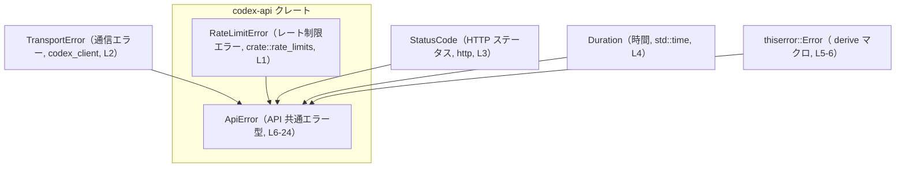
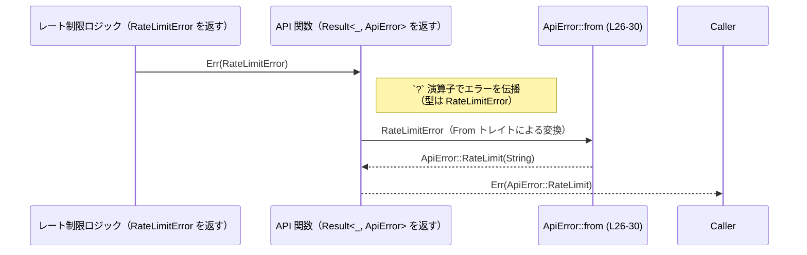

# codex-api/src/error.rs コード解説

## 0. ざっくり一言

`codex-api/src/error.rs` は、API 呼び出し全体で利用する共通エラー型 `ApiError` を定義し、`RateLimitError` など外部エラー型からの変換をまとめるモジュールです（`error.rs:L6-32`）。

---

## 1. このモジュールの役割

### 1.1 概要

- このモジュールは **API レイヤのエラー表現を一元化する** ために存在し、`ApiError` 列挙体を提供します（`error.rs:L6-24`）。
- ネットワーク層のエラー（`TransportError`）、HTTP ステータスに紐づくエラー、レート制限やコンテキスト長超過などのドメイン固有エラーを、単一の型にまとめています（`error.rs:L8-23`）。
- また、`RateLimitError` を `ApiError` に変換する `From` 実装を提供し、`?` 演算子等を用いた自然なエラー伝播を可能にします（`error.rs:L26-30`）。

### 1.2 アーキテクチャ内での位置づけ

`ApiError` は API レイヤの共通エラー型として、他モジュール・外部クレートからのエラーをラップします。

- 依存している外部／内部コンポーネント
  - `crate::rate_limits::RateLimitError`（内部モジュールのレート制限エラー）`error.rs:L1`
  - `codex_client::TransportError`（クライアント層のトランスポートエラー）`error.rs:L2`
  - `http::StatusCode`（HTTP ステータスコード型）`error.rs:L3`
  - `std::time::Duration`（再試行までの時間などに利用）`error.rs:L4`
  - `thiserror::Error`（エラー実装を derive するためのマクロ）`error.rs:L5-6`



この図は、`ApiError` がどの型に依存しているかを示しています。本チャンク内には `ApiError` をどこから呼び出しているかは現れないため、呼び出し元については不明です。

### 1.3 設計上のポイント

- **単一のエラー型に集約**  
  - API 層で発生しうる複数種類のエラーを `ApiError` 列挙体で表現しています（`error.rs:L8-23`）。
- **thiserror によるエラー実装の自動生成**  
  - `#[derive(Debug, Error)]` と variant ごとの `#[error(...)]` 属性によって、`Display` と `std::error::Error` の実装が自動生成されます（`error.rs:L6-23`）。
- **外部エラーからの自動変換**  
  - `TransportError` は `#[from]` 属性により自動で `From<TransportError> for ApiError` が生成されます（`error.rs:L9`）。
  - `RateLimitError` は明示的な `impl From<RateLimitError> for ApiError` で `ApiError::RateLimit` に変換されます（`error.rs:L26-30`）。
- **状態を持たないエラー型**  
  - すべてのフィールドは値（`String`, `StatusCode`, `Option<Duration>` など）であり、内部に可変状態や外部リソースを保持しません（`error.rs:L10-21`）。
- **パニックや `unsafe` を使用しない**  
  - このファイル内には `unsafe` ブロックや `panic!` 系マクロは存在せず、安全なエラー伝播のみが実装されています（`error.rs:L1-32`）。

---

## 2. 主要な機能一覧

- API 共通エラー型 `ApiError` の定義と分類（`error.rs:L6-24`）
- `TransportError` の透過的なラップと自動変換（`error.rs:L8-9`）
- HTTP ステータス付き API エラーの表現（`ApiError::Api`, `error.rs:L10-11`）
- ストリーミング関連エラーの表現（`ApiError::Stream`, `error.rs:L12`）
- コンテキストウィンドウ超過・クオータ超過・使用量未同梱といったドメイン固有エラーの表現（`error.rs:L13-16`）
- 再試行可能エラーとオプションの遅延時間の表現（`ApiError::Retryable`, `error.rs:L17-19`）
- レート制限エラー `RateLimitError` からの変換とラップ（`ApiError::RateLimit`, `error.rs:L20` および `impl From<RateLimitError>`, `error.rs:L26-30`）
- 不正リクエスト・サーバ過負荷状態の表現（`error.rs:L21-23`）

---

## 3. 公開 API と詳細解説

### 3.1 型一覧（構造体・列挙体など）

**型インベントリー**

| 名前 | 種別 | 公開範囲 | 役割 / 用途 | 根拠 |
|------|------|----------|-------------|------|
| `ApiError` | 列挙体 (`enum`) | `pub` | API 層で発生する多様なエラーを一つの型で表現し、呼び出し元に返すために用います。 | `error.rs:L6-24` |

**主な variant 一覧**

| Variant 名 | 形 | 説明（コードから読み取れる範囲） | 根拠 |
|-----------|----|----------------------------------|------|
| `Transport(TransportError)` | タプル | 下位層の `TransportError` をそのままラップし、メッセージ等を透過させます（`#[error(transparent)]` / `#[from]`）。 | `error.rs:L8-9` |
| `Api { status: StatusCode, message: String }` | 構造体 | HTTP ステータスコードとメッセージ文字列を組み合わせた API エラーを表現します。 | `error.rs:L10-11` |
| `Stream(String)` | タプル | ストリーム処理に関するエラーを文字列メッセージ付きで表現します。 | `error.rs:L12` |
| `ContextWindowExceeded` | 単一 | 「context window exceeded」という固定メッセージを持つエラーです。 | `error.rs:L13` |
| `QuotaExceeded` | 単一 | 「quota exceeded」という固定メッセージを持つエラーです。 | `error.rs:L14` |
| `UsageNotIncluded` | 単一 | 「usage not included」という固定メッセージを持つエラーです。 | `error.rs:L15` |
| `Retryable { message: String, delay: Option<Duration> }` | 構造体 | 再試行可能なエラーをメッセージと任意の遅延時間付きで表現します。 | `error.rs:L17-19` |
| `RateLimit(String)` | タプル | レート制限に関するエラーを文字列メッセージとして保持します。 | `error.rs:L20` |
| `InvalidRequest { message: String }` | 構造体 | 不正なリクエストを示すメッセージ付きエラーです。 | `error.rs:L21-22` |
| `ServerOverloaded` | 単一 | 「server overloaded」という固定メッセージを持つエラーです。 | `error.rs:L23` |

### 3.2 関数詳細（最大 7 件）

このファイルに明示的に定義されている関数は、`From<RateLimitError> for ApiError` の `from` メソッド 1 件です（メタ情報 `functions=1` と一致）。

#### `ApiError::from(err: RateLimitError) -> ApiError` （`From<RateLimitError>` 実装）

**概要**

- `RateLimitError` を `ApiError::RateLimit` に変換するための `From` トレイト実装です（`error.rs:L26-30`）。
- これにより、`Result<_, RateLimitError>` を返す関数の結果を、`Result<_, ApiError>` を返す関数内で `?` 演算子でそのまま伝播できます。

**引数**

| 引数名 | 型 | 説明 | 根拠 |
|--------|----|------|------|
| `err` | `RateLimitError` | レート制限関連のエラー。`crate::rate_limits` モジュールで定義されている型です。 | `error.rs:L1`, `error.rs:L26` |

**戻り値**

- 型: `ApiError`（`error.rs:L26`）
- 具体的には、`ApiError::RateLimit(err.to_string())` を生成して返します（`error.rs:L27-29`）。

**内部処理の流れ（アルゴリズム）**

1. 引数として受け取った `err: RateLimitError` に対し、`to_string()` を呼び出して文字列に変換します（`error.rs:L27-29`）。
2. その文字列を保持する `ApiError::RateLimit` variant を生成します（`error.rs:L27-29`）。
3. 生成した `ApiError` を呼び出し元へ返します（`error.rs:L27-29`）。

処理はこれだけで、条件分岐やループはありません。

**Examples（使用例）**

以下の例は、`RateLimitError` を返す下位関数を、API レイヤの `ApiError` に統一する様子を示します。

```rust
use crate::error::ApiError;                   // 同一クレート内から ApiError を利用する
use crate::rate_limits::RateLimitError;       // RateLimitError 型
use codex_client::TransportError;             // トランスポート層のエラー（参考）
use std::time::Duration;

// レート制限をチェックする下位関数
fn check_rate_limit() -> Result<(), RateLimitError> {
    // 実装はこのチャンクにはないため仮のものとします
    Err(RateLimitError::new())               // ダミー: 実際のコンストラクタはこのチャンクには現れません
}

// API レイヤの関数: 共通エラー型として ApiError を返す
fn api_entry_point() -> Result<(), ApiError> {
    // RateLimitError を返す関数を呼ぶ
    // `?` によって Err(RateLimitError) は `From<RateLimitError> for ApiError`
    // の実装経由で ApiError::RateLimit に自動変換されます。
    check_rate_limit()?;                     // ここで ApiError::RateLimit へ変換されうる

    Ok(())
}
```

> 注: `RateLimitError::new()` はこのチャンクに定義がないため、あくまで仮の例です。

**Errors / Panics**

- `from` メソッド自身は `Result` ではなく、常に `ApiError` を返します（`error.rs:L26-30`）。
- 標準ライブラリの `ToString` 実装 (`err.to_string()`) が通常パニックを起こさないことから、この変換は **通常ケースではパニックしない** と考えられます。
- Out Of Memory のようなシステムレベルの異常は Rust プログラム全体の問題であり、この関数固有の問題とはみなしません。

**Edge cases（エッジケース）**

- `RateLimitError` に格納されている情報量が多い場合  
  - `to_string()` の結果が大きな文字列になる可能性があります。これは文字列サイズの問題であり、型レベルの制約はありません。
- `RateLimitError` の文字列表現がローカライズされている／機械的にパースしづらい場合  
  - この実装では構造化された情報ではなく文字列のみを保持するため、呼び出し側で種類を再判別することはできません。

**使用上の注意点**

- `RateLimitError` の詳細な構造情報は `to_string()` で失われ、`ApiError` 側では純粋な文字列としてしか扱えません。  
  後段でレート制限の種類ごとに分岐したい場合は、`RateLimitError` の段階で処理する必要があります。
- メッセージ文字列は、そのままログや API 応答に含まれる設計である可能性があるため、`RateLimitError` の `Display` 実装に機密情報を含めない運用が望ましいです（この点は一般論であり、このチャンクからは Display 実装内容は分かりません）。

### 3.3 その他の関数

- このファイルには、上記以外の手書きの関数やメソッドは存在しません（`error.rs:L1-32`）。
- ただし、`thiserror::Error` および `#[from]` 属性により、コンパイル時に `From<TransportError> for ApiError` などの補助的な実装が自動生成されます（`error.rs:L6-9`）。これらの展開後コードはこのチャンクには明示的に現れません。

---

## 4. データフロー

ここでは、レート制限処理から `ApiError` までの典型的なエラー伝播の流れを示します。実際の関数名やモジュール構成はこのチャンクには現れないため、抽象的な呼び出し元名を用いています。



要点:

- `RateLimitError` を返す関数を、`Result<_, ApiError>` を返す API 関数から呼び出すとき、`?` 演算子を用いると自動的に `ApiError::RateLimit` に変換されます（`error.rs:L26-30`）。
- 変換されたエラーは、上位の呼び出し元に対して一貫した `ApiError` 型として返されます。
- このチャンク内には、実際にどの関数がこのフローを取っているかは記述されていません。

---

## 5. 使い方（How to Use）

### 5.1 基本的な使用方法

このモジュールの典型的な使い方は、「API レイヤの関数の戻り値を `Result<_, ApiError>` に統一し、下位層のエラーを `?` で自動変換しつつ、必要に応じて明示的に `ApiError` の variant を返す」という形です。

```rust
use crate::error::ApiError;                  // ApiError をインポート（同一クレート内想定）
use codex_client::TransportError;            // トランスポートエラー
use http::StatusCode;                        // HTTP ステータスコード

// 下位層のクライアント呼び出し（ダミー例）
// 実際の実装はこのチャンクには現れません。
fn low_level_call() -> Result<String, TransportError> {
    Err(TransportError::new())               // ダミー: 実際のコンストラクタは不明
}

// API エントリポイント側
fn api_call() -> Result<String, ApiError> {
    // TransportError は ApiError::Transport に自動変換される
    let body = low_level_call()?;            // error.rs:L8-9 により From<TransportError> が存在

    if body.is_empty() {
        // HTTP 400 相当のエラーとして扱う例
        return Err(ApiError::Api {
            status: StatusCode::BAD_REQUEST,
            message: "empty body".to_string(),
        });
    }

    Ok(body)
}
```

この例では:

- `low_level_call` からの `TransportError` が `ApiError::Transport` に変換されます（マクロにより生成される `From` 実装に依存）。
- 入力内容に応じて `ApiError::Api` variant を手動で生成しています（`error.rs:L10-11`）。

### 5.2 よくある使用パターン

#### パターン1: レート制限エラーをそのまま伝播する

```rust
use crate::error::ApiError;
use crate::rate_limits::RateLimitError;

// レート制限チェック関数（Result<_, RateLimitError>）
fn check_rate_limit() -> Result<(), RateLimitError> {
    // 実装はこのチャンク外
    Err(/* RateLimitError 値 */)
}

// API 関数側（Result<_, ApiError>）
fn api_with_rate_limit() -> Result<(), ApiError> {
    // RateLimitError は ApiError::RateLimit に自動変換される
    check_rate_limit()?;                     // error.rs:L26-30 の From 実装が使われる

    Ok(())
}
```

#### パターン2: 再試行可能エラーを `Retryable` で表現する

```rust
use crate::error::ApiError;
use std::time::Duration;

fn maybe_temporary_failure() -> Result<(), ApiError> {
    // 何らかの一時的な失敗が発生したと仮定
    let message = "temporary backend failure".to_string();  // エラーメッセージ
    let delay = Some(Duration::from_secs(5));               // 5 秒後の再試行を示唆（設計上の解釈）

    Err(ApiError::Retryable { message, delay })             // error.rs:L17-19
}
```

> `delay` フィールドが再試行までの待機時間を表すかどうかはコードコメントには明示されていませんが、型と variant 名からそのような用途が想定されます。

### 5.3 よくある間違い

ここでは、`ApiError` の構造から見て起こりうる誤用例と、そのより自然な使い方の例を示します。

```rust
use crate::error::ApiError;
use codex_client::TransportError;

// 誤りに近い例: TransportError を文字列化して別 variant でラップしてしまう
fn wrong_wrap(err: TransportError) -> ApiError {
    ApiError::Api {
        status: http::StatusCode::BAD_GATEWAY,
        message: err.to_string(),           // 本来は Transport variant で保持できる情報を文字列に潰している
    }
}

// より自然な例: 専用の Transport variant を使う
fn better_wrap(err: TransportError) -> ApiError {
    // thiserror の #[from] による From 実装を利用する
    err.into()                              // ApiError::Transport に変換（error.rs:L8-9）
}
```

ポイント:

- `ApiError::Transport` が用意されているため、トランスポート層のエラーを別の variant で表現すると後段のハンドリングで判別が難しくなります。
- これは構造上の観点であり、実際にこのようなコードが存在するかどうかはこのチャンクからは分かりません。

### 5.4 使用上の注意点（まとめ）

- **エラーメッセージへの機密情報の混入**  
  - 多くの variant が `String` メッセージを持つため（`error.rs:L10-12`, `L17-22`）、そのままログ・API 応答に出す設計の場合、機密情報を含めないようにする必要があります（セキュリティ上の一般的注意点）。
- **構造情報の喪失**  
  - `ApiError::RateLimit(String)` に `RateLimitError` を文字列変換して保持しているため（`error.rs:L20`, `L26-30`）、レート制限の種類別の分岐など、構造化情報を必要とする処理は `RateLimitError` 側で行う必要があります。
- **並行性**  
  - このファイルにはスレッド生成や同期原語は登場せず、`ApiError` の `Send` / `Sync` 実装状況はこのチャンクだけでは判断できません。
- **安全性**  
  - `unsafe` や `panic!` を使用しておらず、エラーはすべて型システムを通じて表現されています（`error.rs:L1-32`）。

---

## 6. 変更の仕方（How to Modify）

### 6.1 新しい機能を追加する場合

新たなエラー分類や外部エラー型を統合したい場合は、次のような手順になります。

1. **新しい variant の追加**  
   - `ApiError` 列挙体に新しい variant を追加します（`error.rs:L8-23`）。
   - 例: 新しいドメインエラー用に `NewDomainError { message: String }` など。
2. **`#[error(...)]` 属性の付与**  
   - thiserror のルールに従い、ユーザーに見せたいエラーメッセージを `#[error("...")]` 属性で定義します（既存 variant を参照）。
3. **外部エラーからの変換が必要な場合**  
   - 新しい外部エラー型 `XError` を `ApiError` に統合する場合、以下のいずれかを追加します。
     - `ApiError` の variant 引数に `#[from]` を付ける（`Transport` variant の例: `error.rs:L8-9`）。
     - もしくは、このファイル末尾に `impl From<XError> for ApiError { ... }` を定義する（`RateLimitError` の例: `error.rs:L26-30`）。
4. **呼び出し元コードの修正**  
   - 新しい variant を利用するように呼び出し元の `match` やエラーハンドリングを拡張します。  
     具体的な呼び出し箇所はこのチャンクには現れないため、プロジェクト全体から `ApiError` を検索して修正対象を特定する必要があります。

### 6.2 既存の機能を変更する場合

例として `ApiError` のフィールド構成やメッセージを変更する場合の注意点を示します。

- **影響範囲の確認**  
  - `ApiError` は `pub` であり（`error.rs:L6`）、クレート外からも利用されている可能性があります。  
    変更前に全体検索で `ApiError::` や `From<ApiError>` の利用箇所を確認する必要があります。
- **契約（前提条件・返り値の意味）の維持**  
  - たとえば `Retryable { message, delay }` の `delay` を必須にすると、`Option<Duration>` を期待している呼び出し側の前提が変わります（`error.rs:L17-19`）。
  - `Api { status, message }` の `status` の意味（HTTP ステータス）を変えると、クライアント側との契約に影響します（`error.rs:L10-11`）。
- **テスト**  
  - このファイルにはテストコードは含まれていません（`error.rs:L1-32`）。  
    変更時には、プロジェクト内のテスト（もしあれば）で `ApiError` を検査している箇所を更新する必要があります。
- **潜在的なバグ・セキュリティへの影響**  
  - エラーメッセージの文面をユーザー向けに変更する際、内部情報やスタックトレース等を露出しないよう注意が必要です。  
    これは一般的な Web/API アプリケーションのセキュリティ上の注意点であり、このチャンク固有の実装から直接は読み取れません。

---

## 7. 関連ファイル

このモジュールと密接に関係する型・モジュールを列挙します。パスは、このチャンクに現れる情報から推測可能な範囲で記述します。

| パス / モジュール | 役割 / 関係 |
|-------------------|------------|
| `crate::rate_limits`（具体的なファイルパスは不明） | `RateLimitError` を定義するモジュールであり、本ファイルの `impl From<RateLimitError> for ApiError` で使用されています（`error.rs:L1`, `L26-30`）。 |
| `codex_client` クレート | `TransportError` 型を提供し、`ApiError::Transport` variant によりラップされます（`error.rs:L2`, `L8-9`）。 |
| `http` クレート | `StatusCode` 型を提供し、`ApiError::Api` の `status` フィールドに利用されています（`error.rs:L3`, `L10-11`）。 |
| 標準ライブラリ `std::time` | `Duration` 型を提供し、`ApiError::Retryable` の `delay` フィールドで再試行までの時間などを表現するために利用されています（`error.rs:L4`, `L17-19`）。 |
| `thiserror` クレート | `Error` derive マクロを提供し、`ApiError` に `std::error::Error` 実装と `Display` 実装を自動付与しています（`error.rs:L5-6`, `L8-23`）。 |

このチャンクには、`ApiError` を実際に利用している呼び出し側コードやテストコードは含まれていないため、それらの具体的なファイルパスや内容は不明です。
