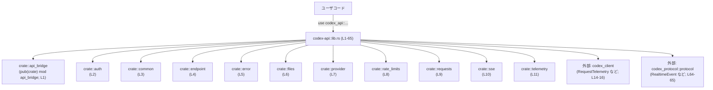
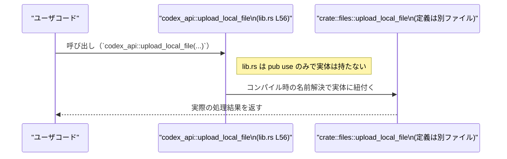

# codex-api/src/lib.rs コード解説

## 0. ざっくり一言

`codex-api` クレート全体の **ルートモジュール** であり、内部モジュールや外部クレートからの型・関数を再公開（re-export）して、利用者が使う公開 API の入口を定義しているファイルです（`codex-api/src/lib.rs:L1-65`）。

---

## 1. このモジュールの役割

### 1.1 概要

- このモジュールは、`codex-api` クレート内の各種機能（認証、エンドポイントクライアント、エラー型、ファイルアップロード、SSE/WS テレメトリなど）をまとめて公開する「**ファサード**（窓口）」として機能します。
- 実際の処理ロジックは `api_bridge`, `endpoint`, `files` などのサブモジュールや、外部クレート `codex_client`, `codex_protocol` にあり、この `lib.rs` はそれらへの **名前解決のハブ** になっています。

### 1.2 アーキテクチャ内での位置づけ

`lib.rs` は、クレート利用者と内部モジュール／外部クレートの間に立つ「公開 API のまとめ役」です。



- 依存関係の根拠  
  - モジュール宣言: `pub(crate) mod api_bridge;` 等（`codex-api/src/lib.rs:L1-11`）  
  - 外部クレートからの再公開:  
    - `pub use codex_client::RequestTelemetry;` など（`codex-api/src/lib.rs:L14-16`）  
    - `pub use codex_protocol::protocol::RealtimeAudioFrame;` など（`codex-api/src/lib.rs:L64-65`）

### 1.3 設計上のポイント

コードから読み取れる設計上の特徴は次のとおりです。

- **pub(crate) mod** による内部モジュールの隠蔽  
  - `pub mod` ではなく `pub(crate) mod` のため、サブモジュールはクレート外部から直接は見えません（`codex-api/src/lib.rs:L1-11`）。  
  - 外部利用者は基本的に `codex_api::` 直下に再公開された項目のみを利用します。
- **再公開（pub use）による API の統一化**
  - 内部モジュール・外部クレート双方から多くの項目を `pub use` し、**単一の名前空間**（`codex_api::...`）に集約しています（`codex-api/src/lib.rs:L13-65`）。
- **エラーやテレメトリの共通化**
  - エラー型 `ApiError`, `TransportError` やテレメトリ型 `RequestTelemetry`, `SseTelemetry`, `WebsocketTelemetry` をこのルートから一括で公開しています（`codex-api/src/lib.rs:L14-16,55,62-63`）。
- **並行性・安全性のロジックはこのファイルには存在しない**
  - このファイルには関数実装・状態保持・`async` 関数などのロジックは無く、**実行時の挙動はすべてサブモジュール／外部クレート側にあります**。

---

## 2. 主要な機能一覧

`lib.rs` 自身はロジックを持ちませんが、再公開されている項目から、このクレートが提供している主な機能を整理すると次のようになります（すべて `codex-api/src/lib.rs:L13-65` に根拠があります）。

- 認証まわり
  - `CoreAuthProvider`, `AuthProvider`: 認証情報の提供に関わる型（`api_bridge`, `auth` モジュールから再公開）。
- エンドポイントクライアント
  - `ResponsesClient`, `ModelsClient`, `MemoriesClient`, `CompactClient` など: 各種 API エンドポイントに対応するクライアント型と思われます（`endpoint` モジュール由来）。
  - `RealtimeWebsocketClient` 系・`ResponsesWebsocketClient`: WebSocket ベースのリアルタイム／レスポンス機能に関連するクライアント型。
- プロトコルとイベント
  - `RealtimeAudioFrame`, `RealtimeEvent`: プロトコルレベルのリアルタイムイベント型（`codex_protocol::protocol` から再公開）。
- SSE / WebSocket / テレメトリ
  - `SseTelemetry`, `WebsocketTelemetry`, `RequestTelemetry`: リクエストやストリーミング処理に関するテレメトリ情報を扱う型。
  - `stream_from_fixture`: SSE ストリームを何らかのフィクスチャから生成する公開項目（`sse` モジュール由来）。
- リクエスト構築とヘッダ
  - `build_conversation_headers`: 会話コンテキスト向けの HTTP ヘッダ構築に関わる公開項目（`requests::headers` 由来）。
  - `Compression`: リクエストの圧縮設定に関する型／値。
  - `WS_REQUEST_HEADER_TRACEPARENT_CLIENT_METADATA_KEY`, `WS_REQUEST_HEADER_TRACESTATE_CLIENT_METADATA_KEY`: WebSocket リクエスト用ヘッダキーを表す定数（大文字スネークケース名）。
- メモリ・テキスト関連
  - `CompactionInput`, `MemorySummarizeInput`, `MemorySummarizeOutput`, `RawMemory`, `RawMemoryMetadata`, `Reasoning`, `OpenAiVerbosity`, `TextControls`: メモリやテキスト処理に関連する入力・出力・設定を表す型群（`common` モジュール由来）。
  - `create_text_param_for_request`, `response_create_client_metadata`: テキストリクエストやクライアントメタデータ構築に関わる公開項目。
- ファイルアップロード
  - `upload_local_file`: ローカルファイルを扱う公開項目（おそらくアップロード系。`files` モジュールから再公開）。
- API エラーとトランスポート
  - `ApiError`: このクレート固有の API エラー型（`error` モジュール由来）。
  - `TransportError`, `ReqwestTransport`: HTTP などのトランスポート層に関連する型（`codex_client` 由来）。
- プロバイダとリトライ
  - `Provider`, `RetryConfig`, `is_azure_responses_wire_base_url`: API プロバイダ設定やリトライ構成・URL 判定に関わる公開項目（`provider` モジュール由来）。

※ それぞれの「何をするか」の詳細実装は、このファイルには含まれていません。

---

## 3. 公開 API と詳細解説

### 3.1 コンポーネントインベントリー（主要な公開項目一覧）

このテーブルでは、「どの名前がどこから再公開されているか」を整理します。  
型か関数かなど、**定義の種別がこのファイルから判別できないものは「不明」と明示**します。

#### 内部モジュール

| 名前 | 種別 | 公開範囲 | 説明（名称から分かる範囲のみ） | 根拠 |
|------|------|----------|---------------------------------|------|
| `api_bridge` | モジュール | `pub(crate)` | API と内部ロジックの橋渡しを行うモジュールと推測されますが、実装はこのチャンクにありません。 | `codex-api/src/lib.rs:L1` |
| `auth` | モジュール | `pub(crate)` | 認証関連ロジックを含むモジュールと思われます。 | `codex-api/src/lib.rs:L2` |
| `common` | モジュール | `pub(crate)` | 共通型・ユーティリティを集約するモジュール。 | `codex-api/src/lib.rs:L3` |
| `endpoint` | モジュール | `pub(crate)` | 各種 API エンドポイントクライアントを定義すると考えられます。 | `codex-api/src/lib.rs:L4` |
| `error` | モジュール | `pub(crate)` | API 用エラー型などを定義するモジュール。 | `codex-api/src/lib.rs:L5` |
| `files` | モジュール | `pub(crate)` | ファイル関連の機能を提供するモジュール。 | `codex-api/src/lib.rs:L6` |
| `provider` | モジュール | `pub(crate)` | プロバイダ構成・リトライ設定等を扱うモジュールと推測されます。 | `codex-api/src/lib.rs:L7` |
| `rate_limits` | モジュール | `pub(crate)` | レート制限に関する処理を含むモジュールと推測されます。 | `codex-api/src/lib.rs:L8` |
| `requests` | モジュール | `pub(crate)` | リクエスト構築・圧縮・ヘッダ等を扱うモジュール。 | `codex-api/src/lib.rs:L9` |
| `sse` | モジュール | `pub(crate)` | SSE（Server-Sent Events）関連処理を担当するモジュール。 | `codex-api/src/lib.rs:L10` |
| `telemetry` | モジュール | `pub(crate)` | テレメトリ（計測・ログ等）関連のモジュール。 | `codex-api/src/lib.rs:L11` |

#### 再公開されている主な型・定数・関数（種別は不明を含む）

| 名前 | 種別（推測を含まない事実レベル） | 出典 | 役割 / 用途（名称からの概要） | 根拠 |
|------|----------------------------------|------|-------------------------------|------|
| `build_conversation_headers` | 公開項目（関数/定数かは不明） | `crate::requests::headers` | 会話用リクエストのヘッダを構築するための項目と考えられます。 | `codex-api/src/lib.rs:L13` |
| `RequestTelemetry` | 公開項目 | `codex_client` | リクエストに関するテレメトリ情報を表す型名。 | `codex-api/src/lib.rs:L14` |
| `ReqwestTransport` | 公開項目 | `codex_client` | `reqwest` ベースのトランスポート層を表す型名。 | `codex-api/src/lib.rs:L15` |
| `TransportError` | 公開項目 | `codex_client` | トランスポート層のエラーを表す型名。 | `codex-api/src/lib.rs:L16` |
| `CoreAuthProvider` | 公開項目 | `crate::api_bridge` | コアな認証プロバイダを表す型名。 | `codex-api/src/lib.rs:L18` |
| `map_api_error` | 公開項目 | `crate::api_bridge` | API エラーをマッピングする項目名。 | `codex-api/src/lib.rs:L19` |
| `AuthProvider` | 公開項目 | `crate::auth` | 認証情報を提供するプロバイダを表す型名。 | `codex-api/src/lib.rs:L20` |
| `CompactionInput` 〜 `TextControls` | 公開項目群 | `crate::common` | メモリの圧縮・要約・テキスト制御・理由付けなどに関わる型群。 | `codex-api/src/lib.rs:L21-33` |
| `WS_REQUEST_HEADER_TRACEPARENT_CLIENT_METADATA_KEY` | 公開項目 | `crate::common` | WebSocket リクエストヘッダのキーを表す定数名。 | `codex-api/src/lib.rs:L34` |
| `WS_REQUEST_HEADER_TRACESTATE_CLIENT_METADATA_KEY` | 公開項目 | `crate::common` | 同上、`tracestate` 用のキーを表す定数名。 | `codex-api/src/lib.rs:L35` |
| `create_text_param_for_request` | 公開項目 | `crate::common` | テキストリクエスト用パラメータを生成する項目名。 | `codex-api/src/lib.rs:L36` |
| `response_create_client_metadata` | 公開項目 | `crate::common` | レスポンス作成時のクライアントメタデータを生成する項目名。 | `codex-api/src/lib.rs:L37` |
| `CompactClient` 〜 `ResponsesWebsocketConnection` | 公開項目群 | `crate::endpoint` | 各種 API エンドポイントおよび WebSocket 接続を表すクライアント／設定型群。 | `codex-api/src/lib.rs:L38-53` |
| `session_update_session_json` | 公開項目 | `crate::endpoint` | セッション更新の JSON を扱う項目名。 | `codex-api/src/lib.rs:L54` |
| `ApiError` | 公開項目 | `crate::error` | このクレート固有の API エラー型。 | `codex-api/src/lib.rs:L55` |
| `upload_local_file` | 公開項目 | `crate::files` | ローカルファイルを扱う（アップロード等）項目名。 | `codex-api/src/lib.rs:L56` |
| `Provider`, `RetryConfig`, `is_azure_responses_wire_base_url` | 公開項目群 | `crate::provider` | プロバイダ設定・リトライ構成・URL 判定に関する項目群。 | `codex-api/src/lib.rs:L57-59` |
| `Compression` | 公開項目 | `crate::requests` | 圧縮関連の設定・パラメータを表す名前。 | `codex-api/src/lib.rs:L60` |
| `stream_from_fixture` | 公開項目 | `crate::sse` | SSE ストリームをフィクスチャから生成する項目名。 | `codex-api/src/lib.rs:L61` |
| `SseTelemetry`, `WebsocketTelemetry` | 公開項目群 | `crate::telemetry` | SSE / WebSocket のテレメトリ情報に関する型。 | `codex-api/src/lib.rs:L62-63` |
| `RealtimeAudioFrame`, `RealtimeEvent` | 公開項目群 | `codex_protocol::protocol` | リアルタイムオーディオフレーム・イベントのプロトコル型。 | `codex-api/src/lib.rs:L64-65` |

> 種別（構造体・列挙体・トレイト・関数・定数など）は、**定義が他ファイルにあるためこのチャンクだけでは断定できません**。Rust の命名規約からの推測は可能ですが、ここでは事実レベルにとどめています。

### 3.2 関数詳細（テンプレート適用）

この `lib.rs` には **関数定義そのものは一切含まれていません**。  
ここでは「関数（と推測される snake_case 名の公開項目）」を 7 つ挙げ、テンプレートに沿って「このファイルから分かること／分からないこと」を整理します。

#### `build_conversation_headers(...) -> ...`

**概要**

- `crate::requests::headers` から再公開されている公開項目です（`codex-api/src/lib.rs:L13`）。
- 名称からは「会話コンテキストに必要な HTTP ヘッダを構築する処理」である可能性がありますが、実装はこのチャンクにありません。

**引数 / 戻り値**

- このチャンクにはシグネチャ定義が無く、**引数・戻り値の型は不明**です。

**内部処理の流れ**

- 実装が `crate::requests::headers` 側にあり、このファイルからは一切読み取れません。

**Examples（使用例）**

- 本チャンクだけでは安全にコンパイル可能な具体的呼び出し例（引数付き）を示すことができません。
- 利用者は `crate::requests::headers` のドキュメントや実装を参照する必要があります。

**Errors / Panics / Edge cases / 使用上の注意点**

- いずれもこのチャンクからは分かりません。

---

#### `map_api_error(...) -> ...`

**概要**

- `crate::api_bridge` から再公開（`codex-api/src/lib.rs:L19`）。
- 名称からは「ある種のエラーを `ApiError` などに変換する」役割が推測されますが、実装は不明です。

**引数・戻り値・内部処理・エッジケース・注意点**

- すべて本チャンクには出てこないため、**不明**です。

---

#### `create_text_param_for_request(...) -> ...`

**概要**

- `crate::common` から再公開されている項目（`codex-api/src/lib.rs:L36`）。
- 名称からは、何らかの「テキストリクエスト用パラメータ」を構築する機能と推測できます。

**その他の項目（引数・戻り値・内部処理・エラー等）**

- このファイルには定義が無く、詳細は不明です。

---

#### `response_create_client_metadata(...) -> ...`

**概要**

- `crate::common` から再公開（`codex-api/src/lib.rs:L37`）。
- レスポンス作成時のクライアントメタデータ生成に関連すると考えられますが、実装は見えません。

**詳細**

- シグネチャ・処理内容・エラー条件などはすべて不明です。

---

#### `session_update_session_json(...) -> ...`

**概要**

- `crate::endpoint` からの再公開（`codex-api/src/lib.rs:L54`）。
- 名称からは「セッション更新用の JSON を扱う処理」と推測できます。

**詳細**

- 定義が別モジュールにあるため、シグネチャや処理はこのチャンクでは分かりません。

---

#### `upload_local_file(...) -> ...`

**概要**

- `crate::files` からの再公開（`codex-api/src/lib.rs:L56`）。
- 名称から、ローカルファイルをアップロードする処理である可能性があります。

**安全性・エラー・並行性**

- ファイル I/O やネットワーク I/O を伴う可能性が高いですが、実際のエラーハンドリングや非同期実装かどうかはこのチャンクからは不明です。

---

#### `is_azure_responses_wire_base_url(...) -> ...`

**概要**

- `crate::provider` から再公開（`codex-api/src/lib.rs:L59`）。
- 名称からは「URL が Azure 系の responses エンドポイントかどうかを判定する処理」と推測されます。

**詳細**

- URL 文字列か `Url` 型か、戻り値が `bool` かなど、具体的な型情報はこのチャンクにはありません。

---

> 上記 7 つはいずれも **「関数らしき名前の公開項目」ですが、定義は他ファイルにあるため、この `lib.rs` から分かるのは「名前と出典モジュールだけ」です**。  
> エラー条件・所有権・非同期性（`async`）といった Rust 特有の安全性に関する詳細は、元のモジュール側を確認する必要があります。

### 3.3 その他の公開項目

本チャンクには、上記以外にも多数の公開項目が `pub use` されていますが、すべて「名前・出典モジュールのみ」が分かる状態です。代表例として：

- エラー関連: `ApiError`, `TransportError`
- クライアント: `ResponsesClient`, `ModelsClient`, `MemoriesClient`, `RealtimeWebsocketClient`, `ResponsesWebsocketClient` など
- 設定・オプション: `ResponsesOptions`, `RetryConfig`, `Compression`
- テレメトリ: `RequestTelemetry`, `SseTelemetry`, `WebsocketTelemetry`
- プロトコルイベント: `RealtimeAudioFrame`, `RealtimeEvent`

これらの **契約（どのメソッドを持つか、どのような Result を返すか）やエッジケース**は、このファイルからは読み取れません。

---

## 4. データフロー

### 4.1 このファイルにおける「データフロー」の性質

`lib.rs` は **実行時ロジックを持たず**、コンパイル時の名前解決だけを担います。そのため、

- ランタイム中の値の流れや状態変化は、このファイルには存在しません。
- 一方で、「ユーザコードがどのパスで内部実装にたどり着くか」という **API 呼び出しのパス**は、このファイルから分かります。

### 4.2 代表的な呼び出しのパス（re-export の流れ）

例えば、`upload_local_file` のような再公開項目を利用する場合のコンパイル時の解決イメージは次のようになります。



- この図が表すのは、「**`lib.rs` は関数本体を持たず、ユーザコードから見た入口のエイリアス**」になっている、という点です。
- 同様に、`ResponsesClient` などの型名も、実体は `crate::endpoint` や外部クレートにありますが、利用者は `codex_api::ResponsesClient` と書くだけで済みます。

並行性・エラー処理・メモリ安全性に関するデータフロー（`async`/`await` や `Result` の使い方など）は、**すべてサブモジュール側の実装に依存しており、このファイルからは分かりません**。

---

## 5. 使い方（How to Use）

### 5.1 基本的な使用方法（このファイル視点）

`lib.rs` の役割は「**必要な型や関数を単一の名前空間からインポートできるようにすること**」です。  
したがって、典型的な利用コードは次のように「use パスを簡略化する」ために使われます。

```rust
// codex-api クレートの公開 API をまとめてインポート
use codex_api::{
    // エラー型
    ApiError,
    TransportError,

    // クライアント関連
    ResponsesClient,
    ModelsClient,
    RealtimeWebsocketClient,

    // テレメトリ
    RequestTelemetry,
    SseTelemetry,
    WebsocketTelemetry,

    // トランスポート層
    ReqwestTransport,
};

// 具体的な初期化やメソッド呼び出しの仕方は、各型の定義があるモジュール側の
// ドキュメント・実装に依存します。この lib.rs からはシグネチャや挙動は判断できません。
fn main() {
    // 例: 型名をスコープに導入しておき、後続コードで利用する
    // let transport = ReqwestTransport::new(...);  // ← このような呼び出しができるかどうかは、このチャンクからは不明です。
}
```

- ここでは、**型名をスコープに導入する部分のみ**を示しています。  
  コンストラクタやメソッド呼び出しは、実装が見えないため具体例を示していません。

### 5.2 よくある使用パターン（lib.rs レベル）

このファイルの側から見た「よくあるパターン」は次のようなものです。

1. **エラー型を統一的に扱うためのインポート**

   ```rust
   use codex_api::{ApiError, TransportError};

   // どちらのエラー型も同じクレートパスからインポートできるため、
   // エラー処理コード側は codex_client や内部モジュールに直接依存せずに済みます。
   ```

2. **リアルタイム処理用の型を一括でインポート**

   ```rust
   use codex_api::{
       RealtimeWebsocketClient,
       RealtimeEvent,
       RealtimeAudioFrame,
   };

   // プロトコル型 (RealtimeEvent など) とクライアント型を同じクレートからインポートできる点が利点です。
   ```

3. **設定・オプションのまとめインポート**

   ```rust
   use codex_api::{RetryConfig, Compression, ResponsesOptions};

   // リトライ設定や圧縮オプションなどを1カ所からインポートできます。
   ```

### 5.3 よくある間違い

このファイルの定義から確実に言える「間違い」とその修正例は次の通りです。

```rust
// 間違い例: クレート外から内部モジュールに直接アクセスしようとしている
// use codex_api::endpoint::ResponsesClient;
// ↑ endpoint モジュールは pub(crate) なので、クレート外からは見えません。

// 正しい例: lib.rs で再公開された型を利用する
use codex_api::ResponsesClient;

fn main() {
    // ResponsesClient を使用するコードを書く（詳細は endpoint モジュール側次第）
}
```

- **理由**:
  - `endpoint` モジュールは `pub(crate)` で宣言されており、クレートの外からは参照できません（`codex-api/src/lib.rs:L4`）。
  - 外部利用者は、**必ず `codex_api::ResponsesClient` のように、ルートモジュールから再公開されたパスを使う必要があります。**

### 5.4 使用上の注意点（まとめ）

この `lib.rs` に関する注意点は次の通りです。

- **公開 API は再公開された項目に限定される**
  - サブモジュールそのもの（`codex_api::endpoint` など）は外部から参照できません。利用者は `lib.rs` が再公開している名前だけを使う前提になります。
- **エラー／安全性／並行性はサブモジュール側に依存**
  - `ApiError`, `TransportError`, `ReqwestTransport` などはまとめてインポートできますが、  
    - どの関数が `Result<T, ApiError>` を返すか  
    - `async` 関数かどうか  
    - スレッドセーフかどうか（`Send` / `Sync` 実装の有無）  
    といった情報はこのファイルではわかりません。
- **API 安定性の観点**
  - 利用者は `codex_api::...` のパスにだけ依存しておくことで、内部モジュール構成が変わっても影響を受けにくくなります。  
    これは再公開ファサードとしての `lib.rs` の主な利点です。

---

## 6. 変更の仕方（How to Modify）

### 6.1 新しい機能を追加する場合（lib.rs 視点）

新しい機能をこのクレートに追加する場合、`lib.rs` で行うべき変更は主に次の2点です。

1. **新しいモジュールを追加する場合**
   - 例: `src/new_feature.rs` か `src/new_feature/mod.rs` に実装を追加し、
   - `lib.rs` にモジュール宣言を追加します（クレート外に公開しないなら `pub(crate) mod`）。

     ```rust
     pub(crate) mod new_feature; // codex-api/src/lib.rs: 既存の mod 宣言と同様の形式
     ```

2. **既存／新規モジュールの型・関数を公開 API に含める場合**
   - `pub use` を `lib.rs` に追加します。

     ```rust
     pub use crate::new_feature::NewFeatureClient;
     ```

   - これにより、外部からは `codex_api::NewFeatureClient` として利用できるようになります。

**注意点**

- `pub use` することで API 表面が増えるため、**後方互換性の管理**が必要になります。
- セキュリティ上、外部に出したくない型（内部状態を直接触れるものなど）は `pub use` しない設計が重要です。

### 6.2 既存の機能を変更する場合

`lib.rs` での変更時に注意すべき点は次の通りです。

- **re-export の削除・名前変更**
  - 例えば `pub use crate::files::upload_local_file;`（`codex-api/src/lib.rs:L56`）を削除・名称変更すると、  
    それを利用している外部コードはコンパイルエラーになります。
  - 影響範囲を確認するには:
    - クレートの公開ドキュメント（`docs.rs` 等）や利用プロジェクトで `codex_api::upload_local_file` の参照を検索する必要があります。
- **モジュールの公開範囲の変更**
  - `pub(crate) mod endpoint;`（`codex-api/src/lib.rs:L4`）を `pub mod endpoint;` に変更すると、
    外部から `codex_api::endpoint::...` に直接アクセスできるようになります。
  - これは API 表面積と責務分離に大きく影響するため、意図的な設計変更として行う必要があります。
- **Contracts / Edge Cases（lib.rs 自体の契約）**
  - `lib.rs` の契約は「**ここに挙がっている `pub use` がクレートの外から見える顔**」という点です。
  - サブモジュール側で型の意味・引数・戻り値が変わった場合でも、  
    `lib.rs` の `pub use` が変わらなければ、呼び出し元のコードは型システムの範囲内でコンパイルエラー／バイナリ互換性の変化を受けることになります。  
    そのため、**変更時はサブモジュールの定義と合わせてこのファイルの `pub use` も確認する必要があります。**

---

## 7. 関連ファイル

この `lib.rs` と密接に関係するモジュール／外部クレートを整理します。

| パス / モジュール | 役割 / 関係 | 根拠 |
|------------------|------------|------|
| `crate::api_bridge` | `CoreAuthProvider`, `map_api_error` の定義を提供します。認証まわりとエラー変換の橋渡しをしていると考えられます。 | `codex-api/src/lib.rs:L1,18-19` |
| `crate::auth` | `AuthProvider` の定義元。認証情報の提供に関するロジックを持つと考えられます。 | `codex-api/src/lib.rs:L2,20` |
| `crate::common` | メモリ要約・テキスト制御・トレースヘッダ・クライアントメタデータ等の共通型・関数を提供します。 | `codex-api/src/lib.rs:L3,21-37` |
| `crate::endpoint` | `ResponsesClient` や各種リアルタイムクライアントなど、API エンドポイントクライアントの本体を定義するモジュールです。 | `codex-api/src/lib.rs:L4,38-54` |
| `crate::error` | `ApiError` の定義元。API レベルのエラー表現を担います。 | `codex-api/src/lib.rs:L5,55` |
| `crate::files` | `upload_local_file` の定義元。ファイル関連機能を提供します。 | `codex-api/src/lib.rs:L6,56` |
| `crate::provider` | `Provider`, `RetryConfig`, `is_azure_responses_wire_base_url` を定義し、プロバイダ構成やリトライ・URL 判定ロジックを提供していると考えられます。 | `codex-api/src/lib.rs:L7,57-59` |
| `crate::rate_limits` | レート制限関連処理の実装モジュール。`lib.rs` からは直接再公開されていませんが、モジュールとして宣言されています。 | `codex-api/src/lib.rs:L8` |
| `crate::requests` | リクエスト構築や圧縮、ヘッダ生成 (`build_conversation_headers`, `Compression` 等) を担うモジュールです。 | `codex-api/src/lib.rs:L9,13,60` |
| `crate::sse` | `stream_from_fixture` や SSE 処理全般の実装を持つモジュールです。 | `codex-api/src/lib.rs:L10,61` |
| `crate::telemetry` | `SseTelemetry`, `WebsocketTelemetry` などのテレメトリ型の定義元。 | `codex-api/src/lib.rs:L11,62-63` |
| 外部クレート `codex_client` | `RequestTelemetry`, `ReqwestTransport`, `TransportError` を提供する下位レベルクライアントクレートです。`codex-api` はこれらを再公開しています。 | `codex-api/src/lib.rs:L14-16` |
| 外部クレート `codex_protocol::protocol` | `RealtimeAudioFrame`, `RealtimeEvent` などのプロトコル定義を提供しています。 | `codex-api/src/lib.rs:L64-65` |

---

### まとめ

- `codex-api/src/lib.rs` は、**実行時ロジックを持たない公開 API の集約地点**です。
- 安全性・エラー処理・並行性といった Rust 特有の重要な側面は、  
  **ここで再公開されている各モジュール／外部クレート側に実装があり、このチャンクからは詳細は分かりません**。
- このファイルを読むときの実務的なポイントは、
  - 「どの名前を外部に見せているか」
  - 「どのモジュール／外部クレートに依存しているか」
  を把握し、変更時に API 表面への影響を確認することです。
