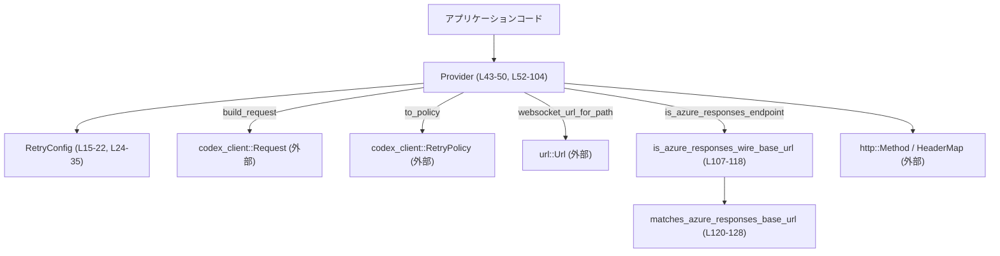
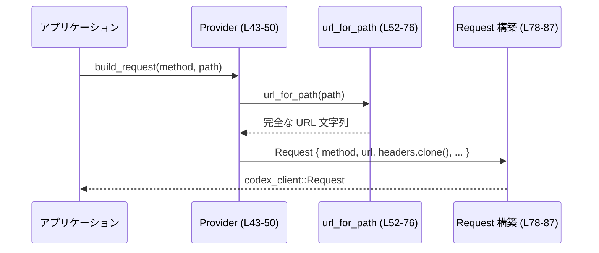
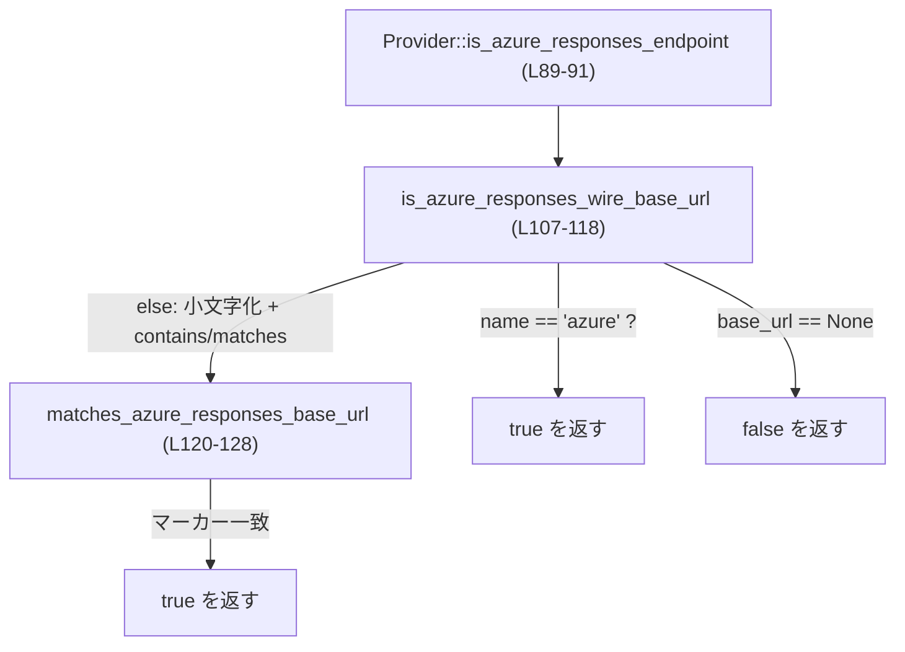

# codex-api/src/provider.rs コード解説

## 0. ざっくり一言

HTTP ベースの「プロバイダ」の接続設定（ベース URL・ヘッダ・クエリ・リトライ方針など）と、そこから実際の HTTP/WS リクエストを組み立てるためのユーティリティ、および Azure 系エンドポイントかどうかを判定するヘルパーをまとめたモジュールです（codex-api/src/provider.rs:L11-50, L52-105, L107-129）。

---

## 1. このモジュールの役割

### 1.1 概要

- `RetryConfig` で「高レベルのリトライ設定」を保持し、それを `codex_client` クレートの `RetryPolicy` に変換します（L11-22, L24-35）。
- `Provider` で 1 つの API エンドポイント（ベース URL／デフォルトヘッダ／クエリ／リトライ設定／ストリームのアイドルタイムアウト）を表現し、そこから HTTP/WS リクエストを構築します（L38-50, L52-104）。
- Azure OpenAI 系のエンドポイントかどうかを、プロバイダ名およびベース URL のパターンマッチで判定する関数群を提供します（L107-129）。

### 1.2 アーキテクチャ内での位置づけ

このモジュールは、より下位の HTTP クライアント実装である `codex_client` クレートに対して「設定済みエンドポイント」のラッパーを提供する位置づけです。



- アプリケーションコードは `Provider` インスタンスを保持し、必要に応じて `build_request` や `websocket_url_for_path` などを呼び出します（L52-104）。
- 実際の HTTP 送信は `codex_client::Request` と `RetryPolicy` に委譲されます（L1-4, L24-35, L78-87）。

### 1.3 設計上のポイント

- **設定とロジックの分離**  
  - リトライに関する高レベル設定 (`RetryConfig`) と、実際のトランスポート層リトライポリシー (`RetryPolicy`) を分け、変換メソッド `to_policy` で橋渡ししています（L11-22, L24-35）。
- **不変の設定オブジェクト**  
  - `RetryConfig` と `Provider` はともに `Debug + Clone` を実装する単純なデータ構造であり（L15, L42）、内部状態を変更するメソッドはありません。再利用や共有を前提とした設計と解釈できます。
- **URL の組み立てヘルパー**  
  - ベース URL とパス、クエリパラメータを安全に結合する `url_for_path` を提供し、他のメソッドはこのヘルパーに依存します（L52-76, L78-87, L93-95）。
- **Azure 判定ロジックのカプセル化**  
  - Azure OpenAI エンドポイントかどうかの判定が `is_azure_responses_wire_base_url` と `matches_azure_responses_base_url` に分離されており、テストも含めて独立して検証されています（L107-129, L131-170）。
- **安全性**  
  - このファイル内には `unsafe` ブロックやスレッド生成は存在せず（全体）、すべての処理は純粋な計算と文字列操作、および外部クレートの安全な API 利用に留まっています。

---

## 2. 主要な機能とコンポーネント一覧

### 2.1 コンポーネントインベントリー

#### 型（構造体）

| 名前 | 種別 | 行範囲 | 役割 / 用途 |
|------|------|--------|-------------|
| `RetryConfig` | 構造体 | codex-api/src/provider.rs:L15-22 | プロバイダ用の高レベルなリトライ設定（最大試行回数・基準ディレイ・どの種類のエラーでリトライするか）を保持します。 |
| `Provider` | 構造体 | codex-api/src/provider.rs:L43-50 | 1 つの HTTP API エンドポイントの設定（名前、ベース URL、クエリ、ヘッダ、リトライ、ストリームのアイドルタイムアウト）を保持し、リクエスト生成のヘルパーを提供します。 |

#### 関数・メソッド

| 名前 | 所属 | 公開 | 行範囲 | 役割 / 用途 |
|------|------|------|--------|-------------|
| `RetryConfig::to_policy` | `RetryConfig` impl | pub | L24-35 | `RetryConfig` から `codex_client::RetryPolicy` への変換を行い、低レベルクライアントの設定に適用できる形にします。 |
| `Provider::url_for_path` | `Provider` impl | pub | L52-76 | ベース URL とパス（およびクエリパラメータ）から完全な URL 文字列を組み立てます。 |
| `Provider::build_request` | `Provider` impl | pub | L78-87 | HTTP メソッドとパスから `codex_client::Request` を構築します。ヘッダやベース URL、圧縮設定などを組み込みます。 |
| `Provider::is_azure_responses_endpoint` | `Provider` impl | pub | L89-91 | このプロバイダが Azure OpenAI 応答エンドポイントに該当するかをブール値で返します。 |
| `Provider::websocket_url_for_path` | `Provider` impl | pub | L93-104 | ベース URL とパスから URL を組み立てたうえで、`ws`/`wss` スキームに変換した WebSocket 用 URL を返します。 |
| `is_azure_responses_wire_base_url` | モジュール関数 | pub | L107-118 | プロバイダ名とベース URL 文字列から、Azure OpenAI エンドポイントに該当するかを判定します。 |
| `matches_azure_responses_base_url` | モジュール関数 | private | L120-128 | 既知の Azure 系ドメインマーカー配列に対して、ベース URL の部分文字列一致を行うヘルパー関数です。 |
| `tests::detects_azure_responses_base_urls` | テスト関数 | private（テスト用） | L135-170 | Azure 判定ロジックが期待どおりの URL を認識・除外するかを検証します。 |

### 2.2 主要な機能一覧

- プロバイダ用リトライ設定 → `RetryPolicy` への変換
- HTTP エンドポイント（ベース URL + デフォルトヘッダ + クエリパラメータ + リトライ設定）の表現
- ベース URL とパスからの完全な URL 文字列の生成
- 上記 URL を利用した `codex_client::Request` の構築
- HTTP URL から WebSocket 用 URL へのスキーム変換
- プロバイダが Azure OpenAI 応答エンドポイントかどうかの判定ロジック
- Azure 判定ロジックのテスト（正例・負例に対する検証）

---

## 3. 公開 API と詳細解説

### 3.1 型一覧（構造体）

| 名前 | 種別 | 行範囲 | フィールド概要 |
|------|------|--------|----------------|
| `RetryConfig` | 構造体 | L15-22 | `max_attempts`: 最大試行回数, `base_delay`: リトライ間隔の基準値, `retry_429`: HTTP 429 でリトライするか, `retry_5xx`: HTTP 5xx でリトライするか, `retry_transport`: トランスポートエラーでリトライするか（すべて pub フィールド）（L17-21）。 |
| `Provider` | 構造体 | L43-50 | `name`: 識別名, `base_url`: ベース URL 文字列, `query_params`: 追加クエリパラメータ（省略可）, `headers`: デフォルト HTTP ヘッダ, `retry`: `RetryConfig`, `stream_idle_timeout`: ストリームのアイドルタイムアウト（L44-49）。 |

### 3.2 関数詳細（重要な 6 件）

#### `RetryConfig::to_policy(&self) -> RetryPolicy`

**概要**

`RetryConfig` を、`codex_client` が使用する低レベルな `RetryPolicy` 型に変換します（L24-35）。

**引数**

| 引数名 | 型 | 説明 |
|--------|----|------|
| `&self` | `&RetryConfig` | 現在のリトライ設定。フィールドの値がそのまま `RetryPolicy` にコピーされます。 |

**戻り値**

- `RetryPolicy` (`codex_client` クレートの型): トランスポート層で利用されるリトライポリシー。`max_attempts`, `base_delay`, `retry_on.retry_429`, `retry_on.retry_5xx`, `retry_on.retry_transport` が設定されます（L26-33）。

**内部処理の流れ**

1. 新しい `RetryPolicy` をリテラル構文で構築します（L26-34）。
2. `max_attempts` と `base_delay` は `self` から直接コピーします（L27-28）。
3. `RetryOn` 構造体をネストして初期化し、各種フラグ (`retry_429` など) を `self` からコピーします（L29-33）。

**Examples（使用例）**

```rust
use std::time::Duration;
use codex_client::RetryPolicy;
use codex_api::provider::RetryConfig; // 実際のパスはこのチャンクからは不明

// RetryConfig から RetryPolicy を生成する例
let cfg = RetryConfig {
    max_attempts: 5,
    base_delay: Duration::from_millis(200),
    retry_429: true,
    retry_5xx: true,
    retry_transport: true,
};

let policy: RetryPolicy = cfg.to_policy(); // codex-api/src/provider.rs:L24-35
```

**Errors / Panics**

- エラーもパニックも発生しません。単純な構造体のコピーのみです（L26-34）。

**Edge cases（エッジケース）**

- `max_attempts = 0` のような値もそのまま `RetryPolicy` に渡されます。妥当性チェックは行っていません（L26-34）。
- `base_delay` が 0 の場合も同様です。実際にどう解釈されるかは `codex_client` 側の実装に依存し、このチャンクからは分かりません。

**使用上の注意点**

- 値の妥当性（例: `max_attempts >= 1` など）は呼び出し側で保証する必要があります。この関数は検証を行いません（L26-34）。

---

#### `Provider::url_for_path(&self, path: &str) -> String`

**概要**

`Provider` の `base_url` と引数 `path` を結合し、必要に応じて `query_params` をクエリ文字列として付与した完全な URL を返します（L52-76）。

**引数**

| 引数名 | 型 | 説明 |
|--------|----|------|
| `&self` | `&Provider` | ベース URL、クエリパラメータなどを保持するプロバイダ。 |
| `path` | `&str` | ベース URL に対して追加するパス。前後の `/` は内部で調整されます（L56-60）。 |

**戻り値**

- `String`: 結合された URL 文字列。`query_params` が存在し空でない場合には `?key=value&...` が付加されます（L63-73）。

**内部処理の流れ**

1. `base_url` の末尾の `/` を削除して `base` とします（L54-55）。
2. `path` 先頭の `/` を削除して正規化します（L56）。
3. `path` が空なら `base` のコピー、それ以外は `"base/path"` 形式で文字列を組み立てます（L57-61）。
4. `query_params` が `Some` かつ非空であれば（L63-65）:
   - `key=value` 形式の文字列を `&` で連結し、`qs` とします（L66-70）。
   - `?` を付加したうえで `url` にクエリ文字列を追加します（L71-72）。
5. 完成した `url` を返します（L75）。

**Examples（使用例）**

```rust
use std::collections::HashMap;
use http::header::HeaderMap;
use std::time::Duration;
use codex_api::provider::{Provider, RetryConfig}; // 実際のパスはこのチャンクからは不明

let mut params = HashMap::new();
params.insert("api-version".to_string(), "2024-01-01".to_string());

let provider = Provider {
    name: "azure".to_string(),
    base_url: "https://foo.openai.azure.com/openai".to_string(),
    query_params: Some(params),
    headers: HeaderMap::new(),
    retry: RetryConfig {
        max_attempts: 3,
        base_delay: Duration::from_millis(100),
        retry_429: true,
        retry_5xx: true,
        retry_transport: true,
    },
    stream_idle_timeout: Duration::from_secs(30),
};

// "/deployments/bar" と同等に扱われる
let url = provider.url_for_path("deployments/bar"); // L52-76
// url == "https://foo.openai.azure.com/openai/deployments/bar?api-version=2024-01-01"
```

**Errors / Panics**

- パニックやエラーは発生しません。文字列操作のみです（L54-75）。

**Edge cases（エッジケース）**

- `base_url` が空文字列でも、そのまま使用されます（L54-61）。  
  例: `base_url=""`, `path="foo"` → `"foo"`。
- `path` が空、または `" / "` のような場合  
  - `.trim_start_matches('/')` により先頭 `/` が削除されるため、`path` が空なら `base` のみが返されます（L56-61）。
- `query_params = None` または `Some` だが空  
  - いずれの場合もクエリ文字列は付加されません（L63-65）。
- URL エンコードは行っていません  
  - `"="` や `"&"` を含むキーや値はそのまま連結されます（L66-70）。  
    エンコードが必要な場合は事前に行う必要があります。

**使用上の注意点**

- `query_params` に URL エンコードされていない文字列を入れると、期待しないクエリになる可能性があります（L66-70）。
- `base_url` にはスキームを含む完全なベース URL を入れる前提に見えますが、チェックは行っていません。このチャンクからは妥当性検証は不明です。

---

#### `Provider::build_request(&self, method: Method, path: &str) -> Request`

**概要**

`Provider` の設定を使って `codex_client::Request` を構築します。HTTP メソッド、URL、ヘッダ、ボディ、圧縮設定、タイムアウトを設定します（L78-87）。

**引数**

| 引数名 | 型 | 説明 |
|--------|----|------|
| `&self` | `&Provider` | ベース URL とデフォルトヘッダなどを保持するプロバイダ。 |
| `method` | `http::Method` | HTTP メソッド（GET, POST など）（L78）。 |
| `path` | `&str` | ベース URL に加えるパス。`url_for_path` に渡されます（L81）。 |

**戻り値**

- `codex_client::Request`:  
  - `method`: 引数 `method` をそのまま設定（L80）。  
  - `url`: `self.url_for_path(path)` の結果（L81）。  
  - `headers`: `self.headers.clone()` のコピー（L82）。  
  - `body`: `None`（L83）。  
  - `compression`: `RequestCompression::None`（L84）。  
  - `timeout`: `None`（L85）。

**内部処理の流れ**

1. `url_for_path` を使って完全な URL を文字列として生成します（L81）。
2. `self.headers` をクローンしてリクエストにコピーします（L82）。
3. 構造体リテラルで `Request` を初期化し、ボディなし・圧縮なし・タイムアウトなしとして返します（L79-86）。

**Examples（使用例）**

```rust
use http::Method;
use codex_client::Request;
use codex_api::provider::Provider;

// `provider` の構築は前述の例を参照
let req: Request = provider.build_request(Method::POST, "/chat/completions"); // L78-87

// ここで req.url, req.headers などを確認してから、実際の HTTP クライアントに渡す想定です。
```

**Errors / Panics**

- パニックは発生しません（L79-86）。
- `url_for_path` もエラーを返さないため、`build_request` もエラーを返しません（L52-76）。

**Edge cases（エッジケース）**

- `headers` に大量のヘッダがある場合でも `clone` されるため、頻繁に呼び出すとメモリコピーコストが増えます（L82）。
- ボディやタイムアウトは固定で `None` のため、これらを設定するには別のレイヤで `Request` を拡張する必要があると考えられます（L83-85）。

**使用上の注意点**

- この関数だけではボディやタイムアウトを設定できません。必要であれば返された `Request` を上書きするラッパーが別に存在している可能性がありますが、このチャンクには現れません。
- ヘッダは毎回 `clone` されるので、高頻度の呼び出しではパフォーマンスに注意が必要です（L82）。

---

#### `Provider::is_azure_responses_endpoint(&self) -> bool`

**概要**

`Provider` の `name` と `base_url` をもとに、Azure OpenAI 応答エンドポイントに該当するかどうかを返します（L89-91）。

**引数**

| 引数名 | 型 | 説明 |
|--------|----|------|
| `&self` | `&Provider` | プロバイダ。`name` と `base_url` が使用されます（L90）。 |

**戻り値**

- `bool`: Azure OpenAI 応答エンドポイントと判定される場合は `true`、それ以外は `false`（L89-91）。

**内部処理の流れ**

1. `is_azure_responses_wire_base_url(&self.name, Some(&self.base_url))` を呼び出し、その結果をそのまま返します（L90-91）。
2. 判定ロジック自体は `is_azure_responses_wire_base_url` に委譲されます（L107-118）。

**Examples（使用例）**

```rust
let is_azure = provider.is_azure_responses_endpoint(); // L89-91

if is_azure {
    // Azure 固有のヘッダやパラメータを追加する、といった分岐に利用できる想定です。
}
```

**Errors / Panics**

- パニックやエラーは発生しません（L89-91）。

**Edge cases（エッジケース）**

- `name` が `"Azure"`（大文字小文字問わず）であれば、`base_url` の内容にかかわらず `true` になります（L108-110, L153-156）。
- `base_url` が空文字列でも `Some("")` として渡され、`to_ascii_lowercase` などの処理が行われます（L112-117）。  
  判定自体は単純な部分文字列検索に依存します。

**使用上の注意点**

- 判定はあくまでヒューリスティック（名前および URL パターン）に基づくものであり、厳密な保証ではありません（L107-118）。
- Azure 判定に依存したロジックを追加する場合は、`tests` モジュールのテストケースを参考に挙動を確認するのが安全です（L135-170）。

---

#### `Provider::websocket_url_for_path(&self, path: &str) -> Result<Url, url::ParseError>`

**概要**

`url_for_path` で組み立てた URL をパースし、HTTP スキーム (`http` / `https`) の場合は WebSocket 用スキーム (`ws` / `wss`) に変換して返します（L93-104）。

**引数**

| 引数名 | 型 | 説明 |
|--------|----|------|
| `&self` | `&Provider` | ベース URL を含むプロバイダ。 |
| `path` | `&str` | ベース URL に追加するパス。`url_for_path` に渡されます（L94）。 |

**戻り値**

- `Result<Url, url::ParseError>`:  
  - `Ok(Url)`: 組み立て・パース・スキーム変換に成功した URL。  
  - `Err(url::ParseError)`: 文字列から URL へのパースに失敗した場合（L94）。

**内部処理の流れ**

1. `self.url_for_path(path)` で URL 文字列を生成し、`Url::parse` に渡して `Url` 型にパースします（L93-95）。
2. `url.scheme()` の値で `match` を行います（L96-101）。
   - `"http"` → WebSocket スキーム `"ws"` に変換対象（L97）。
   - `"https"` → `"wss"` に変換対象（L98）。
   - `"ws"` / `"wss"` → すでに WebSocket スキームなので `Ok(url)` を即座に返します（L99）。
   - その他 → そのままの URL で `Ok(url)` を返します（L100）。
3. `set_scheme(scheme)` を呼び出してスキームを書き換えますが、戻り値は無視しています（L102）。
4. 変換済みの `url` を `Ok(url)` で返します（L103-104）。

**Examples（使用例）**

```rust
use url::Url;
use codex_api::provider::Provider;

// 例: base_url = "https://foo.openai.azure.com/openai"
let ws_url: Url = provider
    .websocket_url_for_path("chat") // L93-104
    .expect("invalid URL");

assert!(matches!(ws_url.scheme(), "wss")); // https -> wss に変換される
```

**Errors / Panics**

- `Url::parse` が失敗した場合に `Err(url::ParseError)` を返します（L94）。
- パニックは使用していません。

**Edge cases（エッジケース）**

- `base_url` や `path` が不正な文字列で URL として解釈できない場合 → `ParseError` になります（L93-95）。
- すでに `ws` または `wss` スキームを持つ URL 文字列が生成された場合  
  → 変換を行わず、そのまま返します（L99）。
- `"http"` / `"https"` 以外のスキーム（例: `"ftp"`）の場合  
  → スキーム変換は行わず、そのまま返します（L100）。
- `set_scheme` のエラーは無視しているため、理論上変換に失敗しても元の URL が返ってくる可能性があります（L102）。ただし通常の `"http"` → `"ws"` などは成功すると想定されます。

**使用上の注意点**

- 戻り値が `Result` であるため、呼び出し側で必ずエラー処理を行う必要があります（`?` 演算子や `match` など）（L93-95）。
- スキーム変換を必ず保証したい場合は、`url.scheme()` の戻り値を呼び出し側でも検証することが有効です（L96-103）。

---

#### `is_azure_responses_wire_base_url(name: &str, base_url: Option<&str>) -> bool`

**概要**

プロバイダ名とオプションのベース URL 文字列から、そのエンドポイントが Azure OpenAI の応答エンドポイントに該当するかどうかを判定します（L107-118）。

**引数**

| 引数名 | 型 | 説明 |
|--------|----|------|
| `name` | `&str` | プロバイダ名。`"azure"`（大文字小文字を無視）と一致するかどうかがまずチェックされます（L108）。 |
| `base_url` | `Option<&str>` | ベース URL 文字列。`Some` の場合にドメインパターンでの判定に使われます（L112-117）。 |

**戻り値**

- `bool`: Azure OpenAI 応答エンドポイントと判定される場合は `true`、それ以外は `false`（L107-118）。

**内部処理の流れ**

1. `name.eq_ignore_ascii_case("azure")` が `true` の場合、即座に `true` を返します（L108-110）。
2. `base_url` が `None` の場合、`false` を返します（L112-114）。
3. `base_url` を小文字化して `base` に格納します（L116）。
4. `base.contains("openai.azure.")` が真か、または `matches_azure_responses_base_url(&base)` が真であれば `true` を返します（L117）。
   - そうでなければ `false` を返します。

**Examples（使用例）**

```rust
use codex_api::provider::is_azure_responses_wire_base_url;

assert!(is_azure_responses_wire_base_url(
    "test",
    Some("https://foo.openai.azure.com/openai")
)); // L137-143, L117

assert!(!is_azure_responses_wire_base_url(
    "test",
    Some("https://api.openai.com/v1")
)); // L158-162
```

**Errors / Panics**

- エラー・パニックは発生しません。すべて文字列操作と論理演算です（L107-118）。

**Edge cases（エッジケース）**

- `name = "Azure"` のように大文字小文字が混在していても `true` になります（L108-110, L153-156）。
- `base_url = None` でも `name` が `"azure"` なら `true` です（L108-114）。  
  逆に `name` が `"azure"` でない場合、`base_url = None` なら必ず `false` です。
- ベース URL に `"openai.azure."` を含むか、`matches_azure_responses_base_url` が検出可能ないくつかのマーカー文字列を含む場合に `true` になります（L116-118, L121-127）。
- テストでは、Azure 風だが非対応とみなしたいパターン（`azurewebsites.net` など）は `false` になることが確認されています（L158-162, L164-168）。

**使用上の注意点**

- 判定ロジックは今後 Azure 側のドメインパターンが増えると更新が必要になる可能性があります（L121-127）。
- プロバイダ名と URL の両方に依存するため、どちらかの設定ミスで期待と異なる判定になるリスクがあります。

---

#### `matches_azure_responses_base_url(base_url: &str) -> bool`

**概要**

Azure 関連の既知のドメインマーカー配列 `AZURE_MARKERS` に対して、`base_url` がいずれかを含んでいるかどうかを判定します（L120-128）。

**引数**

| 引数名 | 型 | 説明 |
|--------|----|------|
| `base_url` | `&str` | 小文字化済みのベース URL 文字列を渡す前提で使われています（L116-117, L120）。 |

**戻り値**

- `bool`: 既知のマーカーを含んでいれば `true`、含んでいなければ `false`（L128）。

**内部処理の流れ**

1. 定数配列 `AZURE_MARKERS` を定義します（L121-127）。
   - `"cognitiveservices.azure."`
   - `"aoai.azure."`
   - `"azure-api."`
   - `"azurefd."`
   - `"windows.net/openai"`
2. `.iter().any(|marker| base_url.contains(marker))` でいずれかのマーカーを含むかチェックします（L128）。

**Examples（使用例）**

```rust
let base = "https://foo.cognitiveservices.azure.cn/openai".to_ascii_lowercase();
assert!(matches_azure_responses_base_url(&base)); // L121-128
```

**Errors / Panics**

- エラー・パニックは発生しません（L121-128）。

**Edge cases（エッジケース）**

- 部分文字列一致であるため、予期しないサブドメインに対してもマッチする可能性がありますが、テストでは代表的な正例のみがカバーされています（L137-144）。

**使用上の注意点**

- 新しい Azure ドメインパターンに対応するには、この配列を変更する必要があります（L121-127）。
- `is_azure_responses_wire_base_url` 内でのみ利用されており、直接呼ぶよりは上位関数を通じて利用する設計になっています（L117-118）。

---

### 3.3 その他の関数

| 関数名 | 行範囲 | 役割（1 行） |
|--------|--------|--------------|
| `tests::detects_azure_responses_base_urls` | L135-170 | Azure 判定ロジック (`is_azure_responses_wire_base_url`) が代表的な URL に対して正しく `true` / `false` を返すことを確認する単体テストです。 |

---

## 4. データフロー

ここでは「HTTP リクエスト組み立て」と「Azure 判定」の 2 つの代表的なフローを整理します。

### 4.1 HTTP リクエスト組み立てフロー

アプリケーションが `Provider` を通じて HTTP リクエストを組み立てるフローです。



- `build_request` は必ず `url_for_path` を経由して URL を構築します。そのため、パスの前後に `/` の有無を気にせずに利用できます（L52-61, L78-82）。
- `Provider` が持つデフォルトヘッダは `clone` されてリクエストにコピーされ、元の `Provider` は不変のままです（L82）。

### 4.2 Azure 判定フロー

`Provider::is_azure_responses_endpoint` から判定関数をどのように辿るかを示します。



- 判定の最優先条件は「名前が `azure` かどうか」であり（L108-110）、そこにマッチする場合は URL に関係なく `true` になります。
- 次に URL の有無、その後にドメインパターンによる判定が行われます（L112-118, L121-128）。

---

## 5. 使い方（How to Use）

### 5.1 基本的な使用方法

`Provider` と `RetryConfig` を組み合わせて HTTP リクエストを構築する典型的な例です。

```rust
use std::collections::HashMap;
use std::time::Duration;
use http::{Method, header::HeaderMap};
use codex_client::Request;
use codex_api::provider::{Provider, RetryConfig}; // 実際のモジュールパスはこのチャンクには現れません

fn main() -> Result<(), Box<dyn std::error::Error>> {
    // リトライ設定を用意する (L15-22, L24-35)
    let retry = RetryConfig {
        max_attempts: 3,
        base_delay: Duration::from_millis(200),
        retry_429: true,
        retry_5xx: true,
        retry_transport: true,
    };

    // クエリパラメータを設定する (L46-47, L63-73)
    let mut params = HashMap::new();
    params.insert("api-version".to_string(), "2024-01-01".to_string());

    // デフォルトヘッダ (L47)
    let mut headers = HeaderMap::new();
    // 必要に応じて Authorization などを追加する

    // Provider を構築する (L43-50)
    let provider = Provider {
        name: "azure".to_string(),
        base_url: "https://foo.openai.azure.com/openai".to_string(),
        query_params: Some(params),
        headers,
        retry,
        stream_idle_timeout: Duration::from_secs(60),
    };

    // HTTP リクエストを組み立てる (L78-87)
    let req: Request = provider.build_request(Method::POST, "/deployments/bar/chat/completions");

    // ここで req を codex_client の送信 API に渡す、という利用を想定できます。
    Ok(())
}
```

### 5.2 よくある使用パターン

#### Azure 判定に基づく処理分岐

```rust
use codex_api::provider::is_azure_responses_wire_base_url;

fn configure_provider(name: &str, base_url: &str) {
    let is_azure = is_azure_responses_wire_base_url(name, Some(base_url)); // L107-118
    if is_azure {
        // Azure 固有のパラメータやヘッダの設定
    } else {
        // 通常の OpenAI などの設定
    }
}
```

#### WebSocket URL の取得

```rust
use url::Url;

fn get_ws_url(provider: &Provider) -> Result<Url, url::ParseError> {
    // HTTP(S) のベース URL から ws/wss URL を得る (L93-104)
    provider.websocket_url_for_path("realtime")
}
```

### 5.3 よくある間違い

```rust
// 間違い例: path にフル URL を渡してしまう
// base_url = "https://foo.openai.azure.com/openai"
let req = provider.build_request(
    Method::GET,
    "https://foo.openai.azure.com/openai/deployments/bar",
);
// -> url_for_path が base_url と結合してしまい、
//    不正な URL 文字列になる可能性があります（L52-61）。

// 正しい例: path は base_url からの相対パスとして渡す
let req = provider.build_request(Method::GET, "/deployments/bar");
```

```rust
// 間違い例: query_params にエンコードされていない特殊文字を含める
let mut params = HashMap::new();
params.insert("q".to_string(), "a b&c=d".to_string()); // スペースや &, = を含む (L66-70)
// -> URL エンコードされず、そのまま "q=a b&c=d" となる。

// 正しい例: 呼び出し側で URL エンコードした文字列を格納する
let encoded_value = urlencoding::encode("a b&c=d").to_string(); // 外部クレート利用（このチャンクには現れません）
params.insert("q".to_string(), encoded_value);
```

### 5.4 使用上の注意点（まとめ）

- **エラー処理**  
  - `build_request` と `url_for_path` はエラーを返さない設計ですが、`websocket_url_for_path` は URL パースエラーを返し得るため、`Result` を適切に処理する必要があります（L93-95）。
- **スレッド安全性・並行性**  
  - このファイルにはスレッド関連のコードはなく、`Provider` も内部状態を変更しません（L43-50, L52-104）。  
    ただし実際に `Send` / `Sync` かどうかはフィールド型とクレート全体の設計に依存し、このチャンクだけからは断定できません。
- **Azure 判定の依存**  
  - `is_azure_responses_wire_base_url` のロジックに依存した挙動を追加する場合は、テストケース（正例・負例）を参考に期待値を明確にしておく必要があります（L137-170）。
- **パフォーマンス**  
  - `build_request` ごとにヘッダを `clone` するため、高頻度で大量のヘッダを伴う場合にはコストになる可能性があります（L82）。

---

## 6. 変更の仕方（How to Modify）

### 6.1 新しい機能を追加する場合

1. **新しいリトライ要件を追加したい場合**  
   - `RetryConfig` にフィールドを追加し（L17-21）、`to_policy` で `RetryPolicy` へのマッピングを更新します（L26-33）。  
   - `RetryOn` 構造体の定義は `codex_client` 側にあるため、その型にフィールドが存在するかを確認する必要があります（このチャンクには定義が現れません）。
2. **プロバイダ固有の派生設定を追加したい場合**  
   - 例: タイムアウトやプロキシ設定など。  
   - `Provider` 構造体にフィールドを追加し（L44-49）、`build_request` などのメソッドでその値を `Request` に反映させる新規メソッドを追加するのが自然です（L78-87）。
3. **新しい Azure ドメインパターンへの対応**  
   - `AZURE_MARKERS` にマーカー文字列を追加し（L121-127）、既存テストに新しい正例ケースを追加することで挙動を検証できます（L137-144）。

### 6.2 既存の機能を変更する場合

- **URL 組み立てロジックの変更**  
  - `url_for_path` の実装を変更する場合（例: URL エンコード対応など）、それに依存する `build_request` と `websocket_url_for_path` の挙動も変わるため、両方の呼び出し元の期待値を確認する必要があります（L52-76, L78-87, L93-95）。
- **Azure 判定ロジックの変更**  
  - `is_azure_responses_wire_base_url` または `matches_azure_responses_base_url` を変更する際は、`tests::detects_azure_responses_base_urls` の正例・負例を必ず更新・追加して意図どおりの挙動を保証する必要があります（L107-118, L120-128, L135-170）。
- **契約（前提条件）の維持**  
  - 例えば `websocket_url_for_path` が現在 `Result<Url, ParseError>` を返す契約を持っているため、将来これを `panic!` ベースに変えるような修正は呼び出し側のエラー処理に大きな影響を与えます（L93-95）。  
    変更する場合は、影響範囲の把握と慎重な移行が必要です。

---

## 7. 関連ファイル

このチャンク内から直接分かる関連コンポーネントを列挙します。外部クレートの具体的なファイルパスはこのチャンクには現れないため、「不明」としています。

| パス / モジュール | 役割 / 関係 |
|-------------------|------------|
| `codex_client::Request` | `Provider::build_request` の戻り値となる HTTP リクエスト型。URL・ヘッダ・ボディなどを保持します（L1, L78-87）。 |
| `codex_client::RetryPolicy` / `RetryOn` | `RetryConfig::to_policy` が生成するリトライポリシー型。トランスポート層のリトライ挙動を制御します（L2-4, L24-35）。 |
| `http::Method` | HTTP メソッド（GET, POST など）を表す型。`build_request` の引数として使用されます（L5, L78）。 |
| `http::header::HeaderMap` | HTTP ヘッダのマップを表す型。`Provider.headers` に使用されます（L6, L47）。 |
| `url::Url` | パース済み URL を表す型。`websocket_url_for_path` の戻り値に使用されます（L9, L93-104）。 |
| `std::time::Duration` | リトライのベースディレイやストリームのアイドルタイムアウトを表す時間型（L8, L18, L49）。 |
| `tests` モジュール | `is_azure_responses_wire_base_url` と `matches_azure_responses_base_url` の挙動を検証する単体テストを提供します（L131-170）。 |

このチャンクには、これらの型を実際にどのように送受信処理と結合するかを示すコードは含まれていないため、送信部分は別モジュール（不明）に実装されていると考えられます。
