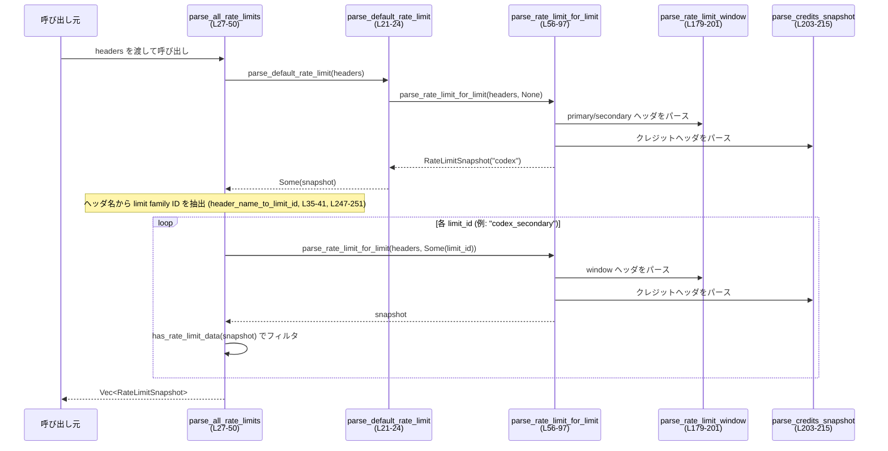
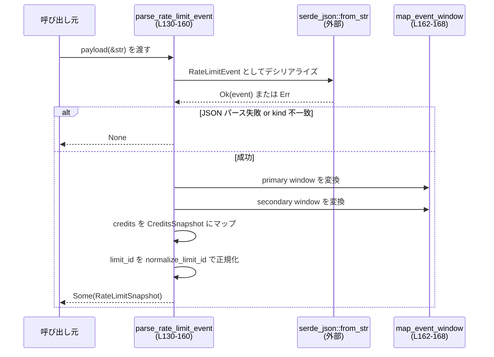

# codex-api/src/rate_limits.rs コード解説

## 0. ざっくり一言

HTTP レスポンスヘッダおよび JSON イベントペイロードから、`RateLimitSnapshot` / `CreditsSnapshot` などの内部表現に変換する **レート制限情報パーサ**を提供するモジュールです（codex-api/src/rate_limits.rs:L1-160）。

---

## 1. このモジュールの役割

### 1.1 概要

- このモジュールは Codex API が返す **レート制限ヘッダ群**や **レート制限イベント JSON** を解析し、`codex_protocol::protocol::RateLimitSnapshot` へ変換します（L21-24, L27-50, L56-97, L130-160）。
- 複数の「メータードリミット（`codex`, `codex_secondary` など）」を識別し、それぞれの primary / secondary window やクレジット残高情報をまとめて返す機能を持ちます。
- ヘッダのパースに失敗した場合でも基本的にパニックせず、`Option` で「情報なし」として扱う設計になっています（L217-222, L228-236, L239-241）。

### 1.2 アーキテクチャ内での位置づけ

`HeaderMap` / JSON 文字列 → 本モジュール → codex_protocol のスナップショット型、という流れです。

```mermaid
flowchart LR
    subgraph "外部入力"
        H[HTTPレスポンスヘッダ<br/>http::HeaderMap]
        J[JSONイベントペイロード<br/>&str]
    end

    subgraph "rate_limits.rs (L1-255)"
        A[parse_all_rate_limits<br/>(L27-50)]
        D[parse_default_rate_limit<br/>(L21-24)]
        F[parse_rate_limit_for_limit<br/>(L56-97)]
        E[parse_rate_limit_event<br/>(L130-160)]
        P[parse_promo_message<br/>(L171-177)]
        W[parse_rate_limit_window<br/>(L179-201)]
        C[parse_credits_snapshot<br/>(L203-215)]
    end

    subgraph "codex_protocol::protocol"
        S[RateLimitSnapshot<br/>(このチャンクには定義が現れない)]
        W2[RateLimitWindow<br/>(同上)]
        CS[CreditsSnapshot<br/>(同上)]
    end

    H --> A
    H --> D
    H --> F
    H --> P
    A --> F
    F --> W
    F --> C
    J --> E
    E --> S
    A --> S
    D --> S
    F --> S
```

### 1.3 設計上のポイント

- **純粋関数ベース**  
  - すべての処理が `&HeaderMap` や `&str` から値を計算して返すだけで、副作用（グローバル状態の変更や I/O）はありません（L21-24, L27-50, L56-97, L130-160）。
- **Option ベースのエラーハンドリング**  
  - ヘッダや JSON の不正値は `Option::None` として扱い、呼び出し側に「情報がなかった／解釈できなかった」と伝えます（L217-222, L228-236, L239-241）。
- **名前規約に基づく拡張性**  
  - ヘッダ名からメータードリミット ID を自動抽出するロジック（`header_name_to_limit_id`）があり、新しい limit family が追加されてもヘッダ規約に従えば自動で検出されます（L247-251）。
- **浮動小数点・整数・真偽値の安全なパース**  
  - 数値パースは `.ok()` や `is_finite()` で検証され、NaN/∞ は排除されます（L217-222）。
- **並行性の観点**  
  - 共有可変状態を持たず、入力も共有参照 (`&HeaderMap`, `&str`) のみのため、複数スレッドから並列に呼び出しても内部状態競合は発生しません。

---

## 2. コンポーネント一覧と主要な機能

### 2.1 型一覧（構造体）

| 名前 | 種別 | 公開 | 行範囲 | 役割 / 用途 |
|------|------|------|--------|------------|
| `RateLimitError` | 構造体 | `pub` | codex-api/src/rate_limits.rs:L10-13 | レート制限関連のエラーメッセージをラップする簡単な型。`message: String` フィールド1つのみ。Display 実装あり（L15-19）。 |
| `RateLimitEventWindow` | 構造体 | 非公開 | L99-104 | JSON イベント内の単一 window（使用率・window 長・リセット時刻）表現。`Deserialize` 派生。 |
| `RateLimitEventDetails` | 構造体 | 非公開 | L106-110 | JSON イベント内の primary/secondary window のまとまり。 |
| `RateLimitEventCredits` | 構造体 | 非公開 | L112-117 | JSON イベント内のクレジット情報（残高 / 無制限フラグ）表現。 |
| `RateLimitEvent` | 構造体 | 非公開 | L119-128 | レート制限イベント JSON 全体の受け皿。`type`, `plan_type`, `rate_limits`, `credits`, `metered_limit_name`, `limit_name` を含む。 |
| `RateLimitSnapshot` | 構造体 | 外部 crate | （このチャンクには定義が現れない） | レート制限のスナップショット。フィールド使用箇所から、`limit_id`, `limit_name`, `primary`, `secondary`, `credits`, `plan_type` を持つことが分かります（L89-96, L152-158）。 |
| `RateLimitWindow` | 構造体 | 外部 crate | （同上） | 単一レートリミット window を表す。`used_percent`, `window_minutes`, `resets_at` を持つと読み取れます（L164-167, L195-199）。 |
| `CreditsSnapshot` | 構造体 | 外部 crate | （同上） | クレジット残高のスナップショット。`has_credits`, `unlimited`, `balance` を持つと読み取れます（L143-147, L210-214）。 |
| `PlanType` | 列挙体推定 | 外部 crate | （同上） | アカウントのプラン種別。詳細はこのチャンクには現れませんが、`RateLimitSnapshot.plan_type` の型として用いられています（L123, L158）。 |

### 2.2 関数一覧

| 関数名 | 公開 | 行範囲 | 役割（1 行） |
|--------|------|--------|--------------|
| `RateLimitError::fmt` | 非公開（trait impl） | L15-18 | `Display` 実装。`message` をそのまま書式化。 |
| `parse_default_rate_limit` | `pub` | L21-24 | デフォルト limit (`codex`) のヘッダ群から `RateLimitSnapshot` を構築。 |
| `parse_all_rate_limits` | `pub` | L27-50 | すべての limit family のヘッダを探索し、limit ごとに `RateLimitSnapshot` の Vec を返す。 |
| `parse_rate_limit_for_limit` | `pub` | L56-97 | 指定された limit ID 用の primary/secondary window・クレジット・limit 名をヘッダから読み取り、`RateLimitSnapshot` にまとめる。 |
| `parse_rate_limit_event` | `pub` | L130-160 | JSON イベントペイロードから `RateLimitSnapshot` を構築（webhook/stream 用）。 |
| `parse_promo_message` | `pub` | L171-177 | `x-codex-promo-message` ヘッダからプロモメッセージ文字列を取得。 |
| `map_event_window` | 非公開 | L162-168 | `RateLimitEventWindow` を `RateLimitWindow` に変換するヘルパ。 |
| `parse_rate_limit_window` | 非公開 | L179-201 | 3つのヘッダから window 情報をパースして `RateLimitWindow` を構築。 |
| `parse_credits_snapshot` | 非公開 | L203-215 | クレジット関連ヘッダから `CreditsSnapshot` を構築。 |
| `parse_header_f64` | 非公開 | L217-222 | ヘッダ文字列を `f64` に安全に変換。非有限値を除外。 |
| `parse_header_i64` | 非公開 | L224-225 | ヘッダ文字列を `i64` に変換。 |
| `parse_header_bool` | 非公開 | L228-236 | `"true"/"false"/"1"/"0"` を bool に変換。それ以外は `None`。 |
| `parse_header_str` | 非公開 | L239-241 | ヘッダ値を UTF-8 文字列スライスとして取得。失敗時は `None`。 |
| `has_rate_limit_data` | 非公開 | L243-245 | スナップショットに primary/secondary/credits のいずれかがあるか判定。 |
| `header_name_to_limit_id` | 非公開 | L247-251 | ヘッダ名（例: `x-codex-secondary-primary-used-percent`）から limit ID（`codex_secondary`）を抽出。 |
| `normalize_limit_id` | 非公開 | L254-255 | 前後空白除去・小文字化・`-` を `_` に置換した limit ID を生成。 |

### 2.3 主要な機能一覧

- デフォルト limit (`codex`) のレート制限ヘッダパース（`parse_default_rate_limit`）。
- すべての limit family のレート制限ヘッダを走査し、family ごとのスナップショット一覧を生成（`parse_all_rate_limits`）。
- 任意 limit ID のレート制限ヘッダをパースし、window / クレジット / 表示名をまとめる（`parse_rate_limit_for_limit`）。
- レート制限イベント JSON からスナップショットを構築（`parse_rate_limit_event`）。
- プロモーションメッセージヘッダの取得（`parse_promo_message`）。
- 各種ヘッダ値の安全な変換ユーティリティ（`parse_header_*` 系）。

---

## 3. 公開 API と詳細解説

### 3.1 公開型一覧

| 名前 | 種別 | 行範囲 | 説明 |
|------|------|--------|------|
| `RateLimitError` | 構造体 | L10-13 | エラーメッセージ用のラッパ。`Display` 実装によりユーザー向けメッセージとして表示可能です（L15-19）。 |

> 備考: このファイル内では `RateLimitError` は使用されておらず、他モジュールから利用されている可能性があります（このチャンクには呼び出しは現れません）。

---

### 3.2 重要関数の詳細

#### `parse_all_rate_limits(headers: &HeaderMap) -> Vec<RateLimitSnapshot>`（L27-50）

**概要**

- HTTP ヘッダ全体から、既知のすべての rate limit family（`codex`, `codex_secondary`, …）について `RateLimitSnapshot` を生成します。
- デフォルトの `codex` family は、ヘッダがなくても必ず 1 つ目の要素として含まれます（テスト L354-364）。

**引数**

| 引数名 | 型 | 説明 |
|--------|----|------|
| `headers` | `&HeaderMap` | HTTP レスポンスヘッダ全体。キーはヘッダ名、値は `HeaderValue` です。 |

**戻り値**

- `Vec<RateLimitSnapshot>`  
  各 limit family ごとのスナップショット。  
  - `updates[0]` は常に `limit_id == Some("codex")` となります（テスト L347-351）。
  - それ以外の要素は limit ID に応じてソートされた順で並びます（`BTreeSet` 使用により lexicographical 順、L33-41）。

**内部処理の流れ**

1. 空の `Vec<RateLimitSnapshot>` を作成（L28）。
2. `parse_default_rate_limit(headers)` を呼び、`Some` であれば先頭に push（L29-31）。  
   - 現状 `parse_rate_limit_for_limit` は常に `Some` を返すため、実質必ず 1 件追加されます（L56-97）。
3. すべてのヘッダキーを走査し、`header_name_to_limit_id` で limit family ID を抽出（L35-38, L247-251）。
   - `-primary-used-percent` で終わる `x-` プレフィックス付きヘッダのみ対象。
   - 既に追加済みの `"codex"` は除外（L37-38）。
   - 抽出した ID は `BTreeSet` に格納し、重複を排除しつつソート（L33-41）。
4. `limit_ids` をイテレートし、各 ID について `parse_rate_limit_for_limit(headers, Some(id))` を呼ぶ（L44-46）。
5. 生成されたスナップショットにレート制限データがあるか `has_rate_limit_data` で判定し、データがあるものだけを結果に追加（L44-47, L243-245）。
6. 最終的な `Vec<RateLimitSnapshot>` を返す（L49）。

**Examples（使用例）**

```rust
use http::HeaderMap;
use codex_api::rate_limits::parse_all_rate_limits; // 実際のパスはプロジェクト構成に依存

fn handle_response(headers: &HeaderMap) {
    // すべての limit family のスナップショットを取得する
    let snapshots = parse_all_rate_limits(headers);

    // 例: codex デフォルト limit の primary window 使用率をログに出す
    if let Some(default) = snapshots.iter().find(|s| s.limit_id.as_deref() == Some("codex")) {
        if let Some(primary) = &default.primary {
            println!("codex primary used: {}%", primary.used_percent);
        }
    }
}
```

**Errors / Panics**

- パニックを起こすコードパスはありません（`unwrap`/`expect` は使用していません）。
- 解析に失敗したヘッダ（不正な数値など）は単に無視され、その family の window が欠落した状態でスナップショットが作られます。

**Edge cases（エッジケース）**

- ヘッダがまったくない場合  
  - `updates.len() == 1` で、`limit_id == Some("codex")` かつ `primary/secondary/credits` はすべて `None` になります（テスト L354-364）。
- 特定 family のヘッダがあるが、使用率が 0 かつ window 長 0、リセット時刻なしの場合  
  - `parse_rate_limit_window` 内の `has_data` 判定により window は生成されず（L191-199）、`has_rate_limit_data` も `false` となるので、その family は結果に含まれません。
- ヘッダ名が規約 (`x-<limit>-primary-used-percent`) に従っていない場合  
  - `header_name_to_limit_id` が `None` を返し、そのヘッダは無視されます（L247-251）。

**使用上の注意点**

- `parse_all_rate_limits` は「常に codex のスナップショットを1つ返す」という契約を前提に設計されており、「データがある family のみ返る」とは限りません。呼び出し側で `primary/secondary/credits` の `Option` を確認する必要があります。
- limit family の順序は安定していますが（`BTreeSet` による、L33-41）、アルファベット順であり API 側の優先度とは無関係です。

---

#### `parse_rate_limit_for_limit(headers: &HeaderMap, limit_id: Option<&str>) -> Option<RateLimitSnapshot>`（L56-97）

**概要**

- 特定の limit ID（例: `"codex"`, `"codex_secondary"`, `"codex_bengalfox"`）に対応するヘッダ群をパースし、1 つの `RateLimitSnapshot` にまとめます。
- limit ID が `None` の場合は `"codex"` とみなします（コメントおよびテスト L54-55, L265-287）。

**引数**

| 引数名 | 型 | 説明 |
|--------|----|------|
| `headers` | `&HeaderMap` | HTTP レスポンスヘッダ。 |
| `limit_id` | `Option<&str>` | メータードリミット ID。`None` の場合は `"codex"`。例: `"codex_secondary"`, `"codex_bengalfox"`。 |

**戻り値**

- `Option<RateLimitSnapshot>`  
  現状の実装では必ず `Some` を返します（`None` となる分岐がありません）が、シグネチャ上は将来 `None` を返す拡張余地が残されています。

**内部処理の流れ**

1. `limit_id` を正規化し、ヘッダプレフィックスに変換（L60-66）。
   - `trim` → 空文字を除外（L60-62）。
   - `None` または空文字の場合は `"codex"`（L63）。
   - 小文字化し、`_` を `-` に置換（例: `"codex_secondary"` → `"codex-secondary"`、L64-65）。
   - 先頭に `"x-"` を付けて `prefix` を作成（例: `"x-codex-secondary"`, L66）。
2. `parse_rate_limit_window` を使って primary window をパース（L67-72）。
   - ヘッダ名: `"{prefix}-primary-used-percent"` など。
3. 同様に secondary window をパース（L74-79）。
4. `normalize_limit_id` で snapshot 用の limit ID を正規化（L81, L254-255）。
   - 小文字化・空白除去・`-` → `_` 置換。例: `"codex-secondary"` → `"codex_secondary"`。
5. `parse_credits_snapshot` でクレジット情報を取得（L82, L203-215）。
6. `"{prefix}-limit-name"` ヘッダから表示名（`limit_name`）を取得し、空白トリムと空文字除外を行う（L83-87）。
7. 上記の要素をまとめて `RateLimitSnapshot` を生成し `Some` で返却（L89-96）。

**Examples（使用例）**

デフォルト `codex` のパース（テストと同等の例、L265-287）:

```rust
use http::{HeaderMap, HeaderValue};
use codex_api::rate_limits::parse_rate_limit_for_limit;

let mut headers = HeaderMap::new();                                       // ヘッダマップを作成
headers.insert("x-codex-primary-used-percent", HeaderValue::from_static("12.5"));
headers.insert("x-codex-primary-window-minutes", HeaderValue::from_static("60"));
headers.insert("x-codex-primary-reset-at", HeaderValue::from_static("1704069000"));

let snapshot = parse_rate_limit_for_limit(&headers, None).expect("snapshot"); // limit_id None → "codex"
assert_eq!(snapshot.limit_id.as_deref(), Some("codex"));                      // 正規化された ID
let primary = snapshot.primary.expect("primary");
assert_eq!(primary.used_percent, 12.5);
assert_eq!(primary.window_minutes, Some(60));
assert_eq!(primary.resets_at, Some(1704069000));
```

**Errors / Panics**

- パニックはありません。
- ヘッダが存在しない、不正なフォーマットの場合:
  - 該当整数・浮動小数・bool は `None` として扱われます（L217-222, L224-225, L228-236）。
  - `parse_rate_limit_window` の `has_data` 判定で、実質的にデータがない場合は window が `None` になります（L191-199）。
  - `parse_credits_snapshot` がヘッダ欠如で `None` を返す可能性があります（L203-215）。

**Edge cases**

- `limit_id` が空文字や空白のみ:  
  - `trim` と `filter(|name| !name.is_empty())` により `"codex"` が使用されます（L60-63）。
- primary / secondary の全てのヘッダが欠落 or 0:  
  - `primary`/`secondary` は `None` になります（L191-199）。
- `x-<limit>-limit-name` が空文字または空白:  
  - `limit_name` は `None` になります（L84-87）。

**使用上の注意点**

- `limit_id` と実際のヘッダプレフィックスとの対応は、`_` ⇔ `-` の変換規則で行われます（L60-66, L254-255）。ヘッダ命名側と呼び出し側でこの規約を合わせる必要があります。
- `Option` を返しつつ、実実装では常に `Some` という点に留意し、将来 `None` を返すような変更が入る可能性を考慮するとよいです。

---

#### `parse_default_rate_limit(headers: &HeaderMap) -> Option<RateLimitSnapshot>`（L21-24）

**概要**

- デフォルト limit family (`codex`) のヘッダ群をパースするための薄いラッパです。
- `parse_rate_limit_for_limit(headers, None)` を呼び出すだけです（L22-23）。

**引数 / 戻り値**

- `headers: &HeaderMap`  
- 戻り値は `Option<RateLimitSnapshot>` ですが、現状 `Some` を常に返します（上記の通り）。

**使用例**

```rust
let snapshot = parse_default_rate_limit(&headers).expect("should always be Some");
assert_eq!(snapshot.limit_id.as_deref(), Some("codex"));
```

**注意点**

- 返り値の型は `Option` ですが、`parse_all_rate_limits` では「`Some` が返る前提」で利用されています（L29-31）。

---

#### `parse_rate_limit_event(payload: &str) -> Option<RateLimitSnapshot>`（L130-160）

**概要**

- JSON 文字列 `payload` を `RateLimitEvent` としてデシリアライズし、`kind == "codex.rate_limits"` のイベントだけを `RateLimitSnapshot` に変換します。
- webhook やストリームからのレート制限イベント処理が想定されます。

**引数**

| 引数名 | 型 | 説明 |
|--------|----|------|
| `payload` | `&str` | JSON 文字列。UTF-8 である必要があります。 |

**戻り値**

- `Option<RateLimitSnapshot>`  
  - JSON がパースできない場合、`kind` が期待値と異なる場合、`None` を返します。
  - それ以外は `Some(snapshot)` で返します。

**内部処理の流れ**

1. `serde_json::from_str::<RateLimitEvent>(payload)` を試み、失敗したら `None`（L130-131）。
2. `event.kind != "codex.rate_limits"` の場合は `None` を返す（L132-134）。
3. `event.rate_limits` がある場合:
   - `map_event_window(details.primary.as_ref())` と `map_event_window(details.secondary.as_ref())` で window 情報を `RateLimitWindow` に変換（L135-139, L162-168）。
   - ない場合は `(None, None)`（L140-142）。
4. `event.credits` がある場合は `CreditsSnapshot` に写し替える（L143-147）。
5. `event.metered_limit_name` を最優先に、なければ `event.limit_name` を使用し、`normalize_limit_id` で正規化したものを limit ID とする（L148-151, L254-255）。
6. limit ID が両方 `None` の場合は `"codex"` をデフォルト値とする（L152-153）。
7. `RateLimitSnapshot` を構築し、`Some` で返す（L152-159）。

**Examples（使用例）**

```rust
use codex_api::rate_limits::parse_rate_limit_event;

let payload = r#"{
  "type": "codex.rate_limits",
  "metered_limit_name": "codex-secondary",
  "rate_limits": {
    "primary": { "used_percent": 80.0, "window_minutes": 60, "reset_at": 1704069000 }
  },
  "credits": { "has_credits": true, "unlimited": false, "balance": "100" }
}"#;

if let Some(snapshot) = parse_rate_limit_event(payload) {
    assert_eq!(snapshot.limit_id.as_deref(), Some("codex_secondary")); // '-' → '_' に正規化（L254-255）
    if let Some(primary) = &snapshot.primary {
        println!("used: {}%", primary.used_percent);
    }
}
```

**Errors / Panics**

- JSON パース失敗 (`serde_json::Error`) は `ok()?` により `None` にマップされます（L130-131）。
- `kind` 不一致も `None` で表現されます（L132-134）。
- パニックはありません。

**Edge cases**

- `rate_limits` フィールド自体がない場合:  
  - primary/secondary 共に `None` になります（L135-142）。
- `credits` フィールドがない場合:  
  - `credits` は `None` になります（L143-147）。
- `metered_limit_name` も `limit_name` もない場合:  
  - `limit_id` は `"codex"` にフォールバックします（L148-153）。

**使用上の注意点**

- `None` は「非対象のイベント」または「パース不可能なペイロード」を意味します。ログなどで区別したい場合は、呼び出し側で `serde_json::from_str` を直接使う必要があります。
- `limit_name` は JSON から `RateLimitSnapshot.limit_name` には設定されておらず（常に `None`、L154）、イベントにおける表示名は `limit_id` 正規化にのみ利用されます。

---

#### `parse_promo_message(headers: &HeaderMap) -> Option<String>`（L171-177）

**概要**

- `x-codex-promo-message` ヘッダからプロモーションメッセージを取得します。
- トリム後に空文字列は `None` として扱います。

**内部処理**

1. `parse_header_str(headers, "x-codex-promo-message")` で UTF-8 文字列を取得（L173, L239-241）。
2. `str::trim` → 空文字であれば `None`（L174-175）。
3. `to_string` で所有 `String` に変換（L176）。

**注意点**

- ドキュメントコメントは `RateLimitSnapshot` を返すような記述になっていますが、実際には `Option<String>` を返します（コメント L171 と実装 L172-177 に差異あり）。  
  → 仕様としては実装が正です。

---

#### `parse_credits_snapshot(headers: &HeaderMap) -> Option<CreditsSnapshot>`（L203-215）

**概要**

- クレジット関連ヘッダ 3 種類から `CreditsSnapshot` を構築します。

**内部処理**

1. `x-codex-credits-has-credits` を `bool` としてパース（L204, L228-236）。失敗したら `None`。
2. `x-codex-credits-unlimited` を `bool` としてパース（L205）。失敗したら `None`。
3. `x-codex-credits-balance` を文字列として取得し、トリム・空文字除外のうえ `Option<String>` に変換（L206-209）。
4. 上記を用いて `CreditsSnapshot` を構築し `Some`（L210-214）。

**Edge cases**

- `has_credits` または `unlimited` のどちらかのヘッダが欠如・不正値であれば、クレジット情報全体として `None` になります（`?` により早期 `None`、L204-205）。
- `balance` は任意で、数値である必要すらなく、任意文字列として扱われます。

---

#### `parse_rate_limit_window(...) -> Option<RateLimitWindow>`（L179-201）

**概要**

- 3 つのヘッダ（使用率、window 長、リセット時刻）から window 情報を組み立てます。

**引数**

| 引数名 | 型 | 説明 |
|--------|----|------|
| `headers` | `&HeaderMap` | HTTP ヘッダ。 |
| `used_percent_header` | `&str` | 使用率ヘッダ名。 |
| `window_minutes_header` | `&str` | window 長ヘッダ名。 |
| `resets_at_header` | `&str` | リセット時刻ヘッダ名。 |

**内部処理**

1. `parse_header_f64` で `used_percent` を読み取る（L185-186）。
   - ヘッダが存在しない or 数値変換失敗 or 非有限値なら `None`。
2. `used_percent` が `Some` の場合のみ、以下を実行（L187-200）。
3. `window_minutes` を `i64` としてパース（L188-189）。
4. `resets_at` を `i64` としてパース（L188-189）。
5. `has_data` を評価（L191-193）。
   - `used_percent != 0.0` または
   - `window_minutes` が `Some` かつ 0 以外 または
   - `resets_at` が `Some`
   のいずれかなら `true`。
6. `has_data` が `true` の場合のみ `RateLimitWindow` を `Some` で返す（L195-199）。

**Edge cases**

- `used_percent` ヘッダが存在しない → 常に `None`（他のヘッダは読まない）。
- `used_percent == 0.0` かつ window 長 0/未指定・リセット時刻未指定 → `None`。
- `window_minutes` や `resets_at` は単独では window 生成条件にならず、`used_percent` が必須です。

---

### 3.3 その他の関数

| 関数名 | 行範囲 | 役割（1 行） |
|--------|--------|--------------|
| `map_event_window` | L162-168 | `RateLimitEventWindow` を `RateLimitWindow` に変換。JSON イベント専用。 |
| `parse_header_f64` | L217-222 | ヘッダを `f64` に変換し、非有限値を除外。 |
| `parse_header_i64` | L224-225 | ヘッダを `i64` に変換。 |
| `parse_header_bool` | L228-236 | `"true"/"false"/"1"/"0"` を bool に変換。その他は `None`。 |
| `parse_header_str` | L239-241 | ヘッダ値を UTF-8 文字列として取得。 |
| `has_rate_limit_data` | L243-245 | スナップショットに window または credits が含まれるかをチェック。 |
| `header_name_to_limit_id` | L247-251 | ヘッダ名から limit family ID を抽出し、`normalize_limit_id` で整形。 |
| `normalize_limit_id` | L254-255 | `&str`/`String` を小文字・トリムし、`-` を `_` に変換。 |

---

## 4. データフロー

### 4.1 HTTP ヘッダ → `Vec<RateLimitSnapshot>`（`parse_all_rate_limits` 経由）

以下は、`parse_all_rate_limits` を呼び出した場合の主要な呼び出し関係です。



このフローから分かること:

- すべての `RateLimitSnapshot` は最終的に `parse_rate_limit_for_limit` を経由して生成されます。
- `header_name_to_limit_id` / `normalize_limit_id` により、ヘッダ命名規約と内部 limit ID の対応が一貫して管理されます（L247-255）。

### 4.2 JSON イベント → `RateLimitSnapshot`（`parse_rate_limit_event` 経由）



### 4.3 Rust の安全性・エラーハンドリング・並行性

- **所有権 / 借用**
  - すべての関数は `&HeaderMap` や `&str` の **参照** を受け取り、所有権を奪いません（L21, L27, L56, L130, L171）。
  - 戻り値は `String` やスナップショット構造体を新たに所有するため、呼び出し側で自由に保持できます。

- **エラーハンドリング**
  - ヘッダ / JSON の不正は `Option` で表現し、パニックを防いでいます。
  - 数値変換は `parse::<T>().ok()` を使い、例外的状況をランタイムエラーではなく単なる「値なし」として扱います（L217-222, L224-225）。
  - ブーリアン変換も許容値のみを認め、それ以外は `None`（L228-236）。

- **並行性**
  - グローバル変数や `static mut` は存在せず、このモジュール自体は完全に関数型です。
  - `HeaderMap` は参照のみ渡されており、このモジュール内での変更は行われません（L35 ではキーの走査のみ）。
  - そのため、このモジュールに起因するデータレースのリスクはありません。

---

## 5. 使い方（How to Use）

### 5.1 基本的な使用方法

HTTP レスポンスからレート制限情報とプロモメッセージを取得する例です。

```rust
use http::{HeaderMap, Response};
use codex_api::rate_limits::{
    parse_all_rate_limits,
    parse_promo_message,
};

fn handle_http_response(response: Response<String>) {
    let headers: &HeaderMap = response.headers();              // レスポンスヘッダへの参照を取得

    // すべての limit family のスナップショットを取得
    let snapshots = parse_all_rate_limits(headers);            // Vec<RateLimitSnapshot>

    // codex の primary window を確認
    if let Some(default) = snapshots.iter().find(|s| s.limit_id.as_deref() == Some("codex")) {
        if let Some(primary) = &default.primary {
            println!(
                "codex used: {}% ({}min window)",
                primary.used_percent,
                primary.window_minutes.unwrap_or(0),
            );
        }
    }

    // プロモーションメッセージがあれば表示
    if let Some(promo) = parse_promo_message(headers) {        // Option<String>
        println!("Promo: {}", promo);
    }
}
```

### 5.2 よくある使用パターン

1. **特定 limit family のみを扱う**

```rust
use codex_api::rate_limits::parse_rate_limit_for_limit;

fn handle_secondary_limit(headers: &HeaderMap) {
    // "codex_secondary" family に限定してパース
    if let Some(snapshot) = parse_rate_limit_for_limit(headers, Some("codex_secondary")) {
        // primary window のみが設定されている可能性がある（テスト L289-314）
        if let Some(primary) = &snapshot.primary {
            println!("secondary used: {}%", primary.used_percent);
        }
    }
}
```

1. **ストリーム / webhook イベントからの更新**

```rust
use codex_api::rate_limits::parse_rate_limit_event;

fn handle_event(json_line: &str) {
    if let Some(snapshot) = parse_rate_limit_event(json_line) {
        // kind=="codex.rate_limits" のイベントだけがここに到達する
        println!("limit {:?} updated", snapshot.limit_id);
    }
    // None の場合: 無関係なイベント or パース不能な JSON
}
```

### 5.3 よくある間違い

```rust
use codex_api::rate_limits::parse_all_rate_limits;
use http::HeaderMap;

fn wrong_usage(headers: &HeaderMap) {
    // ❌ 間違い: primary が必ず Some であると仮定している
    let snapshots = parse_all_rate_limits(headers);
    let default = &snapshots[0];
    let primary = default.primary.unwrap(); // 実際には None の可能性がある（L354-364）

    println!("{}", primary.used_percent);
}

fn correct_usage(headers: &HeaderMap) {
    // ✅ 正しい: Option をきちんと扱う
    let snapshots = parse_all_rate_limits(headers);
    if let Some(default) = snapshots.first() {
        if let Some(primary) = &default.primary {
            println!("{}", primary.used_percent);
        } else {
            println!("no primary window info");
        }
    }
}
```

### 5.4 使用上の注意点（まとめ）

- `Option` を多用しているため、**`unwrap` を安易に使わず**、`match` / `if let` で分岐することが安全です。
- limit ID は `normalize_limit_id` により `"codex-secondary"` → `"codex_secondary"` のように正規化されるので、比較には正規化後の文字列（例: `"codex_secondary"`) を使うべきです（L254-255）。
- `parse_rate_limit_event` と `parse_all_rate_limits` の戻り値は「部分的に欠けた情報」を含むことがあり、すべての field が `Some` とは限りません。

---

## 6. 変更の仕方（How to Modify）

### 6.1 新しい機能を追加する場合（例: 第三の window 種別）

想定: primary / secondary に加えて `tertiary` window を追加したい場合。

1. **イベント構造体の拡張**  
   - `RateLimitEventDetails` に `tertiary: Option<RateLimitEventWindow>` を追加（L106-110 付近）。
   - `parse_rate_limit_event` 内で `details.tertiary.as_ref()` を `map_event_window` に通す処理を追加（L135-139）。

2. **ヘッダベースのパース拡張**  
   - `parse_rate_limit_for_limit` 内で `tertiary` 用の `parse_rate_limit_window` 呼び出しを追加（L67-79 付近にならう）。
   - `RateLimitSnapshot` に `tertiary` フィールドを追加する必要があるため、`codex_protocol::protocol` 側も対応が必要です（このチャンクには現れません）。

3. **`has_rate_limit_data` の更新**  
   - 新しいフィールドも「データがあるか」の判定に含める（L243-245）。

### 6.2 既存機能を変更する場合の注意点

- **契約の確認**
  - `parse_all_rate_limits` が「常に `codex` の snapshot を含む」という挙動はテストで固定されています（L354-364）。  
    → 変更する場合、テストや呼び出し側コードの前提が崩れないか確認が必要です。
  - `parse_rate_limit_event` は `kind == "codex.rate_limits"` のみを対象とする契約になっています（L132-134）。

- **型レベルの契約**
  - `normalize_limit_id` により `limit_id` には常に小文字・トリム済み・`_` 置換済みの文字列が入る前提があります（L254-255）。  
    → 呼び出し側で大小文字を意識しない比較が可能です。

- **テストの確認**
  - 本ファイル末尾のテスト（L264-365）が主要な挙動をカバーしています。変更時にはこれらを必ず確認すべきです。

### 6.3 潜在的な不具合・セキュリティ上の注意

- **ドキュメントコメントの不整合**  
  - `parse_promo_message` のコメントは `RateLimitSnapshot` を返すと読めますが、実装は `Option<String>` を返しています（L171-177）。  
    → 実仕様としては実装が正であり、コメントの修正が望ましい状況です。
- **入力サイズ**  
  - JSON ペイロードが極端に大きい場合、`serde_json::from_str` はメモリ・CPU を消費します。これはライブラリ全般に共通する注意点で、このモジュール固有の脆弱性ではありません。

### 6.4 性能面のメモ

- `parse_all_rate_limits` はヘッダキー数を `N` とすると O(N log N) で動作します（`BTreeSet` 使用、L33-41）。  
  通常の HTTP レスポンスヘッダ数では問題になりにくいですが、大量のカスタムヘッダを付与する環境では注意が必要です。

---

## 7. 関連ファイル・テスト

### 7.1 関連ファイル

| パス / モジュール | 役割 / 関係 |
|------------------|------------|
| `codex_protocol::protocol::RateLimitSnapshot` | レート制限スナップショットの定義。`limit_id`, `primary` などのフィールドを本モジュールから利用しています（L89-96, L152-158）。このチャンクには定義は現れません。 |
| `codex_protocol::protocol::RateLimitWindow` | 単一 window 情報（使用率・window 長・リセット時刻）。`map_event_window` や `parse_rate_limit_window` の戻り値型です（L164-167, L195-199）。 |
| `codex_protocol::protocol::CreditsSnapshot` | クレジット残高を表現する型。`parse_credits_snapshot` および `parse_rate_limit_event` で構築されています（L143-147, L210-214）。 |
| `codex_protocol::account::PlanType` | プラン種別。`RateLimitEvent` と `RateLimitSnapshot` の `plan_type` フィールドに使用されています（L123, L158）。 |

### 7.2 テストコードの概要（mod tests, L258-365）

| テスト名 | 行範囲 | 検証内容 |
|----------|--------|----------|
| `parse_rate_limit_for_limit_defaults_to_codex_headers` | L265-287 | `limit_id == None` のとき `"x-codex-*"` ヘッダを読み取り、`limit_id == "codex"` かつ primary window が正しくパースされることを確認。 |
| `parse_rate_limit_for_limit_reads_secondary_headers` | L289-314 | `limit_id == "codex_secondary"` の場合に `"x-codex-secondary-*"` ヘッダから primary window を読み取り、`limit_id == "codex_secondary"` となること、および secondary window が `None` であることを確認。 |
| `parse_rate_limit_for_limit_prefers_limit_name_header` | L316-332 | `"x-codex-bengalfox-limit-name"` ヘッダから `limit_name` が設定されることを確認。 |
| `parse_all_rate_limits_reads_all_limit_families` | L334-352 | `"x-codex-primary-*"` と `"x-codex-secondary-primary-*"` ヘッダから 2 つの family (`"codex"`, `"codex_secondary"`) が検出されること、順序が期待通りであることを確認。 |
| `parse_all_rate_limits_includes_default_codex_snapshot` | L354-364 | ヘッダがなくても `parse_all_rate_limits` が `"codex"` の空スナップショットを 1 つ返すことを確認。 |

これらのテストにより、本モジュールの公開 API の基本挙動（limit ID の正規化・デフォルト `codex` の存在・ヘッダ名規約）が保障されていることが読み取れます。
