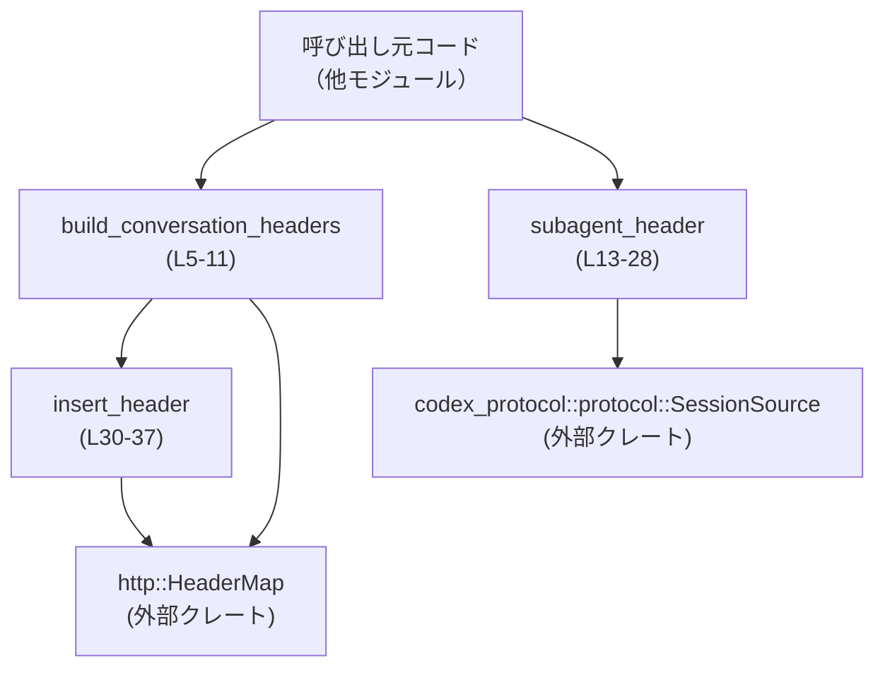
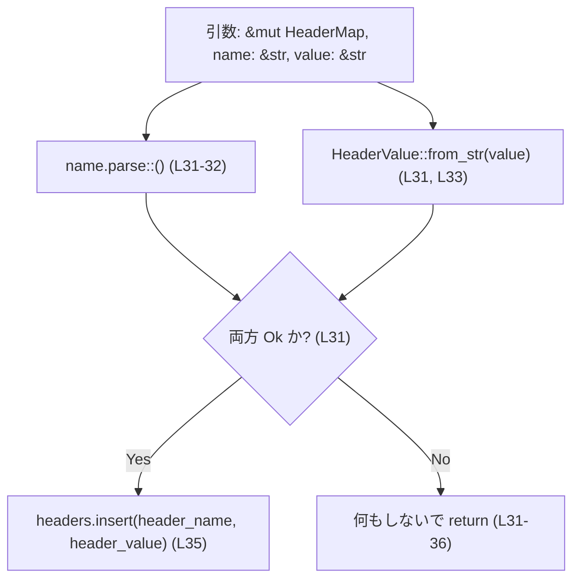
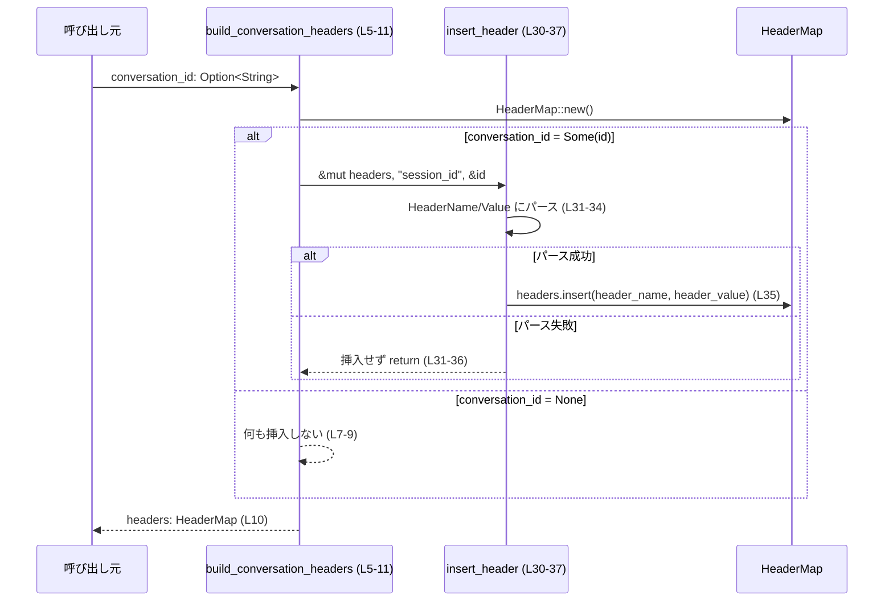
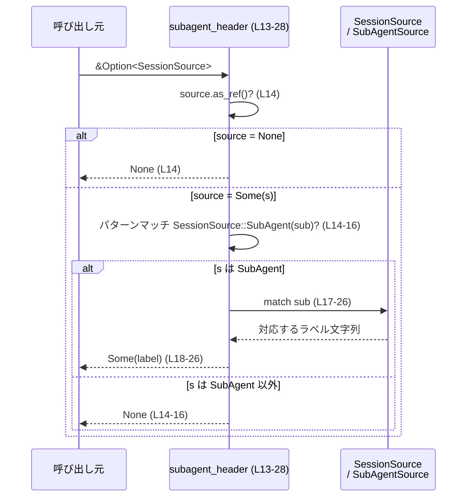

# codex-api/src/requests/headers.rs コード解説

## 0. ざっくり一言

セッション／サブエージェントに関する HTTP ヘッダーを組み立てるための、小さなユーティリティ関数群を提供するモジュールです。

---

## 1. このモジュールの役割

### 1.1 概要

このモジュールは、HTTP リクエストに付与するメタ情報（会話 ID やサブエージェントの種別）をヘッダーとして安全に構築する問題を扱い、次の機能を提供します。

- 会話 ID から `HeaderMap` を組み立てる
- `SessionSource` からサブエージェント種別を表す文字列を得る
- 文字列ベースのヘッダー名・値を `HeaderMap` に挿入する際のバリデーションを行う

### 1.2 アーキテクチャ内での位置づけ

外部クレート `codex_protocol` が定義するセッション情報 (`SessionSource`) と、`http` クレートの HTTP ヘッダー型 (`HeaderMap`, `HeaderValue`) の橋渡しをする位置づけです。



- `build_conversation_headers` は公開 API として会話用ヘッダーセットを構築します（headers.rs:L5-11）。
- `subagent_header` は内部的にサブエージェント用ラベル文字列を生成します（headers.rs:L13-28）。
- `insert_header` は汎用的な「安全なヘッダー挿入」処理を提供します（headers.rs:L30-37）。

### 1.3 設計上のポイント

- すべて **関数ベース** であり、状態を保持する構造体は定義していません。
- エラー処理は Rust の `Option` と `Result` 相当の API を使わず、
  - `subagent_header` は `Option` をそのまま返す
  - `insert_header` は失敗時に何も挿入しない（エラーを無視）  
 という方針になっています（headers.rs:L31-35）。
- HTTP ヘッダー名／値の妥当性チェックは `http::HeaderName::from_str` と `http::HeaderValue::from_str` に委譲し、無効な場合は挿入しません（headers.rs:L31-34）。
- 非同期処理やスレッド共有状態はなく、すべて同期・スレッドセーフな処理として実装されています（`unsafe` 使用なし）。

---

## 2. 主要な機能一覧（コンポーネントインベントリー）

このチャンクに現れる関数の一覧と定義位置です。

| 名称 | 種別 | 公開範囲 | 役割 / 用途 | 定義位置 |
|------|------|----------|-------------|----------|
| `build_conversation_headers` | 関数 | `pub` | 会話 ID (`Option<String>`) から `HeaderMap` を構築し、必要なら `"session_id"` ヘッダーを追加する | headers.rs:L5-11 |
| `subagent_header` | 関数 | `pub(crate)` | `SessionSource::SubAgent` からサブエージェントの種別を表すラベル文字列 (`Option<String>`) を返す | headers.rs:L13-28 |
| `insert_header` | 関数 | `pub(crate)` | 文字列のヘッダー名と値をパースして `HeaderMap` に挿入する。無効な場合は挿入しない | headers.rs:L30-37 |

---

## 3. 公開 API と詳細解説

### 3.1 型一覧（このファイルに現れる主な型）

このファイル内で **新しく定義される型はありません**。  
関数シグネチャで利用される主な外部型を参考として示します。

| 名前 | 種別 | 定義元 | 役割 / 用途 | 出現箇所 |
|------|------|--------|-------------|----------|
| `HeaderMap` | 構造体 | `http` クレート | HTTP ヘッダーのマップ（ヘッダー名→値の集合） | `build_conversation_headers` の戻り値（headers.rs:L5）、`insert_header` の引数（headers.rs:L30） |
| `HeaderValue` | 構造体 | `http` クレート | 単一の HTTP ヘッダー値。文字列から生成される | `insert_header` 内で使用（headers.rs:L33） |
| `SessionSource` | 列挙体 | `codex_protocol::protocol` | セッションの発生源を表す列挙体。そのうち `SubAgent` 変種を利用 | `subagent_header` の引数型（headers.rs:L13）, パターンマッチ（headers.rs:L14） |
| `SubAgentSource` | 列挙体 | `codex_protocol::protocol` | サブエージェントの具体的な種別を表す列挙体 | `subagent_header` の `match` 分岐（headers.rs:L17-26） |
| `Option<T>` | 列挙体 | 標準ライブラリ | 値の有無を表す | 3 関数のシグネチャと内部で広く使用 |

`SessionSource` / `SubAgentSource` の具体的な定義内容は、このチャンクには現れません。

---

### 3.2 関数詳細

#### `build_conversation_headers(conversation_id: Option<String>) -> HeaderMap` （L5-11）

**概要**

- 会話 ID が与えられた場合のみ `"session_id"` ヘッダーを持つ `HeaderMap` を構築して返します（headers.rs:L5-10）。
- 会話 ID が `None` の場合は、空の `HeaderMap` を返します。

**引数**

| 引数名 | 型 | 説明 |
|--------|----|------|
| `conversation_id` | `Option<String>` | セッション／会話を識別する ID。`Some(id)` のとき `"session_id"` ヘッダーとして追加され、`None` のときヘッダーは追加されません（headers.rs:L7-8）。 |

**戻り値**

- `HeaderMap`  
  - `conversation_id` が `Some` の場合: `"session_id"` ヘッダーが 1 件追加された `HeaderMap`（headers.rs:L7-10）。
  - `conversation_id` が `None` の場合: 空の `HeaderMap`（headers.rs:L6, L10）。

**内部処理の流れ**

1. 新しい空の `HeaderMap` を生成します（headers.rs:L6）。
2. `conversation_id` が `Some(id)` の場合に限り、
   - `insert_header(&mut headers, "session_id", &id)` を呼び出してヘッダーを追加します（headers.rs:L7-8）。
3. 最終的な `headers` を返します（headers.rs:L10）。

```mermaid
flowchart TD
    A["引数: conversation_id: Option<String>"] --> B["HeaderMap::new() で空マップ作成 (L6)"]
    B --> C{"conversation_id は Some か? (L7)"}
    C -- Yes --> D["insert_header(&mut headers, \"session_id\", &id) 呼び出し (L8)"]
    C -- No --> E["何もしない"]
    D --> F["headers を返す (L10)"]
    E --> F
```

**Examples（使用例）**

会話 ID がある場合:

```rust
use http::HeaderMap;

// 会話IDを指定してヘッダーを構築する
let headers: HeaderMap = build_conversation_headers(Some("conv-123".to_string())); // "conv-123" を session_id として渡す

// "session_id" ヘッダーが入っていることを確認する
assert_eq!(
    headers.get("session_id").unwrap().to_str().unwrap(), // "session_id" を取得して文字列化
    "conv-123"
);
```

会話 ID がない場合:

```rust
use http::HeaderMap;

// 会話IDが無い場合
let headers: HeaderMap = build_conversation_headers(None); // None を渡す

// ヘッダーは空、少なくとも "session_id" は存在しない
assert!(headers.get("session_id").is_none());
```

**Errors / Panics**

- この関数自体は `Result` を返さず、`panic!` も行いません。
- 内部で呼び出す `insert_header` がヘッダー名／値のパースに失敗した場合は、ヘッダーは **挿入されず無視** されます（headers.rs:L31-35）。
  - この場合もエラーは呼び出し元に伝播しません。

**Edge cases（エッジケース）**

- `conversation_id == None`  
  → 空の `HeaderMap` を返します（headers.rs:L6-10）。
- `conversation_id == Some("")`（空文字列）  
  → `"session_id"` ヘッダー名は固定文字列 `"session_id"` のため常に妥当な名前とみなされ、値 `""` は `HeaderValue::from_str` の仕様に依存します。無効な値であれば、`insert_header` 内で挿入されません（headers.rs:L31-34）。
- `conversation_id` に HTTP ヘッダー値として不正な文字が含まれている場合  
  → `HeaderValue::from_str(value)` が `Err` になり、ヘッダーは挿入されません（headers.rs:L33-35）。

**使用上の注意点**

- `conversation_id` に使用する文字列は、HTTP ヘッダー値として妥当な文字のみを含むことが前提です。
- ヘッダー挿入に失敗した場合でも静かに無視されるため、「ヘッダーが必ず付与されていること」を前提にしたロジックを後段で組むと矛盾が発生する可能性があります。
- 関数は新しい `HeaderMap` を生成して返すため、既存の `HeaderMap` に追加したい場合は `insert_header` を直接利用する必要があります。

---

#### `subagent_header(source: &Option<SessionSource>) -> Option<String>` （L13-28）

**概要**

- `SessionSource` が `SubAgent` である場合に、そのサブエージェントの種別を示すラベル文字列を返します（headers.rs:L14-26）。
- それ以外のセッションソースや `None` の場合は `None` を返します（headers.rs:L13-16）。

**引数**

| 引数名 | 型 | 説明 |
|--------|----|------|
| `source` | `&Option<SessionSource>` | セッションソース。`Some(SessionSource::SubAgent(_))` のときのみサブエージェント識別ラベルを返します。 |

**戻り値**

- `Option<String>`  
  - `Some(label)`:
    - `SubAgentSource::Review` → `"review"`（headers.rs:L18）
    - `SubAgentSource::Compact` → `"compact"`（headers.rs:L19）
    - `SubAgentSource::MemoryConsolidation` → `"memory_consolidation"`（headers.rs:L20-22）
    - `SubAgentSource::ThreadSpawn { .. }` → `"collab_spawn"`（headers.rs:L23-25）
    - `SubAgentSource::Other(label)` → `label.clone()`（headers.rs:L26）
  - `None`:  
    - `source` が `None`  
    - または `SessionSource` が `SubAgent` 以外のバリアント（headers.rs:L14-16）。

**内部処理の流れ**

1. `source.as_ref()?` により、`source` が `None` の場合は即座に `None` を返します（`?` 相当の挙動、headers.rs:L14）。
2. `SessionSource::SubAgent(sub)` とのパターンマッチにより、`SubAgent` でない場合は `None` を返します（headers.rs:L14-16）。
3. `sub`（型は `SubAgentSource`）に対して `match` し、各バリアントに応じたラベル文字列を返します（headers.rs:L17-26）。

```mermaid
flowchart TD
    A["source: &Option<SessionSource>"] --> B{"source は Some か? (as_ref()?) (L14)"}
    B -- No --> Z["None を返す (L14)"]
    B -- Yes --> C{"中身は SessionSource::SubAgent か? (L14)"}
    C -- No --> Z
    C -- Yes --> D["sub: &SubAgentSource を取得 (L14)"]
    D --> E{"sub のバリアント (L17)"}
    E --> F["Review → \"review\" (L18)"]
    E --> G["Compact → \"compact\" (L19)"]
    E --> H["MemoryConsolidation → \"memory_consolidation\" (L20-22)"]
    E --> I["ThreadSpawn → \"collab_spawn\" (L23-25)"]
    E --> J["Other(label) → label.clone() (L26)"]
```

**Examples（使用例）**

`SessionSource::SubAgent` の場合（概念的な例、型の定義は別クレート）:

```rust
use codex_protocol::protocol::{SessionSource, SubAgentSource};

// Review サブエージェントからのセッションソースを作る
let source = Some(SessionSource::SubAgent(SubAgentSource::Review)); // SubAgent(Review) のセッション

// ラベル文字列を取得する
let label = subagent_header(&source); // Some("review".to_string()) が返る

assert_eq!(label.as_deref(), Some("review")); // as_deref() で &str として比較
```

`source` が `None` の場合:

```rust
use codex_protocol::protocol::SessionSource;

// セッションソースが存在しない場合
let source: Option<SessionSource> = None;

// ラベルは付与されない
let label = subagent_header(&source); // None が返る
assert!(label.is_none());
```

**Errors / Panics**

- この関数は `Result` を返さず、`panic!` も行いません。
- `clone` や `to_string` によるパニックは通常発生しないことが想定されます（標準ライブラリの実装に依存）。

**Edge cases（エッジケース）**

- `source == &None`  
  → `None` を返します（headers.rs:L14）。
- `source` が `Some` だが `SessionSource::SubAgent` ではない場合  
  → `else { return None; }` により `None` を返します（headers.rs:L14-16）。
- `SubAgentSource::Other(label)` の `label` が空文字、あるいは任意の文字列であっても、そのまま `clone` して返します（headers.rs:L26）。ここで値の妥当性チェックは行われません。

**使用上の注意点**

- 戻り値は単なる `Option<String>` であり、ここでは HTTP ヘッダーとしての妥当性はチェックしていません。  
  もしこの文字列をヘッダー値として利用する場合は、`insert_header` などを通じて検証することが前提となります。
- `source` に `SubAgent` 以外のバリアントが渡されると、ラベルは得られません。呼び出し元では `None` の可能性を常に考慮する必要があります。
- 関数は純粋関数（外部状態に依存しない）であり、並列に何度呼び出しても副作用はありません。

---

#### `insert_header(headers: &mut HeaderMap, name: &str, value: &str)` （L30-37）

**概要**

- 文字列で与えられたヘッダー名と値を、HTTP の仕様に沿う `HeaderName` / `HeaderValue` にパースし、成功した場合のみ `HeaderMap` に挿入します（headers.rs:L31-35）。
- どちらか一方でもパースに失敗した場合は挿入を行いません（headers.rs:L31-35）。

**引数**

| 引数名 | 型 | 説明 |
|--------|----|------|
| `headers` | `&mut HeaderMap` | 挿入先のヘッダーマップ。変更のため可変参照を取ります（headers.rs:L30）。 |
| `name` | `&str` | ヘッダー名文字列。`http::HeaderName::from_str` により妥当性チェックが行われます（headers.rs:L31-32）。 |
| `value` | `&str` | ヘッダー値文字列。`HeaderValue::from_str` により妥当性チェックが行われます（headers.rs:L31, L33）。 |

**戻り値**

- 戻り値はありません（`()`）。
- 成否は戻り値ではなく、副作用（`headers` に挿入されたかどうか）で表現されます。

**内部処理の流れ**

1. `name.parse::<http::HeaderName>()` と `HeaderValue::from_str(value)` を同時に実行し、その両方が `Ok` であるかを `if let (Ok(header_name), Ok(header_value)) = ...` で確認します（headers.rs:L31-34）。
2. 両方とも成功した場合:
   - `headers.insert(header_name, header_value)` でヘッダーを挿入します（headers.rs:L35）。
3. いずれかが失敗した場合:
   - `if let` がマッチしないため、何もせず関数を終了します（headers.rs:L31-36）。



**Examples（使用例）**

```rust
use http::HeaderMap;

// 空のヘッダーマップを用意
let mut headers = HeaderMap::new();

// 妥当なヘッダー名と値を挿入する
insert_header(&mut headers, "x-custom-header", "value123"); // 有効な名前と値

// 正しく挿入されている
assert_eq!(
    headers.get("x-custom-header").unwrap().to_str().unwrap(),
    "value123"
);
```

不正な名前／値の場合:

```rust
use http::HeaderMap;

let mut headers = HeaderMap::new();

// 不正なヘッダー名（例として空文字列）を使う
insert_header(&mut headers, "", "value"); // HeaderName のパースが失敗すると想定される

// 挿入は行われない
assert!(headers.is_empty());
```

**Errors / Panics**

- `name.parse::<http::HeaderName>()` または `HeaderValue::from_str(value)` が失敗しても、
  - この関数は `Result` を返さず、
  - 失敗はログ等にも残さず、そのヘッダーを挿入しないだけです（headers.rs:L31-35）。
- `HeaderMap::insert` 自体は通常パニックしませんが、その詳細は `http` クレートの仕様に依存します。このチャンクからはパニック条件は読み取れません。

**Edge cases（エッジケース）**

- `name` が空文字列や不正な形式（HTTP ヘッダー名として不適切）  
  → `HeaderName` へのパースが失敗し、ヘッダーは挿入されません（headers.rs:L31-32, L35）。
- `value` に制御文字や改行を含むなど、HTTP ヘッダー値として不適切な場合  
  → `HeaderValue::from_str(value)` が失敗し、ヘッダーは挿入されません（headers.rs:L33-35）。
- 同じ `name` を複数回挿入する場合  
  → 具体的な挙動（既存値の上書き/追加）は `HeaderMap::insert` の仕様によります。このファイルから挙動は分かりません。

**使用上の注意点**

- 成否が戻り値で分からないため、「ヘッダーが確実にセットされたか」をチェックしたい場合は、呼び出し後に `headers.get(name)` などで確認する必要があります。
- この関数は入力を検証したうえで挿入するため、ヘッダー名／値にユーザー入力を直接渡す場合でも、HTTP レベルで不正な値は挿入されないという利点があります（ただし、何が「不正」かは `http` クレートの実装に依存します）。
- `headers` は可変参照で渡されるため、同じ `HeaderMap` を並列のスレッドから同時に操作することは、Rust の所有権ルール上コンパイル時に制限されます（スレッド安全性の面で有利です）。

---

### 3.3 その他の関数

このファイルに定義される関数は 3 つであり、すべて上記で詳細に解説しています。  
補助関数のみ、という位置づけの関数はありません。

---

## 4. データフロー

このセクションでは、代表的な処理シナリオごとにデータの流れを示します。

### 4.1 会話 ID からヘッダーを構築するフロー

`build_conversation_headers` を用いて `"session_id"` ヘッダーを構築する場合のフローです。



要点:

- 会話 ID が `None` でもエラーは発生せず、単に空のヘッダーが返ります。
- 会話 ID が与えられていても、値がヘッダー値として不正であれば、`insert_header` で silently ignore されます。

### 4.2 サブエージェントラベル取得のフロー

`subagent_header` を用いてサブエージェントラベルを取得する場合のフローです。



要点:

- `source` が `None` または `SubAgent` 以外のバリアントであれば `None`。
- どのサブエージェントかに応じて、決まったラベルまたは任意のラベル文字列が返されます。

---

## 5. 使い方（How to Use）

### 5.1 基本的な使用方法

会話 ID とサブエージェント情報から HTTP ヘッダーを準備し、HTTP クライアントに渡す例です（HTTP クライアント部分は擬似コードです）。

```rust
use http::HeaderMap;
use codex_protocol::protocol::{SessionSource, SubAgentSource};

// 会話IDとサブエージェント情報を用意する
let conversation_id = Some("conv-123".to_string()); // 会話ID
let source = Some(SessionSource::SubAgent(SubAgentSource::Review)); // Review サブエージェント

// 会話IDからヘッダーを構築する
let mut headers: HeaderMap = build_conversation_headers(conversation_id); // "session_id" が入る可能性がある

// サブエージェントラベルを取得し、あればヘッダーとして追加する
if let Some(label) = subagent_header(&source) {                          // ラベル文字列を Option として取得
    insert_header(&mut headers, "x-subagent", &label);                   // 不正な値でなければヘッダーに挿入
}

// ここで headers を HTTP クライアントに渡す
// client.get("https://example.com").headers(headers).send().await?;
```

このコードでは:

- `build_conversation_headers` が基本的な会話関連ヘッダーを構築し、
- `subagent_header` + `insert_header` の組み合わせでサブエージェント用ヘッダーを追加しています。

### 5.2 よくある使用パターン

1. **会話 ID だけを付与する軽量な呼び出し**

```rust
let headers = build_conversation_headers(Some("conv-xyz".to_string())); // 会話IDのみ
```

1. **既存の `HeaderMap` に追加ヘッダーを安全に加える**

```rust
use http::HeaderMap;

let mut headers = HeaderMap::new();                                       // 既存ヘッダー集合
insert_header(&mut headers, "authorization", "Bearer token");             // 妥当な形式なら挿入
insert_header(&mut headers, "x-debug-flag", "1");                          // 任意のカスタムヘッダーも同様に追加
```

1. **`subagent_header` の結果を条件付きで利用する**

```rust
if let Some(label) = subagent_header(&source) {                            // ラベルがあるときだけ
    println!("Sub-agent label: {}", label);                                // ログ出力などに使う
}
```

### 5.3 よくある間違い

```rust
use http::HeaderMap;

// 誤り例: insert_header を使わずに生の文字列を直接挿入しようとする
let mut headers = HeaderMap::new();
// headers.insert("bad name", "value".parse().unwrap()); // &str をそのまま渡すのはコンパイルエラー

// 正しい例: insert_header を通してヘッダー名／値をパースする
insert_header(&mut headers, "x-good-name", "value");
```

```rust
use codex_protocol::protocol::SessionSource;

// 誤り例: subagent_header の戻り値が常に Some だと仮定する
let source: Option<SessionSource> = None;
// let label = subagent_header(&source).unwrap(); // None のとき panic する可能性

// 正しい例: Option であることを考慮して扱う
if let Some(label) = subagent_header(&source) {
    println!("label: {}", label);
}
```

### 5.4 使用上の注意点（まとめ）

- `build_conversation_headers` はヘッダー挿入の失敗を報告しないため、重要なヘッダーを確実に付与したい場合は、結果の `HeaderMap` を検証する必要があります。
- `subagent_header` は `None` を返し得るため、呼び出し側は常に `Option` を安全に処理する必要があります。
- `insert_header` はヘッダー名／値を検証しますが、失敗時にサイレントに無視する設計になっているため、「なぜヘッダーが付いていないか」をデバッグする際は注意が必要です。
- いずれの関数もスレッドローカルなデータやグローバル状態を持たないため、並列呼び出しでのデータ競合は発生しません（ただし同じ `HeaderMap` を複数スレッドで扱わないことが前提です）。

---

## 6. 変更の仕方（How to Modify）

### 6.1 新しい機能を追加する場合

例: 新しい種類のサブエージェントを `SubAgentSource` に追加し、それに対応するラベルを返したい場合。

1. **`codex_protocol::protocol::SubAgentSource` の定義側**（別ファイル）の列挙体に新しいバリアントを追加する必要があります（このチャンクには定義がありません）。
2. このファイルの `subagent_header` 内の `match sub { ... }` に、新バリアント用の分岐を追加します（headers.rs:L17-26）。
3. 必要に応じて、このラベルをヘッダーとして使う箇所で `insert_header` を用いてヘッダーを追加します。

### 6.2 既存の機能を変更する場合

- `"session_id"` のヘッダー名を変更したい場合:
  - `build_conversation_headers` 内のリテラル `"session_id"` を一貫して変更します（headers.rs:L8）。
  - 既存の呼び出し側がこのヘッダー名を前提にしていないか確認する必要があります。
- サブエージェントのラベル文字列を変えたい場合:
  - `subagent_header` 内の `Some("...".to_string())` 部分を変更します（headers.rs:L18-25）。  
  - これに依存する下流のサービスやロジック（例: ログ解析、ルーティング）がある場合、その影響範囲を確認します。
- エラーをサイレントに無視せず、ログに出したい場合:
  - `insert_header` の `if let` 式を `match` に変更し、`Err` ケースでログ出力を行うなどの処理を追加します（headers.rs:L31-36）。  
  - ただし、logging インフラとの依存関係が増える点に注意が必要です。

---

## 7. 関連ファイル

このモジュールと密接に関係する外部モジュール／クレートは次のとおりです。

| パス / モジュール | 役割 / 関係 |
|------------------|------------|
| `codex_protocol::protocol::SessionSource` | セッションの発生源を表す列挙体。`subagent_header` の入力として利用されます（headers.rs:L1, L13-16）。このチャンクには定義が現れないため、詳細は不明です。 |
| `codex_protocol::protocol::SubAgentSource` | サブエージェント種別の列挙体。`subagent_header` の `match` で各種ラベルに対応付けられています（headers.rs:L17-26）。 |
| `http::HeaderMap` | HTTP ヘッダー集合を表す構造体。`build_conversation_headers` の戻り値および `insert_header` の挿入先として利用されます（headers.rs:L2, L5-6, L30）。 |
| `http::HeaderValue` | HTTP ヘッダー値を表す型。`insert_header` 内で文字列からパースされます（headers.rs:L3, L33）。 |

テストコードやこのモジュールを呼び出す上位のリクエスト送信ロジックは、このチャンクには現れません。
