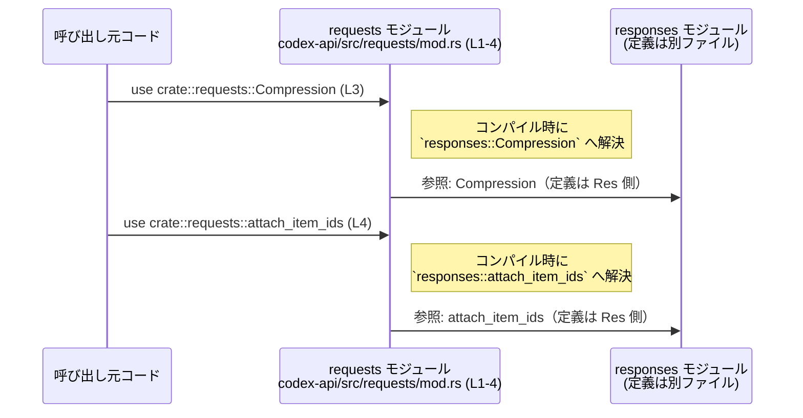

# codex-api/src/requests/mod.rs コード解説

## 0. ざっくり一言

`codex-api/src/requests/mod.rs` は、リクエスト関連のサブモジュール（`headers`, `responses`）を束ね、`responses` モジュール内のアイテムを再エクスポートするためのルートモジュールです（`codex-api/src/requests/mod.rs:L1-4`）。  

---

## 1. このモジュールの役割

### 1.1 概要

- このモジュールは、**リクエスト関連の機能をまとめる名前空間**として存在し、以下を行います。
  - サブモジュール `headers` と `responses` の宣言（`pub(crate) mod ...`）
  - `responses` モジュール内の `Compression` と `attach_item_ids` の再エクスポート  
    （`codex-api/src/requests/mod.rs:L1-4`）

このファイル自身には関数・構造体などの「ロジック」は存在せず、**モジュール構成と公開範囲の調整**が主な役割です。

### 1.2 アーキテクチャ内での位置づけ

`requests` モジュールと、その内部の依存関係は次のようになります。

```mermaid
graph LR
  subgraph "codex-api/src/requests/mod.rs (L1-4)"
    R["モジュール requests"]
  end

  R -->|L1| H["サブモジュール headers"]
  R -->|L2| S["サブモジュール responses"]

  R -.再エクスポート(pub).->|L3| C["アイテム Compression\n(定義は responses 側)"]
  R -.再エクスポート(pub(crate)).->|L4| A["アイテム attach_item_ids\n(定義は responses 側)"]
```

- `headers` / `responses` の中身は、このチャンクには現れないため詳細は不明です。
- `Compression` および `attach_item_ids` も `responses` 側で定義されており、本ファイルには宣言のみが存在します。

### 1.3 設計上のポイント

コードから読み取れる設計上の特徴は次のとおりです。

- **責務の分割**
  - このファイルはロジックを持たず、「サブモジュールの集約」と「再エクスポート」のみを担当します（L1-4）。
- **公開範囲の制御**
  - サブモジュール `headers` / `responses` は `pub(crate)` で公開され、**クレート内部専用**であることが明示されています（L1-2）。
  - `Compression` は `pub` で再エクスポートされるため、**クレート外からも `crate::requests::Compression` として利用可能**です（L3）。
  - `attach_item_ids` は `pub(crate)` で再エクスポートされ、**クレート内部から `crate::requests::attach_item_ids` として使える**ように調整されています（L4）。
- **状態や並行性の不在**
  - このファイルにはグローバル変数や関数が存在せず、**状態管理・エラー処理・並行処理に関わるコードはありません**。
  - メモリ安全性やスレッド安全性に関する挙動は、あくまでサブモジュール側に依存します（このチャンクからは不明）。

---

## 2. 主要な機能一覧

このファイルが提供している「機能」は、実行時ロジックではなく **モジュール構造と API 面の入り口**です。

- サブモジュール `headers` の宣言と crate 内公開  
  （`pub(crate) mod headers;` — `codex-api/src/requests/mod.rs:L1`）
- サブモジュール `responses` の宣言と crate 内公開  
  （`pub(crate) mod responses;` — `codex-api/src/requests/mod.rs:L2`）
- `responses::Compression` のクレート外向け再エクスポート  
  （`pub use responses::Compression;` — `codex-api/src/requests/mod.rs:L3`）
- `responses::attach_item_ids` の crate 内向け再エクスポート  
  （`pub(crate) use responses::attach_item_ids;` — `codex-api/src/requests/mod.rs:L4`）

### 2.1 コンポーネント一覧（モジュール・再エクスポート）

| 名称               | 種別           | 定義/宣言位置                                                   | 公開範囲    | 説明 |
|--------------------|----------------|------------------------------------------------------------------|------------|------|
| `requests`         | ルートモジュール | ファイル `codex-api/src/requests/mod.rs` 全体（L1-4）           | `pub(crate)`（上位からの見え方はこのファイル外に依存） | リクエスト関連サブモジュールをまとめる名前空間 |
| `headers`          | サブモジュール | `pub(crate) mod headers;`（`codex-api/src/requests/mod.rs:L1`） | crate 内   | 中身はこのチャンクには現れません |
| `responses`        | サブモジュール | `pub(crate) mod responses;`（`codex-api/src/requests/mod.rs:L2`） | crate 内   | 中身はこのチャンクには現れません |
| `Compression`      | アイテム（種別不明） | `pub use responses::Compression;`（`codex-api/src/requests/mod.rs:L3`） | クレート外へ公開 (`pub`) | `responses` モジュールからの再エクスポート。定義内容はこのチャンクには現れません |
| `attach_item_ids`  | アイテム（種別不明） | `pub(crate) use responses::attach_item_ids;`（`codex-api/src/requests/mod.rs:L4`） | crate 内   | `responses` モジュールからの再エクスポート。定義内容はこのチャンクには現れません |

> **注意**: `Compression` と `attach_item_ids` が構造体・列挙体・関数・定数などのどれにあたるかは、このファイルからは判別できません。

---

## 3. 公開 API と詳細解説

### 3.1 型一覧（構造体・列挙体など）

このチャンクで型として関係しうるのは `Compression` ですが、実際に「型」であるかどうかはコードからは分かりません。

| 名前          | 種別         | 役割 / 用途 |
|---------------|--------------|-------------|
| `Compression` | 不明（型である可能性が高いが、このチャンクには定義がない） | `responses` モジュールから再エクスポートされる公開アイテム。用途やフィールド構成は、このチャンクには現れません。 |

> 命名からは圧縮方式や圧縮設定を表す型である可能性が高いですが、定義が見えないため推測にとどまり、仕様は断定できません。

### 3.2 関数詳細（最大 7 件）

このファイルには関数定義が存在しませんが、`responses` モジュールから `attach_item_ids` というアイテムを再エクスポートしています（L4）。  
それが関数である可能性は高いものの、シグネチャが見えないため **詳細な仕様は記述できません**。

#### `attach_item_ids`（シグネチャ不明）

**概要**

- `responses` モジュール内で定義されている `attach_item_ids` を、`requests` 名前空間から crate 内向けに利用しやすくするための再エクスポートです（`codex-api/src/requests/mod.rs:L4`）。
- 具体的な処理内容や引数・戻り値の型は、このチャンクには現れません。

**引数**

- このチャンクには `attach_item_ids` のシグネチャが含まれていないため、引数情報は不明です。

**戻り値**

- 戻り値の型・意味も、このチャンクからは分かりません。

**内部処理の流れ（アルゴリズム）**

- `attach_item_ids` の定義が `responses` モジュール内にあるため、このファイルから内部処理を読み取ることはできません。

**Examples（使用例）**

このファイルの役割（再エクスポート）に限定した使用例を示します。

```rust
// `codex-api` クレート内の別モジュールから利用する想定の例（擬似コード）

use crate::requests::attach_item_ids; // L4 により、requests 経由で参照できる

fn example_usage() {
    // ここで attach_item_ids(...) を呼び出すことができますが、
    // どのような引数を渡すべきかは responses モジュールの定義を参照する必要があります。
}
```

> 上記コードは「`requests` モジュール経由でアクセスできる」という事実のみを示すものであり、引数や戻り値は不明です。

**Errors / Panics**

- このファイルには `attach_item_ids` の本体がなく、エラーやパニックの条件については一切記述されていません。
- 実際のエラー条件は `responses` モジュール内の実装に依存します。

**Edge cases（エッジケース）**

- エッジケース（空入力・境界値など）に対する挙動も、`responses` モジュール側を確認しないと分かりません。

**使用上の注意点**

- `attach_item_ids` の仕様を理解するには、**必ず `responses` モジュールの定義を確認する必要があります**。
- このファイルはあくまで名前空間のエイリアスのような役割を持つため、「どのように使えるか」を判断する材料は提供していません。

### 3.3 その他の関数

- このファイルには、独自に定義された関数は存在しません（`fn` キーワードが現れないことから判断）。

---

## 4. データフロー

このファイルには実行時の計算処理はありませんが、**API 呼び出し経路**という観点での「フロー」を整理できます。

典型的には、他モジュールから `requests::Compression` や `requests::attach_item_ids` が使われ、それが内部的に `responses` モジュール内の定義に解決されます。



- 上図は **コンパイル時の名前解決の流れ**を示しており、実行時にオーバーヘッドが増えるわけではありません。
- 安全性・エラー・並行性に関する実際の挙動は、`responses` モジュールで定義された本体に依存します。

---

## 5. 使い方（How to Use）

### 5.1 基本的な使用方法

このモジュールの主な使い方は、「他モジュールからリクエスト関連のアイテムにアクセスする際の入口」として利用することです。

```rust
// 他モジュールからの利用例（擬似コード）

// クレート外のコードから Compression を使う場合（L3 の pub が有効）
use codex_api::requests::Compression;

// クレート内の別モジュールから attach_item_ids を使う場合（L4 の pub(crate) が有効）
use crate::requests::attach_item_ids;

fn main() {
    // Compression の具体的な使い方や attach_item_ids の呼び出しは
    // responses モジュールの仕様に従います（このチャンクには現れません）。
}
```

- `Compression` は `pub` で再エクスポートされているため、クレート外からも `codex_api::requests::Compression` として利用できる設計になっています（L3）。
- `attach_item_ids` は `pub(crate)` なので、**クレート内部からのみ** `crate::requests::attach_item_ids` として利用できます（L4）。

### 5.2 よくある使用パターン

このファイルが行うのは「パスの短縮・整理」なので、想定される使用パターンは主に次の 2 つです。

1. **リクエスト関連の型・関数をまとめてインポートする入口として使う**

   ```rust
   use codex_api::requests::{Compression /*, 他の公開アイテム */};
   ```

2. **クレート内部で、responses ではなく requests 経由で関数を呼び出す**

   ```rust
   use crate::requests::attach_item_ids;

   // responses::attach_item_ids を直接ではなく、requests 経由で使うことにより、
   // 将来のモジュール構成変更を this 層で吸収できる設計にしている可能性があります。
   ```

   > ただし、こうした設計意図は命名と構造からの推測であり、コードから明示されてはいません。

### 5.3 よくある間違い

このファイルの構造から、起こりうる誤用として考えられるものを整理します。

```rust
// （誤り例の可能性）responses を直接参照してしまう
use crate::requests::responses::Compression; // コンパイルエラーまたは意図しない依存

// 正しい例: requests モジュールが再エクスポートしている経路を使う
use codex_api::requests::Compression;
```

- `responses` は `pub(crate) mod responses;` で宣言されているため（L2）、**クレート外からは直接参照できません**。
- クレート外から `Compression` を使う場合は、`requests` モジュールを経由する必要があります。

### 5.4 使用上の注意点（まとめ）

- このファイルは**ロジックを持たないため、エラー処理や並行性を気にする必要はありません**。
- `Compression` や `attach_item_ids` の仕様・前提条件・エッジケースは、**必ず `responses` モジュールの定義を参照して確認する必要があります**。
- クレート外から `responses` や `attach_item_ids` に直接アクセスすることはできず、公開されている経路（`requests::Compression` など）に従う必要があります。

---

## 6. 変更の仕方（How to Modify）

### 6.1 新しい機能を追加する場合

このモジュールに新しいリクエスト関連の機能を追加したい場合、典型的なパターンは次のようになります。

1. **適切なサブモジュールを作成／編集する**
   - 例: `codex-api/src/requests/headers.rs` や `responses.rs` など（ファイル構成はこのチャンクからは不明）。
2. **そのサブモジュールで型や関数を定義する**
3. **必要に応じて、この `mod.rs` で再エクスポートする**
   - クレート外に公開したい場合: `pub use responses::NewType;`
   - クレート内専用にしたい場合: `pub(crate) use responses::internal_fn;`

このように、**公開範囲（`pub` vs `pub(crate)`）をこのファイルで集中管理**する構造になっています。

### 6.2 既存の機能を変更する場合

- `Compression` や `attach_item_ids` のシグネチャや挙動を変更する場合、
  - まずは **`responses` モジュール側の定義**を変更する必要があります。
  - その後で、このファイルでの再エクスポート指定（名前変更や公開範囲の変更など）が必要かどうかを確認します。
- 公開範囲を変更する場合（例: `attach_item_ids` をクレート外に公開したい）には、
  - `pub(crate) use ...` を `pub use ...` に変更する、などの修正を本ファイルに施します。
- 変更時には、`requests::Compression` や `requests::attach_item_ids` を参照している全ての箇所への影響を確認する必要があります（このチャンクから具体的な使用箇所は分かりません）。

---

## 7. 関連ファイル

このモジュールと密接に関係するのは、宣言されているサブモジュールです。

| パス                            | 役割 / 関係 |
|---------------------------------|-------------|
| `codex-api/src/requests/headers.rs` または `codex-api/src/requests/headers/mod.rs` | `mod headers;`（L1）で宣言されているサブモジュール。ヘッダ関連の機能を持つ可能性が高いですが、このチャンクには中身が現れません。 |
| `codex-api/src/requests/responses.rs` または `codex-api/src/requests/responses/mod.rs` | `mod responses;`（L2）で宣言されているサブモジュール。`Compression` と `attach_item_ids` の定義元となるファイルです。 |

> 実際のファイルパス（`responses.rs` か `responses/mod.rs` か）は、Rust のモジュール規則から推定されるものであり、このチャンクだけではどちらかは確定できません。

---

### 安全性 / エラー / 並行性の観点（本ファイルに限ったまとめ）

- **メモリ安全性**:  
  - このファイルは型や関数の定義を持たず、**メモリアクセスに関わるコードは一切含まれていません**。
- **エラー処理**:  
  - `Result` や `Option` などのエラー関連型も使われておらず、**エラーを発生させるコードは含まれていません**。
- **並行性**:  
  - スレッド生成、`async` 関数、同期原語（`Mutex` など）は登場せず、**並行処理に関する挙動はありません**。

したがって、このファイル単体ではバグ・セキュリティリスク・パフォーマンス問題はほぼ存在せず、**それらはすべてサブモジュール側の実装に依存する**ことになります。
