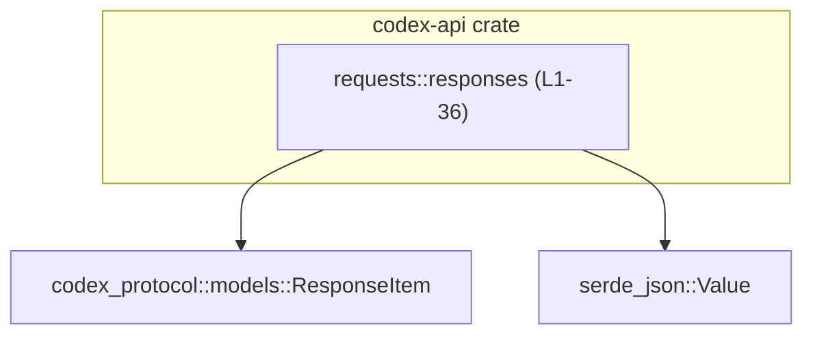
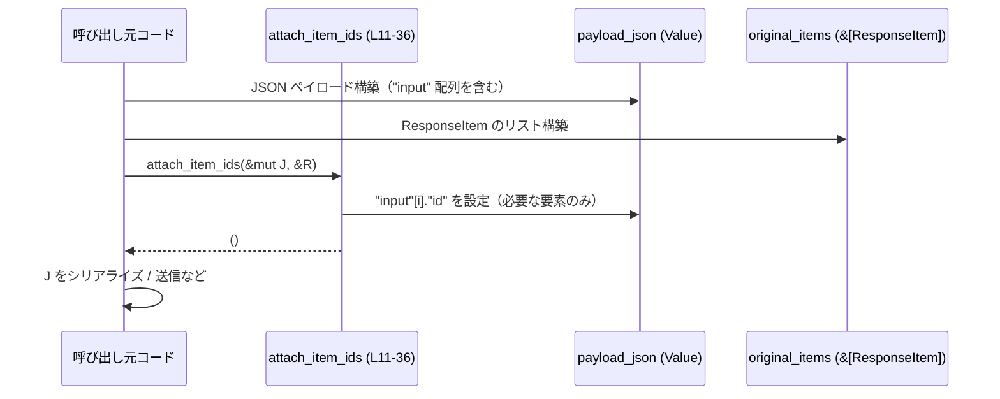

# codex-api/src/requests/responses.rs

## 0. ざっくり一言

- レスポンス用の JSON ペイロードに対して、`ResponseItem` の `id` を `"input"` 配列要素の `"id"` フィールドとして付与するユーティリティと、圧縮方式を表す `Compression` 列挙体を定義しているモジュールです（`responses.rs:L1-9, L11-36`）。

---

## 1. このモジュールの役割

### 1.1 概要

- このモジュールは、**API レスポンスの JSON 表現と内部モデル (`ResponseItem`) の橋渡し**を行う補助機能を提供します（`responses.rs:L1-2, L11-36`）。
- 具体的には、`ResponseItem` 側に持っている `id` を JSON の `"input"` 配列内の各オブジェクトにコピーして埋め込む関数と、圧縮方式を表す `Compression` 列挙体を提供します（`responses.rs:L4-9, L11-36`）。

### 1.2 アーキテクチャ内での位置づけ

- 依存関係として、このモジュールは以下を利用しています（`responses.rs:L1-2`）。
  - `codex_protocol::models::ResponseItem`：レスポンス内の各アイテムを表現するドメインモデル。
  - `serde_json::Value`：JSON データの動的表現。

このチャンク内には「どのモジュールから呼び出されるか」は現れていないため、呼び出し元は不明です。



### 1.3 設計上のポイント

- **シンプルな圧縮指定**  
  `Compression` は `None` と `Zstd` の 2 値のみで構成され、`Debug`, `Clone`, `Copy`, `Default`, `PartialEq`, `Eq` を derive しており、軽量な値オブジェクトとして扱えるようになっています（`responses.rs:L4-9`）。
- **JSON の構造に依存した安全な更新**  
  `attach_item_ids` は、`"input"` キーが存在しない場合や `"input"` が配列でない場合は即座に何もせず戻ることで、JSON 構造が想定と違うときもパニックせずに動作をやめる設計になっています（`responses.rs:L11-17`）。
- **配列長の不一致を自然に吸収**  
  `items.iter_mut().zip(original_items.iter())` により、`payload_json` 側と `original_items` 側の要素数が異なる場合も、短い方に合わせて処理するようになっています（`responses.rs:L19`）。
- **ID を持つ特定バリアントのみを対象**  
  `ResponseItem` の中でも `id` を持つ（または `Option` として持ちうる）特定のバリアントだけに対して ID 付与を行うよう、パターンマッチで明示されています（`responses.rs:L20-26`）。
- **空文字 ID のスキップ**  
  `id.is_empty()` をチェックし、空文字列の ID は JSON には書き込まないポリシーになっています（`responses.rs:L28-30`）。
- **オブジェクトのみ更新**  
  `"input"` 配列内の要素が JSON オブジェクトの場合にだけ `"id"` を付与し、それ以外（プリミティブ値や配列等）は触らないようになっています（`responses.rs:L32-33`）。

---

## 2. 主要な機能一覧

- `Compression` 列挙体: レスポンス等で使用する圧縮方式（`None` / `Zstd`）を表す軽量な指定子です（`responses.rs:L4-9`）。
- `attach_item_ids`: JSON ペイロード中 `"input"` 配列の各要素に、対応する `ResponseItem` の `id` を `"id"` フィールドとして付与します（`responses.rs:L11-36`）。

---

## 3. 公開 API と詳細解説

### 3.1 型一覧（構造体・列挙体など）

| 名前          | 種別   | 公開範囲   | 役割 / 用途 | 根拠 |
|---------------|--------|------------|-------------|------|
| `Compression` | 列挙体 | `pub`      | レスポンスやリクエストなどで利用される圧縮方式を表す。現在は `None`（圧縮なし）と `Zstd` の 2 通りをサポートします。`Debug`, `Clone`, `Copy`, `Default`, `PartialEq`, `Eq` を自動実装しており、値セマンティクスで扱いやすくなっています。 | `responses.rs:L4-9` |

- バリアント一覧（コードから読み取れる範囲）:
  - `Compression::None` – デフォルト。圧縮なし（`responses.rs:L6-7`）。
  - `Compression::Zstd` – Zstandard 圧縮を示すと解釈できる名前のバリアントです（`responses.rs:L8`）。

※ このチャンクには `Compression` がどこで使用されているかは現れません。

### 3.2 関数詳細

#### `attach_item_ids(payload_json: &mut Value, original_items: &[ResponseItem]) -> ()`

**概要**

- `payload_json` の `"input"` フィールドが配列である場合、その配列内の各要素（JSON オブジェクト）に、対応する `original_items` の `ResponseItem` が持っている `id` を `"id"` キーとして書き込みます（`responses.rs:L11-36`）。
- 対象となるのは、以下のバリアントで `id` を持つ（または `Some(id)` を持つ）アイテムのみです（`responses.rs:L20-26`）。  
  - `ResponseItem::Reasoning { id, .. }`  
  - `ResponseItem::Message { id: Some(id), .. }`  
  - `ResponseItem::WebSearchCall { id: Some(id), .. }`  
  - `ResponseItem::FunctionCall { id: Some(id), .. }`  
  - `ResponseItem::ToolSearchCall { id: Some(id), .. }`  
  - `ResponseItem::LocalShellCall { id: Some(id), .. }`  
  - `ResponseItem::CustomToolCall { id: Some(id), .. }`

**シグネチャと引数**

```rust
pub(crate) fn attach_item_ids(
    payload_json: &mut Value,
    original_items: &[ResponseItem],
)
```

（`responses.rs:L11`）

| 引数名          | 型                      | 説明 |
|-----------------|-------------------------|------|
| `payload_json`  | `&mut Value`           | レスポンスとして外部に送出する、もしくは処理途中の JSON ペイロード。関数内で `"input"` 配列内オブジェクトの `"id"` フィールドが追記・上書きされます（`responses.rs:L11, L12-17, L32-33`）。 |
| `original_items`| `&[ResponseItem]`      | 元となる内部モデル。各要素は `ResponseItem` であり、`id` を持つバリアントのみが ID 付与の対象になります（`responses.rs:L11, L20-26`）。 |

**戻り値**

- 戻り値は `()`（ユニット型）であり、結果は `payload_json` の破壊的変更を通じて観測されます。`Result` などによるエラー返却は行いません（`responses.rs:L11-36`）。

**内部処理の流れ（アルゴリズム）**

1. `payload_json` から `"input"` キーに対応する値を可変参照で取得しようとします。キーが存在しない場合は `return` し、何も変更しません（`responses.rs:L12-14`）。
2. `"input"` の値が `Value::Array` であるかをチェックし、そうでない場合（オブジェクトやプリミティブなど）は `return` し、変更は行いません（`responses.rs:L15-17`）。
3. `"input"` 配列の各要素の可変参照 `value` と、`original_items` の各 `item` を `zip` で組にしてループします。配列長の短い方に合わせて繰り返しが行われます（`responses.rs:L19`）。
4. 各 `item` をパターンマッチし、以下のいずれかにマッチした場合に `id` を取り出します（`responses.rs:L20-26`）。
   - `Reasoning { id, .. }`
   - `Message { id: Some(id), .. }`
   - `WebSearchCall { id: Some(id), .. }`
   - `FunctionCall { id: Some(id), .. }`
   - `ToolSearchCall { id: Some(id), .. }`
   - `LocalShellCall { id: Some(id), .. }`
   - `CustomToolCall { id: Some(id), .. }`
   それ以外のバリアントの場合や、`id: None` の場合はスキップされます。
5. 取り出した `id` が空文字列であれば、その要素については何もせず次のアイテムに進みます（`responses.rs:L28-30`）。
6. `value.as_object_mut()` で `"input"` 配列の対応する要素が JSON オブジェクトかどうかを確認し、オブジェクトであれば `"id"` キーに `id` のクローンを `Value::String` として書き込みます（既に `"id"` がある場合は上書きになります）（`responses.rs:L32-33`）。

**処理フロー図（関数内）**

```mermaid
flowchart TD
  A["開始 attach_item_ids (L11-36)"]
  B{"payload_json[\"input\"] 取得可？"}
  C{"input は配列？"}
  D["items と original_items を zip してループ"]
  E{"item が id を持つバリアント？"}
  F{"id は空文字？"}
  G{"value はオブジェクト？"}
  H["obj[\"id\"] に文字列 id を設定"]
  Z["終了"]

  A --> B
  B -- いいえ --> Z
  B -- はい --> C
  C -- いいえ --> Z
  C -- はい --> D
  D --> E
  E -- いいえ --> D
  E -- はい --> F
  F -- はい --> D
  F -- いいえ --> G
  G -- いいえ --> D
  G -- はい --> H --> D
```

**Examples（使用例）**

このチャンクには `ResponseItem` のコンストラクタや全フィールド定義が含まれていないため、完全なコンパイル可能例は示せません。ここでは JSON 側の形と呼び出しのタイミングに焦点を当てた例を示します。

```rust
use serde_json::json;
use serde_json::Value;
// use crate::requests::responses::attach_item_ids; // モジュールパスはプロジェクト構成に依存

fn attach_ids_example(mut payload_json: Value, original_items: &[ResponseItem]) {
    // 呼び出し前: payload_json の input は id を持たない
    // {
    //   "input": [
    //     { "role": "assistant", "content": "..." },
    //     { "role": "tool", "content": "..." }
    //   ]
    // }

    attach_item_ids(&mut payload_json, original_items);

    // 呼び出し後: 対応する ResponseItem が id を持っていれば、
    // input 要素のオブジェクトに "id" フィールドが追加・上書きされる
    // {
    //   "input": [
    //     { "role": "assistant", "content": "...", "id": "item-1" },
    //     { "role": "tool", "content": "...", "id": "item-2" }
    //   ]
    // }
}

// payload_json の初期例
let mut payload_json = json!({
    "input": [
        { "role": "assistant", "content": "answer" },
        { "role": "tool", "content": "tool-result" },
    ]
});

// original_items の具体的な生成方法は、このチャンクからは分かりません。
// let original_items: Vec<ResponseItem> = ...;

// attach_item_ids(&mut payload_json, &original_items);
```

- `ResponseItem` がどのように生成されるかや、`id` フィールド以外に何を持つかは、このファイルでは定義されていないため、上記では省略しています。

**Errors / Panics**

- この関数は `Result` や `Option` を返さず、エラーは返却しません（`responses.rs:L11-36`）。
- コード内には `unwrap` や `expect`、`panic!` などの呼び出しはありません（`responses.rs:L11-36`）。
- JSON 構造が想定外（`"input"` が存在しない・配列でない等）の場合も、早期 `return` で何も変更せず終了し、パニックは発生しません（`responses.rs:L12-17`）。
- イテレータ `zip` や `as_object_mut` の使用も定義済みの安全な挙動に従うものであり、標準ライブラリの仕様上パニックはしません。

**Edge cases（エッジケース）**

- `"input"` キーが存在しない場合  
  - `payload_json.get_mut("input")` が `None` となり、即座に `return` するため、`payload_json` は一切変更されません（`responses.rs:L12-14`）。
- `"input"` が配列でない場合（オブジェクト、数値、文字列など）  
  - `let Value::Array(items) = input_value else { return; };` により、配列でないと判断されると `return` し、変更を行いません（`responses.rs:L15-17`）。
- `"input"` 配列の要素がオブジェクト以外（文字列、数値など）の場合  
  - `value.as_object_mut()` が `None` を返し、その要素には `"id"` は付与されません（`responses.rs:L32-33`）。
- `items` と `original_items` の長さが異なる場合  
  - `zip` により、短い方の長さまでしか処理されません。余った要素は無視されます（`responses.rs:L19`）。
- `ResponseItem` が対象バリアントでない／`id` が `None` の場合  
  - `if let` パターンにマッチしないため、何も行われません（`responses.rs:L20-26`）。
- `id` が空文字列の場合  
  - `id.is_empty()` が `true` となり、そのアイテムには `"id"` を設定せずスキップします（`responses.rs:L28-30`）。
- 既に `"id"` キーが存在する場合  
  - `obj.insert("id".to_string(), Value::String(id.clone()));` により上書きされます（`responses.rs:L32-33`）。

**使用上の注意点**

- **JSON 形状の前提**  
  - `"input"` キーが存在し、かつ値が配列である場合にのみ ID が付与されます。それ以外の形状では関数は何もしないので、「呼び出したのに ID が付かない」場合は JSON の構造を確認する必要があります（`responses.rs:L12-17`）。
- **配列の対応関係**  
  - `items.iter_mut().zip(original_items.iter())` に依存しているため、`payload_json["input"]` の配列順と `original_items` の順が一致していることが前提になります（`responses.rs:L19`）。
- **ID の上書き**  
  - 既に `"id"` が存在するオブジェクトに対しても、`obj.insert` により上書きされます。元の ID を保持したい場合は、事前に確認やバックアップが必要です（`responses.rs:L32-33`）。
- **空 ID の扱い**  
  - `id.is_empty()` の場合は `"id"` は書き込まれません。空文字 ID をあえて JSON に出したい場合には、このロジックの変更が必要になります（`responses.rs:L28-30`）。
- **スレッド・並行性**  
  - 関数は `&mut Value` を取るため、同時に複数スレッドから同じ `payload_json` を操作することはコンパイル時に防がれます（Rust の所有権・借用ルールによる）。関数内でグローバル状態や I/O は扱っておらず、純粋に引数を書き換えるだけです（`responses.rs:L11-36`）。
- **安全性（unsafe 不使用）**  
  - `unsafe` ブロックは一切使用されていません。型システムとパターンマッチに依存した安全な操作になっています（`responses.rs:L1-36`）。

### 3.3 その他の関数

- このファイルには、`attach_item_ids` 以外の関数は定義されていません（`responses.rs:L11-36`）。

---

## 4. データフロー

### 4.1 代表的な処理シナリオ

この関数を利用する典型的な流れは次のようになります（呼び出し元はこのチャンクには現れませんが、想定されるパターンを、コードから読み取れる範囲で説明します）。

1. 何らかのロジックで `Vec<ResponseItem>` が作られる（詳細は別モジュール、`responses.rs:L1`）。
2. レスポンス送信用の JSON `payload_json` が構築され、その中に `"input"` 配列が作られる（`responses.rs:L11-17` より推測される利用形態）。
3. `attach_item_ids` が呼ばれ、各 `ResponseItem` の `id` が `payload_json["input"][i]["id"]` に設定される（`responses.rs:L19-33`）。
4. 更新された `payload_json` がシリアライズされ、外部に送信される、ないしは後続処理に渡される。

### 4.2 シーケンス図



---

## 5. 使い方（How to Use）

### 5.1 基本的な使用方法

以下は、JSON ペイロードを作成してから `attach_item_ids` を呼び出すまでの典型的な流れを示した例です。`ResponseItem` の生成部分はこのチャンクからは分からないため抽象化しています。

```rust
use serde_json::json;
use serde_json::Value;

fn build_and_attach_ids(original_items: &[ResponseItem]) -> Value {
    // 1. JSON ペイロードを構築する
    let mut payload_json: Value = json!({
        "input": [
            { "role": "assistant", "content": "answer" },
            { "role": "tool", "content": "tool-result" },
        ],
        // 他のメタ情報など...
    });

    // 2. original_items の順序と "input" 配列の順序は対応させておく
    //    （配列長が異なる場合、短い方に合わせて処理されます）

    // 3. attach_item_ids を呼び出して "id" を埋め込む
    attach_item_ids(&mut payload_json, original_items);

    // 4. 以降、payload_json をシリアライズしてレスポンスとして返すなどに利用する
    payload_json
}
```

- この例では、`payload_json` は関数内で破壊的に更新され、呼び出し後には `"input"` 各要素の `"id"` が設定されます（`responses.rs:L19-33`）。

### 5.2 よくある使用パターン

1. **送信直前に ID を付与するパターン**

   - レスポンス JSON をほぼ完成させた後、送信直前に `attach_item_ids` を呼び出して ID を整合させる。
   - メリット: ID 埋め込みのロジックが一箇所にまとまり、他の処理から切り離される。

2. **中間処理での整合性確保**

   - 内部の複数のステップで `payload_json` を編集する中で、一度 `attach_item_ids` を挟み、以降 JSON 側を主に扱うようにする。
   - 注意点: 複数回呼び出した場合、`"id"` が上書きされることがあるため、呼び出しタイミングを整理する必要があります（`responses.rs:L32-33`）。

### 5.3 よくある間違い

```rust
use serde_json::json;

// 間違い例: "input" をオブジェクトとして定義している
let mut payload_json = json!({
    "input": {  // ← 配列ではなくオブジェクト
        "role": "assistant",
        "content": "answer"
    }
});

attach_item_ids(&mut payload_json, &original_items);
// この場合、"input" は配列でないため、関数はすぐ return し、何も変更されません（responses.rs:L15-17）
```

```rust
use serde_json::json;

// 正しい例: "input" を配列として定義する
let mut payload_json = json!({
    "input": [
        { "role": "assistant", "content": "answer" },
        { "role": "tool", "content": "tool-result" },
    ]
});

attach_item_ids(&mut payload_json, &original_items);
```

```rust
// 間違い例: original_items の順序と input の順序が一致していない
let original_items: Vec<ResponseItem> = build_items_in_different_order();
let mut payload_json = build_json_input_in_another_order();

attach_item_ids(&mut payload_json, &original_items);
// zip で対応付けされるため、意図しない id が JSON に付く可能性があります（responses.rs:L19）
```

### 5.4 使用上の注意点（まとめ）

- `"input"` は **配列** である必要がある（オブジェクトでは ID は付かない）（`responses.rs:L15-17`）。
- `"input"` 各要素は、**JSON オブジェクト** であるときにだけ `"id"` が付与される（`responses.rs:L32-33`）。
- `original_items` の順序と `"input"` の順序が一致していることが前提（`responses.rs:L19`）。
- `id` が空文字列、または `None` の場合は `"id"` は付与されない（`responses.rs:L20-26, L28-30`）。
- 同一 JSON に対して複数回呼び出すと、既存の `"id"` が上書きされうる（`responses.rs:L32-33`）。

---

## 6. 変更の仕方（How to Modify）

### 6.1 新しい機能を追加する場合

- **`ResponseItem` に新しいバリアントが追加され、そのバリアントにも ID を付与したい場合**
  1. `codex_protocol::models::ResponseItem` 側に新バリアントが定義されたら（`responses.rs:L1` 参照）、そのバリアントが ID を持つ設計であれば `attach_item_ids` の `if let` パターンにそのバリアントを追加します（`responses.rs:L20-26`）。
  2. `id` の型やオプション性（`Option<String>` かどうか）に応じて、既存の書き方に倣ってパターンを記述します。

- **追加のメタ情報も付与したい場合**
  - 例えば `"id"` に加えて `"type"` といったフィールドも付与したい場合は、`obj.insert` 部分（`responses.rs:L32-33`）を拡張し、必要なキーを追加します。

### 6.2 既存の機能を変更する場合

- **空文字 ID の扱いを変えたい場合**
  - 現状は `id.is_empty()` の場合にスキップしています（`responses.rs:L28-30`）。空文字も有効な ID と見なしたいなら、このチェックを削除する、もしくは条件を変更します。
- **配列長不一致時の挙動を厳格化したい場合**
  - 現状は `zip` により静かに余りが無視されます（`responses.rs:L19`）。これをエラーにしたい場合は、事前に `items.len()` と `original_items.len()` を比較し、不一致ならログやエラー返却を行うように関数シグネチャを `Result` 返しに変更するなどが考えられます。
- **上書きではなく既存 ID を保持したい場合**
  - `obj.insert("id".to_string(), ...)` の前に `obj.contains_key("id")` をチェックし、既に存在する場合は何もしない、などのガードロジックを追加します（`responses.rs:L32-33`）。

変更時には、`attach_item_ids` を呼び出している箇所（このチャンクには現れません）での前提条件（「必ず `"input"` が配列になっている」など）との整合性を確認する必要があります。

---

## 7. 関連ファイル

このモジュールと密接に関係する型・ライブラリは、インポートから次のように読み取れます。

| パス                                   | 役割 / 関係 |
|----------------------------------------|------------|
| `codex_protocol::models::ResponseItem` | レスポンスに含まれる各アイテムを表現するドメインモデル。`attach_item_ids` はこの型の `id` フィールドを JSON 側にコピーします（`responses.rs:L1, L20-26`）。 |
| `serde_json::Value`                    | JSON データの動的表現。`payload_json` の型として利用され、`"input"` 配列の探索と更新に使われます（`responses.rs:L2, L11-17, L32-33`）。 |

このチャンクにはテストコードや他の補助モジュールへの参照は現れていません。そのため、`attach_item_ids` のテストや使用箇所は別ファイルに存在すると考えられますが、具体的な場所は「このチャンクには現れない」ため不明です。
