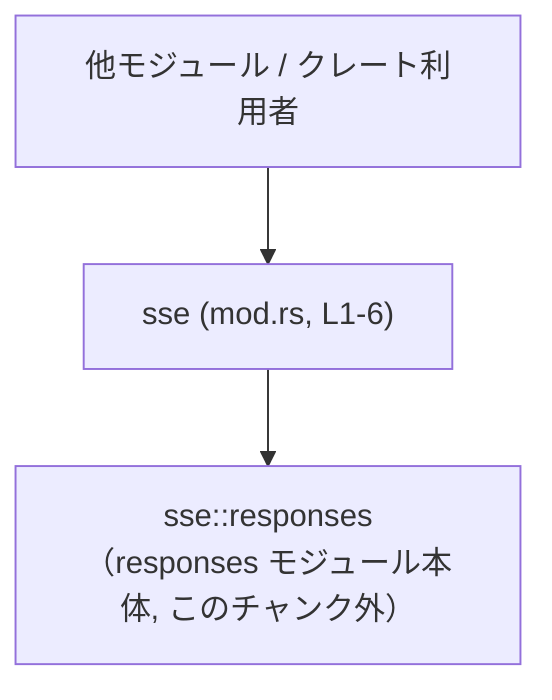
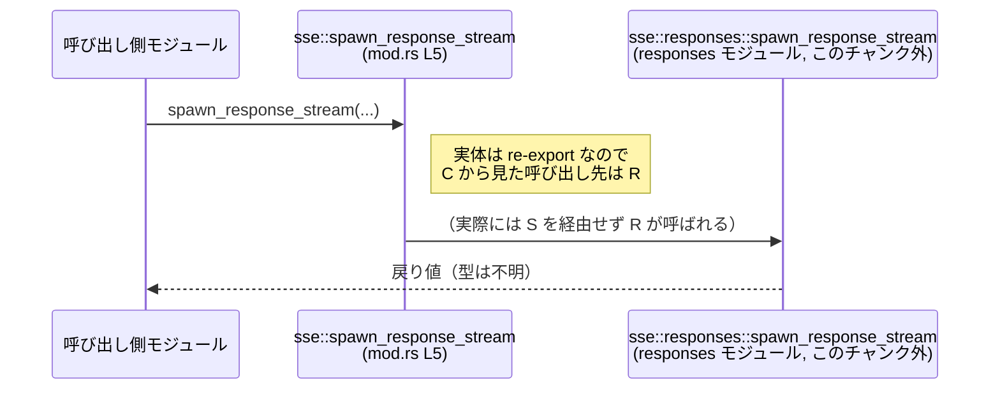

# codex-api/src/sse/mod.rs コード解説

## 0. ざっくり一言

- このファイルは、`sse` モジュール配下の `responses` サブモジュールを読み込み、その中の型・関数を再公開するための薄いラッパーモジュールです（`codex-api/src/sse/mod.rs:L1-6`）。
- 実際のコアロジックは `responses` モジュール側にあり、このチャンクには含まれていません。

---

## 1. このモジュールの役割

### 1.1 概要

- このモジュールは **「レスポンスストリーム関連の API を集約し、公開範囲を制御する」** 役割を持っています。
  - `pub(crate) mod responses;` によって `responses` サブモジュールを宣言します（`codex-api/src/sse/mod.rs:L1-1`）。
  - `responses` 内のいくつかの項目を `pub(crate) use`（クレート内限定）および `pub use`（クレート外からも利用可）で再公開します（`L3-6`）。

### 1.2 アーキテクチャ内での位置づけ

このファイルは、「呼び出し側」と「`sse::responses` サブモジュール」の間に位置する、API ゲートウェイ的な役割を持ちます。



- 呼び出し側は `crate::sse::spawn_response_stream` や `crate::sse::stream_from_fixture` を利用します（`L5-6`）。
- これらは実際には `sse::responses::spawn_response_stream` / `sse::responses::stream_from_fixture` へのエイリアスです。

### 1.3 設計上のポイント

- **サブモジュール分割**  
  - 実装本体を `responses` サブモジュールに分離し、このファイルは宣言と再公開のみに特化しています（`L1-6`）。
- **公開範囲の明示的な制御**  
  - `ResponsesStreamEvent` と `process_responses_event` は `pub(crate) use` により「クレート内からのみ利用可能」とされています（`L3-4`）。
  - `spawn_response_stream` と `stream_from_fixture` は `pub use` により、クレート外からも `sse` モジュール経由で利用できるように公開されています（`L5-6`）。
- **安全性・エラー・並行性の観点**  
  - このファイルには `unsafe` キーワード、エラーハンドリング、スレッド・非同期制御などのロジックは一切含まれていません（`L1-6`）。  
    これらの挙動はすべて `responses` モジュール側に依存し、このチャンクからは分かりません。
- **バグ・セキュリティ観点**  
  - このファイルはモジュール宣言と再公開だけであり、副作用や状態は持ちません。  
    バグやセキュリティリスクの有無は `responses` モジュールの中身次第であり、このチャンクからは判断できません。

---

## 2. 主要な機能一覧

### 2.1 コンポーネントインベントリー

このファイルで登場するコンポーネントの一覧です。

| 区分 | 名前 | 種別 | 公開範囲 | このファイル内の定義 | 行番号（根拠） | 備考 |
|------|------|------|----------|----------------------|----------------|------|
| モジュール | `responses` | サブモジュール | `pub(crate)` | 宣言のみ | `codex-api/src/sse/mod.rs:L1-1` | 実体は別ファイル（`responses` モジュール） |
| 型 | `ResponsesStreamEvent` | 型（詳細不明） | `pub(crate)` | re-export のみ | `codex-api/src/sse/mod.rs:L3-3` | `responses` モジュールからのクレート内限定再公開 |
| 関数 | `process_responses_event` | 関数（詳細不明） | `pub(crate)` | re-export のみ | `codex-api/src/sse/mod.rs:L4-4` | `responses` モジュールからのクレート内限定再公開 |
| 関数 | `spawn_response_stream` | 関数（詳細不明） | `pub` | re-export のみ | `codex-api/src/sse/mod.rs:L5-5` | クレート外公開。実体は `responses` モジュール |
| 関数 | `stream_from_fixture` | 関数（詳細不明） | `pub` | re-export のみ | `codex-api/src/sse/mod.rs:L6-6` | クレート外公開。実体は `responses` モジュール |

※ `ResponsesStreamEvent` が構造体なのか列挙体なのかなど、型の詳細はこのチャンクには現れません。

### 2.2 機能レベルでの要約

- `responses` サブモジュールの読み込み（`mod responses;`）。
- クレート内から利用するイベント型・イベント処理関数の再公開（`ResponsesStreamEvent`, `process_responses_event`）。
- クレート外から利用する「レスポンスストリーム開始」系の API を再公開（`spawn_response_stream`, `stream_from_fixture`）。

いずれも「**再公開（re-export）**」であり、コアロジックはこのファイルには存在しません。

---

## 3. 公開 API と詳細解説

### 3.1 型一覧（構造体・列挙体など）

| 名前 | 種別 | 公開範囲 | 定義場所（推定） | 役割 / 用途 |
|------|------|----------|------------------|-------------|
| `ResponsesStreamEvent` | 型（構造体/列挙体など、詳細不明） | クレート内限定（`pub(crate)`） | `sse::responses` モジュール（このチャンク外） | このチャンクから役割は確定できません。名称からは「レスポンスストリーム上のイベント」を表す型と想定されますが、断定はできません（`codex-api/src/sse/mod.rs:L3-3`）。 |

> 型のフィールドやメソッドなどの詳細は、`responses` モジュール側のコードを参照する必要があります。

### 3.2 関数詳細（テンプレート適用）

以下の3つの関数はいずれも `responses` モジュールからの再公開であり、このチャンクにはシグネチャや実装が含まれていません。そのため、それぞれについて「分かること / 分からないこと」を明示します。

#### `process_responses_event`（シグネチャ不明）

**概要**

- `responses::process_responses_event` をクレート内に再公開している関数です（`codex-api/src/sse/mod.rs:L4-4`）。
- 実際の処理内容や用途は、このチャンクからは分かりません。

**引数 / 戻り値**

- シグネチャ（引数の型・戻り値の型）はこのチャンクには現れません。
- 具体的なインターフェースは `responses` モジュールの定義を確認する必要があります。

**内部処理の流れ（アルゴリズム）**

- このファイルには実装が存在しないため不明です。

**Examples（使用例）**

- シグネチャが不明なため、具体的な使用例コードを提示できません。
- 実際の使用例は `responses` モジュール側の実装や、その呼び出し箇所（ハンドラなど）を参照する必要があります。

**Errors / Panics**

- どのような条件で `Err` を返したり panic するかは、このチャンクからは判断できません。

**Edge cases（エッジケース）**

- 空入力・境界値などへの挙動も、このチャンクからは不明です。

**使用上の注意点**

- このラッパーレベルでの注意点は特にありません。
- 実際の制約・前提条件は `responses::process_responses_event` の契約（contract）に依存します。

---

#### `spawn_response_stream`（シグネチャ不明）

**概要**

- `responses::spawn_response_stream` をクレート外からも利用できるように `pub use` している関数です（`codex-api/src/sse/mod.rs:L5-5`）。
- 名称からは「レスポンスストリームを開始する」機能と想定されますが、実際の挙動はこのチャンクからは確定できません。

**引数 / 戻り値**

- シグネチャはこのチャンクには現れません。
- 非同期か同期か、戻り値がハンドル型なのか `Future` なのかも不明です。

**内部処理の流れ（アルゴリズム）**

- 実装は `responses` モジュール側にあり、このファイルでは再公開のみです。

**Examples（使用例）**

- 呼び出し側からは、少なくとも次のように「`sse` モジュール経由でインポートして呼ぶ」という形になることだけは分かります。

```rust
// 実際のクレート名に置き換える必要があります（例: my_crate）
use my_crate::sse::spawn_response_stream;

// 引数や戻り値の型は responses モジュールの定義に依存します。
// このチャンクだけでは具体的な呼び出し形は書けません。
fn use_stream() {
    // spawn_response_stream(/* ... */);
}
```

※ 上記コードはシグネチャが不明なため、そのままではコンパイルできません。

**Errors / Panics / Edge cases / 使用上の注意点**

- いずれも、このチャンクからは判断できません。
- 非同期処理やスレッドを扱う関数名に見えますが、実際にそうであるかは `responses` モジュールの実装を確認する必要があります。

---

#### `stream_from_fixture`（シグネチャ不明）

**概要**

- `responses::stream_from_fixture` をクレート外に公開するための再公開です（`codex-api/src/sse/mod.rs:L6-6`）。
- 名称からは「フィクスチャ（テストデータなど）からストリームを生成する」用途が想定されますが、これは名前に基づく推測であり、このチャンクだけでは確定できません。

**引数 / 戻り値 / 内部処理**

- すべてこのチャンクからは不明です。

**Examples / Errors / Edge cases / 使用上の注意点**

- 具体的な情報は `responses` モジュールの定義を参照する必要があります。

### 3.3 その他の関数

- このファイルには上記以外の関数やメソッドは登場しません（`codex-api/src/sse/mod.rs:L1-6`）。

---

## 4. データフロー

このファイルに関する代表的なデータフローは、「呼び出し側が `sse` モジュール経由で関数を呼び、実際には `responses` モジュールが処理を行う」という単純なものです。

### 4.1 呼び出しフロー（re-export 経由の呼び出し）

次のシーケンス図は、`spawn_response_stream` を例に、このファイル（mod.rs, L1-6）における呼び出しの流れを示します。



- Rust における `pub use responses::spawn_response_stream;` は「別名をつけるだけ」であり、実行時の追加処理は発生しません。
- そのため、パフォーマンスやエラー挙動、並行性の特性は `responses::spawn_response_stream` に完全に依存します。

---

## 5. 使い方（How to Use）

### 5.1 基本的な使用方法

このファイルが提供する主な価値は、「呼び出し側が `sse` モジュール経由で API を利用できるようにすること」です。

```rust
// 仮のクレート名として `my_crate` を使用しています。
// 実際には Cargo.toml の `name` に合わせて置き換える必要があります。
use my_crate::sse::{spawn_response_stream, stream_from_fixture};

fn main() {
    // ここで必要な引数などは、responses モジュールの定義に依存し、
    // このチャンクだけでは分かりません。
    // let handle = spawn_response_stream(/* ... */);

    // let stream = stream_from_fixture(/* ... */);
}
```

- 重要な点は、「`sse` モジュールを通して API をインポートする」というパターンです。
- こうすることで、内部構成（`responses` モジュールの場所や名前）の変更から呼び出し側を守ることができます。

### 5.2 よくある使用パターン（推測を含む）

このチャンクだけでは詳細は分かりませんが、名前から想定されるパターンとして：

- `spawn_response_stream` を実運用コード（HTTP ハンドラなど）から呼び出し、レスポンスをストリーミングする。
- `stream_from_fixture` をテストコードやツールから呼び出し、固定のフィクスチャデータをストリーミングする。

これらはあくまで名称に基づく推測であり、実際の用途は実装と周辺コードを確認する必要があります。

### 5.3 よくある間違い（想定されるもの）

このファイルに関して起こり得る誤用は主に「インポートの仕方」に関するものです。

```rust
// （誤りの例となり得る書き方）
// responses モジュールを直接参照しようとする
// use my_crate::sse::responses::spawn_response_stream;

// 推奨される書き方: sse モジュールの公開 API として使う
use my_crate::sse::spawn_response_stream;
```

- 実際に `responses` を外部からアクセス可能にしているかどうかは、このチャンクだけでは分かりませんが、`mod responses;` が `pub(crate)` であることから、外から直接 `sse::responses` を使わせたくない意図があると解釈できます（`codex-api/src/sse/mod.rs:L1-1`）。

### 5.4 使用上の注意点（まとめ）

- このファイルにはロジックがないため、メモリ安全性・エラー・並行性に関する注意点はすべて `responses` モジュール側に依存します。
- 公開 API の窓口として `sse` モジュールを経由することで、内部構造の変更から呼び出し側を隔離できます。
- `pub(crate)` と `pub` の使い分けにより、クレート内外で利用可能な API を明示的に区別しています（`L3-6`）。

---

## 6. 変更の仕方（How to Modify）

### 6.1 新しい機能を追加する場合

1. **実装を `responses` モジュール側に追加する**  
   - まずは `sse::responses` モジュール（`responses.rs` または `responses/mod.rs`）に新しい関数・型を定義します。  
     この部分はこのチャンクには含まれていません。

2. **`sse` モジュールで再公開するかどうかを決める**  
   - クレート外にも公開したい場合：  
     `mod.rs` に `pub use responses::new_item;` を追加します。
   - クレート内だけで使わせたい場合：  
     `pub(crate) use responses::new_item;` を追加します。

3. **公開範囲の整合性を確認する**  
   - 型（例: イベント型）が `pub(crate)` で、関数だけ `pub` の場合、クレート外からはその型が直接使えない可能性があります。  
     その設計が意図通りかどうかを確認する必要があります。

### 6.2 既存の機能を変更する場合

- **関数名・型名の変更**  
  - `responses` モジュール側で名前を変更した場合、この `mod.rs` の `use` 行も必ず更新する必要があります（`L3-6`）。
- **公開範囲の変更**  
  - クレート外に公開したくなった場合：`pub(crate) use` → `pub use` に変更。
  - クレート外から隠したい場合：`pub use` → `pub(crate) use` または `use` に変更。
- **影響範囲の確認**  
  - `sse::spawn_response_stream` や `sse::stream_from_fixture` を直接使っている外部コードがないかを確認し、公開範囲の変更が破壊的変更（breaking change）にならないかを検討する必要があります。

---

## 7. 関連ファイル

| パス（推定を含む） | 役割 / 関係 |
|--------------------|------------|
| `codex-api/src/sse/responses.rs` または `codex-api/src/sse/responses/mod.rs` | `mod responses;`（`codex-api/src/sse/mod.rs:L1-1`）が参照するサブモジュール本体。`ResponsesStreamEvent`, `process_responses_event`, `spawn_response_stream`, `stream_from_fixture` の定義が存在すると考えられます。具体的な挙動・エラー処理・並行性の実装はここに含まれているはずですが、このチャンクには現れません。 |
| （テストコード, 例: `codex-api/tests/sse_*.rs`） | `spawn_response_stream` や `stream_from_fixture` の利用例・契約の確認は、関連テストコードからも読み取れる可能性がありますが、このチャンクでは確認できません。 |

---

### まとめ

- `codex-api/src/sse/mod.rs` は、`responses` サブモジュールを読み込み、その一部をクレート内外に再公開する **API 窓口モジュール** です。
- コアロジックやエラーハンドリング、並行性の詳細はすべて `responses` モジュール側にあり、このチャンクからは分かりません。
- 公開範囲（`pub` / `pub(crate)`）の制御と、呼び出し側に対する API の一元化が、このモジュールの主な役割です。
