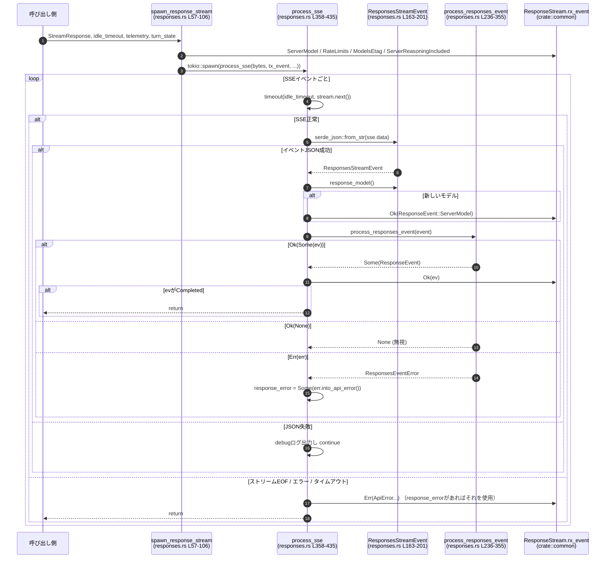

# codex-api/src/sse/responses.rs コード解説

## 0. ざっくり一言

- SSE（Server-Sent Events）ストリームから受け取った JSON イベントを、内部の `ResponseEvent` 列挙体に変換しつつ、タイムアウト・エラー・レート制限などを扱うモジュールです（根拠: `process_sse`, `process_responses_event` 定義部分 responses.rs:L236-L355, L358-L435）。
- HTTP レスポンス (`StreamResponse`) からクライアント向けの `ResponseStream` を生成するエントリポイントも提供します（根拠: `spawn_response_stream` responses.rs:L57-L106）。

---

## 1. このモジュールの役割

### 1.1 概要

- このモジュールは **SSE で流れてくる「Responses API」イベント** を、アプリケーション内部で扱いやすい `ResponseEvent` ストリームに変換する役割を持ちます（responses.rs:L236-L355, L358-L435）。
- ストリームのヘッダからレートリミット情報・モデル名などを取り出し、専用のイベントとして先に流す処理も担います（responses.rs:L57-L105）。
- エラーイベントを解析し、`ApiError` にマッピングすることで、レートリミット・コンテキスト長超過・クォータ超過などを呼び出し側で判別できるようにします（responses.rs:L108-L116, L274-L306, L437-L461）。
- テスト用に、ディスク上の SSE フィクスチャからストリームを生成する API も含まれています（responses.rs:L31-L55）。

### 1.2 アーキテクチャ内での位置づけ

このモジュールが他のコンポーネントとどのように関わるかを簡略化して示します。

```mermaid
graph TD
    subgraph "HTTP層 / codex_client::StreamResponse (外部) "
        SR[StreamResponse<br/>含: headers, bytes]
    end

    subgraph "responses.rs L57-106"
        SRS[spawn_response_stream]
    end

    subgraph "responses.rs L358-435"
        PSSE[process_sse]
    end

    subgraph "responses.rs L163-201"
        RSE[ResponsesStreamEvent]
    end

    subgraph "responses.rs L236-355"
        PRE[process_responses_event]
    end

    subgraph "crate::common (別モジュール)"
        RE[ResponseEvent]
        RStream[ResponseStream<br/>rx_event: mpsc::Receiver]
    end

    subgraph "crate::telemetry (別モジュール)"
        TLM[SseTelemetry]
    end

    SR --> SRS
    SRS -->|ヘッダ解析| RE
    SRS -->|tokio::spawn| PSSE
    PSSE -->|SSE変換| RSE
    PSSE -->|response_model()| RSE
    PSSE -->|イベント解釈| PRE
    PRE --> RE
    PSSE -->|送信| RStream
    PSSE -->|on_sse_poll| TLM
```

- HTTP クライアント層から `StreamResponse` を受け取り、`spawn_response_stream` がこのモジュールの入り口になります（responses.rs:L57-L63）。
- 実際の SSE パースとイベント変換は `process_sse` が行い、その中で `ResponsesStreamEvent` と `process_responses_event` が使われます（responses.rs:L358-L435, L236-L355）。
- 出力は `ResponseStream { rx_event }` というチャネル経由のストリームとして外部に渡されます（responses.rs:L54-L55, L105-L106）。

### 1.3 設計上のポイント

- **責務の分割**（responses.rs:L57-L106, L358-L435）
  - HTTP レスポンスのヘッダ処理・ストリーム起動は `spawn_response_stream`。
  - SSE ストリームの読み取りと JSON デシリアライズは `process_sse`。
  - 1 つの JSON イベントを内部 `ResponseEvent` に変換するロジックは `process_responses_event`。
- **状態管理**
  - ストリーム単位の状態として、直近のサーバーモデル名 (`last_server_model`) と直近のエラー (`response_error`) を `process_sse` 内のローカル変数で保持します（responses.rs:L365-L366）。
  - グローバルな状態は、レートリミット用正規表現をキャッシュする `OnceLock` のみです（responses.rs:L484-L490）。
- **エラーハンドリング方針**
  - SSE ストリーム内の論理的なエラーイベント (`response.failed`, `response.incomplete`) は即時に `ResponsesEventError` / `ApiError` に変換して状態に保存し、ストリーム終了時に 1 つの `Err(ApiError)` としてクライアントに伝えます（responses.rs:L274-L317, L381-L386）。
  - 通信エラー・タイムアウトは `ApiError::Stream` として即座に送出し、ストリームを終了します（responses.rs:L376-L393）。
- **並行性**
  - 各ストリーム処理は `tokio::spawn` で独立タスクとして実行されます（responses.rs:L48-L53, L87-L103）。
  - 呼び出し側とは `tokio::sync::mpsc` チャネルで非同期メッセージ交換するため、スレッド間共有は `Arc`/`OnceLock` のみで、`unsafe` は使用していません（responses.rs:L18-L19, L21, L358-L363）。

---

## 2. 主要な機能一覧

- `stream_from_fixture`: テスト用に、ファイルに保存された SSE 形式のデータから `ResponseStream` を生成する（responses.rs:L31-L55）。
- `spawn_response_stream`: `StreamResponse` から `ResponseStream` を生成し、ヘッダ情報（モデル名・レート制限など）を先頭イベントとして流す（responses.rs:L57-L106）。
- `process_sse`: SSE バイトストリームを読み取り、JSON を `ResponsesStreamEvent` にデコードしてから `ResponseEvent` に変換しつつ、チャネルに流すメインループ（responses.rs:L358-L435）。
- `ResponsesStreamEvent`: 1 つの SSE JSON ペイロードを表現するイベント型。モデル名抽出ヘルパ `response_model` を持ちます（responses.rs:L163-L201）。
- `process_responses_event`: `ResponsesStreamEvent` の `kind` に応じて、`ResponseEvent` もしくは `ApiError` にマッピングする（responses.rs:L236-L355）。
- エラー分類・リトライ待ち時間解析:
  - `try_parse_retry_after`: レートリミットエラーのメッセージから「再試行までの時間」を `Duration` にパースする（responses.rs:L437-L461）。
  - `is_context_window_error` / `is_quota_exceeded_error` / `is_usage_not_included` / `is_invalid_prompt_error` / `is_server_overloaded_error`: エラーコードに応じて `ApiError` の種類を決定する（responses.rs:L463-L482）。
- モデル名抽出:
  - `ResponsesStreamEvent::response_model`: JSON の `response.headers` またはトップレベル `headers` から `openai-model` を取得（responses.rs:L186-L200）。
  - `header_openai_model_value_from_json`, `json_value_as_string`: ヘッダ JSON から大文字小文字を無視してモデル名文字列を取り出す（responses.rs:L203-L221）。

---

## 3. 公開 API と詳細解説

### 3.1 型一覧（構造体・列挙体など）

#### プロダクションコードの型

| 名前 | 種別 | 公開範囲 | 役割 / 用途 | 定義位置 |
|------|------|----------|-------------|----------|
| `ResponsesStreamEvent` | 構造体 | `pub` | SSE の JSON イベントの汎用表現。`type`（kind）や `response`/`item`/`headers` を生で保持し、後段で解釈する。 | responses.rs:L163-L173 |
| `ResponsesEventError` | 列挙体 | `pub` | `process_responses_event` が返す、API 向けエラーラッパ。現在は `Api(ApiError)` バリアントのみ。 | responses.rs:L223-L226 |
| `Error` | 構造体 | モジュール内 | `response.failed` イベント中の `error` オブジェクトをパースするための型。コード・メッセージ・プラン種別など。 | responses.rs:L108-L116 |
| `ResponseCompleted` | 構造体 | モジュール内 | `response.completed` イベント中の `response` オブジェクト（`id` と `usage`）を表現。 | responses.rs:L118-L124 |
| `ResponseCompletedUsage` | 構造体 | モジュール内 | 完了時のトークン使用量を表現し、`TokenUsage` へ変換する中間型。 | responses.rs:L126-L133, L135-L151 |
| `ResponseCompletedInputTokensDetails` | 構造体 | モジュール内 | 入力トークンの詳細（キャッシュヒット数など）。 | responses.rs:L153-L156 |
| `ResponseCompletedOutputTokensDetails` | 構造体 | モジュール内 | 出力トークンの詳細（reasoning トークン数など）。 | responses.rs:L158-L161 |

#### テスト専用の型

- `TestCase`（`table_driven_event_kinds` テスト用のローカル構造体）（responses.rs:L823-L828）

### 3.2 関数詳細（主要 7 件）

#### 1. `stream_from_fixture(path: impl AsRef<Path>, idle_timeout: Duration) -> Result<ResponseStream, ApiError>`

**概要**

- ディスク上のテキストファイルから SSE フォーマットのデータ（`event:` / `data:` 行）を読み込み、その内容を `ReaderStream` 経由で `process_sse` に渡すことで、テスト用途の `ResponseStream` を構築します（responses.rs:L31-L55）。

**シグネチャと引数**

| 引数名 | 型 | 説明 |
|--------|----|------|
| `path` | `impl AsRef<Path>` | SSE フィクスチャファイルへのパス。1 行ごとに SSE の本体を持つ前提。 |
| `idle_timeout` | `Duration` | `process_sse` に渡すアイドルタイムアウト。SSE の次のイベントが来ないときの最大待ち時間。 |

**戻り値**

- `Ok(ResponseStream)`：`rx_event` を持つストリームオブジェクト。`tokio::spawn` された `process_sse` タスクからイベントが流れてきます（responses.rs:L47-L54）。
- `Err(ApiError::Stream)`：ファイルオープンや読み取りで I/O エラーが発生した場合（responses.rs:L36-L43）。

**内部処理の流れ**

1. `std::fs::File::open` でファイルを開き、エラー時は `ApiError::Stream(err.to_string())` に変換（responses.rs:L36-L37）。
2. `BufReader::new(file).lines()` で 1 行ごとに読み込み、各行の末尾に `"\n\n"` を付けて 1 つの文字列 `content` に連結する（responses.rs:L38-L43）。
3. その文字列を `Cursor` でラップし、`ReaderStream::new(reader)` で `Stream` に変換（responses.rs:L45-L46）。
4. `mpsc::channel` を作成し、`process_sse` を `tokio::spawn` で起動（responses.rs:L47-L53）。
5. `ResponseStream { rx_event }` を返す（responses.rs:L54-L55）。

**Examples（使用例）**

テストコードの外でも、ローカルで保存した SSE ログを再生する用途に使えます。

```rust
use std::time::Duration;
use codex_api::sse::responses::stream_from_fixture;

// テスト用 SSE ログファイルからストリームを生成する
let mut stream = stream_from_fixture("tests/fixtures/sse.log", Duration::from_secs(1))?;

// 非同期にイベントを受信する
while let Some(ev) = stream.rx_event.recv().await {
    match ev {
        Ok(response_event) => {
            // 正常な ResponseEvent の処理
            println!("event: {:?}", response_event);
        }
        Err(api_error) => {
            eprintln!("stream error: {:?}", api_error);
            break;
        }
    }
}
```

**Errors / Panics**

- ファイルオープン・読み取りエラーは `ApiError::Stream` として返されます（responses.rs:L36-L43）。
- パニックを起こすコード（`unwrap` 等）は使用していません。

**Edge cases**

- 空ファイル：`process_sse` 側で「イベントが 1 つも無い」ため、`response.completed` が来ない状態でストリーム終了となり、`ApiError::Stream("stream closed before response.completed")` が送出されます（responses.rs:L381-L386、およびテスト `error_when_missing_completed` responses.rs:L632-L657）。
- 行単位で読み込むため、フィクスチャに含まれる改行位置が実際の SSE と完全一致している必要があります。

**使用上の注意点**

- 実運用コードというよりはテスト用のユーティリティとして設計されています（ドキュメントコメントより responses.rs:L31）。
- `idle_timeout` が短すぎると、ゆっくりしたストリーム再生でタイムアウトエラーになる可能性があります。

---

#### 2. `spawn_response_stream(stream_response: StreamResponse, idle_timeout: Duration, telemetry: Option<Arc<dyn SseTelemetry>>, turn_state: Option<Arc<OnceLock<String>>>) -> ResponseStream`

**概要**

- HTTP クライアントからの `StreamResponse` を受け取り、ヘッダ情報を処理したうえで SSE ストリームを `process_sse` に渡し、`ResponseStream` を返すエントリポイントです（responses.rs:L57-L106）。

**引数**

| 引数名 | 型 | 説明 |
|--------|----|------|
| `stream_response` | `StreamResponse` | ステータス・ヘッダ・ボディストリームを含む HTTP レスポンス。 |
| `idle_timeout` | `Duration` | `process_sse` に渡される SSE 受信タイムアウト。 |
| `telemetry` | `Option<Arc<dyn SseTelemetry>>` | テレメトリ計測用のコールバック。各ポーリングごとに呼ばれます。 |
| `turn_state` | `Option<Arc<OnceLock<String>>>` | `x-codex-turn-state` ヘッダを 1 回だけ書き込むための共有状態。 |

**戻り値**

- `ResponseStream`：非同期チャネルを通じて `ResponseEvent` / `ApiError` が流れてくるストリーム（responses.rs:L105-L106）。

**内部処理の流れ**

1. レートリミット情報を `parse_all_rate_limits(&stream_response.headers)` で抽出（responses.rs:L63）。
2. モデル ETag (`X-Models-Etag`) とサーバーモデル名 (`openai-model`) をヘッダから取り出す（responses.rs:L64-L73）。
3. 推論（reasoning）情報が含まれるか `x-reasoning-included` ヘッダ有無で判定（responses.rs:L74-L77）。
4. `turn_state` が渡されていれば、`x-codex-turn-state` ヘッダの値を `OnceLock::set` で設定（responses.rs:L78-L85）。
5. `mpsc::channel` を作成し、以下の処理を `tokio::spawn` で非同期タスクにする（responses.rs:L86-L103）。
   - サーバーモデルがあれば `ResponseEvent::ServerModel` を送信（responses.rs:L88-L90）。
   - レートリミットスナップショットを `ResponseEvent::RateLimits` として順に送信（responses.rs:L91-L93）。
   - モデル ETag があれば `ResponseEvent::ModelsEtag` を送信（responses.rs:L94-L96）。
   - `reasoning_included` が真なら `ResponseEvent::ServerReasoningIncluded(true)` を送信（responses.rs:L97-L100）。
   - 最後に `process_sse(stream_response.bytes, tx_event, idle_timeout, telemetry).await` を呼び、SSE 本体の処理を委譲（responses.rs:L102）。
6. `ResponseStream { rx_event }` を返却（responses.rs:L105-L106）。

**Examples（使用例）**

典型的な HTTP クライアントとの組み合わせイメージです。

```rust
use std::sync::Arc;
use std::time::Duration;
use codex_client::Client;
use codex_api::sse::responses::spawn_response_stream;
use codex_api::common::ResponseEvent;

async fn call_and_stream(client: &Client) -> Result<(), ApiError> {
    let stream_response = client.start_sse_call().await?; // 仮のAPI
    let mut response_stream = spawn_response_stream(
        stream_response,
        Duration::from_secs(30),
        /* telemetry */ None,
        /* turn_state */ None,
    );

    while let Some(ev) = response_stream.rx_event.recv().await {
        match ev {
            Ok(ResponseEvent::OutputTextDelta(text)) => {
                println!("delta: {text}");
            }
            Ok(ResponseEvent::Completed { response_id, .. }) => {
                println!("completed: {response_id}");
                break;
            }
            Err(err) => {
                eprintln!("stream error: {err:?}");
                break;
            }
            _ => {}
        }
    }
    Ok(())
}
```

**Errors / Panics**

- 本関数自身は `Result` を返さず、エラーはすべてバックグラウンドタスクの `tx_event` 経由で通知されます。
- `OnceLock::set` の戻り値は無視しており、すでに設定済みでもパニックはしません（responses.rs:L84）。
- パニックにつながる `unwrap` 等は使用していません。

**Edge cases**

- `StreamResponse` のヘッダに `openai-model` が無くても問題なく動作します（その場合はモデルイベントを送信しないだけです）（responses.rs:L69-L73, L87-L90）。
- `bytes` ストリームが即座に EOF を返し、`response.completed` イベントも流れない場合、後続の `process_sse` で `ApiError::Stream("stream closed before response.completed")` が 1 つだけ送られます（responses.rs:L381-L386）。

**使用上の注意点**

- この関数は **非同期にタスクを起動するだけ** なので、呼び出し側は返された `ResponseStream` を必ず読み続ける必要があります。読み手がいないと、`mpsc` チャネルが詰まり得ます（容量 1600: responses.rs:L86）。
- `idle_timeout` を短く設定しすぎると、ネットワークレイテンシなどで簡単にタイムアウトになり、`ApiError::Stream("idle timeout waiting for SSE")` が送出されます（responses.rs:L388-L393）。

---

#### 3. `ResponsesStreamEvent::response_model(&self) -> Option<String>`

**概要**

- SSE イベントの JSON ペイロードから、サーバーが報告する「有効なモデル名」を取り出します。`response.headers` を優先し、無ければトップレベルの `headers` から取得します（responses.rs:L186-L200）。

**引数**

- `&self`: すでに JSON からデシリアライズされた `ResponsesStreamEvent`。

**戻り値**

- `Some(model_name)`：`"openai-model"` または `"x-openai-model"`（大文字小文字無視）の値が見つかった場合。
- `None`：該当ヘッダが存在しないか、値が文字列（もしくは文字列配列）でない場合。

**内部処理の流れ**

1. `self.response` が `Some` の場合、その中の `"headers"` フィールドを `Value` として取り出す（responses.rs:L187-L191）。
2. 取り出した `headers` を `header_openai_model_value_from_json` に渡し、モデル名を得ようとする（responses.rs:L190-L191）。
3. ここで `Some(model)` が返ればそれを返す。`None` の場合、トップレベルの `self.headers` を同じく `header_openai_model_value_from_json` に渡してモデル名を探す（responses.rs:L193-L199）。
4. どちらでも見つからなければ `None`。

ヘルパー `header_openai_model_value_from_json` は、オブジェクトのキー名を `eq_ignore_ascii_case` で比較し、`"openai-model"` / `"x-openai-model"` にマッチした値から `String` を取り出します（responses.rs:L203-L213, L215-L221）。

**Examples（使用例）**

テストケースからの例です（responses.rs:L1001-L1015）。

```rust
use serde_json::json;

let ev: ResponsesStreamEvent = serde_json::from_value(json!({
    "type": "codex.response.metadata",
    "headers": {
        "openai-model": "gpt-5.3-codex"
    }
}))?;

// response.headers が無いので top-level headers から取得
assert_eq!(ev.response_model().as_deref(), Some("gpt-5.3-codex"));
```

**Errors / Panics**

- JSON 解析時のエラーは `serde_json::from_value` 側で発生しますが、`response_model` 内では起こりません。
- `as_object()?` など `?` を用いているため、期待した形式でなければ素直に `None` を返します（responses.rs:L203-L205）。

**Edge cases**

- `headers` が配列（`["gpt-5.3-codex", "other"]`）の場合、先頭要素のみを使用します（responses.rs:L215-L219）。
- `"model"` フィールド（レスポンスボディの一部）は無視されます。テスト `process_sse_ignores_response_model_field_in_payload` により、この挙動が明示されています（responses.rs:L934-L952）。

**使用上の注意点**

- この関数は **ヘッダに由来するモデル情報のみ** を扱うので、「レスポンスボディの `model` フィールド」を利用したい場合は別途処理が必要です。
- 大文字小文字に依存しないため、`OpenAI-Model` や `OPENAI-MODEL` でも取得できます（responses.rs:L206-L207）。

---

#### 4. `process_responses_event(event: ResponsesStreamEvent) -> Result<Option<ResponseEvent>, ResponsesEventError>`

**概要**

- 1 つの `ResponsesStreamEvent` の `kind`（`type`）に応じて、内部の `ResponseEvent` に変換するか、クライアントに返すべき `ApiError` を決定する関数です（responses.rs:L236-L355）。
- 返り値が `Ok(Some(ResponseEvent))` のときのみ、呼び出し側でチャネルに流されます。`Ok(None)` は「このイベントは無視してよい」という意味です。

**引数**

| 引数名 | 型 | 説明 |
|--------|----|------|
| `event` | `ResponsesStreamEvent` | SSE JSON イベント（kind, response, item などを含む）。 |

**戻り値**

- `Ok(Some(ResponseEvent))`：変換に成功した場合。
- `Ok(None)`：サポート対象外のイベント、あるいはデータ欠損などでスキップしたい場合。
- `Err(ResponsesEventError::Api(ApiError))`：`response.failed`・`response.incomplete`・`response.completed` でのパースエラーなど、ストリーム全体をエラー終了させるべき場合。

**内部処理の流れ（主な分岐）**

1. `match event.kind.as_str()` でイベント種類ごとの分岐を行う（responses.rs:L239-L352）。
2. 代表的なマッピング:
   - `"response.output_item.done"` → `event.item` を `ResponseItem` にデシリアライズし、`ResponseEvent::OutputItemDone(item)`（responses.rs:L240-L246）。
   - `"response.output_text.delta"` → `event.delta` を `ResponseEvent::OutputTextDelta(delta)`（responses.rs:L248-L252）。
   - `"response.reasoning_summary_text.delta"` → `ResponseEvent::ReasoningSummaryDelta { delta, summary_index }`（responses.rs:L253-L259）。
   - `"response.reasoning_text.delta"` → `ResponseEvent::ReasoningContentDelta { delta, content_index }`（responses.rs:L261-L267）。
   - `"response.created"` → `event.response.is_some()` のとき `ResponseEvent::Created {}`（responses.rs:L269-L272）。
   - `"response.output_item.added"` → `ResponseEvent::OutputItemAdded(item)`（responses.rs:L335-L341）。
   - `"response.reasoning_summary_part.added"` → `ResponseEvent::ReasoningSummaryPartAdded { summary_index }`（responses.rs:L343-L348）。
3. エラー関連:
   - `"response.failed"`:
     - `response.error` を `Error` 型にパースし、`code` に応じて `ApiError` を決定（`ContextWindowExceeded` / `QuotaExceeded` / `UsageNotIncluded` / `InvalidRequest` / `ServerOverloaded` / `Retryable`）（responses.rs:L274-L299, L463-L482, L437-L461）。
     - `Err(ResponsesEventError::Api(response_error))` を返す（responses.rs:L300）。
   - `"response.incomplete"`:
     - `response.incomplete_details.reason` を取得し、`ApiError::Stream("Incomplete response returned, reason: ...")` に変換してエラーとして返す（responses.rs:L307-L317）。
4. `"response.completed"`:
   - `response` を `ResponseCompleted` にパースし、`ResponseEvent::Completed { response_id, token_usage }` を生成（responses.rs:L318-L325）。
   - パースエラー時は `ApiError::Stream("failed to parse ResponseCompleted: ...")` をエラーとして返す（responses.rs:L327-L331）。
5. その他（`_`）の kind はトレースログを出すだけで `Ok(None)` を返す（responses.rs:L350-L355）。

**Examples（使用例）**

テスト `parses_items_and_completed` より（responses.rs:L568-L630）。

```rust
use serde_json::json;

// "response.output_item.done" イベントを組み立てる
let event_json = json!({
    "type": "response.output_item.done",
    "item": {
        "type": "message",
        "role": "assistant",
        "content": [{"type": "output_text", "text": "Hello"}]
    }
});
let event: ResponsesStreamEvent = serde_json::from_value(event_json)?;
let out = process_responses_event(event)?;

// Some(ResponseEvent::OutputItemDone(...)) が返る
match out {
    Some(ResponseEvent::OutputItemDone(item)) => {
        println!("got item: {:?}", item);
    }
    _ => unreachable!(),
}
```

**Errors / Panics**

- `response.failed` / `response.incomplete` / `response.completed` の一部ケースでは `Err(ResponsesEventError::Api(...))` が返され、上位の `process_sse` がストリーム全体のエラーとして扱います（responses.rs:L274-L317, L318-L333）。
- パニックにつながる `unwrap` は使っていません。

**Edge cases**

- `response.output_item.done` / `.added` で `item` のパースに失敗した場合は、デバッグログを出したうえで `Ok(None)` を返し、そのイベントは無視されます（responses.rs:L240-L246, L335-L341）。
- `"response.created"` で `response` が `None` の場合は何も出さずに `Ok(None)` です（responses.rs:L269-L273）。
- `"response.completed"` で `usage` が `null` の場合も、`ResponseCompletedUsage` の `Option` により `token_usage: None` として扱われます（テスト `parses_items_and_completed` responses.rs:L620-L627）。

**使用上の注意点**

- この関数だけを直接呼び出す場合、**エラー時にストリームを即時終了させるかどうか** は呼び出し側次第になります。通常は `process_sse` のように「最後にまとめて 1 つのエラーを流す」パターンで利用されます（responses.rs:L419-L433, L381-L386）。
- 新しい kind をサポートする場合は、この `match` に分岐を追加する必要があります。テーブル駆動テスト `table_driven_event_kinds` が、既存挙動を保証しています（responses.rs:L821-L897）。

---

#### 5. `process_sse(stream: ByteStream, tx_event: mpsc::Sender<Result<ResponseEvent, ApiError>>, idle_timeout: Duration, telemetry: Option<Arc<dyn SseTelemetry>>)`

**概要**

- SSE バイトストリーム (`ByteStream`) を `eventsource_stream::Eventsource` によって SSE メッセージに変換し、それぞれの `data` 部分を `ResponsesStreamEvent`→`ResponseEvent` に変換して、`mpsc::Sender` 経由で呼び出し元へ送信するメインループです（responses.rs:L358-L435）。
- アイドルタイムアウト、SSE デコードエラー、JSON パースエラー、論理エラー（`response.failed` など）を考慮してストリームを終了させます。

**引数**

| 引数名 | 型 | 説明 |
|--------|----|------|
| `stream` | `ByteStream` | 生の SSE バイトストリーム（`codex_client` で定義された非同期ストリーム型）。 |
| `tx_event` | `mpsc::Sender<Result<ResponseEvent, ApiError>>` | `ResponseEvent` または `ApiError` を送るチャネル。 |
| `idle_timeout` | `Duration` | `stream.next()` の待ち時間上限。 |
| `telemetry` | `Option<Arc<dyn SseTelemetry>>` | 各ポーリングの結果と経過時間を報告するためのフック。 |

**戻り値**

- `async fn` で、返り値は `()` です。終了条件は「`Completed` を送信した」「エラーを送信した」「チャネルがクローズされた」のいずれかです（responses.rs:L421-L427, L378-L393）。

**内部処理の流れ**

1. `stream.eventsource()` で `Eventsource` ラッパーを構築（responses.rs:L364）。
2. `response_error`（最後に送るべきエラー）と `last_server_model`（重複送出抑制用）を `None` で初期化（responses.rs:L365-L366）。
3. 無限ループ:
   1. `Instant::now()` で開始時刻を取得（responses.rs:L369）。
   2. `timeout(idle_timeout, stream.next()).await` で次の SSE イベント取得を待つ（responses.rs:L370）。
   3. `telemetry` があれば `on_sse_poll(&response, elapsed)` を呼ぶ（responses.rs:L371-L373）。
   4. `match response` で以下の分岐:
      - `Ok(Some(Ok(sse)))`: 正常な SSE メッセージ（responses.rs:L375）。
      - `Ok(Some(Err(e)))`: SSE デコードエラー → `ApiError::Stream(e.to_string())` をチャネルに送信し、return（responses.rs:L376-L380）。
      - `Ok(None)`: 下位ストリームの EOF → `response_error.unwrap_or(ApiError::Stream("stream closed before response.completed"))` を送信し、return（responses.rs:L381-L387）。
      - `Err(_)`: タイムアウト → `ApiError::Stream("idle timeout waiting for SSE")` を送信し、return（responses.rs:L388-L393）。
   5. `sse.data` をトレース出力し、`serde_json::from_str` で `ResponsesStreamEvent` にパース（responses.rs:L396-L403）。
      - 失敗した場合は debug ログを出して `continue`（responses.rs:L400-L402）。
   6. `event.response_model()` からモデル名を取得し、`last_server_model` と異なるなら `ResponseEvent::ServerModel(model.clone())` を送信して更新（responses.rs:L406-L417）。
   7. `process_responses_event(event)` を呼ぶ（responses.rs:L419）。
      - `Ok(Some(e))`:
        - `matches!(e, ResponseEvent::Completed { .. })` ならフラグを立てる（responses.rs:L421-L422）。
        - `tx_event.send(Ok(e)).await` に失敗したら return（受信側終了）（responses.rs:L422-L424）。
        - `is_completed` が真なら return（responses.rs:L425-L427）。
      - `Ok(None)`: 何もしない（responses.rs:L429）。
      - `Err(error)`:
        - `response_error = Some(error.into_api_error())` として保存（responses.rs:L430-L432）。
4. ループを抜けずに `Completed` またはエラーが決まるまで続行します。

**Examples（使用例）**

通常は `spawn_response_stream` / `stream_from_fixture` からのみ呼ばれる想定です。直接使う場合は以下のようになります。

```rust
use tokio::sync::mpsc;
use tokio_util::io::ReaderStream;
use codex_client::TransportError;
use codex_client::ByteStream;

// 任意の AsyncRead から ReaderStream を生成
let reader = std::io::Cursor::new("event: response.completed\ndata: {\"type\":\"response.completed\",\"response\":{\"id\":\"resp1\"}}\n\n");
let raw_stream = ReaderStream::new(reader).map_err(|err| TransportError::Network(err.to_string()));
let stream: ByteStream = Box::pin(raw_stream);

let (tx, mut rx) = mpsc::channel(8);

// SSE 処理タスクを起動
tokio::spawn(process_sse(stream, tx, Duration::from_secs(5), None));

while let Some(ev) = rx.recv().await {
    println!("received: {:?}", ev);
}
```

**Errors / Panics**

- SSE ラッパーや JSON 変換でのエラーはすべて `ApiError::Stream` または `ApiError::*` に変換され、`Err(ApiError)` としてチャネルに 1 回だけ送信されます（responses.rs:L376-L380, L381-L387, L388-L393, L419-L433）。
- パニックを引き起こす `unwrap` は使用していません。

**Edge cases**

- **`response.completed` が来ないまま EOF**:
  - `response_error` が `None` のままで EOF になると、`"stream closed before response.completed"` というメッセージの `ApiError::Stream` が送られます（responses.rs:L381-L387）。
  - テスト `error_when_missing_completed` がこの挙動を検証しています（responses.rs:L632-L657）。
- **`response.failed` イベント**:
  - `process_responses_event` で `Err(ResponsesEventError::Api(...))` となり、`response_error` に保存されますが、この時点ではチャネルに送信されません（responses.rs:L274-L306, L430-L432）。
  - その後の EOF で `response_error` が送信されます。テスト `error_when_error_event` では EOF の直後に `ApiError::Retryable` が 1 つだけ送られていることを確認しています（responses.rs:L739-L759）。
- **チャネル側の受信者がドロップされた場合**:
  - `tx_event.send(...).await.is_err()` で検知され、即座に return します（responses.rs:L378-L379, L385-L386, L390-L392, L422-L424, L409-L415）。

**使用上の注意点**

- `idle_timeout` は **SSE ストリームの静止時間** に対する制限であり、トークン生成が遅いモデルを使う場合は十分に長く設定する必要があります。
- `process_sse` は `ByteStream` を消費してしまうので、同じストリームを他で同時に読んではいけません（Rust の所有権としても不可能です）。

---

#### 6. `try_parse_retry_after(err: &Error) -> Option<Duration>`

**概要**

- レートリミットエラー（`code == "rate_limit_exceeded"`）の `message` テキストから、「何秒後に再試行すべきか」の値を `Duration` として抽出します（responses.rs:L437-L461）。

**引数**

| 引数名 | 型 | 説明 |
|--------|----|------|
| `err` | `&Error` | `response.failed` の `error` フィールドからパースしたエラー情報。 |

**戻り値**

- `Some(Duration)`：`"Please try again in 11.054s."` や `"Try again in 35 seconds."` のような文から抽出できた場合。
- `None`：`code` がレートリミットではない、またはメッセージ形式が正規表現にマッチしない場合。

**内部処理の流れ**

1. `err.code.as_deref() != Some("rate_limit_exceeded")` の場合は即 `None`（responses.rs:L438-L440）。
2. グローバルな `rate_limit_regex()` を取得し、`err.message` に対して `re.captures` を行う（responses.rs:L442-L445）。
3. キャプチャグループ 1 を秒数（浮動小数）として解釈し、2 を単位（"s" / "ms" / "seconds"）として解釈（responses.rs:L446-L452）。
4. 単位が `"s"` または `"second"` から始まる場合は `Duration::from_secs_f64(value)`、`"ms"` の場合は `Duration::from_millis(value as u64)` を返す（responses.rs:L453-L457）。
5. それ以外は `None`（responses.rs:L458-L460）。

**Examples（使用例）**

テストからの例（responses.rs:L1039-L1076）。

```rust
let err = Error {
    r#type: None,
    message: Some("Rate limit exceeded. Try again in 35 seconds.".to_string()),
    code: Some("rate_limit_exceeded".to_string()),
    plan_type: None,
    resets_at: None,
};

let delay = try_parse_retry_after(&err);
assert_eq!(delay, Some(Duration::from_secs(35)));
```

**Errors / Panics**

- 正規表現のコンパイルに `unwrap` を使用していますが、これは定数リテラルに対するものであり、実行時に失敗する可能性は極めて低いと考えられます（responses.rs:L484-L490）。
- それ以外はエラーを返さず、単に `None` を返すだけです。

**Edge cases**

- `"1.898s"` のような小数秒も `Duration::from_secs_f64` で扱われます。テスト `test_try_parse_retry_after_no_delay` が検証しています（responses.rs:L1053-L1063）。
- `"28ms"` のようなミリ秒もサポートされています（responses.rs:L1039-L1051）。

**使用上の注意点**

- 戻り値が `None` の場合でも、呼び出し側では `ApiError::Retryable { message, delay: None }` のように「リトライは推奨だが、具体的な待ち時間は不明」という扱いにできます（実際の利用は `process_responses_event` 内 responses.rs:L294-L297）。

---

#### 7. `rate_limit_regex() -> &'static regex_lite::Regex`

**概要**

- レートリミットエラーメッセージ中の `"try again in <NUMBER> <UNIT>"` パターンを検出するための正規表現を、スレッドセーフに共有する関数です（responses.rs:L484-L490）。

**内部処理の流れ**

1. `static RE: OnceLock<Regex>` を定義し（responses.rs:L485）。
2. `RE.get_or_init(|| Regex::new("...").unwrap())` で初回呼び出し時に正規表現をコンパイルし、それ以降はキャッシュされたインスタンスを返します（responses.rs:L486-L489）。

**言語固有の安全性・並行性**

- `OnceLock` は標準ライブラリのスレッドセーフな初期化機構であり、複数スレッドから同時に呼ばれても正しく 1 回だけ初期化されます。
- `regex_lite` は `Send + Sync` な型を返すため、`&'static Regex` を安全に共有できます。

---

### 3.3 その他の関数・メソッド一覧（プロダクション）

| 名前 | 種別 | 役割（1 行） | 定義位置 |
|------|------|--------------|----------|
| `ResponsesStreamEvent::kind(&self) -> &str` | メソッド | `type` フィールドの文字列を返すシンプルなアクセサ。 | responses.rs:L175-L178 |
| `header_openai_model_value_from_json(value: &Value) -> Option<String>` | 関数 | JSON オブジェクトから `openai-model` / `x-openai-model` ヘッダ値を取り出す。 | responses.rs:L203-L213 |
| `json_value_as_string(value: &Value) -> Option<String>` | 関数 | `Value::String` または `Value::Array` を再帰的に最初の文字列に変換する。 | responses.rs:L215-L221 |
| `ResponsesEventError::into_api_error(self) -> ApiError` | メソッド | `ResponsesEventError` を包んでいる `ApiError` に変換する。 | responses.rs:L228-L233 |
| `is_context_window_error(error: &Error) -> bool` | 関数 | `code == "context_length_exceeded"` かどうか判定。 | responses.rs:L463-L465 |
| `is_quota_exceeded_error(error: &Error) -> bool` | 関数 | `code == "insufficient_quota"` かどうか判定。 | responses.rs:L467-L469 |
| `is_usage_not_included(error: &Error) -> bool` | 関数 | `code == "usage_not_included"` かどうか判定。 | responses.rs:L471-L473 |
| `is_invalid_prompt_error(error: &Error) -> bool` | 関数 | `code == "invalid_prompt"` かどうか判定。 | responses.rs:L475-L477 |
| `is_server_overloaded_error(error: &Error) -> bool` | 関数 | `code == "server_is_overloaded"` または `"slow_down"` かどうか判定。 | responses.rs:L479-L482 |

---

## 4. データフロー

ここでは、`spawn_response_stream` から `ResponseEvent::Completed` がクライアントに届くまでのデータフローをシーケンス図で示します。



- ヘッダ由来のイベント（モデル名・レート制限など）は `spawn_response_stream` のタスク内で先に送信され、その後に `process_sse` が本体の SSE を処理します（responses.rs:L87-L103）。
- `process_responses_event` 内で致命的エラーと判断されたものは、`response_error` に保存され、実際にはストリーム終了時に 1 回だけ送出されます（responses.rs:L419-L433, L381-L386）。
- `Completed` イベントを送信した時点で `process_sse` はループを抜け、ストリームをクローズします（responses.rs:L421-L427）。

---

## 5. 使い方（How to Use）

### 5.1 基本的な使用方法

実運用での基本パターンは、HTTP クライアントからのストリーミングレスポンスを `spawn_response_stream` に渡し、`ResponseStream` をポーリングする形になります。

```rust
use std::time::Duration;
use codex_client::StreamResponse;
use codex_api::sse::responses::spawn_response_stream;
use codex_api::common::ResponseEvent;
use codex_api::error::ApiError;

async fn handle_stream(stream_response: StreamResponse) -> Result<(), ApiError> {
    // SSE ストリームを起動
    let mut response_stream = spawn_response_stream(
        stream_response,
        Duration::from_secs(30),
        /* telemetry */ None,
        /* turn_state */ None,
    );

    // イベントループ
    while let Some(ev) = response_stream.rx_event.recv().await {
        match ev {
            Ok(ResponseEvent::OutputTextDelta(delta)) => {
                print!("{delta}");
            }
            Ok(ResponseEvent::Completed { response_id, token_usage }) => {
                println!("\ncompleted: {response_id}, usage: {:?}", token_usage);
                break;
            }
            Ok(other) => {
                // 他のイベント (ServerModel, RateLimits, OutputItemDone など)
                println!("event: {:?}", other);
            }
            Err(err) => {
                eprintln!("stream error: {err:?}");
                break;
            }
        }
    }

    Ok(())
}
```

### 5.2 よくある使用パターン

1. **モデル名・レートリミットと本体を分けて処理する**

   - `spawn_response_stream` はストリーム開始直後にヘッダ起源のイベントを送るため、呼び出し側は最初の数イベントをメタ情報として扱うことができます（responses.rs:L87-L103）。

   ```rust
   while let Some(ev) = stream.rx_event.recv().await {
       match ev? {
           ResponseEvent::ServerModel(model) => {
               println!("server model: {model}");
           }
           ResponseEvent::RateLimits(snapshot) => {
               println!("rate limits: {:?}", snapshot);
           }
           ResponseEvent::Created => {
               // 本体ストリーム開始
           }
           _ => { /* 本体処理 */ }
       }
   }
   ```

2. **テスト時にフィクスチャから再生する**

   - テストフレームワーク内で `stream_from_fixture` を使い、レコーディングした SSE ログから再現可能なテストを行えます（responses.rs:L31-L55）。

   ```rust
   let mut stream = stream_from_fixture("tests/fixtures/response.sse", idle_timeout())?;
   // あとは通常のストリーム処理と同じ
   ```

### 5.3 よくある間違い

```rust
// 間違い例: Completed イベントを待たずにループを抜けてしまう
while let Some(ev) = stream.rx_event.recv().await {
    if let Ok(ResponseEvent::OutputTextDelta(delta)) = ev {
        println!("{delta}");
        break; // まだ Completed が来ていないのに抜ける
    }
}

// 正しい例: Completed またはエラーを受け取るまでループを継続
while let Some(ev) = stream.rx_event.recv().await {
    match ev {
        Ok(ResponseEvent::OutputTextDelta(delta)) => print!("{delta}"),
        Ok(ResponseEvent::Completed { .. }) => break,
        Err(_) => break,
        _ => {}
    }
}
```

- ストリームを途中で止めると、`process_sse` 側で `send` が失敗し、ループが終了しますが、意図せぬ中断になる可能性があります（responses.rs:L422-L424）。
- `idle_timeout` を短くしすぎて、ネットワークやモデルの遅さをタイムアウトと誤解するケースがあります。

### 5.4 使用上の注意点（まとめ）

- **ストリーム完了条件**
  - 正常系：`ResponseEvent::Completed` を受け取るまで読み続ける必要があります（responses.rs:L421-L427）。
  - 異常系：チャネルから `Err(ApiError)` が届いた時点で終了です（responses.rs:L381-L386, L388-L393）。
- **エラーの分類**
  - `response.failed` の `code` に応じて `ApiError` が変わります（コンテキスト長超過、クォータ超過、レートリミット（リトライ可能）など）（responses.rs:L274-L299, L463-L482）。
- **並行性**
  - 1 ストリームにつき 1 つの `ResponseStream` / `mpsc::Receiver` を前提としており、複数タスクで同じ `rx_event` を共有する場合は別途調整が必要です（Rust の所有権的にも通常は 1 箇所で待ち受けます）。
- **テレメトリ**
  - `SseTelemetry::on_sse_poll(&response, elapsed)` は SSE 読み取りのたびに呼ばれるため、重い処理を入れると全体のレイテンシに影響します（responses.rs:L371-L373）。

---

## 6. 変更の仕方（How to Modify）

### 6.1 新しい機能を追加する場合

1. **新しい Responses イベント kind をサポートする**

   - 例: `"response.some_new_event"` を扱いたい場合。
   - 手順:
     1. 必要であれば `ResponsesStreamEvent` にフィールドを追加（対応する JSON フィールドに合わせる）（responses.rs:L163-L173）。
     2. `process_responses_event` の `match event.kind.as_str()` に新しい `match` アームを追加し、`ResponseEvent` の既存バリアントにマッピングするか、新しいバリアントを `crate::common::ResponseEvent` 側に追加する（responses.rs:L239-L352）。
     3. テストモジュール内に JSON フィクスチャを使ったテストを追加し、期待する `ResponseEvent` が出ることを確認する（他のテストを参考に responses.rs:L568-L897 など）。

2. **エラー分類を拡張する**

   - 新しいエラーコードを扱う場合は、`is_*_error` 系関数を追加し、`response.failed` の分岐に組み込む（responses.rs:L274-L299, L463-L482）。
   - 例えば `"some_new_error_code"` を `ApiError::SomeNewError` にしたい場合は、`ApiError` 定義側も合わせて変更する必要があります。

### 6.2 既存の機能を変更する場合

- **影響範囲の確認**

  - `process_responses_event` / `process_sse` は多くのテストに参照されているため、変更前に `tests` モジュール内の関連テスト（特に `table_driven_event_kinds`, `error_when_*`, `parses_*` 系）を確認するべきです（responses.rs:L568-L897, L739-L819）。
  - モデル名抽出ロジックを変える場合は `ResponsesStreamEvent::response_model` と、そのテスト `responses_stream_event_response_model_*`（responses.rs:L1001-L1036）を確認します。

- **契約（前提条件・返り値の意味）**

  - `process_sse` の契約：
    - 正常系では **必ず** `Completed` を最後に送る（ただしサーバーが `response.completed` を送らない場合は `ApiError::Stream` にフォールバックする）（responses.rs:L381-L387）。
    - エラー系では `Err(ApiError)` を **1 回だけ** 送る（responses.rs:L381-L386, L388-L393, L430-L432）。
  - `process_responses_event` の契約：
    - `Ok(None)` を返したイベントは「安全に無視」されることを前提としているため、ここで本来通知すべきイベントを `None` にしてしまうと情報が失われます。

- **テストと使用箇所の再確認**

  - 公開 API（本ファイルでは `stream_from_fixture`, `spawn_response_stream`, `ResponsesStreamEvent`, `ResponsesEventError`, `process_responses_event`, `process_sse`）を変更する場合は、他モジュールからの呼び出しも含めて検索し、型シグネチャやイベントの意味が一致しているか確認する必要があります。
  - レートリミットメッセージ解析を変更した場合は、`test_try_parse_retry_after*` 系テスト（responses.rs:L1039-L1076）を更新します。

---

## 7. 関連ファイル

このモジュールと密接に関係する外部モジュール／型は次のとおりです。ファイルパス自体はこのチャンクからは読み取れないため、モジュールパスで示します。

| パス / モジュール | 役割 / 関係 |
|-------------------|------------|
| `crate::common::ResponseEvent` | 本モジュールが出力する主要な列挙体。SSE から変換された高レベルイベントを表す（import: responses.rs:L1）。 |
| `crate::common::ResponseStream` | `rx_event: mpsc::Receiver<Result<ResponseEvent, ApiError>>` を保持するストリームラッパ。`stream_from_fixture` / `spawn_response_stream` の戻り値（responses.rs:L2, L54-L55, L105-L106）。 |
| `crate::error::ApiError` | ストリームエラーや API エラーを表す型。本モジュール内で多数のバリアントにマッピングされる（responses.rs:L3, L274-L306, L307-L317, L318-L333, L358-L435）。 |
| `crate::rate_limits::parse_all_rate_limits` | HTTP ヘッダからレートリミットスナップショットを抽出し、`ResponseEvent::RateLimits` として送るために使用（responses.rs:L4, L63, L91-L93）。 |
| `crate::telemetry::SseTelemetry` | SSE ポーリングのテレメトリを収集するためのトレイト。`process_sse` の各ループで呼び出される（responses.rs:L5, L371-L373）。 |
| `codex_client::StreamResponse` / `ByteStream` / `TransportError` | HTTP クライアント側のストリーミングレスポンスと、そのボディストリーム・エラー型。`spawn_response_stream`／`process_sse` の入力となる（responses.rs:L6-L8, L57-L63, L358-L364）。 |
| `codex_protocol::models::ResponseItem` / `MessagePhase` | `response.output_item.*` イベントの本体。`process_responses_event` で JSON からデシリアライズされる（responses.rs:L9, L240-L246, L335-L341, テスト: responses.rs:L568-L694）。 |
| `codex_protocol::protocol::TokenUsage` | `response.completed` の `usage` 情報に対応する型。`ResponseCompletedUsage` から `From` 実装で変換（responses.rs:L10, L126-L151, L318-L325）。 |

---

### テストコードについて（補足）

- `mod tests`（responses.rs:L492-L1080）には、多数の非公開ヘルパー関数（`collect_events`, `run_sse`, `idle_timeout`）と `#[tokio::test]` / `#[test]` が含まれており、主に以下を検証しています。
  - 通常の `output_item` と `completed` イベントのパース（responses.rs:L568-L630）。
  - `response.completed` が無い場合のエラーメッセージ（responses.rs:L632-L657）。
  - `tool_search_call` など他種 `ResponseItem` のパース（responses.rs:L660-L694）。
  - `response.failed` の各種コードに対する `ApiError` マッピング（`Retryable`, `ContextWindowExceeded`, `QuotaExceeded`, `InvalidRequest`）（responses.rs:L739-L819）。
  - 未知の kind を含むテーブル駆動テスト（responses.rs:L821-L897）。
  - サーバーモデル名のヘッダ優先ロジックと `response.model` 無視の挙動（responses.rs:L899-L999, L1001-L1036）。
  - レートリミットメッセージからの待ち時間パースロジック（responses.rs:L1039-L1076）。

これらのテストは、本モジュールの契約（Completed 必須、エラー分類、モデル名抽出など）を明確にしているため、変更時には必ず参照すると安全です。
