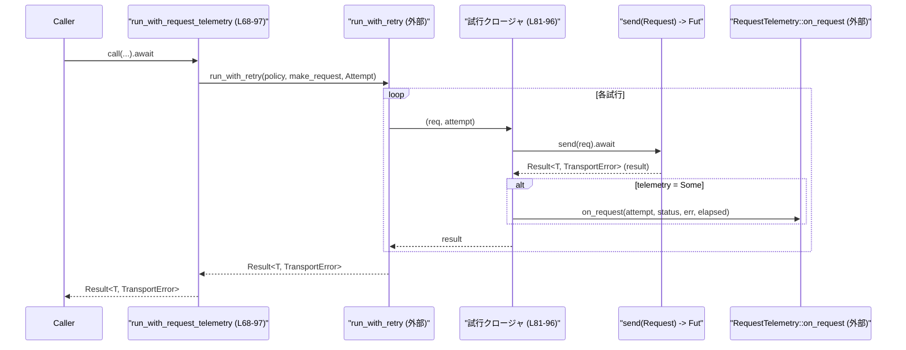
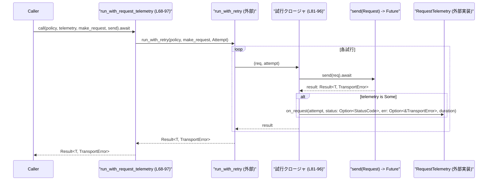

# codex-api/src/telemetry.rs コード解説

## 0. ざっくり一言

このモジュールは、HTTP（ユニタリ／ストリーミング）、SSE、WebSocket 通信に対して **テレメトリ（メトリクス／ログ用のフック）** を提供するためのインターフェースと、HTTP 呼び出しにテレメトリを付与するラッパ関数を定義しています。

---

## 1. このモジュールの役割

### 1.1 概要

- このモジュールは、クライアント API 呼び出しに関する **観測可能性（observability）** を高めるために存在します。
- SSE と WebSocket のためのテレメトリ用トレイト（インターフェース）を公開し、HTTP リクエストについては `run_with_retry` の呼び出しをラップして **リトライ毎の遅延・ステータス・エラー情報を `RequestTelemetry` に通知**します（`codex-api/src/telemetry.rs:L17-43`, `L68-97`）。
- 実際のメトリクス送信ロジック（例えば Prometheus 送信やログ出力）はここでは定義されず、外部でこれらのトレイトを実装することで拡張されます。

### 1.2 アーキテクチャ内での位置づけ

このモジュールは `codex_client` クレートの HTTP／SSE／WebSocket トランスポート層の上に載る **テレメトリ層** です。

```mermaid
graph TD
    subgraph codex-api
        T["telemetry.rs (L17-97)"]
    end

    subgraph codex_client（外部クレート）
        Req["Request"]
        Resp["Response"]
        SResp["StreamResponse"]
        RP["RetryPolicy"]
        RT["RequestTelemetry"]
        TE["TransportError"]
        RWR["run_with_retry(...)"]
    end

    subgraph その他外部クレート
        ES["eventsource_stream::Event\nEventStreamError"]
        WS["tungstenite::Message/Error"]
        TK["tokio::time::Instant/Elapsed"]
        HTTP["http::StatusCode"]
    end

    T --> Req
    T --> Resp
    T --> SResp
    T --> RP
    T --> RT
    T --> TE
    T --> RWR
    T --> ES
    T --> WS
    T --> TK
    T --> HTTP
```

- `run_with_request_telemetry` は `run_with_retry` を内部的に呼び出し、各試行の前後で `RequestTelemetry` に通知する役割を持ちます（`codex-api/src/telemetry.rs:L68-97`）。
- SSE/WebSocket 通信そのものはこのチャンクには現れませんが、`SseTelemetry`／`WebsocketTelemetry` トレイトを通してイベント毎の情報を外部に伝えられる構造になっています（`L17-43`）。

### 1.3 設計上のポイント

- **責務分離**
  - 実際の通信処理は `codex_client` に任せ、ここでは **「何を観測できるようにするか」だけを定義**しています。
  - テレメトリの実装詳細は外部（トレイト実装側）に委ねられています。
- **トレイトによる抽象化**
  - `SseTelemetry` と `WebsocketTelemetry` は、それぞれのプロトコルに特化したテレメトリ情報を扱うためのインターフェースです（`L17-43`）。
  - `WithStatus` トレイトで HTTP ステータスコード取得を抽象化し、`Response` と `StreamResponse` に共通の扱いを与えています（`L45-47`, `L56-66`）。
- **並行性を前提とした設計**
  - テレメトリトレイトは `Send + Sync` 制約付きで定義されており、スレッド／タスク間で安全に共有できる前提になっています（`L18`, `L35`）。
  - HTTP テレメトリでは `Option<Arc<dyn RequestTelemetry>>` を用い、複数の非同期リクエストから同じテレメトリ実装を共有できるようになっています（`L70`）。
- **エラーハンドリング**
  - HTTP テレメトリは成功・失敗いずれの場合も `RequestTelemetry::on_request` に通知し、失敗時には可能であれば HTTP ステータスを抽出して渡します（`L81-93`）。
  - 自身はエラーを変形せず、`TransportError` をそのまま上位に返す構造です（`L73`, `L96-97`）。

---

## 2. 主要な機能一覧

- `SseTelemetry` トレイト: SSE ポーリング結果と経過時間を報告するためのテレメトリインターフェース（`L17-32`）。
- `WebsocketTelemetry` トレイト: WebSocket 接続確立とイベント受信の結果を報告するためのテレメトリインターフェース（`L34-43`）。
- `WithStatus` トレイト: HTTP レスポンスから `StatusCode` を取得するための内部用抽象化（`L45-47`）。
- `impl WithStatus for Response/StreamResponse`: `codex_client::Response` と `StreamResponse` にステータス取得手段を提供（`L56-66`）。
- `http_status` 関数: `TransportError` から HTTP ステータスコードを抽出するヘルパー（`L49-54`）。
- `run_with_request_telemetry` 関数: `run_with_retry` をラップし、各試行の `RequestTelemetry::on_request` 呼び出しを自動付与する非公開 API（`L68-97`）。

---

## 3. 公開 API と詳細解説

### 3.1 型・コンポーネント一覧

#### トレイト一覧

| 名前 | 種別 | 公開度 | 定義位置 | 役割 / 用途 |
|------|------|--------|----------|-------------|
| `SseTelemetry` | トレイト | `pub` | `telemetry.rs:L17-32` | SSE ポーリング結果と経過時間を報告するためのインターフェース。実装側でメトリクス記録やログ出力を行う想定。 |
| `WebsocketTelemetry` | トレイト | `pub` | `telemetry.rs:L34-43` | WebSocket リクエスト開始とイベント受信ごとの結果を報告するインターフェース。 |
| `WithStatus` | トレイト | `pub(crate)` | `telemetry.rs:L45-47` | 型から HTTP ステータスコードを取得するための内部用抽象化。`Response` と `StreamResponse` に実装されている。 |

#### 関数・メソッド一覧（コンポーネントインベントリー）

| 名前 | 種別 | 所属 | 公開度 | 定義位置 | 説明 |
|------|------|------|--------|----------|------|
| `on_sse_poll` | メソッド | `SseTelemetry` | `pub`（トレイトの一部） | `telemetry.rs:L18-31` | SSE ポーリングの結果と所要時間を受け取り、テレメトリとして処理する。 |
| `on_ws_request` | メソッド | `WebsocketTelemetry` | `pub`（トレイトの一部） | `telemetry.rs:L35-36` | WebSocket リクエスト（接続）の結果と接続再利用フラグを報告する。 |
| `on_ws_event` | メソッド | `WebsocketTelemetry` | `pub`（トレイトの一部） | `telemetry.rs:L38-42` | WebSocket イベントの受信結果と処理時間を報告する。 |
| `status` | メソッド | `WithStatus` | `pub(crate)`（トレイトメソッド） | `telemetry.rs:L45-47` | 型インスタンスから HTTP ステータスコードを取得する。 |
| `status` | メソッド | `impl WithStatus for Response` | `pub(crate)`（トレイト実装） | `telemetry.rs:L56-60` | `Response` のフィールド `status` を返す。 |
| `status` | メソッド | `impl WithStatus for StreamResponse` | `pub(crate)` | `telemetry.rs:L62-66` | `StreamResponse` のフィールド `status` を返す。 |
| `http_status` | 関数 | モジュール直下 | private | `telemetry.rs:L49-54` | `TransportError` が HTTP エラーなら、そのステータスコードを抽出する。 |
| `run_with_request_telemetry` | 関数（`async`） | モジュール直下 | `pub(crate)` | `telemetry.rs:L68-97` | `run_with_retry` をラップし、各 HTTP 呼び出し試行ごとに `RequestTelemetry::on_request` を呼び出す。 |

### 3.2 関数・メソッド詳細

#### `SseTelemetry::on_sse_poll(&self, result: &Result<Option<Result<Event, EventStreamError<TransportError>>>, tokio::time::error::Elapsed>, duration: Duration)`

（根拠: `codex-api/src/telemetry.rs:L17-32`）

**概要**

- SSE（Server-Sent Events）のポーリング処理 1 回分の結果と、その処理にかかった時間を受け取るテレメトリフックです。
- 実装側で、成功・失敗・タイムアウトなどを判別してメトリクス送信やログ出力を行うことができます。

**引数**

| 引数名 | 型 | 説明 |
|--------|----|------|
| `result` | `&Result<Option<Result<eventsource_stream::Event, eventsource_stream::EventStreamError<TransportError>>>, tokio::time::error::Elapsed>` | SSE ポーリングの結果。外側 `Result` はタイムアウト（`Elapsed`）かそれ以外を区別し、内側の `Option<Result<...>>` は「イベントがあったか／なかったか」とその成否を表す。 |
| `duration` | `Duration` | このポーリング処理にかかった時間。 |

**戻り値**

- なし（`()`）。副作用（メトリクス記録など）のみを行う想定です。

**内部処理の流れ（想定される利用パターン）**

このトレイト自体には実装がありません。典型的な実装は次のような流れになります。

1. `result` をパターンマッチして、タイムアウト／エラー／成功などを分類する。
2. 分類結果と `duration` をもとに、カウンタやヒストグラムなどのメトリクスへ記録する。
3. 必要に応じてログ出力を行う。

**Examples（使用例・実装例）**

SSE のエラー数とレイテンシをログに出すだけの簡単な実装例です。

```rust
use std::time::Duration;
use codex_client::TransportError;
use eventsource_stream::{Event, EventStreamError};
use tokio::time::error::Elapsed;

// telemetry.rs の SseTelemetry トレイトを実装する型
struct SimpleSseTelemetry;

impl crate::telemetry::SseTelemetry for SimpleSseTelemetry {
    fn on_sse_poll(
        &self,
        result: &Result<
            Option<Result<Event, EventStreamError<TransportError>>>,
            Elapsed,
        >,
        duration: Duration,
    ) {
        match result {
            Err(_) => {
                eprintln!("[SSE] poll timeout after {:?}", duration);
            }
            Ok(None) => {
                // イベントなし（長ポーリングの場合など）
                eprintln!("[SSE] no event, took {:?}", duration);
            }
            Ok(Some(Ok(_event))) => {
                eprintln!("[SSE] event received in {:?}", duration);
            }
            Ok(Some(Err(e))) => {
                eprintln!("[SSE] error {:?} after {:?}", e, duration);
            }
        }
    }
}
```

**Errors / Panics**

- このメソッド自体は戻り値がなく、エラーを返しません。
- パニックが起こりうるのは **実装側が内部で `panic!` を呼ぶ場合のみ**です。

**Edge cases（エッジケース）**

- `result` が `Err(Elapsed)` の場合: タイムアウトとして扱うことができます。
- `result` が `Ok(None)` の場合: イベントが存在しない（ストリーム終了または無イベント）というケースを表します。カウンタに含めるかどうかは実装方針次第です。
- `result` が `Ok(Some(Err(...)))` の場合: SSE ストリームのパースエラーやトランスポートエラーです。HTTP ステータスコードなどの詳細は `TransportError` 側を調べる必要があります。

**使用上の注意点**

- `SseTelemetry` は `Send + Sync` 制約付きで定義されているため、多数のタスクから同時に呼び出される前提で **スレッドセーフな実装**にする必要があります（`L18`）。
- 重い I/O 処理（同期的なファイルアクセスなど）をここで行うと、SSE 処理全体のレイテンシに影響します。基本的には非同期に処理するか、軽量な操作に留めることが望まれます。

---

#### `WebsocketTelemetry::on_ws_request(&self, duration: Duration, error: Option<&ApiError>, connection_reused: bool)`

（根拠: `codex-api/src/telemetry.rs:L34-36`）

**概要**

- WebSocket 接続（またはリクエスト）確立処理の結果を報告するテレメトリフックです。
- 所要時間、エラーの有無、既存接続の再利用かどうかの情報が渡されます。

**引数**

| 引数名 | 型 | 説明 |
|--------|----|------|
| `duration` | `Duration` | 接続確立処理にかかった時間。 |
| `error` | `Option<&ApiError>` | 接続処理で発生したエラー。成功時は `None`。`ApiError` の定義は別モジュール（このチャンクには現れません）。 |
| `connection_reused` | `bool` | 既存の WebSocket 接続を再利用した場合は `true`、新規確立なら `false` と思われますが、正確な意味付けは呼び出し側の実装に依存します。 |

**戻り値**

- なし（`()`）。

**内部処理の流れ（想定される利用パターン）**

1. `error` が `Some` か `None` かで成功／失敗を判定。
2. `connection_reused` の真偽値に応じて別々のメトリクス（新規接続／再利用）をインクリメントする。
3. `duration` をレイテンシ系メトリクスに記録する。

**Examples（使用例・実装例）**

```rust
use std::time::Duration;
use crate::error::ApiError;

struct SimpleWsTelemetry;

impl crate::telemetry::WebsocketTelemetry for SimpleWsTelemetry {
    fn on_ws_request(
        &self,
        duration: Duration,
        error: Option<&ApiError>,
        connection_reused: bool,
    ) {
        if let Some(e) = error {
            eprintln!(
                "[WS] connect failed after {:?} (reused={}): {:?}",
                duration, connection_reused, e
            );
        } else {
            eprintln!(
                "[WS] connect succeeded in {:?} (reused={})",
                duration, connection_reused
            );
        }
    }

    fn on_ws_event(
        &self,
        _result: &Result<Option<Result<tokio_tungstenite::tungstenite::Message,
                                      tokio_tungstenite::tungstenite::Error>>,
                         crate::error::ApiError>,
        _duration: Duration,
    ) {
        // on_ws_event 側は後述
    }
}
```

**Errors / Panics**

- このメソッドはエラーを返さず、パニックしうるのは実装側のコードのみです。

**Edge cases**

- `connection_reused == true` かつ `error.is_some()` のような組み合わせ（再利用に失敗したケース）にも対応できるよう、組み合わせで分類する実装が考えられます。
- `duration` が極端に短い／長い場合もありえるため、メトリクスのバケット設計などで考慮が必要です。

**使用上の注意点**

- `ApiError` はアプリケーションレベルのエラー型であり、テレメトリ実装側で内容を詳しくログ出力する際には、機密情報を含まないかどうかに注意する必要があります。
- トレイト全体として `Send + Sync` 制約があるため、スレッドセーフな実装が前提です（`L35`）。

---

#### `WebsocketTelemetry::on_ws_event(&self, result: &Result<Option<Result<Message, Error>>, ApiError>, duration: Duration)`

（根拠: `codex-api/src/telemetry.rs:L38-42`）

**概要**

- WebSocket ストリームから 1 回イベントを取得した際の結果と所要時間を報告するテレメトリフックです。

**引数**

| 引数名 | 型 | 説明 |
|--------|----|------|
| `result` | `&Result<Option<Result<Message, Error>>, ApiError>` | イベント取得の結果。外側 `Result` は API レベルエラー（`ApiError`）、内側は「メッセージがあったか／なかったか」とその成否（`Message` または `tungstenite::Error`）を表す。 |
| `duration` | `Duration` | イベント取得に要した時間。 |

**戻り値**

- なし（`()`）。

**内部処理の流れ（典型例）**

1. `result` の外側 `Result` を見て、API レベルのエラーかどうかを判定。
2. `Ok(None)` の場合は「イベントなし」としてカウント。
3. `Ok(Some(Ok(msg)))` なら、正常な WebSocket メッセージ受信としてカウンタを増やし、ペイロードサイズなどを記録することも可能です。
4. `Ok(Some(Err(e)))` なら、プロトコルレベルのエラーとして別カウンタに記録します。

**Edge cases**

- `Ok(None)` は「ストリームが閉じた」「非ブロッキング読みで何もなかった」など複数の意味を持ちうるため、呼び出し側の仕様を確認する必要があります（このチャンクからは詳細不明）。
- `Err(ApiError)` の場合、`tungstenite::Error` とは異なるレイヤーの問題であるため、メトリクス上も別カテゴリーで扱うのが自然です。

**使用上の注意点**

- SSE と同様、このメソッド内で重い処理を行うと WebSocket イベント処理のスループットに影響します。
- `Message` の中身（テキスト／バイナリ）を解析する場合は、処理コストとプライバシー／セキュリティへの影響を考慮する必要があります。

---

#### `WithStatus::status(&self) -> StatusCode`

（根拠: `codex-api/src/telemetry.rs:L45-47`, 実装: `L56-66`）

**概要**

- 型インスタンスから HTTP ステータスコードを取得するための内部用トレイトです。
- `Response` と `StreamResponse` に対して実装されており、テレメトリ処理が「成功レスポンスのステータスコード」を一様に参照できるようにしています。

**引数**

- なし（レシーバ `&self` のみ）。

**戻り値**

- `StatusCode`（`http` クレートからの型）: 対象のレスポンスが持つ HTTP ステータスコード。

**内部処理の流れ**

- `Response` 実装（`L56-60`）: 構造体フィールド `self.status` をそのまま返します。
- `StreamResponse` 実装（`L62-66`）: 同様に `self.status` を返します。

**Examples（使用例）**

```rust
use codex_client::{Response, StreamResponse};
use http::StatusCode;
use crate::telemetry::WithStatus;

fn log_status<R: WithStatus>(resp: &R) {
    let status: StatusCode = resp.status();
    eprintln!("status = {}", status);
}

// Response / StreamResponse の両方で利用可能
fn example(resp: Response, stream_resp: StreamResponse) {
    log_status(&resp);
    log_status(&stream_resp);
}
```

**Errors / Panics**

- フィールドを直接返すだけなので、このメソッド自体がパニックする要素はありません。

**Edge cases**

- ステータスコードがエラー（4xx/5xx）の場合でも、そのまま返すだけです。判定ロジックは呼び出し側で実装する必要があります。

**使用上の注意点**

- `WithStatus` は `pub(crate)` であり、クレート外から利用することはできません。
- 新しいレスポンスタイプに対して `run_with_request_telemetry` を使いたい場合は、このトレイトをその型に実装する必要があります。

---

#### `http_status(err: &TransportError) -> Option<StatusCode>`

（根拠: `codex-api/src/telemetry.rs:L49-54`）

**概要**

- `TransportError` のうち HTTP ステータスコードを持つエラーから、そのステータスコードを取り出すヘルパー関数です。
- テレメトリにおいて「失敗したリクエストのステータスコード」を可能な範囲で記録するために使われます。

**引数**

| 引数名 | 型 | 説明 |
|--------|----|------|
| `err` | `&TransportError` | ネットワーク／HTTP トランスポート層で発生したエラー。 |

**戻り値**

- `Option<StatusCode>`:
  - `Some(status)` : `TransportError::Http { status, .. }` バリアントの場合（`L50-51`）。
  - `None` : それ以外のバリアントの場合（`L52-53`）。

**内部処理の流れ**

1. `match err` でバリアントを判定（`L50`）。
2. `TransportError::Http { status, .. }` であれば `Some(*status)` を返却（`L51`）。
3. その他のバリアントは `_ => None` として扱う（`L52-53`）。

**Examples（使用例）**

```rust
use codex_client::TransportError;
use http::StatusCode;
use crate::telemetry::http_status; // 同一モジュール内なら private のため直接は呼べませんが、例として。

fn classify_error(err: &TransportError) {
    if let Some(status) = http_status(err) {
        eprintln!("HTTP error with status: {}", status);
    } else {
        eprintln!("non-HTTP transport error: {:?}", err);
    }
}
```

**Errors / Panics**

- パターンマッチのみであり、パニック要因はありません。

**Edge cases**

- `TransportError` が HTTP 以外（DNS エラー、タイムアウトなど）の場合は常に `None` となり、テレメトリにはステータスが記録されません。
- HTTP エラーだがステータスコードが非標準値であっても、そのまま返却されます。

**使用上の注意点**

- この関数は `pub` ではなく、モジュール内部専用です。
- ステータスコードが取れない場合に備え、呼び出し側（ここでは `run_with_request_telemetry`）は `Option<StatusCode>` として扱います。

---

#### `run_with_request_telemetry<T, F, Fut>(policy: RetryPolicy, telemetry: Option<Arc<dyn RequestTelemetry>>, make_request: impl FnMut() -> Request, send: F) -> Result<T, TransportError>`

（根拠: `codex-api/src/telemetry.rs:L68-97`）

**概要**

- `codex_client::run_with_retry` をラップし、HTTP／ストリーミング HTTP リクエストの **各試行ごとに** `RequestTelemetry::on_request` を呼び出す非同期関数です。
- 成功時にはレスポンス型 `T` を、失敗時にはリトライの最終的な結果として `TransportError` を返します。
- `T` は `WithStatus` を実装している必要があり、レスポンスから HTTP ステータスコードを取得してテレメトリに渡します（`L75-76`, `L88-89`）。

**型パラメータと制約**

| パラメータ | 制約 | 説明 |
|-----------|------|------|
| `T` | `T: WithStatus` | 最終レスポンス型。`WithStatus` により `status()` でステータスコードを取得可能。`Response` または `StreamResponse` など。 |
| `F` | `F: Clone + Fn(Request) -> Fut` | リクエスト送信関数。`Request` を受け取り非同期に `Result<T, TransportError>` を返す。クローン可能である必要がある（`L76`）。 |
| `Fut` | `Future<Output = Result<T, TransportError>>` | 送信関数の返す Future の型（`L77`）。 |

**引数**

| 引数名 | 型 | 説明 |
|--------|----|------|
| `policy` | `RetryPolicy` | リトライ方針（回数、バックオフ等）。詳細は `codex_client` 側の実装（このチャンクには現れません）に依存。 |
| `telemetry` | `Option<Arc<dyn RequestTelemetry>>` | リクエストごとのテレメトリ実装。`None` の場合はテレメトリ通知を行わない。 |
| `make_request` | `impl FnMut() -> Request` | 各試行で新しい `Request` を生成するクロージャ。 |
| `send` | `F` | 実際に HTTP 送信を行う非同期関数。 |

**戻り値**

- `Result<T, TransportError>`:
  - `Ok(T)` : リトライ戦略に従った試行のいずれかが成功した場合の最終レスポンス。
  - `Err(TransportError)` : 全ての試行が失敗した場合など、`run_with_retry` が返す最終的なトランスポートエラー。

**内部処理の流れ**

1. `run_with_retry` に `policy` と `make_request`、および試行ごとに実行するクロージャを渡す（`L81`）。
2. 試行クロージャ内で、以下を行う（`L81-96`）:
   1. `telemetry` と `send` をローカルに `clone`（`L82-83`）。
   2. `async move` ブロックに入り、開始時刻 `start = Instant::now()` を記録（`L84-85`）。
   3. `let result = send(req).await;` で HTTP 呼び出しを実行（`L86`）。
   4. `telemetry` が `Some(t)` の場合のみテレメトリ通知を行う（`L87`）。
      - `result` が `Ok(resp)` なら `status = Some(resp.status())`, `err = None`（`L88-89`）。
      - `result` が `Err(err)` なら `status = http_status(err)`, `err = Some(err)`（`L90`）。
      - `t.on_request(attempt, status, err, start.elapsed())` を呼び出す（`L92`）。
   5. `result` をそのまま返す（`L94`）。
3. `run_with_retry` の結果を `.await` し、呼び出し元に返す（`L97`）。

**データフロー図（関数内部）**



**Examples（使用例）**

> 注意: `run_with_request_telemetry` は `pub(crate)` なので、同一クレート内からのみ呼び出せます。

```rust
use std::sync::Arc;
use codex_client::{Request, Response, RetryPolicy, TransportError};
use crate::telemetry::run_with_request_telemetry;

// RequestTelemetry の具体型は外部で定義されている想定
use codex_client::RequestTelemetry;

async fn example() -> Result<Response, TransportError> {
    let policy: RetryPolicy = /* リトライポリシーを構成 */;

    let telemetry: Option<Arc<dyn RequestTelemetry>> = Some(/* どこかで構築された実装 */);

    // 各試行ごとに新規 Request を作るクロージャ
    let mut make_request = || {
        // Request の具体的な構築方法は codex_client の API に依存
        Request { /* ... */ }
    };

    // 実際に HTTP 送信を行う関数
    let send = |req: Request| async move {
        // ここで codex_client の HTTP クライアントを用いて送信する
        // 例: client.send(req).await
        unimplemented!()
    };

    run_with_request_telemetry::<Response, _, _>(
        policy,
        telemetry,
        &mut make_request,
        send,
    ).await
}
```

**Errors / Panics**

- エラー:
  - `send`（およびその内部で行う HTTP 呼び出し）が返した `TransportError` が、そのまま `run_with_retry` を経由して最終的な `Err` として返されます。
  - リトライロジック自体の振る舞い（どのエラーでリトライするか等）は `run_with_retry` と `RetryPolicy` に依存し、このチャンクからは詳細不明です。
- パニック:
  - この関数自身は `unwrap` やインデックスアクセスを行っておらず、通常はパニックしません。
  - ただし、`send` 内部や `RequestTelemetry::on_request` の実装がパニックする場合、呼び出し全体としてパニックに至る可能性があります。

**Edge cases（エッジケース）**

- `telemetry == None` の場合:
  - テレメトリ通知は一切行われず、純粋に `run_with_retry` の薄いラッパとして動作します（`L81-88`）。
- `send` が `Err(err)` を返し、かつ `err` が `TransportError::Http` 以外の場合:
  - `http_status(err)` は `None` を返し（`L50-53`）、テレメトリにはステータスコード無しでエラー情報だけが渡されます（`L90`）。
- `T` が `WithStatus` を実装していない型に変更されると、この関数はコンパイルエラーになります（`L75`）。
- `make_request` が副作用を持つ場合（例えばリクエストボディを消費してしまうなど）、`run_with_retry` との組み合わせで意図しない挙動になりうるため、設計に注意が必要です（詳細はこのチャンクでは不明）。

**使用上の注意点**

- **並行性**:
  - `telemetry` は `Arc` で包まれているため、同じ `RequestTelemetry` 実装を複数リクエスト／試行間で安全に共有できます。
  - 一方で `Fut` や `F` に `Send` 制約はここでは付与されていませんが、実際には `run_with_retry` の実装側で制約が追加されている可能性があります（このチャンクには現れません）。
- **性能**:
  - 各試行ごとに `Instant::now()` と `start.elapsed()` を呼び出すコストは小さいですが、非常に大量のリクエストではメトリクスの処理自体がボトルネックになりうるため、`RequestTelemetry` 側は軽量な実装を心がける必要があります。
- **セキュリティ**:
  - テレメトリにエラー内容やステータスコードを渡しているため、ログ／メトリクスに機密情報が含まれないよう、`RequestTelemetry` の実装内で出力内容を制御する必要があります。

---

### 3.3 その他の関数

- このファイルには、上記で説明したもの以外に複雑な関数は定義されていません。
- `WithStatus` の `Response`／`StreamResponse` 実装（`L56-66`）はフィールドの単純な委譲であり、振る舞いは `status` フィールドそのものです。

---

## 4. データフロー

ここでは代表的なシナリオとして、`run_with_request_telemetry` を用いて HTTP リクエストを行う際のデータフローを示します。

1. 呼び出し元が `run_with_request_telemetry` に `policy`、`telemetry`、`make_request`、`send` を渡して呼び出す（`L68-73`）。
2. `run_with_request_telemetry` は `run_with_retry` に、リトライポリシー・リクエスト生成関数・試行クロージャ（`L81-96`）を渡す。
3. `run_with_retry` は各試行ごとに `make_request` から `Request` を取得し、試行クロージャを呼び出す。
4. 試行クロージャは `send(req).await` で実際の HTTP 呼び出しを行い、その結果をもとに `RequestTelemetry::on_request` を呼び出す（`L86-92`）。
5. 最終的な `Result<T, TransportError>` が呼び出し元に返る（`L97`）。

### データフローのシーケンス図



- SSE／WebSocket については、このファイルではトレイト定義のみが行われており、具体的なデータフローは別モジュール側の実装に依存します（このチャンクには現れません）。

---

## 5. 使い方（How to Use）

### 5.1 基本的な使用方法

#### 5.1.1 HTTP リクエスト（内部 API）

`run_with_request_telemetry` を用いることで、HTTP リトライの各試行にテレメトリを付与できます。

```rust
use std::sync::Arc;
use codex_client::{Request, Response, RetryPolicy, TransportError, RequestTelemetry};
use crate::telemetry::run_with_request_telemetry;

async fn send_with_telemetry(
    policy: RetryPolicy,
    telemetry: Option<Arc<dyn RequestTelemetry>>,
) -> Result<Response, TransportError> {
    let make_request = || {
        // Request の具体的な構築は codex_client の API に依存
        Request { /* ... */ }
    };

    let send = |req: Request| async move {
        // 実際には codex_client の HTTP クライアントを呼び出す想定
        // 例: client.send(req).await
        unimplemented!()
    };

    run_with_request_telemetry(policy, telemetry, make_request, send).await
}
```

- この関数は `pub(crate)` なので、**同一クレート内の他のモジュールからの再利用を意図したもの**です。

#### 5.1.2 SSE テレメトリトレイトの実装

```rust
use std::time::Duration;
use codex_client::TransportError;
use eventsource_stream::{Event, EventStreamError};
use tokio::time::error::Elapsed;
use crate::telemetry::SseTelemetry;

struct LoggingSseTelemetry;

impl SseTelemetry for LoggingSseTelemetry {
    fn on_sse_poll(
        &self,
        result: &Result<
            Option<Result<Event, EventStreamError<TransportError>>>,
            Elapsed,
        >,
        duration: Duration,
    ) {
        eprintln!("[SSE] result={:?}, duration={:?}", result, duration);
    }
}
```

#### 5.1.3 WebSocket テレメトリトレイトの実装

```rust
use std::time::Duration;
use crate::error::ApiError;
use crate::telemetry::WebsocketTelemetry;
use tokio_tungstenite::tungstenite::{Message, Error};

struct LoggingWsTelemetry;

impl WebsocketTelemetry for LoggingWsTelemetry {
    fn on_ws_request(
        &self,
        duration: Duration,
        error: Option<&ApiError>,
        connection_reused: bool,
    ) {
        eprintln!(
            "[WS request] duration={:?}, error={:?}, reused={}",
            duration, error, connection_reused
        );
    }

    fn on_ws_event(
        &self,
        result: &Result<Option<Result<Message, Error>>, ApiError>,
        duration: Duration,
    ) {
        eprintln!("[WS event] result={:?}, duration={:?}", result, duration);
    }
}
```

### 5.2 よくある使用パターン

- **テレメトリを一時的に無効化したい場合**:
  - 引数 `telemetry` に `None` を渡すことで、`run_with_request_telemetry` の処理はそのままエラー／レスポンスだけを返し、テレメトリ通知を行いません（`L70-71`, `L87`）。
- **複数モジュールで同じテレメトリ実装を共有する場合**:
  - `Arc<dyn RequestTelemetry>` を一度構築し、クレート内の複数箇所で `Some(arc.clone())` として共有します。

### 5.3 よくある間違い

```rust
use codex_client::Response;
use crate::telemetry::run_with_request_telemetry;

// 間違い例: T が WithStatus を実装していない型
struct MyResponse; // WithStatus を実装していない

async fn wrong_usage(policy: codex_client::RetryPolicy) {
    let telemetry = None;
    let make_request = || codex_client::Request { /* ... */ };
    let send = |req| async move {
        // MyResponse を返そうとするとコンパイルエラー
        Ok::<MyResponse, codex_client::TransportError>(MyResponse)
    };

    // ↓ T: MyResponse は WithStatus 制約を満たさないためコンパイルエラー
    // let _ = run_with_request_telemetry::<MyResponse, _, _>(policy, telemetry, make_request, send).await;
}
```

**正しい例:**

```rust
use codex_client::{Request, Response, RetryPolicy, TransportError};
use crate::telemetry::run_with_request_telemetry;

async fn correct_usage(policy: RetryPolicy) -> Result<Response, TransportError> {
    let telemetry = None;
    let make_request = || Request { /* ... */ };
    let send = |req: Request| async move {
        // Response は WithStatus が実装されているため OK
        let resp: Response = unimplemented!();
        Ok::<Response, TransportError>(resp)
    };

    run_with_request_telemetry(policy, telemetry, make_request, send).await
}
```

### 5.4 使用上の注意点（まとめ）

- テレメトリ実装 (`SseTelemetry`／`WebsocketTelemetry`／`RequestTelemetry`) は **`Send + Sync` かつパニックしない実装**であることが望ましいです。パニックは本来の通信処理に影響します。
- `run_with_request_telemetry` を利用する際は、`make_request` が各試行で独立した `Request` を返すように設計する必要があります。同じインスタンスを再利用すると、ボディの再送などで問題になる可能性があります（詳細は `Request` の設計に依存し、このチャンクには現れません）。
- テレメトリに含める情報（エラー内容、ステータスコードなど）には、ユーザーデータや機密情報を含めないよう、実装側でフィルタリングすることが重要です。

---

## 6. 変更の仕方（How to Modify）

### 6.1 新しい機能を追加する場合

- **別種のトランスポート用テレメトリを追加したい場合**
  1. このファイルに新しいトレイト（例: `Http2Telemetry`）を定義します。
  2. そのトレイトを、実際の HTTP/2 通信を行うモジュールから呼び出すように変更します。
- **HTTP テレメトリに追加情報を渡したい場合**
  1. `RequestTelemetry::on_request` のシグネチャは外部クレート側に定義されており、このチャンクでは変更できません。
  2. 追加したい情報がこのモジュールで取得可能であれば、`on_request` の引数に含めるのではなく、テレメトリ実装側で別途取得する方法（コンテキスト情報など）を検討する必要があります。

### 6.2 既存の機能を変更する場合

- **`run_with_request_telemetry` のシグネチャや挙動を変更する場合**
  - この関数はクレート内部の他モジュールから呼ばれている可能性があります（呼び出し箇所はこのチャンクには現れません）。変更前にクレート全体での参照先を検索し、影響範囲を確認する必要があります。
  - `T: WithStatus` 制約を外す／変える場合は、テレメトリでステータスコードをどう扱うか（`None` 許容など）の新しい契約を明確にする必要があります。
- **`WithStatus` トレイトの変更**
  - メソッドを追加・変更すると `Response` と `StreamResponse` の実装（`L56-66`）も修正が必要になります。
  - `run_with_request_telemetry` の利用方法にも影響するため、契約（「status は必ず HTTP ステータスコードを返す」など）を維持するかどうかを検討する必要があります。
- **`SseTelemetry`／`WebsocketTelemetry` のメソッドシグネチャ変更**
  - これらは `pub` であるため、クレート外の利用者にも影響します。破壊的変更になる場合はバージョンアップポリシーに従った対応が必要です。

---

## 7. 関連ファイル・モジュール

| パス / モジュール | 役割 / 関係 |
|------------------|------------|
| `codex-api/src/telemetry.rs` | 本ファイル。テレメトリトレイト定義と HTTP テレメトリラッパを提供。 |
| `crate::error::ApiError` | WebSocket テレメトリインターフェースで利用されるアプリケーションエラー型（`L1`, `L35-42`）。定義位置はこのチャンクには現れません。 |
| `codex_client::Request` / `Response` / `StreamResponse` | HTTP リクエスト／レスポンスとストリーミングレスポンスの型。`WithStatus` 実装と `run_with_request_telemetry` の型パラメータとして利用（`L2`, `L4`, `L6`, `L56-66`, `L75`）。 |
| `codex_client::RetryPolicy` / `run_with_retry` | HTTP 呼び出しのリトライポリシーと、その実行エンジン。`run_with_request_telemetry` の中心となる外部関数（`L5`, `L8`, `L68-81`）。 |
| `codex_client::RequestTelemetry` | HTTP リクエストテレメトリのトレイト。`run_with_request_telemetry` から `on_request` が呼び出される（`L3`, `L70`, `L87-92`）。 |
| `codex_client::TransportError` | HTTP トランスポート層のエラー型。`http_status` や `run_with_request_telemetry` のエラー型として利用（`L7`, `L49-54`, `L73`, `L86-91`）。 |
| `eventsource_stream` クレート | SSE テレメトリ用の `Event` および `EventStreamError<TransportError>` を提供（`L24-26`）。 |
| `tokio_tungstenite::tungstenite::{Message, Error}` | WebSocket イベントテレメトリで使用されるメッセージとエラー型（`L14-15`, `L40`）。 |
| `tokio::time::{Instant, error::Elapsed}` | リクエスト／イベント処理の時間計測およびタイムアウトのエラー型として利用（`L13`, `L28`, `L85`）。 |

このチャンクにはテストコードや、これらのテレメトリトレイト／関数を実際に呼び出す側の実装は含まれていないため、使用箇所や具体的なメトリクス送信先については別ファイルを確認する必要があります。
