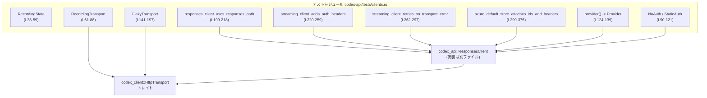
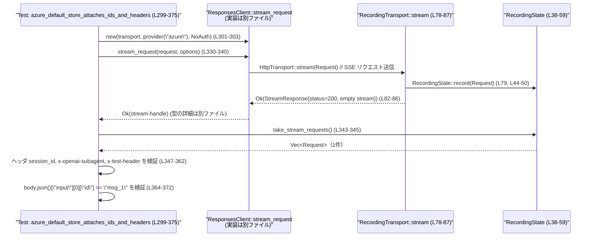

# codex-api/tests/clients.rs コード解説

## 0. ざっくり一言

`codex-api/tests/clients.rs` は、`ResponsesClient` の HTTP ストリーミング挙動を検証するための **テスト用モック (疑似) トランスポート・認証プロバイダと、それを使う統合テスト群** を定義したファイルです。

---

## 1. このモジュールの役割

### 1.1 概要

このモジュールは次の問題を解決するために存在します。

- **問題**: `ResponsesClient` が正しいパス・ヘッダ・リトライ設定・ボディを使って HTTP ストリーミングを行っているかを、安全に検証したい。
- **機能**:
  - リクエストを記録する `RecordingTransport` / `RecordingState` を提供します（`HttpTransport` のテスト用実装）。  
    根拠: `RecordingState`, `RecordingTransport` 定義と `HttpTransport` 実装  
    （`codex-api/tests/clients.rs:L38-41`, `L61-88`）
  - 1 回目だけ失敗する `FlakyTransport` により、`ResponsesClient` のリトライ処理を検証します。  
    根拠: `FlakyTransport` 定義と `HttpTransport` 実装  
    （`codex-api/tests/clients.rs:L141-144`, `L167-197`）
  - 認証ヘッダや Azure 固有のヘッダ付与など、`ResponsesClient` の HTTP リクエスト構築ロジックをテストします。  
    根拠: テスト関数群  
    （`codex-api/tests/clients.rs:L199-375`）

### 1.2 アーキテクチャ内での位置づけ

このファイルは「テスト層」にあり、実際の API クライアント (`ResponsesClient`) の上にモックトランスポートを差し込む形で振る舞いを検証しています。



- テスト関数は `ResponsesClient` を生成し、`RecordingTransport` / `FlakyTransport` を `HttpTransport` の実装として渡します。
- 実際の HTTP 通信は行わず、`RecordingState` 内の `Vec<Request>` に対して記録・検査を行う構造になっています。

### 1.3 設計上のポイント

**責務の分割**

- **RecordingState / RecordingTransport**  
  - 責務: 「送信されたリクエストを記録する」ことに限定。HTTP の成否やレスポンスボディは最低限のみ。  
    根拠: `RecordingTransport::stream` が `self.state.record(req)` のみ行い、空ストリームを返す実装  
    （`codex-api/tests/clients.rs:L78-87`）
- **FlakyTransport**  
  - 責務: 1 回目のストリーム呼び出しをネットワークエラーとして失敗させ、2 回目以降は正常に SSE 風レスポンスを返す。  
    根拠: `*attempts += 1` と `if *attempts == 1 { return Err(...) }`  
    （`codex-api/tests/clients.rs:L173-182`, `L184-195`）

**状態管理・並行性**

- `RecordingState` と `FlakyTransport` はどちらも `Arc<Mutex<...>>` を内部に保持し、クローン間で共有される状態を安全に更新しています。  
  根拠: `RecordingState.stream_requests: Arc<Mutex<Vec<Request>>>`（`L38-41`）、  
  `FlakyTransport.state: Arc<Mutex<i64>>`（`L141-144`）
- `Mutex::lock()` の失敗は `panic!` で即座にテストを落とす実装です。  
  根拠: `unwrap_or_else(|err| panic!("mutex poisoned: {err}"))` が複数箇所で使用  
  （`L45-48`, `L53-56`, `L159-163`, `L175-177`）

**エラーハンドリング**

- `HttpTransport::execute` はどのテスト用トランスポートでも `Err(TransportError::Build("execute should not run"))` を返し、**誤って execute を使うコードパス** を検知する仕組みになっています。  
  根拠: `RecordingTransport::execute`, `FlakyTransport::execute`  
  （`L74-76`, `L169-171`）
- `FlakyTransport::stream` は 1 回目のみ `TransportError::Network(...)` を返し、リトライのトリガとして使われます。  
  根拠: `if *attempts == 1 { return Err(TransportError::Network(...)) }`  
  （`L180-182`）

**非同期・ランタイム**

- すべてのテストは `#[tokio::test]` で定義されており、非同期コンテキストで `ResponsesClient` の `stream` / `stream_request` を検証しています。  
  根拠: テスト関数定義に `#[tokio::test] async fn ...`  
  （`L199-200`, `L220-221`, `L261-262`, `L299-300`）

---

## 2. 主要な機能一覧（コンポーネントインベントリー）

### 2.1 型一覧（構造体）

| 名前 | 種別 | 役割 / 用途 | 根拠 |
|------|------|------------|------|
| `RecordingState` | 構造体 | ストリーミングで送信された `Request` を `Vec<Request>` に蓄積・取得するための状態オブジェクトです。複数のトランスポートインスタンスから共有されます。 | `codex-api/tests/clients.rs:L38-59` |
| `RecordingTransport` | 構造体 | `HttpTransport` を実装し、`stream` 呼び出しで受け取った `Request` を `RecordingState` に記録するモックトランスポートです。 | `codex-api/tests/clients.rs:L61-88` |
| `NoAuth` | 構造体（ユニット） | 認証情報を一切返さない `AuthProvider` 実装です。トークン無しの動作をテストするために使われます。 | `codex-api/tests/clients.rs:L90-97` |
| `StaticAuth` | 構造体 | ベアラートークンとアカウント ID を固定値として返す `AuthProvider` 実装です。認証ヘッダ追加のテストに使われます。 | `codex-api/tests/clients.rs:L99-121` |
| `FlakyTransport` | 構造体 | `HttpTransport` を実装し、1 回目の `stream` 呼び出しのみ失敗させ、2 回目以降は成功させるモックトランスポートです。`ResponsesClient` のリトライ挙動を検証します。 | `codex-api/tests/clients.rs:L141-165`, `L167-197` |

### 2.2 関数・メソッド一覧

| 名前 | 種別 | 役割（1 行） | 根拠 |
|------|------|--------------|------|
| `assert_path_ends_with` | 関数 | 送信されたリクエストが 1 件であり、その URL パスが指定されたサフィックスで終わることを検証します。 | `codex-api/tests/clients.rs:L29-36` |
| `RecordingState::record` | メソッド | 渡された `Request` を内部の `Vec<Request>` に追加します。 | `codex-api/tests/clients.rs:L44-50` |
| `RecordingState::take_stream_requests` | メソッド | 内部の `Vec<Request>` を取り出し、状態を空にします。 | `codex-api/tests/clients.rs:L52-58` |
| `RecordingTransport::new` | 関数 | 既存の `RecordingState` を使って `RecordingTransport` を生成します。 | `codex-api/tests/clients.rs:L66-69` |
| `RecordingTransport::execute` | メソッド | 常に `Err` を返し、`execute` 経路が使われないことを保証します。 | `codex-api/tests/clients.rs:L72-76` |
| `RecordingTransport::stream` | メソッド | 受け取った `Request` を記録し、空のストリームレスポンスを返します。 | `codex-api/tests/clients.rs:L78-87` |
| `NoAuth::bearer_token` | メソッド | 常に `None` を返します。 | `codex-api/tests/clients.rs:L93-97` |
| `StaticAuth::new` | 関数 | トークンとアカウント ID を受け取り、`StaticAuth` を構築します。 | `codex-api/tests/clients.rs:L105-111` |
| `StaticAuth::bearer_token` | メソッド | 保持しているトークンを `Some` として返します。 | `codex-api/tests/clients.rs:L114-117` |
| `StaticAuth::account_id` | メソッド | 保持しているアカウント ID を `Some` として返します。 | `codex-api/tests/clients.rs:L119-121` |
| `provider` | 関数 | テスト用の `Provider` 構造体を生成します（base_url, retry 設定などを固定）。 | `codex-api/tests/clients.rs:L124-139` |
| `FlakyTransport::default` | メソッド | `Default` 実装として `FlakyTransport::new` を呼び出します。 | `codex-api/tests/clients.rs:L146-150` |
| `FlakyTransport::new` | 関数 | 内部カウンタを 0 で初期化した `FlakyTransport` を返します。 | `codex-api/tests/clients.rs:L152-157` |
| `FlakyTransport::attempts` | メソッド | これまでに `stream` が呼び出された回数を返します。 | `codex-api/tests/clients.rs:L159-164` |
| `FlakyTransport::execute` | メソッド | 常に `Err` を返し、`execute` 経路が使われないことを保証します。 | `codex-api/tests/clients.rs:L167-171` |
| `FlakyTransport::stream` | メソッド | 1 回目の呼び出しはネットワークエラーを返し、2 回目以降は SSE 風レスポンスを返します。 | `codex-api/tests/clients.rs:L173-196` |
| `responses_client_uses_responses_path` | テスト関数 | `ResponsesClient::stream` が `/responses` パスを使うことを検証します。 | `codex-api/tests/clients.rs:L199-218` |
| `streaming_client_adds_auth_headers` | テスト関数 | 認証トークンとアカウント ID から適切なヘッダが付与されることを検証します。 | `codex-api/tests/clients.rs:L220-259` |
| `streaming_client_retries_on_transport_error` | テスト関数 | トランスポートエラー発生時に `ResponsesClient` がリトライすることを検証します。 | `codex-api/tests/clients.rs:L261-297` |
| `azure_default_store_attaches_ids_and_headers` | テスト関数 | Azure プロバイダ利用時に、セッション ID, サブエージェント種別, 追加ヘッダ、入力メッセージ ID が正しく反映されることを検証します。 | `codex-api/tests/clients.rs:L299-375` |

---

## 3. 公開 API と詳細解説（テスト用コンポーネント）

このファイル自体はライブラリの公開 API を定義していませんが、`ResponsesClient` のコアロジック検証に直結する重要な関数・メソッドを 7 つ選び、詳細を整理します。

### 3.1 型一覧は上記 2.1 を参照

### 3.2 関数詳細

#### `RecordingState::record(&self, req: Request)`

**概要**

- `RecordingTransport` 経由で送信された `Request` を、スレッド安全な `Vec<Request>` に追加します。  
  根拠: `guard.push(req);`（`codex-api/tests/clients.rs:L44-50`）

**引数**

| 引数名 | 型 | 説明 |
|--------|----|------|
| `&self` | `&RecordingState` | 共有状態への参照です（`RecordingTransport` から呼ばれます）。 |
| `req` | `Request` | 記録対象となる HTTP リクエストです。所有権ごと受け取ります。 |

**戻り値**

- ありません（`()`）。  

**内部処理の流れ**

1. `self.stream_requests` の `Mutex` をロックします。ロックが毒状態の場合は `panic!` します。  
   根拠: `lock().unwrap_or_else(|err| panic!("mutex poisoned: {err}"))`（`L45-48`）
2. ロックガードを通じて内部の `Vec<Request>` に `req` を `push` します。  
   根拠: `guard.push(req);`（`L49`）

**Examples（使用例）**

このメソッドは直接ではなく、`RecordingTransport::stream` から呼ばれます。

```rust
// RecordingState を作成する
let state = RecordingState::default();                          // L38-41, Default

// トランスポート経由で record が呼ばれる
let transport = RecordingTransport::new(state.clone());         // L66-69
let client = ResponsesClient::new(transport, provider("openai"), NoAuth); // L199-203

// stream() を呼ぶと、内部で RecordingState::record が呼び出される
let body = serde_json::json!({ "echo": true });
let _stream = client
    .stream(body, HeaderMap::new(), Compression::None, None)    // L205-213
    .await?;

// テスト側では state.take_stream_requests() で記録された Request を取得
let recorded = state.take_stream_requests();                    // L215
```

**Errors / Panics**

- `Mutex::lock()` が毒状態 (`PoisonError`) の場合、`panic!("mutex poisoned: {err}")` を発生させます。  
  これは通常、別スレッドでパニックが発生してロックを保持したまま終了した場合に起こります。

**Edge cases（エッジケース）**

- 空の `Vec<Request>` に対して呼び出されても問題なく追加されます。
- 深いコピー等は行わず、`Request` の所有権をそのまま `Vec` に移動します。

**使用上の注意点**

- テスト用のコンポーネントであり、パニック発生時は「状態が壊れている」とみなしてテストを即座に失敗させる方針です。
- 長時間ロック保持する処理はなく、競合によるパフォーマンス問題は起こりにくい構造です。

---

#### `RecordingState::take_stream_requests(&self) -> Vec<Request>`

**概要**

- 内部に蓄積されているすべての `Request` を取り出し、状態を空にします。  
  根拠: `std::mem::take(&mut *guard)`（`codex-api/tests/clients.rs:L57-58`）

**引数**

| 引数名 | 型 | 説明 |
|--------|----|------|
| `&self` | `&RecordingState` | 共有状態への参照です。 |

**戻り値**

- `Vec<Request>`: これまで `record` によって記録されたリクエストの一覧です。

**内部処理の流れ**

1. `stream_requests` の `Mutex` をロックし、毒状態なら `panic!` します。  
   根拠: `lock().unwrap_or_else(...)`（`L53-56`）
2. `std::mem::take` を用いて、内部の `Vec<Request>` を空のベクタと入れ替え、その古い内容を返します。  
   根拠: `std::mem::take(&mut *guard)`（`L57-58`）

**Examples（使用例）**

```rust
// リクエスト送信後に、記録されたリクエストを取り出して検証
let requests = state.take_stream_requests();                    // L215, L343
assert_path_ends_with(&requests, "/responses");                 // L216
```

**Errors / Panics**

- `Mutex` が毒状態の場合に `panic!` します（`record` と同様）。

**Edge cases**

- 既に空の状態で呼んだ場合は、空の `Vec<Request>` が返ります。
- 複数回連続で呼んだ場合、2 回目以降は常に空のベクタになります。

**使用上の注意点**

- このメソッドを呼ぶと内部状態が空になるため、同じ `RecordingState` を再利用するテストでは、**いつ取り出したか** を意識する必要があります。

---

#### `RecordingTransport::stream(&self, req: Request) -> Result<StreamResponse, TransportError>`

**概要**

- テスト中に `ResponsesClient` から呼び出される `HttpTransport::stream` 実装です。
- リクエストを `RecordingState` に記録し、空のストリームレスポンスを返します。  
  根拠: `self.state.record(req);` と `futures::stream::iter(Vec::<Result<Bytes, TransportError>>::new())`  
  （`codex-api/tests/clients.rs:L78-87`）

**引数**

| 引数名 | 型 | 説明 |
|--------|----|------|
| `&self` | `&RecordingTransport` | トランスポートインスタンスです。 |
| `req` | `Request` | 実際であれば送信される HTTP リクエスト。ここでは記録のみ行います。 |

**戻り値**

- `Ok(StreamResponse)`  
  - `status`: `200 OK`  
  - `headers`: 空の `HeaderMap`  
  - `bytes`: 空の `Stream`（要素 0 件）  
- 失敗 (`Err`) は返しません（このメソッド内ではエラーを生成していません）。

**内部処理の流れ**

1. `self.state.record(req)` を呼び出し、リクエストを記録します。  
   根拠: `self.state.record(req);`（`L79`）
2. `futures::stream::iter` に空の `Vec<Result<Bytes, TransportError>>` を渡し、空ストリームを生成します。  
   根拠: `let stream = futures::stream::iter(Vec::<Result<Bytes, TransportError>>::new());`（`L81`）
3. `StreamResponse` に `StatusCode::OK` と空ヘッダをセットし、`bytes` に上記ストリームを `Box::pin` して返します。  
   根拠: `Ok(StreamResponse { ... })`（`L82-86`）

**Examples（使用例）**

テスト内で、`ResponsesClient` にこのトランスポートを渡しています。

```rust
let state = RecordingState::default();
let transport = RecordingTransport::new(state.clone());         // L201-202
let client = ResponsesClient::new(transport, provider("openai"), NoAuth); // L203

let body = serde_json::json!({ "echo": true });
let _stream = client
    .stream(body, HeaderMap::new(), Compression::None, None)    // L205-213
    .await?;

// RecordingTransport::stream が 1 回呼ばれ、その中で Request が state に記録される
let requests = state.take_stream_requests();                    // L215
```

**Errors / Panics**

- このメソッド内で `Result::Err` を返すことはありません。
- ただし、`RecordingState::record` 内の `Mutex` ロックで `panic!` が発生した場合、そのパニックは伝播します。

**Edge cases**

- `req` の中身（ヘッダや URL）がどのようであっても、必ず記録されます。
- 空ストリームを返すため、クライアント側が SSE コンテンツを読むことはできません（テストでは必要ないため）。

**使用上の注意点**

- これはテスト用モックであり、本番コードで使用することは想定されていません。
- ストリームが空であることを前提にしているため、クライアント側で「最初のメッセージを待つ」ようなロジックをテストする用途には向きません。

---

#### `FlakyTransport::stream(&self, _req: Request) -> Result<StreamResponse, TransportError>`

**概要**

- 1 回目の呼び出しは `TransportError::Network` を返し、2 回目以降は正常なストリームレスポンスを返すモックトランスポートです。  
  根拠: カウンタインクリメントと条件分岐（`codex-api/tests/clients.rs:L173-182`, `L184-195`）

**引数**

| 引数名 | 型 | 説明 |
|--------|----|------|
| `&self` | `&FlakyTransport` | フレークなトランスポートインスタンスです。 |
| `_req` | `Request` | 実際のリクエスト。ここでは中身は使用しません（変数名が `_req`）。 |

**戻り値**

- 1 回目の呼び出し: `Err(TransportError::Network("first attempt fails".to_string()))`
- 2 回目以降: `Ok(StreamResponse)`（200 OK, 空ヘッダ, SSE 形式に似た 1 メッセージのストリーム）

**内部処理の流れ**

1. `state: Arc<Mutex<i64>>` をロックし、`attempts` をインクリメントします。  
   根拠: `*attempts += 1;`（`L174-179`）
2. `*attempts == 1` なら、`TransportError::Network` を `Err` で返します。  
   根拠: `if *attempts == 1 { return Err(TransportError::Network(...)); }`（`L180-182`）
3. それ以外の場合、SSE 形式風の 1 メッセージを含むストリームを生成し、`StreamResponse` として返します。  
   根拠: `futures::stream::iter(vec![Ok(Bytes::from(r#"event: message ...` （`L184-189`）、`Ok(StreamResponse { ... })`（`L191-195`）

**Examples（使用例）**

```rust
let transport = FlakyTransport::new();                          // L263

let mut provider = provider("openai");                          // L265
provider.retry.max_attempts = 2;                                // L266

let request = ResponsesApiRequest { /* 省略 */ };               // L268-283
let client = ResponsesClient::new(transport.clone(), provider, NoAuth); // L284

// stream_request() 内で FlakyTransport::stream が 2 回呼ばれることを期待
let _stream = client
    .stream_request(
        request,
        ResponsesOptions {
            compression: Compression::None,
            ..Default::default()
        },
    )
    .await?;

// attempts() == 2 であることを検証
assert_eq!(transport.attempts(), 2);                            // L295
```

**Errors / Panics**

- 1 回目の呼び出しで `TransportError::Network` を返します。
- `Mutex` ロックが毒状態の場合は `panic!` します。

**Edge cases**

- `provider.retry.max_attempts` が 1 のままの場合、`ResponsesClient` 側のリトライ回数によっては、テストが失敗しうる（このファイルからは実際の実装は読めませんが、テストは `max_attempts = 2` に設定しています）。  
  根拠: `provider.retry.max_attempts = 2;`（`L265-266`）
- 複数タスクから同じ `FlakyTransport` を共有して呼び出すと、`attempts` カウンタが共有されるため、想定外の回数で成功する場合があります（テストでは単一タスクで使用）。

**使用上の注意点**

- 並行テストや複数のクライアントから共有して使うと、カウンタが共有されるため挙動が変わります。
- 1 度しか `Err` を返さないため、「一定回数連続で失敗する」ケースのテストには別のモックが必要です。

---

#### `provider(name: &str) -> Provider`

**概要**

- テスト用の `Provider` 構造体を構築し、`ResponsesClient` に渡すためのファクトリ関数です。  
  根拠: `Provider { name: name.to_string(), base_url: "...", retry: RetryConfig { ... } }`  
  （`codex-api/tests/clients.rs:L124-139`）

**引数**

| 引数名 | 型 | 説明 |
|--------|----|------|
| `name` | `&str` | プロバイダ名（例: `"openai"`, `"azure"`） |

**戻り値**

- `Provider`: 以下の設定を持つ構造体です。
  - `name`: 引数 `name` の文字列
  - `base_url`: `"https://example.com/v1"`
  - `query_params`: `None`
  - `headers`: 空の `HeaderMap`
  - `retry`: `RetryConfig { max_attempts: 1, base_delay: 1ms, retry_429: false, retry_5xx: false, retry_transport: true }`
  - `stream_idle_timeout`: `10ms`

**内部処理の流れ**

1. `Provider` リテラルを生成し、フィールドを固定値＋引数から初期化します。  
   根拠: フィールド初期化リテラル（`L125-138`）

**Examples（使用例）**

```rust
// OpenAI 互換のプロバイダを作成
let client = ResponsesClient::new(
    RecordingTransport::new(RecordingState::default()),
    provider("openai"),                                         // L203, L265
    NoAuth,
);

// Azure 互換のプロバイダを作成
let client = ResponsesClient::new(
    RecordingTransport::new(RecordingState::default()),
    provider("azure"),                                          // L303
    NoAuth,
);
```

**Errors / Panics**

- この関数は `Result` を返さず、パニックも起こしません。

**Edge cases**

- `name` にどのような文字列を渡しても、フィールドにそのまま格納されます。挙動の違いは `ResponsesClient` 側の実装依存であり、このファイルからは分かりません。

**使用上の注意点**

- プロダクション用のエンドポイントではなく、テスト専用の `base_url` です。
- リトライ設定がデフォルトでは `max_attempts = 1` のため、リトライ挙動をテストする場合は、テスト内で明示的に上書きしています。  
  根拠: `provider.retry.max_attempts = 2;`（`L265-266`）

---

#### `streaming_client_retries_on_transport_error() -> Result<()>`

**概要**

- `FlakyTransport` を用いて、`ResponsesClient::stream_request` がトランスポートエラー時にリトライすることを検証する統合テストです。  
  根拠: テスト本体とアサーション（`codex-api/tests/clients.rs:L262-297`）

**引数 / 戻り値**

- 引数なし（テスト関数）。
- 戻り値は `Result<()>`（`anyhow::Result` を使用）。`?` 演算子で非同期処理のエラーをそのままテストフレームワークに伝播します。

**内部処理の流れ**

1. `FlakyTransport::new()` でトランスポートを作成します。（`L263`）
2. `provider("openai")` から `Provider` を取得し、`retry.max_attempts = 2` に上書きします。（`L265-266`）
3. 最小限のフィールドを持つ `ResponsesApiRequest` を構築します（`stream: true`）。  
   根拠: `ResponsesApiRequest { ... stream: true, ... }`（`L268-283`）
4. `ResponsesClient::new` を呼び出し、トランスポートとプロバイダを渡します。（`L284`）
5. `client.stream_request(request, options).await?` を呼び出し、`Compression::None` を指定します。（`L286-294`）
6. `transport.attempts()` が `2` であることを `assert_eq!` で検証します。（`L295`）

**Examples**

この関数自体が使用例です。リトライロジックを利用するテストパターンとして再利用できます。

**Errors / Panics**

- `stream_request().await?` が `Err` を返した場合、テストは失敗します。
- `FlakyTransport` 内で `Mutex` が毒状態になれば `panic!` しますが、通常は起きません。

**Edge cases**

- `max_attempts` を 2 未満に変更すると、1 回目の失敗後に成功まで到達できず、テストはエラーになります。
- `FlakyTransport` の実装を変更して 2 回以上連続で失敗するようにすると、このテストの前提が崩れます。

**使用上の注意点**

- このテストは `FlakyTransport` の特定の挙動（「必ず 1 回だけ失敗し、次で成功する」）に依存しています。その前提を変える場合はテストも合わせて更新する必要があります。

---

#### `azure_default_store_attaches_ids_and_headers() -> Result<()>`

**概要**

- Azure プロバイダ (`provider("azure")`) を利用し、`ResponsesClient::stream_request` が以下の要素を正しく HTTP リクエストに反映することを検証するテストです。  
  根拠: テスト本体のアサーション（`codex-api/tests/clients.rs:L299-375`）
  - `conversation_id` -> `session_id` ヘッダ
  - `SessionSource::SubAgent(SubAgentSource::Review)` -> `x-openai-subagent` ヘッダ
  - 任意の追加ヘッダ (`x-test-header`)
  - `ResponsesApiRequest.input[0].id` がボディ JSON 内に保持されていること

**引数 / 戻り値**

- 引数なし（テスト関数）。
- 戻り値は `Result<()>`。

**内部処理の流れ**

1. `RecordingState` / `RecordingTransport` / `ResponsesClient` を `"azure"` プロバイダで構築します。（`L301-303`）
2. `store: true` かつ `stream: true` の `ResponsesApiRequest` を構築し、`input` に `id: Some("msg_1")` を持つ `ResponseItem::Message` を設定します。（`L305-326`）
3. 追加ヘッダ `x-test-header: present` を `HeaderMap` に入れます。（`L328-329`）
4. `ResponsesOptions` に
   - `conversation_id: Some("sess_123")`
   - `session_source: Some(SessionSource::SubAgent(SubAgentSource::Review))`
   - `extra_headers: 上記ヘッダ`
   - `compression: Compression::None`
   を設定し、`client.stream_request(request, options).await?` を行います。（`L330-340`）
5. `state.take_stream_requests()` で送信された `Request` を取り出し、以下を検証します。
   - `req.headers["session_id"] == "sess_123"`（`L347-350`）
   - `req.headers["x-openai-subagent"] == "review"`（`L351-356`）
   - `req.headers["x-test-header"] == "present"`（`L357-362`）
6. `req.body` を JSON としてパースし、`input[0].id == "msg_1"` であることを検証します。（`L364-372`）

**Examples**

このテスト全体が、**Azure 互換エンドポイント向けにセッション情報やメッセージ ID を付与するケース**の良いサンプルになります。

**Errors / Panics**

- `stream_request().await?` が失敗した場合、テストは失敗します。
- `RequestBody::json` が `None` を返した場合（ボディが JSON でない場合）、`and_then` チェーンの結果が `None` となり、`assert_eq!(input_id, Some("msg_1"));` が失敗します。  
  根拠: `and_then(RequestBody::json)` と `assert_eq!(input_id, Some("msg_1"));`（`L365-372`）

**Edge cases**

- `input` ベクタが空の場合、このテストのような `input[0]` 参照は `None` になります（テストでは空でないことを明示）。  
  根拠: `input: vec![ResponseItem::Message { ... }]`（`L308-314`）
- `conversation_id` や `session_source` を `None` にした場合の挙動は、このファイルからは分かりません（テストしていません）。

**使用上の注意点**

- `ResponsesClient` の実装に依存しているため、ヘッダ名などを変更する場合はテストも合わせて更新する必要があります。
- `RequestBody` が JSON であることが前提になっています（`RequestBody::json` を使用しているため）。

---

### 3.3 その他の関数

主要 7 関数以外の補助的な関数・テストの役割を一覧にします。

| 関数名 | 役割（1 行） | 根拠 |
|--------|--------------|------|
| `assert_path_ends_with` | 1 件だけ送信されたリクエストの URL が指定サフィックスで終わることを検証します。 | `codex-api/tests/clients.rs:L29-36` |
| `RecordingTransport::execute` | `execute` 経路が使われるとテストが失敗するよう、常にビルドエラーを返します。 | `codex-api/tests/clients.rs:L72-76` |
| `NoAuth::bearer_token` | トークン無しの認証プロバイダとして `None` を返します。 | `codex-api/tests/clients.rs:L93-97` |
| `StaticAuth::new` | テスト用の固定トークン＋アカウント ID を持つ `StaticAuth` を生成します。 | `codex-api/tests/clients.rs:L105-111` |
| `StaticAuth::bearer_token` | `Some(self.token.clone())` を返します。 | `codex-api/tests/clients.rs:L115-117` |
| `StaticAuth::account_id` | `Some(self.account_id.clone())` を返します。 | `codex-api/tests/clients.rs:L119-121` |
| `FlakyTransport::default` | `FlakyTransport::new` の別名です。 | `codex-api/tests/clients.rs:L146-150` |
| `FlakyTransport::new` | 内部カウンタ 0 で `FlakyTransport` を生成します。 | `codex-api/tests/clients.rs:L152-157` |
| `FlakyTransport::attempts` | `stream` が呼ばれた回数を読み出します。 | `codex-api/tests/clients.rs:L159-164` |
| `FlakyTransport::execute` | `execute` 経路が使われるとテストが失敗するよう、常にビルドエラーを返します。 | `codex-api/tests/clients.rs:L167-171` |
| `responses_client_uses_responses_path` | `ResponsesClient::stream` が `/responses` パスを使うか検証します。 | `codex-api/tests/clients.rs:L199-218` |
| `streaming_client_adds_auth_headers` | `StaticAuth` を通じて Authorization / ChatGPT-Account-ID / Accept ヘッダが付与されることを検証します。 | `codex-api/tests/clients.rs:L220-259` |

---

## 4. データフロー

### 4.1 代表的な処理シナリオ: Azure + store=true のストリーミング

`azure_default_store_attaches_ids_and_headers` テスト（`L299-375`）を例に、データフローを示します。

- 入力: `ResponsesApiRequest`（`store: true`, `input[0].id = "msg_1"`）と `ResponsesOptions`（`conversation_id`, `session_source`, `extra_headers`）。
- 流れ:
  1. テストが `client.stream_request` を呼び出す。
  2. `ResponsesClient` がリクエストボディ JSON とヘッダを構築する。
  3. `RecordingTransport::stream` が `Request` を受け取り、`RecordingState` に記録する。
  4. テストが `RecordingState` から `Request` を取り出してヘッダとボディを検証する。



この図から分かるポイント:

- テストは **HTTP レベルの構築結果のみ** を検証し、`ResponsesClient` の内部ロジックはこのファイルからは見えません。
- `RecordingTransport` は単純なパススルー＋記録のため、ヘッダやボディの値はすべて `ResponsesClient` 側で決まっています。

---

## 5. 使い方（How to Use）

このファイルのコンポーネントはテスト専用ですが、同様のテストを書くときのパターンとして有用です。

### 5.1 基本的な使用方法: リクエスト内容の検証

```rust
// 1. 状態とトランスポート、クライアントを用意する
let state = RecordingState::default();                           // 共有状態 (L38-41)
let transport = RecordingTransport::new(state.clone());          // モックトランスポート (L66-69)
let client = ResponsesClient::new(transport, provider("openai"), NoAuth); // クライアント (L199-203)

// 2. 任意のボディで stream() を呼ぶ
let body = serde_json::json!({ "model": "gpt-test" });
let _stream = client
    .stream(body, HeaderMap::new(), Compression::None, None)     // ストリーミング開始 (L227-235)
    .await?;

// 3. RecordingState から Request を取り出し、ヘッダや URL を検証する
let requests = state.take_stream_requests();                     // 記録の取り出し (L237, L343)
assert_eq!(requests.len(), 1);
let req = &requests[0];
assert!(req.url.ends_with("/responses"));
```

### 5.2 よくある使用パターン

1. **パスの検証**  
   `assert_path_ends_with` を用いて、特定エンドポイント（ここでは `/responses`）にリクエストが送られているかをテストします。  
   根拠: `responses_client_uses_responses_path`（`L199-218`）

2. **認証ヘッダの検証**

```rust
let state = RecordingState::default();
let transport = RecordingTransport::new(state.clone());
let auth = StaticAuth::new("secret-token", "acct-1");            // L224-225
let client = ResponsesClient::new(transport, provider("openai"), auth);

let body = serde_json::json!({ "model": "gpt-test" });
let _stream = client
    .stream(body, HeaderMap::new(), Compression::None, None)
    .await?;

let requests = state.take_stream_requests();
let req = &requests[0];
assert_eq!(
    req.headers.get(http::header::AUTHORIZATION).and_then(|h| h.to_str().ok()),
    Some("Bearer secret-token"),                                 // L241-246
);
assert_eq!(
    req.headers.get("ChatGPT-Account-ID").and_then(|h| h.to_str().ok()),
    Some("acct-1"),                                              // L248-250
);
```

1. **リトライの検証**  
   `FlakyTransport` と `provider.retry.max_attempts` の組み合わせで、クライアントのリトライ挙動を確認します。  
   根拠: `streaming_client_retries_on_transport_error`（`L262-297`）

### 5.3 よくある間違い（想定される誤用）

このファイルから推測できる、起こりがちな誤用例と正しい使い方です。

```rust
// 誤り例: RecordingState ではなく新しい state を見てしまう
let state1 = RecordingState::default();
let transport = RecordingTransport::new(state1.clone());
let client = ResponsesClient::new(transport, provider("openai"), NoAuth);

// 別の state2 からリクエストを取得しようとしても何も入っていない
let state2 = RecordingState::default();
let requests = state2.take_stream_requests();  // 常に空

// 正しい例: 同じ state インスタンスを取り回す
let state = RecordingState::default();
let transport = RecordingTransport::new(state.clone());
let client = ResponsesClient::new(transport, provider("openai"), NoAuth);

let _stream = client.stream(body, HeaderMap::new(), Compression::None, None).await?;
let requests = state.take_stream_requests();   // RecordingTransport が記録した Request が入る
```

### 5.4 使用上の注意点（まとめ）

- **スレッド安全性**  
  - `RecordingState` と `FlakyTransport` は `Arc<Mutex<...>>` によりスレッド安全ですが、`Mutex` が毒状態になった場合は **即座に `panic!`** する設計です。テストがクラッシュした場合、スレッド間のパニックがあった可能性を疑う必要があります。  
    根拠: `unwrap_or_else(|err| panic!("mutex poisoned: {err}"))`（`L45-48`, `L53-56`, `L159-163`, `L175-177`）
- **トランスポートの経路**  
  - 両トランスポートとも `execute` は常に `Err` を返します。`ResponsesClient` のコードが `execute` を使うように変更された場合、これらのテストは失敗し、誤用を検知できます。  
    根拠: `execute should not run` メッセージ（`L74-76`, `L169-171`）
- **非同期コンテキスト**  
  - すべてのテストは `#[tokio::test]` で定義されているため、**tokio ランタイムが前提**です。異なるランタイムを使う場合はテストアトリビュートの変更が必要です。

---

## 6. 変更の仕方（How to Modify）

### 6.1 新しい機能を追加する場合（例: 新ヘッダの検証）

1. **追加したい機能を確認**  
   例: `ResponsesClient` が新しいカスタムヘッダ `X-Foo` を送るようにしたい。
2. **テスト用コンポーネントの再利用**  
   - 既存の `RecordingState` / `RecordingTransport` をそのまま利用します（リクエストヘッダの検証はすべて可能）。
3. **新しいテスト関数を追加**  
   - 本ファイル末尾付近（既存テストと同じ）に `#[tokio::test]` 関数を追加し、`client.stream` or `client.stream_request` を呼びます。
   - 送信後に `state.take_stream_requests()` で `Request` を取得し、`req.headers.get("X-Foo")` を `assert_eq!` します。
4. **必要に応じて認証やプロバイダを変更**  
   - 認証関連なら `StaticAuth` を使用、プロバイダ固有機能なら `provider("openai")` / `provider("azure")` を切り替えます。

### 6.2 既存の機能を変更する場合

- **影響範囲の確認**
  - `RecordingTransport` や `FlakyTransport` の挙動を変えると、これらを利用するすべてのテスト（4 つのテスト関数）が影響を受けます。  
    根拠: テストがすべてこの 2 種類のトランスポートを利用している（`L201-203`, `L222-225`, `L263-284`, `L301-303`）
- **前提条件・契約の意識**
  - `FlakyTransport::stream` が「1 回目だけ失敗し、2 回目で成功する」ことは `streaming_client_retries_on_transport_error` の前提です。
  - `RecordingTransport::stream` が「必ず 200 OK・空ストリームを返す」ことは、他のテストがレスポンス内容を気にしないという前提に基づいています。
- **テストと使用箇所の再確認**
  - 変更前後で、各テストのアサーションがまだ意味を持つか（前提が変わっていないか）を確認します。
  - 特に、エラー種別 (`TransportError::Network` など) を変える場合は、`ResponsesClient` のリトライ条件と整合が取れているかを確認する必要があります（ただしその実装は別ファイルで要確認です）。

---

## 7. 関連ファイル

このモジュールと密接に関係する外部コンポーネント（実装はこのチャンクには現れません）を列挙します。

| パス / 型 | 役割 / 関係 |
|----------|------------|
| `codex_api::ResponsesClient` | 本テストの主対象となるクライアント型です。`new`, `stream`, `stream_request` などを通じて HTTP ストリーミングを行い、その結果がモックトランスポートに渡されます。 |
| `codex_api::AuthProvider` | 認証情報の提供インターフェースです。本ファイルでは `NoAuth`, `StaticAuth` が実装しています。 |
| `codex_api::Provider` | ベース URL やリトライ設定を含むプロバイダ設定です。本ファイルの `provider()` 関数でテスト用インスタンスを生成しています。 |
| `codex_api::ResponsesApiRequest` | `ResponsesClient::stream_request` に渡されるリクエストペイロード型です。テストでフィールドを直接構築しています。 |
| `codex_api::ResponsesOptions` | 追加ヘッダやストリーミングオプションを指定する型です。`conversation_id`, `session_source`, `extra_headers` などをテストしています。 |
| `codex_client::HttpTransport` | HTTP 通信の抽象インターフェースです。本ファイルの `RecordingTransport`, `FlakyTransport` がこれを実装しています。 |
| `codex_client::Request` / `Response` / `StreamResponse` / `TransportError` | HTTP リクエスト・レスポンス・ストリーミングレスポンス・トランスポートエラーを表す型です。テストでは主に `Request` と `StreamResponse`, `TransportError` を扱います。 |
| `codex_protocol::models::ResponseItem` / `ContentItem` | プロトコルレベルのメッセージ表現です。`ResponsesApiRequest.input` に使用され、メッセージ ID やコンテンツを持ちます。 |
| `codex_protocol::protocol::SessionSource` / `SubAgentSource` | セッションの由来やサブエージェント情報を表す enum です。Azure 用の追加ヘッダにマッピングされることをテストしています。 |

---

### 補足: 潜在的なバグ・セキュリティ観点

- テストコード内でのハードコーディングされたトークン（`"secret-token"`）やアカウント ID（`"acct-1"`）は、本番環境とは無関係なダミー値であり、セキュリティ上の問題はありません。  
  根拠: `StaticAuth::new("secret-token", "acct-1")`（`codex-api/tests/clients.rs:L224-225`）
- `Mutex` 毒状態での `panic!` はテストを即座に中断させる目的であり、テスト中の並行性バグを早期に表面化させるための設計と解釈できます（ただし作者意図はコードからは断定できません）。
