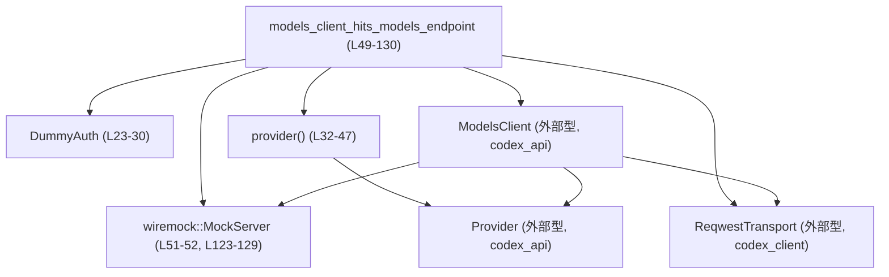
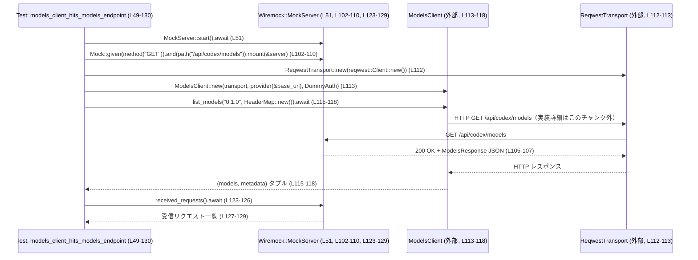

# codex-api/tests/models_integration.rs コード解説

## 0. ざっくり一言

- `ModelsClient::list_models` が実際に `/api/codex/models` エンドポイントへ HTTP GET を送ることを、モックサーバ (`wiremock`) を使って検証する非同期統合テストです（`models_integration.rs:L49-130`）。
- そのためのダミー認証プロバイダ `DummyAuth` と、`Provider` 構築ヘルパ関数 `provider` も同ファイル内で定義されています（`models_integration.rs:L23-47`）。

---

## 1. このモジュールの役割

### 1.1 概要

- このモジュールは、`codex_api::ModelsClient` が
  - 正しいベース URL（`/api/codex`）に対して  
  - `/models` エンドポイントへ
  - HTTP GET でリクエストを出し  
  - `ModelsResponse` の JSON を正しく受け取りパースできるか  
  を検証する統合テストを提供します（`models_integration.rs:L49-130`）。
- 認証は常に `None` を返す `DummyAuth` を用いて、認証無し環境での挙動をテストしています（`models_integration.rs:L23-30`）。

### 1.2 アーキテクチャ内での位置づけ

このテストモジュール内の主要コンポーネントと外部コンポーネントの関係は、概ね次のようになっています。



- テスト関数 `models_client_hits_models_endpoint` が中心で、`DummyAuth`・`provider`・`ModelsClient`・`ReqwestTransport`・`MockServer` を組み合わせて処理を構成しています（`models_integration.rs:L49-118`）。
- 実際の HTTP 通信は `ReqwestTransport` と `MockServer` の間で行われ、`ModelsClient` はその上位レイヤとして振る舞います（HTTP 呼び出し自体はこのチャンクには現れませんが、`received_requests` の検証から GET が送られていることが分かります: `models_integration.rs:L123-129`）。

### 1.3 設計上のポイント

- **責務の分割**
  - 認証: `DummyAuth` が `AuthProvider` トレイトを実装し、テスト用のダミー認証として切り出されています（`models_integration.rs:L23-30`）。
  - プロバイダ設定: `provider` 関数が `Provider` 構造体の初期化を一箇所にまとめています（`models_integration.rs:L32-47`）。
  - テストシナリオ: 実際の検証ロジックは `models_client_hits_models_endpoint` に集約されています（`models_integration.rs:L49-130`）。
- **状態管理**
  - すべての構造体インスタンス（`MockServer`, `Provider`, `ModelsClient` 等）はテスト関数内ローカルで生成され、共有可変状態はありません（`models_integration.rs:L51-118`）。
- **エラーハンドリング**
  - テストでは `.expect("...")` を使い、`list_models` の失敗や `received_requests` の取得失敗時にテストを即座にパニックさせる方針です（`models_integration.rs:L115-118`, `L123-126`）。
- **並行性**
  - `#[tokio::test]` により、非同期ランタイム上でテストを実行しますが、テスト内で並列タスクは起動しておらず、単一の非同期フローとして動作します（`models_integration.rs:L49-51`）。

---

## 2. 主要な機能一覧

- `DummyAuth`: `AuthProvider` を実装し、常に `None` を返すダミーの認証プロバイダです（`models_integration.rs:L23-30`）。
- `provider`: ベース URL から `Provider` 構造体を生成し、リトライ設定などを含めて返すヘルパ関数です（`models_integration.rs:L32-47`）。
- `models_client_hits_models_endpoint`: `ModelsClient::list_models` が `/api/codex/models` に GET を送り、レスポンスを正しく受け取るか検証する非同期統合テストです（`models_integration.rs:L49-130`）。

---

## 3. 公開 API と詳細解説

### 3.1 型一覧（構造体・列挙体など）

このファイル内で定義されている主な型は以下のとおりです。

| 名前 | 種別 | 役割 / 用途 | 根拠 |
|------|------|-------------|------|
| `DummyAuth` | 構造体 | `AuthProvider` トレイトを実装するダミーの認証プロバイダ。常にトークン無し (`None`) を返す | `models_integration.rs:L23-30` |

このファイル内で使用している主な外部型・トレイトも列挙します（定義自体はこのチャンクにはありません）。

| 名前 | 種別 | 役割 / 用途 | 使用箇所（根拠） |
|------|------|-------------|------------------|
| `AuthProvider` | トレイト (`codex_api`) | 認証トークンを提供するためのインターフェース。`DummyAuth` がこれを実装 | `models_integration.rs:L1`, `L26-30` |
| `ModelsClient` | 構造体 (`codex_api`) | モデル一覧 API (`list_models`) を呼び出すクライアント | `models_integration.rs:L2`, `L113-118` |
| `Provider` | 構造体 (`codex_api`) | ベース URL、ヘッダ、リトライ設定など API 呼び出し用の設定を保持 | `models_integration.rs:L3`, `L32-47`, `L113` |
| `RetryConfig` | 構造体 (`codex_api`) | リトライ回数や待機時間、リトライ対象の条件を保持 | `models_integration.rs:L4`, `L38-44` |
| `ReqwestTransport` | 構造体 (`codex_client`) | `reqwest::Client` をラップし、HTTP 通信を行うトランスポート層 | `models_integration.rs:L5`, `L112-113` |
| `ModelsResponse` | 構造体 (`codex_protocol::openai_models`) | モデル一覧レスポンス全体（`models: Vec<ModelInfo>`）を表す | `models_integration.rs:L10`, `L54-100` |
| `ModelInfo` | 構造体 | 個々のモデルのメタデータ（`slug`, `display_name`, 各種フラグなど）を保持 | `models_integration.rs:L8`, `L55-99` |
| `MockServer` | 構造体 (`wiremock`) | HTTP モックサーバ。本テストでは API エンドポイントをエミュレート | `models_integration.rs:L18`, `L51`, `L123-129` |

### 3.2 関数詳細

#### `impl AuthProvider for DummyAuth { fn bearer_token(&self) -> Option<String> }`

**概要**

- 認証トークンを返すメソッドですが、この実装では常に `None` を返し、「認証情報なし」の状態を表現します（`models_integration.rs:L26-29`）。

**引数**

| 引数名 | 型 | 説明 |
|--------|----|------|
| `&self` | `&DummyAuth` | 認証プロバイダ自身への不変参照。状態は持たないため常に同じ結果を返します。 |

**戻り値**

- `Option<String>`:  
  - この実装では必ず `None` を返します（`models_integration.rs:L27-29`）。

**内部処理の流れ**

1. 何も計算せずに `None` を返します（`models_integration.rs:L27-29`）。

**Examples（使用例）**

このファイル内では、`ModelsClient::new` の引数として利用されています（`models_integration.rs:L113`）。

```rust
// DummyAuth をそのまま渡すことで、認証無しクライアントを構築する例
let transport = ReqwestTransport::new(reqwest::Client::new());          // HTTP クライアントの準備
let provider = provider("http://example.com/api/codex");                // Provider の初期化
let client = ModelsClient::new(transport, provider, DummyAuth);         // 認証無しの ModelsClient
```

※ `ModelsClient::new` が何を内部で行うかはこのチャンクには現れません。

**Errors / Panics**

- エラーを返さず、パニックの可能性もありません（`models_integration.rs:L27-29`）。

**Edge cases（エッジケース）**

- 特筆すべきエッジケースはありません。常に `None` を返します。

**使用上の注意点**

- この実装を使用する場合、API が認証必須であれば認証エラーとなる可能性があります（挙動は `ModelsClient` 実装に依存し、このチャンクには現れません）。
- 認証を有効にしたい場合は、`bearer_token` が `Some(token)` を返す実装に差し替える必要があります。

---

#### `fn provider(base_url: &str) -> Provider`

**概要**

- 与えられたベース URL を持つ `Provider` 構造体を生成し、標準的なリトライ設定とヘッダを付与して返します（`models_integration.rs:L32-47`）。

**引数**

| 引数名 | 型 | 説明 |
|--------|----|------|
| `base_url` | `&str` | API のベース URL（例: `http://host/api/codex`）。`Provider.base_url` に格納されます（`models_integration.rs:L32-36`）。 |

**戻り値**

- `Provider`: `name`, `base_url`, `headers`, `retry`, `stream_idle_timeout` が設定された `Provider` インスタンスです（`models_integration.rs:L33-46`）。

**内部処理の流れ**

1. `Provider` 構造体リテラルを作成します（`models_integration.rs:L33-46`）。
2. `name` に `"test"` を設定します（`models_integration.rs:L34`）。
3. `base_url` に引数 `base_url` を `String` に変換して設定します（`models_integration.rs:L35`）。
4. `query_params` は `None` とし、追加のクエリパラメータは設定しません（`models_integration.rs:L36`）。
5. `headers` は空の `HeaderMap` で初期化します（`models_integration.rs:L37`）。
6. `retry` に `RetryConfig` を設定し、`max_attempts = 1`, `base_delay = 1ms`, `retry_429 = false`, `retry_5xx = true`, `retry_transport = true` とします（`models_integration.rs:L38-44`）。
7. `stream_idle_timeout` を 1 秒に設定します（`models_integration.rs:L45`）。

**Examples（使用例）**

このファイル内での使用例です（`models_integration.rs:L52`, `L113`）。

```rust
let server = MockServer::start().await;                          // Wiremock サーバ起動
let base_url = format!("{}/api/codex", server.uri());            // テスト用ベース URL 構築

let transport = ReqwestTransport::new(reqwest::Client::new());   // HTTP トランスポート作成
let client = ModelsClient::new(
    transport,
    provider(&base_url),                                         // provider() で Provider を生成
    DummyAuth,                                                   // ダミー認証
);
```

**Errors / Panics**

- 内部では `to_string` や `HeaderMap::new`、`Duration` 作成のみであり、通常はパニックしない処理です（`models_integration.rs:L34-45`）。
- エラー型を返しておらず、`Result` ではありません（`models_integration.rs:L32`）。

**Edge cases（エッジケース）**

- `base_url` が空文字列や不正な URL 形式であっても、そのまま `String` として格納されます。実際に HTTP リクエストが成功するかどうかは `ModelsClient` および `ReqwestTransport` の挙動に依存します（このチャンクには現れません）。

**使用上の注意点**

- `max_attempts` が 1 のため、HTTP エラーが発生してもリトライは行われません（`models_integration.rs:L39`）。
- 429（レートリミット）にはリトライしない一方で、5xx 系やトランスポートエラーにはリトライする設定です（`models_integration.rs:L41-43`）。
- テスト用の設定としては適切ですが、本番用設定に使うかどうかは用途に応じて検討が必要です。

---

#### `#[tokio::test] async fn models_client_hits_models_endpoint()`

**概要**

- `ModelsClient::list_models` が `/api/codex/models` エンドポイントへ HTTP GET を発行し、レスポンスを正しく受け取り・パースできることを検証する非同期統合テストです（`models_integration.rs:L49-130`）。

**引数**

- テスト関数であり、引数はありません（`models_integration.rs:L49-50`）。

**戻り値**

- 非同期関数ですが、戻り値型は省略されており、`()` が暗黙に返されます（`models_integration.rs:L49-50`）。

**内部処理の流れ（アルゴリズム）**

1. **モックサーバ起動とベース URL 準備**  
   - `MockServer::start().await` で HTTP モックサーバを起動します（`models_integration.rs:L51`）。
   - `server.uri()` からベース URI を取得し、`/api/codex` を付与して `base_url` とします（`models_integration.rs:L52`）。
2. **モックレスポンスの構築**  
   - `ModelsResponse` 構造体を組み立て、`models` に単一の `ModelInfo`（`slug = "gpt-test"`）を含めます（`models_integration.rs:L54-100`）。
3. **モックエンドポイントの設定**  
   - `Mock::given(method("GET")).and(path("/api/codex/models"))` で、`GET /api/codex/models` を受けたときに（`models_integration.rs:L102-103`）
   - `ResponseTemplate::new(200)` に `content-type: application/json` を付与し（`models_integration.rs:L105-106`）
   - `set_body_json(&response)` で先ほどの `ModelsResponse` を JSON として返すよう設定し（`models_integration.rs:L107`）
   - それを `server` に `mount` します（`models_integration.rs:L109`）。
4. **クライアントの構築**  
   - `ReqwestTransport::new(reqwest::Client::new())` で HTTP クライアントを作成します（`models_integration.rs:L112`）。
   - `provider(&base_url)` と `DummyAuth` を使って `ModelsClient::new` を呼び出し、`client` を構築します（`models_integration.rs:L113`）。
5. **list_models の呼び出し**  
   - `client.list_models("0.1.0", HeaderMap::new())` を `await` し（`models_integration.rs:L115-117`）
   - `.expect("models request should succeed")` でエラーならテスト失敗とします（`models_integration.rs:L117-118`）。
   - 戻り値のタプルから `models` を取り出します（`models_integration.rs:L115-116`）。
6. **レスポンス内容の検証**  
   - `models.len()` が 1 であること（`models_integration.rs:L120`）。
   - `models[0].slug` が `"gpt-test"` であることを検証します（`models_integration.rs:L121`）。
7. **HTTP リクエストの検証**  
   - `server.received_requests().await` でモックサーバが受け取ったリクエストを取得し（`models_integration.rs:L123-126`）
   - リクエストが 1 件のみであること（`models_integration.rs:L127`）。
   - そのメソッドが `GET` であること（`models_integration.rs:L128`）。
   - パスが `/api/codex/models` であることを検証します（`models_integration.rs:L129`）。

**Mermaid フロー図**

このテストの主要なデータフローをシーケンス図で示します。



**Errors / Panics**

- `MockServer::start().await` が失敗した場合の挙動は wiremock 側に依存しますが、このテストではエラーハンドリングを行っていません（`models_integration.rs:L51`）。
- `client.list_models(...)` が `Err` を返すと `.expect("models request should succeed")` によりテストがパニックします（`models_integration.rs:L115-118`）。
- `server.received_requests().await` が `Err` を返すと、同様に `.expect("should capture requests")` でパニックします（`models_integration.rs:L123-126`）。
- 受信リクエスト数やメソッド・パスが期待と異なる場合、`assert_eq!` によりテストが失敗します（`models_integration.rs:L120-121`, `L127-129`）。

**Edge cases（エッジケース）**

- `ModelsClient::list_models` が HTTP エラーやパースエラーで失敗した場合、このテストはエラーメッセージ付きでパニックします（`models_integration.rs:L115-118`）。  
  - エラーの詳細な型や条件は `ModelsClient` 実装に依存し、このチャンクには現れません。
- モックサーバがリクエストを受け取らなかった場合（例えば、誤った URL へリクエストしている場合）、`received_requests` の長さが 0 となり、`assert_eq!(received.len(), 1)` によりテストが失敗します（`models_integration.rs:L127`）。

**使用上の注意点**

- `#[tokio::test]` により、Tokio ランタイム上で非同期に実行されます。同期コンテキストからこの関数を直接呼び出すことは想定されていません（`models_integration.rs:L49-50`）。
- 実ネットワーク通信ではなく wiremock によるモックを使っているため、実サービスの挙動と異なる可能性があります。ここでは主にエンドポイント URL・メソッド・シリアライズ／デシリアライズを検証しています。
- テストは `expect` と `assert_eq!` に強く依存しており、失敗時には即座にパニックします。これはテストとしては一般的なパターンです。

### 3.3 その他の関数

このファイルには上記以外に関数・メソッド定義はありません。

---

## 4. データフロー

このモジュールで最も重要な処理シナリオは「モデル一覧取得 API の統合テスト」です（`models_integration.rs:L49-130`）。データフローは以下のように整理できます。

1. テストコードが `ModelsResponse` とその中の `ModelInfo` をローカルで構築します（`models_integration.rs:L54-100`）。
2. この `ModelsResponse` は wiremock の `ResponseTemplate::set_body_json` に渡され、HTTP レスポンスボディとして JSON にシリアライズされます（`models_integration.rs:L105-107`）。
3. `ModelsClient::list_models` が HTTP GET を発行し、上記 JSON を受け取ります（HTTP 呼び出しの実装はこのチャンク外ですが、`received_requests` の検証から GET が送られていることが確認できます: `models_integration.rs:L127-129`）。
4. `ModelsClient` はその JSON を再び `ModelsResponse` 型にデシリアライズし、そのうちモデル一覧部分 (`Vec<ModelInfo>`) をテスト側に返します（戻り値の具体的型は `(models, _)` というパターンから推測できますが、詳細はこのチャンクには現れません: `models_integration.rs:L115-116`）。
5. テストは `models` の内容と wiremock の `received_requests` の内容を検証します（`models_integration.rs:L120-121`, `L127-129`）。

---

## 5. 使い方（How to Use）

### 5.1 基本的な使用方法

このファイルはテストコードですが、`ModelsClient` をモックサーバと組み合わせて使う典型的なパターンを示しています。

```rust
#[tokio::test]                                    // 非同期テストとして実行
async fn example_models_list() -> Result<(), Box<dyn std::error::Error>> {
    let server = MockServer::start().await;       // モックサーバ起動
    let base_url = format!("{}/api/codex", server.uri());

    // モックレスポンスを準備（詳細は省略）

    // モックエンドポイントを設定
    Mock::given(method("GET"))
        .and(path("/api/codex/models"))
        .respond_with(ResponseTemplate::new(200))
        .mount(&server)
        .await;

    // ModelsClient の構築
    let transport = ReqwestTransport::new(reqwest::Client::new());
    let client = ModelsClient::new(transport, provider(&base_url), DummyAuth);

    // モデル一覧の取得
    let (models, _) = client
        .list_models("0.1.0", HeaderMap::new())
        .await?;                                   // エラーは呼び出し元に伝播

    println!("Models count: {}", models.len());
    Ok(())
}
```

この例は、このファイルのテストロジック（`models_integration.rs:L51-118`）をエラー伝播型に書き換えた形です。

### 5.2 よくある使用パターン

- **テスト用の認証無しクライアント**
  - `DummyAuth` を使い、認証を無効にした状態で API クライアントの基本動作を検証する（`models_integration.rs:L23-30`, `L113`）。
- **wiremock による統合テスト**
  - 実際の外部サービスを呼ばず、wiremock の `MockServer` に対して HTTP リクエストを送らせることで、クライアントの URL・HTTP メソッド・JSON シリアライズを検証する（`models_integration.rs:L51-52`, `L102-110`, `L123-129`）。

### 5.3 よくある間違い

このコードパターンから推測される、起こりやすい誤用例とその修正例です。

```rust
// 誤り例: ベース URL に "/api/codex" を付け忘れる
let base_url = server.uri(); // "/api/codex" が付いていない
let client = ModelsClient::new(transport, provider(&base_url), DummyAuth);

// -> この場合、list_models が "/models" のみを付加する実装であれば、
//    wiremock が待ち受ける "/api/codex/models" とパスが一致せず、
//    `received_requests()` が 0 件になってテストが失敗する可能性があります。
//    （URL の組み立てロジックはこのチャンクには現れませんが、
//     テストが "/api/codex/models" を期待していることは明らかです: L102-103, L129）

// 正しい例: このテストと同じように "/api/codex" を付加する
let base_url = format!("{}/api/codex", server.uri());
let client = ModelsClient::new(transport, provider(&base_url), DummyAuth);
```

```rust
// 誤り例: 非同期コンテキスト外で await しようとする（概念例）
fn bad_sync_test() {
    let (models, _) = client.list_models("0.1.0", HeaderMap::new()).await; // コンパイルエラー
}

// 正しい例: #[tokio::test] か、async fn + ランタイム上で実行する
#[tokio::test]
async fn good_async_test() {
    let (models, _) = client.list_models("0.1.0", HeaderMap::new()).await.unwrap();
}
```

### 5.4 使用上の注意点（まとめ）

- **非同期実行前提**  
  - `models_client_hits_models_endpoint` は `async fn` であり、Tokio ランタイム上で実行されます（`models_integration.rs:L49-51`）。
- **モックサーバ依存**  
  - テストは wiremock の `MockServer` の挙動に依存しており、実サービスとの相違は考慮していません（`models_integration.rs:L51-52`, `L102-110`, `L123-129`）。
- **エラー処理**  
  - `.expect` によりエラー時にはパニックする実装であるため、本番コードでは同様の書き方は避け、`Result` を伝播させるなど別のエラーハンドリングが必要です（`models_integration.rs:L115-118`, `L123-126`）。

---

## 6. 変更の仕方（How to Modify）

### 6.1 新しい機能を追加する場合（例: 他のエンドポイントの統合テスト）

このファイルを参考に、別の API エンドポイントの統合テストを追加する場合の典型的なステップです。

1. **モックレスポンス型の決定**
   - 新しいエンドポイントに対応するレスポンス型（例: `SomeOtherResponse`）を `codex_protocol` からインポートします。
   - このチャンクには他エンドポイント用の型は現れていないため、どの型を使うかは別途確認が必要です。
2. **モックレスポンスの構築**
   - 現在の `ModelsResponse` と同様に、レスポンスの構造体インスタンスを組み立てます（`models_integration.rs:L54-100` を参考）。
3. **モックエンドポイントの設定**
   - `Mock::given(method("GET")).and(path("..."))` の `path` を対象エンドポイントに合わせて変更します（`models_integration.rs:L102-103` を参考）。
4. **クライアントメソッドの呼び出し**
   - `ModelsClient` あるいは別のクライアント型が提供する新しいメソッドを `await` で呼び出します（`models_integration.rs:L115-117` を参考）。
5. **レスポンスと受信リクエストの検証**
   - `assert_eq!` などで、レスポンスの内容および `received_requests` のメソッド・パスを検証します（`models_integration.rs:L120-121`, `L127-129`）。

### 6.2 既存の機能を変更する場合

`models_client_hits_models_endpoint` の挙動を変更したい場合に注意すべき点です。

- **影響範囲**
  - この関数自体はテストであり、他コードから呼ばれていませんが、`ModelsClient::list_models` の API 仕様が変わると、このテストも更新が必要になります（例: 戻り値のタプル構造が変わる場合: `models_integration.rs:L115-116`）。
- **契約（前提条件）**
  - このテストは「`/api/codex/models` に GET を送る」ことを契約として前提にしており（`models_integration.rs:L102-103`, `L127-129`）、エンドポイントやメソッドが変わる場合はテストの期待値も変更する必要があります。
- **関連するテスト**
  - 同様のパターンの統合テストが他ファイルにもある場合、それらも合わせて更新する必要があります（このチャンクには他ファイルは現れません）。

---

## 7. 関連ファイル

このモジュールと密接に関係するであろうファイル・ディレクトリを、コード中のインポートを根拠に列挙します。具体的なファイルパスはこのチャンクには現れないため、「不明」と明記します。

| パス | 役割 / 関係 | 根拠 |
|------|------------|------|
| `codex_api` 内の `AuthProvider` 定義ファイル（パス不明） | `DummyAuth` が実装しているトレイト | `models_integration.rs:L1`, `L26-30` |
| `codex_api` 内の `ModelsClient` 実装ファイル（パス不明） | テスト対象となるクライアント | `models_integration.rs:L2`, `L113-118` |
| `codex_api` 内の `Provider` / `RetryConfig` 定義ファイル（パス不明） | API 呼び出し設定やリトライ制御を提供 | `models_integration.rs:L3-4`, `L32-47` |
| `codex_client` 内の `ReqwestTransport` 実装ファイル（パス不明） | HTTP トランスポート層を提供 | `models_integration.rs:L5`, `L112-113` |
| `codex_protocol::openai_models` / `codex_protocol::config_types` の定義ファイル（パス不明） | `ModelsResponse`, `ModelInfo`, `ReasoningEffort` など API プロトコル型を定義 | `models_integration.rs:L6-14`, `L54-100` |
| `wiremock` クレート内部（パス不明） | モック HTTP サーバ `MockServer` とマッチャ・レスポンステンプレート | `models_integration.rs:L17-21`, `L51-52`, `L102-110`, `L123-129` |

このチャンクには、これらの型・トレイトの実装詳細は含まれていないため、具体的な挙動（タイムアウト処理やリトライアルゴリズムなど）はコードからは分かりません。
