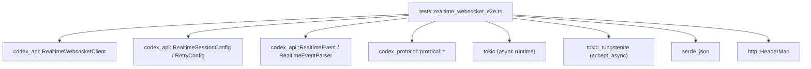
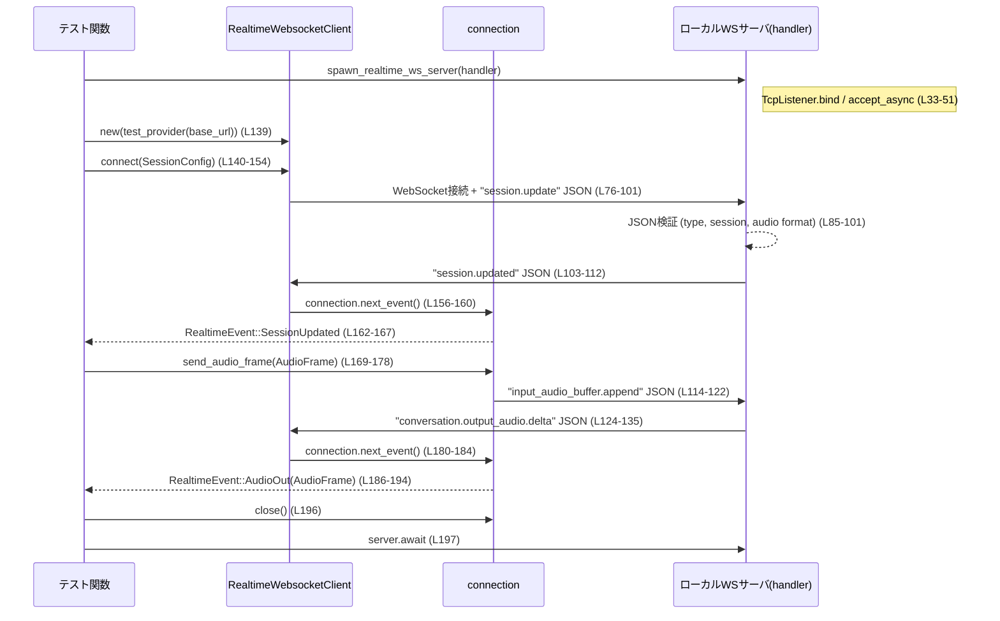

# codex-api/tests/realtime_websocket_e2e.rs コード解説

## 0. ざっくり一言

ローカルで WebSocket サーバを立て、`RealtimeWebsocketClient` とのやりとりを実際に行いながら、

- セッション確立
- オーディオ送受信
- 再接続／切断
- イベントパーサ（V1 / RealtimeV2）

といった挙動を **エンドツーエンドで検証する非同期テスト集**です  
（`codex-api/tests/realtime_websocket_e2e.rs` 全体）。

---

## 1. このモジュールの役割

### 1.1 概要

このテストモジュールは、`codex_api::RealtimeWebsocketClient` を使ったリアルタイム WebSocket 通信の挙動を検証することで、次を確認します。

- クライアントが送信する JSON メッセージのフォーマット（例: `session.update` や `input_audio_buffer.append`）  
  （`codex-api/tests/realtime_websocket_e2e.rs:L76-101, 114-122`）
- サーバからの JSON メッセージが `RealtimeEvent` に正しくパースされること  
  （`RealtimeEvent::SessionUpdated`, `AudioOut`, `HandoffRequested` 等, L156-167, 180-194, 526-539）
- 接続リトライや切断検知、未定義イベントの無視など、運用上重要な挙動  
  （L200-275, 363-404, 406-475）

### 1.2 アーキテクチャ内での位置づけ

このファイルは「テスト層」に位置し、実際の API 実装（`codex_api`）とプロトコル定義（`codex_protocol`）に依存しています。ローカル WebSocket サーバは `tokio_tungstenite` を用いて実装されます。



### 1.3 設計上のポイント

- **ローカル WebSocket サーバを共通化**  
  - `spawn_realtime_ws_server` で 1 接続だけ受け付けるテスト用サーバを起動（L26-55）。
- **Provider のテスト用設定**  
  - `test_provider` でリトライ間隔やタイムアウトを短くした `Provider` を生成し、テストを高速化（L57-71）。
- **非同期並行実行**  
  - 各テストは `#[tokio::test]` により非同期で実行され、サーバ側は `tokio::spawn` で並列タスクとして動作（L42-52, 74, 200, 277 など）。
  - `tokio::join!` と `tokio::time::timeout` を組み合わせ、`send_audio_frame` と `next_event` の同時呼び出しがブロックしないことを検証（L330-349）。
- **エラー処理方針**  
  - テスト内では異常系はすべて `panic!` / `expect()` / `assert_eq!` で即座に失敗させる設計（例: L33-40, 80-83, 155-160）。

---

## 2. 主要な機能一覧（テストシナリオ）

- WebSocket セッション確立とオーディオ入出力の E2E 検証  
  (`realtime_ws_e2e_session_create_and_event_flow`, L74-198)
- WebRTC サイドバンド接続のリトライ（サーバ起動待ち）の検証  
  (`realtime_ws_connect_webrtc_sideband_retries_join_until_server_is_available`, L200-275)
- `next_event` 待機中に `send_audio_frame` を呼んでもブロックしないことの検証  
  (`realtime_ws_e2e_send_while_next_event_waits`, L277-361)
- サーバ切断時に「切断」が 1 回だけ通知され、それ以降は常に `None` を返すことの検証  
  (`realtime_ws_e2e_disconnected_emitted_once`, L363-404)
- 不明なテキストイベント（未サポートな `type`）を無視し、後続の既知イベントのみを返すことの検証  
  (`realtime_ws_e2e_ignores_unknown_text_events`, L406-475)
- Realtime V2 パーサによる `function_call` イベントからの `HandoffRequested` 生成の検証  
  (`realtime_ws_e2e_realtime_v2_parser_emits_handoff_requested`, L477-543)
- テスト用 WebSocket サーバ生成ユーティリティ  
  (`spawn_realtime_ws_server`, L26-55)
- テスト用 Provider 生成ユーティリティ  
  (`test_provider`, L57-71)

---

## 3. 公開 API と詳細解説

このファイル自体はライブラリ API を公開していませんが、**テストがどのように `codex_api` の API を利用しているか**が、このモジュールの核心です。

### 3.1 型一覧（構造体・列挙体など）

#### このファイル内で定義される型

| 名前 | 種別 | 役割 / 用途 | 根拠 |
|------|------|-------------|------|
| `RealtimeWsStream` | 型エイリアス | テスト用 WebSocket サーバ側で使用する `tokio_tungstenite::WebSocketStream<TcpStream>` の別名。`spawn_realtime_ws_server` のハンドラ引数の型に利用。 | `codex-api/tests/realtime_websocket_e2e.rs:L24` |

#### 他モジュールから利用している主な型（定義はこのチャンク外）

| 名前 | 種別 | 役割 / 用途 | 定義位置（推定） |
|------|------|-------------|------------------|
| `Provider` | 構造体 | API ベース URL、ヘッダ、リトライ設定等を保持し、`RealtimeWebsocketClient` の接続先を指定する（L57-71, 238-240）。 | `codex_api` クレート内（正確なファイルパスは本チャンクからは不明） |
| `RetryConfig` | 構造体 | 接続リトライ回数・待ち時間・対象エラーを指定（L63-69, 239-240）。 | 同上 |
| `RealtimeWebsocketClient` | 構造体 | WebSocket を用いたリアルタイムセッションのクライアント。`new`, `connect`, `connect_webrtc_sideband` 等を提供（L139-154, 242-258, 313-328 など）。 | 同上 |
| `RealtimeSessionConfig` | 構造体 | セッションの instructions, model, session_id, parser モード, 音声モードなどを指定（L142-149, 245-252, 316-323, 383-390, 446-453, 512-519）。 | 同上 |
| `RealtimeSessionMode` | 列挙体 | セッションモード（例: `Conversational`）を表現（L147, 250, 321, 388, 451, 517）。 | 同上 |
| `RealtimeEventParser` | 列挙体 | WebSocket テキストメッセージを `RealtimeEvent` に変換するパーサ種別（V1 / RealtimeV2）（L146, 249, 320, 387, 450, 516）。 | 同上 |
| `RealtimeEvent` | 列挙体 | `SessionUpdated`, `AudioOut`, `HandoffRequested` 等の高レベルイベント表現。`next_event` の戻り値（L156-167, 180-194, 260-271, 350-357, 460-471, 526-539）。 | 同上 |
| `RealtimeAudioFrame` | 構造体 | 音声フレーム（base64 文字列 + サンプルレート等）を表現。送信 / 受信両方に利用（L169-176, 187-193）。 | 同上 |
| `RealtimeHandoffRequested` | 構造体 | V2 パーサが `function_call` 項目から生成するハンドオフ要求イベントの内容（L533-538）。 | `codex_protocol::protocol` 内（正確なパスは不明） |
| `RealtimeVoice` | 列挙体 | 使用するボイス指定（`Cove`, `Marin` 等）（L148, 251, 322, 389, 452, 518）。 | `codex_protocol::protocol` 内 |

### 3.2 関数詳細（7 件）

#### 1. `spawn_realtime_ws_server<Handler, Fut>(handler: Handler) -> (String, tokio::task::JoinHandle<()>)`

**概要**

1 接続だけを受け付けるテスト用 WebSocket サーバを非同期に起動し、その接続に対する処理を `handler` に委譲します。戻り値は接続 URL（`"127.0.0.1:PORT"` 形式の文字列）とサーバタスクの `JoinHandle` です（L26-55）。

**引数**

| 引数名 | 型 | 説明 |
|--------|----|------|
| `handler` | `Handler`（`FnOnce(RealtimeWsStream) -> Fut + Send + 'static`） | 受信した WebSocket ストリームを受け取り、必要なテスト用シナリオを実行する非同期関数（L29-31, 47-51）。 |

**戻り値**

- `String`: バインドされたローカルアドレス（`listener.local_addr().to_string()`）（L37-40）。
- `tokio::task::JoinHandle<()>`: サーバ処理を実行しているタスクのハンドル（L42-52, 54）。

**内部処理の流れ**

1. `TcpListener::bind("127.0.0.1:0")` で任意の空きポートにバインド（L33-36）。
2. `listener.local_addr()` で実際のポートを取得し、文字列化（L37-40）。
3. `tokio::spawn` で新しいタスクを起動し、その中で:
   - `listener.accept().await` により 1 接続を待機（L42-46）。
   - 接続された `TcpStream` を `accept_async` に渡し、WebSocket ハンドシェイクを完了（L47-50）。
   - 得られた `WebSocketStream` を `handler(ws).await` に渡してシナリオ処理（L51）。
4. 呼び出し元に `(addr, server_handle)` を返す（L54）。

**Examples（使用例）**

テスト内での実際の使用例（L76-136）を簡略化したものです。

```rust
// テスト用: 最初のメッセージを受信して確認し、その後応答を返す
let (addr, server) = spawn_realtime_ws_server(|mut ws: RealtimeWsStream| async move {
    // クライアントからの最初の JSON メッセージをテキストで取得
    let first = ws.next().await.unwrap().unwrap().into_text().unwrap();

    // JSON をパースして内容確認
    let first_json: serde_json::Value = serde_json::from_str(&first).unwrap();
    assert_eq!(first_json["type"], "session.update");

    // session.updated を送り返す
    ws.send(Message::Text(
        serde_json::json!({
            "type": "session.updated",
            "session": { "id": "sess_mock" }
        })
        .to_string()
        .into(),
    ))
    .await
    .unwrap();
}).await;

// addr を使って RealtimeWebsocketClient を接続する…（後述）
```

**Errors / Panics**

- `TcpListener::bind` 失敗時に `panic!("failed to bind test websocket listener: {err}")`（L33-36）。
- `listener.local_addr` 失敗時に `panic!("failed to read local websocket listener address: {err}")`（L37-40）。
- `listener.accept` や `accept_async` 失敗時も `panic!`（L42-50）。
- テストコードなので、これらの `panic!` は「テスト失敗」を意味します。

**エッジケース**

- 2 回以上接続が試みられた場合:
  - サーバタスクは 1 回 `accept()` した後終了するため、2 回目以降のクライアント接続は受け付けられません（L42-51）。
- 接続が一度も行われない場合:
  - サーバタスクは `accept().await` でブロックし続け、テストはハングする可能性があります。

**使用上の注意点**

- このユーティリティは「1 接続だけを扱うこと」を前提とした設計です。複数接続を扱いたい場合はループを追加するなどの変更が必要です。
- 非同期ランタイムとして `tokio` を前提としており、テスト関数側も `#[tokio::test]` で実行される必要があります。

---

#### 2. `realtime_ws_e2e_session_create_and_event_flow()`

**概要**

`RealtimeWebsocketClient::connect`（V1 パーサ）によるセッション確立から、

1. クライアント初回送信メッセージの内容
2. サーバからの `session.updated` → `RealtimeEvent::SessionUpdated`
3. クライアントによる音声送信 → WebSocket テキスト `input_audio_buffer.append`
4. サーバからの `conversation.output_audio.delta` → `RealtimeEvent::AudioOut`

までの一連の E2E フローを検証します（L74-198）。

**引数**

- 引数はありません。`#[tokio::test]` によりテストフレームワークから直接呼び出されます（L74-75）。

**戻り値**

- 戻り値は `()` です。途中の失敗は `expect` / `assert_eq!` によるパニックで表現されます。

**内部処理の流れ**

1. `spawn_realtime_ws_server` でサーバを起動。サーバ側シナリオ（L76-136）:
   - クライアントから 1 通目のメッセージを受信し JSON パース（L77-85）。
   - `type == "session.update"` であることと、`session.type == "quicksilver"` や音声フォーマットが `"audio/pcm"`, `rate == 24000` であること等を検証（L85-101）。
   - `session.updated` メッセージを送信（L103-112）。
   - 2 通目のクライアントメッセージが `input_audio_buffer.append` であることを確認（L114-122）。
   - `conversation.output_audio.delta` メッセージを送信（L124-135）。
2. クライアント側で `RealtimeWebsocketClient::new` と `test_provider` によりクライアントを構築（L139-154, 57-71）。
3. `client.connect(...)` を呼び出し、`RealtimeSessionConfig` を渡して WebSocket 接続を確立（L139-154）。
4. `connection.next_event().await` でサーバからの `session.updated` が `RealtimeEvent::SessionUpdated` として届くことを検証（L156-167）。
5. `connection.send_audio_frame(...)` で音声フレームを送信（L169-178）。
6. 再度 `connection.next_event().await` を呼び、`RealtimeEvent::AudioOut` が正しい内容で得られることを検証（L180-194）。
7. `connection.close().await` と `server.await` によりクリーンアップ（L196-197）。

**Examples（使用例）**

このテスト自体が、「最小限のセッション接続と音声送受信」の使用例になっています（L139-178）。

```rust
// Provider の準備
let client = RealtimeWebsocketClient::new(test_provider(format!("http://{addr}")));

// セッション設定
let connection = client
    .connect(
        RealtimeSessionConfig {
            instructions: "backend prompt".to_string(),
            model: Some("realtime-test-model".to_string()),
            session_id: Some("conv_123".to_string()),
            event_parser: RealtimeEventParser::V1,
            session_mode: RealtimeSessionMode::Conversational,
            voice: RealtimeVoice::Cove,
        },
        HeaderMap::new(),
        HeaderMap::new(),
    )
    .await
    .unwrap();

// セッション更新イベントを受信
let created = connection.next_event().await.unwrap().unwrap();

// 音声フレーム送信
connection
    .send_audio_frame(RealtimeAudioFrame {
        data: "AQID".to_string(),
        sample_rate: 48000,
        num_channels: 1,
        samples_per_channel: Some(960),
        item_id: None,
    })
    .await
    .unwrap();
```

**Errors / Panics**

- サーバ側・クライアント側とも、想定と異なるメッセージ形式や接続失敗時には `expect` / `assert_eq!` によりパニック（多数: L77-83, 84-101, 155-160, 169-178, 180-184 など）。
- `connection.close` や `server.await` も失敗時には `expect("close")`, `expect("server task")` でパニック（L196-197）。

**エッジケース**

- サーバが `session.updated` を送らない場合:
  - クライアント側 `next_event().await` がタイムアウトせず待ち続ける可能性があります（ここではタイムアウトは設定していません）。
- `conversation.output_audio.delta` のフィールドが欠落した場合:
  - どのようなエラーになるかは `RealtimeEventParser` の実装に依存し、このチャンクからは分かりません。

**使用上の注意点**

- このテストから、`connect` 直後に **少なくとも 1 回 `next_event` を呼び出し、`SessionUpdated` を処理する** ことが想定されていると読み取れます（L156-167）。
- 音声送信後に `AudioOut` が返ってくることを前提にする場合、モデル・設定に依存した挙動であるため、本番環境ではタイムアウト等の考慮が必要です（テストでは未考慮）。

---

#### 3. `realtime_ws_connect_webrtc_sideband_retries_join_until_server_is_available()`

**概要**

`RealtimeWebsocketClient::connect_webrtc_sideband` が、初期接続失敗時にリトライし、遅れて起動したサーバに接続できることを検証します（L200-275）。WebRTC サイドバンド接続の「再試行挙動」のテストです。

**引数 / 戻り値**

- 引数・戻り値ともにありません（テスト関数、L200-201）。

**内部処理の流れ**

1. `TcpListener::bind("127.0.0.1:0")` でポートを確保し、アドレス `addr` を取得してから `drop` で一旦閉じる（L202-205）。  
   → これにより **クライアントからの最初の接続試行時にはサーバが存在しない状態** を意図的に作ります。
2. 別タスクでサーバを起動（L206-236）:
   - 20ms スリープ後、同じ `addr` で再度 `TcpListener::bind`（L207-208）。
   - 1 接続を受け付け WebSocket ハンドシェイク（L209-210）。
   - クライアントからの `session.update` を受信・検証（L212-224）。
   - `session.updated` を返す（L226-235）。
3. `test_provider` で Provider を作成し（L238-240）、リトライ設定を調整:
   - `max_attempts = 1`（元から 1、L63-65 / L239）。
   - `base_delay = 100ms` に変更（L240）。
4. `RealtimeWebsocketClient::connect_webrtc_sideband` を呼び出し、`RealtimeSessionConfig` と WebRTC ID `"rtc_test"` を渡す（L242-258）。
5. `connection.next_event().await` を呼び、`RealtimeEvent::SessionUpdated` が得られることを確認（L260-271）。
6. `connection.close` と `server.await` で終了処理（L273-274）。

**Errors / Panics**

- サーバ起動タイミングよりも早く全リトライが尽きてしまう場合、このテストは `expect("connect on retry")` でパニックします（L257-258）。
- 実際のリトライ回数・挙動は `RealtimeWebsocketClient` 側の実装に依存します（本チャンクには現れません）。

**エッジケース**

- 環境が極端に遅く、20ms 以内にクライアントが全てのリトライを使い切る可能性（非常に低いですが）:
  - その場合テストは不安定になる可能性があります。ここでは固定の sleep と delay に依存しています（L207-208, 239-240）。
- `max_attempts` が 1 のままなのに「リトライ」を期待している点:
  - 実装によっては「初回＋リトライ 1 回」で 2 回試行する可能性がありますが、仕様はコードからは確定できません（`RealtimeWebsocketClient` 実装は本チャンクにないため）。

**使用上の注意点**

- 本テストから、**接続確立処理がネットワークエラーに対して再試行を行うこと**が示唆されますが、正確なポリシー（どのエラーで再試行するか）は `RetryConfig` とクライアント実装に依存し、このチャンクだけでは判断できません。

---

#### 4. `realtime_ws_e2e_send_while_next_event_waits()`

**概要**

`connection.next_event()` 待機中に `connection.send_audio_frame()` を同時に呼び出しても、送信側がブロックせずに完了することを検証します（L277-361）。Rust の非同期並行処理（`tokio::join!`）を前提とした **スレッドセーフな設計かどうか**を検証するテストです。

**内部処理の流れ**

1. `spawn_realtime_ws_server` でサーバを起動し、サーバ側では:
   - 1 通目: `session.update` を受信（L280-288）。
   - 2 通目: `input_audio_buffer.append` を受信（L290-298）。
   - その後、`session.updated` を送信（L300-309）。
2. クライアント側で通常どおり `connect` して `connection` を取得（L313-328）。
3. `tokio::join!` を使って、次の 2 つの Future を同時に待機（L330-345）。
   - (1) `tokio::time::timeout(200ms, connection.send_audio_frame(...))`
   - (2) `connection.next_event()`
4. `send_result` について:
   - `timeout` の結果が `Ok`（タイムアウトしない）であり、
   - かつ `send_audio_frame` 自体も `Ok(())` を返すことを `expect` で確認（L347-349）。
5. `next_result` について:
   - `RealtimeEvent::SessionUpdated` が期待どおり得られることを検証（L350-357）。
6. `connection.close`, `server.await` でクリーンアップ（L359-360）。

**並行性のポイント**

- `tokio::join!` により、**同じ `connection` に対する 2 つの非同期操作を同時に進行**させています（L330-345）。
- Rust の所有権／借用規則により、このコードがコンパイルされていることから、`send_audio_frame` と `next_event` のシグネチャ・内部実装は **同時呼び出しが安全になるよう設計されている**と推測されますが、具体的な仕組み（チャンネル分離、内部ロックなど）は本チャンクには現れません。

**エラー / パニック**

- `send_audio_frame` が 200ms 以内に完了しない場合、`timeout` は `Err(Elapsed)` を返し、`expect("send should not block on next_event")` によりパニックします（L330-349）。
- `next_event` が失敗した場合も `expect` によりパニックします（L350-351）。

**エッジケース**

- ネットワークやスケジューラが極端に遅い場合:
  - `send_audio_frame` が 200ms を超えてしまい、テストが失敗する可能性があります。
- `connection` の内部が単一の `Mutex` に依存している設計だった場合:
  - こうした同時呼び出しはデッドロックや過度な待ち時間の原因となり得ますが、このテストはそうした設計になっていないことを間接的に検証しています。

**使用上の注意点**

- 本テストから、アプリケーションコードにおいても「受信待ち (`next_event`) と送信 (`send_audio_frame`) を同時に行う」設計がサポートされていると解釈できます。
- 実運用では、このような並行呼び出しを行う場合でも、過度なタイムアウト値やリトライループに注意する必要があります。

---

#### 5. `realtime_ws_e2e_disconnected_emitted_once()`

**概要**

サーバが WebSocket `Close` フレームを送信して切断した場合、クライアントの `next_event()` が:

1. 最初の呼び出しで `Ok(None)` を返し、
2. 2 回目以降も `None` を返し続け、

「切断イベント」が重複して通知されないことを検証します（L363-404）。

**内部処理の流れ**

1. サーバ側:
   - 最初に `session.update` を受信して検証（L366-374）。
   - その直後に `ws.send(Message::Close(None))` で WebSocket を閉じる（L376）。
2. クライアント側:
   - 通常どおり `connect` して `connection` を取得（L380-395）。
   - `connection.next_event().await` の結果 `first` が `None` であることを検証（L397-399）。
   - 再度 `connection.next_event().await` を呼び出し、`second` も `None` であることを検証（L400-401）。
3. `connection.close()` は呼び出しておらず、サーバタスクの終了を `server.await` で待つのみ（L403）。

**エラー / パニック**

- `next_event()` がエラーを返した場合（例えば I/O エラー等）、`expect("next event")` によりパニックします（L397-401）。
- `first` や `second` が `Some(_)` の場合、`assert_eq!(first, None)` 等でテスト失敗となります（L397-401）。

**エッジケース**

- `next_event` が「切断」をエラーとして返す設計だった場合:
  - このテストは失敗し、設計変更もしくはテストの期待値変更が必要になります。
- 切断直前にサーバから別のイベントが送信されていた場合の挙動:
  - このテストでは考慮しておらず、実際の順序は実装次第です。

**使用上の注意点**

- このテストから、アプリケーションコード側では「`next_event` が `Ok(None)` を返した時点で接続終了」とみなし、その後の `next_event` 呼び出しは同じ `None` を返すだけであると期待できます。

---

#### 6. `realtime_ws_e2e_ignores_unknown_text_events()`

**概要**

サーバから未知の `type` を持つ JSON テキストメッセージ（例: `"response.created"`）が送信された場合、`RealtimeEventParser::V1` がそれを無視し、後続の既知イベントだけを `next_event` 経由で返すことを検証します（L406-475）。

**内部処理の流れ（要約）**

1. サーバ側が `session.update` を受信後（L409-417）、未知イベント `response.created` を送信（L419-428）、続いて `session.updated` を送信（L430-439）。
2. クライアント側は `connect` 後、最初の `next_event().await` が `RealtimeEvent::SessionUpdated { session_id: "sess_after_unknown", .. }` になることを検証（L460-471）。
   - ここで `response.created` は `RealtimeEvent` として露出していないことが確認されます。
3. 接続を閉じ、サーバタスクを待機（L473-474）。

**使用上の注意点**

- 本挙動により、「ライブラリが知らないイベント種別」を追加しても既存クライアントが直ちに壊れない耐性があることが分かります。
- ただし、未知イベントをログに出すかどうかなどの観測性については、本チャンクからは分かりません（ログ出力は記述されていません）。

---

#### 7. `realtime_ws_e2e_realtime_v2_parser_emits_handoff_requested()`

**概要**

`RealtimeEventParser::RealtimeV2` が、`conversation.item.done` かつ `type: "function_call"` の項目を `RealtimeEvent::HandoffRequested` に変換することを検証します（L477-543）。特に `call_id`, `id`, `arguments` からそれぞれ適切なフィールドへマッピングされるかをテストしています。

**内部処理の流れ**

1. サーバ側:
   - `session.update` を受信して検証（L480-488）。
   - その後、以下の JSON を送信（L490-505）:

     ```json
     {
       "type": "conversation.item.done",
       "item": {
         "id": "item_123",
         "type": "function_call",
         "name": "background_agent",
         "call_id": "call_123",
         "arguments": "{\"prompt\":\"delegate now\"}"
       }
     }
     ```

2. クライアント側:
   - `event_parser: RealtimeEventParser::RealtimeV2` を指定して `connect`（L512-517）。
   - `connection.next_event().await` が次の `RealtimeEvent::HandoffRequested` を返すことを検証（L526-539）:

     ```rust
     RealtimeEvent::HandoffRequested(RealtimeHandoffRequested {
         handoff_id: "call_123".to_string(),
         item_id: "item_123".to_string(),
         input_transcript: "delegate now".to_string(),
         active_transcript: Vec::new(),
     })
     ```

   - 特に `arguments` の JSON 文字列から `"prompt"` が `input_transcript` として抽出されている点が確認できます（L533-537）。

3. 接続を閉じ、サーバタスクを待機（L541-542）。

**エッジケース**

- `arguments` が JSON としてパース不能な文字列だった場合の挙動は、このテストからは分かりません。
- `type` や `name` が異なる `function_call` の扱いも、このチャンクではテストされていません。

**使用上の注意点**

- V2 パーサを使うと、特定の `function_call` を「バックグラウンドエージェントへのハンドオフ要求」として扱う高レベル API が得られることがこのテストから分かります。
- 実際のアプリケーションでは、この `HandoffRequested` をトリガに別の処理系へ制御を委譲する設計が想定されますが、その詳細は別モジュールになります。

---

### 3.3 その他の関数

| 関数名 | 役割（1 行） | 根拠 |
|--------|--------------|------|
| `test_provider(base_url: String) -> Provider` | テスト用に、短いリトライ間隔とシンプルな設定を持つ `Provider` を生成するユーティリティ。`name: "test"`, `retry.max_attempts: 1`, `base_delay: 1ms`, `stream_idle_timeout: 5s` などをセット（L57-71）。 | `codex-api/tests/realtime_websocket_e2e.rs:L57-71` |

---

## 4. データフロー

ここでは代表的なシナリオとして  
**`realtime_ws_e2e_session_create_and_event_flow`（L74-198）** のデータフローを示します。

### 4.1 セッション確立とオーディオ入出力のシーケンス



**要点**

- クライアントは接続直後に `session.update` を送信し、サーバの `session.updated` を `RealtimeEvent::SessionUpdated` として受け取ります。
- オーディオ送信は `send_audio_frame` → WebSocket テキスト `input_audio_buffer.append` に変換されます。
- サーバは `conversation.output_audio.delta` を送ることで、クライアント側に `RealtimeEvent::AudioOut` を発生させます。

---

## 5. 使い方（How to Use）

このファイルはテストですが、**`RealtimeWebsocketClient` の代表的な使い方**としても参考になります。

### 5.1 基本的な使用方法

1. `Provider` を用意する（ここでは `test_provider` を使用、L57-71）。
2. `RealtimeWebsocketClient::new` でクライアントを生成。
3. `connect` または `connect_webrtc_sideband` でセッションを開始。
4. `next_event` と `send_audio_frame` を組み合わせてイベントループを構築。
5. セッション終了時に `close` を呼ぶ。

簡略化した例:

```rust
// 1. Provider を用意
let provider = test_provider("http://127.0.0.1:12345".to_string());

// 2. クライアント生成
let client = RealtimeWebsocketClient::new(provider);

// 3. セッション開始
let mut connection = client
    .connect(
        RealtimeSessionConfig {
            instructions: "backend prompt".to_string(),
            model: Some("realtime-test-model".to_string()),
            session_id: Some("conv_123".to_string()),
            event_parser: RealtimeEventParser::V1,
            session_mode: RealtimeSessionMode::Conversational,
            voice: RealtimeVoice::Cove,
        },
        HeaderMap::new(),
        HeaderMap::new(),
    )
    .await?;

// 4. イベント受信
if let Some(event) = connection.next_event().await? {
    // RealtimeEvent::SessionUpdated などを処理
}

// 5. 音声送信
connection
    .send_audio_frame(RealtimeAudioFrame {
        data: "AQID".to_string(),      // base64 等
        sample_rate: 48000,
        num_channels: 1,
        samples_per_channel: Some(960),
        item_id: None,
    })
    .await?;

// 6. 終了
connection.close().await?;
```

### 5.2 よくある使用パターン

- **V1 と V2 のパーサ切り替え**  
  - V1: 通常の `SessionUpdated` や `AudioOut` などを扱う（L146, 320, 387, 450）。
  - V2 (`RealtimeEventParser::RealtimeV2`): `function_call` からの `HandoffRequested` を扱う高度なシナリオ向け（L249, 516, 526-539）。

- **WebRTC サイドバンド接続**  
  - `connect_webrtc_sideband` に `rtc_id`（ここでは `"rtc_test"`）を渡すことで、WebRTC 制御用のサイドバンドチャネルを張る（L244-256）。

### 5.3 よくある間違い

```rust
// 誤り例: connect 後すぐに send_audio_frame だけを呼んでいる
let connection = client.connect(config, HeaderMap::new(), HeaderMap::new()).await?;
connection.send_audio_frame(frame).await?;  // SessionUpdated を待っていない

// 正しい例: 最初の SessionUpdated を受け取ってから送信する
let connection = client.connect(config, HeaderMap::new(), HeaderMap::new()).await?;
if let Some(RealtimeEvent::SessionUpdated { .. }) = connection.next_event().await? {
    connection.send_audio_frame(frame).await?;
}
```

テスト `realtime_ws_e2e_session_create_and_event_flow` では、実際に `SessionUpdated` を受信してから音声を送信しており（L156-178）、この順序を前提としていることが分かります。

### 5.4 使用上の注意点（まとめ）

- **非同期前提**  
  - すべて `async` / `.await` ベースであり、`tokio` 等のランタイム内で実行する必要があります（`#[tokio::test]` を参照, L74, 200, 277, 363, 406, 477）。
- **並行呼び出し**  
  - `send_audio_frame` と `next_event` を同時に呼び出せる設計であることが `realtime_ws_e2e_send_while_next_event_waits` から分かります（L330-349）。  
    ただし本番コードでより複雑な並行パターンを組む際は、内部実装に応じた検証が必要です。
- **切断処理**  
  - `next_event` が `Ok(None)` を返したら接続終了とみなすのが自然です（L397-401）。
- **未知イベントの扱い**  
  - V1 パーサでは未知のイベントタイプが無視されるため（L419-428, 460-471）、新しいイベントを追加しても既存コードがエラーになりにくい設計です。一方で、そのイベントを利用したければライブラリの拡張が必要です。

---

## 6. 変更の仕方（How to Modify）

### 6.1 新しい機能（テストシナリオ）を追加する場合

1. **サーバシナリオを定義**  
   - `spawn_realtime_ws_server` のハンドラ内で、新しいメッセージ送受信パターンを記述します（例: 新しい `type` の JSON を送る）。
2. **クライアント設定を作成**  
   - 必要に応じて `RealtimeSessionConfig` や `RealtimeEventParser` の組み合わせを変更します（L142-149, 245-252 等を参考）。
3. **期待される `RealtimeEvent` の検証を追加**  
   - `connection.next_event().await?` の結果を `match` / `assert_eq!` で検証します（例: L156-167, 260-271, 526-539）。
4. **並行性を検証したい場合**  
   - `tokio::join!` や `tokio::time::timeout` を利用し、送受信のブロッキングやデッドロックを検出するパターンが既存テストにあります（L330-349）。

### 6.2 既存の機能を変更する場合

- **イベントフォーマットを変更する場合**
  - 該当するテストのサーバ側 JSON（`serde_json::json!` 部分）と、
  - クライアント側の期待 `RealtimeEvent` 値（`assert_eq!` 部分）を両方更新する必要があります（例: L103-112 と L156-167）。
- **リトライポリシーを変える場合**
  - `test_provider` の `RetryConfig` 初期値（L63-69）や、テストごとに上書きしている箇所（L238-240）を見直す必要があります。
- **切断時の挙動を変える場合**
  - `realtime_ws_e2e_disconnected_emitted_once`（L363-404）の期待値（`None` のみを返す仕様）と、クライアント実装の両方を整合させる必要があります。

---

## 7. 関連ファイル

このモジュールが密接に依存している外部コンポーネントを示します。実際のファイルパスはこのチャンクからは分からないため、モジュールパスで記述します。

| パス / モジュール | 役割 / 関係 |
|-------------------|------------|
| `codex_api::RealtimeWebsocketClient` | WebSocket ベースのリアルタイムセッションのクライアント本体。`connect`, `connect_webrtc_sideband`, `next_event`, `send_audio_frame`, `close` を提供し、本テストから直接呼び出されています（L139-154, 242-258, 313-328, 380-395, 443-458, 509-523）。 |
| `codex_api::Provider` / `RetryConfig` | API ベース URL やリトライポリシーをまとめた設定。`test_provider` から生成され、クライアントに渡されます（L57-71, 238-240）。 |
| `codex_api::RealtimeSessionConfig` / `RealtimeSessionMode` / `RealtimeEventParser` / `RealtimeEvent` / `RealtimeAudioFrame` | セッション設定およびイベント／オーディオフレーム表現。テストを通じて JSON プロトコルとのマッピングが検証されています（L142-149, 156-167, 169-176, 245-252, 260-271, 316-323, 350-357, 383-390, 460-471, 512-519, 526-539）。 |
| `codex_protocol::protocol::RealtimeVoice` | 使用する音声ボイス指定（`Cove`, `Marin`）。セッション設定の一部として使用（L148, 251, 322, 389, 452, 518）。 |
| `codex_protocol::protocol::RealtimeHandoffRequested` | Realtime V2 パーサが生成するハンドオフ要求イベントの型。`HandoffRequested` の内容確認に利用（L533-538）。 |
| `tokio` / `tokio_tungstenite` | 非同期ランタイムと WebSocket サーバ実装。`spawn_realtime_ws_server` と各テストの基盤となっています（L20-22, 26-55, 206-236）。 |
| `serde_json` | JSON メッセージのシリアライズ／デシリアライズ。サーバ・クライアント間メッセージ内容の検証に使用（L84-101, 103-112, 124-135, 219-224, 419-437, 490-505 など）。 |

このファイルのテストを読むことで、`RealtimeWebsocketClient` と関連型の利用方法・期待されるプロトコル仕様・並行性の前提が具体的に把握できるようになっています。
