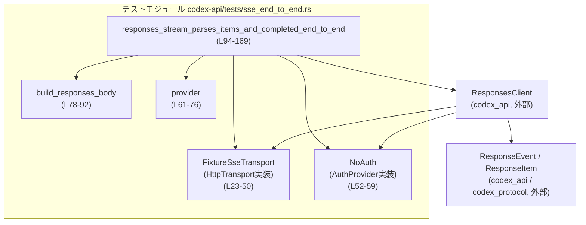
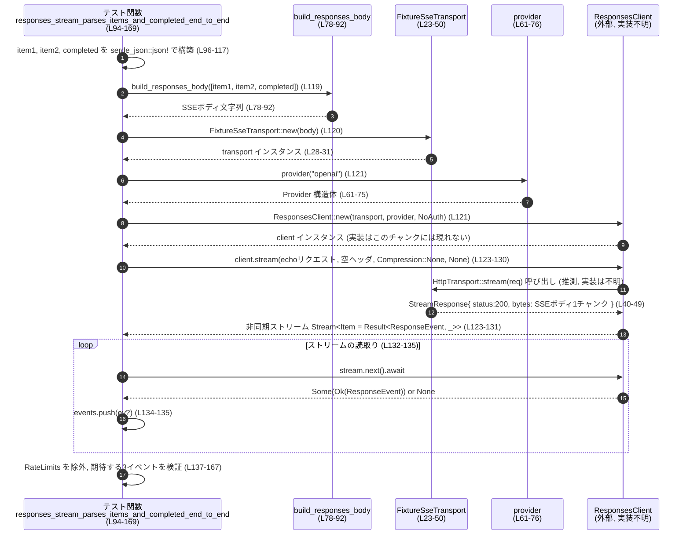

# codex-api\tests\sse_end_to_end.rs コード解説

## 0. ざっくり一言

SSE（Server-Sent Events）によるストリームレスポンスを、`ResponsesClient` が `ResponseEvent` の列に正しくパースできるかを検証する、エンドツーエンド寄りのテストと、そのための簡易トランスポート実装をまとめたファイルです。  
（`codex-api\tests\sse_end_to_end.rs:L23-50`, `L78-92`, `L94-169`）

---

## 1. このモジュールの役割

### 1.1 概要

- カスタム HTTP トランスポート `FixtureSseTransport` を使って、SSE 形式のボディを 1 チャンクで返すテスト用環境を構成します。（`codex-api\tests\sse_end_to_end.rs:L23-50`）
- SSE ボディ文字列を生成するユーティリティ `build_responses_body` を提供します。（`L78-92`）
- `ResponsesClient::stream` が、
  - `response.output_item.done` イベントを `ResponseEvent::OutputItemDone(ResponseItem::Message { .. })`
  - `response.completed` イベントを `ResponseEvent::Completed { .. }`
  としてストリーム出力することを確認するテストを実装します。（`L94-169`）

### 1.2 アーキテクチャ内での位置づけ

このファイル内のコンポーネントと、外部クレートとの関係を簡略化すると次のようになります。



- `ResponsesClient` や `ResponseEvent` / `ResponseItem` の内部実装は、このファイルには現れません。（このチャンクには実装が現れない）

### 1.3 設計上のポイント

- **テスト用トランスポートの導入**  
  - `FixtureSseTransport` が `HttpTransport` を実装し、`stream` メソッドにのみ意味のある実装を持ちます。`execute` は必ずエラーを返すことで、誤って非ストリーミング API 経由で呼ばれた場合に検知しやすくなっています。（`L34-40`）
- **SSE フォーマットの最小限の実装**  
  - `build_responses_body` で `event: <type>` と任意の `data: <json>` を連結して SSE ボディを生成します。イベントごとに空行で区切られます。（`L78-90`）
- **認証無し構成**  
  - `NoAuth` が空の `AuthProvider` 実装として使われ、テスト内で認証トークンは付与されません。（`L52-59`, `L121`）
- **再試行設定とタイムアウトを明示**  
  - `provider` で再試行回数やストリームのアイドルタイムアウトなどを固定値で設定し、テストでの動作が決定的になるようになっています。（`L61-75`）
- **非同期ストリームの利用**  
  - テストは `tokio::test` と `StreamExt::next` を使い、`ResponsesClient::stream` が返す非同期ストリームを最後まで読んで検証します。（`L94`, `L123-135`）

---

## 2. 主要な機能一覧

- SSE ボディ生成: `build_responses_body` で `serde_json::Value` の列から SSE 形式テキストを生成する。（`L78-92`）
- テスト用 HTTP トランスポート: `FixtureSseTransport` が `HttpTransport::stream` を 1 チャンクの `StreamResponse` で実装する。（`L23-50`）
- ダミー認証プロバイダ: `NoAuth` が常にトークンなしの `AuthProvider` を提供する。（`L52-59`）
- Provider 設定の生成: `provider` 関数でテスト用 `Provider` 設定（ベース URL、リトライ、タイムアウト）を作る。（`L61-75`）
- SSE ストリーム統合テスト: `responses_stream_parses_items_and_completed_end_to_end` で、SSE から `ResponseEvent` 列への変換を E2E で検証する。（`L94-169`）

---

## 3. 公開 API と詳細解説

### 3.1 型一覧（構造体・列挙体など）

| 名前 | 種別 | 役割 / 用途 | 定義位置 |
|------|------|-------------|----------|
| `FixtureSseTransport` | 構造体 | `body: String` を保持し、SSE ボディを返すテスト用 `HttpTransport` 実装です。`stream` で 1 回だけボディを流します。 | `codex-api\tests\sse_end_to_end.rs:L23-26` |
| `NoAuth` | 構造体（中身なし） | ダミーの認証プロバイダです。常に `None` を返す `AuthProvider` 実装として使われます。 | `codex-api\tests\sse_end_to_end.rs:L52-53` |

`ResponseEvent`, `ResponseItem`, `Provider`, `ResponsesClient`, `AuthProvider`, `HttpTransport` などは外部クレート由来であり、このチャンクには定義が現れません。

### 3.2 関数詳細

#### `FixtureSseTransport::new(body: String) -> FixtureSseTransport`

**概要**

- テスト用トランスポート `FixtureSseTransport` を、指定された SSE ボディ文字列で初期化します。（`L28-31`）

**引数**

| 引数名 | 型 | 説明 |
|--------|----|------|
| `body` | `String` | SSE 形式のレスポンスボディ全体。後で `stream` から 1 回だけ流されます。 |

**戻り値**

- `FixtureSseTransport` インスタンス（`body` フィールドに引数をコピーしたもの）を返します。（`L29-31`）

**内部処理の流れ**

1. 構造体リテラル `Self { body }` を返すだけです。（`L29-31`）

**Examples（使用例）**

```rust
// SSE ボディを用意する
let body = "event: response.completed\ndata: {\"response\": {\"id\": \"resp1\"}}\n\n".to_string();

// トランスポートを生成する
let transport = FixtureSseTransport::new(body); // codex-api\tests\sse_end_to_end.rs:L28-31
```

**Errors / Panics**

- この関数自体はエラーもパニックも発生させません。（`L28-31`）

**Edge cases（エッジケース）**

- 空文字列 `""` を渡した場合でもそのまま保持されます。SSE として有効かどうかはこの関数では検証されません。（`L29-31`）

**使用上の注意点**

- `body` は後続の処理でそのまま SSE として解釈されるため、SSE フォーマットは呼び出し側で保証する必要があります。（このチャンクにはバリデーション処理は現れない）

---

#### `impl HttpTransport for FixtureSseTransport::execute(&self, _req: Request) -> Result<Response, TransportError>`

**概要**

- 非ストリーミングの HTTP 実行 API ですが、このテスト用トランスポートでは「呼ばれてはいけない」ことを明示するため常にエラーを返します。（`L34-38`）

**引数**

| 引数名 | 型 | 説明 |
|--------|----|------|
| `_req` | `Request` | HTTP リクエスト。ここでは未使用（プレースホルダ）です。 |

**戻り値**

- 常に `Err(TransportError::Build("execute should not run".to_string()))` を返します。（`L37-38`）

**内部処理の流れ**

1. 引数 `_req` は使用せず無視します。（`L36`）
2. `TransportError::Build` 変種でメッセージ `"execute should not run"` を含むエラーを構築し、`Err` として返します。（`L37-38`）

**Examples（使用例）**

この関数はテスト内では直接呼ばれていません。`ResponsesClient` が誤って非ストリーミング API を使った場合にテストが失敗しやすくする意図が読み取れます。（`L34-40`）

**Errors / Panics**

- 常に `Err` を返し、パニックは起こしません。（`L37-38`）

**Edge cases（エッジケース）**

- 特に分岐はなく、入力に依存しません。（`L36-38`）

**使用上の注意点**

- 実運用コードでこのトランスポートを流用すると、通常の HTTP リクエストがすべて失敗するため、テスト専用として扱うのが前提です。（このチャンクのコード上はテスト以外で使われていません）

---

#### `impl HttpTransport for FixtureSseTransport::stream(&self, _req: Request) -> Result<StreamResponse, TransportError>`

**概要**

- 渡されたリクエストを無視し、内部に保持している SSE ボディ文字列を 1 チャンクだけ返す `StreamResponse` を生成します。（`L40-49`）
- これにより、`ResponsesClient::stream` が SSE ボディをどのようにパースするかをテストできます。（`L119-131`）

**引数**

| 引数名 | 型 | 説明 |
|--------|----|------|
| `_req` | `Request` | HTTP リクエスト。テストでは内容を参照しません。 |

**戻り値**

- `Ok(StreamResponse)` を返します。`StreamResponse` には:
  - `status: StatusCode::OK`（HTTP 200）（`L45`）
  - `headers: HeaderMap::new()`（空のヘッダ）（`L46`）
  - `bytes`: `Box` された `Stream<Item = Result<Bytes, TransportError>>` が含まれます。（`L41-48`）

**内部処理の流れ**

1. `self.body.clone()` で SSE ボディのクローンを作る。（`L41-42`）
2. それを `Bytes::from(...)` でバイト列に変換する。（`L41-42`）
3. `Ok::<Bytes, TransportError>(...)` に包んで `Vec` に格納し、`futures::stream::iter` で単一要素のストリームを作る。（`L41-43`）
4. そのストリームを `Box::pin` で `Pin<Box<...>>` に変換し、`StreamResponse` 構造体に詰めて `Ok` で返す。（`L44-48`）

**Examples（使用例）**

テスト内で `ResponsesClient::stream` から間接的に呼ばれます：

```rust
let body = build_responses_body(vec![item1, item2, completed]); // L119
let transport = FixtureSseTransport::new(body);                 // L120
let client = ResponsesClient::new(transport, provider("openai"), NoAuth); // L121

let mut stream = client
    .stream(
        serde_json::json!({"echo": true}),
        HeaderMap::new(),
        Compression::None,
        None,
    )
    .await?; // ここで内部的に FixtureSseTransport::stream が呼ばれると考えられます（実装はこのチャンクには現れない）
```

**Errors / Panics**

- 実装上は常に `Ok(StreamResponse)` を返し、`Err` を返す分岐はありません。（`L41-48`）
- パニックを発生させるコードもありません。

**Edge cases（エッジケース）**

- `self.body` が空文字列でも、1 チャンクの空 `Bytes` として流されます。（`L41-42`）
- `self.body` の長さに制限はなく、この関数内での分割やチャンク分けは行われません。（`L41-43`）

**使用上の注意点**

- **並行性**: `self.body.clone()` により読み取り専用のクローンを作るため、複数のストリームが同じインスタンスを共有してもデータ競合は発生しません。（`L41-42`）
- **エラー経路のテスト不足**: このテストトランスポートはストリーム中の `Err(TransportError)` を生成しないため、`ResponsesClient` のエラー処理をテストする用途には向きません。（`L41-48`）

---

#### `NoAuth::bearer_token(&self) -> Option<String>`

**概要**

- `AuthProvider` トレイトの実装として、常に `None` を返すことで「認証なし」を表現します。（`L55-58`）

**引数**

| 引数名 | 型 | 説明 |
|--------|----|------|
| `&self` | `&NoAuth` | 状態は持たず、どのインスタンスでも同じ結果です。 |

**戻り値**

- 常に `None`。（`L57`）

**内部処理の流れ**

1. 何も参照せず、`None` を返すだけです。（`L57`）

**Errors / Panics**

- エラーやパニックは発生しません。（`L55-58`）

**使用上の注意点**

- 実運用環境で使う場合は認証されないリクエストになる可能性が高いため、この実装はテスト専用であると解釈できます。（テストでのみ使用されていることがコードから分かります: `L121`）

---

#### `provider(name: &str) -> Provider`

**概要**

- 指定されたプロバイダ名と固定の設定値から、`Provider` 構造体を構築します。（`L61-75`）
- テスト用に、最小限のリトライ設定とストリームのアイドルタイムアウトが設定されています。（`L67-75`）

**引数**

| 引数名 | 型 | 説明 |
|--------|----|------|
| `name` | `&str` | プロバイダ名。`Provider::name` に設定されます。（`L61-63`） |

**戻り値**

- 次のフィールドを持つ `Provider` を返します。（`L61-75`）
  - `name`: `name.to_string()`（`L63`）
  - `base_url`: `"https://example.com/v1".to_string()`（`L64`）
  - `query_params`: `None`（`L65`）
  - `headers`: 空の `HeaderMap`（`L66`）
  - `retry`: `RetryConfig { max_attempts: 1, base_delay: 1ms, retry_429: false, retry_5xx: false, retry_transport: true }`（`L67-73`）
  - `stream_idle_timeout`: `50ms`（`L74`）

**内部処理の流れ**

1. 引数の `name` を `String` に変換。（`L63`）
2. `base_url` など、固定の設定値をフィールドに埋め込む。（`L64-75`）
3. `Provider` の構造体リテラルを返す。（`L61-75`）

**Examples（使用例）**

```rust
let p = provider("openai"); // codex-api\tests\sse_end_to_end.rs:L61-75
assert_eq!(p.name, "openai");
assert_eq!(p.base_url, "https://example.com/v1");
```

**Errors / Panics**

- エラーやパニックは発生しません。（`L61-75`）

**Edge cases（エッジケース）**

- 空文字列 `""` を渡した場合も、そのまま `Provider::name` に設定されます。（`L63`）

**使用上の注意点**

- `base_url` は `https://example.com/v1` に固定されており、実環境の URL とは異なるテスト専用の値です。（`L64`）

---

#### `build_responses_body(events: Vec<Value>) -> String`

**概要**

- `serde_json::Value` の配列から、`event: <type>\n` とオプションの `data: <json>\n` を連結し、SSE フォーマットのボディ文字列を生成します。（`L78-90`）

**引数**

| 引数名 | 型 | 説明 |
|--------|----|------|
| `events` | `Vec<Value>` | 各要素が SSE イベント 1 件分の JSON オブジェクトを表すと期待されています。（`L78-80`） |

**戻り値**

- 組み立てた SSE ボディ文字列を返します。（`L78-92`）

**内部処理の流れ（アルゴリズム）**

1. 空の `String` を `body` として作成します。（`L79`）
2. `events` を順にループします。（`L80`）
3. 各イベント `e` から `e.get("type").and_then(|v| v.as_str())` で `"type"` フィールドを取得し、`&str` に変換します。（`L81-83`）
4. `"type"` が存在しない、あるいは文字列でない場合、`panic!("fixture event missing type in SSE fixture: {e}")` を実行します。（`L84`）
5. `e` が「フィールド数 1 のオブジェクト」であれば、`event: {kind}\n\n` を追加します。（`L85-87`）
6. それ以外の場合は `event: {kind}\ndata: {e}\n\n` を追加します。（`L88-89`）
7. すべてのイベントを処理した後、`body` を返します。（`L90-91`）

**Examples（使用例）**

```rust
// 2つの output_item と completed イベントから SSE ボディを生成
let item1 = serde_json::json!({ "type": "response.output_item.done", "item": { "foo": 1 } });
let item2 = serde_json::json!({ "type": "response.completed", "response": { "id": "resp1" } });

let body = build_responses_body(vec![item1, item2]); // codex-api\tests\sse_end_to_end.rs:L78-92

// 結果は概ね以下のような文字列になります（順序は events の順）:
// event: response.output_item.done
// data: {"type":"response.output_item.done","item":{"foo":1}}
//
// event: response.completed
// data: {"type":"response.completed","response":{"id":"resp1"}}
//
// （実際のスペースやフィールド順は serde_json のフォーマットに依存します）
```

**Errors / Panics**

- `"type"` フィールドが存在しない、または文字列でないイベントが含まれていると、`panic!` します。（`L81-84`）
- `panic!` メッセージには問題のイベント JSON 全体が含まれます。（`L84`）

**Edge cases（エッジケース）**

- **フィールド数 1 のオブジェクト**: `{"type": "foo"}` のように `"type"` フィールドのみを持つ場合、`data:` 行が付かないイベントになります。（`L85-87`）
- **オブジェクト以外**: `e.as_object()` が `None` の場合、`map(|o| ...)` がスキップされ、`unwrap_or(false)` により `false` となるため、「`data:` 行あり」の分岐に入ります。（`L85-89`）
- **空の `events`**: ループは 1 回も回らず、空文字列を返します。（`L79-81`）

**使用上の注意点**

- この関数はテスト用フィクスチャ生成に使われており、入力 JSON の妥当性チェックを積極的には行いません。  
  `"type"` フィールドが必須である点に注意が必要です。（`L81-84`）
- SSE の仕様では `data:` 行が複数行に分かれうるなどの詳細がありますが、この関数は 1 行にまとめた簡易フォーマットに限定されています。

---

#### `#[tokio::test] async fn responses_stream_parses_items_and_completed_end_to_end() -> Result<()>`

**概要**

- `ResponsesClient::stream` に対して、SSE ボディから 2 つの `OutputItemDone` イベントと 1 つの `Completed` イベントが正しくパースされることを E2E で検証する非同期テストです。（`L94-169`）

**引数**

- テスト関数のため引数はありません。（`L94-95`）

**戻り値**

- `anyhow::Result<()>`。最後に `Ok(())` を返します。（`L95`, `L169`）

**内部処理の流れ（アルゴリズム）**

1. **イベント JSON の構築**  
   - `item1`, `item2` として、`"type": "response.output_item.done"` のメッセージイベントを 2 つ作成します。各メッセージは `"role": "assistant"` と `"Hello"`, `"World"` のテキストを持ちます。（`L96-112`）
   - `completed` として `"type": "response.completed"` のイベントを作成し、`"response": {"id": "resp1"}` を含めます。（`L114-117`）

2. **SSE ボディとクライアントのセットアップ**  
   - `build_responses_body(vec![item1, item2, completed])` で SSE ボディ文字列を生成します。（`L119`）
   - `FixtureSseTransport::new(body)` でトランスポートを生成します。（`L120`）
   - `ResponsesClient::new(transport, provider("openai"), NoAuth)` でクライアントを生成します。（`L121`）

3. **ストリームの取得**  
   - `client.stream(json!({"echo": true}), HeaderMap::new(), Compression::None, None).await?` を呼び出して、`Stream<Item = Result<ResponseEvent, _>>` を取得します。（`L123-131`）

4. **全イベントの収集**  
   - `while let Some(ev) = stream.next().await` でストリームを最後まで読み、`ev?` で `Result` をアンラップして `events` ベクタに格納します。（`L132-135`）

5. **RateLimits イベントの除外**  
   - `events.into_iter().filter(|ev| !matches!(ev, ResponseEvent::RateLimits(_))).collect()` で、`RateLimits` イベントを除外し、新しい `Vec<ResponseEvent>` を得ます。（`L137-140`）

6. **期待される 3 イベントであることの検証**  
   - `assert_eq!(events.len(), 3)` でイベント数を検証します。（`L142`）
   - `events[0]`, `events[1]` が `ResponseEvent::OutputItemDone(ResponseItem::Message { role, .. })` であり、`role == "assistant"` であることを `match` で確認します。（`L144-156`）
   - `events[2]` が `ResponseEvent::Completed { response_id, token_usage }` であり、`response_id == "resp1"`, `token_usage.is_none()` であることを確認します。（`L158-165`）

7. **正常終了**  
   - `Ok(())` を返してテストを成功させます。（`L169`）

**Examples（使用例）**

この関数自体がテストとしての使用例です。外部から呼ぶ想定はありません。（`L94-169`）

**Errors / Panics**

- `client.stream(...).await?` や `ev?` により、内部で `Err` が発生した場合はテスト全体が `Err` として失敗します。（`L123-131`, `L133-135`）
  - 具体的なエラー型はこのチャンクには現れませんが、`ResponsesClient::stream` の戻り値に依存します。
- `assert_eq!` や `panic!` により、期待されるイベントの形でない場合はパニックが発生し、テストが失敗します。（`L142`, `L148`, `L156`, `L167`）

**Edge cases（エッジケース）**

- ストリームが空であった場合、`events.len()` が `0` となり `assert_eq!(events.len(), 3)` によりテストが失敗します。（`L142`）
- `RateLimits` イベントが途中で混ざっていても、フィルタによって除外されるため、期待される 3 イベントが存在する限りテストは通ります。（`L137-140`）
- `ResponseEvent` のバリアント名や構造が変更されると `match` 式が網羅できなくなり、コンパイルエラーまたはパターンミスマッチによるパニックにつながります。（`L144-156`, `L158-167`）

**使用上の注意点**

- `#[tokio::test]` により Tokio ランタイム上で動作する前提です。同期テストとしては実行できません。（`L94`）
- テストは 3 件のイベントのみを検証しており、トークン使用量（`token_usage`）が `None` であるケースしか扱っていません。他のフィールドやエラーイベントについてのカバレッジは別のテストが必要です。（`L162-165`）

### 3.3 その他の関数

このファイル内で他に定義される単純な関数・メソッドです。

| 関数名 | 役割（1 行） | 定義位置 |
|--------|--------------|----------|
| `NoAuth::bearer_token` | 常に `None` を返すダミーの認証トークン供給メソッドです。 | `codex-api\tests\sse_end_to_end.rs:L55-58` |

---

## 4. データフロー

このセクションでは、テスト関数内でのデータの流れを示します。

### 4.1 処理の要点

- JSON フィクスチャ (`item1`, `item2`, `completed`) から SSE ボディ文字列を `build_responses_body` で生成します。（`L96-119`）
- SSE ボディを返す `FixtureSseTransport` と、`provider` / `NoAuth` を渡して `ResponsesClient` を構成します。（`L119-121`）
- `ResponsesClient::stream` が `HttpTransport::stream` を通じて SSE ボディを受け取り、`ResponseEvent` のストリームに変換します。（`L123-131`）
  - この変換ロジックはこのチャンクには現れず、外部クレート内の実装です。
- テストはストリームを最後まで読み込んで `Vec<ResponseEvent>` にし、フィルタ・アサーションを行います。（`L132-167`）

### 4.2 シーケンス図



> 注: `ResponsesClient` が内部でどのように `StreamResponse` を `ResponseEvent` へ変換しているかは、このファイルには記載がなく、不明です。

---

## 5. 使い方（How to Use）

このファイルはテスト用ですが、同様のパターンで SSE ストリームのテストを追加することができます。

### 5.1 基本的な使用方法

- 任意のイベント JSON を `build_responses_body` で SSE 文字列に変換し、`FixtureSseTransport` 経由で `ResponsesClient::stream` に渡す、という流れです。（`L96-121`）

```rust
// 1. イベントJSONを用意する
let event = serde_json::json!({
    "type": "response.completed",
    "response": { "id": "test" }
});

// 2. SSEボディを生成する
let body = build_responses_body(vec![event]); // L78-92

// 3. テスト用トランスポートとクライアントを作成する
let transport = FixtureSseTransport::new(body);          // L28-31
let client = ResponsesClient::new(transport, provider("openai"), NoAuth); // L61-76, L52-59

// 4. ストリームを取得し、イベントを読み取る
let mut stream = client
    .stream(serde_json::json!({}), HeaderMap::new(), Compression::None, None)
    .await?;

while let Some(ev) = stream.next().await {
    let ev = ev?; // Resultをアンラップ
    // ResponseEvent に対する検証を行う
}
```

### 5.2 よくある使用パターン

- **複数イベントの順序検証**  
  `Vec<Value>` に複数のイベントを入れて `build_responses_body` を呼び出すことで、イベントの順序や終端イベントの有無を検証できます。（`L96-119`）
- **Completed イベントのみの検証**  
  `response.completed` だけからなる SSE を作り、`ResponseEvent::Completed` のパースだけを集中してテストする、といった使い方も可能です。（`L114-117`）

### 5.3 よくある間違い

```rust
// 間違い例: "type" フィールドを持たないイベントを渡してしまう
let bad_event = serde_json::json!({ "item": { "foo": 1 } });
let body = build_responses_body(vec![bad_event]); // ここで panic! する（L81-84）

// 正しい例: "type" フィールドを必ず含める
let good_event = serde_json::json!({
    "type": "response.output_item.done",
    "item": { "foo": 1 }
});
let body = build_responses_body(vec![good_event]); // 正常に SSE ボディが生成される
```

### 5.4 使用上の注意点（まとめ）

- `build_responses_body` に渡す各イベント JSON には、必ず `"type"`（文字列）フィールドが必要です。欠けているとテストが `panic!` で失敗します。（`L81-84`）
- `FixtureSseTransport` はストリームを 1 チャンクにまとめて返すため、実際のネットワーク環境でのチャンク分割挙動はテストされません。（`L41-43`）
- 認証まわりは `NoAuth` によって無効化されているため、認証付きの動作は別途テストする必要があります。（`L52-59`, `L121`）

---

## 6. 変更の仕方（How to Modify）

### 6.1 新しい機能を追加する場合

- **新種のイベントをテストしたい場合**
  1. テスト関数内で新しい JSON イベントを `serde_json::json!` で定義します。（`L96-117` を参考）
  2. `build_responses_body` に渡す `Vec<Value>` にそのイベントを追加します。（`L119`）
  3. ストリームから読み取った `ResponseEvent` に対する `match` と `assert` を追加し、新しいバリアントやフィールドを検証します。（`L144-167`）

- **SSE のエラーパスをテストしたい場合**
  - 現状の `FixtureSseTransport::stream` は常に `Ok` を返すため、`TransportError` を発生させるテスト用トランスポートを別途実装するのが自然です。このファイルにはそのような実装は存在しません（このチャンクには現れない）。

### 6.2 既存の機能を変更する場合

- **`build_responses_body` の仕様変更**
  - `"type"` フィールドの扱いを変える場合、`panic!` の条件や SSE 文字列のフォーマットを変更する必要があります。（`L81-89`）
  - それに伴い、このテストだけでなく、同関数を使用している他のテスト（存在するかどうかはこのチャンクからは不明）も確認する必要があります。

- **`FixtureSseTransport` のストリーム形式変更**
  - 例えば SSE を複数チャンクに分割したい場合は、`futures::stream::iter` に渡す `Vec` に複数の `Bytes` を追加します。（`L41-43`）
  - その際、`ResponsesClient` 側が複数チャンクに対応しているかどうかを確認する必要があります（このチャンクには実装が現れない）。

- **テストの契約（Contract）**
  - このテストは「2つの `OutputItemDone` と1つの `Completed` イベントが順に届く」という契約を暗黙に課しています。（`L96-117`, `L144-167`）
  - `ResponsesClient::stream` の仕様変更がこの契約を破る場合は、テストの期待値を更新するか、新しい仕様を反映した別テストを追加する必要があります。

---

## 7. 関連ファイル

このモジュールと密接に関係する型・トレイトは外部クレートからインポートされています。ファイルパスはこのチャンクでは分かりませんが、役割を整理します。

| パス/シンボル | 役割 / 関係 |
|--------------|------------|
| `codex_api::ResponsesClient` | 本テストの対象となるクライアント。`new` と `stream` を利用しています。（`L10`, `L121`, `L123-131`） |
| `codex_api::ResponseEvent` | ストリーム出力として検証されるイベント列挙体。`OutputItemDone`, `Completed`, `RateLimits` バリアントが使われています。（`L9`, `L137-140`, `L144-167`） |
| `codex_protocol::models::ResponseItem` | `ResponseEvent::OutputItemDone` でラップされるドメインオブジェクト。ここでは `Message { role, .. }` バリアントがマッチ対象です。（`L16`, `L144-153`） |
| `codex_api::Provider` / `codex_api::RetryConfig` | API 呼び出しのメタ情報（ベース URL、リトライ戦略、タイムアウト）を保持する設定構造体。`provider` 関数で構築されています。（`L8`, `L61-75`） |
| `codex_api::AuthProvider` | 認証情報供給のトレイト。`NoAuth` がこれを実装しています。（`L6`, `L52-59`） |
| `codex_client::HttpTransport` | HTTP トランスポート抽象。`FixtureSseTransport` が実装し、`ResponsesClient` に渡されます。（`L11`, `L34-50`, `L121`） |
| `codex_client::{Request, Response, StreamResponse, TransportError}` | トランスポート実装が使用するリクエスト/レスポンス/ストリーム/エラー型です。（`L12-15`, `L36-49`） |

---

## Bugs / Security / Contracts / Edge Cases まとめ（このファイルに関するもの）

### Bugs の可能性

- `build_responses_body` が `"type"` フィールドを必須としており、誤ったフィクスチャでは即座に `panic!` しますが、これはテストフィクスチャとしての意図した挙動と解釈できます。（`L81-84`）
- `ResponsesClient` 内部の挙動や SSE パースエラーは、このテストではカバーされていません。ストリームのエラー経路が存在する場合、それは別テストで検証する必要があります。（このチャンクには `ResponsesClient` の実装が現れない）

### Security 観点

- `NoAuth` によって認証は一切行われず、`https://example.com/v1` に向けたリクエスト設定になっています。（`L52-59`, `L64`）  
  ただし、これはテスト環境であり、実際のネットワーク I/O が行われるかどうかは `ResponsesClient` 実装次第で、このチャンクからは判別できません。
- 外部から入力されるデータはなく、すべてテストコード内で定義された JSON に基づくため、ここだけを見れば外部入力によるセキュリティリスクは低いと考えられます。

### Contracts / Edge Cases

- `ResponsesClient::stream` が返すイベント列には、少なくとも
  - `ResponseEvent::OutputItemDone(ResponseItem::Message { role, .. })` が 2 件
  - `ResponseEvent::Completed { response_id: "resp1", token_usage: None }` が 1 件
  含まれる、という契約をテストが課しています。（`L96-117`, `L144-167`）
- `RateLimits` イベントは存在しても無視される前提になっています。（`L137-140`）

### 並行性・非同期安全性

- すべての処理は `tokio::test` の単一タスク内で行われており、共有可変状態はありません。（`L94-169`）
- `FixtureSseTransport` は `Clone` を実装し、フィールドは `String` のみであり、`stream` 内では `clone` でコピーを取るため、競合のない実装になっています。（`L23-26`, `L41-42`）

以上が、このファイルに基づいて客観的に把握できる範囲の解説となります。
