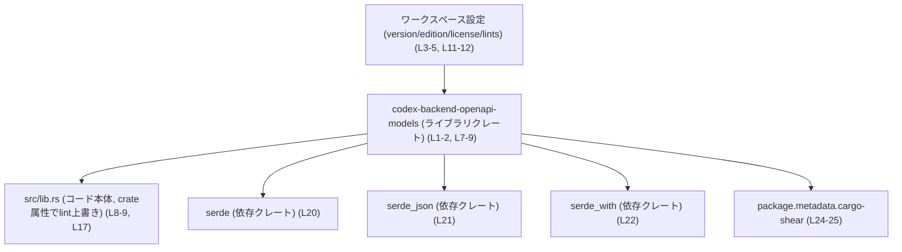
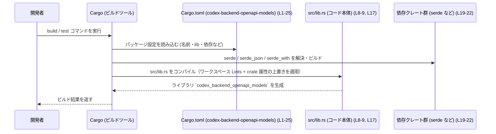

# codex-backend-openapi-models\Cargo.toml

## 0. ざっくり一言

`codex-backend-openapi-models` クレートの Cargo マニフェストで、  
ライブラリターゲット名・パス、ワークスペース継承設定、依存クレート、Lint 方針、およびツール用メタデータを定義しています（codex-backend-openapi-models/Cargo.toml:L1-5, L7-9, L11-12, L14-17, L19-25）。

---

## 1. このモジュールの役割

### 1.1 概要

- このファイルは、`codex-backend-openapi-models` という **生成されたモデルコードを含むライブラリクレート**（コメントより）のビルド設定を定義します（L2, L14-16）。
- バージョン・エディション・ライセンス・Lint などの共通設定を Cargo ワークスペースから継承し（L3-5, L11-12）、依存クレート（`serde`, `serde_json`, `serde_with`）を宣言します（L19-22）。
- コメントにより、「モデル再生成後もワークスペース全体をビルドできるように、unwrap/expect を許容する lint 方針」であることが示されています（L14-17）。

### 1.2 アーキテクチャ内での位置づけ

このファイルから分かる範囲では、アーキテクチャ上の関係は概ね次のとおりです。

- 本クレートは Cargo ワークスペースの一員であり、`version`, `edition`, `license`, `lints` をワークスペース設定から継承します（L3-5, L11-12）。
- ライブラリクレートとして `src/lib.rs` をエントリポイントとし（L7-9）、そこに crate 属性で Lint の上書きがあるとコメントされています（L17）。
- 実際のモデル型や API は `src/lib.rs` 以下の Rust コード側にあり、このチャンクには現れません（L8-9）。
- 実装上は JSON シリアライズ/デシリアライズのために `serde` と `serde_json`、補助的なシリアライズ機能のために `serde_with` を利用する構成になっています（L19-22）。

#### 依存関係の簡易図

この図は、Cargo がこのマニフェストをどのように解釈するかという観点で、本ファイルに現れる関係だけを示します。



### 1.3 設計上のポイント（このファイルから読み取れること）

- **ワークスペース継承型の設定**  
  - `version.workspace = true`, `edition.workspace = true`, `license.workspace = true` により、バージョン・エディション・ライセンスはワークスペースルートの設定に統一されています（L3-5）。
  - Lint も `[lints] workspace = true` で共通設定を継承しています（L11-12）。

- **ライブラリクレートとしての構成**  
  - `[lib]` セクションで `name = "codex_backend_openapi_models"` とし（L8）、コードエントリポイントを `src/lib.rs` に指定しています（L9）。  
    これにより、Rust コードからは `codex_backend_openapi_models` というクレート名で参照されます。

- **生成コードと Lint の関係**  
  - コメントによると、このクレート内のコードは「generated code」であり、ワークスペース共通の Lint（特に unwrap/expect 禁止系）に違反しがちなため、このクレートでは unwrap/expect を許容するよう crate 属性で上書きしていることが示されています（L14-17）。  
  - Lint 上書きの実体は `src/lib.rs` にあり、このチャンクには現れません（L17）。

- **シリアライズ関連クレートへの依存**  
  - `serde`（derive 機能付き）、`serde_json`, `serde_with` を依存に持つことで、モデル型のシリアライズ/デシリアライズを前提とした設計になっていると解釈できます（L19-22）。

- **ツール連携用メタデータ**  
  - `[package.metadata.cargo-shear]` で `ignored = ["serde_with"]` としており、`serde_with` が特定ツール（cargo-shear）から無視されるような設定になっています（L24-25）。  
    `ignored` の厳密な意味はツール側仕様に依存するため、このファイルだけからは詳細は分かりません。

---

## 2. 主要な機能一覧（このファイルが提供する設定要素）

このファイルはコードロジックではなく設定のみを持つため、「機能」は設定項目として整理します。

- ライブラリターゲット定義: クレート名 `codex_backend_openapi_models` とエントリポイント `src/lib.rs` を定義します（L7-9）。
- ワークスペース共通設定の継承: バージョン・エディション・ライセンス・Lint をワークスペースから継承します（L3-5, L11-12）。
- 依存クレートの宣言: `serde`（derive 有効）、`serde_json`, `serde_with` を依存として宣言します（L19-22）。
- 生成コードに対する Lint 方針の明示: unwrap/expect を許容してワークスペース全体のビルドを維持する方針をコメントで説明しています（L14-17）。
- cargo-shear 用メタデータの設定: `serde_with` を `ignored` に指定するメタデータを追加しています（L24-25）。

---

## 3. 公開 API と詳細解説

### 3.1 型一覧（構造体・列挙体など）

このファイルは Cargo マニフェストであり、Rust の構造体・列挙体・関数定義は含まれていません（L1-25）。  
そのため「型一覧」として列挙できる公開 API は **このチャンクには現れません**。

代わりに、このマニフェストから把握できるコンポーネント（ライブラリターゲットや依存クレート）をインベントリーとして整理します。

| 名前 | 種別 | 役割 / 用途 | 根拠 |
|------|------|-------------|------|
| `codex-backend-openapi-models` | Cargo パッケージ名 | ワークスペース内で識別されるパッケージ名 | codex-backend-openapi-models/Cargo.toml:L1-2 |
| `codex_backend_openapi_models` | ライブラリターゲット名 | Rust コードから `use codex_backend_openapi_models` で参照されるクレート名 | L7-8 |
| `src/lib.rs` | ライブラリエントリポイント | このクレートの公開 API や生成モデルの実体が記述されるファイルパス | L8-9 |
| ワークスペース共通 `version` | 設定 | クレートのバージョンをワークスペース設定から継承 | L3 |
| ワークスペース共通 `edition` | 設定 | Rust エディション（例: 2021）をワークスペース設定から継承 | L4 |
| ワークスペース共通 `license` | 設定 | ライセンス情報をワークスペース設定から継承 | L5 |
| ワークスペース共通 `lints` | 設定 | Lint（警告・静的解析）設定をワークスペースから継承 | L11-12 |
| `serde` | 依存クレート | モデル型のシリアライズ/デシリアライズのための基本クレート（derive 機能付き） | L19-20 |
| `serde_json` | 依存クレート | JSON 形式との変換を行うためのクレート | L19, L21 |
| `serde_with` | 依存クレート | serde 用補助マクロ・属性などを提供するクレート | L19, L22 |
| `package.metadata.cargo-shear` | ツールメタデータ | cargo-shear 用設定。`ignored = ["serde_with"]` を指定 | L24-25 |

> Rust の構造体・列挙体・関数の **具体名やシグネチャは、このチャンクには現れません**。  
> 公開 API を把握するには `src/lib.rs` およびその配下のコードを参照する必要があります（L8-9）。

### 3.2 関数詳細（最大 7 件）

このファイルには Rust 関数の定義は含まれていないため、関数詳細として説明できる対象はありません（codex-backend-openapi-models/Cargo.toml:L1-25）。

- 公開/内部を問わず、関数・メソッド名やシグネチャは **このチャンクには現れません**。
- コアロジックやエラー処理の詳細は `src/lib.rs` 以降のコード側にあります（L8-9）。

### 3.3 その他の関数

3.2 と同様、このマニフェストには関数は存在しないため、一覧対象はありません（L1-25）。

---

## 4. データフロー

ここでは「ビルド時に Cargo とこのマニフェストがどう関わるか」という観点のデータフローを示します。  
実行時の関数呼び出しやモデル間のデータフローは、このチャンクには現れないため記述できません。



- 上記の流れは、Cargo の一般的な挙動と、このマニフェスト内の設定（L1-5, L7-9, L11-12, L19-22, L17）から導かれるものです。
- 実行時にどのモデル型がどのような JSON を読み書きするか、どのようなエラーを返すか・panic するかなどは、このチャンクには現れません。

---

## 5. 使い方（How to Use）

### 5.1 基本的な使用方法

このクレートはライブラリとして提供されており、他のクレートからは `codex_backend_openapi_models` というクレート名で参照されます（L7-8）。

#### ワークスペース内の別クレートから利用する例（概念的な例）

```toml
# 他のワークスペースメンバーの Cargo.toml からの依存例
[dependencies]
# パスやバージョン指定はプロジェクト構成に応じて設定する
codex-backend-openapi-models = { path = "../codex-backend-openapi-models" }
```

```rust
// 他クレート側の Rust コード例
// ライブラリターゲット名は Cargo.toml の [lib].name に合わせる（L7-8）
use codex_backend_openapi_models; // 公開 API の実体は src/lib.rs 側にある

fn main() {
    // ここで codex_backend_openapi_models 内のモデル型や関数を利用する
    // 実際にどの型・関数が存在するかは、このチャンクには現れません。
}
```

> 実在する具体的な型名・関数名は `src/lib.rs` に依存するため、ここでは示せません（L8-9）。

### 5.2 よくある使用パターン（推測を明示した一般的なパターン）

コメントと依存関係から、このクレートは「OpenAPI ベースのモデル型を serde で（de）シリアライズする」用途の生成コードであると考えられます（L2, L14-16, L19-22）。  
その前提に基づく一般的な利用パターンを、**推測であることを明示**したうえで挙げます。

1. **HTTP ハンドラとの連携（JSON ボディのパース）**  
   - Web フレームワーク側で受け取った JSON 本文を、`codex_backend_openapi_models` のモデル型にデシリアライズする。  
   - 逆にレスポンスとしてモデル型を JSON にシリアライズする。  
   → これは `serde` / `serde_json` を依存に持つモデルクレートで典型的なパターンです（L19-22）。

2. **内部処理での型安全なデータ保持**  
   - OpenAPI 由来のスキーマを Rust の型として扱い、内部ロジックでは純粋な Rust 型として操作し、境界（I/O）でのみ JSON と相互変換する。  

これらはクレート名と依存関係からの一般的な利用イメージであり、  
**実際にどのような API が存在するかは、このチャンクには現れません**。

### 5.3 よくある間違い（このファイルに関するもの）

このマニフェストを編集する際に起こり得る誤用例を示します。

#### 例1: lib.name とコード側のクレート名の不一致

```toml
# 間違い例: lib.name を変更したのに、コード側を直していない
[lib]
name = "codex_backend_openapi_models_v2"  # 変更した
path = "src/lib.rs"
```

```rust
// 依然として古いクレート名を使っている
use codex_backend_openapi_models; // コンパイルエラーになる
```

```rust
// 正しい例: lib.name に合わせてクレート名を修正する
use codex_backend_openapi_models_v2;
```

- `lib.name` と `use` で指定するクレート名は一致している必要があります（L7-8）。

#### 例2: 生成コードへの直接編集

- コメントから、このクレートは「models are regenerated（モデルが再生成される）」と明記されています（L16）。  
- 生成されるコードに直接手を入れると、再生成時に変更内容が失われる可能性があります。
- 生成ロジックを変更したい場合は、生成ツールや元の OpenAPI 定義など、**コード生成の入力側**を変更する必要がありますが、その場所や方法はこのチャンクには現れません。

### 5.4 使用上の注意点（まとめ）

このファイルおよびコメントから読み取れる、安全性・エラー・並行性に関わる注意点をまとめます。

- **unwrap/expect の許容方針**（エラー/安全性）  
  - コメントに「generated code often violates our workspace lints」「Allow unwrap/expect in this crate」とあり（L14-15）、このクレートのコードでは `unwrap` / `expect` の使用が Lint 上許容されていることが分かります。  
  - これは、入力が不正な場合などに **panic が発生する可能性がある** ことを意味します。  
  - どの関数・どのパスで panic の可能性があるかは、このチャンクには現れません。

- **生成コードであること**（保守性・契約）  
  - 「models are regenerated」とあるため、モデルコードは再生成を前提としています（L16）。  
  - 公開 API（構造体のフィールドや列挙体のバリアント）は生成ツールに依存し、手作業で変更することは契約上推奨されないケースが多いです。  
  - 実際の契約（どの型が安定 API か）は `src/lib.rs` やプロジェクトのドキュメントを確認する必要があります。

- **並行性・スレッド安全性**  
  - このマニフェストからは、スレッドセーフ性や `Send` / `Sync` 実装の有無など、並行性に関する情報は分かりません。  
  - 並行利用に関する前提条件は、このチャンクには現れません。

- **パフォーマンス上の注意**  
  - 依存として `serde_json` を使うため、大量の JSON シリアライズ/デシリアライズを行う可能性がありますが、その頻度やデータ量はコード側次第であり、このチャンクには現れません。  
  - パフォーマンス特性を評価するには、具体的な API の使われ方を確認する必要があります。

---

## 6. 変更の仕方（How to Modify）

### 6.1 新しい機能を追加する場合（このファイル側の観点）

このファイルはビルド設定のみを扱うため、「新しい機能」の多くは Rust コード側（`src/lib.rs` など）での追加になります。  
ここでは、このマニフェストをどう変更し得るかのみを整理します。

1. **新しい依存クレートが必要な場合**  
   - モデルや補助ロジックに新しい外部クレートが必要になった場合、`[dependencies]` に追記します（L19-22）。  
   - 例: 日付パース用に `chrono` を追加する、など。  
   - 実際に何が必要かはコード側の要件次第であり、このチャンクには現れません。

2. **Lint 方針の変更**  
   - コメントによれば、具体的な Lint 上書きは `src/lib.rs` の crate 属性で行われています（L17）。  
   - unwrap/expect を禁止・許容する方針を変えたい場合は、コメントの指示通り `src/lib.rs` の属性を見直す必要があります。  
   - `[lints] workspace = true` 自体はワークスペース共通設定を継承するのみで、このファイルでの上書きは行われていません（L11-12）。

3. **ライブラリターゲットの構成変更**  
   - エントリポイントファイルを変えたい場合は `[lib].path` を変更します（L8-9）。  
   - クレート名を変えたい場合は `[lib].name` を変更し、それに合わせてコード側の `use` / `extern crate` も修正する必要があります（L7-8）。

4. **cargo-shear の設定変更**  
   - 未使用依存検出ツール（cargo-shear）での扱いを変えたい場合は、`[package.metadata.cargo-shear]` の `ignored` リストを編集します（L24-25）。  
   - ここでの具体的な効果はツール仕様によるため、このファイルだけからは詳細は分かりません。

### 6.2 既存の機能を変更する場合（影響範囲の考え方）

既存機能の変更は主に `src/lib.rs` 以降のコードに対して行うことになります。  
このマニフェストから見える影響範囲・契約を整理します。

- **パッケージ名・クレート名の変更**  
  - `package.name`（L2）を変更すると、ワークスペースや外部クレートからの依存指定（`codex-backend-openapi-models = "...""`）に影響します。  
  - `lib.name`（L8）を変更すると、Rust コードからのクレート参照（`use codex_backend_openapi_models;`）に影響します。  
  - これらの変更は、依存元コードをすべて追跡して更新する必要があります。

- **依存クレートバージョンや種類の変更**  
  - `serde` / `serde_json` / `serde_with` のバージョンや有無を変えると、モデルコードの（de）シリアライズ方法や利用可能な属性が変わりうるため、  
    Rust コード側でコンパイルエラーやランタイム挙動の変化が発生する可能性があります（L19-22）。  
  - 後方互換性に敏感な API を提供している場合は、下位互換性の確認が必要です。

- **生成コードに関わる契約**  
  - コメントから、モデルは再生成される前提のため（L16）、生成元（OpenAPI スキーマなど）を変更すると、Rust 型の構造そのものが変化しうる契約になっています。  
  - どの程度の変更が許容されるか（フィールド追加・削除など）は、このチャンクには現れません。

---

## 7. 関連ファイル

このマニフェストと密接に関係するファイル・ディレクトリを、このチャンクから分かる範囲で列挙します。

| パス | 役割 / 関係 | 根拠 |
|------|-------------|------|
| `src/lib.rs` | このクレートのライブラリエントリポイント。公開 API や生成モデルコードの実体が置かれる | codex-backend-openapi-models/Cargo.toml:L8-9 |
| ワークスペースルートの `Cargo.toml` | `version.workspace`, `edition.workspace`, `license.workspace`, `[lints].workspace` などの共通設定の定義元 | L3-5, L11-12 |
| 生成ツール・スクリプト（不明） | コメント上、「models are regenerated」とあるため、何らかのコード生成ツールやスクリプトが存在すると考えられるが、このチャンクには現れず、場所・種類は不明 | L16 |
| （テスト関連ファイル）`tests/` や `src/lib.rs` 内のテスト | テストコードの有無や場所はこのチャンクには現れません。テスト戦略を確認するにはリポジトリ全体の構造を見る必要があります。 | L1-25（テストに関する記述がないこと） |

> 公開 API（構造体・列挙体・関数）やエッジケースの挙動、並行性の詳細などは、`src/lib.rs` およびその配下のコードを直接参照しない限り、このチャンクからは判断できません。
