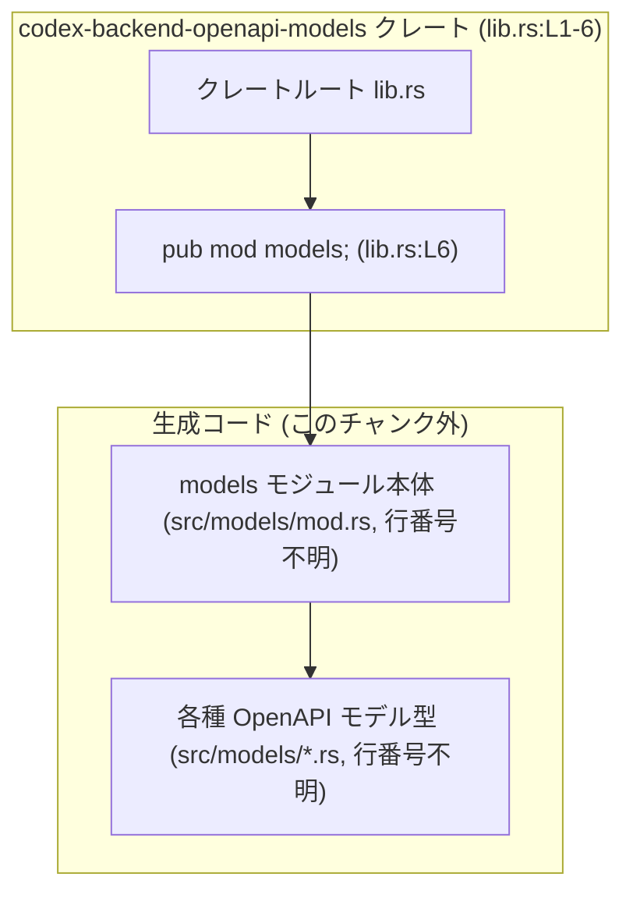

# codex-backend-openapi-models/src/lib.rs コード解説

## 0. ざっくり一言

このファイルは、クレート `codex-backend-openapi-models` のルートとして、自動生成された OpenAPI モデルを `models` モジュール経由で公開するための薄いラッパーです（lib.rs:L3-L6）。  
実行時ロジックや手書きの型定義は持たず、クレート全体で `unwrap` / `expect` に関する clippy の警告を無効化する設定のみを行っています（lib.rs:L1）。

---

## 1. このモジュールの役割

### 1.1 概要

- このモジュールは **自動生成された OpenAPI モデルを 1 箇所から参照できるようにする** ために存在します。
- 具体的には、`src/models/*.rs` と `src/models/mod.rs` に regen スクリプトが生成・書き込みを行い、それを `pub mod models;` で公開する構造です（lib.rs:L3-L6）。
- コメントに「This module intentionally contains no hand-written types.」とあるとおり、手書きの型定義は置かない方針になっています（lib.rs:L5）。

### 1.2 アーキテクチャ内での位置づけ

このファイルが担う役割と、自動生成された `models` モジュールとの関係を示します。



- クレートルート `lib.rs` が `models` モジュールを公開しています（lib.rs:L6）。
- 実際のモデル定義は `src/models/mod.rs` および `src/models/*.rs` にあり、regen スクリプトで生成されるとコメントに記載されています（lib.rs:L4）。

### 1.3 設計上のポイント

コードから読み取れる設計上の特徴は次の通りです。

- **責務の分離**
  - クレートルートは「公開窓口」と「コメントによる設計方針の明示」だけを行い、型定義は `src/models` 以下に集約しています（lib.rs:L3-L6）。
- **状態を持たない**
  - グローバルな変数や静的な状態、関数ロジックはなく、コンパイル時のモジュール構成だけを定義しています（lib.rs:L1-6）。
- **エラーハンドリングの方針**
  - 実行時処理がないため、このファイル自身には `Result` や `Option` を使ったエラーハンドリングは存在しません（lib.rs:L1-6）。
- **静的解析(clippy)との関係**
  - `#![allow(clippy::unwrap_used, clippy::expect_used)]` により、クレート全体で `unwrap` / `expect` 使用に関する clippy 警告を無効化しています（lib.rs:L1）。
  - これにより、自動生成されたコード内で `unwrap` / `expect` を使用していても clippy エラーにならない設計です。  
    ただし、具体的にどこで使われているかはこのチャンクからは分かりません。

---

## 2. 主要な機能一覧

このファイルが提供する「機能」は、実行時処理ではなく「公開構造」と「静的解析設定」です。

- クレート全体の clippy 設定: `unwrap_used` / `expect_used` の警告を無効化する（lib.rs:L1）
- OpenAPI モデルの公開窓口:
  - `pub mod models;` により、自動生成された OpenAPI モデル群を `models` モジュールとして公開する（lib.rs:L3-L6）
- 設計方針の明示:
  - `src/models/*.rs` / `src/models/mod.rs` が regen スクリプトで生成されること、
  - `lib.rs` に手書きの型を置かない方針であることをコメントで説明する（lib.rs:L3-L5）

### コンポーネントインベントリー（このファイル）

| 名前 | 種別 | 公開範囲 | 役割 / 用途 | 根拠 |
|------|------|----------|-------------|------|
| crate root (`lib.rs`) | クレートルート | クレート公開 | クレート全体の clippy 設定と `models` モジュールの公開を行う | lib.rs:L1-6 |
| `models` | モジュール | `pub` | 自動生成された OpenAPI モデルをまとめた公開モジュール | lib.rs:L3-L6 |

※ 構造体・列挙体・関数などはこのファイルには定義されていません（lib.rs:L1-6）。

---

## 3. 公開 API と詳細解説

### 3.1 型一覧（構造体・列挙体など）

このファイル自身には、構造体・列挙体・型エイリアスなどの定義は存在しません（lib.rs:L1-6）。

コメントから次のことだけが分かります（lib.rs:L3-L5）。

- `src/models/*.rs` および `src/models/mod.rs` に「generated OpenAPI models」が存在する。
- 具体的な型名やフィールド構成はこのチャンクには現れず、不明です。

したがって、型一覧表は次のようになります。

| 名前 | 種別 | 役割 / 用途 | 根拠 |
|------|------|-------------|------|
| （不明：models モジュール内の各モデル型） | 構造体 / 列挙体など | OpenAPI 仕様から自動生成されたモデルを表すと考えられますが、具体的な名前や構造はこのチャンクには現れません | lib.rs:L3-L5 |

### 3.2 詳細解説: `models` モジュール

関数定義はありませんが、公開 API として重要な `models` モジュールを、関数詳細テンプレートに近い形で整理します。

#### `pub mod models;`

**概要**

- クレート内の `models` サブモジュールを公開する宣言です（lib.rs:L6）。
- `models` モジュールの内容は regen スクリプトにより `src/models/*.rs` / `src/models/mod.rs` に生成される OpenAPI モデル群です（lib.rs:L3-L5）。

**引数**

- モジュール宣言であり、引数は存在しません。

**戻り値**

- 戻り値はなく、コンパイル時に `models` 名前空間がクレート外から参照可能になるだけです（lib.rs:L6）。

**内部処理の流れ**

実行時処理はありませんが、コンパイル・ビルド時の流れを整理します。

1. regen スクリプトが `src/models/*.rs` と `src/models/mod.rs` を生成・書き込みする（lib.rs:L4）。
2. Rust コンパイラは `lib.rs` をクレートルートとして読み込み、`pub mod models;` を解釈する（lib.rs:L6）。
3. `src/models/mod.rs` が `models` モジュールの本体として読み込まれ、そこから必要に応じて他の `src/models/*.rs` が `mod` される構成が想定されます（lib.rs:L4 に基づく推測であり、具体的な `mod` 宣言はこのチャンクには現れません）。
4. ビルド完了後、利用側は `codex_backend_openapi_models::models::Xxx` のようにモデル型へアクセスできます（クレート名や型名はこのチャンクからは不明）。

**Examples（使用例：一般的なパターン）**

以下は「自動生成された OpenAPI モデルをクレート経由で利用する」一般的な例です。  
クレート名や型名は仮のものであり、実際の名前は `Cargo.toml` と `src/models` の中身を確認する必要があります（このチャンクには現れません）。

```rust
// 仮のクレート名と型名の例です。
// 実際のクレート名・型名は Cargo.toml / src/models/*.rs を確認する必要があります。

// 自動生成モデルをまとめたモジュールを use する
use codex_backend_openapi_models::models; // クレート名は一般的な変換規則に基づく仮定

fn handle_request() {
    // OpenAPI 仕様から生成された、仮の RequestBody モデルを使う例
    // 実際には src/models/*.rs に定義されている型名を使用する
    // let body: models::RequestBody = /* ... */;

    // ... body を使って処理を行う ...
}
```

**Errors / Panics**

- このモジュール宣言自体はエラーやパニックを発生させる実行時処理を含みません（lib.rs:L6）。
- clippy の `unwrap_used` / `expect_used` がクレート全体で無効化されているため（lib.rs:L1）、`models` 内の自動生成コードで `unwrap` / `expect` が多用されている場合でも、clippy の警告は出ません。
  - ただし、実際に `unwrap` / `expect` が使われているかどうかは、このチャンクには現れません。

**Edge cases（エッジケース）**

モジュール宣言に実行時のエッジケースはありませんが、利用・ビルド観点では次が考えられます。

- `src/models/mod.rs` が存在しない / ビルドに含まれない場合
  - `pub mod models;` に対応するファイルが見つからず、コンパイルエラーになります（lib.rs:L6）。
- regen スクリプト未実行の状態でビルドした場合
  - `src/models` 以下が空、または古いバージョンのままになり、期待する型が存在しない / 内容がずれる可能性があります（lib.rs:L4）。

**使用上の注意点**

- `lib.rs` 自体に手書きの型を追加しない方針である旨がコメントされています（lib.rs:L5）。
  - 手書き型を追加する必要がある場合は、別クレートまたは別モジュールで扱う設計が想定されます。
- regen スクリプトが `src/models/*.rs` を上書きするため（lib.rs:L4）、`src/models` 以下に手で編集を加えると、再生成時に失われる可能性があります。
- クレートレベルで `unwrap` / `expect` の clippy 警告が無効化されているため（lib.rs:L1）、自動生成コードだけでなく手書きコードにも同じ設定が適用される点に注意が必要です。
  - パニックがセキュリティや信頼性に影響する環境では、手書きコード側で `unwrap` / `expect` を避ける、または別クレートに分離する等の運用上の工夫が必要になります。

### 3.3 その他の関数

- このファイルには関数定義が一切存在しません（lib.rs:L1-6）。

---

## 4. データフロー

このモジュールには実行時処理がないため、典型的な「データの変換・保存」といったフローは存在しません。  
ここでは、「利用側コードが OpenAPI モデルにアクセスする」という静的な参照関係をシーケンス図として整理します。

```mermaid
sequenceDiagram
    participant App as "利用側アプリケーション (別クレート)"
    participant Lib as "クレートルート lib.rs (L1-6)"
    participant Models as "models モジュール (lib.rs:L6, src/models/*)"

    App->>Lib: use codex_backend_openapi_models::models;
    Note right of Lib: pub mod models; により<br/>models 名前空間を公開 (lib.rs:L6)
    Lib-->>App: models 名前空間が可視になる

    App->>Models: models::SomeModel を参照（型名は仮の例）
    Models-->>App: SomeModel インスタンス/型情報
```

- 実行時に「Lib が何か処理をして返す」ことはなく、コンパイル時に名前解決が行われるだけです（lib.rs:L6）。
- `SomeModel` のような具体的な型名はこのチャンクからは分からないため、図中の型名はあくまで例です。

---

## 5. 使い方（How to Use）

### 5.1 基本的な使用方法

一般的な OpenAPI モデルクレートの利用パターンに基づき、このクレートを利用する流れの例を示します。  
クレート名・型名は仮の例であり、実際の名称はこのチャンクからは分かりません。

```rust
// Cargo.toml に依存を追加していると仮定
// [dependencies]
// codex-backend-openapi-models = "x.y.z"

// Rust コード側（クレート名の変換規則に基づく仮定）
use codex_backend_openapi_models::models; // lib.rs で pub mod models; されている (lib.rs:L6)

fn main() {
    // 自動生成された OpenAPI モデルをリクエストボディとして使う一般的な例
    // 実際の型名は src/models/*.rs で定義されているものを使用する
    // let request: models::CreateItemRequest = models::CreateItemRequest {
    //     name: "example".to_string(),
    //     // ...
    // };

    // HTTP クライアント／サーバフレームワークに request を渡す、などの利用が想定されます。
}
```

このファイルにはコンストラクタ関数やヘルパー関数は存在しないため（lib.rs:L1-6）、  
利用側は `models` モジュール内の自動生成型を直接構築・利用する形になります。

### 5.2 よくある使用パターン（一般的な OpenAPI モデルクレートの例）

このクレート固有のコードは見えていませんが、OpenAPI モデルをまとめたクレートに対する一般的なパターンとして、次のような使い方があります。

1. **HTTP ハンドラの引数・戻り値として使う**

   ```rust
   // 実際の型名は src/models/*.rs を参照する必要があります。
   // use codex_backend_openapi_models::models;

   // 仮の例：Actix Web のハンドラ
   // async fn create_item(
   //     payload: web::Json<models::CreateItemRequest>,
   // ) -> impl Responder {
   //     // payload.into_inner() でモデルを取得して処理
   // }
   ```

2. **API クライアントのリクエスト/レスポンス型として使う**

   ```rust
   // use codex_backend_openapi_models::models;

   // fn call_api(client: &Client) -> Result<models::ItemResponse, Error> {
   //     // クライアントライブラリとモデルを組み合わせて利用
   // }
   ```

いずれも、「型定義そのものは自動生成され、このファイルはそれを `models` として公開するだけ」という点が共通しています（lib.rs:L3-L6）。

### 5.3 よくある間違い（起こりうる注意点）

コードとコメントから推測できる範囲で、誤用につながりやすい点を挙げます。

```rust
// （誤りの例）src/models/*.rs を手書きで編集する
// regen スクリプトが src/models/*.rs を上書きする設計なので（lib.rs:L4）
// 変更内容は再生成時に失われる可能性が高い

// （より安全な例）
// - OpenAPI 仕様の元ファイルを修正し、regen スクリプトを再実行する
// - あるいは、自動生成モデルを別クレート／別モジュールでラップして拡張する
```

```rust
// （設計方針から外れる例）lib.rs に手書きの型を追加する
// コメントには「This module intentionally contains no hand-written types.」とあるため（lib.rs:L5）
// 手書きの型を直接ここに追加すると、設計方針から外れる

// （方針に沿った例）
// - 手書きの型やユーティリティは別モジュール（例: src/manual_types.rs）や別クレートに置き、
//   lib.rs ではあくまで自動生成 models の公開だけを行う
```

### 5.4 使用上の注意点（まとめ）

- **再生成の影響**
  - `src/models/*.rs` / `src/models/mod.rs` は regen スクリプトで上書きされる設計であり（lib.rs:L4）、  
    これらに対する手書き修正は再生成時に失われる可能性があります。
- **設計上の契約**
  - `lib.rs` には手書きの型を置かない方針がコメントで明示されています（lib.rs:L5）。
- **安全性・エラー処理・並行性**
  - このファイルには実行時ロジックがないため、Rust の `Result` / `Option`、`async`、スレッド安全性などに関するコードは直接は存在しません（lib.rs:L1-6）。
  - 安全性やエラーハンドリングは、`models` 内の各型やそれを利用する別クレート側の責務になります。
- **clippy の警告抑制**
  - `unwrap` / `expect` に関する clippy 警告がクレート全体で無効化されるため（lib.rs:L1）、  
    自動生成コードだけでなく、同じクレート内の手書きコードでもこれらの警告が出ない点に注意が必要です。

---

## 6. 変更の仕方（How to Modify）

### 6.1 新しい機能を追加する場合

このファイルのコメントから、「lib.rs には手書きの型を置かない」方針が読み取れます（lib.rs:L5）。  
新しい機能を追加する際の基本的な考え方は次の通りです。

1. **OpenAPI モデル自体を増やしたい場合**
   - regen スクリプトの入力（おそらく OpenAPI 仕様ファイル）を変更し、スクリプトを再実行して `src/models/*.rs` を再生成します（lib.rs:L3-L4）。
   - `lib.rs` 側の変更は不要です。`pub mod models;` がすべてのモデルをまとめて公開する前提です（lib.rs:L6）。

2. **手書きの補助ロジックを追加したい場合**
   - コメントに反しない範囲で、手書きロジックは `src/` 配下の別モジュールや別クレートに置くのが自然です（lib.rs:L5）。
   - 例として、`src/helpers.rs` や `src/manual_models.rs` を作り、そこで手書き型を定義し、`lib.rs` から別途 `pub mod helpers;` 等で公開する、というパターンが考えられますが、このような追加モジュール構成はこのチャンクには現れていません。

3. **models モジュールの公開方法を変えたい場合**
   - 例えば `pub use models::*;` のようにトップレベルへ再公開する設計もあり得ますが、その場合は公開 API が変わり、既存利用コードに影響します。
   - 現状は `mod models;` をそのまま公開しているだけです（lib.rs:L6）。

### 6.2 既存の機能を変更する場合

変更時に注意すべき点を、コード上の事実に基づいて整理します。

- **`pub mod models;` の変更**
  - ここを `mod models;`（非公開）に変更すると、このクレート外から OpenAPI モデル型が参照できなくなります（lib.rs:L6）。
  - 逆に `pub use models::*;` などに変更すると、クレートのトップレベル名前空間が大きく変わり、既存の `crate::models::Xxx` を使っているコードが `crate::Xxx` に変更されるなどの影響が出ます。

- **clippy 設定の変更**
  - `#![allow(clippy::unwrap_used, clippy::expect_used)]` を削除 or 変更すると、クレート全体の clippy レポートに影響します（lib.rs:L1）。
  - 自動生成コードが `unwrap` / `expect` を使用している場合、ビルド時に多数の clippy 警告が出る可能性があります（使用箇所はこのチャンクからは確認できません）。

- **コメントの変更**
  - 「This module intentionally contains no hand-written types.」などのコメントは、このファイルの設計上の契約を表しています（lib.rs:L3-L5）。
  - 設計方針を変更する場合は、コメントも合わせて更新することで、将来的なメンテナンス性を保ちやすくなります。

---

## 7. 関連ファイル

コメントから、このファイルと密接に関係するファイル/仕組みとして、次が挙げられます。

| パス / 名称 | 役割 / 関係 | 根拠 |
|-------------|-------------|------|
| `src/models/mod.rs` | `models` モジュール本体のエントリポイント。regen スクリプトによって書き込まれるファイル。中で各種モデル型やサブモジュールを定義していると考えられますが、具体的な中身はこのチャンクには現れません。 | lib.rs:L4 |
| `src/models/*.rs` | 個々の OpenAPI モデル型を定義する自動生成ファイル群。数やファイル名はこのチャンクからは不明です。 | lib.rs:L4 |
| regen スクリプト（パス不明） | `src/models/*.rs` および `src/models/mod.rs` を生成・更新するスクリプト。名称や所在はこのチャンクには現れませんが、存在自体はコメントで言及されています。 | lib.rs:L4 |

### テスト・観測性に関して

- このチャンクにはテストコード（`tests` ディレクトリや `#[cfg(test)]` モジュール）は含まれていません（lib.rs:L1-6）。
- ログ出力やメトリクス収集などの「観測性」に関するコードも、このファイルには存在しません（lib.rs:L1-6）。  
  これは、このファイルが単にモジュール構成と設定を記述するだけで、実行時ロジックを持たないためです。
