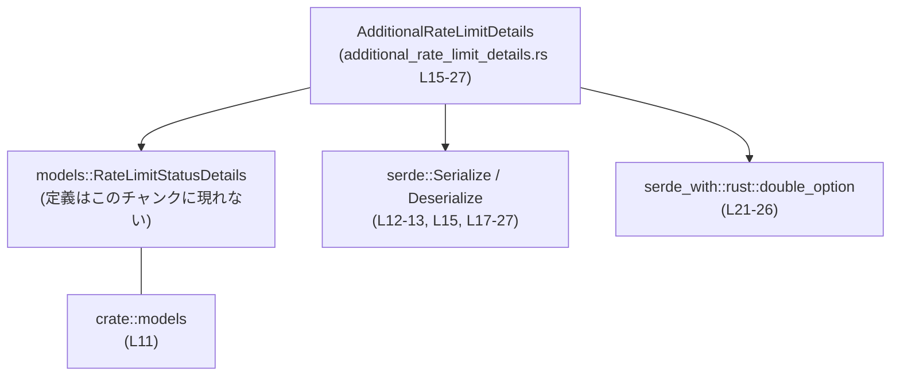
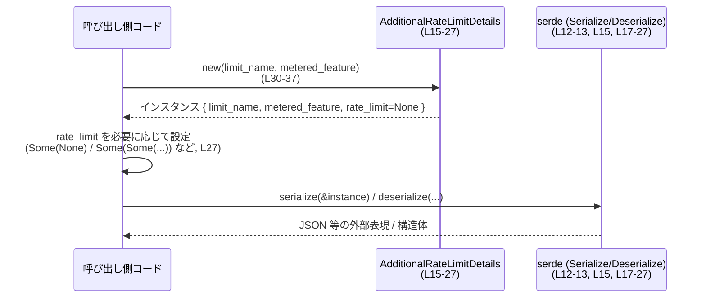

# codex-backend-openapi-models/src/models/additional_rate_limit_details.rs

## 0. ざっくり一言

追加のレート制限に関する情報（制限名・対象機能・レート制限の状態）を表現し、serde でシリアライズ／デシリアライズできるデータモデルを定義しているファイルです  
（根拠: `additional_rate_limit_details.rs:L11-13`, `L15-27`）。

---

## 1. このモジュールの役割

### 1.1 概要

- このモジュールは OpenAPI 仕様から自動生成されたモデルの一つであり  
  `AdditionalRateLimitDetails` 構造体を定義します  
  （根拠: 自動生成コメント `L1-8`, 構造体定義 `L15-27`）。
- 構造体は以下を保持します（根拠: `L17-20`, `L21-27`）。
  - `limit_name`: レート制限の名前
  - `metered_feature`: この制限が適用されるメータリング対象の機能名
  - `rate_limit`: レート制限の状態詳細（`Option<Option<Box<models::RateLimitStatusDetails>>>`）

### 1.2 アーキテクチャ内での位置づけ

- このファイルは `crate::models` モジュールの一部であり、同モジュール内の `RateLimitStatusDetails` 型に依存します  
  （根拠: `use crate::models; L11`, `models::RateLimitStatusDetails L27`）。
- serde を利用して JSON 等との相互変換を行うための属性が付与されています  
  （根拠: `use serde::Serialize; use serde::Deserialize; L12-13`, `derive(Serialize, Deserialize) L15`, `#[serde(...)] L17-27`）。
- `serde_with::rust::double_option` を使い、`rate_limit` フィールドで  
  「フィールド欠如」「明示的な null」「値あり」の 3 通りを区別できるようにしています  
  （根拠: `with = "::serde_with::rust::double_option" L24`, 型 `Option<Option<...>> L27`）。

主要な依存関係を Mermaid 図で表すと次のようになります。



### 1.3 設計上のポイント

- **シリアライズ／デシリアライズ前提のモデル**  
  - `Serialize`, `Deserialize` を derive し、フィールドに `#[serde(...)]` 属性を付与しています  
    （根拠: `L15`, `L17-27`）。
- **フィールドはすべて公開**  
  - `limit_name`, `metered_feature`, `rate_limit` はすべて `pub` であり、外部から直接読み書きできます  
    （根拠: `pub limit_name: String L18`, `pub metered_feature: String L20`, `pub rate_limit: ... L27`）。
- **二重 Option + `double_option` による 3 値表現**  
  - `rate_limit` は `Option<Option<Box<models::RateLimitStatusDetails>>>` 型で、  
    serde の `with="::serde_with::rust::double_option"` と組み合わせて 3 状態を区別します  
    （根拠: `L21-27`）。
- **シンプルなコンストラクタ**  
  - `new` 関数は必須の 2 フィールドを引数に取り、そのまま代入し、`rate_limit` は `None` に初期化します  
    （根拠: `L30-37`）。
- **状態や並行性を持たない単純なデータ構造**  
  - 内部に可変参照やスレッド同期プリミティブはなく、ただの値コンテナです  
    （根拠: 全フィールドが所有型／Option／Box のみ `L18-20`, `L27`、`impl` が `new` のみ `L30-37`）。

---

## 2. コンポーネント一覧（インベントリー）

このチャンクに現れる型・関数の一覧です。

### 2.1 型

| 名前 | 種別 | 役割 / 用途 | 根拠 |
|------|------|------------|------|
| `AdditionalRateLimitDetails` | 構造体 | 追加レート制限のメタ情報と、詳細なレート制限状態を表すデータモデル | `additional_rate_limit_details.rs:L15-27` |

### 2.2 関数 / メソッド

| 名前 | 所属 | シグネチャ（概要） | 役割 / 用途 | 根拠 |
|------|------|--------------------|------------|------|
| `new` | `impl AdditionalRateLimitDetails` | `fn new(limit_name: String, metered_feature: String) -> AdditionalRateLimitDetails` | 必須フィールドを指定してインスタンスを生成し、`rate_limit` を `None` に初期化するコンストラクタ | `additional_rate_limit_details.rs:L30-37` |

### 2.3 外部依存型（本ファイル外）

| 名前 | 種別 | 用途 | 根拠 |
|------|------|------|------|
| `models::RateLimitStatusDetails` | （不明・このチャンクに定義なし） | `rate_limit` フィールドでレート制限状態の詳細を表すために利用される型 | `additional_rate_limit_details.rs:L27` |

---

## 3. 公開 API と詳細解説

### 3.1 型一覧（構造体など）

#### AdditionalRateLimitDetails

- 定義:

  ```rust
  #[derive(Clone, Default, Debug, PartialEq, Serialize, Deserialize)]
  pub struct AdditionalRateLimitDetails {
      #[serde(rename = "limit_name")]
      pub limit_name: String,
      #[serde(rename = "metered_feature")]
      pub metered_feature: String,
      #[serde(
          rename = "rate_limit",
          default,
          with = "::serde_with::rust::double_option",
          skip_serializing_if = "Option::is_none"
      )]
      pub rate_limit: Option<Option<Box<models::RateLimitStatusDetails>>>,
  }
  ```

  （根拠: `additional_rate_limit_details.rs:L15-27`）

- 主な特徴
  - `Clone`, `Default`, `Debug`, `PartialEq`, `Serialize`, `Deserialize` を自動実装  
    （根拠: `derive(...) L15`）。
  - `limit_name`, `metered_feature` は JSON 側では `"limit_name"`, `"metered_feature"` というフィールド名にマッピングされます  
    （根拠: `#[serde(rename = "limit_name")] L17`, `#[serde(rename = "metered_feature")] L19`）。
  - `rate_limit` は
    - JSON フィールド名: `"rate_limit"`
    - デフォルト値: `None`
    - 外側の `Option` が `None` のときはシリアライズ時にフィールド自体を出力しない  
      （`skip_serializing_if = "Option::is_none"`）  
      （根拠: `L21-27`）。
    - `serde_with::rust::double_option` により、  
      - `None` → フィールドが欠如  
      - `Some(None)` → `{"rate_limit": null}`  
      - `Some(Some(...))` → `{"rate_limit": { ... }}`  
      のように区別されます（`double_option` の仕様 + `L24-27`）。

### 3.2 関数詳細

#### `AdditionalRateLimitDetails::new(limit_name: String, metered_feature: String) -> AdditionalRateLimitDetails`

**概要**

- `AdditionalRateLimitDetails` のインスタンスを生成するためのコンストラクタです。
- 引数で `limit_name` と `metered_feature` を受け取り、そのまま対応するフィールドに格納し、`rate_limit` は未設定 (`None`) にします  
  （根拠: `additional_rate_limit_details.rs:L30-37`）。

**引数**

| 引数名 | 型 | 説明 | 根拠 |
|--------|----|------|------|
| `limit_name` | `String` | レート制限の名称を表す文字列。内容の制約はこの関数内では行われない。 | `L31`, `L33` |
| `metered_feature` | `String` | メータリング対象の機能名を表す文字列。内容の制約はこの関数内では行われない。 | `L31`, `L34` |

**戻り値**

- 型: `AdditionalRateLimitDetails`（根拠: `L31`）
- フィールドの状態:
  - `limit_name`: 引数 `limit_name` の値
  - `metered_feature`: 引数 `metered_feature` の値
  - `rate_limit`: `None`（未設定）  
    （根拠: フィールド初期化 `rate_limit: None L35`）

**内部処理の流れ**

1. 関数シグネチャで 2 つの `String` 引数を受け取る（根拠: `L31`）。
2. `AdditionalRateLimitDetails { ... }` のリテラル構文で新しいインスタンスを生成する（根拠: `L32`）。
3. 構造体フィールドに以下の値を代入する（根拠: `L33-35`）。
   - `limit_name` フィールドに引数 `limit_name`
   - `metered_feature` フィールドに引数 `metered_feature`
   - `rate_limit` フィールドに `None`
4. 生成したインスタンスをそのまま返す（構造体リテラル式が関数の最終式であるため）  
   （根拠: `L32-37`）。

**Examples（使用例）**

1. **基本的な生成**

   同一クレート内の別モジュールから利用する例です（`RateLimitStatusDetails` 自体の初期化はこのチャンクでは不明のため省略します）。

   ```rust
   use crate::models::AdditionalRateLimitDetails;                 // このファイルで定義された型をインポートする

   fn create_basic_details() -> AdditionalRateLimitDetails {      // AdditionalRateLimitDetails を返す関数
       let limit_name = "daily_requests".to_string();             // レート制限名を String として用意する
       let feature = "api_usage".to_string();                     // メータリング対象の機能名を String として用意する

       let details = AdditionalRateLimitDetails::new(             // new を呼び出してインスタンスを生成する
           limit_name,                                            // limit_name フィールドに入る
           feature,                                               // metered_feature フィールドに入る
       );

       assert!(details.rate_limit.is_none());                     // new 直後は rate_limit が None であることを確認する
       details                                                    // 生成したインスタンスを呼び出し元に返す
   }
   ```

2. **`rate_limit` を後から設定する**

   `rate_limit` に値を設定する際は、二重の `Option` と `Box` を扱います。

   ```rust
   use crate::models::{AdditionalRateLimitDetails, RateLimitStatusDetails}; // 依存型をインポートする

   fn set_rate_limit_example() -> AdditionalRateLimitDetails {    // 例として AdditionalRateLimitDetails を返す
       let mut details = AdditionalRateLimitDetails::new(         // まずは new で生成する
           "daily_requests".to_string(),                          // limit_name
           "api_usage".to_string(),                               // metered_feature
       );

       // RateLimitStatusDetails の具体的なフィールド構成はこのチャンクには現れないため、
       // ここでは仮にどこか別の関数から取得したものとする
       let status: RateLimitStatusDetails = get_status_from_elsewhere(); // 定義は別ファイル側に依存する

       details.rate_limit = Some(Some(Box::new(status)));         // フィールドを「値あり」として設定する

       details                                                    // 設定済みのインスタンスを返す
   }
   ```

   `get_status_from_elsewhere` の実装や `RateLimitStatusDetails` の詳細は、このチャンクからは分かりません。

**Errors / Panics**

- `Result` を返さず、関数内部でも `panic!` や `unwrap` などを呼び出していないため、  
  通常の呼び出しで `Err` を返したり panic したりすることはありません  
  （根拠: 関数本体が単純な構造体初期化のみ `L31-37`）。
- したがって、エラー処理は不要です。

**Edge cases（エッジケース）**

- `limit_name` / `metered_feature` が空文字列や非常に長い文字列でも、そのまま格納されます。  
  バリデーションは行われません（根拠: 操作が単純代入のみ `L33-34`）。
- `rate_limit` は常に `None` で初期化されるため、コンストラクタだけでは  
  「明示的に null」を表す `Some(None)` や「値あり」の `Some(Some(...))` にはなりません  
  （根拠: `rate_limit: None L35`）。

**使用上の注意点**

- 必須フィールドである `limit_name` と `metered_feature` の妥当性（フォーマットや文字数など）は  
  この関数ではチェックされないため、必要であれば呼び出し側で検証する必要があります。
- `rate_limit` の意味は二重の `Option` により次のように分かれます（`double_option` の仕様 + `L21-27`）。
  - `None`: フィールド自体がリクエスト／レスポンスに含まれない（「未指定」）
  - `Some(None)`: フィールドは含まれるが、値が `null`（「明示的に null」）
  - `Some(Some(Box<...>))`: フィールドが含まれ、値にレート制限の詳細が入る
- 上記 3 通りをクライアント／サーバの両側で統一的に解釈することが重要です。

### 3.3 その他の関数

- このファイルには `new` 以外の関数やメソッドは定義されていません  
  （根拠: `impl AdditionalRateLimitDetails { ... }` の中身が `new` のみ `L30-37`）。

---

## 4. データフロー

### 4.1 代表的な処理シナリオ

この構造体に関する典型的なデータフローは、次の 2 段階です。

1. アプリケーションコードが `AdditionalRateLimitDetails::new` を使ってインスタンスを生成し、必要に応じて `rate_limit` を設定する（根拠: `L30-37`, `L27`）。
2. serde により、インスタンスが JSON などの外部表現にシリアライズ／デシリアライズされる（根拠: `derive(Serialize, Deserialize) L15`, `#[serde(...)] L17-27`）。

### 4.2 シーケンス図



- フィールド `rate_limit` は、シリアライズ時に `None` かどうかで「キーの有無」が決まり、  
  `Some(None)` かどうかで「値が null かどうか」が決まります  
  （根拠: `skip_serializing_if = "Option::is_none" L25`, `with = "::serde_with::rust::double_option" L24`, `Option<Option<...>> L27`）。

---

## 5. 使い方（How to Use）

### 5.1 基本的な使用方法

最も基本的な使い方は、必須フィールドのみでインスタンスを作り、必要に応じて `rate_limit` を設定する流れです。

```rust
use crate::models::AdditionalRateLimitDetails;                 // このモデルをインポートする

fn main() {                                                    // エントリポイント
    let details = AdditionalRateLimitDetails::new(             // new でインスタンス生成
        "daily_requests".to_string(),                          // limit_name
        "api_usage".to_string(),                               // metered_feature
    );

    // new 直後は rate_limit が None のため、シリアライズ時には "rate_limit" フィールドは出力されない
    println!("{:?}", details);                                 // Debug トレイトが derive されているので {:?} で出力できる
}
```

### 5.2 よくある使用パターン

1. **「未設定」状態のまま送受信する**

   `rate_limit` が不要、またはサーバ側で決定される場合は、`new` のまま何も設定せず送信します。

   ```rust
   let details = AdditionalRateLimitDetails::new(               // 必須項目だけ指定する
       "daily_requests".to_string(),                            // limit_name
       "api_usage".to_string(),                                 // metered_feature
   );
   // serde_json::to_string(&details)?; // シリアライズすると "rate_limit" キーは含まれない
   ```

2. **明示的に `null` を送りたい場合**

   API 側で「レート制限情報をリセットする」などの意味で `null` を明示したい場合は `Some(None)` を使います。

   ```rust
   let mut details = AdditionalRateLimitDetails::new(           // まずは new で生成
       "daily_requests".to_string(),                            // limit_name
       "api_usage".to_string(),                                 // metered_feature
   );

   details.rate_limit = Some(None);                             // 「キーは出すが値は null」にしたい場合

   // シリアライズ結果は {"limit_name": "...", "metered_feature": "...", "rate_limit": null} のようになる
   ```

3. **値ありのレート制限状態を設定する**

   ```rust
   use crate::models::{AdditionalRateLimitDetails, RateLimitStatusDetails}; // 両方をインポート

   fn with_status(status: RateLimitStatusDetails) -> AdditionalRateLimitDetails { // 状態を受け取り構造体を返す
       let mut details = AdditionalRateLimitDetails::new(         // インスタンスを作る
           "daily_requests".to_string(),                          // limit_name
           "api_usage".to_string(),                               // metered_feature
       );

       details.rate_limit = Some(Some(Box::new(status)));         // 「値あり」を設定する

       details                                                    // 完成したインスタンスを返す
   }
   ```

   `RateLimitStatusDetails` のフィールド構成はこのチャンクには存在しないため、  
   具体的な初期化コードは別ファイルの定義に依存します。

### 5.3 よくある間違い

- **`None` と `Some(None)` の混同**

  ```rust
  // 例: フィールドを消したいのか、明示的に null にしたいのかで値が異なる

  let mut details = AdditionalRateLimitDetails::new(
      "daily_requests".to_string(),
      "api_usage".to_string(),
  );

  details.rate_limit = None;          // フィールド自体がシリアライズ時に出力されない（「未指定」）

  details.rate_limit = Some(None);    // フィールドは出力されるが値は null（「明示的に null」）
  ```

  この違いは API の意味論に影響する可能性があるため、仕様に合わせて使い分ける必要があります  
  （根拠: `skip_serializing_if = "Option::is_none" L25`, 二重 Option + `double_option` の使用 `L21-27`）。

### 5.4 使用上の注意点（まとめ）

- この構造体は値の格納とシリアライズ／デシリアライズのみを担い、  
  値の妥当性チェックやビジネスロジックは持ちません（根拠: `impl` に `new` のみ `L30-37`）。
- 二重 `Option` と `serde_with::rust::double_option` により、`rate_limit` の 3 状態（欠如／null／値あり）を  
  呼び出し側で正しく扱う必要があります（根拠: `L21-27`）。
- 構造体はイミュータブルではなく、`pub` フィールドとして公開されているため、  
  どこからでも値を書き換えることができます。書き換えを制限したい場合は、  
  アクセスをラップする別のレイヤを用意するのが一般的です（根拠: `pub` フィールド `L18-20`, `L27`）。

---

## 6. 変更の仕方（How to Modify）

### 6.1 新しい機能を追加する場合

- **新しいフィールドを追加したい場合**
  1. `AdditionalRateLimitDetails` 構造体に新しい `pub` フィールドを追加します  
     （根拠: 既存フィールド定義 `L17-20`, `L27`）。
  2. 必要であれば `#[serde(rename = "...")]` や `default`、`skip_serializing_if` などの属性を付与します。
  3. `new` コンストラクタにそのフィールドを追加するかどうかを検討します。  
     - 必須にしたい場合: `new` の引数と `L33-35` の初期化ロジックを拡張します。
     - 任意にしたい場合: 既存と同様に `default` や `Option` を使い、省略可能にします。

### 6.2 既存の機能を変更する場合

- **`rate_limit` の型や意味を変更する場合**
  - 影響範囲:
    - 構造体定義 `L21-27`
    - このフィールドを利用するすべての呼び出し側コード（このチャンクには現れない）
    - serde による JSON などの外部表現（`rename`, `default`, `skip_serializing_if`, `with` の挙動）
  - 注意点:
    - 型や serde 属性を変更すると API の互換性が変わるため、  
      既存クライアントとの互換性要件を確認する必要があります。
- **`new` の引数を増減させる場合**
  - 引数の追加／削除は、この関数を呼び出しているすべての箇所に影響します。  
    変更前後のシグネチャを比較し、コンパイラのエラーを手がかりに影響箇所を洗い出すのが一般的です  
    （根拠: `new` の唯一の定義 `L31`）。

---

## 7. 関連ファイル

このチャンクから確実に分かる関連先は次のとおりです。

| パス（推定レベル） | 役割 / 関係 | 根拠 |
|--------------------|------------|------|
| `crate::models` （モジュール） | `AdditionalRateLimitDetails` 自身と、`RateLimitStatusDetails` を含むモジュール。現在のファイルもこのモジュール配下で利用されている。 | `use crate::models; L11` |
| `models::RateLimitStatusDetails`（型定義ファイルはこのチャンクには現れない） | `rate_limit` フィールドの中身となるレート制限状態の詳細を表す型。具体的な定義場所やフィールド構成は本チャンクでは不明。 | `additional_rate_limit_details.rs:L27` |

---

## 付録: 安全性・エラー・テスト・性能などの観点

- **エラー処理**
  - このファイル内ではエラー型（`Result`）やパニックを発生させるコードは使用していません  
    （根拠: `L15-37` に `Result` や `panic!` 等が存在しない）。
- **並行性**
  - スレッドや非同期処理に関するコード（`async`, `Mutex`, `Arc` など）は一切含まれていません。  
    構造体自体は単なるデータの集合であり、スレッドセーフかどうかは内部フィールド型に依存します。
- **テスト**
  - このファイルにはテストコード（`#[test]` 付き関数など）は含まれていません（根拠: `L1-38`）。
- **性能 / スケーラビリティ**
  - 構造体は `String` と `Option<Box<...>>` のみで構成され、`new` も単純な代入のみのため、  
    このファイルだけから見た性能上のボトルネックは特にありません（根拠: `L15-27`, `L30-37`）。
- **セキュリティ**
  - この構造体はデータを保持するだけで入力検証は行わないため、  
    セキュリティ上のバリデーション（文字列長の制限やパターンチェックなど）が必要な場合は  
    呼び出し側や別レイヤで実装する必要があります。
