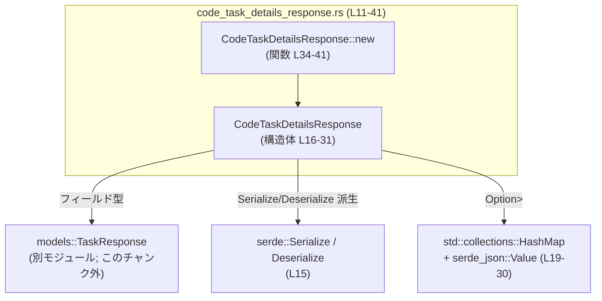

# codex-backend-openapi-models/src/models/code_task_details_response.rs

## 0. ざっくり一言

`CodeTaskDetailsResponse` は、コードタスクの詳細情報を返す API レスポンスモデルを表現するためのシンプルなデータ構造体です（`serde` を用いたシリアライズ／デシリアライズ前提）。  

---

## 1. このモジュールの役割

### 1.1 概要

- このモジュールは **コードタスクの詳細情報** をクライアントに返すためのレスポンスボディを表現する構造体を提供します。
- 必須情報として `TaskResponse` を持ち、オプション情報として *ユーザー側／アシスタント側／差分タスク側の現在のターン情報* を JSON 形式で保持します（`HashMap<String, serde_json::Value>`）。  
- OpenAPI Generator により自動生成されたモデルであり（コメントより、L1-8）、主にデータの入れ物として振る舞います。

### 1.2 アーキテクチャ内での位置づけ

このファイル内のコンポーネントと、直接依存している外部型との関係を表します。



- `CodeTaskDetailsResponse` は `crate::models::TaskResponse` に依存します（L11, L18）。
- シリアライズ／デシリアライズは `serde::Serialize`, `serde::Deserialize` の derive により行われます（L12-13, L15）。
- 可変長な付加情報は `Option<HashMap<String, serde_json::Value>>` として保持され、JSON にマッピングされます（L19-20, L21-25, L26-30）。

### 1.3 設計上のポイント

- **データコンテナ型**  
  ビジネスロジックは持たず、レスポンスのフィールドをまとめるだけの構造体になっています（L16-31）。
- **Box による所有権管理**  
  `task` フィールドは `Box<models::TaskResponse>` で保持されます（L18）。  
  これは構造体サイズの制御や所有権の一元化を意図したレイアウトと考えられますが、詳細な意図はコードからは断定できません。
- **オプショナルな追加情報**  
  3 種類の「現在のターン」情報はすべて `Option<HashMap<...>>` で、`None` のときは JSON へシリアライズされません（`skip_serializing_if = "Option::is_none"`、L19, L21-24, L26-29）。
- **トレイト derive による安全な基本機能**  
  `Clone`, `Default`, `Debug`, `PartialEq`, `Serialize`, `Deserialize` が derive されています（L15）。  
  これにより、コピー・デフォルト生成・デバッグ表示・比較・JSON との変換が、unsafe コードなしで自動的に提供されています。
- **エラーハンドリング・並行性**  
  このファイル内にはエラー処理ロジックや非同期処理・スレッド関連コードは存在せず、純粋なデータ型定義のみです（L11-41）。  
  `Send` / `Sync` などの並行性トレイトを実装するかどうかは、`TaskResponse` や `serde_json::Value` の実装に依存するため、このチャンクだけからは判断できません。

---

## 2. 主要な機能一覧

このモジュールが提供するおもな機能は次のとおりです。

- `CodeTaskDetailsResponse` 構造体:  
  コードタスク詳細レスポンス全体（タスク本体 + 各種「現在のターン」情報）を表現する（L16-31）。
- `CodeTaskDetailsResponse::new`:  
  必須フィールド `task` のみを受け取り、オプションフィールドをすべて `None` に初期化したインスタンスを生成するコンストラクタ（L34-41）。
- `Serialize` / `Deserialize` の派生:  
  上記の構造体を JSON などへ安全にシリアライズ／デシリアライズする（L15）。

---

## 3. 公開 API と詳細解説

### 3.1 型一覧（構造体・列挙体など）

#### コンポーネントインベントリー（型）

| 名前 | 種別 | 役割 / 用途 | 定義位置 |
|------|------|------------|----------|
| `CodeTaskDetailsResponse` | 構造体 | コードタスク詳細レスポンス全体を表すデータコンテナ | `code_task_details_response.rs:L16-31` |

**`CodeTaskDetailsResponse` のフィールド**

すべて `pub` フィールドとして公開されています（L16-31）。

- `task: Box<models::TaskResponse>`（L18）  
  - 必須フィールド。タスク本体を表すレスポンスモデルへの Box 参照です。  
  - `TaskResponse` 自体は `crate::models` モジュールに定義されており、このチャンク内には実装は現れません。
- `current_user_turn: Option<HashMap<String, serde_json::Value>>`（L19-20）  
  - 現在のユーザー側のターン情報を任意のキー／値ペアの集合として保持します。  
  - `skip_serializing_if = "Option::is_none"` により、`None` の場合は JSON のフィールドが出力されません。
- `current_assistant_turn: Option<HashMap<String, serde_json::Value>>`（L21-25）  
  - 現在のアシスタント側のターン情報。型・シリアライズ条件は上記と同様です。
- `current_diff_task_turn: Option<HashMap<String, serde_json::Value>>`（L26-30）  
  - 現在の差分タスク側のターン情報。型・シリアライズ条件は上記と同様です。

Rust の安全性の観点では、これらはすべて所有権を持つフィールドであり、ライフタイムや参照の借用を直接扱っていないため、メモリ安全性上の複雑さは少ない構造になっています。

### 3.2 関数詳細

#### `CodeTaskDetailsResponse::new(task: models::TaskResponse) -> CodeTaskDetailsResponse`

**定義位置**: `code_task_details_response.rs:L34-41`

```rust
impl CodeTaskDetailsResponse {
    pub fn new(task: models::TaskResponse) -> CodeTaskDetailsResponse { // L34
        CodeTaskDetailsResponse {                                      // L35
            task: Box::new(task),                                      // L36
            current_user_turn: None,                                   // L37
            current_assistant_turn: None,                              // L38
            current_diff_task_turn: None,                              // L39
        }                                                              // L40
    }                                                                  // L41
}
```

**概要**

- 必須フィールド `task` だけを引数として受け取り、他の 3 つのオプションフィールドをすべて `None` に設定した `CodeTaskDetailsResponse` インスタンスを生成します。

**引数**

| 引数名 | 型 | 説明 |
|--------|----|------|
| `task` | `models::TaskResponse` | タスク本体のレスポンス情報。呼び出し側から所有権ごと渡され、内部で `Box` に包まれます（L34, L36）。 |

**戻り値**

- 型: `CodeTaskDetailsResponse`  
- 内容: 引数で渡された `task` を `Box` で保持し、`current_user_turn` / `current_assistant_turn` / `current_diff_task_turn` をすべて `None` にした新しいインスタンス（L35-39）。

**内部処理の流れ**

1. 引数 `task: models::TaskResponse` を受け取る（L34）。  
   - この時点で所有権は呼び出し元から関数へ移動します（Rust の所有権の基本ルール）。
2. `CodeTaskDetailsResponse { ... }` リテラルで構造体を初期化する（L35）。
3. `task` フィールドに `Box::new(task)` を設定し、`TaskResponse` の所有権を `Box` に移します（L36）。
4. オプションの 3 フィールドは `None` で初期化されます（L37-39）。
5. 完成した `CodeTaskDetailsResponse` インスタンスが呼び出し元に返されます（L35-41）。

**Examples（使用例）**

以下は、`TaskResponse` がすでに別の場所で生成されている前提での使用例です。

```rust
use codex_backend_openapi_models::models::{CodeTaskDetailsResponse, TaskResponse};
use std::collections::HashMap;
use serde_json::json;

fn build_response(task: TaskResponse) -> CodeTaskDetailsResponse {
    // 必須フィールド task のみを指定してレスポンスを生成する
    let mut resp = CodeTaskDetailsResponse::new(task); // task の所有権が resp.task(Box 内) に移動

    // 必要に応じて current_user_turn を埋める
    let mut user_turn = HashMap::new();                           // 空の HashMap を作成
    user_turn.insert("step".to_string(), json!(1));               // serde_json::Value を値として格納
    user_turn.insert("status".to_string(), json!("editing"));     // 任意のキーを追加

    resp.current_user_turn = Some(user_turn);                     // Option に包んで代入

    resp                                                         // 完成したレスポンスを返す
}
```

**Errors / Panics**

- この関数は `Result` ではなく生の `CodeTaskDetailsResponse` を返しており、内部に fallible な処理は見当たりません（L34-41）。
- `Box::new` は通常メモリアロケーションに失敗すると `std::alloc::AllocError` によってプロセス全体が abort する挙動をとりうるものの、これは Rust ランタイムレベルの挙動であり、関数内で個別に捕捉されてはいません。一般的には「メモリ不足時にのみ abort しうる」と理解されます。

**Edge cases（エッジケース）**

- `task` がどのような内容でも、関数はそのまま `Box` に包んで保持します。`TaskResponse` の妥当性検証はこの関数では行われません（L36）。
- オプションフィールドはすべて `None` に固定されるため、このコンストラクタから生成した直後のインスタンスには「現在のターン」情報は含まれません（L37-39）。
- `task` に非常に大きなデータが含まれている場合でも、`Box` に包むだけで特別な扱いはありません。メモリ使用量やシリアライズ時の負荷は `TaskResponse` 側のサイズに依存します。

**使用上の注意点**

- `task` の所有権が `new` に渡されるため、呼び出し後に元の変数は使用できなくなります（Rust の所有権ルール）。  
  必要なら `task.clone()` してから渡す必要があります（`TaskResponse` が `Clone` を実装している場合）。
- オプションフィールドはいずれも `None` で初期化されるため、必要な場合は呼び出し後に `Some(...)` を代入する前提になります（L37-39）。
- バリデーションは一切行われていないため、「必須キーが存在する」などの制約が必要であれば、呼び出し側または別の層で検証を行う必要があります。

### 3.3 その他の関数

明示的に定義された関数は `CodeTaskDetailsResponse::new` のみです（L34-41）。  

ただし、以下のトレイト実装は `derive` により暗黙に提供されます（L15）。

- `Clone` / `Default` / `Debug` / `PartialEq`
- `Serialize` / `Deserialize`

これらはマクロ展開されたコードであり、このチャンクには具体的な実装は現れません。

---

## 4. データフロー

このファイル単体では呼び出し元・呼び出し先は定義されていませんが、OpenAPI モデルであり `Serialize` / `Deserialize` を derive していることから、典型的には次のようなフローが想定されます（想定であり、実際の呼び出し元コードはこのチャンクには現れません）。

```mermaid
sequenceDiagram
    participant H as "Webハンドラ等の呼び出し元<br/>(このチャンク外)"
    participant R as "CodeTaskDetailsResponse<br/>(L16-31)"
    participant S as "Serde シリアライザ<br/>(外部ライブラリ)"

    H->>H: TaskResponse を構築（別モジュール; このチャンク外）
    H->>R: CodeTaskDetailsResponse::new(task) 呼び出し (L34-41)
    H->>R: current_*_turn フィールドに値を代入 (必要に応じて)
    H->>S: R を JSON へシリアライズ（Serialize 派生; L15）
    S-->>H: JSON 文字列を返す
```

この図は、「`CodeTaskDetailsResponse` をレスポンスモデルとして組み立て、`serde` で JSON に変換して返す」典型パターンを表現しています。  
実際にどの Web フレームワークやどのようなルートで使用されているかは、このチャンクからは分かりません。

---

## 5. 使い方（How to Use）

### 5.1 基本的な使用方法

`TaskResponse` が既に用意されているケースで、最小限のレスポンスを組み立てて JSON に変換する例です。

```rust
use codex_backend_openapi_models::models::{CodeTaskDetailsResponse, TaskResponse};
use serde_json::to_string;

fn build_minimal_json(task: TaskResponse) -> serde_json::Result<String> {
    // CodeTaskDetailsResponse のインスタンスを new で作成
    // task の所有権は Box 内へ移動する
    let resp = CodeTaskDetailsResponse::new(task);

    // serde_json::to_string で JSON 文字列にシリアライズ
    // current_* フィールドは None なので JSON 出力には含まれない
    to_string(&resp)
}
```

### 5.2 よくある使用パターン

1. **必須フィールドのみのレスポンス**

```rust
let task: TaskResponse = /* ... */;                       // TaskResponse を用意
let resp = CodeTaskDetailsResponse::new(task);            // current_* はすべて None
// そのまま JSON へシリアライズすれば、"task" だけを含むレスポンスになる
```

1. **ユーザーターンのみを付加**

```rust
use std::collections::HashMap;
use serde_json::json;

let task: TaskResponse = /* ... */;
let mut resp = CodeTaskDetailsResponse::new(task);

let mut user_turn = HashMap::new();
user_turn.insert("cursor".to_string(), json!({"line": 10, "column": 5}));
resp.current_user_turn = Some(user_turn); // JSON 出力時に "current_user_turn" が含まれる
```

1. **`Default` トレイトを利用する（あまり一般的ではないが可能）**

```rust
// Default から作る場合、task も含めすべてデフォルト値になるので、通常は API モデルとしては不完全
let mut resp = CodeTaskDetailsResponse::default(); // L15 により derive
// 呼び出し側で task をあとから設定する必要がある
// resp.task = Box::new(task); // TaskResponse を用意してから代入
```

### 5.3 よくある間違い

```rust
// 間違い例: task フィールドへ Box なしで代入しようとする
// let wrong = CodeTaskDetailsResponse {
//     task: some_task_response, // 型が TaskResponse で Box<...> ではないためコンパイルエラー
//     current_user_turn: None,
//     current_assistant_turn: None,
//     current_diff_task_turn: None,
// };

// 正しい例: new を使うか、Box::new で明示的に包む
let task: TaskResponse = /* ... */;
let correct1 = CodeTaskDetailsResponse::new(task);
// あるいは:
let task2: TaskResponse = /* ... */;
let correct2 = CodeTaskDetailsResponse {
    task: Box::new(task2),
    current_user_turn: None,
    current_assistant_turn: None,
    current_diff_task_turn: None,
};
```

### 5.4 使用上の注意点（まとめ）

- **所有権**  
  - `new` の引数 `task` は所有権ごと消費されます。`task` を他でも利用したい場合はクローンするなどの工夫が必要です（L34-36）。
- **オプションフィールドのシリアライズ**  
  - `current_*_turn` が `None` の場合、そのフィールド自体が JSON 出力から省略されます（L19, L21-24, L26-29）。  
    クライアント側は「フィールドが存在しない」ことを `null` ではなく「未設定」として扱う必要があります。
- **セキュリティ面**  
  - `HashMap<String, serde_json::Value>` に任意の JSON を格納できるため、クライアントへそのまま出す値は上位層で信頼性・サニタイズを検討する必要があります。  
    この構造体自身はデータを変換・検査せず、単に保持するだけです。
- **並行性**  
  - この構造体には内部可変性（`RefCell` など）や同期プリミティブがなく、単なるデータの集まりです。  
  - `Send` / `Sync` かどうかは `TaskResponse` および `serde_json::Value` の実装に依存し、このチャンクからは断定できません。
- **パフォーマンス**  
  - `Box<models::TaskResponse>` により、構造体自体のサイズはポインタ分に抑えられますが、実際のメモリ使用量は `TaskResponse` の内容に依存します（L18, L36）。  
  - 大きな `HashMap` や複雑な `serde_json::Value` を詰め込むと、シリアライズ・デシリアライズのコストが増加します。

---

## 6. 変更の仕方（How to Modify）

### 6.1 新しい機能を追加する場合

- **新しいフィールドを追加したい場合**
  1. `CodeTaskDetailsResponse` に `pub` フィールドを追加する（L16-31 付近）。
  2. OpenAPI スキーマとの整合を取るため、必要に応じて `#[serde(rename = "...")]` などの属性を付ける。
  3. `new` で初期値を与えたい場合は、`CodeTaskDetailsResponse::new` の構造体初期化部分（L35-39）に新フィールドを追加する。
  4. 既存クライアントとの互換性を考える場合、オプションフィールド (`Option<T>`) + `skip_serializing_if` を用いると、後方互換な拡張をしやすくなります。

- **バリデーション処理を追加したい場合**
  - このファイルは現在純粋なモデル層であり、バリデーションロジックは含まれていません。  
    バリデーションをここに追加すると、この型がロジックを持つことになり設計が変わるため、別のサービス層・ビジネスロジック層で検証するか、独立したコンストラクタ／ビルダを用意する方法が考えられます（設計方針はこのチャンクからは分かりません）。

### 6.2 既存の機能を変更する場合

- **`task` フィールドの型を変更する場合**
  - `Box<models::TaskResponse>` から別の型に変えると、シリアライズ形式および呼び出し側のコードに広範な影響があります（L18, L36）。
  - OpenAPI 仕様上の `task` フィールドの型と一致しているか確認が必要です。

- **`current_*_turn` の型やシリアライズ条件を変更する場合**
  - `Option<HashMap<String, serde_json::Value>>` を別の型に変更すると、レスポンスの JSON 形式が変わります（L19-20, L21-25, L26-30）。
  - `skip_serializing_if` を外すと、`None` の場合でも `null` として出力されるようになるため、クライアント側の期待と合致しているか確認が必要です。

- **`new` の振る舞いを変える場合**
  - `new` がオプションフィールドを `Some` で初期化するように変更すると、既存コードが「呼び出し後に自分で設定する」前提で書かれている場合に影響が出ます（L34-39）。
  - 仕様として「`new` は最小限のレスポンスを作る」のか「完全なデフォルトレスポンスを作る」のかを整理したうえで変更する必要があります。

- **テストについて**
  - このファイルにはテストコードは含まれていません（L1-41）。  
    挙動に変更を加える場合は、別ファイルのテスト（存在すれば）や、この構造体を利用している API レイヤのテストを追加・更新する必要があります。

---

## 7. 関連ファイル

このモジュールと直接関係するコンポーネントは次のとおりです。

| パス / シンボル | 役割 / 関係 |
|-----------------|------------|
| `crate::models::TaskResponse` | `CodeTaskDetailsResponse.task` フィールドの型として使用されるレスポンスモデル（L11, L18）。ファイルパスはこのチャンクには現れません。 |
| `serde::Serialize` / `serde::Deserialize` | `CodeTaskDetailsResponse` を JSON などにシリアライズ／デシリアライズするためのトレイト。derive により実装されます（L12-13, L15）。 |
| `std::collections::HashMap` | `current_*_turn` フィールドで任意のキー／値ペア集合を表現するための標準ライブラリのマップ型（L19-20, L21-25, L26-30）。 |
| `serde_json::Value` | `current_*_turn` の値部分として使われる汎用 JSON 値表現（L19-20, L21-25, L26-30）。 |

このファイルは、OpenAPI 仕様から自動生成されたモデル層の一部として設計されており、主な責務は「API のレスポンス形状を Rust の型で表現すること」にあります。
