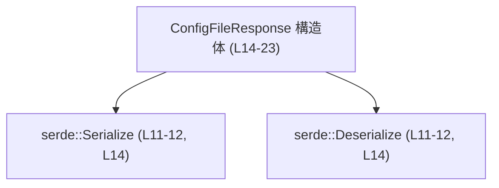
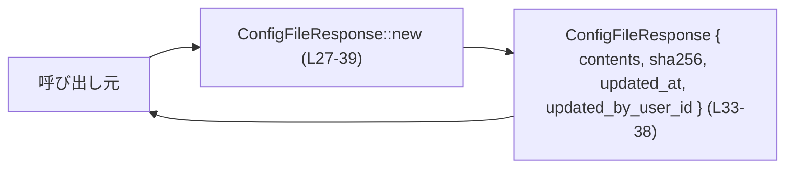
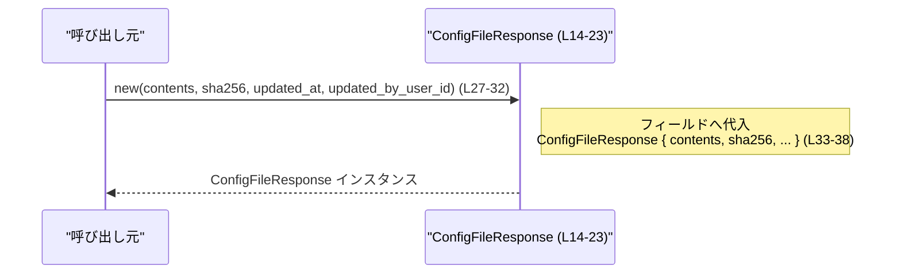

codex-backend-openapi-models/src/models/config_file_response.rs のコード解説です。

---

## 0. ざっくり一言

- OpenAPI Generator により生成された、設定ファイルに関するレスポンスボディを表現するシリアライズ可能なデータ構造と、そのコンストラクタ関数を定義しているファイルです（config_file_response.rs:L1-8, L14-23）。
- すべてのフィールドは `Option<String>` で、JSON などへシリアライズする際に `None` のフィールドは出力されません（config_file_response.rs:L16-23）。

---

## 1. このモジュールの役割

### 1.1 概要

- このモジュールは、API から返される「ConfigFileResponse」というレスポンスオブジェクトを Rust の構造体として表現します（config_file_response.rs:L14-23）。
- フィールドとして、ファイル内容 (`contents`)、ハッシュ値 (`sha256`)、更新日時 (`updated_at`)、更新者ユーザー ID (`updated_by_user_id`) を保持します（config_file_response.rs:L16-23）。
- `serde` の `Serialize` / `Deserialize` を実装しており、JSON などとの変換に対応します（config_file_response.rs:L11-12, L14）。

### 1.2 アーキテクチャ内での位置づけ

- 依存関係としては、シリアライズ／デシリアライズ用に `serde::Serialize` と `serde::Deserialize` を利用しています（config_file_response.rs:L11-12, L14）。
- コメントから、このファイル自体は OpenAPI ドキュメントから自動生成されたモデル層の一部であることが分かります（config_file_response.rs:L1-8）。

主要な依存関係を表す簡易図です。



### 1.3 設計上のポイント

- **純粋なデータ構造**  
  - `ConfigFileResponse` はフィールドのみを持つ構造体であり、ビジネスロジックは持たず、データ搬送用オブジェクト（DTO）的な設計になっています（config_file_response.rs:L14-23）。
- **オプショナルなフィールド**  
  - 4 つのフィールドすべてが `Option<String>` であり、値が欠けているケースを自然に表現できます（config_file_response.rs:L16-23）。
- **シリアライズ制御**  
  - 各フィールドには `#[serde(rename = "...", skip_serializing_if = "Option::is_none")]` が付与され、JSON などへのシリアライズ時に `None` のフィールドは出力されません（config_file_response.rs:L16-23）。
- **自動派生トレイト**  
  - `Clone`, `Default`, `Debug`, `PartialEq`, `Serialize`, `Deserialize` を `derive` しており、コピー、デフォルト生成、デバッグ出力、比較、シリアライズ／デシリアライズが容易です（config_file_response.rs:L14）。
- **コンストラクタ関数の提供**  
  - `impl` ブロック内で `ConfigFileResponse::new` が定義され、フィールドをまとめて安全に初期化するための入口となっています（config_file_response.rs:L26-39）。

---

## 2. 主要な機能一覧

- `ConfigFileResponse` 構造体: Config ファイルに関するレスポンスデータ（内容とメタ情報）を保持するコンテナ。
- `ConfigFileResponse::new`: 4 つのフィールドをまとめて指定して `ConfigFileResponse` インスタンスを生成するコンストラクタ。
- `serde` 連携: `Serialize` / `Deserialize` の実装により、JSON 等との相互変換を可能にする。

---

## 3. 公開 API と詳細解説

### 3.1 型一覧（構造体・列挙体など）

| 名前                 | 種別   | 役割 / 用途                                                                 | 定義位置                         |
|----------------------|--------|------------------------------------------------------------------------------|----------------------------------|
| `ConfigFileResponse` | 構造体 | 設定ファイル関連レスポンスの内容・ハッシュ・更新情報を保持するデータ構造体 | config_file_response.rs:L14-23  |

- `derive` 属性で `Clone`, `Default`, `Debug`, `PartialEq`, `Serialize`, `Deserialize` を実装しています（config_file_response.rs:L14）。

#### フィールド一覧

| フィールド名           | 型               | 説明                                            | 定義位置                         |
|------------------------|------------------|-------------------------------------------------|----------------------------------|
| `contents`             | `Option<String>` | ファイル内容を表す文字列（存在しない場合は `None`） | config_file_response.rs:L16-17  |
| `sha256`               | `Option<String>` | ファイル内容の SHA-256 ハッシュと思われる文字列     | config_file_response.rs:L18-19  |
| `updated_at`           | `Option<String>` | 更新日時（形式はコードからは不明）               | config_file_response.rs:L20-21  |
| `updated_by_user_id`   | `Option<String>` | 更新者ユーザー ID を表す文字列                   | config_file_response.rs:L22-23  |

> 日付形式や `sha256` の内容の正当性などは、このファイルからは検証されていません。

### 3.2 関数詳細

#### `ConfigFileResponse::new(contents: Option<String>, sha256: Option<String>, updated_at: Option<String>, updated_by_user_id: Option<String>) -> ConfigFileResponse`

**概要**

- 4 つのフィールド値を引数として受け取り、それらをそのまま格納した `ConfigFileResponse` インスタンスを生成するコンストラクタです（config_file_response.rs:L27-39）。
- バリデーションや変換処理は行わず、単純にフィールドへ代入します（config_file_response.rs:L33-38）。

**引数**

| 引数名              | 型               | 説明                                                                                          |
|---------------------|------------------|-----------------------------------------------------------------------------------------------|
| `contents`          | `Option<String>` | ファイル内容。`Some(String)` で内容あり、`None` で内容不明／未設定を表現します。             |
| `sha256`            | `Option<String>` | ハッシュ値。`Some(String)` の内容は検証されません。                                           |
| `updated_at`        | `Option<String>` | 更新日時文字列。フォーマットやタイムゾーンはこの関数では一切チェックされません。             |
| `updated_by_user_id`| `Option<String>` | 更新者ユーザー ID。任意の文字列をそのまま格納します。                                        |

（すべての引数と代入は config_file_response.rs:L27-38 に明示されています。）

**戻り値**

- `ConfigFileResponse`  
  - 引数で受け取った 4 つの値を対応するフィールドに格納した新しいインスタンスです（config_file_response.rs:L33-38）。

**内部処理の流れ（アルゴリズム）**

1. 関数引数として `contents`, `sha256`, `updated_at`, `updated_by_user_id` を受け取る（config_file_response.rs:L27-31）。
2. 構造体リテラル `ConfigFileResponse { .. }` を用いて、各引数を同名フィールドにそのまま代入する（config_file_response.rs:L33-38）。
3. 生成した `ConfigFileResponse` を返す（config_file_response.rs:L33-39）。

処理フロー図（この関数に限定）:



**Examples（使用例）**

1. すべてのフィールドを指定してインスタンスを生成する例:

```rust
use codex_backend_openapi_models::models::ConfigFileResponse; // モジュールパスはプロジェクト構成に依存するため一例です

fn build_response() -> ConfigFileResponse {
    // ファイル内容文字列を用意する
    let contents = Some("key = \"value\"".to_string());

    // SHA-256 ハッシュと思われる値を用意する
    let sha256 = Some("abcdef1234567890".to_string());

    // 更新日時の文字列（形式は任意）を用意する
    let updated_at = Some("2024-01-01T00:00:00Z".to_string());

    // 更新者ユーザーIDを用意する
    let updated_by_user_id = Some("user-123".to_string());

    // new コンストラクタで構造体を生成する
    ConfigFileResponse::new(
        contents,            // contents フィールドに設定
        sha256,              // sha256 フィールドに設定
        updated_at,          // updated_at フィールドに設定
        updated_by_user_id,  // updated_by_user_id フィールドに設定
    )
}
```

1. 一部の情報のみを設定し、他を `None` にする例:

```rust
fn build_partial_response() -> ConfigFileResponse {
    // 内容のみが分かっているケース
    ConfigFileResponse::new(
        Some("partial contents".to_string()), // contents にのみ値を設定
        None,                                 // sha256 は不明
        None,                                 // updated_at は不明
        None,                                 // updated_by_user_id は不明
    )
}
```

**Errors / Panics**

- この関数は常に正常に戻り値を返し、`Result` などのエラー型を返しません。
- 関数本体に `unwrap` や `panic!` などは存在せず、パニック条件もありません（config_file_response.rs:L27-39）。

**Edge cases（エッジケース）**

- すべての引数が `None` の場合  
  - フィールドがすべて `None` の `ConfigFileResponse` が作られます（config_file_response.rs:L33-38 の代入がそのまま行われる）。
- 空文字列 `""` が渡された場合  
  - 空文字列もそのまま `Some("")` として格納され、特別扱いはありません。バリデーションは行われません（config_file_response.rs:L33-38）。
- きわめて長い文字列や特定の形式でない日時文字列  
  - 関数内では長さや形式をチェックせず、そのまま格納します。

**使用上の注意点**

- **バリデーションがない**  
  - `sha256` フィールドに実際の SHA-256 でない文字列を渡しても、そのまま格納されます。整合性チェックは呼び出し側で行う前提の設計です（config_file_response.rs:L33-38）。
- **所有権とメモリ**  
  - 引数は `Option<String>` であり、`String` の所有権が `ConfigFileResponse` に移動します。呼び出し元側で同じ文字列を再利用したい場合は、事前に `.clone()` する必要があります。
- **スレッド安全性**  
  - フィールドは `Option<String>` のみであり、標準ライブラリの性質から `ConfigFileResponse` は `Send` および `Sync` を実装する型として扱えます。`Arc<ConfigFileResponse>` などでスレッド間共有しても、内部に可変状態はありません（可変参照を取らない限り安全）。

### 3.3 その他の関数

- このファイルには `new` 以外のメソッド／関数は定義されていません（config_file_response.rs:L26-40）。

---

## 4. データフロー

このセクションでは、本ファイル内で完結する代表的な処理として、`ConfigFileResponse::new` 呼び出し時のデータフローを示します。

### 4.1 コンストラクタ呼び出しのデータフロー

- 呼び出し元が 4 つの `Option<String>` 値を準備し、それらを `ConfigFileResponse::new` に渡します。
- `new` は引数をそのままフィールドに格納した構造体を返します。



### 4.2 シリアライズ／デシリアライズの概念的な流れ

このファイルでは直接 `serde_json` などは呼び出していませんが、`Serialize` / `Deserialize` の `derive` により、次のようなデータフローが可能になります（config_file_response.rs:L11-12, L14）。

```mermaid
graph LR
    J["JSON（\"contents\", \"sha256\", ...）"] -->|"serde::Deserialize (L11-12, L14)"| CFR["ConfigFileResponse (L14-23)"]
    CFR -->|"serde::Serialize (L11-12, L14)"| J
```

- フィールドが `None` の場合、そのフィールドはシリアライズ結果に含まれません（`skip_serializing_if = "Option::is_none"`、config_file_response.rs:L16-23）。

---

## 5. 使い方（How to Use）

### 5.1 基本的な使用方法

`ConfigFileResponse` を生成して JSON にシリアライズする典型的な例です。

```rust
use serde_json;                                     // JSON シリアライズ用クレートを利用する例
use codex_backend_openapi_models::models::ConfigFileResponse;

fn main() -> Result<(), Box<dyn std::error::Error>> {
    // 設定ファイルの内容文字列を用意する
    let contents = Some("key = \"value\"".to_string());

    // SHA-256ハッシュを用意する（値の正しさはここでは検証しない）
    let sha256 = Some("abcdef1234567890".to_string());

    // 更新日時文字列を用意する
    let updated_at = Some("2024-01-01T00:00:00Z".to_string());

    // 更新者ユーザーIDを用意する
    let updated_by_user_id = Some("user-123".to_string());

    // new で ConfigFileResponse インスタンスを生成する
    let resp = ConfigFileResponse::new(
        contents,
        sha256,
        updated_at,
        updated_by_user_id,
    );

    // serde_json を使って JSON 文字列にシリアライズする
    let json = serde_json::to_string_pretty(&resp)?; // None のフィールドは JSON に出力されない

    // 結果を標準出力に表示する
    println!("{}", json);

    Ok(())
}
```

このコードでは、本ファイルで実装された `Serialize` と `ConfigFileResponse::new` のみを利用しています。

### 5.2 よくある使用パターン

1. **デフォルト値から部分的に設定する**

`Default` 実装を利用すると、明示的に指定したいフィールドだけを上書きできます（config_file_response.rs:L14）。

```rust
fn build_with_default() -> ConfigFileResponse {
    ConfigFileResponse {
        // contents のみ値を設定
        contents: Some("minimal config".to_string()),
        // その他は Default::default() によって None になる
        ..Default::default()
    }
}
```

1. **レスポンスの比較・コピー**

`PartialEq` と `Clone` の実装により、比較や複製が簡単にできます（config_file_response.rs:L14）。

```rust
fn compare_responses(a: &ConfigFileResponse, b: &ConfigFileResponse) -> bool {
    // 内容が完全に一致するかどうかを比較する
    a == b
}

fn duplicate_response(resp: &ConfigFileResponse) -> ConfigFileResponse {
    // 構造体全体をクローンする
    resp.clone()
}
```

### 5.3 よくある間違い

1. **`Option<String>` ではなく `&str` を直接渡そうとしてコンパイルエラーになる**

```rust
// 間違い例（コンパイルエラーになる）
// ConfigFileResponse::new("content", None, None, None);

// 正しい例: String に変換し、Option で包む
let resp = ConfigFileResponse::new(
    Some("content".to_string()), // &str から String へ変換し Some で包む
    None,
    None,
    None,
);
```

1. **`None` のフィールドがシリアライズ出力に現れると思い込む**

- `skip_serializing_if = "Option::is_none"` により、`None` のフィールドは JSON などに出力されません（config_file_response.rs:L16-23）。
- クライアント側で「キーは常に存在する」と仮定するとバグの原因になります。

### 5.4 使用上の注意点（まとめ）

- **欠損値の扱い**  
  - すべてのフィールドが `Option<String>` であり、`None` は「値が送られてこなかった」あるいは「不明」の状態を表します。API クライアント側はキー欠損にも対応する必要があります（config_file_response.rs:L16-23）。
- **バリデーションの不存在**  
  - この構造体と `new` コンストラクタは、内容の妥当性（ハッシュの形式、日時フォーマットなど）を一切検証しません。検証が必要な場合は別レイヤーで行う必要があります（config_file_response.rs:L27-38）。
- **並行性**  
  - フィールドはすべて所有型 (`String`) を含む `Option` であり、内部に `Rc` や `RefCell` などの非スレッドセーフな型は含まれていません。このため、標準ライブラリの性質から `ConfigFileResponse` はスレッド間で安全に共有（`Send`/`Sync`）できますが、同時に書き換える場合は通常どおり同期原語（`Mutex` など）が必要です。
- **自動生成コードである点**  
  - 冒頭コメントに "Generated by: <https://openapi-generator.tech>" とあり、OpenAPI から自動生成されたコードであることがわかります（config_file_response.rs:L1-8）。再生成時に変更が上書きされる可能性があるため、直接編集する場合はプロジェクトの運用方針に注意が必要です。

---

## 6. 変更の仕方（How to Modify）

### 6.1 新しい機能を追加する場合

1. **フィールドを追加したい場合**
   - `ConfigFileResponse` に新しいフィールドを追加する（config_file_response.rs:L14-23）。
   - 追加フィールドにも `#[serde(rename = "...", skip_serializing_if = "Option::is_none")]` を付けるかどうかを決めて記述する（既存フィールドを参考にする、config_file_response.rs:L16-23）。
   - `new` 関数の引数リストと構造体初期化部分に新フィールドを追加する（config_file_response.rs:L27-38）。

2. **メソッドを追加したい場合**
   - `impl ConfigFileResponse { ... }` ブロック（config_file_response.rs:L26-40）内に新しいメソッドを追加する。
   - `&self` / `&mut self` / `self` のいずれを取るか、所有権と借用の設計を明確にする（特に並行使用を想定する場合）。

3. **注意点**
   - 自動生成ファイルであるため、OpenAPI の定義から再生成される運用であれば、OpenAPI スキーマ側で変更し直す必要がある可能性があります（config_file_response.rs:L1-8）。
   - 既存のクライアントとの互換性（新フィールドの必須／任意）を考慮する必要があります。

### 6.2 既存の機能を変更する場合

- **フィールド型の変更**
  - 例: `updated_at` を `Option<chrono::DateTime<Utc>>` に変えたい、といった場合、型変更に加えて、`serde` 用の属性やカスタムシリアライザ／デシリアライザが必要になります。
  - 既存クライアントとの互換性が崩れる可能性があるため、仕様レベルでの合意が必要です。

- **`new` コンストラクタのシグネチャ変更**
  - 引数の追加・削除・型変更を行うと、この関数を呼び出しているすべての箇所へ影響します（config_file_response.rs:L27-39）。
  - 互換性を保つ場合は、古いシグネチャを残したまま、新しいコンストラクタを別名で追加する方法もあります。

- **シリアライズ挙動の変更**
  - `skip_serializing_if = "Option::is_none"` を外すと、`null` が明示的に出力されるようになります。API クライアント側の実装がそれに依存していないか確認が必要です（config_file_response.rs:L16-23）。

---

## 7. 関連ファイル

このファイルから直接参照されている外部コンポーネントは次のとおりです。

| パス / コンポーネント        | 役割 / 関係                                                                 |
|-----------------------------|------------------------------------------------------------------------------|
| `serde::Serialize`          | `ConfigFileResponse` を JSON などへシリアライズするためのトレイト（config_file_response.rs:L11-12, L14）。 |
| `serde::Deserialize`        | JSON などから `ConfigFileResponse` を復元するためのトレイト（config_file_response.rs:L11-12, L14）。     |

- 同一ディレクトリ内の他のモデル（例: `*_response.rs`）との関係は、このチャンクには現れていません。そのため、相互参照や一緒に使われる文脈についてはこのファイルからは判断できません。
- テストコード（`*_test.rs` など）もこのチャンクには存在しません。

---

### コンポーネントインベントリー（まとめ）

| 種別   | 名前                                  | 説明                                                       | 定義位置                         |
|--------|---------------------------------------|------------------------------------------------------------|----------------------------------|
| 構造体 | `ConfigFileResponse`                 | 設定ファイル関連レスポンスの内容とメタ情報を保持する DTO | config_file_response.rs:L14-23  |
| 関数   | `ConfigFileResponse::new(...)`       | 4 つのフィールド値から `ConfigFileResponse` を生成        | config_file_response.rs:L27-39  |

この 2 つが、このファイルの公開 API（エクスポートされるコンポーネント）とみなせます。
