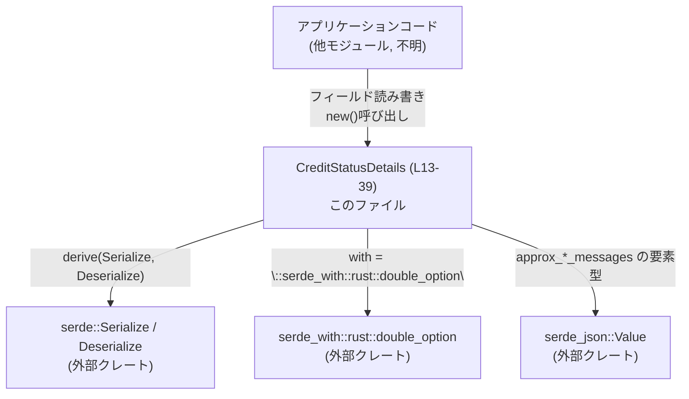
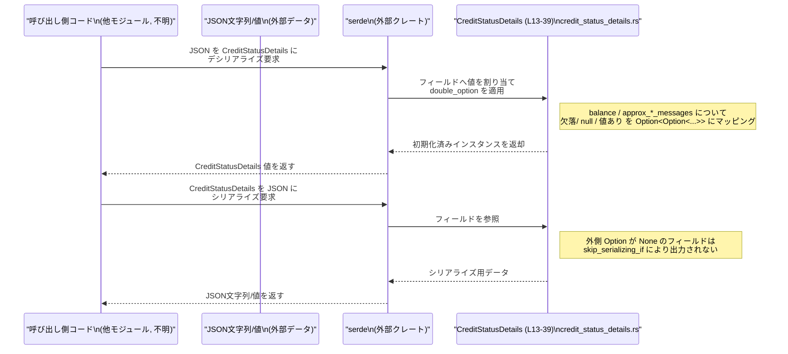

# codex-backend-openapi-models/src/models/credit_status_details.rs コード解説

## 0. ざっくり一言

`CreditStatusDetails` は、クレジットの有無・無制限フラグ・残高・ローカル/クラウド側メッセージ数の概算など、クレジット関連の状態を JSON と相互変換するためのデータモデルです。`serde` と `serde_with::rust::double_option` によるシリアライズ設定が組み込まれています。  
（根拠: 自動生成コメントと `#[derive(Serialize, Deserialize)]`, フィールドと serde 属性の定義 `credit_status_details.rs:L1-8,L10-11,L13-39`）

---

## 1. このモジュールの役割

### 1.1 概要

- このモジュールは OpenAPI 仕様に基づいて生成された **クレジット状態レスポンスのモデル** を定義します。  
  （根拠: 「Generated by: <https://openapi-generator.tech」コメント> `credit_status_details.rs:L1-8`）
- クレジットの利用可否 (`has_credits`)、無制限かどうか (`unlimited`)、残高やローカル/クラウドメッセージの情報を保持し、JSON とシリアライズ/デシリアライズ可能です。  
  （根拠: `CreditStatusDetails` 構造体の各フィールド定義と serde 属性 `credit_status_details.rs:L13-39`）

### 1.2 アーキテクチャ内での位置づけ

このファイルは **純粋なデータモデル層** であり、ビジネスロジックや I/O は含まず、他の層（API クライアントやサービス層）から利用されることを意図した構造になっています。  
（根拠: 構造体定義と唯一のコンストラクタ `new` のみを持ち、副作用を伴う処理がない `credit_status_details.rs:L13-52`）

代表的な依存関係を Mermaid で表すと次のようになります。



（根拠: `use serde::{Serialize, Deserialize};` と `#[derive(..., Serialize, Deserialize)]`、`with = "::serde_with::rust::double_option"`、`Vec<serde_json::Value>` の使用 `credit_status_details.rs:L10-11,L13,L22,L29,L36,L32,L39`）

### 1.3 設計上のポイント

- **データ専用の構造体**  
  ロジックは持たず、クレジット状態を表すフィールドのみを持つ構造体です。  
  （根拠: `pub struct CreditStatusDetails { ... }` と `impl` 内に `new` だけがある `credit_status_details.rs:L13-39,L42-51`）

- **自動生成 & serde 連携前提の設計**  
  `#[derive(Serialize, Deserialize)]`、`#[serde(rename = "...")]` などが全面的に使われており、OpenAPI Generator で生成されたモデルであることが示唆されています。  
  （根拠: コメントと serde 属性 `credit_status_details.rs:L1-8,L13-39`）

- **`Option<Option<...>>` + `double_option` による 3 値区別**  
  `balance` / `approx_*_messages` は `Option<Option<...>>` 型と `serde_with::rust::double_option` を組み合わせており、「フィールド欠落」「明示的な null」「値あり」の 3 状態を区別できるように設計されています。  
  （根拠: `pub balance: Option<Option<String>>` と `with = "::serde_with::rust::double_option"` など `credit_status_details.rs:L19-25,L26-32,L33-39`）

- **デフォルトと省略時の挙動を制御**  
  `default` と `skip_serializing_if = "Option::is_none"` により、JSON 入出力時の「省略時に None とする」「None の場合は出力しない」という方針が明示されています。  
  （根拠: 各 `#[serde(..., default, ..., skip_serializing_if = "Option::is_none")]` `credit_status_details.rs:L19-24,L26-31,L33-38`）

---

## 2. 主要な機能一覧（コンポーネントインベントリー）

このファイルが提供する主要機能・コンポーネントは次のとおりです。

### 構造体・メソッド一覧

| 名前 | 種別 | 公開性 | 定義位置 | 役割 / 用途 |
|------|------|--------|----------|-------------|
| `CreditStatusDetails` | 構造体 | `pub` | `credit_status_details.rs:L13-39` | クレジット状態（クレジット有無、無制限フラグ、残高、ローカル/クラウドメッセージ数など）を保持するデータモデル |
| `CreditStatusDetails::new` | 関数（関連関数 / コンストラクタ） | `pub` | `credit_status_details.rs:L42-51` | `has_credits` と `unlimited` を指定し、その他のオプションフィールドを `None` に初期化するための簡易コンストラクタ |

### 提供される主な機能

- クレジットが利用可能かどうかを表すブール値 `has_credits` の保持  
  （根拠: `pub has_credits: bool` `credit_status_details.rs:L15-16`）
- クレジットが無制限かどうかを表すブール値 `unlimited` の保持  
  （根拠: `pub unlimited: bool` `credit_status_details.rs:L17-18`）
- 残高 (`balance`) の「未設定 / null / 値あり」を区別した保持と JSON マッピング  
  （根拠: `pub balance: Option<Option<String>>` と対応する serde 属性 `credit_status_details.rs:L19-25`）
- ローカルメッセージ数の概算 (`approx_local_messages`) の 3 値区別と JSON マッピング  
  （根拠: `pub approx_local_messages: Option<Option<Vec<serde_json::Value>>>` と serde 属性 `credit_status_details.rs:L26-32`）
- クラウドメッセージ数の概算 (`approx_cloud_messages`) の 3 値区別と JSON マッピング  
  （根拠: `pub approx_cloud_messages: Option<Option<Vec<serde_json::Value>>>` と serde 属性 `credit_status_details.rs:L33-39`）
- `new` による簡易初期化  
  （根拠: `pub fn new(has_credits: bool, unlimited: bool) -> CreditStatusDetails` `credit_status_details.rs:L42-51`）

---

## 3. 公開 API と詳細解説

### 3.1 型一覧（構造体）

#### `CreditStatusDetails`

| 名前 | 種別 | 役割 / 用途 | 定義位置 |
|------|------|-------------|----------|
| `CreditStatusDetails` | 構造体 | クレジット状態を表す JSON 対応データ型。OpenAPI モデルとして利用され、クレジット可否・無制限フラグ・残高・ローカル/クラウド側メッセージ数を保持する。 | `credit_status_details.rs:L13-39` |

**派生トレイト**

- `Clone`, `Default`, `Debug`, `PartialEq`, `Serialize`, `Deserialize` が自動導出されています。  
  （根拠: `#[derive(Clone, Default, Debug, PartialEq, Serialize, Deserialize)]` `credit_status_details.rs:L13`）

これにより:

- `CreditStatusDetails::default()` が利用可能（全フィールドを `Default` 実装に従って初期化）  
  （根拠: `derive(Default)` `credit_status_details.rs:L13`）
- `Debug` 出力 (`{:?}`) や `PartialEq` による比較が可能  
  （根拠: `derive(Debug, PartialEq)` `credit_status_details.rs:L13`）
- `serde` による JSON 等へのシリアライズ/デシリアライズが可能  
  （根拠: `derive(Serialize, Deserialize)` と `use serde::{Serialize, Deserialize};` `credit_status_details.rs:L10-11,L13`）

**フィールド詳細**

1. `has_credits: bool`  
   - JSON 上のキー: `"has_credits"`  
     （根拠: `#[serde(rename = "has_credits")]` `credit_status_details.rs:L15-16`）
   - クレジットを利用できるかどうかを示すフラグです（意味は命名からの解釈であり、このチャンクにはビジネスロジックは現れません）。  
   - `default` 属性が付いていないため、デシリアライズ時にこのフィールドが欠けている場合の扱いは、このファイルだけでは分かりません（serde の設定やスキーマ側に依存します）。

2. `unlimited: bool`  
   - JSON 上のキー: `"unlimited"`  
     （根拠: `#[serde(rename = "unlimited")]` `credit_status_details.rs:L17-18`）
   - クレジットが無制限であるかどうかを示すフラグです（同じく命名からの解釈であり、整合性チェックなどはこのファイルにはありません）。  

3. `balance: Option<Option<String>>`  
   - JSON キー: `"balance"`  
     （根拠: `rename = "balance"` `credit_status_details.rs:L19-21`）
   - serde 属性:
     - `default` … JSON 上で欠落している場合、フィールドはデフォルト値（`None`）でデシリアライズされます。  
       （根拠: `default` 属性 `credit_status_details.rs:L21`）
     - `with = "::serde_with::rust::double_option"` … `Option<Option<String>>` を「欠落 / null / 値あり」で区別するためのカスタムシリアライザ/デシリアライザを利用します。  
       （根拠: `with = "::serde_with::rust::double_option"` `credit_status_details.rs:L22`）
     - `skip_serializing_if = "Option::is_none"` … 外側の `Option` が `None` の場合、このフィールドはシリアライズ時に JSON に出力されません。  
       （根拠: `skip_serializing_if = "Option::is_none"` `credit_status_details.rs:L23`）
   - 意味合い（`double_option` の一般的な用途に基づく解釈であり、実装詳細はこのチャンクには現れません）:
     - `None` … フィールド自体が **欠落**（「情報なし」）
     - `Some(None)` … フィールドは存在するが JSON 上は `null`
     - `Some(Some(v))` … フィールドは `v` という文字列値を持つ

4. `approx_local_messages: Option<Option<Vec<serde_json::Value>>>`  
   - JSON キー: `"approx_local_messages"`  
     （根拠: `rename = "approx_local_messages"` `credit_status_details.rs:L26-28`）
   - serde 属性は `balance` と同様に `default`, `with = "::serde_with::rust::double_option"`, `skip_serializing_if = "Option::is_none"` が指定されています。  
     （根拠: `credit_status_details.rs:L26-31`）
   - 要素型が `Vec<serde_json::Value>` であるため、メッセージ数等を JSON 値として柔軟に表現できる構造です。  
     （根拠: `pub approx_local_messages: Option<Option<Vec<serde_json::Value>>>` `credit_status_details.rs:L32`）

5. `approx_cloud_messages: Option<Option<Vec<serde_json::Value>>>`  
   - JSON キー: `"approx_cloud_messages"`  
     （根拠: `rename = "approx_cloud_messages"` `credit_status_details.rs:L33-35`）
   - serde 属性および型の構造は `approx_local_messages` と同様ですが、クラウド側に関する情報を保持すると解釈できます。  
     （根拠: フィールド名と serde 属性 `credit_status_details.rs:L33-39`）

### 3.2 関数詳細

#### `CreditStatusDetails::new(has_credits: bool, unlimited: bool) -> CreditStatusDetails`

**概要**

- `has_credits` と `unlimited` を引数として受け取り、それ以外のオプションフィールド（`balance` / `approx_local_messages` / `approx_cloud_messages`）をすべて `None` に初期化した `CreditStatusDetails` インスタンスを生成するコンストラクタです。  
  （根拠: フィールド初期化式 `credit_status_details.rs:L42-51`）

**引数**

| 引数名 | 型 | 説明 |
|--------|----|------|
| `has_credits` | `bool` | クレジットを利用可能かどうかのフラグ。`has_credits` フィールドにそのまま代入されます。`credit_status_details.rs:L43-47` |
| `unlimited` | `bool` | クレジットが無制限かどうかのフラグ。`unlimited` フィールドにそのまま代入されます。`credit_status_details.rs:L43-47` |

**戻り値**

- 型: `CreditStatusDetails`  
- 内容: `has_credits` と `unlimited` が引数通りに設定され、`balance`, `approx_local_messages`, `approx_cloud_messages` はすべて `None` に設定されたインスタンスを返します。  
  （根拠: `CreditStatusDetails { has_credits, unlimited, balance: None, approx_local_messages: None, approx_cloud_messages: None }` `credit_status_details.rs:L44-50`）

**内部処理の流れ**

1. 新しい `CreditStatusDetails` 構造体リテラルを生成します。  
   （根拠: `CreditStatusDetails { ... }` `credit_status_details.rs:L44-50`）
2. フィールド `has_credits` に引数 `has_credits` をそのまま代入します。  
   （根拠: `has_credits,` `credit_status_details.rs:L45`）
3. フィールド `unlimited` に引数 `unlimited` をそのまま代入します。  
   （根拠: `unlimited,` `credit_status_details.rs:L46`）
4. フィールド `balance` を `None` に初期化します。  
   （根拠: `balance: None,` `credit_status_details.rs:L47`）
5. フィールド `approx_local_messages` を `None` に初期化します。  
   （根拠: `approx_local_messages: None,` `credit_status_details.rs:L48`）
6. フィールド `approx_cloud_messages` を `None` に初期化します。  
   （根拠: `approx_cloud_messages: None,` `credit_status_details.rs:L49`）
7. 構築されたインスタンスを返します。  
   （根拠: 構造体リテラル式全体が戻り値 `credit_status_details.rs:L44-50`）

**Examples（使用例）**

`new` でインスタンスを作り、後からオプションフィールドを設定しつつ JSON に変換する例です。

```rust
use serde_json; // serde_json クレートを利用する                           // JSON 変換に使用するクレート
// パスはプロジェクト構成に依存しますが、例として crate 配下を想定
use crate::models::credit_status_details::CreditStatusDetails;            // CreditStatusDetails 型をインポート

fn example() -> Result<(), serde_json::Error> {                           // エラーを返す例示用関数
    let mut details = CreditStatusDetails::new(true, false);              // has_credits=true, unlimited=false で初期化

    details.balance = Some(Some("100.00".to_string()));                   // balance に "100.00" を設定（値あり）
    details.approx_local_messages = Some(Some(vec![serde_json::Value::from(10)])); 
                                                                          // ローカルメッセージ数の概算を 1 要素だけ設定
    details.approx_cloud_messages = None;                                 // クラウド側は「情報なし」のまま

    let json = serde_json::to_string_pretty(&details)?;                   // 構造体を JSON 文字列にシリアライズ
    println!("{}", json);                                                 // JSON を表示

    let parsed: CreditStatusDetails = serde_json::from_str(&json)?;       // JSON から再度デシリアライズ
    assert_eq!(parsed.has_credits, true);                                 // has_credits が維持されていることを確認
    Ok(())                                                                // 正常終了
}
```

> モジュールパス（`crate::models::credit_status_details`）は、このチャンクには明示されていないため、実際のプロジェクト構成に合わせて読み替える必要があります。

**Errors / Panics**

- この関数自体はエラーもパニックも発生させません。  
  単に構造体をリテラルで構築して返すだけです。  
  （根拠: 条件分岐や `panic!` / `unwrap` などが存在しない `credit_status_details.rs:L42-51`）
- メモリ確保など、Rust の通常の構造体生成に伴う低レベルな失敗条件は、このファイルからは扱われていません（Rust ランタイムや OS に依存）。

**Edge cases（エッジケース）**

- `has_credits` と `unlimited` の値の組み合わせ（例: `has_credits=false` かつ `unlimited=true` など）に対する制約や検証は一切行われません。  
  どのような組み合わせもそのままフィールドに格納されます。  
  （根拠: 引数に対するチェックが存在しない `credit_status_details.rs:L42-51`）
- オプションフィールドはすべて `None` で初期化されるため、`new` 直後は JSON シリアライズ時に `balance` / `approx_*_messages` キーは出力されません。  
  （根拠: `balance: None, approx_local_messages: None, approx_cloud_messages: None` と `skip_serializing_if = "Option::is_none"` `credit_status_details.rs:L47-49,L23,L30,L37`）

**使用上の注意点**

- `new` は「最低限のフラグだけを設定する」用途に向いており、残りのフィールドは呼び出し側で適切に設定する必要があります。  
- 明示的な `null` を JSON に出したい場合は、`Some(None)` を設定する必要があり、`None` のままではフィールド自体が出力されない点に注意が必要です。  
  （根拠: `Option<Option<_>>` と `skip_serializing_if = "Option::is_none"` の組み合わせ `credit_status_details.rs:L21-25,L28-32,L35-39`）

### 3.3 その他の関数

- このファイルには、`CreditStatusDetails::new` 以外のメソッドや関数は定義されていません。  
  （根拠: `impl CreditStatusDetails { ... }` 内に `new` のみが存在する `credit_status_details.rs:L42-51`）

---

## 4. データフロー

この構造体は主に **JSON との相互変換** の中で利用されることが想定されます。このファイルに I/O コードは現れませんが、`serde` とフィールド属性から次のようなデータフローが読み取れます。

1. 外部から JSON データ（例えば API レスポンス）が与えられる。  
2. `serde` が `CreditStatusDetails` にデシリアライズする際、`double_option` を用いてフィールドの欠落/null/値ありを区別して構造体フィールドに格納する。  
3. 逆に、構造体から JSON にシリアライズする際、外側の `Option` が `None` のフィールドは JSON に出力されず、それ以外は値または `null` として出力される。  
   （根拠: `derive(Serialize, Deserialize)` と各フィールドの serde 属性 `credit_status_details.rs:L13-39`）

これを sequence diagram で表すと次のようになります。



> HTTP 通信やストレージ層など、どこでこの JSON がやり取りされるかについては、このチャンクには現れないため不明です。

---

## 5. 使い方（How to Use）

### 5.1 基本的な使用方法

`new` で最低限のフラグを指定し、必要に応じてオプションフィールドを設定してから JSON に変換する基本的な例です。

```rust
use serde_json;                                                             // JSON 変換用クレートをインポート
// 実際のパスはプロジェクト構成に依存する
use crate::models::credit_status_details::CreditStatusDetails;              // CreditStatusDetails 型をインポート

fn main() -> Result<(), serde_json::Error> {                                 // エラーを返す main の例
    let mut details = CreditStatusDetails::new(true, false);                 // has_credits=true, unlimited=false で初期化

    details.balance = Some(Some("50.0".to_string()));                        // balance を "50.0" に設定（値あり）
    details.approx_local_messages = Some(None);                              // 「フィールドは存在するが値は null」を表現
    details.approx_cloud_messages = None;                                    // クラウド側は「情報なし」（フィールド自体を出さない）

    let json = serde_json::to_string_pretty(&details)?;                      // 構造体を JSON 文字列へ変換
    println!("Serialized JSON:\n{}", json);                                  // JSON を表示

    let parsed: CreditStatusDetails = serde_json::from_str(&json)?;          // JSON から再度構造体へ変換
    assert_eq!(parsed.has_credits, true);                                    // フラグが保持されていることを確認
    Ok(())                                                                   // 正常終了
}
```

### 5.2 よくある使用パターン

1. **Default で初期化してから設定する**

   `derive(Default)` により `CreditStatusDetails::default()` が利用できます。全フィールドをデフォルト値（`bool` は `false`, `Option` は `None`）で初期化した上で、必要なフィールドだけを上書きするパターンです。  
   （根拠: `derive(Default)` `credit_status_details.rs:L13`）

   ```rust
   use crate::models::credit_status_details::CreditStatusDetails;           // 型をインポート

   fn build_with_default() -> CreditStatusDetails {                         // Default ベースの初期化関数
       let mut details = CreditStatusDetails::default();                    // 全フィールドをデフォルト値で初期化
       details.has_credits = true;                                          // 必要なフィールドだけ設定
       details.unlimited = false;                                           // unlimited を明示的に設定
       details                                                              // 構築した値を返す
   }
   ```

2. **明示的な null と省略を使い分ける**

   - 「情報が本当に分からない / 伝えない」 → `None`（フィールド自体を出力しない）
   - 「情報が null であることを明示したい」 → `Some(None)`（JSON で `null` として出力）

   ```rust
   use crate::models::credit_status_details::CreditStatusDetails;           // 型をインポート

   fn set_balance_states() {                                                // balance の状態を比較する例
       let mut details_missing = CreditStatusDetails::new(true, false);     // balance=None（欠落）
       details_missing.balance = None;                                      // 省略（JSONではキー自体が出ない）

       let mut details_null = CreditStatusDetails::new(true, false);        // 別インスタンスを用意
       details_null.balance = Some(None);                                   // 明示的に null を設定

       let mut details_value = CreditStatusDetails::new(true, false);       // 値ありバージョン
       details_value.balance = Some(Some("10".to_string()));                // "10" を設定
   }
   ```

   これら 3 パターンは、`serde_with::rust::double_option` と `skip_serializing_if` の設定により JSON 表現が異なります。  
   （根拠: `Option<Option<String>>` と serde 属性 `credit_status_details.rs:L19-25`）

### 5.3 よくある間違い

**誤用例: `None` と `Some(None)` の違いを意識しない**

```rust
// 誤りの例: 「null を送りたい」つもりで None のままにしてしまう
let mut details = CreditStatusDetails::new(true, false);   // 初期化
details.balance = None;                                    // これではフィールド自体が JSON に含まれない
```

**正しい例: `Some(None)` を使って null を送る**

```rust
// 正しい例: JSON で balance: null を送信したい場合
let mut details = CreditStatusDetails::new(true, false);   // 初期化
details.balance = Some(None);                              // フィールドは存在し値は null という状態になる
```

（根拠: `Option<Option<_>>` と `skip_serializing_if = "Option::is_none"` の意味 `credit_status_details.rs:L19-25`）

### 5.4 使用上の注意点（まとめ）

- **3 値区別の扱い**  
  `balance` / `approx_*_messages` は「欠落」「null」「値あり」の 3 状態を区別するために `Option<Option<...>>` が使われています。値の解釈時には外側と内側の両方の `Option` を確認する必要があります。  
  （根拠: フィールド型と `double_option` 属性 `credit_status_details.rs:L19-25,L26-32,L33-39`）

- **整合性チェックの不在**  
  `has_credits` と `unlimited` の論理的整合性（例: クレジットが無いのに無制限フラグが立っている）を検証する処理は、この構造体には含まれていません。必要であれば呼び出し側で検証する必要があります。  
  （根拠: 構造体定義と `new` が代入のみであること `credit_status_details.rs:L13-39,L42-51`）

- **エラーハンドリング**  
  このファイル内のコードはエラーを返しませんが、JSON 変換時には `serde` / `serde_json` 側でエラーが発生する可能性があります。エラー処理は呼び出し側（例: `serde_json::from_str` を呼ぶコード）で行う必要があります。このファイルにはテストもエラー処理も定義されていません。  
  （根拠: 関数が `Result` を返さず、`serde_json` を直接利用していない `credit_status_details.rs:L42-51`）

- **並行性**  
  この構造体は単なるデータホルダであり、内部に `Mutex` や `Cell` などの共有可変状態は持っていません。共有参照からのデータレースの可能性は、このコードからは見られません。ただし、`Send` / `Sync` 実装の有無はこのチャンクには明示されていません。  
  （根拠: フィールド型がすべて所有権ベースの標準値型であること `credit_status_details.rs:L15-39`）

---

## 6. 変更の仕方（How to Modify）

### 6.1 新しい機能を追加する場合

1. **新しいフィールドを追加する**

   - 例として、新しいクレジット属性を追加する場合は `CreditStatusDetails` 構造体にフィールドを追加します。  
     （根拠: 構造体定義 `credit_status_details.rs:L13-39`）
   - JSON との互換性が必要であれば、既存フィールドと同様に `#[serde(...)]` 属性を付与します。
   - 「欠落/null/値あり」を区別したい場合は、既存の `balance` などと同様に `Option<Option<...>>` + `double_option` + `skip_serializing_if` のパターンを踏襲できます。

2. **`new` に引数を追加するか、別のコンストラクタを用意する**

   - 追加したフィールドをコンストラクタで必須にしたい場合は、`CreditStatusDetails::new` の引数と初期化リストを拡張します。  
     （根拠: 現状の `new` 実装 `credit_status_details.rs:L42-51`）
   - 既存コードへの影響を最小限にするには、新しい名前のコンストラクタ（例: `new_with_balance`）を追加し、元の `new` はそのまま残す方法もあります。このファイル内にはまだコンストラクタが 1 つしかありません。  
     （根拠: `impl` ブロックに `new` しか存在しない `credit_status_details.rs:L42-51`）

3. **OpenAPI との整合性**

   - コメントから、このファイルは OpenAPI Generator により生成されていることが分かります。  
     （根拠: ファイル先頭コメント `credit_status_details.rs:L1-8`）
   - 手動でフィールドを追加すると、再生成時に上書きされる可能性があります。生成元の OpenAPI 定義を変更する必要があるかどうかは、このチャンクだけでは分かりませんが、その点に留意する必要があります。

### 6.2 既存の機能を変更する場合

- **フィールド型の変更**

  - 例えば `balance` を `String` から数値型に変えたい場合、構造体フィールドの型だけでなく、`double_option` の使用可否や JSON スキーマとの互換性も確認する必要があります。  
    （根拠: 現状の型と serde 属性 `credit_status_details.rs:L19-25`）
  - 型変更はシリアライズ/デシリアライズの互換性に直接影響するため、API を利用するクライアントにも影響が及びます。

- **`new` の挙動変更**

  - `new` が設定している初期値（オプションフィールドを `None` にすること）を変更すると、「デフォルトではフィールドが出力されない」という現在の前提が崩れます。  
    （根拠: `balance: None, approx_local_messages: None, approx_cloud_messages: None` `credit_status_details.rs:L47-49`）
  - 変更時には、このコンストラクタを使っている箇所を洗い出し、期待する JSON との整合性を確認する必要があります（呼び出し側のコードはこのチャンクには現れないため、不明です）。

- **テストと契約**

  - このファイルにはテストコードが存在しないため、変更後の動作確認は別のテストモジュールか外部のテストセットで行う必要があります。このチャンクからは具体的なテストの場所は分かりません。

---

## 7. 関連ファイル・クレート

このチャンクから確実に分かる関連コンポーネントは以下のとおりです。

| パス / クレート | 種別 | 役割 / 関係 |
|-----------------|------|-------------|
| `serde` | 外部クレート | `Serialize`, `Deserialize` トレイトの derive により、`CreditStatusDetails` を JSON などにシリアライズ/デシリアライズするために利用されます。`credit_status_details.rs:L10-11,L13` |
| `serde_with::rust::double_option` | 外部クレート | `Option<Option<...>>` フィールドのシリアライズ/デシリアライズ時に、欠落/null/値ありを区別するためのカスタムハンドラとして利用されます。`credit_status_details.rs:L21-23,L28-30,L35-37` |
| `serde_json::Value` | 外部クレート | `approx_local_messages` および `approx_cloud_messages` フィールドの要素型として、メッセージ数などを柔軟な JSON 値で表現するために利用されます。`credit_status_details.rs:L32,L39` |
| （同一クレート内の他ファイル） | 不明 | このチャンクには他の Rust ファイルやモジュールへの参照が現れていないため、具体的な関連ファイルは特定できません。 |

---

### Bugs / Security / Contracts / Edge Cases / Performance についての補足

- **潜在的なバグ要因**  
  - ロジックがほぼ存在しないため、このファイル内のみで明確なバグは読み取れません。  
  - ただし、`has_credits` や `unlimited` の整合性チェックが無いため、上位層のロジックで矛盾した状態が生成される可能性はあります。これは「このファイル内にチェックが無い」という事実に基づく指摘です。  
    （根拠: フィールドと `new` が単純な代入のみ `credit_status_details.rs:L13-39,L42-51`）

- **セキュリティ**  
  - この構造体はデータモデルのみであり、バリデーションやサニタイズ処理は含まれていません。入力の妥当性や安全性の確認は別層に委ねられていると考えられますが、その層はこのチャンクには現れません。  
  - 機密性の高い情報かどうか（残高など）は利用側の取り扱いに依存し、このファイル単体からは判断できません。

- **パフォーマンス / スケーラビリティ**  
  - フィールドはすべて値型と `Vec` のみで、ループや重い計算は存在しません。構造体の作成・コピーは軽量な処理です。  
    （根拠: フィールド型と `impl` の内容 `credit_status_details.rs:L13-39,L42-51`）

- **テスト**  
  - このファイルにはテストコードが含まれていません。シリアライズ/デシリアライズの挙動や 3 値の扱いを確認するテストは別の場所に存在するか、まだ用意されていない可能性がありますが、このチャンクからは不明です。

以上が、このファイル単体から客観的に読み取れる内容と、その実用的な使い方・注意点の整理です。
