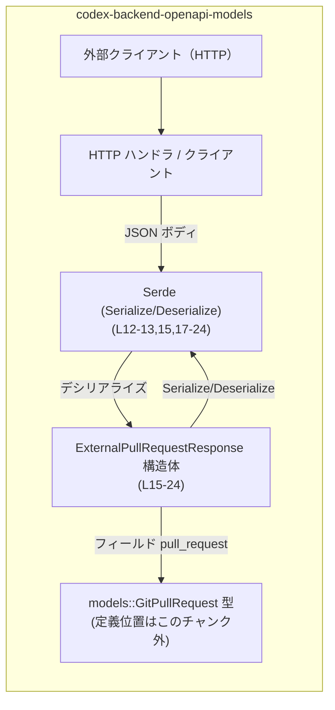
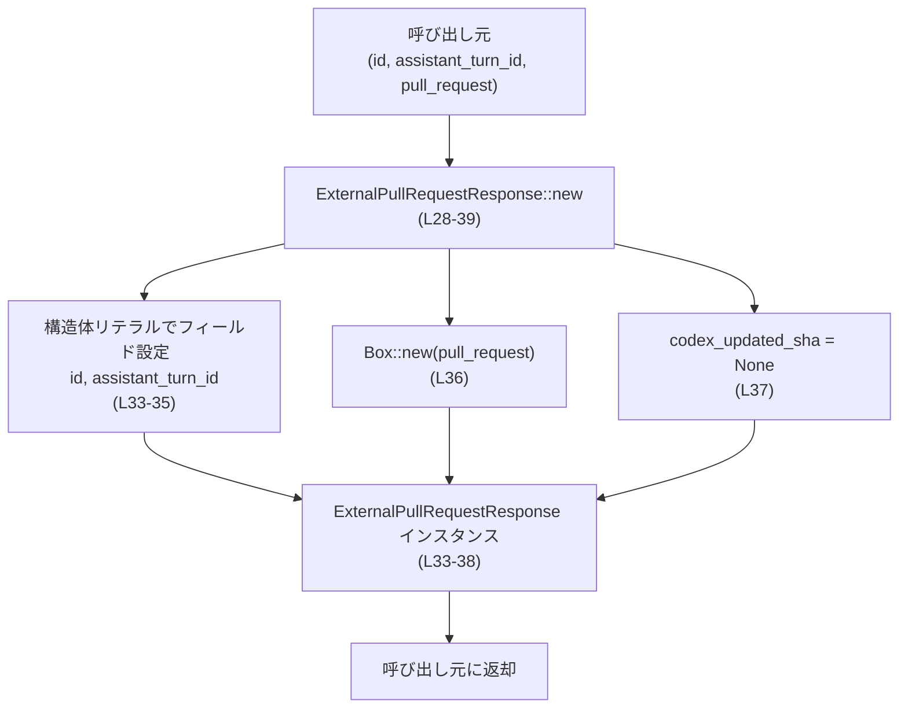
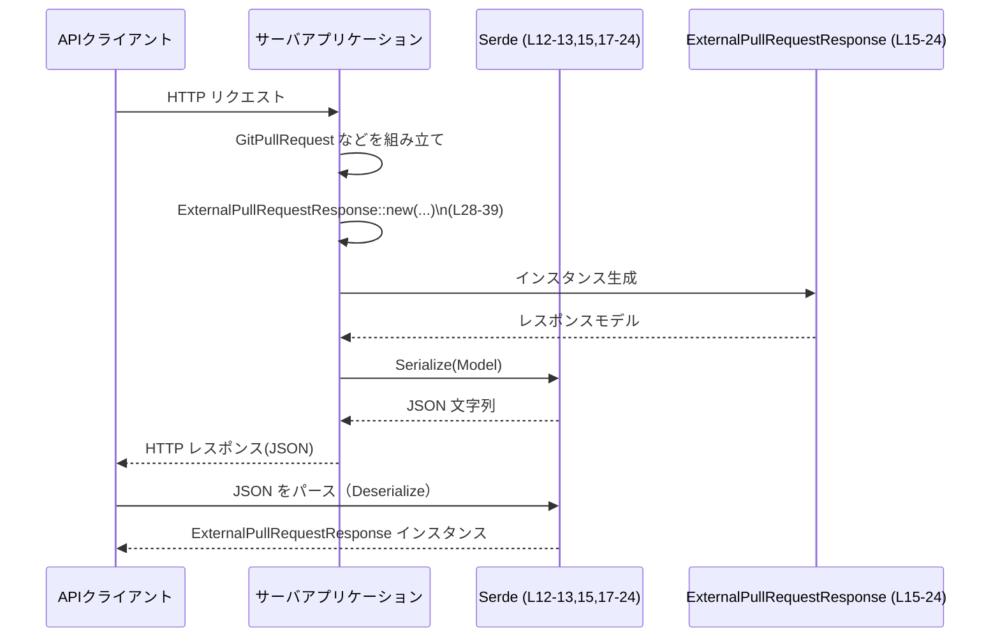

# codex-backend-openapi-models/src/models/external_pull_request_response.rs コード解説

## 0. ざっくり一言

`ExternalPullRequestResponse` 構造体とそのコンストラクタを定義し、OpenAPI ベースの HTTP API で使われる「外部プルリクエスト」レスポンスの JSON と Rust 型を相互変換するためのモデルを提供するファイルです（`external_pull_request_response.rs:L1-8,15-24`）。

---

## 1. このモジュールの役割

### 1.1 概要

- このモジュールは、OpenAPI ドキュメント（コメントより v0.0.1）に基づくコード生成により作成された **API レスポンスモデル** を提供します（`external_pull_request_response.rs:L1-8,15-24`）。
- `ExternalPullRequestResponse` は、外部プルリクエストに関する情報（ID、アシスタントのターンID、プルリクエスト本体、オプションの SHA）を 1 つの構造体としてまとめています（`external_pull_request_response.rs:L16-24`）。
- Serde を使ったシリアライズ／デシリアライズを前提としており、HTTP の JSON ボディと Rust の構造体の橋渡しを行う用途が想定されます（`external_pull_request_response.rs:L11-13,15,17-24`）。

### 1.2 アーキテクチャ内での位置づけ

このファイルは `crate::models` 名前空間の一部であり、他のモデル型（例: `models::GitPullRequest`）と共に API の入出力スキーマを定義するレイヤに属します（`external_pull_request_response.rs:L11,21-22`）。

代表的な関係を簡略図で示します。



- `ExternalPullRequestResponse` 自身はビジネスロジックを持たず、データキャリアとして振る舞います。
- プルリクエスト本体は `models::GitPullRequest` 型として別モジュールで定義されており、この構造体はそれを `Box` で所有します（`external_pull_request_response.rs:L21-22`）。

### 1.3 設計上のポイント

- **純粋なデータ構造**  
  - メソッドはコンストラクタ `new` のみで、状態の変化や検証ロジックは持っていません（`external_pull_request_response.rs:L27-39`）。
- **自動実装されるトレイト**（`#[derive(...)]`）  
  - `Clone`, `Default`, `Debug`, `PartialEq`, `Serialize`, `Deserialize` を derive しています（`external_pull_request_response.rs:L15`）。
  - これにより、コピー、デフォルト生成、デバッグ表示、比較、JSON などへのシリアライズ／デシリアライズが自動的に利用可能です。
- **フィールドの公開**  
  - 全フィールドが `pub` であり、`new` を使わずに構造体リテラルで直接生成・変更することも可能です（`external_pull_request_response.rs:L18,20,22,24`）。
- **Serde 属性による JSON 形式の指定**  
  - 各フィールドには `rename` が指定されており、JSON 側のキー名が明示されています（`external_pull_request_response.rs:L17,19,21,23`）。
  - `codex_updated_sha` は `Option::is_none` のとき **シリアライズ時に JSON へ出力されない** 仕様です（`external_pull_request_response.rs:L23`）。
- **ヒープ配置されたプルリクエスト**  
  - `pull_request` は `Box<models::GitPullRequest>` として所有されます。つまり、プルリクエスト本体の値はヒープ上に配置され、その所有権をこの構造体が持ちます（`external_pull_request_response.rs:L21-22`）。

---

## 2. 主要な機能一覧（＋コンポーネントインベントリー）

### 2.1 機能一覧

- 外部プルリクエストレスポンスの表現: `ExternalPullRequestResponse` 構造体で ID、ターンID、プルリク本体、更新後 SHA を保持（`external_pull_request_response.rs:L16-24`）。
- Serde 対応 JSON モデル: `Serialize` / `Deserialize` とフィールドの `#[serde(rename = ...)]` により、OpenAPI で定義された JSON 形式とのマッピングを提供（`external_pull_request_response.rs:L11-13,15,17-24`）。
- コンストラクタ: 必須フィールド（`id`, `assistant_turn_id`, `pull_request`）を引数に取り、`codex_updated_sha` を `None` で初期化する `new` 関数（`external_pull_request_response.rs:L28-39`）。

### 2.2 コンポーネントインベントリー

| 名前 | 種別 | 役割 / 用途 | 定義位置 |
|------|------|-------------|----------|
| `ExternalPullRequestResponse` | 構造体 | 外部プルリクエストレスポンスを表すデータモデル | `external_pull_request_response.rs:L15-24` |
| `ExternalPullRequestResponse::new` | 関数（関連関数） | 必須フィールドを受け取り、`codex_updated_sha = None` のインスタンスを生成 | `external_pull_request_response.rs:L28-39` |

---

## 3. 公開 API と詳細解説

### 3.1 型一覧（構造体・列挙体など）

| 名前 | 種別 | フィールド | 役割 / 用途 | 定義位置 |
|------|------|-----------|-------------|----------|
| `ExternalPullRequestResponse` | 構造体 | `id: String`, `assistant_turn_id: String`, `pull_request: Box<models::GitPullRequest>`, `codex_updated_sha: Option<String>` | 外部プルリクのレスポンス全体を一括で表現するモデル | `external_pull_request_response.rs:L16-24` |

**フィールド詳細**

| フィールド名 | 型 | Serde 属性 | 意味 / 用途 | 根拠 |
|--------------|----|-----------|------------|------|
| `id` | `String` | `rename = "id"` | レスポンスの ID。外部プルリクエストを一意に識別する ID である可能性が高いですが、詳細な意味はこのチャンクでは不明です。 | `external_pull_request_response.rs:L17-18` |
| `assistant_turn_id` | `String` | `rename = "assistant_turn_id"` | 「アシスタントのターン」を識別する ID と考えられますが、具体的な仕様はコードからは読み取れません。 | `external_pull_request_response.rs:L19-20` |
| `pull_request` | `Box<models::GitPullRequest>` | `rename = "pull_request"` | Git プルリクエスト本体の情報。`GitPullRequest` 型の詳細はこのチャンクには現れていません。 | `external_pull_request_response.rs:L21-22` |
| `codex_updated_sha` | `Option<String>` | `rename = "codex_updated_sha", skip_serializing_if = "Option::is_none"` | Codex によって更新されたコミット SHA などを保持するためのオプションフィールドと推測されますが、仕様は不明です。`None` の場合は JSON に含まれません。 | `external_pull_request_response.rs:L23-24` |

### 3.2 関数詳細

#### `ExternalPullRequestResponse::new(id: String, assistant_turn_id: String, pull_request: models::GitPullRequest) -> ExternalPullRequestResponse`

**概要**

- `ExternalPullRequestResponse` のインスタンスを生成するコンストラクタです（`external_pull_request_response.rs:L28-39`）。
- 必須情報である `id`, `assistant_turn_id`, `pull_request` を引数として受け取り、`codex_updated_sha` を `None` に初期化します（`external_pull_request_response.rs:L33-37`）。

**引数**

| 引数名 | 型 | 説明 | 根拠 |
|--------|----|------|------|
| `id` | `String` | レスポンスの ID。呼び出し側から所有権付き文字列として渡します。 | `external_pull_request_response.rs:L28-30,34` |
| `assistant_turn_id` | `String` | アシスタントのターン ID。こちらも所有権付き文字列として渡します。 | `external_pull_request_response.rs:L28,30-31,35` |
| `pull_request` | `models::GitPullRequest` | プルリクエスト本体。所有権を受け取り、この関数内で `Box` に包まれます。 | `external_pull_request_response.rs:L28,31-32,36` |

**戻り値**

- 型: `ExternalPullRequestResponse`（`external_pull_request_response.rs:L32`）
- 内容:
  - `id`: 引数 `id` をそのまま格納。
  - `assistant_turn_id`: 引数 `assistant_turn_id` をそのまま格納。
  - `pull_request`: 引数 `pull_request` を `Box::new` で包んで格納（ヒープ上に配置）。
  - `codex_updated_sha`: 常に `None` として初期化（`external_pull_request_response.rs:L33-37`）。

**内部処理の流れ（アルゴリズム）**

1. 関数が所有権付き引数 `id`, `assistant_turn_id`, `pull_request` を受け取る（`external_pull_request_response.rs:L28-32`）。
2. `ExternalPullRequestResponse` の構造体リテラルを用いてフィールドを初期化する（`external_pull_request_response.rs:L33-37`）。
3. `pull_request` 引数を `Box::new(pull_request)` でヒープに確保し、`pull_request` フィールドに格納する（`external_pull_request_response.rs:L36`）。
4. `codex_updated_sha` フィールドには `None` をセットする（`external_pull_request_response.rs:L37`）。
5. 初期化済みの構造体インスタンスを返す（`external_pull_request_response.rs:L33-39`）。



**Examples（使用例）**

> 注意: `GitPullRequest` 型のフィールド構成はこのチャンクからは不明なため、サンプルでは `/* フィールドは省略 */` としています。

```rust
use codex_backend_openapi_models::models::{
    ExternalPullRequestResponse,
    GitPullRequest, // 定義は別ファイル（このチャンクには現れません）
};

fn build_response_example() {
    // GitPullRequest の具体的なフィールドは不明なため、ここでは構造だけを示します。
    let pr = GitPullRequest {
        /* フィールドはこのファイルからは不明 */
    };

    // ExternalPullRequestResponse を new で生成する
    let resp = ExternalPullRequestResponse::new(
        "external-pr-id-123".to_string(),       // id
        "assistant-turn-456".to_string(),       // assistant_turn_id
        pr,                                     // プルリク本体（所有権を渡す）
    );

    // Debug トレイトが derive されているのでデバッグ表示が可能です
    println!("{:?}", resp);
}
```

JSON とのシリアライズ／デシリアライズ例（Serde 使用）:

```rust
use codex_backend_openapi_models::models::ExternalPullRequestResponse;
use serde_json;

fn serialize_example(resp: &ExternalPullRequestResponse) -> serde_json::Result<String> {
    // codex_updated_sha が None の場合、このフィールドは JSON に出力されません
    serde_json::to_string(resp)
}

fn deserialize_example(json: &str) -> serde_json::Result<ExternalPullRequestResponse> {
    // JSON のキー名は "id", "assistant_turn_id", "pull_request", "codex_updated_sha"
    serde_json::from_str(json)
}
```

**Errors / Panics**

- この関数自体は `Result` を返さず、明示的なエラー分岐を持ちません（`external_pull_request_response.rs:L28-39`）。
- 通常の条件下では `panic!` を起こすコードも含まれていません。
  - 唯一、`Box::new` によるメモリアロケーション（`external_pull_request_response.rs:L36`）は、極端なメモリ不足時などにプロセスアボートを引き起こす可能性がありますが、これは一般的な `Box` の仕様であり、この関数に固有のものではありません。

**Edge cases（エッジケース）**

- `id` / `assistant_turn_id` が空文字列の場合  
  - この関数は値の検証を行わないため、そのままフィールドに格納されます（`external_pull_request_response.rs:L33-35`）。
- `pull_request` に不正な状態の `GitPullRequest` が渡された場合  
  - 構造体はそれをそのまま保持するだけであり、検証や正規化を行いません（`external_pull_request_response.rs:L36`）。
- `codex_updated_sha` は常に `None`  
  - `new` 経由で生成された直後のインスタンスは、`codex_updated_sha` が必ず `None` であり、JSON 出力にもこのフィールドは含まれません（`external_pull_request_response.rs:L23,37`）。

**使用上の注意点**

- **バリデーションが行われない**  
  - ID 文字列やプルリクエスト内容の正当性チェックは一切行われないため、必要な検証は呼び出し側で行う必要があります（`external_pull_request_response.rs:L28-39`）。
- **Optional フィールドの取り扱い**  
  - `codex_updated_sha` をセットしたい場合は、`new` 呼び出し後にフィールドを明示的に書き換える必要があります。

    ```rust
    let mut resp = ExternalPullRequestResponse::new(id, assistant_turn_id, pr);
    resp.codex_updated_sha = Some("new-sha".to_string());
    ```

- **所有権の移動**  
  - `pull_request` 引数の所有権は `new` に移動し、内部で `Box` 化されます。呼び出し後に元の変数を使うことはできません（Rust の所有権ルール）。

### 3.3 その他の関数

- このファイルには `ExternalPullRequestResponse::new` 以外の関数やメソッドは定義されていません（`external_pull_request_response.rs:L27-39`）。

---

## 4. データフロー

この構造体が API レスポンスとして JSON ⇔ Rust 型の間でどのようにデータを受け渡しするかを、典型例で示します。



- サーバ側では、ビジネスロジックで `GitPullRequest` データを用意し、`ExternalPullRequestResponse::new` でレスポンスモデルを組み立てます（`external_pull_request_response.rs:L28-39`）。
- Serde によって JSON へシリアライズされる際、`codex_updated_sha` が `None` であればフィールドは JSON から省略されます（`external_pull_request_response.rs:L23`）。
- クライアント側では、同じモデルを利用して JSON から構造体へデシリアライズできます（`external_pull_request_response.rs:L15,17-24`）。

---

## 5. 使い方（How to Use）

### 5.1 基本的な使用方法

サーバサイドでレスポンスを構築し、必要に応じて `codex_updated_sha` を設定する基本フローの例です。

```rust
use codex_backend_openapi_models::models::{
    ExternalPullRequestResponse,
    GitPullRequest,
};
use serde_json;

fn build_and_serialize() -> serde_json::Result<String> {
    // GitPullRequest の具体的なフィールドはこのチャンクからは不明です
    let pr = GitPullRequest {
        /* フィールドは別ファイルの定義に依存 */
    };

    // 基本となるレスポンスを生成（codex_updated_sha は None）
    let mut resp = ExternalPullRequestResponse::new(
        "pr-123".to_string(),
        "assistant-turn-1".to_string(),
        pr,
    );

    // Codex による更新が行われた場合などに SHA をセット
    resp.codex_updated_sha = Some("abcdef1234567890".to_string());

    // JSON にシリアライズして返す
    serde_json::to_string(&resp)
}
```

### 5.2 よくある使用パターン

1. **API レスポンスとして返す**

   Web フレームワーク側で `Serialize` を利用してそのまま JSON に変換できます。

   ```rust
   async fn get_external_pr() -> impl IntoResponse {
       let pr = /* GitPullRequest を取得または生成 */;
       let resp = ExternalPullRequestResponse::new(
           "pr-123".to_string(),
           "assistant-turn-1".to_string(),
           pr,
       );
       // フレームワーク側の JSON レスポンス機能へ渡す想定
       Json(resp)
   }
   ```

2. **クライアントサイドでのパース**

   クライアントコードで HTTP レスポンスボディを `ExternalPullRequestResponse` にパースする例です。

   ```rust
   async fn fetch_external_pr() -> Result<(), Box<dyn std::error::Error>> {
       let body = reqwest::get("https://example.com/api/external_pr")
           .await?
           .text()
           .await?;

       let resp: ExternalPullRequestResponse = serde_json::from_str(&body)?;
       println!("PR id = {}", resp.id);
       Ok(())
   }
   ```

### 5.3 よくある間違い

```rust
use codex_backend_openapi_models::models::ExternalPullRequestResponse;

// 間違い例: codex_updated_sha を new の引数で設定しようとする
/*
let resp = ExternalPullRequestResponse::new(
    "pr-123".to_string(),
    "assistant-turn-1".to_string(),
    pr,
    Some("sha".to_string()), // コンパイルエラー: 引数が多すぎる
);
*/

// 正しい例: new で生成した後にフィールドを上書きする
let mut resp = ExternalPullRequestResponse::new(
    "pr-123".to_string(),
    "assistant-turn-1".to_string(),
    pr,
);
resp.codex_updated_sha = Some("sha".to_string());
```

```rust
// 間違い例: pull_request を借用で渡そうとする
/*
let pr = create_git_pull_request();
let resp = ExternalPullRequestResponse::new(
    "pr-123".to_string(),
    "assistant-turn-1".to_string(),
    &pr,  // コンパイルエラー: 参照は受け付けない
);
*/

// 正しい例: 所有権を move する
let pr = create_git_pull_request();
let resp = ExternalPullRequestResponse::new(
    "pr-123".to_string(),
    "assistant-turn-1".to_string(),
    pr,   // 所有権を渡す
);
```

### 5.4 使用上の注意点（まとめ）

- **フィールドはすべて公開 (`pub`)** のため、`new` を使わずに直接フィールドを書き換えることが可能ですが、一貫した初期化ルール（例: `codex_updated_sha` の扱い）を保つには `new` を経由する運用が分かりやすいです（`external_pull_request_response.rs:L18,20,22,24`）。
- **Serde の `skip_serializing_if` による省略** により、クライアントに送られる JSON の形式が `codex_updated_sha` の有無で変化します。クライアント側でこのフィールドが存在しないケースを考慮する必要があります（`external_pull_request_response.rs:L23`）。
- **スレッド安全性**  
  - この構造体自体は内部可変性（`RefCell` など）を使用しておらず、`unsafe` コードも含まれていません（`external_pull_request_response.rs:L15-24,27-39`）。
  - スレッド間共有の可否（`Send` / `Sync`）は、内部の `GitPullRequest` 型や `String` などのフィールド型に依存します。`String` と `Option<String>` は通常 `Send + Sync` ですが、`GitPullRequest` の性質はこのチャンクからは不明です。

---

## 6. 変更の仕方（How to Modify）

### 6.1 新しい機能を追加する場合

このファイルは OpenAPI Generator によって生成されたものであることがコメントから分かります（`external_pull_request_response.rs:L1-8`）。そのため、**手作業での変更は再生成時に上書きされる可能性が高い** 点に注意が必要です。

新しいフィールドや機能を追加したい場合の一般的な手順は次の通りです。

1. **OpenAPI 定義の更新**  
   - OpenAPI ドキュメント側で `ExternalPullRequestResponse` に相当するスキーマ（レスポンスモデル）に新フィールドを定義する。
2. **コード再生成**  
   - `openapi-generator` を用いてコードを再生成し、新フィールドが自動的に構造体に反映されることを確認する。
3. **コンストラクタ `new` の確認**  
   - 生成されたコードで `new` のシグネチャと実装がどのように変わったかを確認し、呼び出し側のコード（レスポンスを組み立てる箇所など）を合わせて修正する（`external_pull_request_response.rs:L28-39` を参照）。
4. **Serde 属性の整合性確認**  
   - 新しいフィールドに適切な `#[serde(rename = "...")]` や `skip_serializing_if` が付いているかを確認する（`external_pull_request_response.rs:L17-24` の既存フィールドの扱いを参考）。

### 6.2 既存の機能を変更する場合

- **フィールド名や型の変更**
  - `id` や `assistant_turn_id` などの名前や型を変更すると、JSON スキーマとの互換性が失われる可能性があります。
  - Serde の `rename` 属性を変更すると、JSON のキー名が変わるため、既存のクライアントへの影響を確認する必要があります（`external_pull_request_response.rs:L17,19,21,23`）。
- **`codex_updated_sha` のデフォルト挙動の変更**
  - `new` 内の `codex_updated_sha: None` を別のデフォルト値に変えると、API のレスポンス仕様も変わります（`external_pull_request_response.rs:L37`）。
  - `skip_serializing_if` を削除すると、`null` や空文字列でフィールドが常に送られるようになるなど、クライアント側のパースロジックに影響します（`external_pull_request_response.rs:L23`）。
- **テストや使用箇所の確認**
  - このファイル自体にはテストコードは含まれていませんが、`ExternalPullRequestResponse` を利用している API ハンドラやクライアントコードに対して、変更の影響範囲を確認し、必要に応じてテストを更新する必要があります（使用箇所はこのチャンクには現れていません）。

---

## 7. 関連ファイル

このモジュールと密接に関係する型・モジュールを一覧にします。

| パス / 型 | 役割 / 関係 | 根拠 |
|-----------|------------|------|
| `crate::models::GitPullRequest` | `pull_request` フィールドの型として使われるプルリクエスト本体のモデル。定義ファイルの実パスはこのチャンクには現れていません。 | `external_pull_request_response.rs:L11,21-22` |
| OpenAPI ドキュメント（0.0.1） | この構造体を含む API スキーマの元定義。`Generated by: https://openapi-generator.tech` というコメントから、本ファイルがこのドキュメントに基づき生成されていることが分かります。 | `external_pull_request_response.rs:L1-8` |

---

### 付記: 安全性・エラー・並行性の観点（まとめ）

- **安全性（メモリ / 型）**
  - Rust の所有権システムに従う単純なデータ構造であり、`unsafe` ブロックは存在しません（`external_pull_request_response.rs:L15-24,27-39`）。
  - `Box<GitPullRequest>` によりプルリクエスト本体はヒープ上で所有され、ライフタイムは構造体インスタンスと一致します。
- **エラーハンドリング**
  - 本ファイル内の公開 API（`new`）はエラーを返さず、バリデーションも行いません。エラー条件はすべて、呼び出し側のロジックや外部コンポーネント（例えば HTTP レイヤや DB レイヤ）に委ねられています。
- **並行性**
  - スレッドセーフかどうかは内部の `GitPullRequest` 型に依存しますが、少なくともこの構造体自身はミューテックスやチャネルなどの並行処理原語を含んでおらず、データモデルとして用いられることが想定されます（`external_pull_request_response.rs:L16-24`）。
