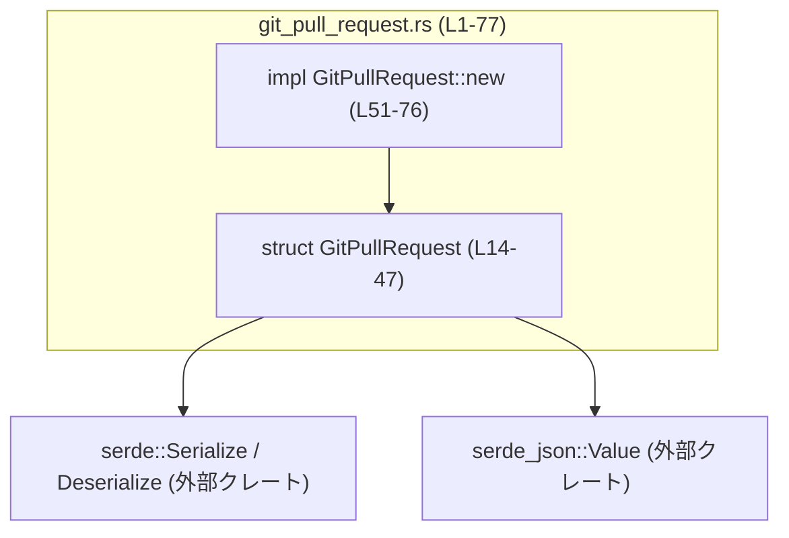
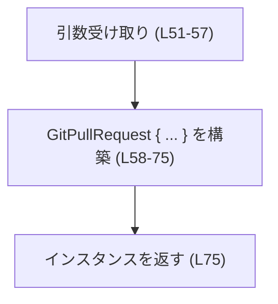
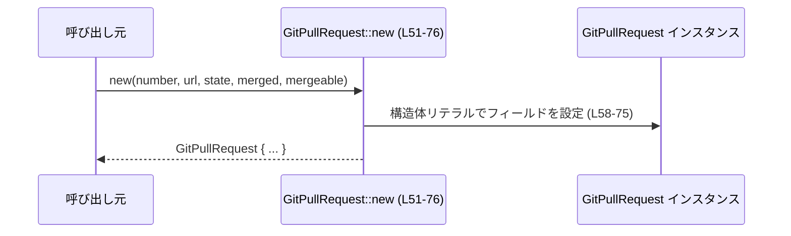

# codex-backend-openapi-models/src/models/git_pull_request.rs コード解説

## 0. ざっくり一言

外部 API の「Git のプルリクエスト」を表すデータモデルを定義し、Serde を用いたシリアライズ／デシリアライズと、必須項目のみを受け取るコンストラクタ `new` を提供するモジュールです（`git_pull_request.rs:L14-47`, `L50-76`）。

---

## 1. このモジュールの役割

### 1.1 概要

- このモジュールは、OpenAPI 仕様から生成された「Git プルリクエスト」のモデル型 `GitPullRequest` を提供します（コメントとパスから判断：`L1-8`, ファイルパス）。
- Serde の `Serialize` / `Deserialize` を実装しており、JSON などとの入出力に利用できる構造になっています（`L11-12`, `L14`）。
- ロジックはほぼ持たず、フィールド定義とそれらを初期化する `GitPullRequest::new` の 1 メソッドのみが定義されています（`L50-76`）。

### 1.2 アーキテクチャ内での位置づけ

このファイル内で確認できる依存関係は次のとおりです。

- `GitPullRequest` は Serde のトレイト `Serialize`, `Deserialize` に依存します（`use serde::Serialize; use serde::Deserialize;` `L11-12`, `derive` `L14`）。
- 一部フィールドは `serde_json::Value` 型に依存します（`comments`, `diff`, `user` フィールド `L42-47`）。

外部からの呼び出し関係はこのチャンクには現れませんが、パス `.../openapi-models/src/models` とヘッダコメント（`L1-8`）から、「OpenAPI モデル定義群の 1 つ」として API の入出力に使われる位置づけであることが分かります。



### 1.3 設計上のポイント

- **データモデル専用の構造**  
  - ほぼ全てがフィールド定義であり、ビジネスロジックは持っていません（`L14-47`）。
- **Serde 属性による JSON 対応**  
  - 全フィールドに `#[serde(rename = "...")]` が付与され、JSON キー名が明示されています（`L16-47`）。
  - `Option<T>` のフィールドには `skip_serializing_if = "Option::is_none"` が付いており、`None` の場合はシリアライズ時にキー自体が省略されます（`L26-47`）。
- **必須／任意の分離**  
  - `number`, `url`, `state`, `merged`, `mergeable` は非 `Option` で必須（`L16-25`）。
  - その他のフィールドは `Option` で任意項目です（`L26-47`）。
  - `new` は必須項目だけを引数として受け取り、任意項目はすべて `None` で初期化します（`L51-57`, `L64-75`）。
- **状態や並行性の管理なし**  
  - 内部にミューテックスや参照カウントなどは持たず、単なるデータのまとまりです（`L14-47`）。
  - スレッド生成や非同期処理も存在しません（このファイル全体）。

---

## 2. 主要な機能一覧

- `GitPullRequest` 構造体定義: Git プルリクエストの属性（番号、URL、状態、マージ情報、各種メタデータ）を保持するデータモデル（`L14-47`）。
- Serde 統合: `Serialize` / `Deserialize` 派生とフィールド属性により、JSON とのシリアライズ／デシリアライズに対応（`L11-12`, `L14`, `L16-47`）。
- `GitPullRequest::new`: 必須フィールドのみを引数に取り、任意フィールドを `None` で初期化したインスタンスを生成するコンストラクタ（`L51-76`）。

---

## 3. 公開 API と詳細解説

### 3.1 型一覧（構造体・列挙体など）

| 名前 | 種別 | 役割 / 用途 | 定義位置（根拠） |
|------|------|-------------|------------------|
| `GitPullRequest` | 構造体 | Git プルリクエストを表すデータモデル。番号、URL、状態、マージ状態、ベース／ヘッド情報、コメントや差分などを保持し、Serde で JSON との変換が可能です。 | `git_pull_request.rs:L14-47`（`pub struct` とフィールド・属性定義） |

`GitPullRequest` の主なフィールド（抜粋）:

- 必須:
  - `number: i32` – PR 番号と解釈されます（`L16-17`）。
  - `url: String` – PR の URL （`L18-19`）。
  - `state: String` – PR の状態（例: open/closed/merged 等と推定できるが、文字列表現のみが定義されており、列挙体などの制約はありません）（`L20-21`）。
  - `merged: bool` – マージ済みかどうか（`L22-23`）。
  - `mergeable: bool` – マージ可能かどうか（`L24-25`）。
- 任意（`Option` + `skip_serializing_if`）:
  - `draft: Option<bool>` – ドラフト状態かどうか（`L26-27`）。
  - `title`, `body`, `base`, `head`, `base_sha`, `head_sha`, `merge_commit_sha`: いずれも `Option<String>`（`L28-41`）。
  - `comments`, `diff`, `user`: いずれも `Option<serde_json::Value>`（`L42-47`）。

### 3.2 関数詳細

#### `GitPullRequest::new(number: i32, url: String, state: String, merged: bool, mergeable: bool) -> GitPullRequest`

**概要**

必須フィールド（`number`, `url`, `state`, `merged`, `mergeable`）のみを受け取って `GitPullRequest` の新しいインスタンスを生成し、任意フィールド（`Option` の項目）をすべて `None` に初期化して返すコンストラクタです（`L51-57`, `L64-75`）。

**シグネチャ（根拠）**

```rust
impl GitPullRequest {
    pub fn new(
        number: i32,
        url: String,
        state: String,
        merged: bool,
        mergeable: bool,
    ) -> GitPullRequest {
        // ...
    }
}
```

（`git_pull_request.rs:L50-57`）

**引数**

| 引数名 | 型 | 説明 | 根拠 |
|--------|----|------|------|
| `number` | `i32` | PR 番号を表す整数。負値も型としては許容されますが、この関数内で検証は行われません。 | 定義部 `L51-53` とフィールド `number: i32` `L16-17` |
| `url` | `String` | PR の URL を表す文字列。空文字列などに対する検証はありません。 | 引数 `L51-54` / フィールド `L18-19` |
| `state` | `String` | PR の状態を表す文字列。具体的な値の制約はありません。 | 引数 `L51-55` / フィールド `L20-21` |
| `merged` | `bool` | マージ済みかどうかを示す真偽値。 | 引数 `L55` / フィールド `L22-23` |
| `mergeable` | `bool` | マージ可能かどうかを示す真偽値。 | 引数 `L56` / フィールド `L24-25` |

**戻り値**

- 型: `GitPullRequest`（`L57`）
- 内容:
  - フィールド `number`, `url`, `state`, `merged`, `mergeable` は引数の値がそのまま設定されます（`L58-63`）。
  - その他のフィールド（`draft`, `title`, `body`, `base`, `head`, `base_sha`, `head_sha`, `merge_commit_sha`, `comments`, `diff`, `user`）はすべて `None` に設定されます（`L64-75`）。

**内部処理の流れ**

1. 関数引数を受け取る（`L51-57`）。
2. 構造体リテラルを用いて `GitPullRequest` インスタンスを生成する（`L58-75`）。
   - `number`, `url`, `state`, `merged`, `mergeable` はそれぞれ対応するフィールドに代入（`L58-63`）。
   - それ以外のフィールドはすべて `None` に固定（`L64-75`）。
3. 生成したインスタンスを返す（`L75`）。

処理の流れをシンプルなフローチャートで表すと次のようになります。



**Examples（使用例）**

> 注意: ここでのコード例は、この構造体が定義されているモジュールと同じスコープで `GitPullRequest` が利用可能であり、`serde_json` クレートが依存に追加されている前提のサンプルです。実際のクレート名やモジュール構成は、このチャンクからはわかりません。

```rust
use serde_json; // Cargo.toml 側で serde_json を追加している前提

fn example() -> Result<(), Box<dyn std::error::Error>> {
    // 必須フィールドだけを指定して PR モデルを作成
    let mut pr = GitPullRequest::new(
        42,                                              // number
        "https://example.com/pull/42".to_string(),       // url
        "open".to_string(),                              // state
        false,                                           // merged
        true,                                            // mergeable
    );

    // 任意フィールドは後から必要に応じてセットする
    pr.title = Some("新機能の追加".to_string());
    pr.body = Some("この PR では新しい API を追加します".to_string());

    // Serialize トレイトが派生しているので、JSON に変換できる
    let json = serde_json::to_string(&pr)?;
    println!("{}", json);

    Ok(())
}
```

この例では、`new` を使って最低限の情報だけを設定した後、任意フィールドを個別に埋めています。`skip_serializing_if` の効果により、`None` のフィールドは JSON 出力から省略されます（`L26-47`）。

**Errors / Panics**

- `GitPullRequest::new` 自体は `Result` を返さず、内部でも `unwrap` や `panic!` などが使われていないため、この関数の実行中にエラーやパニックが発生する要素は定義されていません（`L58-75` に複雑な処理がないことが根拠）。
- ただし、例で示したようにこの戻り値を `serde_json::to_string` 等に渡した場合、その外部関数側でエラーが発生する可能性はありますが、それはこのモジュールの範囲外です。

**Edge cases（エッジケース）**

`GitPullRequest::new` は入力値の妥当性チェックを一切行わないため、次のような入力もそのまま通ります。

- `number` が負数や非常に大きな値であっても、そのままフィールドに設定されます（`i32` 型の範囲内であればコンパイル時に問題なし）（`L51-53`, `L16-17`）。
- `url` が空文字列や URL 形式でない任意の文字列でも受理されます（`L51-54`, `L18-19`）。
- `state` の文字列（例: `"invalid_state"`）に対する制約はありません（`L51-55`, `L20-21`）。
- `merged` と `mergeable` の組み合わせが矛盾する値（例: `merged = true`, `mergeable = true`）であっても、このメソッドはエラーにせず、そのままフィールドに反映します（`L55-56`, `L58-63`）。

**使用上の注意点**

- **バリデーションがない**  
  - このコンストラクタは入力値の検証を一切行わないため、データの整合性を保つ責任は呼び出し側にあります（`L58-75` に条件分岐がないことが根拠）。
- **任意フィールドはすべて `None` で始まる**  
  - `new` を使う場合、`draft` や `title` などの任意フィールドは必ず `None` になるため、必要なフィールドは呼び出し後に明示的に代入する必要があります（`L64-75`）。
- **所有権の移動**  
  - `url` と `state` は `String` を値として受け取るため、呼び出し元の変数から所有権が移動します。再利用したい場合は呼び出し側でクローンするか、あらかじめ `String` を共有する設計にする必要があります（Rust の所有権ルールに基づく一般的な注意点）。

### 3.3 その他の関数

このファイルには `GitPullRequest::new` 以外の関数・メソッドは定義されていません（`impl GitPullRequest { ... }` ブロック内に他のメソッドがない `L50-76`）。

| 関数名 | 役割（1 行） |
|--------|--------------|
| （なし） | このモジュールには補助的なラッパー関数やメソッドは存在しません。 |

---

## 4. データフロー

このチャンクに現れる実装から直接読み取れるデータフローは、「呼び出し元が `GitPullRequest::new` を呼び出し、構造体インスタンスを受け取る」という単純なものです。



- 呼び出し元は 5 つの必須値を渡します（`L51-57`）。
- `new` 内で構造体リテラルが組み立てられ、任意フィールドはすべて `None` に設定されます（`L58-75`）。
- 完成した `GitPullRequest` インスタンスが呼び出し元に返されます（`L75`）。

このファイルの中では、その後にインスタンスがどのようにシリアライズされるか／どこへ送られるかといったデータフローは現れず、「不明」です。

---

## 5. 使い方（How to Use）

### 5.1 基本的な使用方法

同じモジュール内で `GitPullRequest` を生成し、任意フィールドを後から設定して JSON に変換する想定例です。

```rust
use serde_json; // serde_json クレートが依存に追加されている前提

fn create_and_serialize_pr() -> Result<(), Box<dyn std::error::Error>> {
    // 必須フィールドを指定して PR を作成
    let mut pr = GitPullRequest::new(
        1,                                               // PR 番号
        "https://example.com/pull/1".to_string(),        // PR の URL
        "open".to_string(),                              // 状態
        false,                                           // merged: まだマージされていない
        true,                                            // mergeable: マージ可能
    );

    // 任意フィールドを必要に応じて設定
    pr.title = Some("タイトル".to_string());
    pr.body = Some("詳細な説明...".to_string());

    // JSON へシリアライズ
    let json = serde_json::to_string(&pr)?;              // Serialize が derive されているため OK
    println!("{}", json);

    Ok(())
}
```

この例のポイント:

- `new` で最低限の情報を設定し（`L51-63`）、任意フィールドを後から埋める（`L64-75` の初期化ポリシーに対応）。
- `Option` フィールドで `None` のままの項目は、シリアライズ時にキーごと省略されます（`skip_serializing_if = "Option::is_none"` `L26-47`）。

### 5.2 よくある使用パターン

1. **全フィールドを埋めてから送信するパターン**

   ```rust
   fn full_pr_example() {
       let mut pr = GitPullRequest::new(
           100,
           "https://example.com/pull/100".to_string(),
           "open".to_string(),
           false,
           true,
       );

       pr.draft = Some(false);
       pr.base = Some("main".to_string());
       pr.head = Some("feature/awesome".to_string());
       pr.base_sha = Some("abc123...".to_string());
       pr.head_sha = Some("def456...".to_string());
       pr.merge_commit_sha = None; // まだマージされていないため None
   }
   ```

2. **外部から受け取った JSON をデシリアライズするパターン**

   このファイルにはデシリアライズの呼び出しコードは出てきませんが、`Deserialize` が derive されているため、一般的には次のような使い方が可能です。

   ```rust
   use serde_json;

   fn parse_pr(json_str: &str) -> serde_json::Result<GitPullRequest> {
       serde_json::from_str::<GitPullRequest>(json_str)
   }
   ```

   > これは Serde の一般的な使用例であり、このリポジトリ内にこの関数が実在するかどうかは、このチャンクからは分かりません。

### 5.3 よくある間違い

```rust
// 間違い例: 任意フィールドが None のままになっていることを想定し忘れる
fn incorrect_use(pr: &GitPullRequest) {
    // title は Option<String> なので、直接使用するとコンパイルエラーになる
    // println!("{}", pr.title); // コンパイルエラー

    // また、None の可能性を無視して unwrap するとランタイムパニックの可能性がある
    // println!("{}", pr.title.as_ref().unwrap());
}

// 正しい例: Option を安全に扱う
fn correct_use(pr: &GitPullRequest) {
    if let Some(title) = &pr.title {
        println!("タイトル: {}", title);
    } else {
        println!("タイトルは未設定です");
    }
}
```

- `title` や `body` などはすべて `Option<String>` であり、`None` を前提に処理を書かないとコンパイルエラーやランタイムパニックにつながる可能性があります（`L28-31`）。

### 5.4 使用上の注意点（まとめ）

- 任意フィールドは `new` ではすべて `None` になるため、使用前に `Some(...)` か `match` / `if let` での確認が必須です（`L64-75`）。
- 型レベルで一部の情報（`state` の具体的な状態など）に制約は設けられていないため、文字列値の整合性チェックは呼び出し側の責任になります（`L20-21`）。
- この型自体はロジックを持たない純粋なデータキャリアであり、副作用（I/O、ログ出力など）は一切ありません（ファイル全体にそのような記述がないことが根拠）。

---

## 6. 変更の仕方（How to Modify）

### 6.1 新しい機能を追加する場合

1. **新しいフィールドを追加したい場合**

   - `GitPullRequest` 構造体にフィールドを追加します（`L14-47` に追記）。
   - シリアライズ形式を既存の JSON と合わせる必要がある場合は、他のフィールドと同様に `#[serde(rename = "...", skip_serializing_if = "Option::is_none")]` を付与することが一般的です（`L26-47` を参考）。
   - 必要に応じて `new` の戻り値でそのフィールドを `None` またはデフォルト値に初期化します（`L64-75` と同様のパターン）。

2. **コンストラクタを拡張したい場合**

   - `new` の引数に任意フィールドを追加し、その値を構造体リテラルで設定するように変更します（`L51-57`, `L58-75` のパターンを踏襲）。
   - 既存の呼び出しコードへの影響が大きい場合は、新しいコンストラクタ（例: `new_with_title`）を追加する選択肢もありますが、このファイル内にはそのような例はありません。

### 6.2 既存の機能を変更する場合

- **フィールド型を変更する場合**
  - 例: `state: String` を列挙型に変更するなど。
  - 影響:
    - Serde のシリアライズ／デシリアライズ挙動が変わりうるため、API の互換性に注意が必要です（`serde(rename = ...)` の属性 `L16-47`）。
    - `new` の引数型も同様に変更する必要があります（`L51-55`）。
- **`new` の初期値ポリシーを変える場合**
  - 例えば `draft` を `Some(false)` で初期化するように変更すると、`L64-75` の `None` 初期化方針が変わるため、その前提で動いている呼び出しコードがないかを確認する必要があります。
- **影響範囲の確認**
  - このチャンクには `GitPullRequest` の使用箇所は含まれていないため、実際のプロジェクトでの使用箇所は `ripgrep` などで `GitPullRequest` を検索し、どのような前提でフィールドが使われているかを確認する必要があります（この点はコード外の作業です）。

---

## 7. 関連ファイル

このチャンクには他ファイルへの参照は直接現れませんが、ファイルパスから推測できる範囲での関係を整理します。

| パス | 役割 / 関係 |
|------|------------|
| `codex-backend-openapi-models/src/models/git_pull_request.rs` | 本レポートの対象ファイル。Git プルリクエスト用のモデル型 `GitPullRequest` を定義。 |
| `codex-backend-openapi-models/src/models/` ディレクトリ内の他ファイル | ここには他の OpenAPI モデル型が存在する可能性が高いものの、このチャンクには具体的なファイル名や参照は現れません（詳細は「不明」）。 |

---

## Bugs / Security / Contracts / Edge Cases のまとめ（このファイルに基づく範囲）

- **潜在的なバグ要因**
  - 型レベルでは `state` や URL が単なる `String` であり、値の妥当性チェックが行われていないため、「不正な文字列」が入りうること自体は仕様どおりですが、呼び出し側での利用方法によってはバグの原因になりえます（`L18-21`, `L51-55`）。
- **セキュリティ観点**
  - `comments`, `diff`, `user` が `serde_json::Value` として任意の JSON を保持できるため、後段でこの値をそのままテンプレートに埋め込むなどした場合、XSS 等のリスクは理論上考えられますが、そのような利用コードはこのチャンクには存在せず、「不明」です（`L42-47`）。
- **契約（Contracts）**
  - この構造体レベルでは、「必須フィールドが `new` の引数で必ず設定される」「任意フィールドは `Option` である」という程度の契約しか持っていません（`L16-25`, `L26-47`, `L51-57`, `L64-75`）。
- **エッジケース**
  - 空文字列や異常値がそのまま格納される（`L51-55` と検査の欠如）。
  - 任意フィールドはデフォルトで `None` のため、`unwrap` して使用するとパニックしうる（`L64-75`）。

---

## テスト / パフォーマンス / 並行性 / 観測性

- **テスト**
  - このファイル内にはテストコード（`#[test]` や `mod tests`）は存在しません（ファイル全体にそのような記述がないことが根拠）。
- **パフォーマンス / スケーラビリティ**
  - 単なる構造体とコンストラクタのみであり、ループや I/O、重い計算は一切ありません（`L14-76`）。
  - `serde_json::Value` フィールドは大きな JSON を保持する可能性がありますが、その具象サイズや利用頻度はこのチャンクからは分かりません。
- **並行性**
  - スレッドの生成や同期プリミティブ（`Mutex`, `Arc` など）は一切使用しておらず（ファイル全体）、この型自身は純粋なデータコンテナです。
  - 実際の `Send` / `Sync` 実装状況は、このファイルだけからは直接は分かりません（自動導出される auto trait に依存）。
- **観測性（ログ・メトリクス等）**
  - ログ出力やメトリクス計測など、実行時の観測に関するコードは存在しません（ファイル全体にそのような呼び出しがないことが根拠）。
