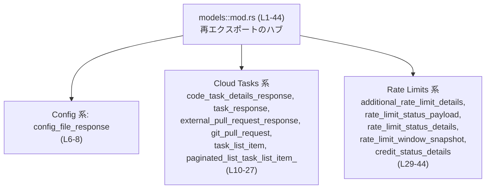

# codex-backend-openapi-models/src/models/mod.rs コード解説

## 0. ざっくり一言

- OpenAPI 生成物を基にした **モデル型の再エクスポート用ハブモジュール**です。
- ワークスペース内で実際に使われている型だけを厳選して公開するための入口になっています（`mod.rs:L1-4`）。

---

## 1. このモジュールの役割

### 1.1 概要

- このモジュールは、OpenAPI から生成された多数のモデルのうち、**現在のワークスペースで利用している型だけを選んで公開する**役割を持ちます（`mod.rs:L1-4`）。
- 個々の型定義はすべて別ファイル（サブモジュール）にあり、このファイルではそれらサブモジュールを `pub(crate) mod` として宣言し、必要な型だけ `pub use` で外部に再エクスポートしています（`mod.rs:L7-8, L11-12, L14-15, L17-18, L20-21, L23-24, L26-27, L30-31, L33-35, L37-38, L40-41, L43-44`）。

### 1.2 アーキテクチャ内での位置づけ

- `models::mod.rs` は、**モデル群の集約ポイント**として機能し、上位レイヤ（サービス層や API ハンドラなど）がここを経由してモデル型をインポートする構造になっていると考えられます。
- 実際の構造体・列挙体などの定義は、`config_file_response` や `rate_limit_status_payload` などの各サブモジュール側にあります（定義の中身はこのチャンクには現れません）。

主要な依存関係を簡略化して示すと、次のようになります。



> 図は、このチャンク（`mod.rs:L1-44`）内で確認できる依存関係だけをまとめています。

### 1.3 設計上のポイント

コードから読み取れる設計上の特徴は次の通りです。

- **厳選された公開 API**  
  - 先頭コメントに「Curated minimal export list」とある通り（`mod.rs:L1-3`）、多数あるはずの OpenAPI 生成モデルのうち、使用中の型だけを公開しています。
- **サブモジュールは crate 内限定公開**  
  - すべてのサブモジュールは `pub(crate) mod ...;` で宣言されており、クレート外からは直接アクセスできません（`mod.rs:L7, L11, L14, L17, L20, L23, L26, L30, L33, L37, L40, L43`）。
- **公開は `pub use` に集約**  
  - 外部から見えるのは `pub use` された型だけであり、公開 API を **1ファイルで管理しやすい構造**になっています（`mod.rs:L8, L12, L15, L18, L21, L24, L27, L31, L34-35, L38, L41, L44`）。
- **状態やロジックは保持しない**  
  - このファイルには構造体・列挙体・関数・メソッドなどの定義はなく、**コンパイル時の名前解決に関する設定のみ**を行っています。ランタイムの状態や処理ロジックは持ちません。
- **エラー処理・並行性の記述はなし**  
  - エラー処理やスレッド・非同期処理に関するコードは一切存在しません（`mod.rs:L1-44` 全体より）。それらは各モデルの定義側に存在すると考えられますが、このチャンクには現れません。

---

## 2. 主要な機能一覧（コンポーネントインベントリー）

このモジュールが提供する「機能」は、個々の型のロジックではなく、**特定のモデル型をクレート公開 API として露出すること**です。

### 2.1 再エクスポートしている型のグループ

- **Config 関連**
  - `ConfigFileResponse`（`mod.rs:L6-8`）  
    - サブモジュール: `config_file_response`
- **Cloud Tasks 関連**
  - `CodeTaskDetailsResponse`（`mod.rs:L10-12`）  
    - サブモジュール: `code_task_details_response`
  - `TaskResponse`（`mod.rs:L14-15`）  
    - サブモジュール: `task_response`
  - `ExternalPullRequestResponse`（`mod.rs:L17-18`）  
    - サブモジュール: `external_pull_request_response`
  - `GitPullRequest`（`mod.rs:L20-21`）  
    - サブモジュール: `git_pull_request`
  - `TaskListItem`（`mod.rs:L23-24`）  
    - サブモジュール: `task_list_item`
  - `PaginatedListTaskListItem`（`mod.rs:L26-27`）  
    - サブモジュール: `paginated_list_task_list_item_`
- **Rate Limits / クレジット関連**
  - `AdditionalRateLimitDetails`（`mod.rs:L29-31`）  
    - サブモジュール: `additional_rate_limit_details`
  - `PlanType`（`mod.rs:L33-35`）  
    - サブモジュール: `rate_limit_status_payload`
  - `RateLimitStatusPayload`（`mod.rs:L33-35`）  
    - サブモジュール: `rate_limit_status_payload`
  - `RateLimitStatusDetails`（`mod.rs:L37-38`）  
    - サブモジュール: `rate_limit_status_details`
  - `RateLimitWindowSnapshot`（`mod.rs:L40-41`）  
    - サブモジュール: `rate_limit_window_snapshot`
  - `CreditStatusDetails`（`mod.rs:L43-44`）  
    - サブモジュール: `credit_status_details`

> これらの型が構造体なのか列挙体なのか、具体的なフィールドやメソッドを持つかどうかは、このチャンクには現れません。

---

## 3. 公開 API と詳細解説

### 3.1 型一覧（公開 API として再エクスポートされる型）

このモジュールから外部に公開されている型の一覧です。

| 名前 | 種別 | 役割 / 用途 | 定義モジュール | 根拠 |
|------|------|-------------|----------------|------|
| `ConfigFileResponse` | 不明（このチャンクには現れない） | 名前から、設定ファイル取得 API のレスポンスモデルと推測されますが、断定はできません | `config_file_response` | `mod.rs:L6-8` |
| `CodeTaskDetailsResponse` | 不明 | Cloud Tasks 関連のタスク詳細レスポンスと推測されますが、断定はできません | `code_task_details_response` | `mod.rs:L10-12` |
| `TaskResponse` | 不明 | タスク単体のレスポンスモデルと推測されますが、断定はできません | `task_response` | `mod.rs:L14-15` |
| `ExternalPullRequestResponse` | 不明 | 外部サービス上の Pull Request レスポンスモデルと推測されますが、断定はできません | `external_pull_request_response` | `mod.rs:L17-18` |
| `GitPullRequest` | 不明 | Git の Pull Request を表すモデルと推測されますが、断定はできません | `git_pull_request` | `mod.rs:L20-21` |
| `TaskListItem` | 不明 | タスク一覧の各行を表すモデルと推測されますが、断定はできません | `task_list_item` | `mod.rs:L23-24` |
| `PaginatedListTaskListItem` | 不明 | タスク一覧のページング結果を表すモデルと推測されますが、断定はできません | `paginated_list_task_list_item_` | `mod.rs:L26-27` |
| `AdditionalRateLimitDetails` | 不明 | 追加のレート制限情報を表すと推測されますが、断定はできません | `additional_rate_limit_details` | `mod.rs:L29-31` |
| `PlanType` | 不明 | プラン種別（Free/Pro など）を示す型と推測されますが、断定はできません | `rate_limit_status_payload` | `mod.rs:L33-35` |
| `RateLimitStatusPayload` | 不明 | レート制限ステータスのペイロード全体を表すと推測されますが、断定はできません | `rate_limit_status_payload` | `mod.rs:L33-35` |
| `RateLimitStatusDetails` | 不明 | レート制限ステータスの詳細部分を表すと推測されますが、断定はできません | `rate_limit_status_details` | `mod.rs:L37-38` |
| `RateLimitWindowSnapshot` | 不明 | 特定時間窓でのレート制限状態のスナップショットと推測されますが、断定はできません | `rate_limit_window_snapshot` | `mod.rs:L40-41` |
| `CreditStatusDetails` | 不明 | クレジット残高や利用状況の詳細と推測されますが、断定はできません | `credit_status_details` | `mod.rs:L43-44` |

> 「種別」が不明なのは、これらの型定義が別ファイルにあり、このチャンク内に現れていないためです。

### 3.2 関数詳細（最大 7 件）

- このファイルには **関数定義が 1 つも存在しません**（`mod.rs:L1-44` 全体を確認）。
- したがって、このセクションで詳述すべき関数はありません。

### 3.3 その他の関数

- 補助関数やラッパー関数も一切定義されていません（`mod.rs:L1-44`）。

---

## 4. データフロー

このファイル自身にはランタイムの処理ロジックがないため、ここでは **「型の名前解決パス」としてのデータフロー** を説明します。

### 4.1 型解決の流れ（コンパイル時）

代表的なシナリオとして、クレート内のサービスコードが `ConfigFileResponse` を利用する場合の流れを、コンパイル時の名前解決レベルで示します。

```mermaid
sequenceDiagram
    participant S as "サービスコード\n(例: crate内の別モジュール)"
    participant M as "models::mod.rs (L1-44)"
    participant C as "config_file_response\nサブモジュール"

    S->>M: use crate::models::ConfigFileResponse;
    Note right of M: `pub use self::config_file_response::ConfigFileResponse;`\nで再エクスポート（mod.rs:L7-8）
    M->>C: ConfigFileResponse の定義を解決
    C-->>S: 型定義（構造はこのチャンクには現れない）
```

要点:

- サービス側は `crate::models::ConfigFileResponse` という 1 つのパスだけを知っていればよく、**サブモジュール名を意識する必要がありません**。
- 実際のフィールド構造やシリアライズ設定などはサブモジュールに隠蔽され、ここでは公開するかどうかだけを制御しています。
- HTTP レスポンスやデータベースとのやり取りなど、実際のランタイム・データフローは、このチャンクには現れません。

---

## 5. 使い方（How to Use）

### 5.1 基本的な使用方法

このファイルの主な用途は、「モデル型をどのパスからインポートするか」を統一することです。  
クレート内の別モジュールから利用する典型例は次のようになります。

```rust
// crate 内の他モジュールから models 配下の型を利用する例
use crate::models::ConfigFileResponse; // mod.rs で再エクスポートされている型をインポート（mod.rs:L6-8）

fn handle_config(response: ConfigFileResponse) {         // ConfigFileResponse 型を引数に取る関数
    // フィールド構造やメソッドは、このチャンクには現れません。
    // ここでは型名だけに依存することができます。
}
```

> `crate::models` が外部クレートに対して `pub mod models;` されているかどうかは、このチャンクからは分かりません。上記はクレート内部での利用例です。

### 5.2 よくある使用パターン

1. **API レスポンスモデルとして利用するパターン**

```rust
use crate::models::TaskResponse; // タスク取得 API のレスポンスモデル（mod.rs:L14-15）

async fn get_task(id: String) -> Result<TaskResponse, anyhow::Error> {
    // 実際の HTTP クライアントやデシリアライズ処理は別の場所にあります。
    // TaskResponse が serde 対応しているかどうかは、このチャンクには現れません。
    unimplemented!()
}
```

1. **レート制限情報をメタデータとして保持するパターン**

```rust
use crate::models::{RateLimitStatusPayload, RateLimitWindowSnapshot}; // mod.rs:L33-35, L40-41

struct ApiResult<T> {
    data: T,
    // API 呼び出し時のレート制限状態をメタデータとして添付
    rate_limit: Option<RateLimitStatusPayload>,
    last_window: Option<RateLimitWindowSnapshot>,
}
```

> これらの型が `Clone`, `Debug`, `Serialize` などのトレイトを実装しているかどうかは、このチャンクには現れません。

### 5.3 よくある間違い

このファイルの役割から考えられる誤用例を挙げます。

```rust
// 誤りの可能性が高い例: サブモジュールに直接依存する
// use crate::models::config_file_response::ConfigFileResponse;
// ↑ サブモジュールへの可視性やパス構造に依存してしまう。
//   さらに、このファイルで `pub(crate) mod` とされているため、クレート外からはそもそもアクセスできません（mod.rs:L7）。

// 推奨される例: 再エクスポートされたパスだけを使う
use crate::models::ConfigFileResponse;                  // mod.rs:L6-8 に集約された公開 API に依存する
```

### 5.4 使用上の注意点（まとめ）

- **公開パスにだけ依存する**  
  - `crate::models::...`（あるいはクレートがさらにラップしたパス）のみを利用し、`config_file_response` などサブモジュール名には依存しない設計が前提になっています。
- **型の中身はサブモジュール側で確認が必要**  
  - フィールドやトレイト実装、エラーハンドリングロジックはこのファイルからは分からないため、利用時は各サブモジュールの定義ファイルを確認する必要があります。
- **エラー処理・並行性に関する情報はない**  
  - このモジュールにはエラー型や非同期処理に関する記述がないため、それらに関する仕様は各モデルまたはそれを利用するサービス側のコードを参照する必要があります。

---

## 6. 変更の仕方（How to Modify）

### 6.1 新しい機能（モデル型）を追加する場合

このモジュールのパターンに従うと、新しいモデル型を公開したい場合の手順は次のようになります。

1. **サブモジュールを追加する**
   - 例: `new_model` というモデルを追加する場合、`src/models/new_model.rs` もしくは `src/models/new_model/mod.rs` に型定義を追加し、
   - このファイルに `pub(crate) mod new_model;` を追加します。  
     - 既存例: `pub(crate) mod config_file_response;`（`mod.rs:L7`）

2. **公開する型だけを `pub use` する**
   - `pub use self::new_model::NewModel;` のように、外部に見せたい型だけを再エクスポートします。  
     - 既存例: `pub use self::config_file_response::ConfigFileResponse;`（`mod.rs:L8`）

3. **グループコメントに追記する（任意）**
   - 既存の「// Config」「// Cloud Tasks」「// Rate Limits」といったコメント（`mod.rs:L6, L10, L29`）に倣い、関連するグループにコメントを追加すると整理しやすくなります。

> 先頭コメントで「The process for this will change」と記載されているため（`mod.rs:L4`）、将来的に自動生成に戻る可能性もあります。その場合、このファイルを直接編集すると上書きされる可能性がありますが、このチャンクだけからは詳細な運用ルールは分かりません。

### 6.2 既存の機能（公開モデル）を変更する場合

- **型定義の変更**
  - フィールド追加・削除などは、各サブモジュール側（例: `config_file_response`）で行います。
  - このファイルには型の中身が書かれていないため、ここで変更できるのは「どの型を公開するか」だけです。

- **公開・非公開の切り替え**
  - 型を外部に公開したくない場合は、該当する `pub use` 行を削除またはコメントアウトします。
  - 影響範囲の確認として、`ConfigFileResponse` などの公開名で検索し、使用箇所を洗い出す必要があります（このチャンクには使用箇所は現れません）。

- **注意すべき契約**
  - 一度公開した型を非互換に変更すると、クレートを利用している側のコードがコンパイルエラーまたはランタイムエラーになる可能性があります。
  - ただし、具体的なフィールドや型パラメータといった契約内容は、このチャンクからは分からないため、サブモジュールのコードを確認する必要があります。

---

## 7. 関連ファイル

このモジュールと密接に関係するファイル・ディレクトリ（推定されるパスを含む）をまとめます。

| パス（推定を含む） | 役割 / 関係 |
|--------------------|------------|
| `src/models/config_file_response.rs` または `src/models/config_file_response/mod.rs` | `ConfigFileResponse` 型の定義を含むと考えられます（`mod.rs:L7-8` より）。 |
| `src/models/code_task_details_response.rs` または 同名ディレクトリ | `CodeTaskDetailsResponse` 型の定義（`mod.rs:L11-12`）。 |
| `src/models/task_response.rs` | `TaskResponse` 型の定義（`mod.rs:L14-15`）。 |
| `src/models/external_pull_request_response.rs` | `ExternalPullRequestResponse` 型の定義（`mod.rs:L17-18`）。 |
| `src/models/git_pull_request.rs` | `GitPullRequest` 型の定義（`mod.rs:L20-21`）。 |
| `src/models/task_list_item.rs` | `TaskListItem` 型の定義（`mod.rs:L23-24`）。 |
| `src/models/paginated_list_task_list_item_.rs` | `PaginatedListTaskListItem` 型の定義（`mod.rs:L26-27`）。 |
| `src/models/additional_rate_limit_details.rs` | `AdditionalRateLimitDetails` 型の定義（`mod.rs:L30-31`）。 |
| `src/models/rate_limit_status_payload.rs` | `PlanType`, `RateLimitStatusPayload` の定義（`mod.rs:L33-35`）。 |
| `src/models/rate_limit_status_details.rs` | `RateLimitStatusDetails` 型の定義（`mod.rs:L37-38`）。 |
| `src/models/rate_limit_window_snapshot.rs` | `RateLimitWindowSnapshot` 型の定義（`mod.rs:L40-41`）。 |
| `src/models/credit_status_details.rs` | `CreditStatusDetails` 型の定義（`mod.rs:L43-44`）。 |

> 実際のファイル構成（`.rs` ファイルか、ディレクトリ + `mod.rs` か）は、このチャンクには現れませんが、Rust のモジュール規則に基づく一般的な推定です。

---

## 付録: Bugs/Security・Contracts・Tests・Performance についての補足

- **Bugs/Security**
  - このファイルには実行時ロジックがなく、単にモジュールと再エクスポートを宣言しているだけなので、直接的なバグやセキュリティホールは読み取れません（`mod.rs:L1-44`）。
- **Contracts / Edge Cases**
  - 各型の「契約」（必須フィールド、バリデーション、シリアライズ形式など）はサブモジュール側に定義されており、このチャンクには現れません。
- **Tests**
  - このファイルにはテストモジュール (`mod tests` など) は存在しません（`mod.rs:L1-44`）。
- **Performance/Scalability**
  - 単なる `mod` と `pub use` の宣言だけであり、ランタイム時のパフォーマンスやスケーラビリティに与える影響はほぼありません。

このファイルは、あくまで「**どのモデル型を公開するかを集中管理するための窓口**」であり、コアロジックやエラー処理、並行性はすべてサブモジュール側に委ねられている構造になっています。
