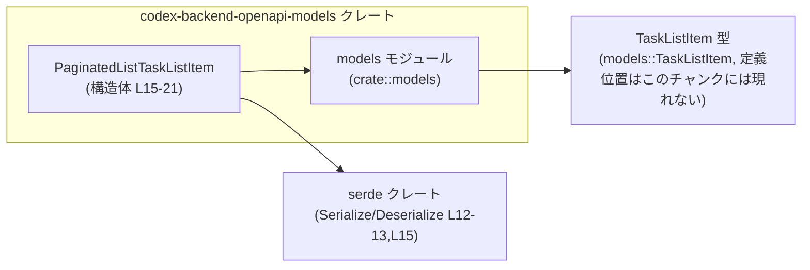
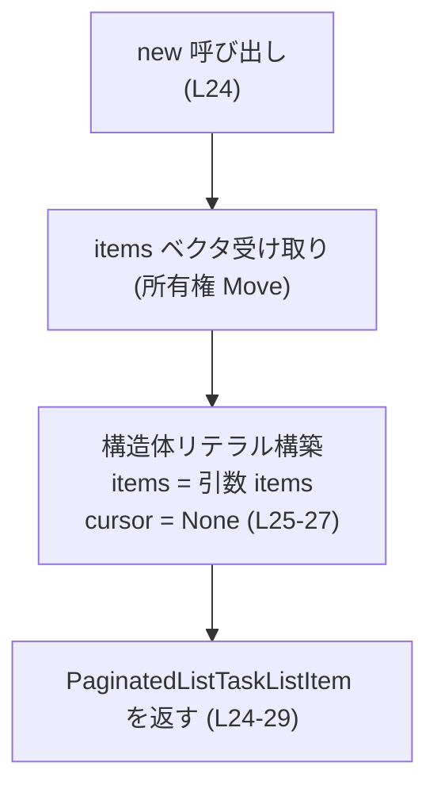
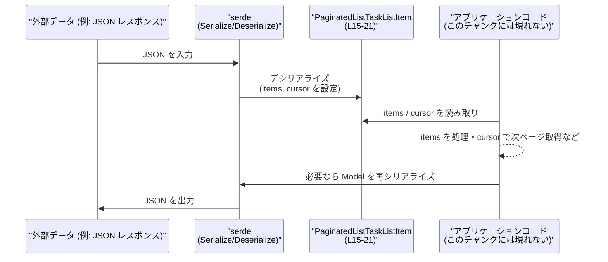

# codex-backend-openapi-models/src/models/paginated_list_task_list_item_.rs

## 0. ざっくり一言

ページングされた `TaskListItem` の一覧と、その位置を示すカーソル文字列を保持し、Serde を通じてシリアライズ／デシリアライズできるデータモデルです（OpenAPI Generator により自動生成されています）【paginated_list_task_list_item_.rs:L1-8,L15-20】。

---

## 1. このモジュールの役割

### 1.1 概要

- このモジュールは、OpenAPI 定義に基づく **タスクリストのページング結果** を表現するためのデータ構造を提供します【L1-8,L15-20】。
- `items: Vec<models::TaskListItem>` にタスクリストの要素を、`cursor: Option<String>` にページング位置を示すカーソルを保持します【L16-20】。
- Serde の `Serialize` / `Deserialize` を実装しており、JSON などへの変換を行う際のモデルとして利用されます【L12-13,L15】。

※「タスクリスト」「ページング」というドメイン上の意味は、型名・フィールド名からの解釈であり、詳細な仕様はこのチャンクからは分かりません。

### 1.2 アーキテクチャ内での位置づけ

このモジュールが依存する主なコンポーネントと、その関係です。



- `PaginatedListTaskListItem` は `crate::models` モジュール内の `TaskListItem` 型に依存します【L11,L18】。
- シリアライズ／デシリアライズは `serde::{Serialize, Deserialize}` に依存します【L12-13,L15】。
- API の入出力や内部処理で、この構造体がページング結果のコンテナとして利用されると考えられますが、呼び出し側の詳細はこのチャンクには現れません。

### 1.3 設計上のポイント

- **データ専用の構造体**  
  - フィールドは `items` と `cursor` の 2 つだけで、ロジックは単純なコンストラクタ `new` のみです【L16-21,L23-29】。
- **公開フィールド**  
  - `items` / `cursor` は `pub` であり、モジュール外から直接読み書きできます【L18-20】。
- **トレイトの自動実装**【L15】
  - `Clone`: 値の複製が可能。
  - `Default`: デフォルト値（`items` は空、`cursor` は `None`）を生成可能。
  - `Debug`: `{:?}` でのデバッグ出力が可能。
  - `PartialEq`: 等値比較が可能。
  - `Serialize` / `Deserialize`: Serde を用いたシリアライズ／デシリアライズが可能。
- **ページングカーソルの扱い**  
  - `cursor` は `Option<String>` であり、さらに Serde の `skip_serializing_if = "Option::is_none"` 指定により、`None` の場合は出力 JSON などにフィールド自体が含まれません【L19-20】。
- **状態およびエラーハンドリング**  
  - 構造体自体は不変ではなく、`pub` フィールドなので自由に変更可能です。
  - `new` は常に成功し、`Result` や `Option` を返さないため、このファイルの範囲ではエラー発生パスはありません【L24-29】。
  - 並行性（スレッド）や非同期処理を直接扱うコードは含まれていません。

---

## 2. 主要な機能一覧

- ページング結果コンテナ: `items` フィールドで `TaskListItem` の一覧を保持する【L16-18】。
- ページングカーソルの保持: 任意のカーソル文字列を `cursor` として保持する【L19-20】。
- シリアライズ／デシリアライズ: Serde トレイトの実装により JSON 等との相互変換を行う【L12-13,L15】。
- 便利コンストラクタ: `items` を受け取り、`cursor` を `None` としたインスタンスを生成する `new` メソッド【L23-29】。
- デフォルト生成: `Default` 実装により、空のページング結果を生成可能（詳細実装は派生により自動生成され、このチャンクには現れませんが、`#[derive(Default)]` から導かれます）【L15】。

---

## 3. 公開 API と詳細解説

### 3.1 型一覧（構造体・列挙体など）

#### コンポーネントインベントリー（このチャンク）

| 名前 | 種別 | 説明 | 根拠 |
|------|------|------|------|
| `PaginatedListTaskListItem` | 構造体 | ページングされた `TaskListItem` の一覧とカーソル文字列を保持するデータモデル | `paginated_list_task_list_item_.rs:L15-21` |
| `items` | フィールド (`Vec<models::TaskListItem>`) | ページ内のタスク項目の一覧を保持するベクタ | `paginated_list_task_list_item_.rs:L16-18` |
| `cursor` | フィールド (`Option<String>`) | 次のページなどを取得するためのカーソル文字列を任意に保持し、`None` の場合はシリアライズ時に省略される | `paginated_list_task_list_item_.rs:L19-20` |
| `PaginatedListTaskListItem::new` | 関数（関連メソッド） | `items` を指定し、`cursor` を `None` として初期化するコンストラクタ的メソッド | `paginated_list_task_list_item_.rs:L23-29` |

フィールドの詳細:

| フィールド名 | 型 | 役割 / 用途 | Serde 挙動 | 根拠 |
|--------------|----|------------|-----------|------|
| `items` | `Vec<models::TaskListItem>` | ページ内の各タスク項目を表す `TaskListItem` の配列 | `"items"` というフィールド名でシリアライズ／デシリアライズされる | `paginated_list_task_list_item_.rs:L16-18` |
| `cursor` | `Option<String>` | ページング位置を示すカーソルを任意に保持する。`None` の場合はカーソルなしを意味すると解釈できる | `"cursor"` というフィールド名でシリアライズされるが、`None` の場合はフィールド自体が出力されない | `paginated_list_task_list_item_.rs:L19-20` |

※ `TaskListItem` 自体の構造・役割はこのチャンクには現れません。

### 3.2 関数詳細

#### `PaginatedListTaskListItem::new(items: Vec<models::TaskListItem>) -> PaginatedListTaskListItem`

**概要**

- 渡された `items` ベクタをそのまま `items` フィールドに格納し、`cursor` を `None` とした `PaginatedListTaskListItem` を生成します【L23-29】。
- 典型的には「カーソル情報をまだ持たないページング結果」を表す初期値として利用できますが、その運用上の意味は仕様に依存し、このコードからは断定できません。

**引数**

| 引数名 | 型 | 説明 | 根拠 |
|--------|----|------|------|
| `items` | `Vec<models::TaskListItem>` | ページング結果として保持したい `TaskListItem` の一覧。所有権は呼び出し元からこの構造体へ移動します（Move） | `paginated_list_task_list_item_.rs:L24-27` |

- Rust の所有権モデル上、この引数はムーブされるため、呼び出し後に元の `items` 変数は使用できなくなります（`Clone` などを使えば複製は可能）。

**戻り値**

- 型: `PaginatedListTaskListItem`【L24-29】。
- 内容:
  - `items` フィールド: 引数 `items` で渡されたベクタ。
  - `cursor` フィールド: 常に `None`【L25-27】。

**内部処理の流れ**

1. 関数シグネチャで `items: Vec<models::TaskListItem>` を受け取る【L24】。
2. `PaginatedListTaskListItem { items, cursor: None }` という構造体リテラルを生成する【L25-27】。
   - ここで `items` はフィールド名と変数名が同じため、フィールド初期化簡略記法が用いられています【L25-26】。
   - `cursor` は明示的に `None` に設定されます【L27】。
3. 生成された構造体インスタンスを返します【L24-29】。

簡易フローチャート:



**Examples（使用例）**

> 注: `TaskListItem` の具体的な生成方法はこのチャンクには現れないため、ここでは「すでにどこかで作成済みの `Vec<TaskListItem>` を受け取る」前提の例を示します。

```rust
use crate::models::{PaginatedListTaskListItem, TaskListItem}; // このファイルと同じ crate 内での利用例

fn build_first_page(items: Vec<TaskListItem>) -> PaginatedListTaskListItem {
    // items の所有権は new に move される
    let page = PaginatedListTaskListItem::new(items);   // cursor は None で初期化される
    page
}
```

`page.cursor` は `None`、`page.items` には引数で渡したベクタが格納された状態になります【L25-27】。

カーソル付きで利用したい場合は、返された構造体の `cursor` を後から設定します。

```rust
use crate::models::{PaginatedListTaskListItem, TaskListItem};

fn build_page_with_cursor(items: Vec<TaskListItem>, next_cursor: String) -> PaginatedListTaskListItem {
    let mut page = PaginatedListTaskListItem::new(items); // cursor は一旦 None
    page.cursor = Some(next_cursor);                     // 公開フィールドのため直接代入可能
    page
}
```

**Errors / Panics**

- この関数は常に成功し、`Result` などのエラー型を返しません【L24-29】。
- 関数内で `panic!` を呼ぶ処理や、`unwrap` などパニックを起こしうる呼び出しもありません【L25-27】。
- よって、このファイルの範囲では `PaginatedListTaskListItem::new` の呼び出しでエラーやパニックが発生することはありません。

**Edge cases（エッジケース）**

- `items` が空のベクタ `Vec::new()` の場合  
  - そのまま `items` が空の `PaginatedListTaskListItem` が返ります。
  - 空であることに対する特別な処理やエラー処理はありません【L24-27】。
- `items` に非常に多くの要素が含まれている場合  
  - この関数は単に所有権を移動し構造体を生成するだけなので、要素数に応じた追加コストはほとんどありません（コピーではなく Move）。
- `TaskListItem` に `Send`/`Sync` などの制約はこのファイルには書かれていないため、並行性に関するエッジケース（スレッド間共有など）の詳細は不明です。
- `cursor` に関するエッジケース  
  - `new` は `cursor` を必ず `None` に設定するため、カーソル付き状態での初期化はできません【L24-27】。
  - カーソル付きで利用する場合は、呼び出し側で `cursor` フィールドを変更する必要があります【L18-20】。

**使用上の注意点**

- `items` の所有権移動  
  - 引数 `items` は Move されるため、呼び出し後に元の変数を使えないことに注意が必要です。
  - 共有したい場合は `Arc<Vec<TaskListItem>>` などポインタ型を使う、または `clone` する必要があります（これらはこのチャンクには現れませんが、一般的な Rust の慣習です）。
- `cursor` の初期値  
  - `new` を使うと `cursor` は必ず `None` になるため、カーソル付きのページを表現したい場合は後からフィールドを書き換える前提になります【L24-27】。
- 並行性  
  - 構造体自体はミュータブルな `pub` フィールドを持つため、同一インスタンスを複数スレッドから同時にミュータブルに扱う場合は、通常の Rust のスレッド安全性のルール（`&mut` の排他性、`Mutex` など）が必要になります。  
  - このファイルにスレッド関連のコードや `Send`/`Sync` 制約は記述されていません。

### 3.3 その他の関数

- このファイル内には `new` 以外の関数・メソッドは定義されていません【L23-29】。

---

## 4. データフロー

この構造体がシリアライズ／デシリアライズに使われる典型的なデータフローを、推測可能な範囲で示します（具体的な呼び出しコードはこのチャンクには現れないため、役割ベースの図になります）。

### 4.1 代表的なシナリオ

- 外部から JSON などでページングされたタスクリストが返ってくる。
- `serde` により `PaginatedListTaskListItem` にデシリアライズされる。
- アプリケーションコードが `items` を処理し、`cursor` を参照して次ページの取得などを行う。



- `items` / `cursor` の具体的な意味付けや、App 側の処理内容はこのチャンクからは分かりません。
- ただし、`cursor` に `skip_serializing_if = "Option::is_none"` が付いているため、App がカーソルを設定しない場合は、シリアライズ時に `"cursor"` フィールドが JSON から省略される点が重要です【L19-20】。

---

## 5. 使い方（How to Use）

### 5.1 基本的な使用方法

このモジュール内での典型的な利用パターンは、何らかの方法で得た `Vec<TaskListItem>` を使ってページング結果を構築することです。

```rust
use crate::models::{PaginatedListTaskListItem, TaskListItem}; // 同一 crate 内での利用を想定

fn example_usage(items: Vec<TaskListItem>) {
    // 1ページ分の TaskListItem を受け取り、ページング結果を構築する
    let mut page = PaginatedListTaskListItem::new(items); // cursor は None で初期化【L24-27】

    // 必要であれば、次ページ取得用のカーソルを設定する
    page.cursor = Some("next-cursor-token".to_string()); // 公開フィールドへの代入【L19-20】

    // Debug トレイトが実装されているので {:?} で出力可能【L15】
    println!("{:?}", page);
}
```

- 上記コードはこのファイルと同じ crate 内にあることを前提としたパス指定です。
- 実際のクレート構成によってはパスが異なる可能性がありますが、その点はこのチャンクからは分かりません。

### 5.2 よくある使用パターン

1. **カーソルなしの初期ページとして利用**

```rust
fn first_page(tasks: Vec<TaskListItem>) -> PaginatedListTaskListItem {
    // 初期ページ: cursor は None
    PaginatedListTaskListItem::new(tasks)
}
```

- API から最初のページを取得した結果を表す用途などが考えられます（用途はあくまで推測であり、このコードからは仕様は確定しません）。

1. **カーソル付きページの表現**

```rust
fn page_with_cursor(tasks: Vec<TaskListItem>, cursor: Option<String>) -> PaginatedListTaskListItem {
    let mut page = PaginatedListTaskListItem::new(tasks);
    page.cursor = cursor; // Option<String> をそのまま設定
    page
}
```

- API レスポンスがカーソルを返した場合などに、その文字列を `Some(...)` として格納できます。

1. **空ページ（`Default` 利用）**

```rust
fn empty_page() -> PaginatedListTaskListItem {
    PaginatedListTaskListItem::default() // items: 空ベクタ, cursor: None (derive(Default) より)
}
```

- `Default` の具体的な実装コードはこのチャンクには現れませんが、`#[derive(Default)]` により、各フィールドがそれぞれの `Default` 値で初期化される通常の挙動をします【L15】。

### 5.3 よくある間違い（起こりうる注意点）

このファイルから読み取れる範囲で、誤用につながりやすいポイントを列挙します。

```rust
// （注意例）cursor を設定したつもりでしていない
fn incorrect_usage(tasks: Vec<TaskListItem>) -> PaginatedListTaskListItem {
    let page = PaginatedListTaskListItem::new(tasks);
    // page.cursor に何も代入していないため、cursor は None のまま
    // API 仕様上、次ページがあるのに cursor を返し忘れる、などの不整合につながる可能性がある
    page
}
```

- この構造体には **バリデーションロジックが存在しない** ため、仕様上「不正」とされる可能性のある組み合わせ（例: 実際には次ページがあるのに `cursor = None` のまま、など）も表現できてしまいます【L16-21】。
- 何が不正かは API 仕様に依存し、このファイルからは判断できません。そのため、呼び出し側のコードで仕様に沿った値の組み合わせを保証する必要があります。

### 5.4 使用上の注意点（まとめ）

- **シリアライズ挙動**
  - `cursor` が `None` の場合、シリアライズ結果から `"cursor"` フィールドそのものが欠落します【L19-20】。
  - 受け側のシステムが「フィールド欠落」と「明示的に `null`」を区別する場合、この挙動を前提に設計する必要があります。
- **フィールドの公開による変更可能性**
  - `items` / `cursor` は `pub` であり、どこからでも書き換え可能です【L18-20】。
  - 誤った変更（意図しない `cursor` のクリア、`items` の上書きなど）もコンパイラが検出しないため、設計上の取り扱いに注意が必要です。
- **エラー処理**
  - この構造体と `new` メソッドにはエラー処理が存在せず、型レベルでは「不正な状態」を表現しない設計になっています【L23-29】。
  - エラーや不整合のチェックは、主に呼び出し元で行う前提とみなすのが自然ですが、その前提もこのチャンクからは断定できません。
- **並行性**
  - この構造体はシンプルな所有データのコンテナであり、スレッド安全性に関する特別な制約や同期機構は持ちません。
  - 複数スレッドから同じインスタンスにアクセスする場合は、通常の Rust のルール（`Send`/`Sync` 実装、`Mutex` など）の範囲で安全性を確保する必要があります。

---

## 6. 変更の仕方（How to Modify）

### 6.1 新しい機能を追加する場合

この構造体にページング関連の情報を追加したい場合の入口は、主に以下です。

1. **構造体にフィールドを追加する**
   - `PaginatedListTaskListItem` に新しいフィールドを追加する【L16-21】。
   - 例: ページサイズ `page_size: Option<i32>`、総件数 `total_count: Option<i64>` など（あくまで一般的な例であり、実際に何を追加すべきかは API 仕様によります）。
   - Serde のフィールド名や `skip_serializing_if` などの属性を必要に応じて付与します。

2. **`new` のロジックを拡張する**
   - 追加したフィールドについて、`new` 内での初期値を設定します【L23-29】。
   - 新たな引数を `new` に加えるか、後からフィールドを設定する設計にするかは、利用側のパターンに依存します。

3. **トレイト派生の見直し**
   - フィールド追加に伴い、`Default` や `Clone` などのトレイト派生を維持するか検討します【L15】。
   - 追加フィールドの型がこれらのトレイトを実装していない場合、自動導出に影響が出る可能性があります。

### 6.2 既存の機能を変更する場合

- **`cursor` の型や Serde 挙動を変更する**
  - 例: `Option<String>` から `Option<Cursor>` のような専用型に変更する、といった設計変更が考えられます。
  - この場合、`#[serde(rename = "cursor", skip_serializing_if = "Option::is_none")]` の指定や、新しい型の Serde 実装など、影響範囲を確認する必要があります【L19-20】。
- **`items` の型を変更する**
  - `Vec<models::TaskListItem>` から `Vec<models::TaskListItemRef>` のような別型に変える場合、API の入出力仕様や既存コードとの互換性に影響します【L18】。
- **影響範囲の確認**
  - 変更前後で `PaginatedListTaskListItem` を利用している箇所（シリアライズ／デシリアライズの境界、アプリケーションロジック）を全て確認する必要があります。
  - このファイルには利用箇所は含まれていないため、参照元の検索などを用いて別ファイルを確認する必要があります。

---

## 7. 関連ファイル

このモジュールと密接に関係していると読み取れるコンポーネントは以下の通りです。

| パス / モジュール | 役割 / 関係 | 根拠 |
|-------------------|------------|------|
| `crate::models` モジュール | `TaskListItem` 型を提供しており、本ファイルの `items` フィールドの要素型として利用されている。実際のファイルパス（例: `src/models/mod.rs` など）はこのチャンクには現れない。 | `paginated_list_task_list_item_.rs:L11,L18` |
| `models::TaskListItem` | ページング対象となるタスク項目を表す型。詳細な構造や役割はこのチャンクには現れない。 | `paginated_list_task_list_item_.rs:L18` |
| `serde::Serialize` / `serde::Deserialize` | `PaginatedListTaskListItem` のシリアライズ／デシリアライズを実現するトレイト。JSON などとの相互変換を行う際に利用される。 | `paginated_list_task_list_item_.rs:L12-13,L15` |

- このファイルにはテストコード（`#[cfg(test)]` モジュールなど）は含まれていません【L1-29】。
- 実際にどの API エンドポイントやサービスからこの型が使われているかは、このチャンクからは分かりません。
