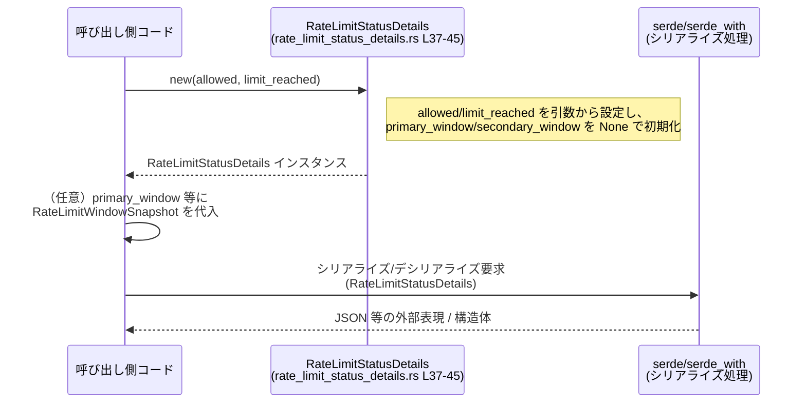

# codex-backend-openapi-models/src/models/rate_limit_status_details.rs 解説

## 0. ざっくり一言

レートリミット判定結果（許可されたかどうか、どのウィンドウで制限に到達したか）を表現し、JSON などへのシリアライズ／デシリアライズに対応したデータモデルです（`rate_limit_status_details.rs:L15-35`）。

---

## 1. このモジュールの役割

### 1.1 概要

- このファイルは、レートリミット（アクセス制限）の状態を表現する **`RateLimitStatusDetails` 構造体** を定義します（`L15-35`）。
- 許可／不許可のブール値と、プライマリ／セカンダリの時間ウィンドウごとのスナップショットを保持できるようになっています（`L17-20`, `L21-34`）。
- 構造体には、最小限の初期化を行う `new` コンストラクタが用意されています（`L37-45`）。

### 1.2 アーキテクチャ内での位置づけ

このモジュールは、OpenAPI Generator により生成された「models」群の 1 つであり、シリアライズ可能な DTO（Data Transfer Object: データ転送用オブジェクト）として機能します。

依存関係（コードから分かる範囲）は次の通りです。

- 依存先
  - `crate::models::RateLimitWindowSnapshot`  
    レートリミットのウィンドウスナップショット型。詳細はこのチャンクには出てきません（`L11`, `L27`, `L34`）。
  - `serde::{Serialize, Deserialize}`  
    構造体をシリアライズ／デシリアライズするためのトレイト（`L12-13`, `L15`）。
  - `serde_with::rust::double_option`  
    二重の `Option` をうまく取り扱うためのシリアライズヘルパ（`L21-25`, `L28-32`）。

これを簡単な依存関係図にすると次のようになります。

```mermaid
graph LR
  subgraph "rate_limit_status_details.rs (L15-45)"
    R[RateLimitStatusDetails]
  end

  R -->|フィールド型として参照| W[models::RateLimitWindowSnapshot<br/>(他ファイル)]
  R -->|Serialize/Deserialize 派生| Serde[serde]
  R -->|"with = serde_with::rust::double_option"| SW[serde_with::rust::double_option]
```

### 1.3 設計上のポイント

コードから読み取れる設計上の特徴は次の通りです。

- **純粋なデータ構造**  
  - ロジックは `new` コンストラクタのみで、ビジネスロジック的な処理は含まれていません（`L37-45`）。
- **シリアライズ前提の設計**  
  - `Serialize`, `Deserialize` を derive し、`#[serde(rename = "...")]` で JSON のフィールド名を制御しています（`L15-20`, `L21-34`）。
  - `primary_window` / `secondary_window` は `serde_with::rust::double_option` を利用し、二重の `Option` を適切に扱えるようにしています（`L21-27`, `L28-34`）。
- **三値以上を表現可能なフィールド**  
  - `primary_window` / `secondary_window` は `Option<Option<Box<...>>>` であり、  
    - `None`  
    - `Some(None)`  
    - `Some(Some(Box<...>))`  
    といった複数状態を区別できる形になっています（`L27`, `L34`）。
- **エラーハンドリング・並行性**  
  - 当該ファイル内にエラーハンドリングロジックやスレッド並行処理はありません。
  - `unsafe` ブロックや共有可変状態もなく、所有権／借用まわりは自明な構造です。

---

## 2. 主要な機能一覧

このモジュールが提供する主な機能は以下の通りです。

- `RateLimitStatusDetails` 構造体: レートリミット判定結果と各ウィンドウの状態を保持（`L15-35`）
- `RateLimitStatusDetails::new`: `allowed` / `limit_reached` を指定して構造体を初期化する簡易コンストラクタ（`L37-45`）
- Serde 連携: JSON などへのシリアライズ／デシリアライズをカスタム属性付きでサポート（`L15-20`, `L21-34`）

---

## 3. 公開 API と詳細解説

### 3.1 型一覧（構造体・列挙体など）

**構造体一覧（コンポーネントインベントリー）**

| 名前 | 種別 | フィールド | 型 | 役割 / 用途 | 根拠 |
|------|------|-----------|----|-------------|------|
| `RateLimitStatusDetails` | 構造体 | `allowed` | `bool` | リクエストがレートリミット上「許可されたかどうか」を表すフラグと解釈できるブール値 | `rate_limit_status_details.rs:L16-18` |
| | | `limit_reached` | `bool` | レートリミットの上限に到達したかどうかを表すフラグと解釈できるブール値 | `L19-20` |
| | | `primary_window` | `Option<Option<Box<models::RateLimitWindowSnapshot>>>` | プライマリレートリミットウィンドウのスナップショット情報を保持するためのフィールド。二重 `Option` で複数状態を区別可能 | `L21-27` |
| | | `secondary_window` | `Option<Option<Box<models::RateLimitWindowSnapshot>>>` | セカンダリレートリミットウィンドウのスナップショット情報を保持するためのフィールド | `L28-34` |

- `RateLimitStatusDetails` は `Clone`, `Default`, `Debug`, `PartialEq`, `Serialize`, `Deserialize` の各トレイトを derive しています（`L15`）。

### 3.2 関数詳細（重要 API）

このファイルには公開関数として `RateLimitStatusDetails::new` が 1 つ定義されています（`L37-45`）。

#### `RateLimitStatusDetails::new(allowed: bool, limit_reached: bool) -> RateLimitStatusDetails`

**概要**

- レートリミット判定結果を表す `RateLimitStatusDetails` を作成するための簡易コンストラクタです（`L37-45`）。
- `primary_window` / `secondary_window` は `None` に初期化されます。

**引数**

| 引数名 | 型 | 説明 | 根拠 |
|--------|----|------|------|
| `allowed` | `bool` | レートリミット上、リクエストが許可されるかどうかを表すブール値と解釈できる引数 | `rate_limit_status_details.rs:L38` |
| `limit_reached` | `bool` | レートリミットの上限に到達したかどうかを表すブール値と解釈できる引数 | `L38` |

**戻り値**

- 型: `RateLimitStatusDetails`（`L38`）
- 内容: フィールド `allowed` / `limit_reached` は引数の値がそのまま入り、`primary_window` / `secondary_window` は `None` で初期化されたインスタンスです（`L39-43`）。

**内部処理の流れ（アルゴリズム）**

コードの挙動はシンプルで、以下のようになります（`L38-44`）。

1. `allowed` / `limit_reached` を引数として受け取る。
2. フィールド初期化構文を用いて `RateLimitStatusDetails { ... }` を構築する。
   - `allowed` フィールドに引数 `allowed` を代入（省略記法）（`L40`）。
   - `limit_reached` フィールドに引数 `limit_reached` を代入（`L41`）。
   - `primary_window` フィールドを `None` に設定（`L42`）。
   - `secondary_window` フィールドを `None` に設定（`L43`）。
3. 構築したインスタンスを返却する。

**使用例（正常系）**

ここでは、同一クレート内からこの構造体を利用する最小例を示します。

```rust
use crate::models::RateLimitStatusDetails; // 同一クレート内の models モジュールからインポートする想定

fn example() {
    // レートリミット判定結果を表現したい状況を仮定する
    let allowed = true;                     // このリクエストは許可されたとする
    let limit_reached = false;             // まだ上限には達していないとする

    // コンストラクタでインスタンスを作成する
    let status = RateLimitStatusDetails::new(allowed, limit_reached);

    // allowed と limit_reached が引数の値で初期化され、
    // primary_window / secondary_window は None になっている
    assert_eq!(status.allowed, true);
    assert_eq!(status.limit_reached, false);
    assert!(status.primary_window.is_none());
    assert!(status.secondary_window.is_none());
}
```

シリアライズ例（`serde_json` を想定）：

```rust
use crate::models::RateLimitStatusDetails;      // 構造体のインポート
use serde_json;                                 // JSON シリアライズ／デシリアライズ用クレート

fn serialize_example() -> serde_json::Result<()> {
    let status = RateLimitStatusDetails::new(true, false); // ウィンドウ情報なしの状態を構築

    // JSON 文字列にシリアライズする
    let json = serde_json::to_string(&status)?;            // ? で Result を呼び出し元に伝播
    println!("serialized: {}", json);

    // JSON から構造体にデシリアライズする
    let deserialized: RateLimitStatusDetails =
        serde_json::from_str(&json)?;                      // JSON -> 構造体

    assert_eq!(status, deserialized);                      // Serialize/Deserialize が対称であることを確認
    Ok(())
}
```

※ `serde_json` の利用はこのファイルには現れませんが、`Serialize` / `Deserialize` 派生があるため、典型的な利用例として示しています。

**Errors / Panics**

- `RateLimitStatusDetails::new` 自体にはエラーも `panic!` も含まれていません（`L38-44`）。
- 上記シリアライズ例では、`serde_json::to_string`, `serde_json::from_str` が `Result` を返すため、エラーはそれらの関数に依存します（このファイルでは扱っていません）。

**Edge cases（エッジケース）**

- `allowed = false` / `limit_reached = false` など、論理的にどう解釈すべきかはこのコードだけからは決まりません。構造体としてはどの組み合わせでも生成可能です（`L38-41`）。
- `primary_window` / `secondary_window` は `new` では常に `None` で初期化されるため、詳細なウィンドウ情報を持たせたい場合は呼び出し側で明示的に代入する必要があります（`L42-43`）。

**使用上の注意点**

- **論理整合性は呼び出し側で保証する必要がある**  
  - 例: `allowed == true` かつ `limit_reached == true` のような状態も作成できるため、どの組み合わせを許容するかは上位ロジックで管理する必要があります。
- **二重 `Option` への代入に注意**  
  - `primary_window` / `secondary_window` は `Option<Option<Box<...>>>` のため、  
    - 「フィールド自体が存在しない」のか（`None`）  
    - 「フィールドは存在するが値が null に相当する」のか（`Some(None)` となる可能性）  
    を区別するような設計になっています。具体的な意味づけはこのファイルからは分かりませんが、誤って一重の `Option` だと考えて代入すると意図しない状態になる可能性があります。

### 3.3 その他の関数

- このファイル内には `new` 以外のメソッドや補助関数は定義されていません（`L37-45`）。

---

## 4. データフロー

ここでは、この構造体が生成されてシリアライズされるまでの典型的な流れ（構造体内部・serde 周辺のみ）を示します。

### 4.1 フロー概要

1. 呼び出し側コードがレートリミット判定ロジックにより `allowed` / `limit_reached` を決定する（ロジックはこのファイルにはありません）。
2. 呼び出し側が `RateLimitStatusDetails::new(allowed, limit_reached)` を呼び出し、インスタンスを構築する（`L37-45`）。
3. 必要に応じて、呼び出し側で `primary_window` や `secondary_window` に `RateLimitWindowSnapshot` を格納する（代入コードはこのファイルにはありません）。
4. 構造体が HTTP レスポンスやログ用に serde 経由でシリアライズされる。

### 4.2 シーケンス図



---

## 5. 使い方（How to Use）

### 5.1 基本的な使用方法

最も基本的な使い方は、`allowed` / `limit_reached` を与えてインスタンスを作り、そのまま返す／シリアライズすることです。

```rust
use crate::models::RateLimitStatusDetails;    // 同一クレートの models からインポートする想定
use serde_json;                               // JSON シリアライズ用

fn handle_rate_limit() -> serde_json::Result<String> {
    // レートリミットの判定結果を仮定する
    let allowed = true;                       // 許可された
    let limit_reached = false;               // まだ上限には達していない

    // 構造体を構築する（ウィンドウ情報はここでは未設定）
    let mut status = RateLimitStatusDetails::new(allowed, limit_reached);

    // ここで必要なら status.primary_window / secondary_window に
    // RateLimitWindowSnapshot を設定する（このファイルには具体例はありません）

    // API レスポンス等のため JSON 文字列に変換する
    let json = serde_json::to_string(&status)?; // エラーは Result で返す
    Ok(json)
}
```

### 5.2 よくある使用パターン

1. **最小情報のみ返すパターン**

   - `allowed` と `limit_reached` のみを使用し、ウィンドウ情報は返さない（`primary_window` / `secondary_window` は `None` のまま）。
   - クライアント側は単にリクエストが許可されるかどうかを判断する用途。

2. **詳細なウィンドウ情報を付加するパターン**

   - 上位コードで `RateLimitWindowSnapshot` を構築し、`primary_window` / `secondary_window` に設定する。
   - 二重 `Option` のため、呼び出し側は `Some(Some(Box::new(snapshot)))` のように入れ子にして代入する必要があります。

   ```rust
   // RateLimitWindowSnapshot の実際の構造はこのチャンクにはありませんが、
   // 型として Box<RateLimitWindowSnapshot> が必要になることだけが分かります。
   # struct RateLimitWindowSnapshotDummy; // ダミー型（実際の定義ではありません）

   use crate::models::RateLimitStatusDetails;

   fn set_window_example() {
       let mut status = RateLimitStatusDetails::new(true, false);

       // 実際には crate::models::RateLimitWindowSnapshot のインスタンスを生成する必要があります。
       // ここでは型だけを説明するためにダミーを使用しています。
       let window_snapshot = RateLimitWindowSnapshotDummy;

       // 二重 Option への代入例（意味づけは実際の仕様に依存します）
       // status.primary_window = Some(Some(Box::new(window_snapshot)));
       let _ = status; // コンパイル用のダミー行
   }
   ```

   ※ 上記の `RateLimitWindowSnapshotDummy` は説明用のダミーであり、実際のプロジェクトには存在しません。このファイルだけでは `RateLimitWindowSnapshot` の詳細が分からないため、完全なコード例は提示できません。

### 5.3 よくある間違い（想定されるもの）

コードから想定される誤用例と注意点です。

```rust
use crate::models::RateLimitStatusDetails;

// 間違い例: primary_window を一重の Option だと勘違いする
fn wrong_example() {
    let mut status = RateLimitStatusDetails::new(true, false);

    // コンパイルエラー例（型が合わない）:
    // status.primary_window = Some(Box::new(...));
    //   ^^^^^^^^^^^^^^^^^^^^^^^^^^^^^^^^^^^^^^^
    // expected Option<Option<Box<_>>>, found Option<Box<_>>
}

// 正しい方向性: 二重の Option であることを意識する
fn correct_direction_example() {
    let mut status = RateLimitStatusDetails::new(true, false);

    // 実際には RateLimitWindowSnapshot の値を生成する必要がある。
    // 型としては次のような形が求められる:
    // status.primary_window = Some(Some(Box::new(snapshot)));
    let _ = status;
}
```

### 5.4 使用上の注意点（まとめ）

- **二重の Option を正しく扱うこと**  
  - `primary_window` / `secondary_window` は `Option<Option<Box<_>>>` であり、`None` と `Some(None)` の意味の違いを設計としてどう扱うかは、上位仕様に依存します。少なくとも、型として二段階の有無を表現できるように設計されています（`L27`, `L34`）。
- **論理整合性の管理**  
  - フィールド間の論理関係（例: `allowed == false` なら必ず `limit_reached == true` であるべきかどうか）は、この構造体では保証されていません。呼び出し側で整合性を保つ必要があります。
- **スレッド安全性**  
  - このファイルだけでは `RateLimitWindowSnapshot` が `Send` / `Sync` かどうか分からないため、`RateLimitStatusDetails` がスレッド間共有に適しているかは不明です。並行処理で共有したい場合は、`RateLimitWindowSnapshot` の定義を確認する必要があります。

---

## 6. 変更の仕方（How to Modify）

### 6.1 新しい機能を追加する場合

1. **フィールドを追加する**  
   - 例: レートリミットの種別（エンドポイント、ユーザー単位など）を表すフィールドを追加したい場合は、`RateLimitStatusDetails` 構造体に新しいフィールドを追加し、必要なら `#[serde(rename = "...")]` を付与します（`L16-35` を参考）。
   - `new` コンストラクタで初期値をどうするかを決め、`RateLimitStatusDetails { ... }` の初期化式にフィールドを追加します（`L39-43`）。

2. **メソッドを追加する**  
   - 判定ロジック（例: 「現在の状態でリクエストを許可すべきか」を返すメソッド）を追加したい場合は、`impl RateLimitStatusDetails` ブロック（`L37-45`）内にメソッドを定義します。
   - エラーハンドリングが必要なメソッドであれば、`Result` を返すように設計します。

3. **serde の挙動を変更する**  
   - JSON フィールド名を変えたい場合は `#[serde(rename = "...")]` を調整します（`L17-20`, `L21-26`, `L28-33`）。
   - 二重 `Option` の扱いを変えたい場合は、`with = "::serde_with::rust::double_option"` の指定変更が必要ですが、その影響範囲を慎重に確認する必要があります。

### 6.2 既存の機能を変更する場合

- **フィールド型を変更する場合**
  - 例: `primary_window` を単一 `Option` に変更したい場合、型の変更だけでなく、serde 属性・既存クライアントとの互換性・テストをすべて確認する必要があります。
  - `Option<Option<Box<_>>>` から `Option<Box<_>>` へ変更すると、JSON 表現やデシリアライズ時の挙動も変わります。

- **`new` のシグネチャや初期化ロジックを変える場合**
  - もし `new` に `primary_window` や `secondary_window` を引数として追加する場合、既存コードが `new(allowed, limit_reached)` を呼んでいる箇所はすべて修正対象になります（`L38`）。
  - 返却インスタンスのフィールド初期値が変わることで、テストやクライアントコードが期待しているデフォルト挙動が変わる可能性があります。

- **契約（前提条件・返り値の意味）の確認**
  - フィールドの意味付けや JSON とのマッピングは API 契約に相当します。変更前に OpenAPI スキーマやクライアント側の依存コードを確認する必要があります。

---

## 7. 関連ファイル

このモジュールと密接に関係するコンポーネント（コードから分かる範囲）は以下の通りです。

| パス / シンボル | 役割 / 関係 | 根拠 |
|----------------|------------|------|
| `crate::models::RateLimitWindowSnapshot` | `primary_window` / `secondary_window` の要素型として参照されるレートリミットウィンドウのスナップショット型。定義ファイルはこのチャンクには現れません。 | `rate_limit_status_details.rs:L11`, `L27`, `L34` |
| `serde::Serialize` / `serde::Deserialize` | `RateLimitStatusDetails` をシリアライズ／デシリアライズ可能にするためのトレイト。derive で自動実装されています。 | `L12-13`, `L15` |
| `serde_with::rust::double_option` | `primary_window` / `secondary_window` に対して、二重の `Option` をサポートするシリアライズヘルパ。詳細な挙動はこのファイルだけからは分かりません。 | `L21-25`, `L28-32` |

---

### Bugs / Security / Contracts / Edge Cases（補足）

- **バグの可能性**
  - 明示的なバグは見当たりませんが、`allowed` と `limit_reached` の組み合わせに関する整合性チェックが存在しないため、「意味的に矛盾した状態」を作れてしまう可能性はあります（仕様次第）。
- **セキュリティ**
  - このファイルはデータモデルの定義のみであり、入力検証や認可ロジックは含みません。
  - `unsafe` コードは存在せず、シリアライズ時のバッファ操作も serde に委譲されています（`L15-35`）。
- **契約・エッジケース**
  - 二重 `Option` の扱いが API 契約上重要なポイントになる可能性があります。`None` と `Some(None)` をどのように解釈するかは、OpenAPI スキーマやドキュメントを参照する必要があります（このチャンクには記述なし）。
- **テスト**
  - このファイルにはテストコードは含まれていません。シリアライズ／デシリアライズの往復テストや、二重 `Option` のパターンをカバーするテストを書くと挙動が明確になります。

以上が、本ファイル `rate_limit_status_details.rs` の客観的な構造と振る舞いの整理です。
