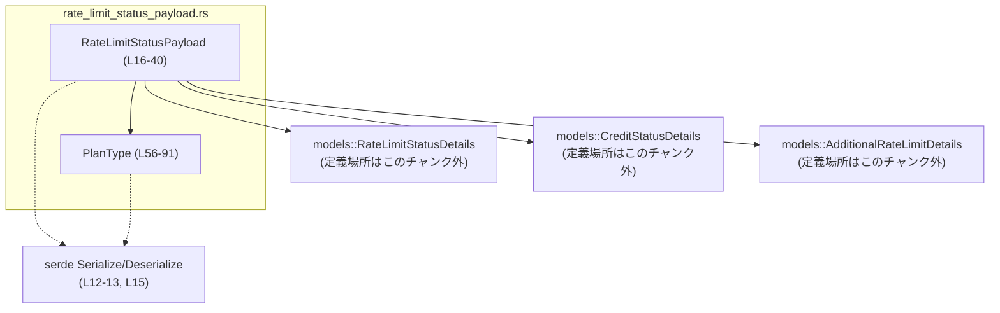
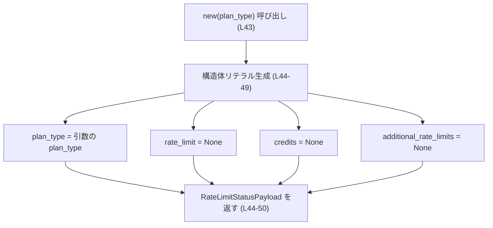
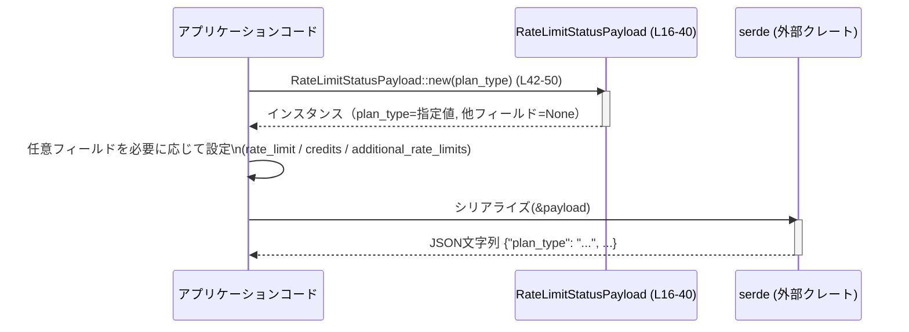

# codex-backend-openapi-models/src/models/rate_limit_status_payload.rs コード解説

## 0. ざっくり一言

- レート制限およびクレジット状況を表す **レスポンス用ペイロード構造体** と、その料金プラン種別を表す **列挙型 PlanType** を定義するモジュールです（`rate_limit_status_payload.rs:L16-40, L53-91`）。

---

## 1. このモジュールの役割

### 1.1 概要

- このモジュールは、OpenAPI 定義に基づいて生成された **「レート制限ステータス」レスポンスのモデル** を提供します（`/* Generated by: https://openapi-generator.tech */` `rate_limit_status_payload.rs:L1-9`）。
- 具体的には、必須の `plan_type` と、任意の `rate_limit` / `credits` / `additional_rate_limits` 情報を JSON と相互変換できるように表現します（`rate_limit_status_payload.rs:L16-40`）。

### 1.2 アーキテクチャ内での位置づけ

- 依存関係（このチャンクから読み取れる範囲）:

  - 依存する外部クレート
    - `serde::{Serialize, Deserialize}`（シリアライズ/デシリアライズ用）`rate_limit_status_payload.rs:L12-13`
    - `serde_with::rust::double_option`（二重 `Option` 用のカスタムシリアライザ）`rate_limit_status_payload.rs:L22, L36`
  - 依存する内部モジュール
    - `crate::models::RateLimitStatusDetails`（詳細なレート制限情報）`rate_limit_status_payload.rs:L25`
    - `crate::models::CreditStatusDetails`（クレジット残高など）`rate_limit_status_payload.rs:L32`
    - `crate::models::AdditionalRateLimitDetails`（追加レート制限情報）`rate_limit_status_payload.rs:L39`

- 代表的な依存関係の図示（本ファイル内の範囲に限定）:



### 1.3 設計上のポイント

- **Pure Data Model（状態は持つがロジックはほぼ持たない）**
  - 主体は `RateLimitStatusPayload` 構造体と `PlanType` 列挙体で、ビジネスロジックはほぼなく、データ表現とシリアライズ設定が中心です（`rate_limit_status_payload.rs:L16-40, L53-91`）。
- **必須 / 任意フィールドの明確な区別**
  - `plan_type` は非 `Option` で必須フィールド、他の 3 フィールドは二重 `Option` で任意フィールドとして定義されています（`rate_limit_status_payload.rs:L17-39`）。
- **二重 Option + serde_with による 3 状態表現**
  - `Option<Option<...>>` と `serde_with::rust::double_option` により、「フィールドが存在しない」「存在するが `null`」「値がある」の 3 状態を区別する設計です（`rate_limit_status_payload.rs:L19-25, L27-32, L34-39`）。
- **PlanType の将来互換性**
  - `PlanType::Unknown` に `#[serde(rename = "unknown", other)]` が付与されており、未対応の文字列プランが来ても `Unknown` にフォールバックできるように設計されています（`rate_limit_status_payload.rs:L90-91`）。

---

## 2. 主要な機能一覧

このモジュールが提供する主な機能は次のとおりです。

- `RateLimitStatusPayload` 構造体: レート制限・クレジットステータスをまとめて表現し、JSON との相互変換を行う（`rate_limit_status_payload.rs:L16-40`）。
- `RateLimitStatusPayload::new` 関数: 必須の `plan_type` のみ指定してペイロードを初期化するコンストラクタ（`rate_limit_status_payload.rs:L42-50`）。
- `PlanType` 列挙体: ユーザーの料金プラン種別（guest / free / pro など）の列挙と、未知文字列に対する `Unknown` フォールバックを提供する（`rate_limit_status_payload.rs:L56-91`）。

---

## 3. 公開 API と詳細解説

### 3.1 型一覧（構造体・列挙体など）

**コンポーネントインベントリー**

| 名前 | 種別 | 役割 / 用途 | 定義場所（根拠） |
|------|------|-------------|------------------|
| `RateLimitStatusPayload` | 構造体 | レート制限・クレジット・追加レート制限のステータスを 1 つのペイロードとして表現する | `rate_limit_status_payload.rs:L16-40` |
| `PlanType` | 列挙体 | 利用者の料金プラン種別（guest, free, pro など）を表す | `rate_limit_status_payload.rs:L53-91` |

#### `RateLimitStatusPayload` のフィールド詳細

| フィールド名 | 型 | 説明 | serde 設定 / 根拠 |
|-------------|----|------|-------------------|
| `plan_type` | `PlanType` | 利用者のプラン種別を表す必須フィールド | `#[serde(rename = "plan_type")]`（`rate_limit_status_payload.rs:L17-18`） |
| `rate_limit` | `Option<Option<Box<models::RateLimitStatusDetails>>>` | 通常のレート制限の詳細。フィールド非存在 / null / 値ありを区別 | `rename = "rate_limit"`, `with = "::serde_with::rust::double_option"`, `skip_serializing_if = "Option::is_none"`（`rate_limit_status_payload.rs:L19-25`） |
| `credits` | `Option<Option<Box<models::CreditStatusDetails>>>` | クレジット残高などの状態。`rate_limit` と同様に三値表現 | `rename = "credits"`, 同じく `double_option`（`rate_limit_status_payload.rs:L27-32`） |
| `additional_rate_limits` | `Option<Option<Vec<models::AdditionalRateLimitDetails>>>` | 追加レート制限（エンドポイントごとなど）情報のリスト | `rename = "additional_rate_limits"`, 同じく `double_option`（`rate_limit_status_payload.rs:L34-39`） |

#### `PlanType` のバリアント一覧

| バリアント | serde 名（文字列） | 説明 | 根拠 |
|-----------|--------------------|------|------|
| `Guest` | `"guest"` | ゲストプラン（デフォルト） | `#[serde(rename = "guest")]`, `#[default]`（`rate_limit_status_payload.rs:L57-59`） |
| `Free` | `"free"` | 無料プラン | `rate_limit_status_payload.rs:L60-61` |
| `Go` | `"go"` | go プラン | `rate_limit_status_payload.rs:L62-63` |
| `Plus` | `"plus"` | plus プラン | `rate_limit_status_payload.rs:L64-65` |
| `Pro` | `"pro"` | pro プラン | `rate_limit_status_payload.rs:L66-67` |
| `ProLite` | `"prolite"` | prolite プラン | `rate_limit_status_payload.rs:L68-69` |
| `FreeWorkspace` | `"free_workspace"` | 無料ワークスペースプラン | `rate_limit_status_payload.rs:L70-71` |
| `Team` | `"team"` | チームプラン | `rate_limit_status_payload.rs:L72-73` |
| `SelfServeBusinessUsageBased` | `"self_serve_business_usage_based"` | セルフサーブビジネス（従量課金） | `rate_limit_status_payload.rs:L74-75` |
| `Business` | `"business"` | ビジネスプラン | `rate_limit_status_payload.rs:L76-77` |
| `EnterpriseCbpUsageBased` | `"enterprise_cbp_usage_based"` | エンタープライズ CBP（従量） | `rate_limit_status_payload.rs:L78-79` |
| `Education` | `"education"` | 教育プラン | `rate_limit_status_payload.rs:L80-81` |
| `Quorum` | `"quorum"` | quorum プラン | `rate_limit_status_payload.rs:L82-83` |
| `K12` | `"k12"` | K-12 教育プラン | `rate_limit_status_payload.rs:L84-85` |
| `Enterprise` | `"enterprise"` | エンタープライズ | `rate_limit_status_payload.rs:L86-87` |
| `Edu` | `"edu"` | edu プラン | `rate_limit_status_payload.rs:L88-89` |
| `Unknown` | `"unknown"` + `other` | 未知のプラン文字列に対するフォールバック | `#[serde(rename = "unknown", other)]`（`rate_limit_status_payload.rs:L90-91`） |

### 3.2 関数詳細

このファイル内で定義される関数は 1 つです。

#### `RateLimitStatusPayload::new(plan_type: PlanType) -> RateLimitStatusPayload`

**概要**

- 必須フィールド `plan_type` だけを指定して `RateLimitStatusPayload` を構築し、他の任意フィールドをすべて未設定（外側 `Option` が `None`）で初期化するコンストラクタです（`rate_limit_status_payload.rs:L42-50`）。

**引数**

| 引数名 | 型 | 説明 |
|--------|----|------|
| `plan_type` | `PlanType` | 利用者の料金プランを表す列挙体。`PlanType` はこのモジュールで定義されています（`rate_limit_status_payload.rs:L56-91`）。 |

**戻り値**

- 型: `RateLimitStatusPayload`
- 内容:
  - `plan_type`: 引数で渡された値
  - `rate_limit`: `None`
  - `credits`: `None`
  - `additional_rate_limits`: `None`

  これにより、JSON シリアライズ時には `plan_type` のみが出力され、他のフィールドは出力されません（`skip_serializing_if = "Option::is_none"` のため。`rate_limit_status_payload.rs:L19-25, L27-32, L34-39`）。

**内部処理の流れ**

`rate_limit_status_payload.rs:L42-50` に基づき、処理は次のようになります。

1. 関数シグネチャで `plan_type: PlanType` を受け取る（`rate_limit_status_payload.rs:L43`）。
2. `RateLimitStatusPayload { ... }` リテラルで新しい構造体インスタンスを生成する（`rate_limit_status_payload.rs:L44-49`）。
   - `plan_type` フィールドに引数 `plan_type` をそのまま代入。
   - `rate_limit` フィールドを `None` に設定。
   - `credits` フィールドを `None` に設定。
   - `additional_rate_limits` フィールドを `None` に設定。
3. 生成した `RateLimitStatusPayload` インスタンスを返す。

疑似フローチャート:



**Examples（使用例）**

代表的な利用例として、プラン種別のみを指定して JSON にシリアライズするケースです。

```rust
use serde_json;
use codex_backend_openapi_models::models::{
    RateLimitStatusPayload,
    PlanType,
};

fn main() -> Result<(), Box<dyn std::error::Error>> {
    // Pro プランのペイロードを必須フィールドだけで初期化する
    let payload = RateLimitStatusPayload::new(PlanType::Pro); // new の利用（L42-50）

    // JSON 文字列へシリアライズ
    let json = serde_json::to_string(&payload)?; // Serialize 派生（L15）を利用
    assert_eq!(json, r#"{"plan_type":"pro"}"#); // 任意フィールドは None なので出力されない

    Ok(())
}
```

※ `codex_backend_openapi_models::models` というモジュールパスは、ファイル先頭の `use crate::models;`（`rate_limit_status_payload.rs:L11`）から推定した一例です。実際のクレート名はプロジェクト全体の構成に依存します。

**Errors / Panics**

- `RateLimitStatusPayload::new` 自体には、エラーや panic を発生させるコードはありません（単純な構造体リテラルのみ。`rate_limit_status_payload.rs:L44-49`）。
- エラーが発生しうるのは、この型を用いてシリアライズ/デシリアライズを行う際に、serde / IO 層で起きるものであり、本関数の内部ではありません。

**Edge cases（エッジケース）**

- `plan_type` にどのバリアントを渡しても、同じように構築されます。`PlanType::Unknown` を渡した場合でも同様です。
- 任意フィールドを初期化したい場合は、返されたインスタンスに対してフィールドを後から代入する必要があります（`new` はそれらを一切設定しません）。

**使用上の注意点**

- `new` は **任意フィールドを一切設定しない** ため、「必ず `rate_limit` などを出力したい」ユースケースでは、構築後にフィールドを明示的に設定する必要があります。
- `RateLimitStatusPayload` は `Clone` / `Default` / `Debug` / `PartialEq` などを derive しているため（`rate_limit_status_payload.rs:L15`）、`new` を使わず `RateLimitStatusPayload::default()` を使うことも可能ですが、`default()` では `plan_type` も `Default`（`PlanType::Guest`）になる点が異なります。

### 3.3 その他の関数

- このファイル内には、`RateLimitStatusPayload::new` 以外の明示的な関数定義は存在しません（`rate_limit_status_payload.rs:L42-51` 以外に `fn` が出現しないことから判別）。

---

## 4. データフロー

### 4.1 代表的な処理シナリオ

このモジュールから読み取れる典型的な利用フローは、「アプリケーションが `RateLimitStatusPayload` を生成し、serde を用いて JSON にシリアライズしてクライアントへ返す」というものです。

このフローはコードとして直接は現れていませんが、`Serialize`/`Deserialize` の derive およびフィールドの serde 属性から、そのためのモデルであると解釈できます（`rate_limit_status_payload.rs:L15, L17-39`）。

### 4.2 シーケンス図



※ 実際にどの HTTP レイヤー・トランスポートが使われているかは、このチャンクからは分かりません（「このチャンクには現れない」情報です）。

---

## 5. 使い方（How to Use）

### 5.1 基本的な使用方法

必須フィールドだけを指定してペイロードを作成し、レート制限詳細は未設定にするシンプルな例です。

```rust
use serde_json;
use codex_backend_openapi_models::models::{
    RateLimitStatusPayload,
    PlanType,
};

fn main() -> Result<(), Box<dyn std::error::Error>> {
    // 必須項目 plan_type のみを指定して初期化する
    let mut payload = RateLimitStatusPayload::new(PlanType::Free); // L42-50

    // 必須のみの場合、シリアライズすると plan_type だけが出力される
    let json = serde_json::to_string(&payload)?;
    assert_eq!(json, r#"{"plan_type":"free"}"#);

    Ok(())
}
```

### 5.2 よくある使用パターン

#### 1. レート制限詳細を値ありで設定する

`rate_limit` に値が存在することを明示したい場合の例です。

```rust
use codex_backend_openapi_models::models::{
    RateLimitStatusPayload,
    PlanType,
    RateLimitStatusDetails, // 実際には crate::models から re-export されている想定
};

fn build_payload_with_rate_limit(plan_type: PlanType) -> RateLimitStatusPayload {
    let mut payload = RateLimitStatusPayload::new(plan_type);

    // 実際のコンストラクタやフィールドはこのチャンクには現れないため、todo! で代表させています
    let details: RateLimitStatusDetails = todo!("RateLimitStatusDetails の生成は別モジュールを参照");

    // フィールド存在 + 値ありを表現: Some(Some(...))
    payload.rate_limit = Some(Some(Box::new(details)));

    payload
}
```

#### 2. 「このフィールドは明示的に null」としたい場合

`credits` フィールドを「存在するが値は null」という状態にしたい場合の例です。

```rust
use codex_backend_openapi_models::models::{RateLimitStatusPayload, PlanType};

fn build_payload_with_null_credits() -> RateLimitStatusPayload {
    let mut payload = RateLimitStatusPayload::new(PlanType::Pro);

    // フィールドを明示的に null として出力したい場合
    payload.credits = Some(None); // 外側 Some, 内側 None

    payload
}
```

このとき、`serde_with::rust::double_option` と `skip_serializing_if = "Option::is_none"` の組合せから、一般的には次のような区別がされます（serde_with の仕様に基づく）:

- `credits = None` → フィールド自体が JSON から省略される
- `credits = Some(None)` → `"credits": null`
- `credits = Some(Some(...))` → `"credits": { ... }`（実際の内容は `CreditStatusDetails` に依存）

### 5.3 よくある間違い

```rust
use codex_backend_openapi_models::models::RateLimitStatusPayload;

// 間違い例: RateLimitStatusPayload::default() を使うと plan_type も Guest 固定になる
let payload = RateLimitStatusPayload::default();
// これだと、"plan_type":"guest" が設定される（L15 の Default 派生）
// 特定プランを表現したいのに意図せず guest になる可能性がある

// 正しい例: 必須 plan_type を明示して new を使う
use codex_backend_openapi_models::models::PlanType;

let payload = RateLimitStatusPayload::new(PlanType::Business);
```

### 5.4 使用上の注意点（まとめ）

- **plan_type の設定**
  - `RateLimitStatusPayload::new` で渡した `PlanType` がそのまま必須フィールドとして使われます。
  - デフォルト値（`RateLimitStatusPayload::default()`）だと `PlanType::Guest` になる点に注意が必要です（`rate_limit_status_payload.rs:L15, L58-59`）。
- **二重 Option の意味**
  - `None`（外側）: フィールド自体を出力しない（省略）
  - `Some(None)`（外側 Some, 内側 None）: フィールドを `null` として出力
  - `Some(Some(value))`: フィールドを値付きで出力
  - これにより、API の意味論として「未指定」と「明示的 null」を区別できます。
- **安全性 / エラー / 並行性**
  - 本ファイル内では明示的なエラー処理やスレッド並行処理は行っておらず、単なるデータ定義です。
  - すべてのフィールドは所有権を持つか Box/Vec/Option でラップされており、Rust の所有権システムに従ってメモリ安全に扱われます。
  - `RateLimitStatusPayload` / `PlanType` が `Send` / `Sync` かどうかは、内包する `models::*` 型に依存するため、このチャンクからは判断できません（「不明」）。

---

## 6. 変更の仕方（How to Modify）

### 6.1 新しい機能を追加する場合

#### 1. 新しいフィールドをペイロードに追加したい場合

1. `RateLimitStatusPayload` 構造体にフィールドを追加する  
   例: `pub new_field: Option<Option<T>>` など（`rate_limit_status_payload.rs:L16-40` に追記）。
2. serde 属性を付与して JSON 名や二重 Option の扱いを決める  
   - 他フィールドと同様に、`rename`, `default`, `with = "::serde_with::rust::double_option"`, `skip_serializing_if` を付けるかどうかを設計します。
3. `RateLimitStatusPayload::new` の初期値を追加する  
   - 追加したフィールドを `None` で初期化するなど、コンストラクタの構造体リテラルへ追記します（`rate_limit_status_payload.rs:L44-49`）。

#### 2. 新しいプラン種別を追加したい場合

1. `PlanType` 列挙体に新しいバリアントを追加します（`rate_limit_status_payload.rs:L56-91`）。
2. 対応する `#[serde(rename = "...")]` を忘れずに付与し、外部 API の文字列と一致させます。
3. 既存コードで `match PlanType` を行っている箇所があれば、全てのパターンを網羅するように修正する必要があります（このチャンクには `match` は現れませんが、他ファイルの影響範囲の確認が必要です）。

### 6.2 既存の機能を変更する場合

- **`PlanType` の文字列名を変更する**
  - `#[serde(rename = "...")]` の値を変えると、API の入出力仕様が変わります（`rate_limit_status_payload.rs:L57-88`）。
  - 既存クライアントへの互換性に影響するため、OpenAPI 定義とクライアント実装を含めた影響調査が必要です。
- **二重 Option の扱いを変える**
  - `with = "::serde_with::rust::double_option"` を削除したり、`skip_serializing_if` を変えると、`None` / `Some(None)` / `Some(Some(_))` の JSON へのマッピングが変わります（`rate_limit_status_payload.rs:L19-25, L27-32, L34-39`）。
  - API 仕様そのものが変わる可能性が高いので注意が必要です。
- **契約（前提条件・返り値の意味）**
  - `RateLimitStatusPayload::new` は「必須 `plan_type` を設定し、それ以外は未設定にする」という契約を暗黙に持っています（`rate_limit_status_payload.rs:L44-49`）。
  - ここで任意フィールドにデフォルト値を入れるなどの変更を行うと、呼び出し側の前提が崩れる可能性があります。

---

## 7. 関連ファイル

このモジュールと密接に関係する型は `crate::models` モジュール内に定義されていますが、このチャンクにはその定義は現れません。

| パス / モジュール（推定） | 役割 / 関係 |
|---------------------------|------------|
| `crate::models::RateLimitStatusDetails` | `RateLimitStatusPayload.rate_limit` の中身を表現する詳細構造体。定義場所はこのチャンクには現れないため不明です（`rate_limit_status_payload.rs:L25`）。 |
| `crate::models::CreditStatusDetails` | `RateLimitStatusPayload.credits` の中身を表現する詳細構造体（`rate_limit_status_payload.rs:L32`）。 |
| `crate::models::AdditionalRateLimitDetails` | `RateLimitStatusPayload.additional_rate_limits` の要素型（`rate_limit_status_payload.rs:L39`）。 |
| OpenAPI 定義ファイル (.yaml / .json) | 冒頭コメントより、このファイルの元となる OpenAPI スキーマが存在することが示唆されますが、本チャンクには含まれていません（`rate_limit_status_payload.rs:L1-9`）。 |

---

### Bugs / Security / Contracts / Tests / Performance についての補足

- **Bugs（潜在的なバグ要因）**
  - 二重 Option を誤って扱い、`None` と `Some(None)` の意味を取り違えると、API 仕様と実装がずれる可能性があります。
- **Security**
  - 本ファイルはデータモデル定義のみで、直接的なセキュリティ処理（認証・認可・入力検証）は含みません。
  - 未知のプラン文字列を `PlanType::Unknown` にマッピングすることで、予期しない値で panic したりすることを避けています（`rate_limit_status_payload.rs:L90-91`）。
- **Contracts / Edge Cases**
  - 「`PlanType` に未知文字列が来てもデコードに失敗せず Unknown に格納される」という契約が serde の `other` 属性により暗黙に存在します。
  - 二重 Option による 3 状態（省略 / null / 値あり）が API の契約の一部になっている点が重要です。
- **Tests**
  - このファイル内にはテストコードは存在しません（`mod tests` や `#[test]` が現れないことから判断）。
  - 実装に対しては、少なくとも以下をテストするのが望ましいです（提案であり、本チャンクには含まれません）:
    - 各 `PlanType` が期待する文字列と相互変換できること
    - 二重 Option の各ケースが期待どおりの JSON にシリアライズ/デシリアライズされること
- **Performance / Scalability**
  - このファイルは構造体定義のみのため、パフォーマンス上の懸念はほぼありません。
  - `Box` や `Vec` を使うことで、詳細情報が大きくても所有権を明示的に管理しつつヒープに格納できる設計になっています。
