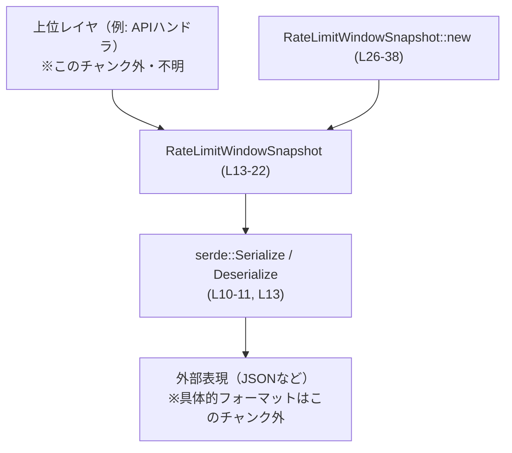
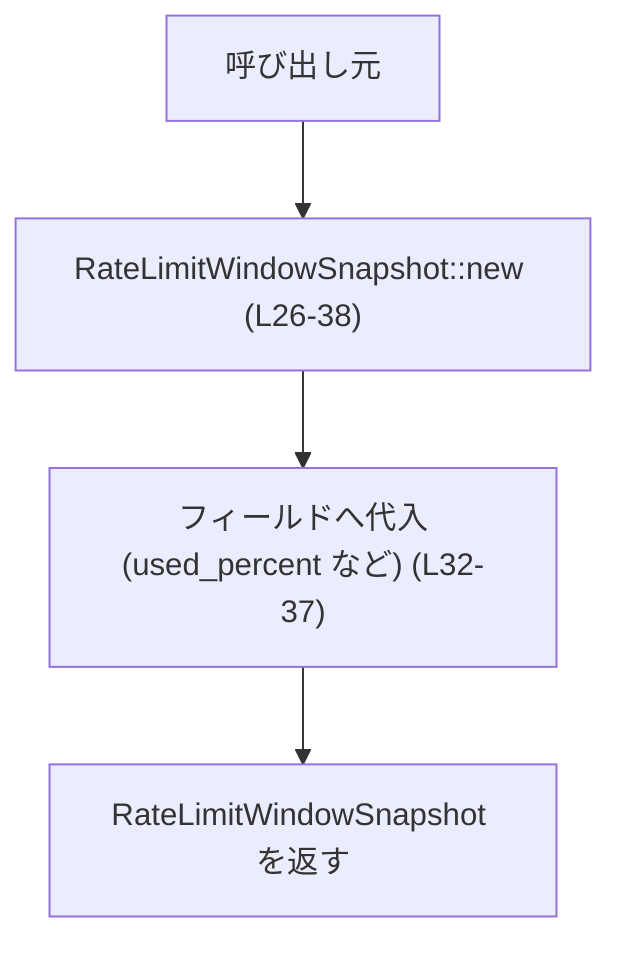
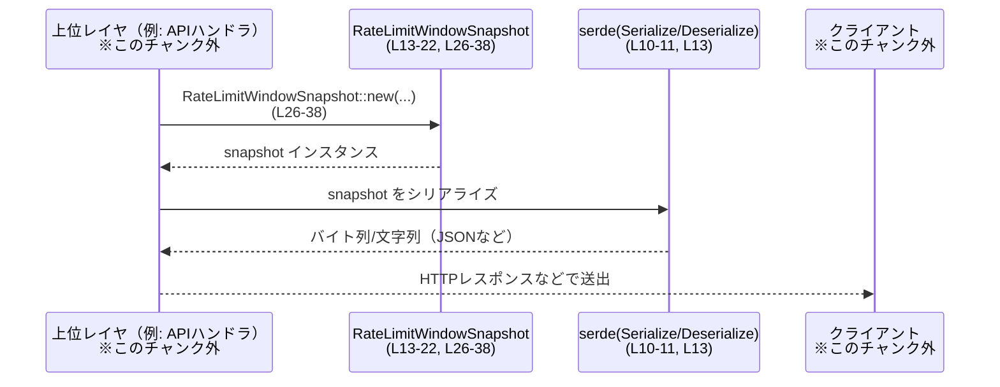

# codex-backend-openapi-models/src/models/rate_limit_window_snapshot.rs

## 0. ざっくり一言

レートリミット（一定時間あたりの利用制限）の「1ウィンドウ分の利用状況」を表現するためのシリアライズ可能なスナップショット構造体と、そのコンストラクタを定義するモジュールです。

---

## 1. このモジュールの役割

### 1.1 概要

- このモジュールは、レートリミットの状態（使用率やリセット時刻など）を外部とのやり取りに使える形で保持する **データ転送オブジェクト（DTO）** を提供します。
- Serde を用いたシリアライズ / デシリアライズを前提としており、OpenAPI で定義されたモデルに対応する Rust 型になっています（コメントより。`rate_limit_window_snapshot.rs:L1-8`）。
- ビジネスロジックや検証処理は含まず、純粋に値を保持するだけの構造になっています（`rate_limit_window_snapshot.rs:L13-22`）。

### 1.2 アーキテクチャ内での位置づけ

このモジュールが担うのは「レートリミット情報の表現」であり、他層（サービス・HTTP ハンドラなど）から利用される前提のモデルです。  
ファイル内の依存関係は serde のみです。



- 上位レイヤが `RateLimitWindowSnapshot::new` あるいは構造体リテラルで値を構築し（`rate_limit_window_snapshot.rs:L25-38`）、serde を介して外部表現（JSON 等）に変換される、という流れが想定されます。
- 実際にどこから呼ばれているかはこのファイルからは分かりません。

### 1.3 設計上のポイント

- **単純なデータ構造**  
  - フィールドはすべて `i32` で、所有権やライフタイムの複雑な管理は発生しません（`rate_limit_window_snapshot.rs:L16-22`）。
- **シリアライズ前提の設計**  
  - `Serialize` / `Deserialize` を derive し、フィールドごとに `#[serde(rename = "...")]` を付けて外部仕様のフィールド名に揃えています（`rate_limit_window_snapshot.rs:L13-22`）。
- **汎用的なユーティリティ**  
  - コンストラクタ `new` は引数をそのままフィールドに詰めるだけであり、バリデーション等は一切行いません（`rate_limit_window_snapshot.rs:L26-38`）。
- **派生トレイトによるユーティリティ性**  
  - `Clone`, `Default`, `Debug`, `PartialEq` を derive しており、コピー・デバッグ出力・比較・デフォルト生成が容易です（`rate_limit_window_snapshot.rs:L13`）。

---

## 2. 主要な機能一覧

- `RateLimitWindowSnapshot` 構造体: レートリミットウィンドウの状態（使用率、ウィンドウ秒数、リセットまでの秒数、リセット時刻）を保持する。
- Serde シリアライズ/デシリアライズ対応: OpenAPI 仕様に沿ったフィールド名で外部表現と相互変換する。
- `RateLimitWindowSnapshot::new`: 4 つの `i32` 値からスナップショットを生成するコンストラクタ。

---

## 3. 公開 API と詳細解説

### 3.1 型一覧（構造体・列挙体など）

**コンポーネントインベントリー**

| 名前 | 種別 | 公開範囲 | 定義位置 | 役割 / 用途 |
|------|------|----------|----------|-------------|
| `RateLimitWindowSnapshot` | 構造体 | `pub` | `rate_limit_window_snapshot.rs:L13-22` | レートリミットウィンドウの状態を表現する DTO。Serde 対応で外部とのデータ交換に用いる。 |

**`RateLimitWindowSnapshot` のフィールド**

| フィールド名 | 型 | serde 名 | 定義位置 | 説明（コードから読み取れる範囲） |
|-------------|----|----------|----------|----------------------------------|
| `used_percent` | `i32` | `"used_percent"` | `L15-16` | 使用率をパーセントで表す整数値と解釈されますが、範囲チェックはありません。 |
| `limit_window_seconds` | `i32` | `"limit_window_seconds"` | `L17-18` | 「制限ウィンドウ」の長さを秒で表す値と推測されますが、意味・制約はコードからは確定できません。 |
| `reset_after_seconds` | `i32` | `"reset_after_seconds"` | `L19-20` | 次のリセットまでの残り秒数と推測されますが、詳細はコードからは分かりません。 |
| `reset_at` | `i32` | `"reset_at"` | `L21-22` | リセット時刻を表す整数（UNIX 時刻等）と推測されますが、単位や基準は不明です。 |

> フィールド名から意味を推測できますが、コメントやドキュメントは本ファイルに存在しないため、仕様としては確定できません。

**派生トレイト**

- `Clone`, `Default`, `Debug`, `PartialEq`, `Serialize`, `Deserialize` を `derive` しています（`rate_limit_window_snapshot.rs:L13`）。
  - これにより、以下が可能です:
    - データの複製（`clone`）
    - デフォルト値（すべて `0`）での生成（`Default::default`）
    - `{:?}` によるデバッグ表示
    - 等値比較（`==` / `!=`）
    - Serde を用いたシリアライズ/デシリアライズ

### 3.2 関数詳細

#### `RateLimitWindowSnapshot::new(used_percent: i32, limit_window_seconds: i32, reset_after_seconds: i32, reset_at: i32) -> RateLimitWindowSnapshot`

**定義位置**

- `rate_limit_window_snapshot.rs:L25-38`

**概要**

- レートリミットウィンドウの状態を構成する 4 つの `i32` 値から、新しい `RateLimitWindowSnapshot` インスタンスを生成する単純なコンストラクタです。
- 受け取った値をそのまま各フィールドに格納し、バリデーションや変換は行いません。

**引数**

| 引数名 | 型 | 説明 |
|--------|----|------|
| `used_percent` | `i32` | 使用率を表す整数値。範囲制約（0〜100 など）はこの関数ではチェックされません。 |
| `limit_window_seconds` | `i32` | レートリミットウィンドウの長さ（秒）と推測される値。負値許可などの仕様は不明です。 |
| `reset_after_seconds` | `i32` | 現在からリセットまでの残り秒数と推測される値。値の妥当性は呼び出し側に依存します。 |
| `reset_at` | `i32` | リセットが発生する時刻を表す整数値。UNIX 時刻等かどうかはコードからは分かりません。 |

**戻り値**

- 型: `RateLimitWindowSnapshot`
- 4 つの引数がそれぞれ対応するフィールドにセットされた新しいインスタンスを返します（`rate_limit_window_snapshot.rs:L32-37`）。

**内部処理の流れ**

`rate_limit_window_snapshot.rs:L26-37` のコードから、以下のような処理になっています。

1. 引数として 4 つの `i32` を受け取る（`L26-30`）。
2. `RateLimitWindowSnapshot { ... }` 構文でフィールド初期化を行う（`L32-37`）。
3. 生成したインスタンスをそのまま返す（`L31-38`）。

条件分岐やループ、バリデーションは一切ありません。

**Flowchart (処理フロー)**



**Examples（使用例）**

簡単な使用例として、スナップショットを作成し、JSON にシリアライズするパターンを示します。  
（シリアライズには、このファイル外の `serde_json` クレートを使用しています。）

```rust
use codex_backend_openapi_models::models::RateLimitWindowSnapshot; // 仮のパス。実際のモジュールパスはこのチャンク外で決まります。
use serde_json;                                                   // JSONシリアライズ用（このファイルには出てきません）

fn main() -> Result<(), Box<dyn std::error::Error>> {
    // レートリミットのスナップショットを作成する
    let snapshot = RateLimitWindowSnapshot::new(
        50,   // used_percent: 50%
        60,   // limit_window_seconds: 60秒ウィンドウと想定
        30,   // reset_after_seconds: リセットまで残り30秒と想定
        1_700_000_000, // reset_at: 例としてUNIX時刻風の値
    );

    // JSONにシリアライズ（フィールド名は serde(rename) に従う）
    let json = serde_json::to_string(&snapshot)?;
    println!("{}", json); // {"used_percent":50,"limit_window_seconds":60,"reset_after_seconds":30,"reset_at":1700000000}

    Ok(())
}
```

**Errors / Panics**

- この関数自体はエラーもパニックも発生させません。
  - 内部で `unwrap` や I/O、数値演算などを行っていないためです（`rate_limit_window_snapshot.rs:L26-37`）。
- ただし、この構造体に格納された値の「妥当性」が保証されないことに注意が必要です。
  - 例えば、`used_percent = 200` や負の `limit_window_seconds` もこの関数はそのまま受け入れます。

**Edge cases（エッジケース）**

- **極端な値**
  - `i32::MIN` や `i32::MAX` といった極端な整数値も受け取りますが、関数はそのままフィールドに設定します。
- **負の値**
  - `reset_after_seconds` や `limit_window_seconds` に負値を渡してもエラーにはなりません。
- **意味的な矛盾**
  - `reset_after_seconds = 0` と `reset_at` が将来の時刻を表す、など意味的に矛盾する組み合わせでも、本関数は検証しません。

これらのエッジケースの扱いは、上位レイヤの仕様およびバリデーションロジックに委ねられています。

**使用上の注意点**

- **バリデーションは呼び出し側で行う前提**
  - 値の範囲（例: `used_percent` の 0〜100 制約）や一貫性（`reset_after_seconds` と `reset_at` の関係）は、この関数では一切チェックされません。
- **型はすべて `i32`**
  - 秒数や時刻を 64bit で扱う必要がある場合（非常に先の時刻など）は、この構造体では表現できない可能性があります。
- **フィールド名と serde(rename)**
  - serde の `rename` により外部表現のフィールド名が固定されているため、外部とのインターフェースに影響する変更（フィールド名変更など）は慎重に行う必要があります。

### 3.3 その他の関数

- このファイルには `new` 以外の関数・メソッドは定義されていません（`rate_limit_window_snapshot.rs:L25-38`）。

---

## 4. データフロー

ここでは、典型的な「レートリミットスナップショットを生成し、外部に返す」流れを示します。  
実際の HTTP レイヤなどはこのチャンクには現れませんが、概念的なデータフローとして整理します。



**要点**

- 本ファイルが担うのは、`RateLimitWindowSnapshot` インスタンスの型・構造を定義する部分のみです（`rate_limit_window_snapshot.rs:L13-22`）。
- シリアライズ/デシリアライズの実処理は serde とその上に乗る具体的フォーマッタ（`serde_json` など）が担当します（このファイルには具体的フォーマットは登場しません）。
- 上位レイヤでの利用方法（レスポンスボディとして返すなど）は、このチャンクからは読み取れません。

---

## 5. 使い方（How to Use）

### 5.1 基本的な使用方法

`RateLimitWindowSnapshot` を生成して、serde を用いて外部フォーマットと変換する基本的な流れです。

```rust
use serde_json; // JSONエンコード用（このファイル外のクレート）
use codex_backend_openapi_models::models::RateLimitWindowSnapshot; // 仮のモジュールパス

fn main() -> Result<(), Box<dyn std::error::Error>> {
    // レートリミットの状態を表すスナップショットを作成
    let snapshot = RateLimitWindowSnapshot::new(
        80,  // used_percent
        60,  // limit_window_seconds
        5,   // reset_after_seconds
        1_700_000_123, // reset_at
    );

    // JSON へのシリアライズ
    let body = serde_json::to_string(&snapshot)?;
    println!("response body: {}", body);

    // JSON からのデシリアライズ
    let decoded: RateLimitWindowSnapshot = serde_json::from_str(&body)?;
    assert_eq!(snapshot, decoded); // PartialEq 派生により比較可能

    Ok(())
}
```

この例では、構造体のフィールド名と serde の `rename` が一致しているため、そのまま JSON のキーとして使用されます（`rate_limit_window_snapshot.rs:L15-22`）。

### 5.2 よくある使用パターン

1. **構造体リテラルでの初期化**

   `new` を使わず、構造体リテラルで直接初期化することもできます。

   ```rust
   let snapshot = RateLimitWindowSnapshot {
       used_percent: 10,
       limit_window_seconds: 60,
       reset_after_seconds: 55,
       reset_at: 1_700_000_000,
   };
   ```

   - `new` と機能は同じで、任意のスタイルで書けます。

2. **デフォルト値からの上書き（`Default` 利用）**

   デフォルト（全フィールド 0）から、一部だけ上書きするパターンです。

   ```rust
   let mut snapshot = RateLimitWindowSnapshot::default(); // 全フィールド 0
   snapshot.used_percent = 0;
   snapshot.limit_window_seconds = 60;
   snapshot.reset_after_seconds = 60;
   snapshot.reset_at = 1_700_000_000;
   ```

   - `Default` の意味（0 が何を意味するか）は、このファイルからは分かりませんが、「初期状態として一度に埋めていく」用途には便利です。

3. **比較やログ出力に活用**

   `Debug` と `PartialEq` により、ログ出力やテストでの比較に利用できます。

   ```rust
   let before = RateLimitWindowSnapshot::new(10, 60, 50, 1_700_000_000);
   let after  = RateLimitWindowSnapshot::new(20, 60, 40, 1_700_000_010);

   println!("before = {:?}", before); // Debug出力
   println!("after  = {:?}", after);

   assert!(before != after); // PartialEq で差分検査
   ```

### 5.3 よくある間違い

このファイルから推測できる「起こりやすそうな誤用」を挙げます。

```rust
// 間違い例: serde(rename) と異なる JSON キーを使ってしまう
let json = r#"{
    "usedPercent": 50,                // キャメルケース
    "limit_window_seconds": 60,
    "reset_after_seconds": 30,
    "reset_at": 1700000000
}"#;

let snapshot: RateLimitWindowSnapshot = serde_json::from_str(json)?;
// ↑ この JSON は "used_percent" ではなく "usedPercent" なので、
// デシリアライズ時にエラーになる
```

```rust
// 正しい例: rename で指定されたキーを使う
let json = r#"{
    "used_percent": 50,
    "limit_window_seconds": 60,
    "reset_after_seconds": 30,
    "reset_at": 1700000000
}"#;

let snapshot: RateLimitWindowSnapshot = serde_json::from_str(json)?; // OK
```

- `#[serde(rename = "...")]` の指定により、外部表現のキー名は厳密に固定されています（`rate_limit_window_snapshot.rs:L15-22`）。
- このキー名と異なる JSON を受け取ると、デシリアライズ時にエラーとなる可能性があります。

### 5.4 使用上の注意点（まとめ）

- **値の妥当性**  
  - この構造体および `new` 関数は値の妥当性を一切チェックしません（`rate_limit_window_snapshot.rs:L26-37`）。
  - レートリミット制御の正しさに関わるため、値の検証は上位レイヤで行う必要があります。
- **単位・意味の明示**  
  - 秒数や時刻の単位・解釈（UNIX 時刻か、相対秒か）はファイルからは分かりません。  
    利用側で仕様を整理しておく必要があります。
- **スレッド安全性**  
  - フィールドがすべて `i32` であり内部可変性（`Cell`/`RefCell` 等）がないため、構造体自体はスレッド間共有しても特別な同期原語を必要としない設計です。  
    ただし、変更を伴う場合は通常の Rust の所有権/借用ルールに従う必要があります。
- **セキュリティ**  
  - この構造体は単なるデータの容器であり、認可判定やレートリミットの強制は行いません（`rate_limit_window_snapshot.rs:L13-22`）。  
    セキュリティ上の制御は、本構造体を利用するロジック側で実装される前提です。

---

## 6. 変更の仕方（How to Modify）

### 6.1 新しい機能を追加する場合

例えば、レートリミットに関する追加情報（ユーザーID、バケット名など）を持たせたい場合の手順です。

1. **フィールドの追加**
   - `RateLimitWindowSnapshot` に新しいフィールドを追加します（`rate_limit_window_snapshot.rs:L13-22` に追記）。
   - OpenAPI 仕様上のフィールド名に合わせて `#[serde(rename = "new_field_name")]` を付けると、既存の JSON 形式との整合性が取りやすくなります。
2. **コンストラクタの更新**
   - `RateLimitWindowSnapshot::new` に新フィールド用の引数を追加し、構造体初期化式にもそのフィールドを追加します（`rate_limit_window_snapshot.rs:L26-37`）。
3. **影響範囲の確認**
   - `RateLimitWindowSnapshot::new` を呼び出しているコード（このチャンク外）で、引数追加に伴うコンパイルエラーが発生するため、すべて修正する必要があります。
   - serde 経由のシリアライズ/デシリアライズに新フィールドを含める場合、外部システムとの互換性も確認します。

### 6.2 既存の機能を変更する場合

1. **フィールド名や型を変更する際の注意**
   - フィールド名の変更は、`#[serde(rename = "...")]` にも影響します（`rate_limit_window_snapshot.rs:L15-22`）。
   - 外部の JSON 形式が変わるため、互換性の維持方針（旧フィールド名との併用など）を決める必要があります。
2. **契約（前提条件・返り値の意味）の維持**
   - `new` は「引数をそのままフィールドに格納する」という非常に単純な契約です（`rate_limit_window_snapshot.rs:L32-37`）。
   - ここにバリデーションや変換ロジックを追加すると、呼び出し側の期待が変わる可能性があるため、慎重に検討する必要があります。
3. **テストや使用箇所の再確認**
   - このファイルにはテストコードは含まれていません（`rate_limit_window_snapshot.rs` 全体）。
   - 変更後は、`RateLimitWindowSnapshot` を利用している箇所（このチャンク外）での挙動を確認するテストを用意することが望ましいです。

---

## 7. 関連ファイル

このモジュールから直接参照されているのは serde のみです。また、ファイル冒頭のコメントから OpenAPI Generator による自動生成であることが読み取れます。

| パス / クレート | 役割 / 関係 |
|-----------------|------------|
| `serde` クレート (`serde::Serialize`, `serde::Deserialize`) | 構造体を外部フォーマットにシリアライズ/デシリアライズするためのトレイト。`derive` により本構造体に適用されています（`rate_limit_window_snapshot.rs:L10-11, L13`）。 |
| OpenAPI ドキュメント 0.0.1 | 本ファイル冒頭コメントにより、この構造体が OpenAPI 仕様から自動生成されていることが示唆されます（`rate_limit_window_snapshot.rs:L1-8`）。具体的ファイルパスはこのチャンクには現れません。 |

このファイルからは、同一クレート内の他モジュール（`mod.rs` など）への直接の参照は見えません。そのため、どのモジュールから利用されているかはこのチャンクだけでは不明です。
