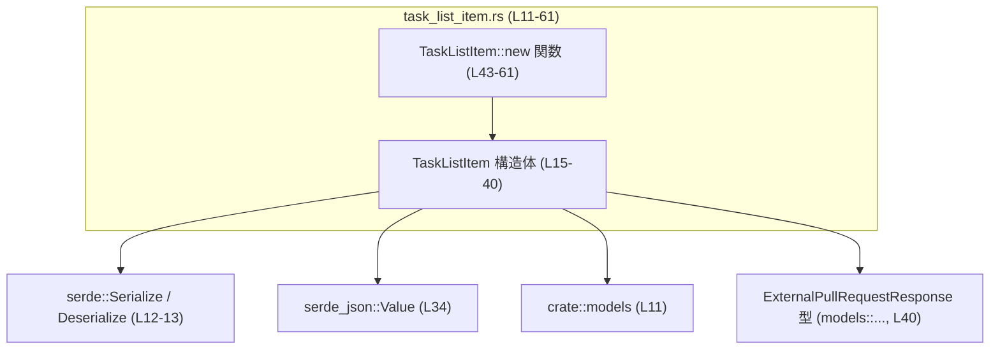
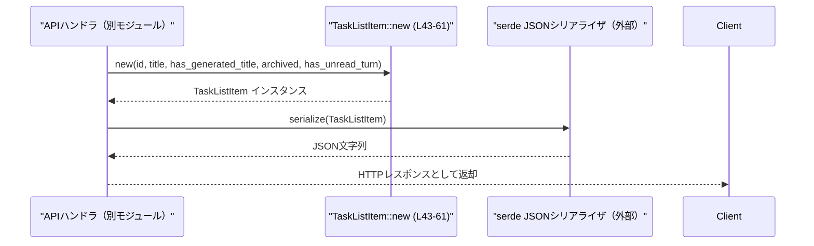

# codex-backend-openapi-models\src\models\task_list_item.rs

## 0. ざっくり一言

タスク一覧用の 1 件分の情報を表す `TaskListItem` 構造体と、その簡易コンストラクタ `TaskListItem::new` を定義するモジュールです（`task_list_item.rs:L15-40, L43-61`）。  
`serde` により JSON とのシリアライズ／デシリアライズが可能になっています（`task_list_item.rs:L15`）。

---

## 1. このモジュールの役割

### 1.1 概要

- このモジュールは **タスク一覧画面などで表示されるタスクの概要情報** を表現するためのデータモデルを提供します。
- OpenAPI Generator によって生成されたモデルであり（`task_list_item.rs:L1-8`）、HTTP API の入出力で使われる JSON と 1 対 1 に対応する形で設計されています。
- `serde` の属性により、フィールド名や省略ルール（`None` のときにシリアライズしない）などが制御されています（`task_list_item.rs:L17-40`）。

### 1.2 アーキテクチャ内での位置づけ

このファイルから読み取れる依存関係は次のとおりです。

- 依存する外部クレート／モジュール
  - `serde::{Serialize, Deserialize}`（シリアライズ／デシリアライズのため、`task_list_item.rs:L12-13`）
  - `serde_json::Value`（任意の JSON 値の表現、`task_list_item.rs:L34`）
- 依存する内部モジュール
  - `crate::models`（他モデルとの関連付け、`task_list_item.rs:L11, L40`）
    - 具体的には `models::ExternalPullRequestResponse` を使用（`task_list_item.rs:L40`）

この関係を簡易的な依存グラフで表すと次のようになります。



※ `ExternalPullRequestResponse` 自体の定義場所はこのチャンクには現れません。

### 1.3 設計上のポイント

コードから読み取れる設計上の特徴は以下のとおりです。

- **純粋なデータコンテナ**
  - `TaskListItem` はフィールドのみを持つ構造体で、ビジネスロジックは持たず、データ運搬（DTO 的役割）に特化しています（`task_list_item.rs:L15-40`）。
- **部分的な情報でも扱える設計**
  - 必須フィールド: `id`, `title`, `archived`, `has_unread_turn`（`task_list_item.rs:L17-20, L35-38`）
  - 任意フィールド（`Option<T>`）: `has_generated_title`, `updated_at`, `created_at`, `task_status_display`, `pull_requests`（`task_list_item.rs:L21-25, L26-29, L30-34, L39-40`）
- **シリアライズ時の省略ルール**
  - `Option` 型フィールドには `skip_serializing_if = "Option::is_none"` が付与されており、`None` の場合は JSON に出力されません（`task_list_item.rs:L21-24, L26, L28, L30-33, L39`）。
- **コンストラクタの方針**
  - `TaskListItem::new` は最小限の必須＋一部任意情報のみを引数に取り、それ以外の任意情報は `None` に初期化します（`task_list_item.rs:L43-61`）。
- **状態や並行性に関する特殊な仕組みはなし**
  - 内部にスレッド同期原語や参照カウントなどは含まず、所有権・借用は通常の構造体フィールドと同等です。

---

## 2. 主要な機能一覧（コンポーネントインベントリー）

### 2.1 コンポーネント一覧（構造体・関数）

| 名前 | 種別 | 概要 | 定義位置（根拠） |
|------|------|------|------------------|
| `TaskListItem` | 構造体 | タスク 1 件分の情報（タイトル、状態、PR など）を保持するデータモデル | `task_list_item.rs:L15-40` |
| `TaskListItem::new` | 関数（関連関数） | 必須フィールドと一部オプションを受け取り、その他を `None` で初期化した `TaskListItem` を生成するコンストラクタ的関数 | `task_list_item.rs:L43-61` |

### 2.2 機能一覧（役割ベース）

- タスク識別子とタイトルの保持
- タイトルが自動生成かどうかのフラグ保持
- 更新時刻／作成時刻（数値型のタイムスタンプらしき値）の保持
- タスクの状態表示用の汎用 JSON データ保持
- アーカイブ状態の保持
- 未読のやり取りがあるかどうかのフラグ保持
- 外部プルリクエスト情報リストの保持
- 上記をまとめて初期化する `new` 関数の提供

---

## 3. 公開 API と詳細解説

### 3.1 型一覧（構造体・列挙体など）

| 名前 | 種別 | 役割 / 用途 | 主なフィールド | 定義位置 |
|------|------|-------------|----------------|----------|
| `TaskListItem` | 構造体 | タスク一覧画面等で使用されるタスク項目の情報を表すモデル。`serde` を用いて JSON と相互変換される。 | `id`, `title`, `has_generated_title`, `updated_at`, `created_at`, `task_status_display`, `archived`, `has_unread_turn`, `pull_requests` | `task_list_item.rs:L15-40` |

補足（フィールドごとの概要・根拠はすべて `task_list_item.rs:L17-40`）:

- `id: String`  
  タスクを一意に識別する ID。JSON フィールド名は `"id"`。
- `title: String`  
  タスクのタイトル。JSON フィールド名は `"title"`。
- `has_generated_title: Option<bool>`  
  タイトルが自動生成されたかどうかを示すフラグ。`None` の場合、シリアライズ時はフィールドごと省略。JSON フィールド名 `"has_generated_title"`。
- `updated_at: Option<f64>` / `created_at: Option<f64>`  
  更新時刻／作成時刻を表す数値。詳細な単位や意味はこのファイルからは分かりません。`None` の場合は JSON から省略。フィールド名 `"updated_at"`, `"created_at"`。
- `task_status_display: Option<HashMap<String, serde_json::Value>>`  
  状態表示用と思われる任意の JSON データ。キーが文字列、値は任意の JSON 値。`None` の場合は省略。フィールド名 `"task_status_display"`。
- `archived: bool`  
  タスクがアーカイブされているかのフラグ。必須フィールド。フィールド名 `"archived"`。
- `has_unread_turn: bool`  
  未読の「ターン」（やりとり）があるかのフラグ。必須フィールド。フィールド名 `"has_unread_turn"`。
- `pull_requests: Option<Vec<models::ExternalPullRequestResponse>>`  
  関連する外部プルリクエスト情報のリスト。`None` または空のままの扱いはこのファイルからは分かりませんが、`None` の場合はシリアライズ時に省略されます。フィールド名 `"pull_requests"`。

### 3.2 関数詳細

#### `TaskListItem::new(id: String, title: String, has_generated_title: Option<bool>, archived: bool, has_unread_turn: bool) -> TaskListItem`

**概要**

- 必須情報（ID、タイトル、アーカイブ状態、未読状態）と、タイトル自動生成フラグを受け取り、その他の任意フィールドをすべて `None` に設定した `TaskListItem` を生成します（`task_list_item.rs:L43-61`）。
- 典型的には「一覧表示用の最小限の情報を持つタスク項目」を作る用途に向いています。

**引数**

| 引数名 | 型 | 説明 | 根拠 |
|--------|----|------|------|
| `id` | `String` | タスク識別子。構造体フィールド `id` にそのまま設定されます。 | `task_list_item.rs:L45, L52` |
| `title` | `String` | タスクタイトル。構造体フィールド `title` にそのまま設定されます。 | `task_list_item.rs:L46, L53` |
| `has_generated_title` | `Option<bool>` | タイトルが自動生成されたかどうか。`Some(true/false)` または `None`。 | `task_list_item.rs:L47, L54` |
| `archived` | `bool` | タスクがアーカイブ済みかどうか。 | `task_list_item.rs:L48, L58` |
| `has_unread_turn` | `bool` | 未読のやり取りが存在するかどうか。 | `task_list_item.rs:L49, L59` |

**戻り値**

- 型: `TaskListItem`（`task_list_item.rs:L50`）
- 内容:
  - 引数で渡した値が対応するフィールドに設定されます（`id`, `title`, `has_generated_title`, `archived`, `has_unread_turn`）。
  - `updated_at`, `created_at`, `task_status_display`, `pull_requests` はすべて `None` で初期化されます（`task_list_item.rs:L55-57, L60`）。

**内部処理の流れ（アルゴリズム）**

`task_list_item.rs:L51-61` に対応します。

1. 構造体リテラル `TaskListItem { ... }` を生成する。
2. `id`, `title`, `has_generated_title`, `archived`, `has_unread_turn` は、それぞれ引数からそのまま代入する（`task_list_item.rs:L52-54, L58-59`）。
3. `updated_at`, `created_at`, `task_status_display`, `pull_requests` はすべて `None` に固定で設定する（`task_list_item.rs:L55-57, L60`）。
4. 生成した `TaskListItem` を呼び出し元に返す。

条件分岐やループはなく、構造体リテラルを 1 回生成するだけの単純な処理です。

**Examples（使用例）**

1. 最小限のタスク項目を生成し、JSON としてシリアライズする例:

```rust
use codex_backend_openapi_models::models::TaskListItem;  // TaskListItem のインポート
use serde_json;                                          // JSON 変換用

fn main() -> Result<(), Box<dyn std::error::Error>> {
    // 必須情報＋has_generated_title を指定して TaskListItem を生成
    let item = TaskListItem::new(
        "task-123".to_string(),      // id
        "Implement feature X".to_string(), // title
        Some(false),                 // has_generated_title
        false,                       // archived
        true,                        // has_unread_turn
    );

    // JSON にシリアライズ（updated_at など None のフィールドは出力されない）
    let json = serde_json::to_string_pretty(&item)?;
    println!("{}", json);

    Ok(())
}
```

1. 生成後に任意フィールドを手動で埋める例:

```rust
use codex_backend_openapi_models::models::TaskListItem;
use std::collections::HashMap;
use serde_json::json;

fn main() {
    let mut item = TaskListItem::new(
        "task-123".into(),
        "Implement feature X".into(),
        Some(true),
        false,
        false,
    );

    // 作成・更新時刻を設定（値の意味や単位はこのファイルからは不明）
    item.created_at = Some(1_700_000_000.0);  // 例として f64 値を設定
    item.updated_at = Some(1_700_000_100.0);

    // 状態表示用データを設定
    let mut status = HashMap::new();
    status.insert("label".to_string(), json!("In Progress"));
    status.insert("color".to_string(), json!("#00ff00"));
    item.task_status_display = Some(status);

    // pull_requests フィールドも必要なら別途設定する（型定義はこのチャンクには現れません）
}
```

**Errors / Panics**

- この関数自体は `Result` を返さず、関数本体に `unwrap` や `panic!` などは含まれていません（`task_list_item.rs:L51-61`）。
- 通常の環境では、この関数を呼び出しただけで panic するケースは想定されません。
- メモリ不足など、Rust プログラム全体に影響するエラーは別問題として発生しうるものの、このファイルからは特別なエラーハンドリングは読み取れません。

**Edge cases（エッジケース）**

- `id` や `title` が空文字列の場合  
  → そのままフィールドに格納されます。バリデーションは行われません（`task_list_item.rs:L52-53`）。
- `has_generated_title` に `None` を渡した場合  
  → フィールドは `None` となり、シリアライズ時には `"has_generated_title"` フィールド自体が JSON から省略されます（`task_list_item.rs:L54` と構造体定義の属性 `L21-25`）。
- `archived` / `has_unread_turn` による特別な処理  
  → この関数内では単に値を格納するだけで、それ以外のロジックはありません（`task_list_item.rs:L58-59`）。

**使用上の注意点**

- `updated_at` / `created_at` / `task_status_display` / `pull_requests` はすべて `None` に初期化されるため、これらを利用した処理が必要な場合は、呼び出し側で明示的にセットする必要があります（`task_list_item.rs:L55-57, L60`）。
- この関数はあくまで構造体フィールドへの代入を行うだけであり、入力値の検証や整形は行いません。API レベルでのバリデーションが必要な場合は、上位レイヤで行う必要があります。
- ファイル先頭に「Generated by: <https://openapi-generator.tech」とある通り（`task_list_item.rs:L1-8`）、このコンストラクタを変更すると、OpenAPI> Generator による再生成時に上書きされる可能性があります。

### 3.3 その他の関数

- このチャンクには、`TaskListItem::new` 以外のメソッドや補助関数は定義されていません（`task_list_item.rs:L43-63` 参照）。

---

## 4. データフロー

ここでは、`TaskListItem` を生成して JSON レスポンスとして返す、典型的な使用シナリオを例として示します。  
実際のハンドラやシリアライズ呼び出しコードはこのファイルには含まれていませんが、`serde` の派生属性（`task_list_item.rs:L12-13, L15`）から、そのような利用が想定されます。

### 4.1 シーケンス図（概念的なデータフロー）



要点:

- `TaskListItem::new` は、ハンドラなど上位のコードから呼ばれ、必要なフィールドを埋めた構造体を返します（`task_list_item.rs:L43-61`）。
- 構造体には `Serialize` が derive されているため（`task_list_item.rs:L15`）、`serde_json::to_string` などを用いて JSON に変換できます。
- `Option` フィールドで `None` のものは、シリアライズ時に JSON から省略されます（`skip_serializing_if` 属性、`task_list_item.rs:L21-24, L26, L28, L30-33, L39`）。

---

## 5. 使い方（How to Use）

### 5.1 基本的な使用方法

1. 必要なフィールドを指定して `TaskListItem::new` でインスタンスを生成する。
2. 必要に応じて任意フィールドを上書きする。
3. API の入出力で使う場合は、`serde_json` 等でシリアライズ／デシリアライズする。

```rust
use codex_backend_openapi_models::models::TaskListItem; // モデルのインポート
use serde_json;                                         // JSON 変換用クレート

fn main() -> Result<(), Box<dyn std::error::Error>> {
    // 1. 必須フィールドと has_generated_title を指定して生成
    let mut item = TaskListItem::new(
        "task-001".to_string(),
        "Fix login bug".to_string(),
        Some(false),
        false,   // archived
        true,    // has_unread_turn
    );

    // 2. 必要に応じてオプションフィールドを設定
    item.created_at = Some(1_700_000_000.0);
    item.updated_at = Some(1_700_000_100.0);

    // 3. JSON 文字列としてシリアライズ（None のフィールドは出力されない）
    let json = serde_json::to_string(&item)?;
    println!("{}", json);

    Ok(())
}
```

### 5.2 よくある使用パターン

1. **コンストラクタで最小限を埋めて、残りは後で設定**

   - `new` で必須フィールドだけ埋める。
   - 追加情報は条件に応じて後から付与。

   ```rust
   let mut item = TaskListItem::new(
       id,
       title,
       None,   // has_generated_title 不明なので None
       false,  // archived
       false,  // has_unread_turn
   );

   if let Some(status_display) = build_status_display() {
       item.task_status_display = Some(status_display);
   }
   ```

2. **構造体リテラルで直接全フィールドを設定**

   - フィールドはすべて `pub` なので、`new` を使わず構造体リテラルで初期化することも可能です（`task_list_item.rs:L16-40`）。

   ```rust
   use codex_backend_openapi_models::models::TaskListItem;

   let item = TaskListItem {
       id: "task-001".into(),
       title: "Fix login bug".into(),
       has_generated_title: Some(false),
       updated_at: Some(1_700_000_100.0),
       created_at: Some(1_700_000_000.0),
       task_status_display: None,
       archived: false,
       has_unread_turn: true,
       pull_requests: None, // 必須フィールドなので明示的に書く必要がある
   };
   ```

### 5.3 よくある間違い

```rust
use codex_backend_openapi_models::models::TaskListItem;

// 間違い例: has_generated_title を bool で直接渡そうとしてコンパイルエラーになる
// let item = TaskListItem::new(
//     "task-001".into(),
//     "Title".into(),
//     false,   // 型が bool で、new は Option<bool> を要求している（task_list_item.rs:L47）
//     false,
//     false,
// );

// 正しい例: Option<bool> を渡す
let item = TaskListItem::new(
    "task-001".into(),
    "Title".into(),
    Some(false), // Option<bool> で渡す
    false,
    false,
);
```

```rust
use codex_backend_openapi_models::models::TaskListItem;

// 間違い例: new で created_at が自動的に埋まると期待する
let mut item = TaskListItem::new(
    "task-001".into(),
    "Title".into(),
    None,
    false,
    false,
);
// ここで item.created_at が Some(...) になっていると期待するのは誤り
// 実際には new 内で created_at は None に固定されている（task_list_item.rs:L56）
assert!(item.created_at.is_none()); // 実際の挙動

// 正しい扱い: 必要なら自前で設定する
item.created_at = Some(1_700_000_000.0);
```

### 5.4 使用上の注意点（まとめ）

- **必須フィールドのシリアライズ要件**
  - `id`, `title`, `archived`, `has_unread_turn` は `Option` ではなく、`serde` の `default` も指定されていないため、デシリアライズ時には JSON にこれらのフィールドが存在しないとエラーになります（`task_list_item.rs:L17-20, L35-38`）。
- **`Option` フィールドの省略**
  - `has_generated_title`, `updated_at`, `created_at`, `task_status_display`, `pull_requests` は `None` の場合、シリアライズ時にそのフィールド自体が JSON から省略されます（`skip_serializing_if`, `task_list_item.rs:L21-24, L26, L28, L30-33, L39`）。  
    クライアント側で「フィールドが存在しない」ことと「`null` として存在すること」が区別される点に注意が必要です。
- **時刻の型が `f64` である点**
  - `updated_at` / `created_at` が `f64` で定義されています（`task_list_item.rs:L26-29`）。  
    実際に何を表す値かはこのチャンクからは分かりませんが、時刻・数値を扱う際には丸めや精度の影響を考慮する必要があります。
- **並行性（スレッド安全性）**
  - 構造体自体には特別な同期機構は含まれておらず（`task_list_item.rs:L15-40`）、`Send` / `Sync` の可否はフィールド型（とくに `serde_json::Value` や `ExternalPullRequestResponse`）の実装に依存します。  
    マルチスレッド環境で共有する場合は、これらの型がスレッド安全かどうかを確認する必要があります。
- **テストコード**
  - このファイル内にはテストモジュールやテスト関数は定義されていません（`task_list_item.rs` 全体）。

---

## 6. 変更の仕方（How to Modify）

### 6.1 新しい機能を追加する場合

`TaskListItem` に新しい情報を持たせたい場合の一般的な手順例です。

1. **フィールドの追加**
   - `TaskListItem` 構造体に新しいフィールドを追加します（`task_list_item.rs:L16-40`）。  
     例: `pub priority: Option<String>,` のような形。
   - JSON フィールド名や `skip_serializing_if` など、必要な `serde` 属性を付与します。
2. **コンストラクタの更新**
   - 新しいフィールドが必須かどうかに応じて、`TaskListItem::new` の引数と本体を変更します（`task_list_item.rs:L43-61`）。
     - 必須にしたい場合: 引数として受け取り、そのままフィールドに格納。
     - 任意にしたい場合: `Option<T>` で引数に追加するか、`new` では常に `None` にする（後から設定させる）などの方針を決める。
3. **影響範囲の確認**
   - `TaskListItem` を利用している箇所でコンパイルエラーが発生しないか確認します。
   - シリアライズ結果の JSON スキーマが変わるため、フロントエンドや外部クライアントとの互換性も確認する必要があります。

**重要な注意点**

- ファイル先頭に「Generated by: <https://openapi-generator.tech」と記載があるため（`task_list_item.rs:L1-8`）、>  
  実運用上は **OpenAPI 定義ファイルの方を編集し、再生成するのが一般的** です。  
  このファイルを直接編集すると、コード再生成時に変更が失われる可能性があります。

### 6.2 既存の機能を変更する場合

- **フィールド名や型の変更**
  - `#[serde(rename = "...")]` の値を変更すると、JSON のフィールド名が変わります（`task_list_item.rs:L17, L19, L21-24, L26, L28, L30-33, L35, L37, L39`）。  
    API 互換性に影響するため、クライアントとの合意が必要です。
  - 型を変更すると、デシリアライズの互換性が失われる可能性があります。
- **`new` 関数のシグネチャ変更**
  - 引数を追加／削除すると、それを呼び出しているすべてのコードが修正対象になります（`task_list_item.rs:L43-50`）。
  - 新しい必須フィールドを構造体に追加した場合、`new` 内でダミー値を入れるのか、引数で受けるのかなど、API 設計上の判断が必要です。
- **テスト・利用箇所の確認**
  - このファイル内にはテストはありませんが、プロジェクト全体として `TaskListItem` を利用しているテストがあれば、それらが通るかを確認する必要があります。
- **契約（Contracts）の明示的／暗黙的前提**
  - `id` や `title` が空でないこと、`updated_at` ≥ `created_at` であること等のドメイン上の制約があるかどうかは、このファイルからは分かりません。  
    そのような制約を導入・変更する場合は、バリデーションをどのレイヤで行うか（モデル層かハンドラ層か）を整理する必要があります。

---

## 7. 関連ファイル

このモジュールと密接に関係しそうなファイル・型を一覧にします。

| パス / 型名 | 役割 / 関係 | 備考 |
|------------|------------|------|
| `crate::models` | `TaskListItem` を含むモデル群をまとめるモジュール。`use crate::models;` としてインポートされています。 | `task_list_item.rs:L11`。具体的なファイル構成はこのチャンクには現れません。 |
| `models::ExternalPullRequestResponse` | `TaskListItem.pull_requests` の要素型。外部プルリクエストの情報を表すと推測されます。 | `task_list_item.rs:L40` に参照がありますが、定義はこのチャンクには現れません。 |
| `serde` クレート | `TaskListItem` の `Serialize` / `Deserialize` 実装を derive するために使用されます。 | `task_list_item.rs:L12-13, L15`。 |
| `serde_json` クレート | `task_status_display` フィールドの値型として `serde_json::Value` を使用しています。 | `task_list_item.rs:L34`。 |
| OpenAPI 定義ファイル | この Rust コードを生成した元の API スキーマ。コメントから OpenAPI Generator による自動生成と分かります。 | 実際のパスやファイル名はこのチャンクには現れませんが、変更は原則そちらで行うのが安全です。 |

このように、`TaskListItem` はプロジェクト内の「API モデル」層に位置する単純なデータコンテナであり、上位のサービス／ハンドラから生成され、`serde` によってシリアライズ／デシリアライズされることが想定される設計になっています。
