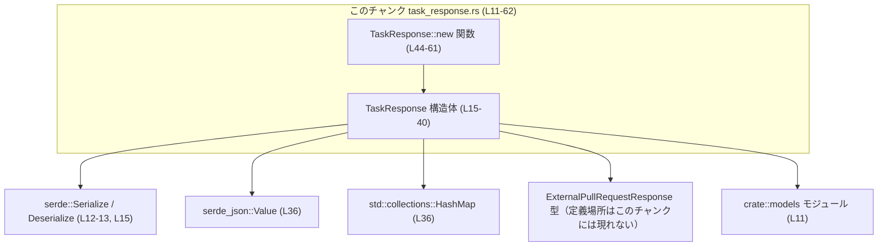
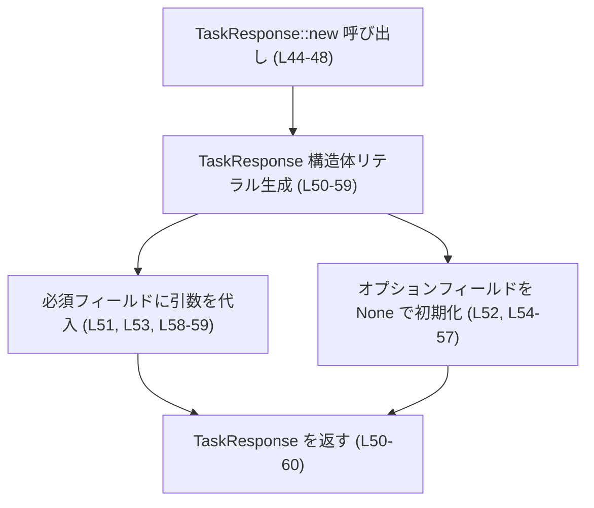
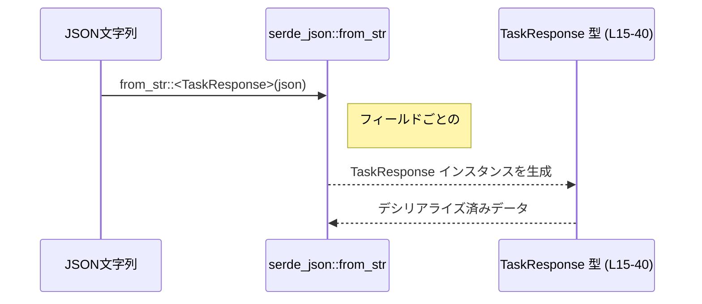
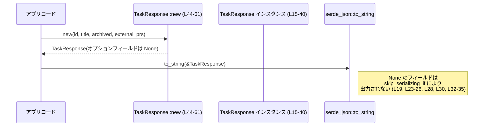

# codex-backend-openapi-models/src/models/task_response.rs

## 0. ざっくり一言

`TaskResponse` は、OpenAPI 定義に基づいて自動生成された「タスク」リソースのレスポンスボディ用データ構造であり、`serde` を使って JSON とのシリアライズ／デシリアライズを行うためのモデルです（`task_response.rs:L1-8, L15-40`）。

---

## 1. このモジュールの役割

### 1.1 概要

- ファイル先頭コメントから、このコードは OpenAPI ドキュメント（バージョン 0.0.1）から `openapi-generator` によって生成されたものであることが分かります（`task_response.rs:L1-8`）。
- `TaskResponse` 構造体は、タスクの ID、タイトル、作成日時、メタデータ、関連するプルリクエストなどを一つのレスポンスとしてまとめて表現します（`task_response.rs:L15-40`）。
- `serde` の属性により、JSON のフィールド名・省略ルールが指定されており、API のスキーマと Rust 側の型を同期させる役割を持っています（`task_response.rs:L17-40`）。

### 1.2 アーキテクチャ内での位置づけ

このモジュールは `crate::models` の一部として、API モデル（DTO: Data Transfer Object）を定義するレイヤーに位置づけられます。

主な依存関係:

- `crate::models` モジュール：`ExternalPullRequestResponse` 型を参照（`task_response.rs:L11, L39-40`）。
- `serde::{Serialize, Deserialize}`：JSON (de)serialization のためのトレイトを derive（`task_response.rs:L12-13, L15`）。
- `serde_json::Value`：任意の JSON 値を保持するために利用（`task_response.rs:L36`）。
- `std::collections::HashMap`：文字列キーに任意の JSON 値を紐づけるために利用（`task_response.rs:L36`）。

依存関係の概要を Mermaid で示します。



`ExternalPullRequestResponse` の具体的な定義ファイルや詳細は、このチャンクには現れないため不明です。

### 1.3 設計上のポイント

- **自動生成コード**  
  - ファイル先頭コメントにより、`openapi-generator` による生成物であると明示されています（`task_response.rs:L1-8`）。  
    そのため、OpenAPI 定義からの再生成で上書きされる可能性があります。

- **データ専用の構造体**  
  - `TaskResponse` はフィールドのみを持ち、ビジネスロジックとなるメソッドはコンストラクタ `new` だけです（`task_response.rs:L15-40, L43-61`）。  
    内部に状態管理ロジックや検証ロジックは含まれません。

- **全フィールドが `pub`**  
  - すべてのフィールドが公開されており、どこからでも読み書きできます（`task_response.rs:L18, L20, L22, L27-28, L30, L36, L38, L40`）。

- **Serde 属性による JSON 仕様の表現**  
  - `rename` で JSON フィールド名が明示されており、Rust 側のフィールド名と API の JSON キー名の対応が固定されています（`task_response.rs:L17, L19, L21, L23-26, L28-30, L32-35, L37, L39`）。
  - `Option` フィールドには `skip_serializing_if = "Option::is_none"` が指定され、`None` のときは JSON にキーが出力されません（`task_response.rs:L19, L23-26, L28, L30, L32-35`）。

- **エラーハンドリング／安全性**  
  - このファイルには `unsafe` ブロックや `panic!` 呼び出しはなく、`TaskResponse::new` も単に構造体を構築するだけです（`task_response.rs:L43-61`）。
  - エラー型 (`Result` 等) は一切登場しないため、このモジュール単体ではエラー制御は行いません。

- **並行性（スレッドセーフティ）**  
  - 構造体自体は単なるフィールド集合であり、内部に `Mutex` などの共有可変状態はありません（`task_response.rs:L15-40`）。
  - `Send` / `Sync` 実装可否はフィールド型に依存しますが、`models::ExternalPullRequestResponse` の定義がこのチャンクには現れないため、最終的なスレッドセーフ性は不明です。

---

## 2. 主要な機能一覧

このモジュールが提供する主な機能は次のとおりです。

- `TaskResponse` 構造体: タスクレスポンスの JSON モデル（`task_response.rs:L15-40`）。
- Serde による JSON シリアライズ／デシリアライズ設定: `#[derive(Serialize, Deserialize)]` とフィールドごとの `#[serde(...)]` 属性（`task_response.rs:L15, L17-40`）。
- `TaskResponse::new`: 必須と思われるフィールド（`id`, `title`, `archived`, `external_pull_requests`）から `TaskResponse` を構築するヘルパーメソッド（`task_response.rs:L44-61`）。

---

## 3. 公開 API と詳細解説

### 3.1 型一覧（構造体・列挙体など）

#### 型インベントリー

| 名前          | 種別   | 役割 / 用途                                                                 | 定義位置                         |
|---------------|--------|------------------------------------------------------------------------------|----------------------------------|
| `TaskResponse` | 構造体 | タスクに関するレスポンスデータをまとめて保持するモデル。JSON と相互変換される。 | `task_response.rs:L15-40`        |

`TaskResponse` のフィールド概要（名称から読み取れる範囲での説明です）:

- `id: String`  
  - タスクを一意に識別する ID を保持する意図が名前から読み取れますが、形式（UUID など）はこのチャンクからは不明です（`task_response.rs:L17-18`）。

- `created_at: Option<f64>`  
  - 作成時刻を浮動小数点数で表現するためのフィールドと推測されますが、単位（秒／ミリ秒）やタイムゾーンなどの仕様は不明です（`task_response.rs:L19-20`）。
  - `Option` であるため、省略可能・不明な場合も表現できます。

- `title: String`  
  - タスクのタイトルを表す文字列と解釈できます（`task_response.rs:L21-22`）。

- `has_generated_title: Option<bool>`  
  - タイトルが自動生成されたかどうかを表すフラグと思われます（`task_response.rs:L23-27`）。
  - `None` の場合は「情報なし」という状態を表現できます。

- `current_turn_id: Option<String>`  
  - 「現在のターン」の ID を表すと解釈できますが、turn の意味はこのチャンクでは不明です（`task_response.rs:L28-29`）。

- `has_unread_turn: Option<bool>`  
  - 未読のターンが存在するかどうかのフラグと思われます（`task_response.rs:L30-31`）。

- `denormalized_metadata: Option<HashMap<String, serde_json::Value>>`  
  - 任意のキー／値ペアで追加のメタデータを保持するためのフィールドです（`task_response.rs:L32-36`）。
  - 値が `serde_json::Value` なので、ネストした JSON 構造をそのまま受け取ることができます。

- `archived: bool`  
  - タスクがアーカイブ済みかどうかを表すブール値です（`task_response.rs:L37-38`）。

- `external_pull_requests: Vec<models::ExternalPullRequestResponse>`  
  - このタスクに紐づく外部プルリクエストの配列です（`task_response.rs:L39-40`）。
  - `ExternalPullRequestResponse` の詳細はこのチャンクには現れないため不明です。

### 3.2 関数詳細

このファイルに存在する公開関数は 1 つです。

#### `TaskResponse::new(id: String, title: String, archived: bool, external_pull_requests: Vec<models::ExternalPullRequestResponse>) -> TaskResponse`

**概要**

- 必須フィールドと思われる `id`, `title`, `archived`, `external_pull_requests` を受け取り、その他のオプションフィールドを `None` に初期化した `TaskResponse` インスタンスを返すコンストラクタです（`task_response.rs:L44-61`）。

**引数**

| 引数名                  | 型                                              | 説明 |
|-------------------------|--------------------------------------------------|------|
| `id`                    | `String`                                        | タスク ID。形式は不明ですが、API クライアント／サーバ側で一意性を保証することを想定できます（`task_response.rs:L45`）。 |
| `title`                 | `String`                                        | タスクのタイトル文字列（`task_response.rs:L46`）。 |
| `archived`              | `bool`                                          | タスクがアーカイブ済みかどうかを表すフラグ（`task_response.rs:L47`）。 |
| `external_pull_requests` | `Vec<models::ExternalPullRequestResponse>`     | 紐づく外部プルリクエストのリスト（`task_response.rs:L48`）。 |

**戻り値**

- `TaskResponse`  
  上記引数で指定した値を設定し、その他のオプションフィールドを `None` にした新しい `TaskResponse` インスタンスを返します（`task_response.rs:L50-59`）。

**内部処理の流れ（アルゴリズム）**

`TaskResponse::new` の処理は非常に単純です（`task_response.rs:L44-61`）。

1. 構造体リテラル `TaskResponse { ... }` を生成する（`task_response.rs:L50-59`）。
2. フィールド `id`, `title`, `archived`, `external_pull_requests` には、引数で渡された値をそのまま設定する（`task_response.rs:L51, L53, L58-59`）。
3. それ以外のオプションフィールド `created_at`, `has_generated_title`, `current_turn_id`, `has_unread_turn`, `denormalized_metadata` にはすべて `None` を設定する（`task_response.rs:L52, L54-57`）。
4. 構築した `TaskResponse` インスタンスを返す（`task_response.rs:L50-60`）。

フローチャートイメージ（簡易）:



**Examples（使用例）**

1. **基本的な生成とシリアライズ**

```rust
use crate::models::{TaskResponse, ExternalPullRequestResponse}; // クレート名はこのチャンクからは不明のため `crate` で表記しています
use serde_json;

// 空のプルリクエスト一覧を用意する
let external_prs: Vec<ExternalPullRequestResponse> = Vec::new();

// TaskResponse を生成する
let task = TaskResponse::new(
    "task-123".to_string(),   // id
    "コードレビュー".to_string(), // title
    false,                    // archived
    external_prs,             // external_pull_requests
);

// JSON 文字列にシリアライズする（created_at など None のフィールドは出力されない）
let json = serde_json::to_string(&task).unwrap();
println!("{}", json);
```

この例では、`created_at` や `has_generated_title` などが `None` のため、JSON 出力には含まれません（`skip_serializing_if` による、`task_response.rs:L19, L23-26, L28, L30, L32-35`）。

1. **生成後にオプションフィールドを設定する**

```rust
use crate::models::{TaskResponse, ExternalPullRequestResponse};
use std::collections::HashMap;
use serde_json::json;

let task = TaskResponse::new(
    "task-456".to_string(),
    "タイトル未設定".to_string(),
    false,
    Vec::<ExternalPullRequestResponse>::new(),
);

// mutable な変数にしてからフィールドを設定する
let mut task = task;

// 時刻やメタデータを後から埋める
task.created_at = Some(1_725_000_000.0); // 単位はこのチャンクからは不明
task.has_generated_title = Some(true);
task.denormalized_metadata = Some(HashMap::from([
    ("priority".to_string(), json!("high")),
]));
```

**Errors / Panics（エラー・パニック）**

- この関数自体は `Result` を返さず、内部に `panic!` もありません（`task_response.rs:L44-61`）。
- 理論上、メモリアロケーションに失敗した場合など、Rust ランタイムレベルのパニックはありえますが、これはこの関数に特有のものではなく、一般的な構造体生成と同様です。
- フィールド値が不正かどうかの検証（ID 形式チェックなど）は一切行っていません。そのため、呼び出し側で必要に応じたバリデーションを行う必要があります。

**Edge cases（エッジケース）**

- `id` や `title` が空文字列の場合  
  - この関数では特別な扱いはせず、そのままフィールドに設定します（`task_response.rs:L51, L53`）。
- `external_pull_requests` が空のベクタの場合  
  - 空のリストとしてそのまま設定され、問題なくシリアライズ／デシリアライズ可能です（`task_response.rs:L59`）。
- オプションフィールドの初期状態  
  - `created_at`, `has_generated_title`, `current_turn_id`, `has_unread_turn`, `denormalized_metadata` がすべて `None` になります（`task_response.rs:L52, L54-57`）。
  - その結果、シリアライズ時にはこれらのキーは JSON に出力されません（`skip_serializing_if` 属性, `task_response.rs:L19, L23-26, L28, L30, L32-35`）。

**使用上の注意点**

- `TaskResponse::new` を使うと、オプションフィールドはすべて `None` で初期化されます。そのため、API 応答としてこれらの値を含めたい場合は、生成後に必ずフィールドを上書き設定する必要があります（`task_response.rs:L52, L54-57`）。
- バリデーションが一切行われないため、不正な ID 文字列や論理的に矛盾するフラグ（例: `has_unread_turn = true` だが関連データが存在しない）もそのまま構築されます。
- このコンストラクタは「便利関数」であり、OpenAPI 仕様上の「必須フィールド」の定義はこのチャンクには現れません。仕様との整合性は OpenAPI ドキュメント側を確認する必要があります。

### 3.3 その他の関数

- このファイルには `TaskResponse::new` 以外の公開関数・メソッド・関連関数は存在しません（`impl TaskResponse` ブロック内に `new` のみが定義, `task_response.rs:L43-61`）。

---

## 4. データフロー

ここでは、このモデルが典型的にどのように使われるかを、`serde` による JSON デシリアライズの流れとして説明します。実際の HTTP 層のコードはこのチャンクには存在しないため、以下は「この型と `serde` の組み合わせで起こる処理フロー」の例です。

1. JSON 文字列（例: HTTP レスポンスボディ）が `serde_json::from_str` などに渡される。
2. `serde` は `TaskResponse` に付与された `Serialize` / `Deserialize` と `#[serde(rename = "...")]` 属性を用いて、JSON のキーを対応するフィールドにマッピングする（`task_response.rs:L15, L17-40`）。
3. JSON に存在しないオプションフィールドは `None` として初期化される。
4. `skip_serializing_if = "Option::is_none"` はデシリアライズには影響せず、シリアライズ時（`to_string` 等）にのみ適用される。

シーケンス図の例:



また、`TaskResponse::new` を使った生成とシリアライズの流れも示すと次のようになります。



---

## 5. 使い方（How to Use）

### 5.1 基本的な使用方法

`TaskResponse` を生成し、JSON と相互変換する基本的な例です。

```rust
use crate::models::{TaskResponse, ExternalPullRequestResponse}; // クレート名はこのチャンクでは不明

fn build_task_response() -> TaskResponse {
    // 外部プルリクエストは今回は空リストとする
    let external_prs: Vec<ExternalPullRequestResponse> = Vec::new();

    // TaskResponse を new で生成する
    let task = TaskResponse::new(
        "task-123".to_string(),    // id
        "ドキュメント作成".to_string(), // title
        false,                     // archived
        external_prs,              // external_pull_requests
    );

    task
}

fn main() -> Result<(), Box<dyn std::error::Error>> {
    let task = build_task_response();

    // JSON にシリアライズする
    let json = serde_json::to_string_pretty(&task)?; // created_at など None のフィールドは出力されない
    println!("{}", json);

    // JSON から再度 TaskResponse に戻す
    let deserialized: TaskResponse = serde_json::from_str(&json)?;
    println!("{:?}", deserialized); // Debug は derive されている (L15)

    Ok(())
}
```

### 5.2 よくある使用パターン

1. **手動でオプションフィールドを埋める**

```rust
use crate::models::{TaskResponse, ExternalPullRequestResponse};

let mut task = TaskResponse::new(
    "task-789".to_string(),
    "レビュー依頼".to_string(),
    false,
    Vec::<ExternalPullRequestResponse>::new(),
);

// 必要な情報を後から設定する
task.created_at = Some(1_725_000_000.0);  // 型は f64 (L19-20)
task.has_unread_turn = Some(true);        // 未読フラグ (L30-31)
```

1. **`Default` を利用した初期化（derive により利用可能）**

```rust
use crate::models::TaskResponse;

let mut task = TaskResponse::default(); // 全フィールドが型の Default で初期化される (L15)

// 必要なフィールドだけ埋める
task.id = "task-000".to_string();
task.title = "空のタスク".to_string();
```

`Default` の具体的な値は各フィールド型に依存しますが、`String` は空文字、`Option<T>` は `None`、`bool` は `false`、`Vec<T>` は空ベクタが一般的です。

1. **JSON を直接パースする**

```rust
use crate::models::TaskResponse;
use serde_json::json;

// 例として、部分的な JSON を用意する（いくつかのフィールドを省略）
let json_value = json!({
    "id": "task-999",
    "title": "最小限のレスポンス",
    "archived": false,
    "external_pull_requests": []
});

// Value から TaskResponse に変換する
let task: TaskResponse = serde_json::from_value(json_value)?;
assert_eq!(task.id, "task-999");
assert_eq!(task.created_at, None); // JSON にないので None になる (L19-20)
```

### 5.3 よくある間違い

```rust
use crate::models::{TaskResponse, ExternalPullRequestResponse};

// 間違い例: created_at が設定されると思い込んでいる
let task = TaskResponse::new(
    "task-123".to_string(),
    "タイトル".to_string(),
    false,
    Vec::<ExternalPullRequestResponse>::new(),
);

// created_at は new 内で必ず None にされている (L52)
assert!(task.created_at.is_none()); // ここで Some(...) だと期待すると誤解
```

```rust
// 正しい例: new で生成した後、必要なフィールドを明示的に設定する
let mut task = TaskResponse::new(
    "task-123".to_string(),
    "タイトル".to_string(),
    false,
    Vec::<ExternalPullRequestResponse>::new(),
);
task.created_at = Some(1_725_000_000.0);
```

他の注意点:

- `skip_serializing_if = "Option::is_none"` は **シリアライズ時だけ** 影響するため、  
  「JSON にキーがない → デシリアライズできない」と誤解しないこと（実際には `None` として読み込まれます, `task_response.rs:L19, L23-26, L28, L30, L32-35`）。

### 5.4 使用上の注意点（まとめ）

- **バリデーションなし**  
  - 型レベルでは文字列長やフォーマットの制約はなく、`TaskResponse::new` でも検証を行いません（`task_response.rs:L44-61`）。  
    ID 形式・タイトルの必須性などは呼び出し側か別レイヤーで検証する必要があります。

- **オプションフィールドの初期状態**  
  - `new` では複数のフィールドが `None` になります（`task_response.rs:L52, L54-57`）。  
    これを前提にしているコード（例: `created_at` が必ず `Some` であると仮定する処理）を書くとバグの原因になります。

- **並行性**  
  - この構造体はロックを含まない単なるデータの集まりです（`task_response.rs:L15-40`）。  
    フィールド型が `Send` / `Sync` であればスレッド間共有も可能ですが、`ExternalPullRequestResponse` の性質はこのチャンクからは分かりません。
  - 可変アクセスを複数スレッドから行う場合は、通常どおり `Mutex` などを用いる必要があります。

- **セキュリティ・信頼境界**  
  - `denormalized_metadata` は任意の JSON を受け取れるため、外部入力からそのまま来るデータとして扱う場合は、使用箇所でバリデーションやエスケープを行う必要があります（`task_response.rs:L32-36`）。

- **観測性（ログ等）**  
  - このモジュール内にはログ出力やメトリクス記録などの機能はありません（`task_response.rs:L11-62`）。  
    ログを取りたい場合は、この型を利用する上位レイヤーで行う必要があります。

---

## 6. 変更の仕方（How to Modify）

### 6.1 新しい機能を追加する場合

このファイルは `openapi-generator` によって生成されているため（`task_response.rs:L1-8`）、直接編集すると **再生成時に上書きされるリスク** があります。その前提で、変更の考え方を整理します。

1. **OpenAPI 定義から追加するのが基本**  
   - 新しいフィールドや API 仕様を追加したい場合は、OpenAPI ドキュメント側にフィールドを追加し、ジェネレータを再実行するのが標準的な手順です。
   - これにより、`#[serde(rename = "...")]` なども一貫した形で生成されます。

2. **やむを得ず手動でフィールドを追加する場合**（生成方針を理解した上で）

   - `TaskResponse` にフィールドを追加する（`task_response.rs:L15-40` の該当位置）。
   - JSON との互換性を保つために、適切な `#[serde(...)]` 属性を付ける：
     - 新しい JSON キー名が OpenAPI 仕様に対応していることを確認する。
   - `TaskResponse::new` にも新しい引数／フィールド初期化を追加する（`task_response.rs:L44-59`）か、  
     「追加フィールドは `Default` に任せる」というポリシーなら、あえて `new` には含めない選択もあります。

3. **関連する型の利用**  
   - `external_pull_requests` のように別のモデル型を参照したい場合、`crate::models` 内に定義された型を利用します（`task_response.rs:L11, L39-40`）。  
   - どのファイルにどの型が定義されているかは、このチャンクには現れないため、プロジェクト全体を検索する必要があります。

### 6.2 既存の機能を変更する場合

- **フィールド名や `rename` の変更**  
  - `#[serde(rename = "...")]` を変更すると、JSON との互換性が失われる可能性があります（`task_response.rs:L17, L19, L21, L23-26, L28, L30, L32-35, L37, L39`）。
  - すでに運用中のクライアント／サーバがある場合は、互換性を保つかどうかを慎重に検討する必要があります。

- **`skip_serializing_if` の変更**  
  - これを削除すると、`None` のフィールドも JSON に `null` などとして出力されるようになります。  
    既存クライアントが「キーが存在しない」ことを前提にしている場合、挙動変化によりバグが発生する可能性があります（`task_response.rs:L19, L23-26, L28, L30, L32-35`）。

- **`new` のシグネチャ変更**  
  - 引数を追加／削除すると、`TaskResponse::new` を呼び出しているすべてのコードに影響します（`task_response.rs:L44-48`）。  
    変更前に `rg "TaskResponse::new"` のような検索で使用箇所を把握し、影響範囲を確認することが推奨されます。
  - `new` でどのフィールドを初期化するかは「この関数の契約」に近いため、変更すると呼び出し側の期待を裏切る可能性があります（`task_response.rs:L50-59`）。

- **テストについて**  
  - このチャンクにはテストコードは含まれていません（`task_response.rs:L1-62`）。  
  - 変更時には、少なくとも JSON との相互変換（シリアライズ／デシリアライズ）が期待どおりであることを確認するテストを追加することが有用です。

---

## 7. 関連ファイル

このモジュールと密接に関係すると考えられるコンポーネントを、コードから読み取れる範囲で列挙します。

| パス / モジュール                        | 役割 / 関係 |
|-----------------------------------------|-------------|
| `crate::models`（具体ファイル名は不明） | `use crate::models;` によりインポートされており、`ExternalPullRequestResponse` 型を提供します（`task_response.rs:L11, L39-40`）。 |
| `serde` クレート                        | `Serialize`, `Deserialize` トレイトの derive により、JSON との (de)serialization を実現します（`task_response.rs:L12-13, L15`）。 |
| `serde_json` クレート                   | `serde_json::Value` により、任意構造の JSON メタデータを保持します（`task_response.rs:L36`）。 |
| `std::collections::HashMap`             | メタデータのキー／値ペアを保持するマップ実装として利用されています（`task_response.rs:L36`）。 |

`ExternalPullRequestResponse` 自体の定義ファイルパスや詳細な構造は、このチャンクには現れないため不明です。

---

以上が、`codex-backend-openapi-models/src/models/task_response.rs` の公開 API、コアロジック、安全性・エラー・並行性の観点を含めた解説です。
