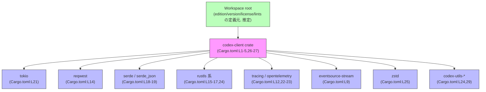
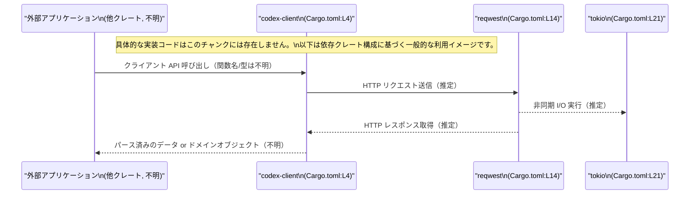

# codex-client/Cargo.toml コード解説

## 0. ざっくり一言

`codex-client` クレートの **パッケージ情報と依存クレート** を定義する Cargo マニフェストです（Cargo.toml:L1-33）。  
実際の公開 API やコアロジックは、このファイルではなく `src/` 以下の Rust コード側に存在します（このチャンクには現れません）。

---

## 1. このモジュールの役割

### 1.1 概要

- このファイルは `codex-client` という名前のクレートを定義し（Cargo.toml:L4）、  
  その **版（edition）・ライセンス・バージョン** をワークスペース共通設定から継承します（Cargo.toml:L2-3, L5）。
- クレートが利用する **実行時依存クレート**（`tokio`, `reqwest`, `serde`, `rustls` など）と  
  **開発時のみ利用される依存クレート**（`pretty_assertions`, `tempfile` など）を宣言しています（Cargo.toml:L7-25, L28-33）。
- Lint 設定もワークスペース共通設定を利用するよう指定されています（Cargo.toml:L26-27）。

### 1.2 アーキテクチャ内での位置づけ

この Cargo.toml から読み取れる範囲での位置づけは次のとおりです。

- `edition.workspace = true` / `license.workspace = true` / `version.workspace = true` / `[lints] workspace = true`  
  という指定により、このクレートは **Cargo ワークスペースの一部** であり、  
  Edition / ライセンス / バージョン / Lint の設定をワークスペースのルートから継承しています（Cargo.toml:L2-3, L5, L26-27）。
- 依存クレートはすべて `{ workspace = true }` で記述されており（Cargo.toml:L7-25, L29-33）、  
  バージョンや一部の feature 指定はワークスペース共通で管理されています。
- `tokio`（非同期ランタイム, Cargo.toml:L21）, `futures`（非同期ユーティリティ, Cargo.toml:L10）,  
  `async-trait`（async 関数を含む trait のためのマクロ, Cargo.toml:L7）など、  
  非同期処理関連のクレートに依存しているため、`codex-client` は **非同期処理・並行処理を行うクライアント的な役割** を  
  担っている可能性がありますが、実装コードがないため断定はできません（このチャンクには現れません）。
- `reqwest`（HTTP クライアント, Cargo.toml:L14）, `http`（HTTP 型定義, Cargo.toml:L11）,  
  `rustls` / `rustls-native-certs` / `rustls-pki-types`（TLS 関連, Cargo.toml:L15-17）への依存から、  
  HTTPS ベースの通信を行うクレートであることが推測されます（用途は推測であり、このファイルだけでは確定できません）。

#### 依存関係（ビルド時）の概略図

以下は、この Cargo.toml に書かれている **主な依存関係** を示すグラフです。  
ノードのラベルに、この情報が現れる行番号を付記しています。



> 注: 上図は **ビルド時の依存関係** を示すものであり、  
> 実際の関数呼び出しやデータフローは、このチャンクには現れないため不明です。

### 1.3 設計上のポイント（Cargo 設定レベル）

Cargo マニフェストの設計方針として読み取れる点を列挙します。

- **ワークスペース共通設定の積極利用**  
  - edition / license / version / lints を `.workspace = true` で一元管理しています（Cargo.toml:L2-3, L5, L26-27）。  
    これにより、複数クレート間で設定を揃えやすくなっています。
- **依存バージョンのワークスペース一元管理**  
  - すべての依存が `{ workspace = true }` を指定しており（Cargo.toml:L7-25, L29-33）、  
    バージョンや（必要なら）一部 feature がワークスペースルート側でまとめて定義されている構成です。
- **非同期・HTTP・TLS・テレメトリ指向の依存構成**  
  - 非同期処理: `async-trait`（L7）, `futures`（L10）, `tokio`（L21）  
  - HTTP/TLS: `http`（L11）, `reqwest`（L14）, `rustls` / `rustls-native-certs` / `rustls-pki-types`（L15-17）  
  - シリアライズ: `serde`（L18）, `serde_json`（L19）  
  - テレメトリ/トレーシング: `opentelemetry`（L12）, `tracing`（L22）, `tracing-opentelemetry`（L23）  
  - 圧縮: `zstd`（L25）  
  といった依存構成から、ネットワーク・IO とテレメトリを備えたクライアント的な役割が想定されますが、詳細な挙動は不明です。
- **開発用ユーティリティの明確な分離**  
  - テストやデバッグ用の依存 (`pretty_assertions`, `tempfile`, `opentelemetry_sdk`, `tracing-subscriber`, `codex-utils-cargo-bin`) は  
    `[dev-dependencies]` として分離されています（Cargo.toml:L28-33）。

---

## 2. 主要な機能一覧（Cargo マニフェストとして）

このファイル自体が提供する「機能」は、Rust コードではなく **ビルド設定上の役割** になります。

- パッケージメタデータの定義:  
  - `name = "codex-client"` というクレート名の定義（Cargo.toml:L4）  
  - edition / license / version をワークスペースルートから継承（Cargo.toml:L2-3, L5）
- 実行時依存関係の宣言:  
  - 非同期処理 (`tokio`, `futures`, `async-trait`)（Cargo.toml:L7, L10, L21）  
  - HTTP 通信と TLS (`reqwest`, `http`, `rustls` 系)（Cargo.toml:L11, L14-17, L24）  
  - シリアライズ (`serde`, `serde_json`)（Cargo.toml:L18-19）  
  - テレメトリ/ロギング (`tracing`, `tracing-opentelemetry`, `opentelemetry`)（Cargo.toml:L12, L22-23）  
  - 圧縮 (`zstd`)（Cargo.toml:L25）
- 開発時依存関係の宣言:  
  - テスト補助 (`pretty_assertions`, `tempfile`)（Cargo.toml:L31-32）  
  - テレメトリのテスト/デバッグ用 (`opentelemetry_sdk`, `tracing-subscriber`)（Cargo.toml:L30, L33）  
  - ワークスペース内バイナリユーティリティ (`codex-utils-cargo-bin`)（Cargo.toml:L29）
- Lint 設定の共通化:  
  - `[lints] workspace = true` によるコンパイラ/Clippy などの設定共通化（Cargo.toml:L26-27）

### 2.1 コンポーネントインベントリー（依存クレート）

このチャンクで確認できる「コンポーネント」（クレート単位）の一覧です。

| コンポーネント名 | 種別 | 用途（根拠付きの範囲） | 根拠 |
|------------------|------|------------------------|------|
| `codex-client` | クレート本体 | 本ファイルで定義されるクレート名 | Cargo.toml:L4 |
| `async-trait` | 依存クレート | 非同期 trait 用マクロとして一般に使用されるが、本リポジトリでの具体的用途は不明 | Cargo.toml:L7 |
| `bytes` | 依存クレート | バイト列操作用クレートとして一般に知られるが、本リポジトリでの用途は不明 | Cargo.toml:L8 |
| `eventsource-stream` | 依存クレート | Server-Sent Events 用クレートとして一般に知られるが、具体的利用箇所は不明 | Cargo.toml:L9 |
| `futures` | 依存クレート | 非同期ユーティリティクレート。利用 API はこのチャンクには現れない | Cargo.toml:L10 |
| `http` | 依存クレート | HTTP メッセージ型定義。どの型を使っているかは不明 | Cargo.toml:L11 |
| `opentelemetry` | 依存クレート | テレメトリ API。どのシグナル（トレース/メトリクス）を使うかは不明 | Cargo.toml:L12 |
| `rand` | 依存クレート | 乱数生成。用途は不明 | Cargo.toml:L13 |
| `reqwest` | 依存クレート | HTTP クライアント。`["json", "stream"]` feature が有効（Cargo.toml:L14） |
| `rustls`, `rustls-native-certs`, `rustls-pki-types` | 依存クレート | TLS 関連。どの API を使うかは不明 | Cargo.toml:L15-17 |
| `serde`, `serde_json` | 依存クレート | シリアライズ/JSON。`serde` に `["derive"]` feature が有効 | Cargo.toml:L18-19 |
| `thiserror` | 依存クレート | エラー型定義用マクロとして一般に用いられるが、本クレートのエラー構造は不明 | Cargo.toml:L20 |
| `tokio` | 依存クレート | 非同期ランタイム。`"macros", "rt", "time", "sync"` feature が有効 | Cargo.toml:L21 |
| `tracing`, `tracing-opentelemetry` | 依存クレート | 構造化ログ/トレースと OpenTelemetry 連携。具体的なスパン構造は不明 | Cargo.toml:L22-23 |
| `codex-utils-rustls-provider` | 依存クレート | ワークスペース内のユーティリティクレート（TLS 関連と推測されるが、詳細不明） | Cargo.toml:L24 |
| `zstd` | 依存クレート | Zstandard 圧縮ライブラリ。どのレベル/フォーマットを使うかは不明 | Cargo.toml:L25 |
| `codex-utils-cargo-bin` | dev 依存 | ワークスペース内バイナリユーティリティ。具体的なコマンド内容は不明 | Cargo.toml:L29 |
| `opentelemetry_sdk` | dev 依存 | OpenTelemetry SDK。テストコードでの利用が想定されるが、このチャンクには現れない | Cargo.toml:L30 |
| `pretty_assertions` | dev 依存 | 差分が見やすいアサーションマクロ。利用テストは不明 | Cargo.toml:L31 |
| `tempfile` | dev 依存 | 一時ファイル管理。利用箇所は不明 | Cargo.toml:L32 |
| `tracing-subscriber` | dev 依存 | `tracing` のサブスクライバ。テストやローカル実行時のログ出力に使用される可能性 | Cargo.toml:L33 |

> 用途欄でクレートの一般的な役割に言及している部分は、外部クレートの公開情報に基づく一般論であり、  
> **`codex-client` 内での具体的な使い方は、このチャンクからは分かりません**。

---

## 3. 公開 API と詳細解説

### 3.1 型一覧（構造体・列挙体など）

このファイルは Cargo マニフェストであり、Rust の型定義や関数定義は含まれていません（Cargo.toml:L1-33）。  
したがって、このチャンクから **`codex-client` クレートがどのような型や公開 API を提供しているかは不明** です。

関数・構造体インベントリー（このチャンク分）は次のようになります。

| 名前 | 種別 | ファイル | 行 | 備考 |
|------|------|----------|----|------|
| （なし） | - | codex-client/Cargo.toml | - | このファイルには Rust の型・関数定義は存在しません（Cargo.toml:L1-33） |

### 3.2 関数詳細（最大 7 件）

- このチャンクには関数定義が一切現れないため、  
  **詳細解説対象となる公開関数を特定することはできません**。
- 実際の API やコアロジックは `src/` 以下の Rust コード側に存在すると考えられますが、  
  その内容はこのファイルからは読み取れません。

### 3.3 その他の関数

- 同様に、補助関数やラッパー関数についても、このチャンクからは一切情報が得られません。

---

## 4. データフロー

### 4.1 このチャンクから分かる範囲

- Cargo マニフェストには、**実行時の関数呼び出し順序やデータフローそのものは記述されません**。  
  そのため、`codex-client` がどのようにデータを受け取り、どの依存クレートに渡しているかといった  
  具体的な処理フローは、このチャンクだけでは不明です。
- ここでは、**依存関係に基づく概念的なフロー** を、一般的な Rust 非同期クライアントのパターンとして示します。  
  これはあくまで一般論であり、`codex-client` 固有の挙動を保証するものではありません。

### 4.2 依存関係に基づく概念的な呼び出しイメージ（一般論）

以下は、「外部アプリケーションが `codex-client` を利用して HTTP リクエストを行う」という  
一般的なケースを想定した概念図です。ラベルには、このチャンク内の行番号を付けています。



> 重要: この sequence diagram は **概念イメージ** であり、  
> 実際にどのような関数/型が存在するか、どのようなエラー処理や並行性制御があるかは、  
> この Cargo.toml からは特定できません。

---

## 5. 使い方（How to Use）

### 5.1 基本的な使用方法（Cargo レベル）

`codex-client` を別クレートから利用する場合、Cargo レベルでは次のような形になります。

#### ワークスペース内から利用する場合（推定）

ワークスペースの別クレートから `codex-client` に依存する場合の一例です。

```toml
# 別クレート側の Cargo.toml の例
[dependencies]
codex-client = { path = "../codex-client" }  # パスはワークスペース構成に依存します
```

- `name = "codex-client"` が定義されているため（Cargo.toml:L4）、依存側では `codex-client` という名前で参照します。
- 実際にどの関数や型を使えるかは、`codex-client` の `src/` 以下のコード（このチャンクには現れない）を確認する必要があります。

### 5.2 よくある使用パターン（一般論）

Cargo.toml の内容から、`codex-client` を利用する際に一般的に想定されるパターンを挙げます。

1. **非同期コンテキストでの利用（Tokio ランタイム上）**  
   - `tokio` に依存し（Cargo.toml:L21）、`tokio` の `"macros"` feature が有効になっているため、  
     `#[tokio::main]` や `#[tokio::test]` といったマクロを使うコードが存在する可能性がありますが、  
     実際にどう使っているかは不明です。
   - そのため、`codex-client` の多くの API が `async fn` で定義されている可能性があり、  
     その場合は利用側も Tokio ランタイム上で呼び出す必要があると推測されます（一般論）。

2. **HTTP + JSON ベースのプロトコル利用**  
   - `reqwest`（HTTP クライアント, Cargo.toml:L14）と `serde` / `serde_json`（Cargo.toml:L18-19）の組合せから、  
     HTTP + JSON ベースの API 通信を行うクライアントである可能性が高いですが、  
     エンドポイントやリクエスト/レスポンス型は、このチャンクには現れません。

3. **テレメトリ（トレース）の活用**  
   - `tracing`, `tracing-opentelemetry`, `opentelemetry`（Cargo.toml:L12, L22-23）に依存しているため、  
     API 呼び出し時にトレーススパンを生成し、外部のトレースバックエンド（Jaeger, OTLP, etc.）に送信する構造が  
     一般的に考えられますが、`codex-client` が具体的にどう計測しているかは不明です。

### 5.3 よくある間違い（Cargo 設定レベル）

Cargo マニフェストの構成から、起こりがちな誤用を挙げます。

```toml
# 誤り例: ワークスペースでバージョンを一元管理しているのに、
# 個別クレート側でもバージョンを指定してしまう
[dependencies]
reqwest = "0.12"           # ← ワークスペース管理を無視して個別指定（誤用の可能性）
```

- 本ファイルでは `reqwest = { workspace = true, features = ["json", "stream"] }` となっており（Cargo.toml:L14）、  
  バージョンはワークスペース側で統一管理される前提です。
- 個別クレートでバージョンを別途指定すると、  
  - ビルドエラー  
  - 期待しないバージョンの混在  
  などの問題を引き起こす可能性があります。

```toml
# 正しい例: ワークスペース管理を尊重し、個別クレートでは workspace 指定のみ
[dependencies]
reqwest = { workspace = true }  # バージョンはワークスペースで統一
```

### 5.4 使用上の注意点（まとめ）

このファイルから直接読み取れる、あるいは依存構成から一般的に注意すべき点は次のとおりです。

- **公開 API・前提条件はこのチャンクからは分からない**  
  - `codex-client` の関数シグネチャ、戻り値、エラー型、スレッドセーフ性などは  
    Cargo.toml には記述されていません（Cargo.toml:L1-33）。  
    実際の利用時は、Rust ソースコードやドキュメントを確認する必要があります。
- **非同期ランタイム依存の可能性**  
  - `tokio` 依存（Cargo.toml:L21）から、`codex-client` の API が Tokio ランタイムを前提としている可能性があります。  
    その場合、`tokio::main` 内や既存の Tokio ランタイム上で呼び出す必要があります（一般論）。
- **TLS/セキュリティ関連の注意**  
  - `rustls` / `rustls-native-certs` / `rustls-pki-types`（Cargo.toml:L15-17）や `zstd`（L25）など、  
    セキュリティや圧縮に関わる依存を持つため、  
    - 証明書検証の方法  
    - 圧縮データの扱い  
    などは実装側で慎重に扱うべき領域ですが、このチャンクから具体的な方針は読み取れません。
- **テレメトリの有効化/無効化**  
  - `tracing`, `opentelemetry` 関連（Cargo.toml:L12, L22-23）は、  
    適切な初期化がされていないと何も出力されなかったり、想定外のパフォーマンス劣化を招くことがありますが、  
    `codex-client` 側でどのように利用しているかは不明です。

---

## 6. 変更の仕方（How to Modify）

### 6.1 新しい機能を追加する場合（Cargo マニフェスト視点）

`codex-client` に新しい機能を追加する際、**Cargo.toml 側で必要になる変更**の例を示します。

1. **新たな依存クレートを追加したい場合**

   - 例: WebSocket を使う機能を追加する場合、`tokio-tungstenite` などのクレートを追加することが考えられます。
   - このワークスペースでは依存が `{ workspace = true }` に統一されているため（Cargo.toml:L7-25, L29-33）、  
     追加時も同じ方針に従うのが自然です。

   ```toml
   # ワークスペースルート Cargo.toml（推定）に追加する例
   [workspace.dependencies]
   tokio-tungstenite = "0.x"  # バージョンは実際の要件に応じて指定

   # codex-client/Cargo.toml に追加する例
   [dependencies]
   tokio-tungstenite = { workspace = true }  # 他の依存と同じパターン
   ```

   > 実際のワークスペース構成はこのチャンクには現れないため、  
   > `workspace.dependencies` の正確な書き方はルートの Cargo.toml を確認する必要があります。

2. **既存の依存の feature を追加・変更したい場合**

   - 例: `reqwest` に `gzip` サポートを追加したい場合など。
   - 本ファイルでは `reqwest = { workspace = true, features = ["json", "stream"] }` となっています（Cargo.toml:L14）。  
     feature を増やす場合、ワークスペース側で feature 管理をしている可能性もあるため、  
     変更前にルートの Cargo.toml を確認する必要があります。

### 6.2 既存の機能を変更する場合（注意点）

Cargo.toml 側での変更に関して、注意すべき点を挙げます。

- **依存クレートの削除/差し替えの影響範囲**
  - 例: `eventsource-stream`（Cargo.toml:L9）を削除・変更すると、  
    サーバー送信イベント（SSE）を利用したストリーム処理（あれば）が影響を受ける可能性があります。  
    実際の使用箇所はソースコード側を検索する必要があります。
- **エラー型関連の変更**
  - `thiserror` に依存していることから（Cargo.toml:L20）、  
    エラー型が `thiserror::Error` を用いて定義されている可能性があります。  
    これを別のエラー処理フレームワークに切り替える場合、公開 API の互換性に影響する可能性がありますが、  
    具体的な型はこのチャンクには現れません。
- **テスト・開発用依存の変更**
  - `pretty_assertions`, `tempfile`, `opentelemetry_sdk`, `tracing-subscriber` などの dev 依存（Cargo.toml:L30-33）は、  
    主にテストコードや開発時のロギングに影響します。  
    これらを変更する際は、`tests/` ディレクトリや `#[cfg(test)]` ブロックを確認する必要がありますが、  
    それらはこのチャンクには現れません。

---

## 7. 関連ファイル・関連クレート

この Cargo マニフェストに基づき、`codex-client` と密接に関連すると考えられる要素を列挙します。

| パス / 名前 | 種別 | 役割 / 関係 | 根拠 |
|-------------|------|-------------|------|
| `codex-client/Cargo.toml` | ファイル | 本ドキュメントの対象。`codex-client` クレートのパッケージ定義 | Cargo.toml:L1-33 |
| （ワークスペースルートの `Cargo.toml`） | ファイル（推定） | `edition.workspace = true` などの設定元。実ファイル内容は不明 | Cargo.toml:L2-3, L5, L26-27 |
| `codex-utils-rustls-provider` | クレート（ワークスペース内と推定） | TLS 設定/証明書関連のユーティリティクレートと推測されるが、詳細不明 | Cargo.toml:L24 |
| `codex-utils-cargo-bin` | クレート（ワークスペース内と推定） | 開発用バイナリユーティリティクレート。テストやツールとして利用される可能性 | Cargo.toml:L29 |
| その他依存クレート（`tokio`, `reqwest`, `serde` など） | 外部クレート | 非同期処理, HTTP 通信, シリアライズなどの機能を提供。`codex-client` の内部ロジックから利用される | Cargo.toml:L7-25, L30-33 |

> Rust ソースコードファイル（`src/lib.rs`, `src/main.rs` など）は、  
> 通常存在することが期待されますが、このチャンクには一切現れないため、  
> 実際のパスや構成は「コードからは分かりません」。

---

### まとめ

- このファイルは `codex-client` クレートの **ビルド設定と依存関係の宣言のみ** を扱っており、  
  公開 API やコアロジック、エラー処理、スレッドセーフ性などは **一切含まれていません**（Cargo.toml:L1-33）。
- 依存構成から、非同期 HTTP クライアントかつ TLS・テレメトリ対応である可能性が高いと推測されますが、  
  具体的な型・関数・データフローは、別途 Rust ソースコードを確認する必要があります。
