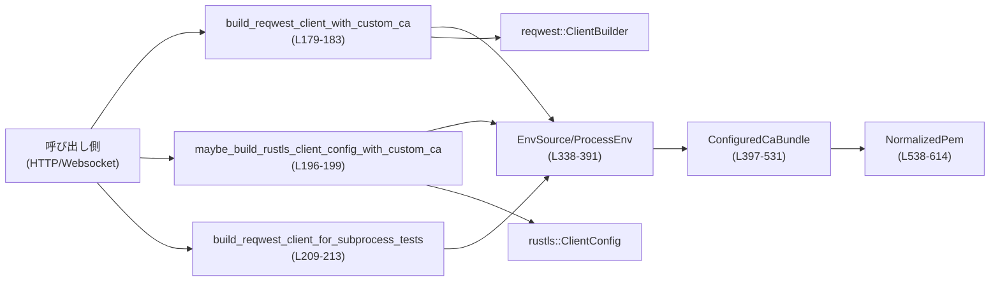
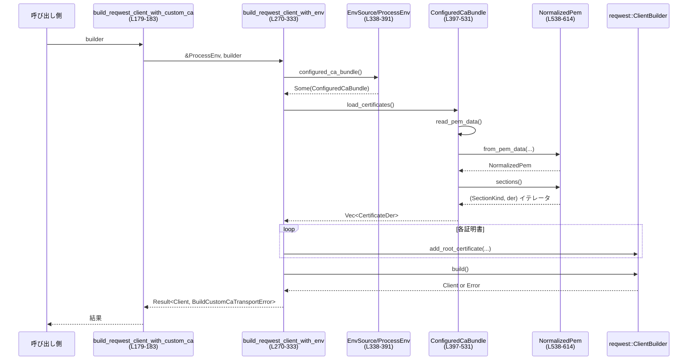

# codex-client/src/custom_ca.rs

## 0. ざっくり一言

Codex の HTTP クライアント（reqwest）と websocket（rustls）向けに、環境変数で指定されたカスタム CA バンドルを読み込み、TLS ルートストアに登録するための共通ロジックを提供するモジュールです（`custom_ca.rs:L1-41`）。

---

## 1. このモジュールの役割

### 1.1 概要

- このモジュールは、**カスタム CA 証明書ファイルを環境変数から選択・パースし、HTTP / websocket クライアントに組み込む**問題を解決します（`custom_ca.rs:L10-20`）。
- 具体的には、以下を行います（`custom_ca.rs:L12-15`）。
  - `CODEX_CA_CERTIFICATE`（優先）か `SSL_CERT_FILE` から CA ファイルパスを選ぶ
  - PEM のバリエーション（OpenSSL の `TRUSTED CERTIFICATE`、CRL を含むバンドルなど）を正規化して証明書を抽出
  - 読み込み・パース・登録失敗時に、ユーザ向けに分かりやすいエラーを返す
- 証明書チェーン検証や TLS ハンドシェイク自体は行わず、**「ルートストアに格納する DER 証明書列を構成する」**ところまでを責務とします（`custom_ca.rs:L17-20`）。

### 1.2 アーキテクチャ内での位置づけ

- 公開関数は、呼び出し元が用意した `reqwest::ClientBuilder` や rustls の `ClientConfig` 構築パスに、**共通の CA 取扱ポリシー**を差し込む役割です（`custom_ca.rs:L164-183`, `L185-199`, `L201-213`）。
- 環境変数アクセスは `EnvSource` トレイトで抽象化され、本番では `ProcessEnv`、テストでは `MapEnv` が使われます（`custom_ca.rs:L338-391`, `L699-707`）。
- CA バンドルの読み込み・パースは `ConfiguredCaBundle` と `NormalizedPem` にカプセル化されています（`custom_ca.rs:L397-531`, `L538-614`）。



### 1.3 設計上のポイント

- **責務の分割**（`custom_ca.rs:L336-405`, `L533-614`）
  - 環境変数の解釈: `EnvSource` / `ProcessEnv`
  - 「どのファイルを使うか」の決定: `EnvSource::configured_ca_bundle`
  - ファイル読み込み & PEM パース: `ConfiguredCaBundle`
  - OpenSSL 互換（`TRUSTED CERTIFICATE` ラベル）の正規化: `NormalizedPem`
  - DER 長さの安全な算出: `first_der_item` / `der_item_length`
- **エラーハンドリング方針**（`custom_ca.rs:L66-145`, `L147-161`, `L404-531`）
  - 失敗原因を `BuildCustomCaTransportError` のバリアントで区別（I/O、PEM パース、証明書登録、クライアント構築など）。
  - `From<BuildCustomCaTransportError> for io::Error` 実装により、外側からは `io::Error` としても扱える。
- **安全性・堅牢性**
  - PEM 解析は `rustls-pki-types` に委譲しつつ、DER 長さ計算は `checked_add` / `checked_mul` でオーバーフローを防止（`custom_ca.rs:L667-675`）。
  - 失敗時は必ず `Result::Err` を返し、`unwrap` や `expect` はテストコードにのみ登場（`custom_ca.rs:L720-722`）。
- **並行性**
  - グローバルな可変状態は持たず、I/O とローカル変数だけで完結しているため、**関数は同時呼び出ししてもデータ競合しない構造**です。
  - websocket 用の `ClientConfig` は `Arc<ClientConfig>` として返され、マルチスレッドで共有可能（`custom_ca.rs:L196-199`, `L257-261`）。

---

## 2. 主要な機能一覧（+ コンポーネントインベントリー）

### 2.1 提供機能（概要）

- カスタム CA を考慮した `reqwest::Client` 構築
- カスタム CA を考慮した `rustls::ClientConfig` 構築（websocket 向け）
- サブプロセス用テストで使う、プロキシ自動検出を無効化した reqwest クライアント構築
- 環境変数 (`CODEX_CA_CERTIFICATE` / `SSL_CERT_FILE`) の優先順位ロジック
- PEM ファイルからの証明書抽出（OpenSSL 由来の `TRUSTED CERTIFICATE` 対応、CRL 無視）
- カスタム CA 関連の詳細なエラー型

### 2.2 型・トレイト一覧

| 名前 | 種別 | 公開? | 役割 / 用途 | 定義位置 |
|------|------|-------|-------------|----------|
| `CODEX_CA_CERT_ENV` | `&'static str` 定数 | 公開 | Codex 固有のカスタム CA 環境変数名 (`"CODEX_CA_CERTIFICATE"`) | `custom_ca.rs:L61-61` |
| `SSL_CERT_FILE_ENV` | `&'static str` 定数 | 公開 | OpenSSL 等と互換の汎用 CA 環境変数名 (`"SSL_CERT_FILE"`) | `custom_ca.rs:L62-62` |
| `BuildCustomCaTransportError` | enum | 公開 | カスタム CA 処理の失敗理由を表す総称エラー型 | `custom_ca.rs:L74-145` |
| `EnvSource` | トレイト | 非公開 | 環境変数読み出しを抽象化し、テストで差し替え可能にする | `custom_ca.rs:L338-377` |
| `ProcessEnv` | 構造体（フィールドなし） | 非公開 | 実際のプロセス環境から env を読む `EnvSource` 実装 | `custom_ca.rs:L385-391` |
| `ConfiguredCaBundle` | 構造体 | 非公開 | 選択された CA バンドル（元になった環境変数名 + パス）を表す | `custom_ca.rs:L397-402` |
| `NormalizedPem` | enum | 非公開 | PEM ラベル正規化後の内容種別（標準 / TRUSTED CERTIFICATE） | `custom_ca.rs:L538-543` |
| `PemSection` | 型エイリアス | 非公開 | `(SectionKind, Vec<u8>)`、`rustls-pki-types` の混在セクション表現 | `custom_ca.rs:L64-64` |

### 2.3 関数・メソッド一覧

※ 詳細解説するもの以外は簡易的な説明です。

| 関数 / メソッド名 | 公開? | 概要 | 定義位置 |
|-------------------|-------|------|----------|
| `build_reqwest_client_with_custom_ca` | 公開 | env を見てカスタム CA を組み込んだ `reqwest::Client` を構築 | `custom_ca.rs:L179-183` |
| `maybe_build_rustls_client_config_with_custom_ca` | 公開 | env にカスタム CA があれば、それを組み込んだ `ClientConfig` を `Some` で返す | `custom_ca.rs:L185-199` |
| `build_reqwest_client_for_subprocess_tests` | 公開 | プロキシ自動検出を無効化したテスト用 `reqwest::Client` を構築 | `custom_ca.rs:L201-213` |
| `maybe_build_rustls_client_config_with_env` | 非公開 | 任意の `EnvSource` を使って rustls 設定を構築 | `custom_ca.rs:L215-262` |
| `build_reqwest_client_with_env` | 非公開 | 任意の `EnvSource` を使って reqwest クライアントを構築 | `custom_ca.rs:L270-333` |
| `EnvSource::non_empty_path` | 非公開 (default impl) | 空文字を「未設定」とみなした Path 取得 | `custom_ca.rs:L353-357` |
| `EnvSource::configured_ca_bundle` | 非公開 (default impl) | 環境変数の優先順位ロジックを実装 | `custom_ca.rs:L364-377` |
| `ProcessEnv::var` | 非公開 | 実際の `std::env::var` をラップ | `custom_ca.rs:L388-390` |
| `ConfiguredCaBundle::load_certificates` | 非公開 | PEM 読み込み・パースを行い、成功/失敗をログに記録 | `custom_ca.rs:L411-433` |
| `ConfiguredCaBundle::parse_certificates` | 非公開 | PEM から証明書だけを抽出（CRL 無視、エラー整形） | `custom_ca.rs:L442-490` |
| `ConfiguredCaBundle::read_pem_data` | 非公開 | ファイルを読み、I/O エラーを `ReadCaFile` に変換 | `custom_ca.rs:L497-503` |
| `ConfiguredCaBundle::pem_parse_error` | 非公開 | `pem::Error` を `InvalidCaFile` に変換 | `custom_ca.rs:L510-517` |
| `ConfiguredCaBundle::invalid_ca_file` | 非公開 | `InvalidCaFile` エラーを構築 | `custom_ca.rs:L524-530` |
| `NormalizedPem::from_pem_data` | 非公開 | `TRUSTED CERTIFICATE` を `CERTIFICATE` に書き換え | `custom_ca.rs:L570-585` |
| `NormalizedPem::contents` | 非公開 | 正規化後 PEM 文字列への参照を返す | `custom_ca.rs:L588-592` |
| `NormalizedPem::sections` | 非公開 | `(SectionKind, Vec<u8>)` のイテレータを返す | `custom_ca.rs:L599-601` |
| `NormalizedPem::certificate_der` | 非公開 | 証明書セクションから（必要ならトリムした）DER を返す | `custom_ca.rs:L608-612` |
| `first_der_item` | 非公開 | 先頭の DER オブジェクトだけを切り出す | `custom_ca.rs:L628-630` |
| `der_item_length` | 非公開 | 先頭 DER オブジェクトの長さを計算（安全な長さ検証付き） | `custom_ca.rs:L656-680` |

---

## 3. 公開 API と詳細解説

### 3.1 型一覧（公開 API 中心）

| 名前 | 種別 | 役割 / 用途 | 定義位置 |
|------|------|-------------|----------|
| `BuildCustomCaTransportError` | enum | カスタム CA 関連の一連の失敗理由を表す。I/O, PEM パース, ルート登録失敗、クライアント構築失敗など（`custom_ca.rs:L74-145`）。 | `custom_ca.rs:L74-145` |

主なバリアント:

- `ReadCaFile { source_env, path, source }` – ファイル読み込み失敗（`fs::read` エラー）（`custom_ca.rs:L75-86`）。
- `InvalidCaFile { source_env, path, detail }` – PEM パース失敗や証明書が 0 枚など、構造的に CA として使えない（`custom_ca.rs:L88-99`）。
- `RegisterCertificate { source_env, path, certificate_index, source }` – `reqwest::Certificate::from_der` 失敗（`custom_ca.rs:L101-113`）。
- `BuildClientWithCustomCa { source_env, path, source }` – カスタム CA 組み込み後の `ClientBuilder::build` 失敗（`custom_ca.rs:L115-126`）。
- `BuildClientWithSystemRoots(reqwest::Error)` – システムルートのみで `ClientBuilder::build` が失敗（`custom_ca.rs:L128-130`）。
- `RegisterRustlsCertificate { source_env, path, certificate_index, source }` – rustls ルートストアへの登録失敗（`custom_ca.rs:L132-144`）。

`From<BuildCustomCaTransportError> for io::Error` 実装により、I/O 的分類（`InvalidData` / `other`）も付与されます（`custom_ca.rs:L147-161`）。

---

### 3.2 関数詳細（重要な 7 件）

#### `build_reqwest_client_with_custom_ca(builder: reqwest::ClientBuilder) -> Result<reqwest::Client, BuildCustomCaTransportError>`

**概要**

- Codex の標準ポリシーに従って、**カスタム CA を考慮した `reqwest::Client`** を構築する公開エントリポイントです（`custom_ca.rs:L164-183`）。
- 環境変数の優先順位や PEM パースは、内部の `build_reqwest_client_with_env` と関連型に委譲します。

**引数**

| 引数名 | 型 | 説明 |
|--------|----|------|
| `builder` | `reqwest::ClientBuilder` | 呼び出し側で事前に設定済みの builder（タイムアウト・ヘッダなど任意設定込み）。 |

**戻り値**

- `Ok(reqwest::Client)` – カスタム CA が設定されていればそれを含み、なければシステムルートのみを使うクライアント。
- `Err(BuildCustomCaTransportError)` – CA ファイルの読込・パース・登録、またはクライアント構築のいずれかで失敗した場合。

**内部処理の流れ**

1. 本番環境用の `EnvSource` 実装である `ProcessEnv` を生成（値は持たないゼロサイズ struct）（`custom_ca.rs:L185-191`, `L385-391`）。
2. `build_reqwest_client_with_env(&ProcessEnv, builder)` を呼び出し、すべてのロジックを委譲（`custom_ca.rs:L179-183`, `L270-333`）。

※ 具体的な環境変数処理・PEM パースは `build_reqwest_client_with_env` の項で説明します。

**Examples（使用例）**

```rust
use codex_client::custom_ca::build_reqwest_client_with_custom_ca; // 仮のパス
use std::time::Duration;

fn make_client() -> Result<reqwest::Client, std::io::Error> {
    // 任意の builder 設定を行う
    let builder = reqwest::Client::builder()
        .timeout(Duration::from_secs(10)); // タイムアウトを設定

    // カスタム CA ポリシーを適用してクライアントを構築
    let client = build_reqwest_client_with_custom_ca(builder)?; // BuildCustomCaTransportError → io::Error に変換される

    Ok(client)
}
```

**Errors / Panics**

- panics: 実装上 panics は発生せず、すべて `Result::Err` で返ります（`custom_ca.rs:L179-183`）。
- エラー分類は `build_reqwest_client_with_env` に準じます（ファイル読込・PEM パース・登録・build 失敗）。

**Edge cases（エッジケース）**

- `CODEX_CA_CERTIFICATE` / `SSL_CERT_FILE` が未設定または空文字の場合: システムルートのみ使用（`BuildClientWithSystemRoots` または成功）（`custom_ca.rs:L353-357`, `L364-377`, `L316-333`）。
- 環境変数で指定されたファイルが存在しない・読み取れない場合: `ReadCaFile` エラー（`custom_ca.rs:L497-503`）。
- ファイルは読めるが証明書が 0 枚、または PEM が壊れている場合: `InvalidCaFile` エラー（`custom_ca.rs:L485-487`, `L510-517`）。

**使用上の注意点**

- **必ずこの関数経由でクライアントを作ること**が、Codex 内でのカスタム CA 対応を一貫させる前提です（素の `Client::builder().build()` を直接使うと、このポリシーをバイパスします、`custom_ca.rs:L171-173`）。
- エラーを `io::Error` に変換したい場合は `?` 演算子で暗黙の `From` を利用できます（`custom_ca.rs:L147-161`）。

---

#### `maybe_build_rustls_client_config_with_custom_ca() -> Result<Option<Arc<ClientConfig>>, BuildCustomCaTransportError>`

**概要**

- websocket 向けの TLS 設定用に、**カスタム CA を取り込んだ rustls `ClientConfig` を「必要なときだけ」構築**する関数です（`custom_ca.rs:L185-199`）。
- 環境変数が未設定なら `Ok(None)` を返し、呼び出し側が通常の経路で connector を作れるようにします。

**引数**

- なし（内部で `ProcessEnv` を使用）。

**戻り値**

- `Ok(Some(Arc<ClientConfig>))` – カスタム CA が設定されており、構築に成功した場合。
- `Ok(None)` – カスタム CA 環境変数が一切設定されていない場合（`configured_ca_bundle()` が `None`）（`custom_ca.rs:L215-220`）。
- `Err(BuildCustomCaTransportError)` – CA ファイル読込・パース、または rustls ルートストアへの登録に失敗した場合。

**内部処理の流れ**

1. `maybe_build_rustls_client_config_with_env(&ProcessEnv)` に処理を委譲（`custom_ca.rs:L196-199`）。
2. `maybe_build_rustls_client_config_with_env` 内で:
   - `EnvSource::configured_ca_bundle` により env からバンドル選択（`custom_ca.rs:L215-220`, `L364-377`）。
   - 選択された場合、`ensure_rustls_crypto_provider()` で rustls の暗号プロバイダを初期化（`custom_ca.rs:L222-222`）。
   - `rustls_native_certs::load_native_certs()` でネイティブルートをロードし、`RootCertStore` に追加（`custom_ca.rs:L227-237`）。
   - `ConfiguredCaBundle::load_certificates()` でカスタム CA を読み込み、ひとつずつ `root_store.add(cert)` で登録（`custom_ca.rs:L238-255`）。
   - 最後に `ClientConfig::builder().with_root_certificates(root_store).with_no_client_auth()` で config を作成し `Arc` に包んで返す（`custom_ca.rs:L257-261`）。

**Examples（使用例）**

```rust
use codex_client::custom_ca::maybe_build_rustls_client_config_with_custom_ca; // 仮のパス
use std::sync::Arc;
use rustls::ClientConfig;

fn make_ws_connector() -> Result<Option<Arc<ClientConfig>>, std::io::Error> {
    // 環境変数が設定されていれば Some(config)、そうでなければ None
    let maybe_cfg = maybe_build_rustls_client_config_with_custom_ca()?;
    Ok(maybe_cfg)
}
```

**Errors / Panics**

- panics: 実装側に panic はありません。
- エラー発生箇所:
  - CA ファイル I/O 失敗 → `ReadCaFile`（`custom_ca.rs:L497-503`）。
  - PEM パース失敗 / 証明書ゼロ → `InvalidCaFile`（`custom_ca.rs:L442-490`, `L510-517`）。
  - `root_store.add(cert)` がエラー → `RegisterRustlsCertificate`（`custom_ca.rs:L238-255`）。

**Edge cases**

- ネイティブルートの読込でエラーが出ても、件数を warn ログに記録するだけで処理は続行されます（`custom_ca.rs:L228-236`）。
- カスタム CA バンドル内に有効な証明書が 1 枚もなければ `InvalidCaFile` エラー（`custom_ca.rs:L485-487`）。
- CRL (`SectionKind::Crl`) は無視され、最初の CRL を検出した時に info ログが 1 回だけ出力されます（`custom_ca.rs:L471-479`）。

**使用上の注意点**

- return が `Option` であるため、呼び出し側では「カスタム CA 無し (`None`) とエラー (`Err`)」を区別して扱う前提になります。
- 得られた `Arc<ClientConfig>` はそのまま複数スレッドから共有して構いません（`ClientConfig` は通常不変オブジェクトです）。

---

#### `build_reqwest_client_for_subprocess_tests(builder: reqwest::ClientBuilder) -> Result<reqwest::Client, BuildCustomCaTransportError>`

**概要**

- テスト専用のクライアント構築経路で、**reqwest のプロキシ自動検出を明示的に無効化**した上で、カスタム CA を適用する関数です（`custom_ca.rs:L201-213`）。
- macOS seatbelt 環境などで、プロキシ検出が内部で panic するケースを避けるために使われます（`custom_ca.rs:L22-32`）。

**引数**

| 引数名 | 型 | 説明 |
|--------|----|------|
| `builder` | `reqwest::ClientBuilder` | ベースとなる builder。ここに `.no_proxy()` が付与される。 |

**戻り値**

- `build_reqwest_client_with_custom_ca` と同様です。

**内部処理の流れ**

1. 引数の `builder` に対して `.no_proxy()` を呼び出し、プロキシ自動検出を無効化（`custom_ca.rs:L209-213`）。
2. `build_reqwest_client_with_env(&ProcessEnv, builder.no_proxy())` を呼び出し、残りは通常経路と同じ（`custom_ca.rs:L209-213`, `L270-333`）。

**使用上の注意点**

- コメントにもある通り、本番コードでは **この関数ではなく `build_reqwest_client_with_custom_ca` を使う**ことを前提としています（`custom_ca.rs:L201-208`）。
- プロキシ設定が必要な環境では、この関数を誤用すると実運用でプロキシが効かなくなります。

---

#### `maybe_build_rustls_client_config_with_env(env_source: &dyn EnvSource) -> Result<Option<Arc<ClientConfig>>, BuildCustomCaTransportError>`

**概要**

- `EnvSource` を差し替えられるテストフレンドリーな rustls config 構築関数です（`custom_ca.rs:L215-262`）。
- 実質的に websocket 用 config 構築処理のコアロジックになっています。

**引数**

| 引数名 | 型 | 説明 |
|--------|----|------|
| `env_source` | `&dyn EnvSource` | 環境変数アクセスの抽象。テストでは `MapEnv` などに差し替え可能。 |

**戻り値**

- `maybe_build_rustls_client_config_with_custom_ca` と同じ。

**内部処理の流れ**

1. `env_source.configured_ca_bundle()` を呼び出し、優先順位ルールに従ってバンドルを選択（`custom_ca.rs:L215-220`, `L364-377`）。
2. バンドルが `None` の場合は即 `Ok(None)` を返す（`custom_ca.rs:L218-220`）。
3. `ensure_rustls_crypto_provider()` を呼び出し、rustls の暗号プロバイダを初期化（`custom_ca.rs:L222-222`）。
4. `RootCertStore::empty()` を作成し、`rustls_native_certs::load_native_certs()` からネイティブルートを取得して追加（`custom_ca.rs:L227-237`）。
   - エラーがあれば `warn!` ログに件数を出力（`custom_ca.rs:L230-235`）。
5. `bundle.load_certificates()?` でカスタム CA を読み込み、ルートストアに 1 つずつ `add`（`custom_ca.rs:L238-255`）。
   - 失敗時には `RegisterRustlsCertificate` を返して終了。
6. 成功したら `ClientConfig::builder().with_root_certificates(root_store).with_no_client_auth()` で config を作成し、`Arc` で包んで `Ok(Some(...))` を返す（`custom_ca.rs:L257-261`）。

**Examples（使用例・テスト風）**

```rust
use rustls::ClientConfig;
use std::sync::Arc;

// テスト用に簡単な EnvSource 実装（MapEnv）を用意したと仮定
fn make_config_for_test(env: &dyn EnvSource)
    -> Result<Option<Arc<ClientConfig>>, BuildCustomCaTransportError>
{
    super::maybe_build_rustls_client_config_with_env(env)
}
```

**Errors / Panics**

- エラー内容は `BuildCustomCaTransportError` の各バリアントにマッピングされます（`custom_ca.rs:L238-255`, `L497-503`, `L510-517`）。
- panics はありません。

**Edge cases**

- ネイティブルートが一部失敗しても、そのまま利用を続けるため、**「ネイティブ証明書がゼロでも `Ok(Some(...))` が返りうる」**点に注意が必要です（`custom_ca.rs:L228-237`）。
- カスタム CA のみが原因で失敗したか、ネイティブルート＋カスタム CA の組み合わせで何かが起きたかは `BuildCustomCaTransportError` だけでは区別できません。

**使用上の注意点**

- テストで環境変数依存を減らしたい場合に、この関数と `MapEnv` のような実装を組み合わせるのが設計意図です（`custom_ca.rs:L336-344`, `L699-707`）。

---

#### `build_reqwest_client_with_env(env_source: &dyn EnvSource, builder: reqwest::ClientBuilder) -> Result<reqwest::Client, BuildCustomCaTransportError>`

**概要**

- reqwest クライアント構築処理のコアロジックであり、**環境変数の優先順位・PEM パース・証明書登録・クライアント build** を一手に担います（`custom_ca.rs:L264-333`）。

**引数**

| 引数名 | 型 | 説明 |
|--------|----|------|
| `env_source` | `&dyn EnvSource` | 環境変数アクセスの抽象。 |
| `builder` | `reqwest::ClientBuilder` | 呼び出し側が設定した builder（mut として受け取られ、root 証明書が追加される）。 |

**戻り値**

- `Ok(reqwest::Client)` – カスタム CA があれば組み込み済み。
- `Err(BuildCustomCaTransportError)` – 各種失敗時。

**内部処理の流れ**

1. `env_source.configured_ca_bundle()` でカスタム CA バンドルを選択（`custom_ca.rs:L274-275`, `L364-377`）。
2. **カスタム CA がある場合**:
   1. `bundle.load_certificates()?` で PEM を読み込み、`Vec<CertificateDer<'static>>` を取得（`custom_ca.rs:L275-276`, `L411-433`）。
   2. 各 `cert` について `reqwest::Certificate::from_der(cert.as_ref())` を試す（`custom_ca.rs:L277-280`）。
      - 失敗すれば warn ログを出してすぐ `RegisterCertificate` エラーで終了（`custom_ca.rs:L281-293`）。
   3. 成功した `Certificate` を `builder.add_root_certificate(certificate)` で builder に追加（`custom_ca.rs:L296-297`）。
   4. 最後に `builder.build()` を呼び、失敗時は warn ログを残し `BuildClientWithCustomCa` エラーに変換（`custom_ca.rs:L298-313`）。
3. **カスタム CA がない場合**:
   1. info ログで「システムルートを使用」と記録（`custom_ca.rs:L316-320`）。
   2. `builder.build()` を呼び、失敗時は warn ログと `BuildClientWithSystemRoots` エラー（`custom_ca.rs:L322-332`）。

**Examples（使用例・テストでの利用）**

```rust
// テスト用 EnvSource 実装を使って、特定の CA ファイルパスを強制する例
fn client_with_test_env(env: &dyn EnvSource)
    -> Result<reqwest::Client, BuildCustomCaTransportError>
{
    let builder = reqwest::Client::builder();
    super::build_reqwest_client_with_env(env, builder)
}
```

**Errors / Panics**

- ファイル I/O 失敗 → `ReadCaFile`（`custom_ca.rs:L497-503`）。
- PEM パース失敗・証明書ゼロ → `InvalidCaFile`（`custom_ca.rs:L485-487`, `L510-517`）。
- `reqwest::Certificate::from_der` 失敗 → `RegisterCertificate`（`custom_ca.rs:L277-293`）。
- `builder.build()` 失敗 → カスタム CA ありの場合 `BuildClientWithCustomCa`、なしの場合 `BuildClientWithSystemRoots`（`custom_ca.rs:L298-332`）。

**Edge cases**

- 環境変数が空文字列 `""` だった場合、`non_empty_path` により **未設定扱い** になります（`custom_ca.rs:L353-357`, `L364-377`）。
- 証明書が 1 枚も登録されない場合（たとえば、PEM に証明書でないセクションしかない場合）、`InvalidCaFile` 扱い（`custom_ca.rs:L485-487`）。
- 同じ証明書が複数回含まれていても、その回数ぶん `add_root_certificate` が呼ばれます（重複除去はしていません）。

**使用上の注意点**

- `EnvSource` を差し替えることで、プロセス環境に一切依存しないテストが書けます（`custom_ca.rs:L336-344`, `L699-715`）。
- `builder` に対して他の設定（タイムアウト・プロキシなど）をした上で渡す設計になっているため、この関数では **既存設定を上書きしない**ことが前提です。

---

#### `ConfiguredCaBundle::parse_certificates(&self) -> Result<Vec<CertificateDer<'static>>, BuildCustomCaTransportError>`

**概要**

- `ConfiguredCaBundle` に格納されているパスから PEM ファイルを読み込み、**証明書セクションを抽出して `CertificateDer` のベクタを返す**メソッドです（`custom_ca.rs:L436-490`）。
- OpenSSL の `TRUSTED CERTIFICATE`、CRL を含むバンドルなど、現実的なバリエーションを扱います。

**引数**

- `&self` – `source_env` と `path` を含むコンテキスト（`custom_ca.rs:L397-402`）。

**戻り値**

- `Ok(Vec<CertificateDer<'static>>)` – 1 個以上の証明書 DER。
- `Err(BuildCustomCaTransportError::ReadCaFile | InvalidCaFile)` – 読込 or パース失敗時。

**内部処理の流れ**

1. `read_pem_data()` でファイルを `Vec<u8>` として読み込む（`custom_ca.rs:L445-446`, `L497-503`）。
2. `NormalizedPem::from_pem_data(self.source_env, &self.path, &pem_data)` で PEM を正規化（`custom_ca.rs:L445-447`, `L570-585`）。
   - `TRUSTED CERTIFICATE` ラベルが含まれていれば `CERTIFICATE` に置換し、info ログを出す（`custom_ca.rs:L571-581`）。
3. `normalized_pem.sections()` で `(SectionKind, Vec<u8>)` のイテレータを取得し、ループ（`custom_ca.rs:L450-451`, `L599-601`）。
4. 各セクションについて:
   - `Ok(section)` なら `(section_kind, der)` を取り出し、`SectionKind::Certificate` の場合だけ処理（`custom_ca.rs:L455-460`）。
   - 証明書なら `normalized_pem.certificate_der(&der)` で DER を取得（TRUSTED の場合は `first_der_item` でトリム）（`custom_ca.rs:L461-469`, `L608-612`, `L628-630`）。
   - DER が取れなければ `invalid_ca_file(...)` で `InvalidCaFile` エラー（`custom_ca.rs:L465-468`, `L524-530`）。
   - `SectionKind::Crl` の場合はログを一度だけ出して無視（`custom_ca.rs:L471-479`）。
   - その他のセクションは無視（`custom_ca.rs:L481-482`）。
5. ループ中に `section_result` が `Err(error)` の場合は `pem_parse_error(&error)` に変換して即エラー終了（`custom_ca.rs:L455-458`, `L510-517`）。
6. 最終的に `certificates` が空であれば `pem::Error::NoItemsFound` を `pem_parse_error` に変換して `InvalidCaFile` として返す（`custom_ca.rs:L485-487`）。

**Errors / Panics**

- ファイル I/O → `ReadCaFile`（`custom_ca.rs:L497-503`）。
- `pem_slice_iter` のパースエラー → `InvalidCaFile`（`custom_ca.rs:L455-458`, `L510-517`）。
- 証明書セクションだが `first_der_item` が長さを計算できない場合 → `InvalidCaFile`（`custom_ca.rs:L461-469`, `L628-630`）。

**Edge cases**

- CRL が含まれていても、それが **正しくセクションとして認識されれば** 無視されるだけですが、コメントにある通り、**CRL セクションのパースに失敗した場合はエラーになる**既知の制限があります（`custom_ca.rs:L451-455`）。
- `NormalizedPem::from_pem_data` は `UTF-8` としてロスレス変換できないバイト列に対しても `from_utf8_lossy` を使うため、一部文字が置き換えられる可能性がありますが、PEM は ASCII を前提とするため通常問題にはなりません（`custom_ca.rs:L570-573`）。

**使用上の注意点**

- このメソッドは **「証明書が 1 枚以上あること」**を前提とし、0 枚ならエラーにします。環境変数の設定ミスを早期に検出するための設計です（`custom_ca.rs:L485-487`）。

---

#### `NormalizedPem::from_pem_data(source_env: &'static str, path: &Path, pem_data: &[u8]) -> Self`

**概要**

- PEM バンドルのテキストを調べ、OpenSSL の `TRUSTED CERTIFICATE` ラベルを標準の `CERTIFICATE` ラベルに置換しつつ、ラベル種別に応じて `NormalizedPem` を構築する関数です（`custom_ca.rs:L570-585`）。

**引数**

| 引数名 | 型 | 説明 |
|--------|----|------|
| `source_env` | `&'static str` | このバンドルを選んだ環境変数名（ログ用）。 |
| `path` | `&Path` | PEM ファイルパス（ログ用）。 |
| `pem_data` | `&[u8]` | ファイルから読み込んだ生バイト列。 |

**戻り値**

- `NormalizedPem::TrustedCertificate(String)` – `TRUSTED CERTIFICATE` ラベルを含んでいた場合、`BEGIN/END TRUSTED CERTIFICATE` を `BEGIN/END CERTIFICATE` に置換したテキスト。
- `NormalizedPem::Standard(String)` – 上記ラベルが含まれていない場合、そのままの文字列。

**内部処理の流れ**

1. `String::from_utf8_lossy(pem_data)` で PEM を文字列化（`custom_ca.rs:L571-571`）。
2. `pem.contains("TRUSTED CERTIFICATE")` で OpenSSL 形式の存在を判定（`custom_ca.rs:L572-572`）。
3. 存在する場合:
   - info ログに `source_env` と `path`、メッセージを記録（`custom_ca.rs:L573-577`）。
   - `"BEGIN TRUSTED CERTIFICATE"` → `"BEGIN CERTIFICATE"`、`"END TRUSTED CERTIFICATE"` → `"END CERTIFICATE"` に `replace`（`custom_ca.rs:L579-581`）。
   - `NormalizedPem::TrustedCertificate` として返す。
4. 存在しない場合:
   - `pem.into_owned()` を `Standard` として返す（`custom_ca.rs:L583-584`）。

**使用上の注意点**

- この関数はラベルを書き換えるだけであり、**DER コンテンツ自体の妥当性チェックは行いません**。DER トリミングは `certificate_der` → `first_der_item` に委譲されています（`custom_ca.rs:L608-612`, `L628-630`）。

---

### 3.3 その他の関数（補助）

| 関数名 | 役割（1 行） | 定義位置 |
|--------|--------------|----------|
| `ConfiguredCaBundle::load_certificates` | `parse_certificates` による結果に基づき、成功時は info / 失敗時は warn をログしてから `Result` を返す | `custom_ca.rs:L411-433` |
| `ConfiguredCaBundle::read_pem_data` | `fs::read` の I/O エラーを `ReadCaFile` にマッピングする | `custom_ca.rs:L497-503` |
| `ConfiguredCaBundle::pem_parse_error` | `pem::Error` をユーザ向けメッセージ付きの `InvalidCaFile` に変換する | `custom_ca.rs:L510-517` |
| `ConfiguredCaBundle::invalid_ca_file` | `InvalidCaFile` バリアントの構築を一箇所に集約 | `custom_ca.rs:L524-530` |
| `NormalizedPem::contents` | 正規化後の PEM テキストへの参照を返す | `custom_ca.rs:L588-592` |
| `NormalizedPem::sections` | `PemSection::pem_slice_iter` を使って混在セクションのイテレータを提供 | `custom_ca.rs:L599-601` |
| `NormalizedPem::certificate_der` | `Standard` はそのまま、`TrustedCertificate` は `first_der_item` を適用 | `custom_ca.rs:L608-612` |
| `first_der_item` | `der_item_length` で計算した長さ分だけ先頭を切り出す | `custom_ca.rs:L628-630` |
| `der_item_length` | DER の長さバイトを解釈して、オーバーフローや範囲外をチェックしながら先頭オブジェクトの終端を求める | `custom_ca.rs:L656-680` |
| `EnvSource::non_empty_path` | `var` の戻り値から空文字を除外して `PathBuf` に変換 | `custom_ca.rs:L353-357` |
| `EnvSource::configured_ca_bundle` | `CODEX_CA_CERTIFICATE` があれば優先し、なければ `SSL_CERT_FILE` を使う | `custom_ca.rs:L364-377` |
| `ProcessEnv::var` | `std::env::var(key).ok()` をラップし、エラーはすべて `None` として扱う | `custom_ca.rs:L388-390` |

---

## 4. データフロー

### 4.1 代表的な処理シナリオ: HTTP クライアント構築

環境変数で `CODEX_CA_CERTIFICATE` が設定されている場合に、`build_reqwest_client_with_custom_ca` を使ってクライアントを構築する流れを示します。



この図は、**環境 → バンドル選択 → PEM 正規化 → 証明書抽出 → ルート登録 → クライアント構築**というデータフローを示しています（`custom_ca.rs:L270-313`, `L411-490`, `L570-612`）。

---

## 5. 使い方（How to Use）

### 5.1 基本的な使用方法

#### HTTP クライアントでの利用

```rust
use codex_client::custom_ca::build_reqwest_client_with_custom_ca; // モジュールパスはプロジェクト構成に合わせる
use std::time::Duration;
use std::io;

// 環境変数:
//   CODEX_CA_CERTIFICATE=/path/to/ca-bundle.pem
fn make_http_client() -> Result<reqwest::Client, io::Error> {
    // ベースとなる builder を構築する
    let builder = reqwest::Client::builder()
        .timeout(Duration::from_secs(30)); // 任意の設定

    // custom_ca モジュールのポリシーを適用して Client を構築
    let client = build_reqwest_client_with_custom_ca(builder)?; // BuildCustomCaTransportError → io::Error

    Ok(client)
}
```

- 環境変数 `CODEX_CA_CERTIFICATE` が設定されていればそのファイルが使用され、なければ `SSL_CERT_FILE`、どちらもなければシステムルートのみが使われます（`custom_ca.rs:L364-377`, `L316-333`）。

#### websocket / rustls での利用

```rust
use codex_client::custom_ca::maybe_build_rustls_client_config_with_custom_ca;
use std::sync::Arc;
use rustls::ClientConfig;
use std::io;

fn make_ws_tls_config() -> Result<Arc<ClientConfig>, io::Error> {
    // カスタム CA が設定されている場合だけ Some(...) が返る
    let maybe_cfg = maybe_build_rustls_client_config_with_custom_ca()?;

    // なければ自前で ClientConfig::builder() から構築する等のフォールバック
    let cfg = if let Some(cfg) = maybe_cfg {
        cfg
    } else {
        Arc::new(ClientConfig::builder().with_root_certificates(rustls::RootCertStore::empty())
            .with_no_client_auth())
    };

    Ok(cfg)
}
```

### 5.2 よくある使用パターン

- **テストで環境を固定したい場合**
  - `MapEnv` のような `EnvSource` 実装を用意し、`maybe_build_rustls_client_config_with_env` や `build_reqwest_client_with_env` に渡すことで、**プロセスの実際の環境変数に依存しないテスト**を構築できます（`custom_ca.rs:L699-715`, `L762-773`）。

- **サブプロセス統合テスト**
  - サブプロセス側で `build_reqwest_client_for_subprocess_tests` を使うことで、reqwest のプロキシ自動検出による予期せぬ panic を避けつつ、カスタム CA 成功/失敗の挙動を観測します（`custom_ca.rs:L201-213`, `L22-41`）。

### 5.3 よくある間違い

```rust
// 間違い例: custom_ca ポリシーを通さずにクライアントを構築してしまう
let client = reqwest::Client::builder()
    .build()?; // CODEX_CA_CERTIFICATE / SSL_CERT_FILE は無視される

// 正しい例: custom_ca モジュール経由でクライアントを構築する
let builder = reqwest::Client::builder();
let client = build_reqwest_client_with_custom_ca(builder)?;
```

- 説明: コメントにもある通り、「素の reqwest クライアント構築」を使うとカスタム CA ポリシーが **完全にバイパス**され、プロキシ/ゲートウェイがカスタム CA を要求する環境でのみ障害が顕在化します（`custom_ca.rs:L171-173`）。

### 5.4 使用上の注意点（まとめ）

- **前提条件**
  - `CODEX_CA_CERTIFICATE` / `SSL_CERT_FILE` が指定するファイルは、**1 つ以上の `CERTIFICATE` セクションを含む PEM ファイル**である必要があります（`custom_ca.rs:L12-15`, `L485-487`）。
- **禁止事項 / 推奨しない使い方**
  - `CODEX_CA_CERTIFICATE=""` のように空文字を設定しても意味はなく、「未設定」と同じ扱いになります（`custom_ca.rs:L353-357`, `L749-759`）。
- **セキュリティ上の注意**
  - このモジュールは **証明書チェーンの検証や失効確認（CRL/OCSP）を行いません**。あくまでルートストアへの登録までが責務です（`custom_ca.rs:L17-20`, `L471-479`）。
  - CRL セクションは認識されれば無視されますが、パースに失敗すると、証明書が有効でも全体としてエラーになる制限があります（`custom_ca.rs:L451-455`）。
- **並行性**
  - グローバルな mutable state に依存しないため、**複数スレッドから同時にクライアントを構築してもデータ競合は発生しません**。ただし環境変数やファイルシステムの状態が同時に書き換えられると、結果が不安定になりうる点は一般的な注意事項です。
- **観測性（ログ）**
  - `tracing::info` / `warn` で、どの環境変数・どのパスが使われたか、何枚の証明書がロードされたか、どこで失敗したかがログされます（`custom_ca.rs:L316-320`, `L416-421`, `L425-430`, `L573-577`, `L230-235`, `L281-287`, `L301-306`）。

---

## 6. 変更の仕方（How to Modify）

### 6.1 新しい機能を追加する場合

**例: 別の環境変数を追加したい**

1. 優先順位に関わる場合は、`EnvSource::configured_ca_bundle` に新しい分岐を追加し、適切な優先度で `PathBuf` から `ConfiguredCaBundle` を構築します（`custom_ca.rs:L364-377`）。
2. エラー時のメッセージに新しいヒントが必要なら、`CA_CERT_HINT` の文言を見直すか、必要に応じて別のヒント定数を追加します（`custom_ca.rs:L63-63`）。
3. 変更後は、テストモジュールの `MapEnv` を利用して、優先順位が意図通りであることを確認するテストを追加します（`custom_ca.rs:L726-760`）。

**例: 新しい PEM セクション種別を扱いたい**

1. `ConfiguredCaBundle::parse_certificates` の `match section_kind` に分岐を追加します（`custom_ca.rs:L459-482`）。
2. 新種別の扱いが「無視」なら `_ => {}` ブロックに含める形で記述します。
3. 追加した挙動が既存の `InvalidCaFile` 条件に影響しないかを確認します（`custom_ca.rs:L485-487`）。

### 6.2 既存の機能を変更する場合

- **影響範囲の確認**
  - `BuildCustomCaTransportError` のバリアントを変更する場合、`From<BuildCustomCaTransportError> for io::Error` 実装と、これを使っている上位呼び出しコードのエラーハンドリングを合わせて確認する必要があります（`custom_ca.rs:L74-145`, `L147-161`）。
- **契約の維持**
  - `maybe_build_rustls_client_config_with_custom_ca` の「環境変数未設定なら `Ok(None)`」という契約は、呼び出し側にとって重要な分岐条件であるため、変更には注意が必要です（`custom_ca.rs:L185-191`, `L215-220`）。
  - `ConfiguredCaBundle::parse_certificates` の「証明書ゼロならエラー」という挙動を変えると、運用時の誤設定検出が弱くなります（`custom_ca.rs:L485-487`）。
- **テストの更新**
  - env 優先順位や空文字の扱いを変更した場合、テストモジュールの `ca_path_*` テスト（`custom_ca.rs:L726-760`）を更新または追加して、期待する挙動を明示的にカバーすることが推奨されます。
  - rustls config 関連を変更した場合は、`rustls_config_uses_custom_ca_bundle_when_configured` と `rustls_config_reports_invalid_ca_file` を参考に、新たなケースを追加します（`custom_ca.rs:L762-786`）。

---

## 7. 関連ファイル

| パス | 役割 / 関係 |
|------|------------|
| `codex-client/tests/fixtures/test-ca.pem` | テスト用 CA 証明書バンドル。`TEST_CERT` として取り込まれ、rustls 設定構築テストに使用されます（`custom_ca.rs:L697-697`, `L762-773`）。 |
| `codex-client/tests/`（推定） | モジュールコメントにある通り、サブプロセス統合テストから `build_reqwest_client_for_subprocess_tests` を通じて、実際の reqwest クライアント構築パスを検証するためのテストが配置されていると記述されていますが、実際のテストコードはこのチャンクには含まれていません（`custom_ca.rs:L34-41`）。 |
| `codex_utils_rustls_provider` クレート | `ensure_rustls_crypto_provider()` を通じて rustls の暗号プロバイダを初期化する依存クレートですが、その実装はこのチャンクには現れません（`custom_ca.rs:L50-50`, `L222-222`）。 |

---

以上が `codex-client/src/custom_ca.rs` の構造と振る舞いの整理です。この情報をもとに、既存のカスタム CA ポリシーに沿ったクライアント構築や、テスト・拡張時の変更箇所を特定できるようになります。
